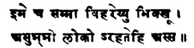
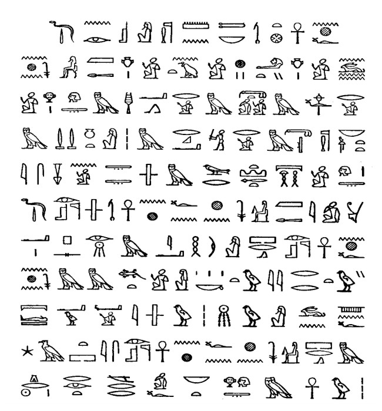

# Konx Om Pax
#### — Essays In Light —
*(1907 ev.)*

# DEDICATION AND COUNTER-DEDICATION
#### WITH A NOTE ON OBSCURITY
WHEN the Neophyte enters upon the Path of Evil, there confronteth him the great angel Samael. In vain he saith that he is come from between the pillars and seeketh the hidden Knowledge in the Name of Adonai; the angel answers him:

“I am the Prince of Darkness and of Evil. The wicked and rebellious man gazeth upon the face of Nature, and findeth therein naught but terror and obscurity; unto him it is but the darkness of the darkness, and he is but as a drunken man groping in the dark. Return! for thou canst not pass by.”

Equally, when the Neophyte enters upon the Path of Good, doth the great angel Metatron arrest him with the words: “I am the angel of the Presence divine. The wise man gazeth upon the material world, and he beholdeth therein the luminous image of the Creator. Not as yet canst thou bear the dazzling brilliance of that Light. Return! for thou canst not pass by!” These commonplaces of the bastard mysticism of mountebacks, crude and imbecile as they seem to one who has “passed by,” are curiously apt to mine intention of the moment. 
Essays in Light! I hear somebody exclaim. The man was obscure enough before, but now . . . !!! Very like. ‘Tis the first time I have written careless of lucidity. By the usual paradox, I may expect some solemn fool to assert that nothing ever was so plain, and (with a little luck) the rest of the solemn fools — brief, all England — to follow them: till Konx om Pax replace Reading without Tears in every Infant School.

Yet, suppose this were to happen, how would the world be advanced? In no wise. For the brilliance wherein we walk will be but thick darkness to all those who have no become so blind that light and darkness are akin. The light wherein I write is not the light of reason; it is not the darkness of unreason; it is the L.V.X. of that which, first mastering and then transcending the reason, illumines all the darkness caused by the interference of the opposite waves of thought; not by destroying their balance, and thereby showing a false and partial light, but by overleaping their limitations.

Let not the pedant exclaim with Newman that I avoid the Scylla of Ay and the Charybdis of Nay by the Straits of No-meaning.

A thing is not necessarity A or not-A. It may be outside the universe of discourse wherein A and not-A exist. It is absurd to say of Virtue that it is green or not-green; for Virtue has nothing to do with colour. It is one of the most suggestive definitions of KONX — the LVX of the Bretheren of the Rosy Cross — that is transcends all the possible pairs of opposites. Nor does this sound nonsensical to those who are acquainted with That LVX. But to those who do not, it must (I fear) remain as obscure and ridiculous as spherical trigonometry to the inhabitants of Flatland. 

Kant and others have remarked on the similarity of our hands and feet, and the impossibility of one replacing its fellow in ordinary 3-dimensional space. This to them suggested a space in which they can be made to coincide. 
Similarly, a constant equilibration of all imaginable opposites will suggest to us a world in which they are truly one; whence to that world itself is but the shortest step.

All our contradictories are co-ordinate curves; they are on opposite sides of the axis, but otherwise are precisely similar, just as in the case of the hands quoted above. If they were not similar, they would no longer be contradictories, but contraries. 
People who begin to think for themselves usually fall into the error of contradicting normal ideas as taught by their seniors. 
Thus, one learns that marriage is right and adultery wrong. One thinks, and finds the beauty of the latter, the sordidity of the former; perhaps ending, with a little wit, in defending marriage because the delights of adultery are impossible without it. This attitude is good enough, indeed, while one is talking to the grovellers; but what educates the clergy (since miracles still happen) is a truism to an actress.

If in the jungle two elephants fight lustily, he shall do little who champions either; rather snare both, tame both, ride both, as the charioteer of the Tarot with the opposing sphinxes, black and white.

Nor, O man, believe thou that finality is anywhere to be reached in words. I balance A and not-A (a), and finding both false, both true, transcend with B. But whatever B is, it is as false and true as b; we reach C. So from C to c, and for ever. Not, as Hegel thought, until we reach an idea in which no seed of self-contradiction lurks; for that can never be.

The thinkable is false, then? (once more!) Yea, but equally it is true.

So also the old mystics were right who saw in every phenomenon a dog-faced demon apt only to seduce the soul from the sacred mystery; right, too, they who “interpret every phenomenon as a particular dealing of God with the soul.” Yet the latter is the higher formula; the narrowing of the Magic Circle to a point is an easier task than the destruction of that circle (and all both within and without) by the inrush of a higher dimension.

Alas! but either way is the Last Step; lucky are most of us if only we can formulate some circle — any circle!

Nor avails it, O man, to transcend the reason by ignoring it. Thou must pass through the fire to Adonai-Melekh, child of earth! Thou canst not slip by on either side. Only when the Destruction of the Babel-Tower of Reason comes as an actual catastrophe of thy career canst thou escape from the ruins. Otherwise, what answer hast thou (O perfect mystic!) to whom the doctor speaks of men “self-hypnotized into cataleptic trances,” to whom the historian denies thy Christ or Mahomet, to whom the ethicist flings his snarls of “anti-social”; whom, indeed, all men, thyself the foremost, charge with insanity, with ignorance, with error?

Naught but an infinite skepsis saves thee here. Do not defend thy Christ; attack the place of thine opponent; challenge all his premisses, dispute the validity of his most deepest axioms, impugn his sanity, doubt his existence! 
On thine own formula he is but a demon dog-faces, or God.

Destroy him, or be he: that is enough; there is no more to say. 

Dear children of earth, long have you dwelt in darkness; quit the night and seek the day! Seek not to imitate the language of the wise; ‘tis easy. There is no royal road to illumination; that which I say in Light is true to the children of Light; to them of darkness is a confusion and a snare.

Knew ye what agony the nimble acuteness of mine own dialectic was to me, ye would not envy me, O dullards! For I fear ever, lest I be replacing truth of thought by mere expertness of mechanic skill. Then, seeing the thought as fear, I quench it masterly. Whence rise other evil things; the thought “Is this too mere trickery of the mind?” “Is this too cowardice?” and others by the score.

So answering one by one, and one and all, reason breaks down, and either deep sleep loosens all my limbs, and darkness falls upon my soul, or else —  
But you know what else, dear children of the Light. 
To you, Konx Om Pax — Light in Extension — is your natural home. You have written these essays by my pen; not on you need I bestow them; but —

> **To all and every person**  
> **in the whole world**  
> **who is without the Pale of the Order;**  
> **and even to Initiates**  
> **who are not in possession of the Password**  
> **for the time being;**  
> **and to all those who have resigned**  
> **demitted,**  
> **or been expelled**  
> **I dedicate**  
> **this Revelation of the Arcana**  
> **which are in the**  
> **Adytum of God-nourished Silence.**  

While, on the other hand:

> St. Paul spoke up on the Hill of Mars  
> To the empty-headed Athenians;  
> But I would rather talk to the stars  
>  
> Than to empty-headed Athenians;  
> It’s only too easy to form a cult,  
> To cry a crusade with “Deus Vult” —   
> But you won’t get much of a good result  
>  
> From empty-headed Athenians.  
> The people of London much resemble  
> Those empty-headed Athenians.  
> I could very easily make them tremble,  
>  
> Those empty-headed Athenians.  
> A pinch of Bible, a gallon of gas,  
> And I, or any otherguess ass,  
> Could bring to our mystical moonlight mass  
>  
> Those empty-headed Athenians.  
> In fine, I have precious little use  
> For empty-headed Athenians.  
> The birds I have snared shall all go loose;  
>  
> They are empty-headed Athenians.  
> I thought perhaps I might do some good;  
> But it’s ten to one if I ever should —   
> And I doubt if I would save, if I could,  
>  
> Such empty-headed Athenians.  
> So (with any luck) I shall bid farewell  
> To the empty-headed Athenians.  
> For me, they may all of them go to hell,  
>  
> For empty-headed Athenians.  
> I hate your idiot jolts and jars,  
> You monkeys grinning behind your bars —   
> I’m more at home with the winds and stars  
>  
> Than with empty-headed Athenians. 

# The Wake World
#### A Tale for Babes and Sucklings

*(WITH EXPLANATORY NOTES IN HEBREW AND LATIN FOR THE USE OF THE WISE AND PRUDENT)*

> قل هو الله أحد الله الصمد لم يلد  
> ولم يولد ولم يكن له كفوا أحد  

— QU'RAN.1

"...un cantique Allégorique, hébraïque, et mystique."

— PARNY.2

"Except ye become as little children, ye shall in no wise enter into the Kingdom of Heaven."

— ANON.3

> 333 כלהי מליו דסתימיו לאינוז דעאלז זנפקז זכלא הכי הוא .  
> 334 וער השחא הוו מתכסייז אליז מליז דדחילגא לגלאה והשתא אתגלייו .  
> 335 וגלי קמי מלנא צתיקא קדישא דהא לא לילרא וילי ודבית אבא צבידנא אלא בגיז דלא עיאול בכסופא קמי פלטרוי צגידגא  

— IDRA SUTA VIII.4

Ra-asa isalamanu para-di-zododa ol-kari-nu aäö iali-pire-gahe qui-inu enai butamonu od inoasa ni pa-ra-diala; kasaremeji ugeare kahiralanu, od zodonake lukifatanu paresa ta vavale-zodirenu tolhami. ... Irejila kahis-a da das pa-aotza busada caosago, das kahisa, od ipuranu teloahe karekareka ois-alamahe lonukaho od Vovina karebafe?

— AVÉ.5

> Owe ni Ifa ipa, Omoran ni imo— Bi a ba wipe mo— Omoran a mo— Nigbati a ko ba mo, A ni, ko se!

— African Proverb.6

> "De las cosas mas seguras, mas seguro es duvidar."

— Spanish Proverb.7

> ——— tua scienza Che vuol, la cosa è più perfetta Più senta ’l bene, e cosi la doglienza.

— DANTE.8

> AAAŌŌŌZŌRAZAZZZAIEŌZAZEEEIIIZAIEŌZŌAKHŌ EOOOYTHŌEZAOZAEZĒĒĒZZĒĒZAOZAKHŌZAĒKHEYEIT YXAALETHYKH
— This is the Name which you must speak in the interior world.

— JESUS CHRIST.9

— MAHAPARINIBBANNA SUTTA.10

> Hy is noch visch, noch vleesch: de wyste van ons allen  
> En weet niet wat hy is: hy kan oock licht ontvallen.  

— DANIEL HEINZ.11

> **Dianae sumus in fide**  
> **Puellae et pureri integri**  
> **Dianam pueri integri**  
> **Puellaeque canamus.**  

— CATULLUS.12

> 美言可以市尊，美行可以加人

— TAO TEH KING (HWAINAN’S V.L.).13

> ’Αστερες μεν ’μφι χαλαν σελανναν  
> άψ άποχρυπτοισι φαεννον είδος  
> όπποτα πληθοισα μαλιστα λαμπῃ  
> γαν έπι πασαν.  

— SAPPHO.14

> उपदेशं हि मुद्राणां यो दत्ते साम्प्रदायिकम | स एव शरी-गुरुः सवामी साक्ष्हादीश्वर एव सः ||

— HATHAYOGA PRADIPIKA.15

— STELE OF ANKH-F-N-KHONSU.16

MY name is Lola, because I am the Key of Delights, and the other children in my dream call me Lola Daydream. When I am awake, you see, I know that I am dreaming, so they must be very silly children, don’t you think? There are people in the dream too, who are quite grown up and horrid; but the really important thing is the wake-up person. There is only one, for there never could be any one like him. I call him my Fairy Prince. He rides a horse with beautiful wings like a swan, or sometimes a strange creature like a lion or a bull, with a woman’s face and breasts, and she has unfathomable eyes.

My Fairy Prince is a dark boy, very comely; I think every one must love him, and yet every one is afraid. He looks through one just as if one had no clothes on in the Garden of God, and he had made one, and one could do nothing except in the mirror of his mind. He never laughs or frowns of smiles; because, whatever he sees, he sees what is beyond as well, and so nothing ever happens. His mouth is redder than any roses you ever saw. I wake up quite when we kiss each other, and there is no dream any more. But when it is not trembling on mine, I see kisses on his lips, as if he were kissing some one that one could not see.

Now you must now that my Fairy Prince is my lover, and one day he will come for good and ride away with me and marry me. I shan’t tell you his name because it is too beautiful. It is a great secret between us. When we were engaged he gave me such a beautiful ring. It was like this. First there was his shield, which had a sun on it and some roses, all on a kind of bar; and there was a terrible number written on it. Then there was a bank of soft roses with the sun shining on it, and above there was a red rose on a golden cross, and then there was a three-cornered star, shining so bright that no-one could possibly look at it unless they had love in their eyes; and in the middle was an eye without an eyelid. That could see anything, I should think, but you see it could never go to sleep, because there wasn’t any eyelid. On the sides were written I.N.R.I. and T.A.R.O., which mean many strange and beautiful things, and terrible things too. I should think any one would be afraid to hurt any one who wore that ring. It is all cut out of an amethyst, and my Fairy Prince said:

“Whenever you want me, look into the ring and call me ever so softly by name, and kiss the ring, and worship it, and then look ever so deep down into it, and I will come to you.”

So I made up a pretty poem to say every time I woke up, for you see I am a very sleepy girl, and dream ever so much about the other children; and that is a pity, because there is only one thing I love, and that is my Fairy Prince. So this is the poem I did to worship the ring, part is in words, part is in pictures. You must pick out what the pictures mean, and then it all makes poetry.

#### THE INVOCATION OF THE RING

> ADONAI! Thou inmost △,  
> Self-glittering image of my soul,  
> Strong lover to thy Bride's desire,  
> Call me and claim me and control!  
> I pray Thee keep the holy tryst  
> Within this ring of Amethyst.  
>   
> For on mine eyes the golden ☉  
> Hath dawned; my vigil slew the night.  
> I saw the image of the One:  
> I came from darkness into L.V.X.  
> I pray Thee keep the holy tryst  
> Within this ring of Amethyst.  
>   
> I.N.R.I - me crucified,  
> Me slain, interred, arisen, inspire!  
> T.A.R.O. - me glorified,  
> Anointed, fill with frenzied △!  
> I pray Thee keep the holy tryst  
> Within this ring of Amethyst.  
>   
> I eat my flesh: I drink my blood  
> I gird my loins: I journey far:  
> For thou hast shown ◯, +  
> ע‎, 777, kamhlon,  
> I pray Thee keep the holy tryst  
> Within this ring of Amethyst.  
>   
> Prostrate I wait upon Thy will,  
> Mine Angel for this grace of union.  
> O let this sacrament distil  
> Thy conversation and communion.  
> I pray Thee keep the holy tryst  
> Within this ring of Amethyst.  

### PART I.

I have not told you anything about myself, because it doesn’t really matter; the only thing I want to tell you about is my Fairy Prince. But as I am telling you all this, I am seventeen years old, and very fair when you shut your eyes to look; but when you open them, I am really dark, with a fair skin. I have ever such heaps of hair, and big, big, round eyes, always wondering at everything. Never mind, it’s only a nuisance. I shall tell you what happened one day when I said the poem to the ring. I wasn’t really quite awake when I began, but as I said it, it got brighter and brighter, and when I came to “ring of amethyst” the fifth time (there are five verses, because my lover’s name has five V’s in it), he galloped across the beautiful green sunset, spurring the winged horse, till the blood made all the sky turn rose red.

So he caught me and set me on his horse, and I clung to his neck as we galloped into the night. Then he told me he would take me to his Palace and show me everything, and one day when we were married I should be mistress of it all. Then I wanted to be married to him at once, and then I saw it couldn’t be, because I was so sleepy and had bad dreams, and one can’t be a good wife if one is always doing that sort of thing. But he said I would be older one day, and not sleep so much, and every one slept a little, but the great thing was not to be lazy and contented with the dreams, so I mean to fight hard. 

By and by we came to a beautiful green place with the strangest house you ever saw. Round the big meadow there lay a wonderful snake, with steel gray plumes, and he had his tail in his mouth, and kept on eating and eating it, because there was nothing else for him to eat, and my Fairy Prince said he would go on like that till there was nothing left at all. Then I said it would get smaller and smaller and crush the meadow and the palace, and I think perhaps I began to cry. But my Fairy Prince said: “Don’t be such a silly!” and I wasn’t old enough to understand all that it meant, but one day I should; and all one had to do was to be as glad as glad. So he kissed me, and we got off the horse, and he took me to the door of the house, and we went in. It was frightfully dark in the passage, and I felt tied so that I couldn’t move, so I promised to myself to love him always, and he kissed me. It was dreadfully, dreadfully dark though, but he said not to be afraid, silly! And it’s getting lighter, now keep straight forward, darling! And then he kissed me again, and said: “Welcome to my Palace!”

I will tell you all about how it was built, because it is the most beautiful Palace that ever was. On the sunset side were all the baths, and the bedrooms were in front of us as we were. The baths were all of pale olive-coloured marble, and the bedrooms had lemon-coloured everything. Then there were the kitchens on the sunrise side, and they were russet, like dead leaves are in autumn in one’s dreams. The place we had come through was perfectly black everything, and only used for offices and such things. There were the most horrid things everywhere about; black beetles and cockroaches and goodness knows what; but they can’t hurt when the Fairy Prince is there. I think a little girl would be eaten though if she went in there alone.

Then he said: “Come on! This is only the Servants’ Hall, nearly everybody stays there all their lives.” And I said: “Kiss me!” So he said: “Every step you take is only possible when you say that.” We came into a dreadful dark passage again, so narrow and low, that is was like a dirty old tunnel, and yet so vast and wide that everything in the whole world was contained in it. We saw all the strange dreams and awful shapes of fear, and really I don’t know how we ever got through, except that the Prince called for some splendid strong creatures to guard us. There was an eagle that flew, and beat his wings, and tore and bit at everything that came near; and there was a lion that roared terribly, and his breath was a flame, and burnt up the things, so that there was a great cloud; and rain fell gently and purely, so that he really did the things good by fighting them.

And there was a bull that tossed them on his horns, so that they changed into butterflies; and there was a man who kept telling everyone to be quiet and not make a noise. So we came at last in the next house of the Palace. It was a great dome of violet, and in the centre the moon shone. She was a full moon, and yet she looked like a woman quite, quite young. Yet her hair was silver, and finer than spiders’ webs, and it rayed about her, like one can’t say what; it was all too beautiful. In the middle of the hall there was a black stone pillar, from the top of which sprang a fountain of pearls; and as they fell upon the flood, they changed the dark marble to the colour of blood, and it was like a green universe full of flowers, and little children playing among them. So I said: “Shall we be married in this House?” and he said: “No, this is only the House where the business is carried on. All the Palace rests upon this House; but you are called Lola because you are the Key of Delights.

Many people stay here all their lives though.” I made him kiss me, and we went on to another passage which Via c v. Dens opened out of the Servants’ Hall. This passage was all fire and flames and full of coffins. There was an Angel blowing ever so hard on a trumpet, and people getting up out of the coffins. My Fairy Prince said: “Most people never wake up for anything less.” So we went (at the same time it was; you see in dreams people can only be in one place at a time; that’s the best of being awake) through another passage, which was lighted by the Sun. Yet there were fairies dancing in a great green ring, just as if it was night. And there were two children playing by the wall, and my Fairy Prince and I played as we went; and he said:

“The difference is that we are going through. Most people play without a purpose; if you are travelling it is all right, and play makes the journey seem shorter.”

Then we came out into the Third (or Eighth, it depends which way you count them, because there are ten) House, and that was so splendid you can’t imagine. In the first place it was a bright, bright, bright orange colour, and then it had flashes of light all over it, going so fast we couldn’t see them, and then there was the sound of the sea and one could look through into the deep, and there was the ocean raging beneath one’s feet, and strong dolphins riding on it and crying aloud, “Holy! Holy! Holy!” in such an ecstasy you couldn’t think, and rolling and playing for sheer joy. It was all lighted by a tiny, weeny, shy little planet, sparkling and silvery, and now and then a wave of fiery chariots filled with eager spearmen blazed through the sky, and my Fairy Prince said:

“Isn’t it all fine?” But I knew he didn’t really mean it, so I said “Kiss me!” and he kissed me, and we went on. He said: “Good little girl, there’s many a one stays there all his life.”

I forgot to say that the whole place was just one mass of books, and people reading them till they were so silly, they didn’t know what they were doing. And there were cheats, and doctors, and thieves; I was really very glad to go away. 

There were three ways into the Seventh House, and the first was such a funny way. We walked through a pool, each on the arm of a great big Beetle, and then we found ourselves on a narrow winding path. There were nasty Jackals about, they made such a noise, and at the end I could see two towers. Then there was the queerest moon you ever saw, only a quarter full. The shadows fell so strangely, one could see the most mysterious shapes, like great bats with women’s faces, and blood dripping from their mouths, and creatures partly wolves and partly men, everything changing from one into the other. And we saw shadows like old, old, ugly women, creeping about on sticks, and all of a sudden they would fly up into the air, shrieking the funniest kind of songs, and then suddenly one would come down flop, and you saw she was really quite young and ever so lovely, and she would have nothing on, and as you looked at her she would crumble away like a biscuit.

Then there was another passage which was really too secret for anything; all I shall tell you is, there was the most beautiful Goddess that ever was, and she was washing herself in a river of dew. If you ask what she is doing she says: “I’m making thunderbolts.” It was only starlight, and yet one could see quite clearly, so don’t think I’m making a mistake. The third path is a most terrible passage; it’s all a great war, and there’s earthquakes and chariots of fire, and all the castles breaking to pieces. I was glad when we came to the Green Palace. 

It was all built of malachite and emerald, and there was the loveliest gentlest living, and I was married to my Fairly Prince there, and we had the most delicious honeymoon, and I had a beautiful baby, and then I remembered myself, but only just in time, and said: “Kiss me!” And he kissed me and said:

“My goodness! But that was a near thing that time; my little girl nearly went to sleep. Most people who reach the Seventh House stay there all their lives, I can tell you.”

It did seem such a shame to go on; there was such a flashing green star to light it, and all the air was filled with amber-coloured flames like kissed. And we could see through the floor, and there were terrible lions, like furnaces for fury, and they all roared out: “Holy! Holy! Holy!” and leaped and danced for joy. And when I saw myself in the mirrors, the dome was one mass of beautiful green mirrors, I saw how serious I looked, and that I had to go on. I hoped the Fairy Prince would look serious too, because it is most dreadful business going beyond the Seventh House; but he only looked the same as ever. But oh! how I kissed him, and how I clung to him, or I think I should never, never have had the courage to go up those dreadful passages, especially knowing what was at the end of them. And now I’m only a little girl, and I’m ever tired of writing, but I’ll tell you all about the rest another time.

> **Explicit**  
> **Capitulum Primum**  
> **vel**  
> **De Collegio Externo.**  

### PART II.

I WAS telling you how we started from the Green Palace. There are three passages that lead to the Treasure House of Gold, and all of them are very dreadful. One is called the Terror by Night, and another the Arrow by Day, and the third has a name that people are afraid to hear, so I won’t say.

But in the first we came to a mighty throne of grey granite, shaped like the sweetest pussy cat you ever saw, and set up on a desolate heath. It was midnight and the Devil came down and sat in the midst; but my Fairy Prince whispered: “Hush! it is a great secret, but his name is Yeheswah, and he is the Saviour of the World.” And that was very funny, because the girl next to me thought it was Jesus Christ, till another Fairy Prince (my Prince’s brother) whispered as he kissed her: “Hush, tell nobody ever, that is Satan, and he is the Saviour of the World.”

We were a very great company, and I can’t tell you all of the strange things we did and said, or of the song we sang as we danced face outwards in a great circle ever closing in on the Devil on the throne. But whenever I saw a toad or a bat, or some horrid insect, my Fairy Prince always whispered: “It is the Saviour of the world,” and I saw that it was so. We did all the most beautiful wicked things you can imagine, and yet all the time we knew that they were good and right, and must be done if ever we were to get to the House of Gold.

So we enjoyed ourselves very much and ate the most extraordinary supper you can think of. There were babies roasted whole and stuffed with pork sausages and olives; and some of the girls cut off chops and steaks from their own bodies, and gave them to a beautiful white cook at a silver grill, that was lighted with the gas of dead bodies and marshes; and he cooked them splendidly, and we all enjoyed it immensely. Then there was a tame goat with a gold collar, that went about laughing with every one; and he was all shaved in patches like a poodle. We kissed him and petted him, and it was lovely. You must remember that I never let go of my Fairy Prince for a single instant, or of course I should have been turned into a horrid black toad.

Then there was another passage called the Arrow by Day, and there was a most lovely lady all shining with the sun, and moon, and stars, who was lighting a great bowl of water with one hand, by dropping dew on it out of a cup, and with the other she was putting out a terrible fire with a torch. She had a red lion and a white eagle, that she had always had ever since she was a little girl. She had found them in a nasty pit full of all kinds of filth, and they were very savage; but by always treating them kindly they had grown up faithful and good. This should be a lesson to all of us never to be unkind to our pets.

My Fairy Prince was laughing all the time in the third path. There was nobody there but an old gentleman who had but his bones on outside, and was trying ever so hard to cut down the grass with a scythe. But the faster he cut it, the faster it grew. My Fairy Prince said: “Everybody that ever was has come along this path, and yet only one ever got to the end of it.” But I saw a lot of people walking straight through as if they knew it quite well; he explained, though, that they were really only one; and if you walked through that proved it. I thought that was silly, but he’s much older and wiser than I am; so I said nothing. The truth is that it is a very difficult Palace to talk about, and the further you get in, the harder it is to say what you mean because it all has to be put into dream talk, as of course the language of the wake-world is silence.

So never mind! let me go on. We came by and by to the Sixth House. I forgot to say that all those three paths were really one, because they all meant that things were different inside to outside, and so people couldn’t judge. It was fearfully interesting; but mind you don’t go in those passages without the Fairy Prince. And of course there’s the Veil. I don’t think I’d better tell you about the Veil. I’ll only put your mouth to my head, and your hand — there, that’ll tell any body who knows that I’ve really been there, and it’s all true that I’m telling you.

This Sixth House is called the Treasure House of Gold; it’s a most mysterious place as ever you were in. First there’s a tiny, tiny, tiny doorway, you must crawl through on your hands and knees; and even then I scraped ever such a lot of skin off my back; then you have to be nailed on a red board with four arms, with a great gold circle in the middle, and that hurt dreadfully. 

Then they make you swear the most solemn things you ever heard of, how you would be faithful to the Fairy Prince, and live for nothing but to know him better and better. So the nails stopped hurting, because, of course, I saw that I was really being married, and this was part of it, and I was as glad as glad; and at that moment my Fairy Prince put his hand on my head, and I tell you, honour bright, it was more wake up than ever before, even than when he used to kiss me. After that they said I could go into the Bride-chamber, but it was only the most curious room that ever was with seven sides. There was a dreadful red dragon on the floor, and all the sides were painted every colour you can think of, with curious figures and pictures. The light was not like dream light at all; it was wake light, and it came through a beautiful rose in the ceiling. In the middle was a table all covered with beautiful pictures and texts, and there were ever such strange things on it.

There was a little crucifix in the middle, all of diamonds and emeralds and rubies, and other precious stones, and there was a dagger with a golden handle, and a cup full of the most delicious wine, and there was a curious coin with the strangest writing on it, and a funny little stick that was covered with flames, like a rose tree is with roses. Beside the strange coin was a heavy iron chain, and I took it and put it round my neck because I was bound to my Fairy Prince, and I would never go about like other people till I found him again. And they took the dagger and dipped it in the cup, and stabbed me all over to show that I was not afraid to be hurt, if only I could find my Fairy Prince. Then I took the crucifix and held it up to make more light in case he was somewhere in the dark corners, but no! Yet I knew he was there somewhere, so I thought he must be in the box, for under the table was a great chest; and I was terribly sad because I felt something dreadful was going to happen. And sure enough, when I had the courage, I asked them to open the box, and the same people that made me crawl through that horrid hole, and lost my Fairy Prince and nailed be to the red board, took away the table and opened the box, and there was my Fairy Prince, quite, quite, dead. If you only knew how sorry I was!

But I had with me a walking-stick with wings, and a shining sun at the top that had been his, and I touched him on the breast to try and wake him; but it was no good. Only I seemed to hear his voice saying wonderful things, and it was quite certain he wasn’t really dead. So I put the walking-stick on his beast, and another little thing he had which I had forgotten to tell you about. It was a kind of cross with an oval handle that he had been very fond of. But I couldn’t go away without something of his, so I took a shepherd’s staff, and a little whip with blood on it, and jewels oozing from the blood, if you know what I mean, that they had put in his hands when they buried him. Then I went away, and cried, and cried, and cried. But before I had got very far they called me back; and the people who had been so stern were smiling, and I saw they had taking the coffin out of the little room with seven sides. And the coffin was quite, quite empty.

Then they began to tell us all about it, and I heard my Fairly Prince within the little room saying holy exalted things, such as the stars trace in the sky as they travel in the Car called “Millions of Years.” Then they took me into the little room, and there was my Fairy Prince standing in the middle. So I knelt down as we all kissed his beautiful feet, and the myriads of eyes like diamonds that were hidden in his feet laughed joy at us. One couldn’t life one’s head, for he was too glorious to behold; but he spoke wonderful words like dying nightingales that have sorrowed for the fading of the roses, and pressed themselves to death upon the thorns; and one’s whole body became a single eye, so that one saw as if the unborn though of light brooded over an eternal sea. Then was light as the lightning flashed out of the east, even unto the west, and it was fashioned as the 
By and by one rose up, then one seemed to be quite, quite dead, and buried in the centre of a pyramid of the most brilliant light it is possible to think of. And it was wake-light too; and everybody knows that even wake-darkness is really brighter than the dream-light. So you must just guess what it was like.

There was more than that too; I can’t possibly tell you. I know too what I.N.R.I. on the Ring meant: and I can’t tell you that either, because the dream-language has such a lot of important words missing. It’s a very silly language, I think. 
By and by I came to myself a little, and now I was really and truly married to the Fairy Prince, so I suppose we shall always be near each other now.

There was the way out of the little room with millions of changing colours, ever so beautiful, and it was lined with armed men, waving their swords for joy like flashes of lightning; and all about us glittering serpents danced and sang for joy. There was a winged horse ready for us when we came out on the slopes of the mountain. You see the Sixth House is really a mountain called Mount Abiegnus, only one doesn’t see it because one goes through indoors all the way. There’s one House you have to go outdoors to get to, because no passage has ever been made; but I’ll tell you about that afterwards; it’s the Third House. So we got on the horse and went away for our honeymoon. I shan’t tell you a single word about the honeymoon. 

> **Explicit**  
> **Capitulum Secundum**  
> **vel**  
> **De Collegio ad S.S. porta**  
> **Collegii Interni.**  

### PART III.

YOU mustn’t suppose the honeymoon is ever really over, because it just isn’t. But he said to me:

“Princess, you haven’t been all over the Palace yet. Your special House is the Third, you know, because it’s so convenient for the Second where I usually live. The King my Father lives in the First; he’s never to be seen, you know. He’s very, very old nowadays; I am practically Regent of course. You must never forget that I am really He; only one generation back is not so far, and I entirely represent his thought. Soon,” he whispered ever so softly, “you will be a mother; there will be a Fairy Prince again to run away with another pretty little Sleepy head.”

Then I saw that when Fairy Princes were really and truly married they became Fairy Kings; and that I was quite wrong ever to be ashamed of being only a little girl and afraid of spoiling his prospects, because really, you see, he could never become King and have a son a Fairy Prince without me.

But one can only do that by getting to the Third House, and it’s a dreadful journey, I do most honestly assure you. 
There are two passages, one from the Eighth House and one from the Sixth; the first is all water, and the second is almost worse, because you have to balance yourself so carefully, or you fall and hurt yourself. 

To go through the first you must be painted all over with blood up to your waist, and you cross your legs, and then they put a rope round one ankle and swing you off. I had such a pretty white petticoat on, and my Prince said I looked just like a white pyramid with a huge red cross on the top of it, which made me ever so glad, because now I knew I should be the Saviour of the World, which is what one wants to be, isn’t it? Only sometimes the world means all the other children in the dream, and sometimes the dream itself, and sometimes the wake-things one sees before one is quite, quite awake. The prince tells me that really and truly only the First House where his Father lived was really a wake-House, all the others had a little sleep-House about them, and the further you got the more awake you were, and began to know just how much was dream and how much wake.

Then there was the other passage where there was a narrow edge of green crystal, which was all you had to walk on, and there was a beautiful blue feather balancing on the edge, and if you disturbed the feather there was a lady with a sword, and she would cut off your head. So I didn’t dare hardly to breathe, and all round there were thousands and thousands of beautiful people in green who danced and danced like anything, and at the end there was the terrible door of the Fifth House, which is the Royal armoury. And when we came in the House was full of steel machinery, some red hot and some white hot, and the din was simply fearful.

So to get the noise out of my head, I took the little whip and whipped myself till all my blood poured down over everything, and I saw the whole house like a cataract of foaming blood rushing headlong from the flaming and scintillating Star of Fire that blazed and blazed in the candescent dome, and everything went red before my eyes, and a great flame like a strong wind blew through the House with a noise louder than any thunder could possibly be, so that I couldn’t hold myself hardly, and I took up the sharp knives of the machines and cut myself all over, and the noise got louder and louder, and the flame burnt through and through me, so that I was very glad when my Prince said:

“You wouldn’t think it, would you, sweetheart? But there are lots of people who stay here all their lives.”

There are three ways into the Fourth House from below. The first passage is a very curious place, all full of wheels and ever such strange creatures, like monkeys and sphinxes and jackals climbing about them and trying to get to the top. It was very silly, because there isn’t really any top to a wheel at all; the place you want to get to is the centre, if you want to be quiet. Then there was a really lovely passage, like a deep wood in Springtime, the dearest old man came along who had lived there all his life, because he was the guardian of it, and he didn’t need to travel because he belonged to the First House really from the beginning. He wore a vast cloak, and he carried a lamp and a long stick; and he said that the cloak meant you were to be silent and not say anything you saw, and the lamp meant you were to tell everybody and make them glad, and the stick was like a guide to tell you which to do.

But I didn’t quite believe that, because I am getting a grown-up girl now, and I wasn’t to be put off like that. I could see that the stick was really the measuring rod with which the whole Palace was built, and the lamp was the only light they had to build it by, and the cloak was the abyss of darkness that covers it all up. That is why dream-people never see beautiful things like I’m telling you about. All their houses are built of common red bricks, and they sit in them all day and play silly games with counters, and oh! dear me, how they do cheat and quarrel.

When any one gets a million counters, he is no glad you can’t think, and goes away and tries to change some of the counters for the things he really wants, and he can’t, so you nearly die of laughing, though of course it would be dreadfully sad if it were wake-life. But I was telling you about the ways to the Fourth House, and the third way is full of lions, and a person might be afraid; only whenever one comes to bite at you, there is a lovely lady who puts her hands in its mouth and shuts it. So we went through quite safely, and I thought of Daniel in the lions’ den.

The Fourth House is the most wonderful of all I had ever seen. It is the most heavenly blue mansion; it is built of beryl and amethyst, and lapis lazuli and turquoise and sapphire. The centre of the floor is a pool of purest aquamarine, and in it is water, only you can see every drop as a separate crystal, and the blue tinge filtering through the light. Above there hangs a calm yet mighty globe of deep sapphirine blue. Round it there were nine mirrors, and there is a noise that means when you understand it, “Joy! Joy! Joy!” There are violet flames darting through the air, each one a little sob of happy love. One began to see what the dream-world was really for at last; every time any one kissed any one for real love, that was a little throb of violet flame in this beautiful House in the Wake-World. And we bathed and swam in the pool, and were so happy you can’t think. But they said: “Little girl, you must pay for the entertainment.” [I forgot to tell you that there was music like fountains make as they rise and fall, only of course much more wonderful than that.]

So I asked what I must pay, and they said: “You are now mistress of all these houses from the Fourth to the Ninth. You have managed the Servants’ Hall well enough since your marriage; now you must manage the others, because till you do you can never go on to the Third House. So I said: “It seems to me that they are all in perfectly good order.” But they took me up in the air, and then I saw that the outsides were horribly disfigured with great advertisements, and every singly House had written all over it:

FIRST HOUSE
This is his Majesty’s favourite Residence.
No other genuine. Beware of worthless imitations.
Come in HERE and spend life!
Come in HERE and see the Serpent eat his Tail!

So I was furious, as you may imagine, and had men go and put all the proper numbers on them, and a little sarcastic remark to make them ashamed; so they read:

Fifth House, and mostly dream at that. 
Seventh House. External splendour and internal corruption and so on. And on each one I put “No thoroughfare from here to the First House. The only way is out of doors. By order.”

This was frightfully annoying, because in the old days we could walk about inside everywhere, and not get wet if it rained, but nowadays there isn’t any way from the Fourth to the Third House. You could go of course by chariot from the Fifth to the Third, or through the House where the twins live from the Sixth to the Third, but that isn’t allowed unless you have been to the Fourth House too, and go from there at the same time. 

It was here they told me what T.A.R.O. on the ring meant. First it means gate, and that is the name of my Fairy Prince, when you spell it in full letter by letter.

There are seventy-eight parts to it, which makes a perfect plan of the whole Palace, so you can always find your way, if you remember to say T.A.R.O. Then you remember I.N.R.I. was on the ring too. I.N.R.I. is short for L.V.X., which means the brilliance of the wide-wide-wake Light, and that too is the name of my Fairy Prince only spelt short.

The Romans said it had sixty-five parts, which is five times thirteen, and seventy-eight is six times thirteen. To get into the Wake World you must know your thirteen times table quite well. So if you take them both together that makes eleven times thirteen, and then you say “Abrahadabra,” which is a most mysterious word, because it has eleven letters in it. You remember the Houses are numbered both ways, so that the Third House is called the Eighth House too, and the Fifth the Sixth, and so on. But you can’t tell what lovely things that means till you’ve been through them all, and got to the very end.

So when you look at the ring and see I.N.R.I. and T.A.R.O. on it that means that it is like a policeman keeping on saying “Pass along, please!” I would have liked to stay in the Fourth House all my life, but I began to see it was just a little dream House too; and I couldn’t rest, because my own House was the very next one. But it’s too awful to tell you how to get there. You want the most fearful lot of courage, and there’s nobody to help you, nobody at all, and there’s no proper passage. But it’s frightfully exciting, and you must wait till next time before I tell you how I started on that horrible journey and if I ever got there or not.

> **Explicit**  
> **Capitulum Tertium**  
> **vel**  
> **de Collegio Interno**  

### PART IV.

Now I shall tell you about the chariot race in the first passage. The chariot is all carved out of pure, clear amber, so that electric sparks fly about as the furs rub it. The whole cushions and rugs are all beautiful soft ermine fur. There is a canopy of bright blue with stars (like the sky in the dream world), and the chariot is drawn by two sphinxes, one black and one white. The charioteer is a most curious person; he is a great big crab in the most lovely glittering armour, and he can just drive! His name in the mysterious name I told you about with eleven letters in it, but be call him Jehu for short, because he’s only nineteen years old. It’s important to know though because this journey is the most difficult of all, and without the chariot one couldn’t ever do it, because it is so far — much further than the heaven is from the earth in the dream world. 

The passage where the twins live is very difficult too. They are too sisters; and one is very pure and good, and they other is a horrid fast woman. But that just shows you how silly dream language is — really there is another way to put it: you can say they are two sisters, and one is very silly and ignorant, and the other has learnt to know and enjoy.

Now when one is a Princess it is very important to have good manners, so you have to go into the passage, and take one on each arm, and go through with them singing and dancing; and if you hurt the feelings of either of them the least little bit in the world it would show you were not really a great lady, only a dress lady, and there is a man with a bow and arrow in the air, and he would soon finish you, and you would never get to the Third House at all.

But the real serious difficulty is the outdoors. You have to leave the House of Love, as they call the Fourth House. You are quite, quite naked: you must take off your husband-clothes, and your baby-clothes, and all your pleasure clothes, and your skin, and your flesh, and your bones, every one of them must come right off. And then you must take off your feelings clothes; and then your idea clothes; and then what we call your tendency clothes which you have always worn, and which make you what you are. After that you take off your consciousness clothes, which you have always thought were your very own self, and you leap out into the cold abyss, and you can’t think how lonely it is. There isn’t any light, or any path, or anything to catch hold of to help you, and there is no Fairy Prince any more; you can’t even here his voice calling to you to come on. There’s nothing to tell you which way to go, and you feel the most horrible sensation of falling away from everything that ever was. You’ve got no nothing at all; you don’t even know how awful it is. You would turn back if you could only stop falling; but luckily you can’t. So you fall and fall faster and faster; and I can’t tell you any more.

The Third House is called the House of Sorrow. They gave me new clothes of the queerest kind, because one never thinks of them as one’s own clothes, but only as clothes. It is a House of utmost Darkness. There is a pool of black solemn water in the shining obsidian, and one is like a vast veiled figure of wonderful beauty brooding over the sea; and by and by the Pains come upon one. I can’t tell you anything about the Pains. Only they are different from any other pains, because they start from inside you, from a deeper, truer kind of you than you ever knew. By and by you see a tremendous blaze of a new sun in the Sixth House, and you are as glad as glad as glad; and there are millions of trumpets blown, and voices crying: “Hail to the Fairy Prince!” meaning the new one that you have had for your baby; and at that moment you find you are living in the first Three Houses all at once, for you feel the delight of your own dear Prince and his love; and the old King stirs in his Silence in the First House, and thousands of millions of blessings shoot out like rays of light, and everything is all harmony and beauty below, and crowned about with the crown of twelve stars, which is the only way you can put it into dream talk. 

Now you don’t need to struggle to go on any more, because you know already that all the House is one Palace, and you move about in your own wake world, just as is necessary. All the paths up to the Second House open — the path of the Hierophant with the flaming star and the incense in the vast cathedral, and the path of the Mighty Ruler, who governs everything with his orb and his crown and his sceptre. There is the path of the Queen of Love Via d v. Porta. which is more beautiful than anything, and along it my own dear lover passes to my bridal chamber. Then there are the three ways to the Holy House of the Old King, the way by which he is joined with the new Fairy Prince, where Via g v. Camelus dwells a moonlike virgin with an open book, and always, always reads beautiful words therein, smiling mysteriously through her shining veil, woven of sweet thoughts and pure kisses.

And there is the way by which I always go to the King, my Father, and that passage is built of thunder and lightning; but Via b v. Domus there is a holy Magician called Hermes, who takes me through so quickly that I arrive sometimes even at the very moment that I start. Last of all is the most mysterious passage of them all, and if any of you saw it you would think there Via a v. Bos was a foolish man in it being bitten by crocodiles and dogs, and carrying a sack with nothing any use in it at all. But really it is the man who meant to wake up, and did wake up. So that it is his House, he is the old King himself, and so are you. So he wouldn’t care what any one thought he was. Really all the passages to the first Three Houses are very useful; all the dream-world and the half-dream world, and the Wake-world are governed from these passages.

I began to see now how very unreal even the Wake-world is, because there is just a little dream in it, and the right world is Wide-Wide-Wide-Wake-World. My lover calls me little Lola Wide-awake, not Lola Daydream any more. But it is always Lola, because I am the Key of Delights. I never told you about the first two houses, and really you wouldn’t understand. But the Second House is gray, because the light and dark flash by so quick it’s all Domus II v. blended into one; and in it lives my lover, and that’s all I care about. Sapienta The First House is so brilliant that you can’t think; and there, too, is my Domus I v. lover and I when we are one. You wouldn’t understand that either. And the Corona Summa last thing I shall say is that one begins to see that there isn’t really quite a Wide-Wide-Wide-Wake-World till the Serpent outside has finished eating up his tail, and I don’t really and truly understand that myself. But it doesn’t matter; what you must do is first to find the Fairy Prince to come and ride away with you, so don’t bother about the Serpent yet. That’s all.

> **Explicit Opusculum**  
> **in**  
> **Capitulo Quarto**  
> **vel**  
> **de Collegio Summo.**  

# Ali Sloper

