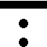
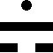
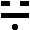
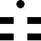
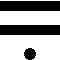
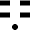
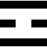
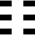
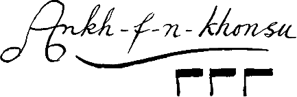

# Commentaries to Liber AL vel Legis &mdash; The Book of the Law

This manuscript is a complete collection of commentaries to » Liber AL vel Legis « yet assembled. It is bound with love under will by Frater Zephyros (in 1998 ev.) and intended for serious students of Thelemic thought. Please note that the comments – both Old and New – by the Master Therion are in plain type. {Bracketed WEH NOTES are by Bill Heidrick}. Comments by Marcelo Motta are in (italics and only in these sections). First comments are from the » Djeridensis Comment «. Those comments in italics in the Djeridensis Comment are Crowley's. Other comments (I.1-I.20) are from Crowley's 1923 Tunisia diaries.

In the first edition this Book is called L. L is the sacred letter in the Holy Twelve-fold Table which forms the triangle that stabilizes the Universe. See “Liber 418”. L is the letter of Libra, Balance, and 'Justice' in the Taro. This title should probably be “AL”, “El”, as the 'L' was heard of the Voice of Aiwaz, not seen. “AL” is the true name of the Book, for these letters, and their number 31, form the Master Key to its Mysteries.

In order that the ethical and philosophical comment should be “understanded of the common people”, without interruption, I have decided to transfer to an Appendix {WEH NOTE: The Appendix has not yet been recovered.} all considerations drawn from the numerical system of cipher which is interspersed with the more straightforward matter of this Book. In that Appendix will be found an account of the character of this cipher, called “Qabalah”, and the mysteries thus indicated; because of the impracticability of communicating them in verbal form, and of the necessity of proving to the student that the Author of the Book is possessed of knowledge beyond any yet acquired by man.

&mdash; Aleister Crowley

(With regard to the above note by A.C., serious students should consult Liber V vel Reguli. the Ritual of the Mark of the Beast, for a more thorough analysis of the Word AL.)
 
# THE BOOK OF THE LAW
#### LIBER AL VEL LEGIS
##### sub figurâ CCXX

as delivered by (LXXVIII) XCIII unto DCLXVI
with a commentary by THE BEAST, TO MEGA THERION 666

## CHAPTER I

### I.1.

*Had! The manifestation of Nuit.*

#### The Djeridensis Comment

Nuit defined.

Nuit is all that may be, and is shewn by means of any one that is.

#### Tunisia Diaries

The possibilities of existence can only be manifested through the experience of individuals.

#### The Old Comment

Compare II.1, the complement of this verse. In Nu is Had concealed; by Had is Nu manifested. Nu being 56 and Had 9, their conjunction results in 65, Adonai, the Holy Guardian Angel. Also Hoor, who combines the force of the Sun with that of Mars. Adonai is primarily Solar, but 65 is a number sacred to Mars.

See the “Sepher Sephiroth”, and “The Wake World” in “Konx Om Pax” for further details on 65.

Note moreover, the sixty-five pages of the MS. of Liber Legis.

Or, counting NV 56, Had 10, we get 66, which is (1-11). Had is further the centre of the Key-Word ABRAHADABRA.

#### The New Comment

The theogony of our Law is entirely scientific, Nuit is Matter, Hadit is Motion, in their full physical sense. «The Proton and the Electron, in a metaphysical sense, suggest close analogies.» They are the Tao and Teh of Chinese Philosophy; or, to put it very simply, the Noun and Verb in grammar. Our central Truth – beyond other philosophies – is that these two infinities cannot exist apart. This extensive subject must be studied in our other writings, notably “Berashith”, my own Magical Diaries, especially those of 1919, 1920 and 1921, and “Liber AlephThe Book of Wisdom or Folly”. See also “The Soldier and the Hunchback”. Further information concerning Nuit and Hadit is given in the course of this Book; but I must here mention that the Brother mentioned in connection with the “Wizard Amalantrah” etc. (Samuel bar Aiwaz) identifies them with ANU and ADAD the supreme Mother and Father deities of the Sumerians. Taken in connexion with the AIWAZ identification, this is very striking indeed.

(This last sentence was added because A.C. was convinced that Aiwass was the Being worshipped under this name by the ancient Sumerians.)

It is also to be considered that Nu is connected with North, while Had is Sad, Set, Satan, Sat (equals “Being” in Sanskrit), South. He is then the Sun, one point concentring Space, as also is any other star. The word ABRAHADABRA is from Abrasax, Father Sun, which adds to 365. For the North-South antithesis see Fabre d'Olivet's “Hermeneutic Interpretation of the Origin of the Social State in Man”. Note “Sax” also as a Rock, or Stone, whence the symbol of the Cubical Stone, the Mountain Abiegnus, and so forth. Nu is also reflected in Naus, Ship, etc., and that whole symbolism of Hollow Space which is familiar to all. There is also a question of identifying Nu with On, Noah, Oannes, Jonah, John, Dianus, Diana, and so on. But these identifications are all partial only, different facets of the Diamond Truth. We may neglect all these questions, and remain in the simplicity of this Her own Book.

### I.2.

*The unveiling of the company of heaven.*

#### The Djeridensis Comment

Pantheism of AL.

The Book of the Law shows forth all things as God.

#### Tunisia Diaries

This book reveals the divine nature of each individual consciousness.

#### The Old Comment

This book is a new revelation, or unveiling of the holy ones.

#### The New Comment

This explains the general theme of this revelation: gives the Dramatis Personae, so to speak.

It is cosmographically, the conception of the two Ultimate Ideas; Space, and That which occupies Space.

It will however appear later that these two ideas may be resolved into one, that of Matter; with Space, its 'Condition' or 'form', included therein. This leaves the idea of 'Motion' for Hadit, whose interplay with Nuit makes the Universe.

Time should perhaps be considered as a particular kind or dimension of Space. « In “Berashith” all qualities soever are considered as so many dimensions. I see no reason, 19 years later, for receding from this view. »

Further, this verse is to be taken with the next. The 'company of heaven' is Mankind, and its 'unveiling' is the assertion of the independent godhead of every man and every woman!

Further, as Khabs (see verse 8) is “Star”, there is a further meaning; this Book is to reveal the Secret Self of a man, i.e. to initiate him.

(Or of a woman, and initiate her. As to the meaning of the verses, there are at least four Great Meanings, one for each of the Four Ordeals mentioned the Chapter Three, vv. 64-67. Besides these, there are subsidiary meanings which depend on the Grade of the Commentator, or the Grade of the Reader. This is one of the reasons why this matter of commentaries is so difficult, and why any commentary must not be taken too seriously. The Four Great Meanings, of course, are beyond any danger of being confused, since they are experienced in Trance, and independent of Reason. They cannot be communicated through the intellect. Even the most accurate attempt to do so misleads.)

### I.3.

*Every man and every woman is a star.*

#### The Djeridensis Comment

(3-4.) Virtues of the Soul.

All things are able to know all; all are alike in this, at the end of all.

#### Tunisia Diaries

Every man & every woman is a divine unit, sovereign, imperishable, unique, necessary.

#### The Old Comment

This should not be understood in the spiritualistic sense. It means that in each person is the sublime starry nature, a consciousness to be attained by the prescribed methods.

[Yet it may mean some real connection between a given person and a given star. Why not? Still, this is not in my knowledge. See: Liber 418.]

#### The New Comment

This thesis is fully treated in “Liber AlephThe Book of Wisdom or Folly”. Its main statement is that each human being is an Element of the Cosmos, self-determined and supreme, co-equal with all other Gods.

From this the Law “Do what thou wilt” follows logically. One star influences another by attraction, of course; but these are incidents of self-predestined orbits. There is, however, a mystery of the planets, revolving about a star of whom they are parts; but I shall not discuss it fully in this place.

Man is the Middle Kingdom. The Great Kingdom is Heaven, with each star as an unit; the Little Kingdom is the Molecule, with each Electron as an unit. (The Ratio of these three is regularly geometrical, each being 10 to the 22 times greater in size than its neighbour.)

See “The Book of the Great Auk” for the demonstration that each 'star' is the Centre of the Universe to itself, and that a 'star' simple, original, absolute, can add to its omnipotence, omniscience and omnipresence without ceasing to be itself; that its one way to do this is to gain experience, and that therefore it enters into combinations in which its true Nature is for awhile disguised, even from itself. Analogously, an atom of carbon may pass through myriad Proteus-phases, appearing in Chalk, Chloroform, Sugar, Sap, Brain and Blood, not recognizable as “itself” the black amorphous solid, but recoverable as such, unchanged by its adventures.

This theory is the only one which explains “why” the Absolute limited itself, and why It does not recognize Itself during its cycle of incarnations. It disposes of “Evil” and the Origin of Evil; without denying Reality to “Evil”, or insulting our daily observation and our common sense.

I here quote (with one or two elucidatory insertions) the original note originally made by Me on this subject.

May 14, 1919, 6.30 p.m.

All elements must at one time have been separate – that would be the case with great heat. Now when atoms get to the sun, when we get to the sun, we get that immense, extreme heat, and all the elements are themselves again. Imagine that each atom of each element possesses the memory of all his adventures in combination. By the way, that atom, fortified with that memory, would not be the same atom; yet it is, because it has gained nothing from anywhere except this memory. Therefore, by the lapse of time and by virtue of memory, a thing (although originally an Infinite Perfection) could become something more than itself; and thus a real development is possible. One can then see a reason for any element deciding to go through this series of incarnations (god, that was a magnificent conception!) because so, and only so, can he go; and he suffers the lapse of memory of His own Reality of Perfection which he has during these incarnations, because he knows he will come through unchanged.

Therefore you have an infinite number of gods, individual and equal though diverse, each one supreme and utterly indestructible. This is also the only explanation of how a being could create a world in which war, evil, “etc”. exist. Evil is only an appearance because, like “good”, it cannot affect the substance itself, but only multiply its combinations. This is something the same as mystic monism, but the objection to that theory is that God has to create things which are all parts of himself, so that their interplay is false. If we presuppose many elements, their interplay is natural. It is no objection to this theory to ask who made the elements – the elements are at least there; and God, when you look for him, is not there. Theism is “obscurum per obscurius”. A male star is built up from the centre outwards, a female star from the circumference inwards. This is what is meant when we say that woman has no soul. It explains fully the difference between the sexes.

{WEH NOTE: Although Crowley evidently felt that this characterization was true simply, it should be noted that this comment is not CLASS A. The idea of center outwards and circumference inwards may actually have described the impression received by a male of the Victorian age in regard to men and women. Certainly every male mystic has the state here described as “circumference inward”, “…no soul” and “female” at the time of reception — vide Liber LXV. Equally, every woman who acts positively from awareness of her identity would qualify for “center outwards”, “soul” and “male” in this sense. What Crowley identified as sex-linked may better be considered as modality linked, with the sexual linkage as much an accident of culture as anything else.}

### I.4.

*Every number is infinite; there is no difference.*

#### The Djeridensis Comment

(3-4.) Virtues of the Soul.

All things are able to know all; all are alike in this, at the end of all.

#### Tunisia Diaries

Each individual possesses limitless possibilities. The total in each case is consequently the same.

#### The Old Comment

The limited is a mere mask; the illimitable is the only truth.

#### The New Comment

This is a great and holy mystery. Although each star has its own number, each number is equal and supreme. Every man and every woman is not only a part of God, but the Ultimate God. “The Centre is everywhere and the circumference nowhere”. The old definition of God takes new meaning for us. Each one of us is the One God. This can only be understood by the initiate; one must acquire certain high states of consciousness to appreciate it.

I have tried to put it simply in the note to the last verse. I may add that in the Trance called by me the “Star-Sponge” – see note to v. 59 – this apprehension of the Universe is seen as an astral Vision. It began as “Nothingness with Sparkles” in 1916 E.V. by Lake Pasquaney in New Hampshire, U.S.A. and developed into fullness on various subsequent occasions. Each 'Star' is connected directly with every other star, and the Space being Without Limit (Ain Soph) the Body of Nuith, any one star is as much the Centre as any other. Each man instinctively feels that he is the Centre of the Cosmos, and philosophers have jeered at his presumption. But it was he that was precisely right. The yokel is no more 'petty' than the King, nor the earth than the Sun. Each simple elemental Self is supreme, Very God of Very God. Ay, in this Book is Truth almost insufferably splendid, for Man has veiled himself too long from his own glory: he fears the abyss, the ageless Absolute. But Truth shall make him free!

(The reader will assimilate this more easily, on the intellectual plane, by considering the Theory of Relativity. From the point of view of Initiation, the difference between a Magister Templi and a „Black Brother‟ is that the Magister knows that He is the Center of the Universe for himself, but understands that the same is simultaneously true of any other human being. The „Black Brother‟ knows that he is the center of the universe, but does not understand that the same is true of toers. Of all others. What is more, he does not want to understand. He interprets any manifestation of autonomy as an attempt against his authority. The reader must not think that a „Black Brother‟ is necessarily a mean person. On the contrary, his intentions are usually of the best. He wants your happiness. But since his definition of your happiness is based on what he thinks you should be happy with, he may cause you much harm by trying to help you. A Magister, as a rule, will not try to help you at all. The Magister is selfish. He minds His own business, and no other.

Frederick Pohl and C.M. Kornbluth had a very amusing tale of a man who approached two „Black Brethren‟ and challenged them. “What does he say?” the second „Black Brother‟, who was somewhat hard of hearing, asked the first. “He says we are not God,” the first explained. At once, the second snapped: “Atheist!” The utter lack of sense of humor is a characteristic of „Black Brotherhood‟. A Magister might have said the same thing — but with a twinkle.

There are certain analogies between “Black Brotherhood‟ and paranoia, but while paranoia is a mental disorder, „Black Brotherhood‟ is of Daath, and much more dangerous. Religious persecutions, throughout history, were always the result of a man reaching the threshold of the Abyss through the discipline of a particular faith, and then fearing to jump. His disease would then affect, telepathically and magically, those of his faith, with results such as Holy Inquisitions, Crusades, and others.)

It must be understood from the beginning that this book contains the keys of all the knowledge necessary for the operation of the Magical Formulae of the world during the Aeon which it initiates. In this very early verse is already given a Master Key to mathematics and metaphysics. On applying this to current problems of thought, it will be discovered that the long-fast doors fly open at a touch.

Let use briefly examine the implications of this statement. It should not occasion surprise to find that the Book of the Law not only anticipates the conclusion of the greatest modern mathematicians like Poincare, but goes beyond them. It was necessary that this should be the case, so that the book might be, beyond question, the expression of a mind possessed of superior powers to any incarnated mind soever.

It may clarify the subject if we venture to paraphrase the text. The first statement “Every number is infinite” is, on the face of it, a contradiction in terms. But that is only because of the accepted idea of a number as not being a thing in itself but merely a term in series homogeneous in character. All orthodox mathematical argument is based on definitions involving this conception. For example, it is fundamental to admit the identity of 2 plus 1 with 1 plus 2. The Book of the Law presents an altogether different conception of the nature of number.

Mathematical ideas involve what is called a continuum, which is, superficially at least, of a different character to the physical continuum. For instance, in the physical continuum, the eye can distinguish between the lengths of one-inch stick and a two-inch stick, but not between these which measure respectively one thousand miles and one thousand miles and on inch, though the difference in each case is equally an inch. The inch difference is either perceptible or not perceptible, according to the conditions. Similarly, the eye can distinguish either the one-inch or the two-inch stick from one of an inch and a half. But we cannot continue this process indefinitely – we can always reach a point where the extremes are distinguishable from each other but their mean from neither of the extremes. Thus, in the physical continuum, if we have three terms, A, B, and C, A appears equal to B, and B to C, yet C appears greater than A. Our reason tells us that this conclusion is an absurdity, that we have been deceived by the grossness of our perceptions. It is useless for us to invent instruments which increase the accuracy of our observations, for though they enable us to distinguish between the three terms of our series, and to restore the theoretical Hierarchy, we can always continue the process of division until we arrive at another series: A', B', C', where A' and C' are distinguishable from each other, but where neither is distinguishable from B'.

On the above grounds, modern thinkers have endeavoured to create a distinction between the mathematical and the physical continuum, yet it should surely be obvious that the defect in our organs of sense, which is responsible for the difficulty, shows that our method of observation debars us from appreciating the true nature of things by this method of observation.

However, in the case of the mathematical continuum, its character is such that we can continue indefinitely the process of division between any two mathematical expressions so-ever, without interfering in any way with the regularity of the process, or creating a condition in which two terms become indistinguishable from each other. The mathematical continuum, moreover, is not merely a question of series of integral numbers, but of other types of numbers, which, like integers, express relations between existing ideas, yet are not measurable in terms of that series. Such numbers are themselves parts of a continuum of their own, which interpenetrates the series of integers without touching it, at least necessarily.

For example: the tangents of angles made by the separation of two lines from coincidence to perpendicularity, increases constantly from zero to infinity. But almost the only integral value is found at the angle of 45 degrees where it is unity.

It may be said that there is an infinite number of such series, each possessing the same property of infinite divisibility. The ninety tangents of angles differing by one degree between zero and ninety may be multiplied sixty fold by taking the minute instead of the degree as the co-efficient of the progression, and these again sixty fold by introducing the second to divide the minute. So on ad infinitum.

All these considerations depend upon the assumption that every number is no more than a statement of relation. The new conception, indicated by the Book of the Law, is of course in no way contradictory of the orthodox view; but it adds to it in the most practically important manner. A statistician computing the birth-rate of the eighteenth century makes no special mention of the birth of Napoleon. This does not invalidate his results; but it demonstrates how exceedingly limited is their scope even with regard to their own object, for the birth of Napoleon had more influence on the death-rate than another other phenomenon included in his calculations.

A short digression is necessary. There may be some who are still unaware of the fact, but the mathematical and physical sciences are in no sense concerned with absolute truth, but only with the relations between observed phenomena and the observer. The statement that the acceleration of falling bodies is thirty-two feet per second, is only the roughest of approximation at the best. In the first place, it applies to earth. As most people know, in the Moon the rate is only one-sixth as great. But, even on earth, it differs in a marked manner between the poles and the equator, and not only so, but it is affected by so small a matter as the neighborhood of a mountain.

It is similarly inaccurate to speak of “repeating” an experiment. The exact conditions never recur. One cannot boil water twice over. The water is not the same, and the observer is not the same. When a man says that he is sitting still, he forgets that he is whirling through space with vertiginous rapidity.

It is possibly such considerations that led earlier thinkers to admit that there was no expectation of finding truth in anything but mathematics, and they rashly supposed that the apparent ineluctability of her laws constitutes a guarantee of their coherence with truth. But mathematics is entirely a matter of convention, no less so than the rules of Chess or Baccarat. When we say that “two straight lines cannot enclose a space”, we mean no more than we are unable to think of them as doing so. The truth of the statement depends, consequently, on that of the hypothesis that our minds bear witness to truth. Yet the insane man may be unable to think that he is not the victim of mysterious persecution. We find that no reason for believing him. It is useless to reply that mathematical truths receive universal consent, because they do not. It is a matter of elaborate and tedious training to persuade even the few people when we teach of the truth of the simplest theorems in Geometry. There are very few people living who are convinced – or even aware – of the more recondite results of analysis. It is no reply to this criticism to say that all men can be convinced if they are sufficiently trained, for who is to guarantee that such training does not warp the mind?

But when we have brushed away these preliminary objections, we find that the nature of the statement itself is not, and cannot be, more than a statement of correspondences between our ideas. In the example chosen, we have five ideas; those of duality, of straightness, of a line, of enclosing, and of space. None of these are more than ideas. Each one is meaningless until it is defined as corresponding in a certain manner to certain other ideas. We cannot define any word soever, except by identifying it with two or more equally undefined words. To define it by a single word would evidently constitute a tautology.

We are thus forced to the conclusion that all investigation may be stigmatized as obscurum per obscurium. Logically, our position is even worse. We define A as BC, where B is DE, and C is FG. Not only does the process increase the number of our unknown quantities in Geometrical progression at every step, but we must ultimately arrive at a point where the definition of Z involves the term A. Not only is all argument confined within a vicious circle, but so is the definition of the terms on which any argument must be based.

It might be supposed that the above chain of reasoning made all conclusions impossible. But this is only true when we investigate the ultimate validity of our propositions. We can rely on water boiling at 100 degrees Centigrade,^[In revising this comment, I note with amusement that it had escaped me that 100 degrees C. is by definition the temperature at which water boils! I have seen it boil at about 84 degrees C. on the Baltoro Glacier, and determined my height above sea-level by observing the boiling point so often that I had quite forgotten the original conditions of Celsius.] although, for mathematical accuracy, water never boils twice running at precisely the same temperature, and although, logically, the term water is an incomprehensible mystery.

To return to our so-called axiom; Two straight lines cannot enclose a space. It has been one of the most important discoveries of modern mathematics, that this statement, even if we assume the definition of the various terms employed, is strictly relative, not absolute; and that common sense is impotent to confirm it as in the case of the boiling water. For Bolyai, Lobatschewsky, and Riemann have shown conclusively that a consistent system of geometry can be erected on any arbitrary axiom soever. If one chooses to assume that the sum of the interior angles of a triangle is either greater than or less than two right angles, instead of equal to them, we can construct two new systems of Geometry, each perfectly consistent with itself, and we possess no means soever of deciding which of the three represents truth.

I may illustrate this point by a simple analogy. We are accustomed to assert that we go from France to China, a form of expression which assumes that those countries are stationary, while we are mobile. But the fact might be equally well expressed by saying that France left us and China came to us. In either case there is no implication of absolute motion, for the course of the earth through space is not taken into account. We implicitly refer to a standard of repose which, in point of fact, we know not to exist. When I say that the chair in which I am sitting has remained stationary for the last hour, I mean only “stationary in respect to myself and my house”. In reality, the earth's rotation has carried it over one thousand miles, and the earth's course some seventy thousand miles, from its previous position. All that we can expect of any statement is that it should be coherent with regard to a series of assumption which we know perfectly well to be false and arbitrary.

It is commonly imagined, by those who have not examined the nature of the evidence, that our experience furnishes a criterion by which we may determine which of the possible symbolic representations of Nature is the true one. They suppose that Euclidian Geometry is in conformity with Nature because the actual measurements of the interior angles of a triangle tell us that their sum is in fact equal to two right angles, just as Euclid tells us that theoretical considerations declare to be the case. They forget that the instruments which we use for our measurements are themselves conceived of as in conformity with the principles of Euclidian Geometry. In other words, them measure ten yards with a piece of wood about which they really known nothing but that its length is one-tenth of the ten yards in question.

The fallacy should be obvious. The most ordinary reflection should make it clear that our results depend upon all sorts of condition. If we inquire, “What is the length of the thread of quicksilver in a thermometer?”, we can only reply that it depends on the temperature of the instrument. In fact, we judge temperature by the difference of the coefficients of expansion due to heat of the two substances, glass and mercury.

Again, the divisions of the scale of the thermometer depend upon the temperature of boiling water, which is not a fixed thing. It depends on the pressure of the earth's atmosphere, which varies (according to time and place) to the extent of over twenty per cent. Most people who talk of “scientific accuracy” are quite ignorant of elementary facts of this kind.

It will be said, however, that having defined a yard as the length of a certain bar deposited in the Mint in London, under given conditions of temperature and pressure, we are at least in a position to measure the length of other objects by comparison, directly or indirectly, with that standard. In a rough and ready way, that is more or less the case. But if it should occur that the length of things in general were halved or doubled, we could not possibly be aware of the other so-called laws of Nature. We have no means so-ever of determining even so simple a matter as to whether one of two events happens before or after the other.

Let us take an instance. It is well known that the light of the sun requires some eight minutes to reach the earth. Simultaneous^[Simultaneity, closely considered, possesses no meaning soever. See A.A.Eddington, “Space, Time and Gravitation”, 61.] ^[WEH NOTE: SIC. This is page 51 in Eddington, op. cit. 1920 edition, 1959 reprint: “The denial of absolute simultaneity is a natural complement to the denial of absolute motion …”] phenomena in the two bodies would therefore appear to be separated in time to that extent; and, from a mathematical standpoint, the same discrepancy theoretically exists, even if we suppose the two bodies in question to be only a few yards one more remote than the other. Recent consideration of these facts has show the impossibility of determining the fact of priority, so that it may be just as reasonable to assert that a dagger-thrust is caused by a wound as vice versa. Lewis Carroll has an amusing parable to this effect in “Through the Looking-Glass”, which work, by the way, with its predecessor, is packed with examples of philosophical paradox. ^[If I strike a billiard ball, and it moves, both my will and its motion have causes long antecedent to the act. I may consider both my Work and its reaction as twin effects of the eternal Universe. The moved arm and ball are part of a state of the Cosmos which resulted necessarily from its momentarily previous state, and so, back for ever. Thus, my Magical Work is only on of the cause-effects necessarily concomitant with the cause-effects which set the ball in motion. I may therefore regard the act of striking as a cause-effect of my original Will to move the ball, though necessarily previous to its motion. But the case of Magical work is not quite analogous. For I am such that I am compelled to perform Magick in order to make my Will to prevail; so that the cause of my doing the Work is also he cause of the ball's motion, and there is no reason why one should precede the other, See Book 4, Part III, for a full discussion. (Since writing the above, I have been introduced to “Space, Time and Gravitation”, where similar arguments are adduced.)]

We may now return to our text “Every number is infinite”. The fact that every number is a term in a mathematical continuum is no more an adequate definition than if we were to describe a picture as Number So-and-So in the catalogue. Every number is a thing in itself,^[I regret to find myself in disagreement with the Hon. Bertrand Russell with regard to the conception of the nature of Number.] possessing an infinite number of properties peculiar to itself.

Let us consider, for a moment, the numbers 8 and 9. 8 is the number of cubes measuring one inch each way in a cube which measures two inches each way; while 9 is the number of squares measuring one inch each way in a square measuring three inches each way. There is a sort of reciprocal correspondence between them in this respect.

By adding one to eight, we obtain nine, so that we might define unity as that which has the property of transforming a three-dimensional expansion of two into a two-dimensional expansion of three. But if we add unity to nine, unity appears as that which has the power of transforming the two-dimensional expansion of three aforesaid into a mere oblong measuring 5 by 2. Unity thus appears as in possession of two totally different properties. Are we then to conclude that it is not the same unity? How are we to describe unity, how know it? Only by experiment can we discover the nature of its action on any given number. In certain minor respects, this action exhibits regularity. We know, for example, that it uniformly transforms an odd number into an even one, and vice versa, but that is practically the limit of what we can predict as to its action.

We can go further, and state that any number soever possesses this infinite variety of powers to transform any other number, even by the primitive process of addition. We observe also how the manipulation of any two numbers can be arranged so that the result is incommensurable with either, or even so that ideas are created of a character totally incompatible with our original conception of numbers as a series of positive integers. We obtain unreal and irrational expressions, ideas of a wholly different order, by a very simple juxtaposition of such apparently comprehensible and commonplace entities as integers.

There is only one conclusion to be drawn from these various considerations. It is that the nature of every number is a thing peculiar to itself, a thing inscrutable and infinite, a thing inexpressible, even if we could understand it.

In other words, a number is a soul, in the proper sense of the term, an unique and necessary element in the totality of existence.

We may not turn to the second phrase of the text: “there is no difference”. It must strike the student immediately that this is, on the face of it, a point blank contradiction of all that has been said above. What have we done but insist upon the essential difference between any tow numbers, and show that even their sequential relation is little more than arbitrary, being indeed rather a convenient way of regarding them for the purpose of coordinating them with out understanding than anything else? On a similar principle, we number public vehicles or telephones without implication even of necessary sequence. The appellation denotes nothing beyond membership of a certain class of objects, and is indeed expressly chosen to avoid being entangled in considerations of any characteristics of the individual so designated except that cursory designation.

when it is said that there is no difference between numbers (for in this sense I think we must understand the phrase), we must examine the meaning of the word 'difference'. Difference is the denial of identity in the first place, but the word is not properly applied to discriminate between objects which have no similarity. One does not ask, “What is the difference between a yard and a minute?” in practical life. We do ask the difference between two things of the same kind. The Book of the Law is trying to emphasize the doctrine that each number is unique and absolute. Its relations with other numbers are therefore in the nature of illusion. They are the forms of presentation under which we perceive their semblances; and it is to the last degree important to realize that these semblances only indicate the nature of the realities behind them in the same way in which the degrees on a thermoetric scale indicate heat. It is quite unphilosophical to say that 50 degrees Centigrade is hotter than 40 degrees. Degrees of temperature are simply conventions invented by ourselves to describe physical states of a totally different order; and, while the heat of a body may be regarded as an inherent property of its own, our measure of that heat in no way concerns it.

We use instruments of science to inform us of the nature of the various objects which we wish to study; but our observations never reveal the thing as it is in itself. They only enable us to compare unfamiliar with familiar experiences. The use of an instrument necessarily implies the imposition of alien conventions. To take the simplest example: when we say that we see a thing, we only mean that our consciousness is modified by its existence according to a particular arrangement of lenses and other optical instruments, which exist in our eyes and not in the object perceived. So also, the fact that the sum of 2 and 1 is three, affords us but a single statement of relations symptomatic of the presentation to us of those numbers.

We have, therefore, no means soever of determining the difference between any two numbers, except in respect of a particular and very limited relation. Furthermore, in view of the infinity of every number, it seems not unlikely that the apparent differences observed by us would tend to disappear with the disappearance of the arbitrary conditions which we attach to them to facilitate, as we think, our examination. We may also observe that each number, being absolute, is the centre of its universe, so that all other numbers, so far as they are related to it, are its appanages. Each number is, therefore, the totality of the universe, and there cannot be any difference between one infinite universe and another. The triangle ABC may look very different from the standpoints of A, B, and C respectively; each view is true, absolutely; yet it is the same triangle.

The above interpretation of the text is of a revolutionary character, from the point of view of science and mathematics. Investigation of the lines here laid down will lead to the solution of these grave problems which have so long baffled the greatest minds of the world, on account of the initial error of attaching them on lines which involve self-contradiction. The attempt to discover the nature of things by a study of the relations between them is precisely parallel with the ambition to obtain a finite value of Pi. Nobody wishes to deny the practical value of the limited investigations which have so long preoccupied the human mind. But it is only quite recently that even the best thinkers have begun to recognize that their work was only significant within a certain order. It will soon be admitted on all hands that the study of the nature of things in themselves is a work for which the human reason is incompetent; for the nature of reason is such that it must always formulate itself in proportions which merely assert a positive or negative relation between a subject and a predicate. Men will thus be led to the development of a faculty, superior to reason, whose apprehension is independent of the hieroglyphic representations of which reason so vainly makes use.^[See “Eleusis”, from Aleister Crowley's Collected Works, Vol. III, Epilogue.] {This then will} be the foundation of the true spiritual science which is the proper tendency of the evolution of man. This Science will clarify, without superseding, the old; but it will free men from the bondage of mind, little by little, just as the old science has freed them from the bondage of matter.

This science is the proper and particular study of initiates, and its principia are formulated in the Book of the Law. This Book may therefore be regarded as indicating a complete revolution in human affairs, for it advances mankind in the most radical manner. The road of attainment to self-realisation is made open as never before has been done in the history of the planet.

### I.5.

*Help me, o warrior lord of Thebes, in my unveiling before the Children of men!*

#### The Djeridensis Comment

Mission of Aleister Crowley, the Beast 666.

I The Beast, the Man Aleister Crowley whose number is 666, help to show forth this truth to men.

#### Tunisia Diaries

The work of The Beast is to show mankind what possibilities are open to them.

#### The Old Comment

Nu, to unveil herself, needs a mortal intermediary, in the first instance.

It is to be supposed that Ankh-f-n-khonsu, the warrior lord of Thebes, priest of Men Tu, is in some subtle manner identical with either Aiwass or the Beast.

#### The New Comment

Here Nuit appeals, simply and directly, recognizing the separate function of each Star of her Body. Though all is One, each part of that One has its own special work, each Star its particular Orbit.

In addressing me as warrior lord of Thebes, it appears as if She perceived a certain continuity or identity of myself with Ankh-f-n-khonsu, whose Stele is the Link with Antiquity of this Revelation. See Equinox I, VII, pp. 363-400a, for the account of this event.

The unveiling is the Proclamation of the Truth previously explained, that the Body of Nuith occupies Infinite Space, so that every Star thereof is Whole in itself, an independent and absolute Unit. They differ as Carbon and Calcium differ, but each is a simple “immortal” Substance, or at least a form of some simpler Substance. Each soul is thus absolute, and 'good' or 'evil' are merely terms descriptive of relations between destructible combinations. Thus Quinine is 'good' for a malarial patient, but 'evil' for the germ of the disease. Heat is 'bad' for ice-cream and 'good' for coffee. The indivisible essence of things, their 'souls', are indifferent to all conditions soever, for none can in any way affect them.

(Although this last sentence is grammatically wrong, we left it as written proof of how hard it is to discuss certain Truths on the plane of the intellect. Aleister Crowley was a Master of the English Language; yet, in trying to express something that transcends Reason, he committed an error of syntax that any modern secretary would avoid!

The problem was that he was caught in the quandary that the “indivisible essence” is simultaneously One and Many! Hence the „error‟.

Lay readers should understand that when A.C. writes “here Nuit appeals” what he actually means is “Here Aiwass, speaking as Nuit, appeals,” etc. Aiwass, being an Ipsissimus, can of course speak in name of Infinite Space.

The fact that Children is with C capital indicates a hidden technical meaning in the verse. Those Children are rather gig Children! They are Giants, Titans, Gargantuas or Pantagruels of legend — in short, they are Babes of the Abyss. This si the “Grade”, or rather, the “Going” in which the Veil is Rent and the mind receives the first impact of the Infinite. In this sense, therefore, Nuit is appealing to 666 to become the Hierophant of the Greater Mysteries — that is to say, the Magus of the Aeon, the Initiator of the Masters of the Temple. Obviously, He must be in Chokhmah.)

### I.6.

*Be thou Hadit, my secret centre, my heart & my tongue!*

#### The Djeridensis Comment

666 as Artist.

I am the Point of View (as of the artist) from which Nuit may be seen by all; for I am Her inmost thought, her sense, and her Voice.

#### Tunisia Diaries

In order to achieve this, The Beast, stripped of his human personality, becomes, feels & speaks in the character of the impersonal individual essence, which is common to all individuals alike.

#### The Old Comment

The recipient of this knowledge is to identify himself with Hadit, and thus fully express the thoughts of her heart in her very language.

#### The New Comment

Nuit formulates me as Hadit, especially in the three centres of consciousness of her Being. IN this way, for this purpose, I became the complement of Her.

These centres are those of Love, Life and language. Duality is the condition of all three. It will appear later how it is that None and Two are identical; they are distinct in our minds only because those minds are conscious, and therefore think of “two” as their own state. But the unconscious mind thinks Nothing, and is Nothing. Yet it is the same mind.

Nuith selects three centres of Her Body to become “Two” with Hadit; for she asks me to declare Her in these three. Infinite freedom, all-embracing, for physical Love; boundless continuity for Life; and the silent rhythm of the Stars for Language. These three conceptions are Her gift to us.

(Aleister Crowley is being „chosen‟, and the choice is specifically declared: He is to be Hadit, that is, simultaneously Kether (the centre), Chokhmah (the tongue) and Binah (the ancient Egyptians believed that the heart was the seat of intelligence).

In short, in order to do the job for which he was chosen — Nuit's Helpmeet — he must reach the highest Initiations possible to man. Which, of course, he did.)

### I.7.

*Behold! it is revealed by Aiwass the minister of Hoor-paar-kraat.*

#### The Djeridensis Comment

Mine H.G.A. Aiwass: HisNature and Office, AL his Word.

Mine Angel sayeth Her song into mine ear. He is Aiwass, who is the Word of the Law as also its mode of action. He serveth Silence through his speech, which stilleth evil sounds, not known nor fused into one tune.

#### Tunisia Diaries

The essential truth necessary at the present period of history is revealed by Aiwass, the H.G.A. of The Beast, whose name expresses equally the ideas of the Law itself & of the Formula of the Aeon. He is called the minister of the God of Silence, as if to assert that his message is not a disturbance of spiritual equilibrium but the means of correcting an existing error.

#### The Old Comment

Aiwass — see Introduction. He is 78, Mezla the “influence” from the Highest Crown, and the number of cards in the Tarot, Rota, the all- embracing Wheel.

Hoor-paar-Kraat. See II. 8.

Aiwass is called the minister of Hoor-paar-Kraat, the God of Silence; for his word is the Speech in the Silence.

#### The New Comment

Aiwass is the name given by Ouarda the Seer as that of the Intelligence Communicating. See note to Title.

Hoor-paar-Kraat or Harpocrates, the “Babe in the Egg of Blue”, is not merely the God of Silence in a conventional sense. He represents the Higher Self, the Holy Guardian Angel. The connexion is with the symbolism of the Dwarf in Mythology. He contains everything in Himself, but is unmanifested. See II:8.

He is the First Letter of the Alphabet, Aleph, whose number is One, and his card in the Tarot is The Fool, numbered Zero. Aleph is attributed to the “Element” (in the old classification of things) of Air.

Now as “One” or Aleph he represents the Male Principle, the First Cause, and the free breath of Life, the sound of the vowel A being made with the open throat and mouth.

As Zero he represents the female Principle, the fertile Mother. (An old name for the card is Mat, from the Italian 'Matto', fool, but earlier also from Maut, the Egyptian Vulture-Mother-Goddess). Fertile, for the 'Egg of Blue' is the Uterus, and in the Macrocosm the Body of Nuith, and it contains the Unborn Babe, helpless yet protected and nourished against the crocodiles and tigers shown on the card, just as the womb is sealed during gestation. He sits on a lotus, the yoni, which floats on the 'Nile', the amniotic fluid.

In his absolute innocence and ignorance he is “The Fool”; he is the 'Saviour', being the Son who shall trample on the crocodiles and tigers, and avenge his father Osiris. Thus we see him as the “Great Fool” of Celtic legend, the “Pure Fool” of Act I of “Parsifal”, and, generally speaking, the insane person whose words have always been taken for oracles.

But to be 'Saviour' he must be born and grow to manhood; thus Parsifal acquires the Sacred Lance, emblem of virility. He usually wears the 'Coat of many colours' like Joseph the 'dreamer'; so he is also now the Green Man of spring festivals. But his 'folly' is now not innocence but inspiration of wine; he drinks from the Graal, offered to him by the Priestess.

So we see him fully armed as Bacchus Diphues, male and female in one, bearing the Thyrsus-rod, and a cluster of grapes or a wineskin, while a tiger leaps up by his side. This form is suggested in the Taro card, where 'The fool' is shown with a long wand and carrying a sack; his coat is motley. Tigers and Crocodiles follow him, thus linking this image with that of Harpocrates.

Almost identical symbols are those of the secret God of the Templars, the bi-sexual Baphomet, and of Zeus Arrhenothelus, equally bi-sexual, the Father-Mother of All in One Person. (He is shown in this full form in the Tarot Trump XV, “the Devil”.) Now Zeus being lord of Air, we are reminded that Aleph is the letter of Air.

As Air we find the “Wandering Fool” pure wanton Breath, yet creative. Wind was supposed of old to impregnate the Vulture, which therefore was chosen to symbolize the Mother-Goddess.

He is the Wandering Knight or Prince of Fairy Tales who marries the King's Daughter. This legend is derived from certain customs among exogamic tribes, for which see “The Golden Bough”.

Thus one Europa, Semele and others claimed that Zeus – Air«Zeus obtained Air for his kingdom in the partition with Hades, who took Fire, and Poseidon, who took Water. Shu is the Egyptian God of the Firmament. There is a great difficulty here, etymologically. Zeus is connected with IAO, Abrasax, and the Dental Sibilant Gods of the Great Mysteries, with the South and Hadit, Ada, Set, Saturn, Adonai, Attis, Adonis; he is even the “Jesus”, slain with the Lance, whose blood is collected in a Cup. Yet he is also to be identified with the opposite party of the North and Nuit, with the “John” slain with the Sword, whose flesh is placed upon a Disk, in the Lesser Mysteries, baptizing with Water as “Jesus” with Fire, with On, Oannes, Noah, and the like.

It seems as if this great division, which has wrought such appalling havoc upon the Earth, were originally no more than a distinction adopted for convenience. It is indeed the task of this Book to reduce Theology to the interplay of the Dyad Nuith and Hadith, these being themselves conceived as complementary, as Two equivalent to Naught, “divided for lvoe's sake, for the chance of union.”» – had enjoyed them in the form of a beast, bird, or what not; while later Mary attributed her condition to the agency of a Spirit – Spiritus, breath, or air – in the shape of a dove.

(Simple-minded readers must not think for one moment that A.C. is here “admitting the historical existence of the Virgin Mary”; on the contrary, he is obviously putting her on the same footing with Europa, Semele and others. The Virgin Birth, like the Dying God, is a much older myth than Christianity; and the Virgin was usually seeded by a God under the form of a Beast. Far form being original, Christian Theology is a pot-pourri of stolen goods.)

But the “Small Person” of Hindu mysticism, the Dwarf insane yet crafty of many legends in many lands, is also this same “Holy Ghost”, or Silent Self of a man, or his Holy Guardian Angel.

He is almost the “Unconscious” of Freud, unknown, unaccountable, the silent Spirit, blowing “whither it listeth, but thou canst not tell whence it cometh or whither it goeth”. It commands with absolute authority when it appears at all, despite conscious reason and judgment.

Aiwass is then, as this verse 7 states, the “minister” of this Hoor-paar-Kraat, that is of the Saviour of the World in the larger sense, and of mine own “Silent Self” in the lesser. A “minister” is one who performs a service, in this case evidently that of revealing; He was the intelligible medium between the Babe God – the New Aeon about to be born – and myself. This Book of the Law is the Voice of his Mother, His Father, and Himself. But on His appearing, He assumes the active form twin to Harpocrates, that of Ra-Hoor-Khuit. The Concealed Child becomes the Conquering Child, the armed Horus avenging his father Osiris. So also our own Silent Self, helpless and witless, hidden within us, will spring forth, if we have craft to loose him to the Light, spring lustily forward with his cry of Battle, the Word of our True Wills.

This is the Task of the Adept, to have the Knowledge and Conversation of His Holy Guardian Angel, to become aware of his nature (the Adept's) and his purpose (the Adept's), fulfilling them.

(The Knowledge and Conversation of the Holy Guardian Angel produces this result. It is not “the Angel's nature‟ or “the Angel's purpose” that are to be done by the Adept! For instance, Aiwass was the Holy Guardian Angel of A.C.; but Aiwass goes on doing His job, that of being minister of Hoor-paar-kraat, while A.C. — now 666 — does His. Suum cuique.)

Why is Aiwass thus spelt, when Aiwaz is the natural transliteration of OIVZ ? {WEH NOTE: This word is not certain.} Perhaps because he was not content with identifying Himself with Thelema, Agape, etc. by the number 93, but wished to express his nature by six letters (Six being the number of the Sun, the God-Man, etc.) whose value in Greek should be A=1, I=10, F=6, A=1, S=200, S=200: total 418, the number of Abrahadabra, the Magical Formula of the new Aeon! Note that I and V are the letters of the Father and the Son, also of the Virgin and the Bull, (See “Liber 418”) protected on either side by the letter of AIR, and followed by the letter of Fire twice over.

### I.8.

*The Khabs is in the Khu, not the Khu in the Khabs.*

#### The Djeridensis Comment

Nature of Mankind.

The essence of a Man and Woman – each being a Star or sovereign God poised in Space by its own act – is clothed in thoughts and deeds as is its Nature, hidden by them.

This essence is all-worthy; adore it, and the light of all that may be shall be shed upon you.

#### Tunisia Diaries

The manifested qualities of any individual are expressions of his essence but his nature cannot be discovered by investigating them.

#### The Old Comment

Khabs is the secret Light or L.V.X.; the Khu is the magical entity of a man.

I find later (Sun in Virgo, An VII.) that Khabs means star. In which case “cf. v.” 3.

The doctrine here taught is that the Light is innermost, essential man. Intra (not Extra)

Nobis Regnum Dei.

#### The New Comment

We are not to regard ourselves as base beings, without whose sphere is Light or “God”. Our minds and bodies are veils of the Light within. The uninitiate is a “Dark Star”, and the Great Work for him is to make his veils transparent by 'purifying' them. This 'purification' is really 'simplification'; it is not that the veil is dirty, but that the complexity of its folds makes it opaque. The Great Work therefore consists principally in the solution of complexes. Everything in itself is perfect, but when things are muddled, they become 'evil'. (This will be understood better in the Light of “The Hermit of Esopus Island”, q.v.) The Doctrine is evidently of supreme importance, from its position as the first 'revelation' of Aiwass.

This 'star' or 'Inmost Light' is the original, individual, eternal essence. The Khu is the magical garment which it weaves for itself, a 'form' for its Being Beyond Form, by use of which it can gain experience through self-consciousness, as explained in the note to verses 2 and 3. This Khu is the first veil, far subtler than mind or body, and truer; for its symbolic shape depends on the nature of its Star.

Why are we told that the Khabs is in the Khu, not the Khu in the Khabs? Did we then suppose the converse? I think that we are warned against the idea of a Pleroma, a flame of which we are Sparks, and to which we return when we 'attain'. That would indeed be to make the whole curse of separate existence ridiculous, a senseless and inexcusable folly. It would throw us back on the dilemma of Manichaeism. The idea of incarnations “perfecting” a thing originally perfect by definition is imbecile. The only sane solution is as given previously, to suppose that the Perfect enjoys experience of (apparent) Imperfection. (There are deeper resolutions of this problem appropriate to the highest grades of initiation; but the above should suffice the average intelligence.)

(When A.C. says, above, “Did we then suppose the converse?” he is speaking with his tongue in his cheek. He knows perfectly well that all religions, without one single solitasry exception, suppose the converse. He, himself, had once supposed the converse.

This central mystery reveald by Aiwass was the darkest secret of most Initiatic Schools. All religions start as Methods of Theurgy; as Method degenerates into Routine, Blind Faith becomes more virtuous than Experience, and Dogma is born. Then God is put on a pedestal, where He, or She, or It, is less uncomfortably present when you indulge your basest appetites such as Preaching and Saving Souls.

The formidable nature of the Book of the Law becomes apparent when we see that this “Dark Mystery” is the first and simplest of its revelations. No wonder organized religions everywhere fought it! No wonder “Initiatic Orders” which had only this “Awful Truth” — “Osiris is a Black God” — to mask their financial and political maneuvers clamored that Aleister Crowley was a very wicked man.)

### I.9.

*Worship then the Khabs, and behold my light shed over you!*

#### The Djeridensis Comment

Nature of Mankind.

The essence of a Man and Woman – each being a Star or sovereign God poised in Space by its own act – is clothed in thoughts and deeds as is its Nature, hidden by them.

This essence is all-worthy; adore it, and the light of all that may be shall be shed upon you.

#### Tunisia Diaries

Mankind should therefore seek the inmost truth behind the phenomenal manifestation thereof. Finding this, he will become aware of the totality of possibilities, instead of imagining as hitherto, that his actual characteristics suffice to express his nature completely.

#### The Old Comment

That Khabs is declared to be the light of Nu. It being worshipped in the centre, the light also fills the circumference, so that all is light.

#### The New Comment

We are to pay attention to this Inmost Light; then comes the answering Light of Infinite Space. Note that the Light of Space is what men call Darkness; its nature is utterly incomprehensible to our uninitiated minds. It is the 'veils' mentioned previously in this comment that obstruct the relation between Nuit and Hadit.

We are not to worship the Khu, to fall in love with our Magical Image. To do this – we have all done it – is to forget our Truth. If we adore Form, it becomes opaque to Being, and may soon prove false to itself. The Khu in each of us includes the Cosmos as he knows it. To me, even another Khabs is only part of my Khu. Our own Khabs is our one sole Truth.

### I.10.

*Let my servants be few & secret: they shall rule the many & the known.*

#### The Djeridensis Comment

Masters of Mankind defined.

Those who adore and love all things alike, for that they are of Truth, are yet but few, and are not known of men. Yet being free of fear and lust their power controls the many [originally “multitude”]^[originally "multitude" (note by 31-666-31 (Leah Hirsig), the original typist,).] whose souls are subject to limit, the limit of knowledge, which is always two, and can be counted.

#### Tunisia Diaries

Few individuals, & those beyond the understanding of mankind are fitted to work to complete the scheme of nature which contemplates the realisation in actual experience of all the possibilities of every individual. Such persons commanding types of experience exceeding the normal are able to direct the actions of the majority whose scope is universally understood.

#### The Old Comment

This is the rule of Thelema, that its adepts shall be invisible rulers.

This, it may be remarked, has always been the case.

#### The New Comment

The nature of magical power is quite incomprehensible to the vulgar. The prophet Ezekiel besieging a tile in order to destroy Jerusalem, and the adventure of Hosea with Gomer, seem as absurd to the 'practical' man as do the researches of any other scientific man until the Sunday Newspapers have furnished him with a plausible explanation which explains nothing. (Book 4, Part III, must be read in this connexion.)

“My servants”; not those of the Lord of the Aeon. “The Law is for all”; there can be no secrecy about that. The verse refers to specially chosen 'servants'; perhaps those who, worshipping the Khabs, have beheld Her light shed over them. Such persons indeed consummate the marriage of Nuit and Hadit in themselves; in that case they are aware of certain Ways to Power.

There is also a mystical sense in this verse. We are to organize our minds thoroughly, appointing few and secret chiefs, serving Nuit, to discipline the varied departments of the conscious thought.

### I.11.

*These are fools that men adore; both their Gods & their men are fools.*

#### The Djeridensis Comment

The Secret of Government.

Men adore Naught, although they deem Naught God and Man; thus the Pure Fool rules them, and saves them from base knowledge which is false.

#### Tunisia Diaries

The ordinary man constructs & worships an ideal which he calls God or hero according in the image of the phantasm of his vanities.

#### The Old Comment

“The many and the known,” both among Gods and men, are revered; this is folly.

#### The New Comment

It is a fact of meditation that everything which becomes manifest is instantly recognized as unreal. All perfect unveiling solves, wholly or in part, the equation “Something equals 0/0.” (See comment on verse 28.) Adeptship is little more than ability to perceive this 0/0 phase of “Something” in respect of larger and larger “Somethings”.

A verse with so sacred a number as 11 is likely to mean very deep things. Probably much concerning the function of The Fool is concealed in it.

It has been shewn in a previous note that the principal Gods, and men, that men have adored, are in one way or another represented in the Tarot card “The Fool”. The statement in the text is, superficially, either a platitude or a petulance; neither sounds like the tone of Nuit. A third alternative? Can we have “phrased” it carelessly, or punctuated it incorrectly? Or is there a Qabalistic puzzle or a mystic submeaning concealed? The subject changes instantly, as it seems. I prefer to suggest that these “fools” are “Silent selves”, impotent babes unborn; then verse 12 continues “Come forth!”, that is, bring your Holy Guardian Angel from the womb of your subconsciousness. Then, “take your fill of love”; that is, do your True Will, whose mode of fulfilment is love, as explained later in this chapter.

(This verse establishes uncompromisingly that all Gods — G capital, that is to say, „true Gods‟ — and all men deified by legend or deceit — that is to say, „false gods‟ — are fools. How come? It is a key. Distinction is clearly made between the two types: one are Gods; the other is men. The key is that both types are adored, which, as verses 7-9 established, is wrong. Wrong for Aspirants, of course.

The „Gods‟ are fools — that is, they reached the Plane of Consciousness of the Fool of the Tarot. The „men‟ are also fools — the common, abundant variety.

Technically, an Initiate can be called a God only after crossing the Abyss. However, Masters of the Temple do not becomae known, therefore can not be adored. It is Those of the Grade following, the Magi, who become known. It is the Curse of Their Grade the They must speak Truth — so that the Falsehood contained in the Truth may enslave the souls of men. See Liber I vel Magi. Their Sphere of Consciousness, Chokhmah, receives the Influx from the Crown through the Path of Aleph, The Fool.

The „men‟, in order to become adored, must be sufficiently powerful, magically speaking , to impress the consciousness of a sufficient num,ber of weaker fools. No hard task for a Magician, but one that only a “Black Brother” would undertake. Now, although both cases result in enslavement, there is a difference in motivation and in effect. The Magus must speak, though He like it not: the „Black Brother‟ ought to shut up (in order to become a Magister Templi), but he will not. The Magus fulfills the Law; the „Black Brother‟ rebels against it. The enslavement produced the Magus is in harmony with the Racial True Will; it is the kind of „bondage‟ that leads to freedom‟ (See Liber AlephLiber Aleph, Chapters 36-39). The enslavement produced by the „Black Brother‟ should ever become sufficiently powerful to „supersede‟ the Magus of the Aeon in which he lives (which fortunately is absurd, although they are always trying), mankind ight very well go the way of the dinosaur and other extinct species. Which is not about to happen, by any means. We are at War, certainly, and under atomic threat, certainly. Better this than the Stagnation that certain well-intentioned fools would call „Peace‟!

From the point of view of the Aspirant, what is the fundamental difference between the formula of the fools and that of the Gods? The Gods crossed the Abyss; they are Perfect. See verse 45: “The Perfect the Perfect are one Perfect and not two; nay, are none!” That is, they are the “Fool of God” — Zero.

With a true God you achieve Samadhi, Union; with a false god, „one of the “fools”, a „Black Brother‟, you are enticed or ordered or coerced to pactuate. There is no Union involved, no Spiritual Experience. The pact functions only on the emotional and intellectual levels, and you give with out receiving, since the „Black Brother‟ is, deep down, afraid of you. He — or she — will cheat you, and play with you, and brag to you bout it — and yet, all the time, you will sense his or her fear. With a God, fear is all on your side. With a „Black Brother‟, their fear is mutual — and usually his — or hers — is much bigger than yours, since he — or she — knows much better than you do what it is that he or she fears. Therefore, it is written: “all fools despise!” A true God needs no adoration, and will not be affected by your scorn. A „Black Brother‟ will shrivel without one, and foam when faced with the other. (Exceptions to this rule pertain neither to the Grade for which this commentary is being written, nor to this verse. See Chapter Two, verse 79. See, also, Liber CLXXV.)

Aspirants must be on guard, constantly, because the „Black Brethren‟ imitate the Magi, and may be mistaken for them by sloppy thinkers. Because of the confusion of their vehicles, and their spiritual pride, on reaching Samadhi with a spiritual current the „Black brethren‟ think that they are the re-incarnation of the Magus who originated that particular current. They set out to do another man‟s job, instead of discovering their own Will, and doing it. As a result, all their words “are skew-wise”. But the unwary may spend centuries following a false master — as the Roman Church, for instance, has proved.)

### I.12.

*Come forth, o children, under the stars, & take your fill of love!*

#### The Djeridensis Comment

The Nature of an Act: its virtue.

All acts are in truth acts of Love. Fulfil all Loves that may be, to the full. Be this in Light, before all Stars, that all may see and rejoice.

#### Tunisia Diaries

I exhort men to cease to hide themselves in the refuges which they have constructed in themselves from fear of facing reality. I bid them take cognisance of the existence of their fellow individuals to realise the infinite possibilities of experience open to them & to satisfy their sense that they are incomplete by uniting themselves with all other beings.

#### The Old Comment

The Key of the worship of Nu. The uniting of consciousness with infinite space by the exercise of love, pastoral or pagan love. But “vide infra.”

#### The New Comment

The whole doctrine of 'love' is discussed in the Book “Liber AlephAleph (Wisdom or Folly)” and should be studied therein. But note further how this Verse agrees with the comment above, how every Star is to come forth from its veils, that it may revel with the whole World of Stars. This is again also a call to unite or 'love', thus formulating the Equation 1 (-1) = 0 « The Hon. Bertrand Russell might prefer to write this: 1 (-1) = 0. For Initiates of the IXth degree of O.T.O. it could be expressed: Phi K - T = 0, where Phi - K = 0, and Phi and K are both positive integers. » , which is the general magical formula in our Cosmos.

“Come forth” – from what are you hiding? “under the stars”, that is, openly. Also, let love be 'under' or 'unto' the Body of Nuith. But above all, be open! What is this shame? Is Love Hideous, that men should cover him with lies? Is Love so sacred that others must not intrude? Nay, 'under the stars', at night, what eye but theirs may see? Or, if one see, should not your worship wake the cloisters of his soul to echo sanctity for that so lovely a deed and gracious you have done?

(The above paragraph will sound a little naïve to most readers born after the Forties. You must not forget that the Commentaries were written in the Twenties. At that time, if a pair of lovers were merely to embrace and kiss a ta street corner, this would be a cause for scandal.

Nor should you think that Crowley is necessarily advising you to copulate at midnight in the middle of Main Street. If you do, in most communities you are likely to interrupt or disturb traffic, thereby interfering with the will of others. Certain Operations are possible, at least at present, only „under laboratory conditions‟. But to make love under a starry sky on a grassy lawn in a public park is not only possible but, at least in this writer's experience, delicious.

To watch others „doing it‟, of course, is not as much fun, but it can be enormously instructive if the others have better technique than you do. If you can swallow your pride and fear and watch attentively, you may become a finer man — or woman — by it.

There is, of course, a technical sense in this verse, which varies according to the Grade of the reader. For instance, the numeration of „love‟ is 111, which is Aleph, The Fool, and which is also a number of Binah, since its sum is 3. And „fill‟ is 76, which sums 13, which is Unity, among other things (ACHD), but also Death int he Tarot. And so forth. Such sub-meanings may mislead, and their perusal or pursuit is better left „to the right Ingenium of the Practicus‟ — if to investigate them be his Will.)

### I.13.

*I am above you and in you. My ecstasy is in yours. My joy is to see your joy.*

#### The Djeridensis Comment

Nuit expressed in an Eidolon.

Nuit is formed into an Image of a Woman, that She may be the symbol of all ways of going in Love.

Her relation to Mankind.

She is our Goal and our own heart‘s essence of Will.

Her Mother-Joy as Nature.

She is Nature, who is glad of the birth of all that cometh forth.

#### Tunisia Diaries

A man's possibilities are the heights to which he should climb. They are inherent in his own nature. Possibility fulfils itself whenever any individual makes it actual. The effect of any such act is to create the ineffable joy which accompanies the satisfaction of the ache resulting from the sense of imperfection.

#### The Old Comment

This doctrine implies some mystic bond which I imagine is only to be understood by experience; this human ecstasy and that divine ecstasy interact.

A similar doctrine is to be found in the Bhagavad Gita.

#### The New Comment

Note that Space is omnipresent. « Perhaps I should have defined the word “Space”. The task is far from easy. Space (including Time) is one of the conditions necessary to the illusion of duality. But when Nuith says “I am Infinite Space and the Infinite Stars thereof” (verse 22) there must be some other meaning. May I define it as “totality of the possibilities of giving Form to Being”, and thus equivalent to “Matter”, which manifests “Motion”? This at least suits the verse under present discussion; for the Feminine Idea is to take delight in enabling the Masculine Idea to express itself by its means. There should be no difficulty for the student of modern mathematical philosophy in conceiving Matter and Space as identical. He may find it less easy to assent to a personification capable of speech. But I shall not resent the interpretation of Her speech as being the rhetorical device of AIWAZ. Devotion to Her, Knowledge of Her, may perfectly well be understood as the process of extending the human consciousness to apprehend the supra-rational idea thus presented. It was obviously necessary, from a practical point of view, to phrase this Book in terms of common parlance, concealing the more recondite Arcana in in the numerical and literal cipher. When, then, I say “Space is omnipresent”, it is almost the equivalent of “Anything is always liable to happen.” » The cause of 'sorrow' is the 'imaginary' solutions of continuity in this substance. Ecstasy is produced by the resolution of these illusions. Observe well that to beings in a state of strain or sorrow the “Great Work” is bound to appear in the guise of a relief or joy. But this is not to assert Samadhi, that unity with the universe which brings relief and joy by “love”, as an “absolute good”. It is only good relatively to our present condition as beings divided by Illusion from Nuit. When one returns to the 'simple' state, one soon begins to think out a new route through the Universe, and devise new combinations in the Great Game called Seeing Life.

In Nature few elements are lone wolves. Most of them are being thrown in and out of combination constantly; on suns this occurs with lordly vehemence.

Note that Nuith, although She is Infinite Space, speaks as an individual might do, often enough. This is not that She is 'talking down to our level'; it is a fact. In the Cosmos almost any aggregation can think and act as an Ego. For instance, the cells of our bodies are each units, diverse in composition and character, living each a life of its own. Yet we think and act for them, and say “I”. The stars are the cells of Her Body. Each one of us is such a cell; not less itself but more because of its secret function in Her.

It should be evident that Nuith obtains the satisfaction of Her Nature when the parts of Her Body fulfil their own Nature. The sacrament of live is not only so from the point of view of the celebrants, but from that of the divinity invoked.

It is said that for every step one takes towards one's Holy Guardian Angel, He takes two towards his client.

What do I mean by “beings divided by Illusion from Nuith”, in the first paragraph? This, that we are limited mentally, that we realize only an infinitesimal fraction of the possible forms of expression. We can hardly even imagine ourselves as living on another planet, or in the Sun; much less as apprehending the Universe by means of a totally different set of senses. Yet most of us who are not mere placental amnoites possess an instinct which persistently regrets our incapacities. It is bad enough to be dependent on scientific instruments for our knowledge of all but the grossest of the wonders and splendours of the Universe; but worse that we are aware of an infinite variety of order of phenomena, such as electricity, magnetism, chemical action, and a host of others, which we can explore only by indirect means, interpret only by obviously inadequate symbols, and understand only in terms of arbitrary relations with our animal-sense-perceptions. We know theoretically that every object must react to every other object; and it is evident that each type of reaction may be as overwhelmingly interesting as those which happen to affect us. What unimaginable rapture to be able to observe magnetic fields or molecular movements as directly as we do the Ocean and the Ant-heap! It is the task of the Initiate to adapt himself to the Totality of Existence, and to develop in himself the means of apprehending it wholly and fully.

(The link between Nuit and us human beings, insofar as we are incarnated stars, is in the Sahashara Cakkram. See Liber V.)

### I.14.

> *Above, the gemmed azure is*  
> *The naked splendour of Nuit;*  
> *She bends in ecstasy to kiss*  
> *The secret ardours of Hadit.*  
> *The winged globe, the starry blue,*  
> *Are mine, O Ankh-af-na-khonsu!*  

#### The Djeridensis Comment

The Secret of Joy.

The Soul of Man flameth forth in Love unto the utmost Spaces of the Stars, and hath his joy of all of them.

All events are children of Nuit.

Every event doth fulfil some Love, and each is thenceforth of the Body of Nuit, which is event as Her Soul is Lust to bring forth, and the chance so to do.

#### Tunisia Diaries

All such acts of love rekindle the ecstasy of creation & recreate the universe. New powers & possibilities spring afresh from every achievement of those already existing.

#### The Old Comment

This verse is a direct translation of the first section of the stele. It conceals a certain secret ritual, of the highest rank, connected with the two previous verses.

#### The New Comment

This is a poetic description of the symbolism of the Stele. It is suitable fore such minds as approach Truth in this manner rather than by way of Science or Philosophy.

It contains a Formula of Magick Art, connected with the Stele. Also, less ineffably, it boasts the consummation of the marriage of Hadit and Nuit in the priest. That is, he has freed Hadit, in the core of his Star, from the illusion-veils of the Khu, so that the two Infinities become one, and none; and create, in the manner shortly to be described, a new Finite.

This Finite will evidently be an expression of the particular mood of its Father and Mother at the moment of its conception. Obviously, this “Child” cannot add to the Universe; it is therefore inevitably twin (Horus and Harpocrates, Osiris and Typhon, Jesus and Barabbas) in Nature, formed of equal and opposite elements. When the Operation is mystical in character, the “Child” does not appear at all in this manifested form as Two, but as Naught. In the consciousness of the Adept, this is called Samadhi. He has united himself with, and lost himself in, Nuit. When the “Child” appears as Two, it is Magick, as the other is Mysticism. This is the essential difference between these Arts.

(Exoterically, this is a straightforward description of the relative positions of Nuit and Hadit in the stele. The esoteric meaning had better remain secret.)

### I.15.

*Now ye shall know that the chosen priest & apostle of infinite space is the prince-priest the Beast; and in his woman called the Scarlet Woman is all power given. They shall gather my children into their fold: they shall bring the glory of the stars into the hearts of men.*

#### The Djeridensis Comment

Mission of 666 and his woman. Her Nature & Office. She is the Scarlet Woman, Η ΚΟΚΚΙΝΑ ΓΥΝΗ, 667, as he is ΤΟ ΜΕΓΑ ΘΗΡΙΟΝ, The Great Wild Beast 666.

I, The Beast 666, am called to shew this worship and send it forth into the world; by my Woman called the Scarlet Woman, who is any woman that receives and transmits my Solar Word and Being, is this My Work achieved; for without Woman man hath no power. By Us let all men learn that all that may be is their Way of Joy for them to go; and that all souls are of the Soul of True Light.

#### Tunisia Diaries

The Beast is chosen to show by example & also by exposition that man's perfection depends upon his realising that his possibilities are infinite & demand realisation. The woman associated with him in this work thereby gives form to his idea. Their cooperation inspires mankind to follow their example with the result that men become aware of the sublime nature of every individual consciousness.

#### The Old Comment

The authority of the Beast rests upon this verse; but it is to be taken in conjunction with certain later verses which I shall leave to the research of students to interpret. I am inclined, however, to believe that “the Beast” and “the Scarlet Woman” do not denote persons, but are titles of office, that of Hierophant and High Priestess ו and ג {Vau and Gimel}, else it would be difficult to understand the next verse.

#### The New Comment

The definition of “infinite space” offered in the Comment on verse 13 is useful here. My Work is in great part to insist upon the infinite possibilities of human development. Man has too slavishly acquiesced in his limitations. Science itself has shewn itself almost as intolerant as Religion toward certain lines of research. Indeed, every element of society has added its energy to the opposition which bars each pioneer with undiscriminating stupidity. Darwin, Pasteur, Lister, and Jenner met with the same ferocious cowardice as Shelly and Luther; they were assailed on every ground from Religion and Morality upwards; every falsehood that malice could invent was circulated about them. In short, they were treated then as I am being treated now; and I am resolute to prosecute my Work now as they were resolute then.

That which is beneath is like that which is above. The Beast and the Scarlet Woman are avatars of Tao and Teh, Shiva and Sakti. This Law is then an exact image of the Great Law of the Cosmos; this is an assurance of its Perfection.

It is necessary to say here that The` Beast appears to be a definite individual; to wit, the man Aleister Crowley. But the Scarlet Woman is an officer replaceable as need arises. Thus to this present date of writing, Anno XVI, Sun in Sagittarius, there have been several holders of the title.

1. Rose Edith Crowley nee Kelly, my wife. Put me in touch with Aiwas; see Equinox 1, 7, “The Temple of Solomon the King.” Failed as elsewhere is on record.

2. A doubtful case. Mary d'Este Sturges nee Dempsey. Put me in touch with Abuldiz; hence helped with Book 4. Failed from personal jealousies.

3. Jeanne Robert Foster nee Oliver. Bore the “child” to whom this Book refers later. Failed from respectability.

4. Roddie Minor. Brought me in touch with Amalantrah. Failed from indifference to the Work.

5. A doubtful case, Marie Rohling nee Lavroff. Helped to inspire Liber AlephLiber CXI. Failed from indecision.

6. A doubtful case, Bertha Almira Prykryl nee Bruce. Delayed assumption of duties, hence made way for No. 7.

7. Lea Hersig. Assisted me in actual initiation; still at my side, An XVII, Sol in Sagittarius. (P.S. & An XIX, Sol in Aries).

“Prince-priest” is an unusual word, and not in tone with other references to me. I suspect therefore a secret cipher of some sort. For one thing, it is an anagram of PRINCEPS ITER, not bad for Alastor the Wanderer, or PRINCIPS ERIT, he shall be the chief (see verse 23). But such Qabalah is hardly to be considered serious. The recurrence of the letters PRI is however curious and may be significant. The combination PR in most Aryan Languages gives the idea of “Before.” P and R are the letters of Mars and Sol respectively. Now Mars is referred to the number 5, and Sol to the number 6; both to the idea “Force and Fire”, though in different ways. Now “Force and Fire” is the attribute of Ra-Hoor-Khuit, Lord of the Aeon; and 5 and 6 are mystically mated to represent the Accomplishment of the Great Work in Abrahadabra, the Word of the Aeon. (See, for this Word, infra Qabalistic Appendix). The termination ST is the coronal combination XXXI which we shall notice often enough later on.

The Beast, besides 666 correspondences, is by English sound, the Magus (Beth, Mercury, etc.) of this ST. S has in the Tarot the card numbered XX, which represents the Stele of Revealing, and is called the Judgment; i.e., the ending of an Aeon. T has the card numbered XI and is called Strength. It is the card of Leo and represents Babalon and the Beast conjoined.

“Their fold”; not only a sheepfold, but as if it were written “their embrace”.

### I.16.

*For he is ever a sun, and she a moon. But to him is the winged secret flame, and to her the stooping starlight.*

#### The Djeridensis Comment

Our Function shewn in a Figure.

I am a Sun, giving out Light and Life; but she is their guide in darkness, making them pure, single of heart, awake to the Highest.

Our Powers.

I have the power to kindle in my mind the Essence of the Abstract Soul; she that of taking all that may be dear and near and clear to men and women, that so they all may find their joy in all.

#### Tunisia Diaries

The Beast is thus the source of Light & Life & bestows these openly upon such as understand clearly the nature of the Universe. Her function is to reflect his light to such as walk in ignorance yet dream & aspire. He is the type of the individual & she of the forms by which he is able to express himself.

#### The Old Comment

In II. 16 we find that Had is to be taken as 11 (see II. 16, comment). Then Hadit = 421, Nuit = 466.

421 - 3 (the moon) = 418.

466 + 200 (the sun) = 666.

These are the two great numbers of the Qabalistic system that enabled me to interpret the signs leading to this revelation.

The winged secret flame is Hadit; the stooping starlight is Nuit; these are their true natures, and their functions in the supreme ritual referred to above.

#### The New Comment

The sun and moon, in their occult sense, are secondary representatives of this original duality which is a phase of the Qabalistic Zero. Other correspondences are Yun {SIC, s.b. “Yang” ?WEH} and Yin, Yod and He, etc. But most such dualities have been conceived in very gross and unphilosophical forms. Of course, it is impossible to grasp this subject properly by reason; only the understanding developed by meditation and spiritual experience avails. Initiation is pantomorphously progressive.

Note that the Secret Divine Letter ShT which is the key of this book is by shape the Sun united with the Moon C = Sh, O = t CO = Sht.

{WEH NOTE: Elsewhere Crowley calls this sign “the secret sigil of the Beast” and it is depicted by a crescent attached to the left side of a circle. Sometimes the circle is dotted. Sometimes the Greek lower case letters sigma-theta are written connectively for this (vide. Liber MCCLXIV, value 209, first edition, OTONL-6 and note 28).}

(A.C. “was inclined to believe” that “the Beast” and “the Scarlet Woman” are titles of office rather than persons. Whether this is true or not, speculation as to the secret meaning of this verse may lead to disaster. It is obvious that it is a temptation for an Aspirant‟s vanity to fancy himself as “the next Beast”, or herself as “the Scarlet Woman”. There has been, in the last 65 years, a painful abundance of self-deluded disciples who fancied themselves as such.

It must be stated here that either office is neither easy nor pleasing to anyone‟s Ego, and that those who seriously aspire to become “Beast” or Scarlet Woman” are more to be laughed at than envied. Robert Heinlein has an amusing story about how the Devil finally managed to dethrone God, and then, upon perceiving the responsibilities of Ruler of the Universe, cried in panic, “But I don‟t want your job!” “So sorry, old boy, now you‟re stuck with it,” God replied gleefully, and presumably went vacationing on the Riviera.)

### I.17.

*But ye are not so chosen.*

#### The Djeridensis Comment

666 and 667 set apart for this Work.

I and my woman alone are chosen for this work; all others are best and truest as they seek Nuit in their own Way.

#### Tunisia Diaries

The Beast & The Scarlet Woman are the sole authorised exponents of this doctrine.

#### The Old Comment

“Ye” refers to the other worshippers of Nuit, who must seek out their own election.

#### The New Comment

That is, there is a special incarnation of Nuit and Hadit for the Beast and the Scarlet Woman, as opposed to the general truth that every man and woman are images of these ineffable Beings.

Note that a woman, having no soul of her own, can be used always as a 'Form' for any Being. This explains why Nuit can incarnate at will in successive women, careless of the physical limits of life.

{WEH NOTE: Crowley's opinion regarding the soul-less state of women refers to a matter of expression. He believed it more generally, but probably based it on Victorian male conceptions of “unliberated women”. The Comment to this and the previous verse may say more about the defensive insecurity of Crowley the man than the verses of Liber AL. In Chapter I Comment, remember that all this is a male mind trying to contemplate the revelations of a goddess. Square peg and round hole problems may arise.}

I feel a certain necessity to explain that an 'avatar' implies rather a release from the limits of personality than anything else. The Scarlet Woman and I are peculiarly representative of Nuit and Hadit by virtue of our attainments in making our consciousness omniform as They re. It must not be supposed that our original individualities can claim any special prerogatives as such.

(Those who are chosen for those Offices „are not‟; that is, they passed through the annihilation; they crossed the Abyss. Nor could they perform, unless they crossed. See Liber 156; also, verses 11 and 45 of this Chapter.)

### I.18.

*Burn upon their brows, o splendrous serpent!*

#### The Djeridensis Comment

The Divine Ideas revealed in this Book. AL invoked upon 666 and 667.

The Royal Snake of Wisdom bearing the might and right of Life and Death, the endless energy of Magick, burns on our brows.

#### Tunisia Diaries

The creative genius which is the quintessence of individual existence is manifested openly by them.

#### The Old Comment

The serpent is the symbol of divinity and royalty. It is also a symbol of Hadit, invoked upon them.

#### The New Comment

For the images in this and the next verse see the Stele of Revealing, to which they allude.

The Serpent is the Uraeus, with the powers of Life and Death, wise, ecstatic, immortal; winged and hooded, that he may go as a god swiftly and silently. It refers in this place especially to Hadit.

(In them, Kundalini must have reached the Ajna.)

### I.19.

*O azure-lidded woman, bend upon them!*

#### The Djeridensis Comment

On us the Soul of Space is bent, so that to all alike we may show all things as the Way of Joy.

#### Tunisia Diaries

All possibilities soever may be realised by & will be attributed to them.

#### The Old Comment

Nuit herself will overshadow them.

#### The New Comment

These two verses 18, 19, seem to be interpolated by Aiwaz, invoking the Gods to The Beast and The Scarlet Woman, perhaps as a formal Consecration.

(The Eternal Sakhti (Nuit) must activate the Sahashara in them, attracted byt he awakening of the Ajna.)

### I.20.

*The key of the rituals is in the secret word which I have given unto him.*

#### The Djeridensis Comment

The Key of the Magick of the New Aeon of Heru-Ra-Ha.

The Mode of Magick is explained in the Word Abrahadabra, whose power I declare and whose secret I expound in other writings.

#### Tunisia Diaries

The general method of attainment is explained by the word ABRAHADABRA. The aspirant should discover for himself what elements are lacking to the perfection of his being & are required to make him a complete expression of the Universe.He should then make it his business to infiltrate himself in all possible ways with this complementary idea so that there is ultimately no element of his being which is not completely satisfied by intimate union with each & every other idea conceivable.

#### The Old Comment

This word is perhaps Abrahadabra, the sacred word of 11 letters.

#### The New Comment

For this word see Appendix. {WEH NOTE: The Appendix has not yet been recovered. Kenneth Grant, in his “Magical and Philosophical Commentaries …” pp. 105-108 has a lengthy extension here. The providence of the extension is not definitely known to be Crowley at this writing, hence cannot be included here.}

ABRAHADABRA is “The key of the rituals” because it expresses the Magical Formulae of uniting various complementary ideas; especially the Five of the Microcosm with the Six of the Macrocosm.

(This word is communicated directly to any serious Aspirant when needed.)

### I.21.

*With the God & the Adorer I am nothing: they do not see me. They are as upon the earth; I am Heaven, and there is no other God than me, and my lord Hadit.*

#### The Djeridensis Comment

Nuit further defined Her relation to Gods, Men, Heaven, Earth, and to Her Lord Hadit.

Nuit is not beheld of any God or Man; for they are fixed Event, they are Facts, while She is the ever-to-be. She therefore is to be held worthy, she and that Self which may enjoy her Love; seek not those joys which, being actual, cease to exhale rapture.

#### The Old Comment

Refers to the actual picture on the stele. Nuit is a conception immeasurably beyond all men have ever thought of the Divine. Thus she is not the mere star-goddess, but a far higher thing, dimly veiled by the unutterable glory. This knowledge is only to be attained by adepts; the outer cannot reach to it.

#### The New Comment

The importance of this verse lies in the assertion of the metaphysical entity of Our Lady, Her incomprehensibility to normal sense.

The Method of invoking Nuit is given in Liber XI (see Equinox I, VII). Note the initials of God and Adorer GA, the Earth.

Note that Heaven is not a place where Gods Live; Nuit is Heaven, itself. And “Heaven” is of course “a place wherein one may fulfil oneself”, conformably to the definition of Nuit as Space previously offered.

(Samadhi with any God is not the Ultimate Trance. The Ultimate Trance is the Union of Nuit and Hadit. That is why over the head of Ra-Hoor-Khuit in the stele, Kundalini has reached the Sahashara, and is radiating into Emptiness. See Liber VII, I.36-40, Liber HHH, Section SSS, and Liber LXV, III.31-36.)

### I.22.

*Now, therefore, I am known to ye by my name Nuit, and to him by a secret name which I will give him when at last he knoweth me. Since I am Infinite Space, and the Infinite Stars thereof, do ye also thus. Bind nothing! Let there be no difference made among you between any one thing & any other thing; for thereby there cometh hurt.*

#### The Djeridensis Comment

Her Name: 666 is taught a name more sacred yet.

Nuit is the name by which this Starlight Yearning is to be known of men; to me the Beast she hath given a secret Name in that Great Night wherein I came to perfect Oneness^[originally "Union" (note by original typist)] with All things that might be ever.

Nuit further defined. Reality and illusion: the None, the One, the Many & the All, identified through Her.

Nuit is Space beyond the idea of Limit or Measure; She is also All Points of View no less than All Vistas seen therefrom. Bind nothing, for all things alike pertain to her, and her Nature is to compose All in One and Naught. One thing is in the end like all the rest; the seeming not alike comes as a dream from choosing images after one‘s own heart to worship them; thus each, though true as one of the All, is false if thought of as one apart from the rest.

#### The Old Comment

A promise — not yet fulfilled. [Since (Sun in Sagittarius, An V.) fulfilled.]

A charge to destroy the faculty of discriminating between illusions.

#### The New Comment

We have here a further conception of the cosmographical scheme. Nuit is All that which exists, and the condition of that existence. Hadit is the Principle which causes modifications in this Being. This explains how one may call Nuit Matter, and Hadit Motion, in the highest physico-philosophical sense of those terms.

We are asked to axquiesce in this Law of Nature. That is, we are not to oppose resistance to the perfect fluidity of the “Becoming” of Nature. Similarly, we are not to attach more importance to any one momentary appearance than to any other.

For, the moment we do so, we confirm illusion of Duality. We assert Imperfection as absolute instead of as a device of Perfection for self-appreciation.

The Secret name was revealed in the Sahara desert – see Liber 418, 12 Aethyr, Equinox I, V, Suppl. pp. 82-87.

This question of making “no difference” as ordained is to regard the whole of the non-Ego or universe apparently external to the Self as a single phenomenon; Samadhi on any one thing becomes therefore Samadhi on The Whole. The mystic who “availeth in this” can then perform his Great Work of “love under will” in a single operation instead of being obliged to unite himself with the non-Ego piecemeal. But see also the Comment on verse 4, above.

Notice the word “hurt”, from he French “heurter”, meaning to knock against an obstacle. There is thus a strictly technical accuracy in the choice of the term.

(Insert quotations from Essay of AN XIX March 31 - April 11 showing how all is the same to Nuit, though not to partial views.)

(In A.C.'s case, this secret name of Nuit was BABALON. See Liber 333, Chapter 49, and the Commentary thereof.
However, to each Aspirant to Her love She gives a secret name when at last he kows her. See Liber NV, and verse 60 of this chapter.
Nevertheless, the name given to 666 is of generic importance to all Thelemites, because of His office as Prophet. That name is, therefore, the Seal of the A∴A∴, and Restriction to Choronzon. See Liber 156, and Liber 418, the Tenth Aethyr.)

### I.23.

*But whoso availeth in this, let him be the chief of all!*

#### The Djeridensis Comment

Understanding of this Mystery the Key to Chieftainship.

He is the chief of all who is not tricked into this trap of setting limits to things, by which he blasphemes each, and makes all false.

#### The Old Comment

The chief, then, is he who has destroyed this sense of duality.

#### The New Comment

This chief is of course no more or less than others. The limitations of our dualistic language obscure the meaning of these loftier Words. Chieftainship is to be understood as one of the illusions; but, in respect of that plane, a fact. The facts of Nature are perfectly true in so far as their mutual relation is concerned; their invalidity refers only to their total relation with the philosophical canon of Truth.

The word “all” is not to be taken as elliptical for “all men”; it means that such an one is completely master of his universe. For when one has become indifferent to phenomena, and accepts any one of them as necessary, indeed as an essential part of the whole, he has made himself Lord of the Whole as such. In fact, it is obvious on quite rational grounds that this must be the case. My discrimination between artichokes and arsenic puts me at the mercy of a million circumstances, from my cook to my wife.

(Naturally, all Aspirants fancy themselves candidates to this „exalted office‟ as well. Let them ponder that the „chief‟ must not care whether he is „chief‟, or remains so, or, even, if he is „obeyed‟. He must not care even if he is a she! Only venal or naïve people hanker for public office.)

### I.24.

*I am Nuit, and my word is six and fifty.*

#### The Djeridensis Comment

Nuit: in Her Name are hidden secrets of Truth.

Nuit is known by the Word of a Riddle of Letter and Number: this also will I make plain in other writings.

#### The Old Comment

Nu נ {Nun} = 6 + 50 = 56.

#### The New Comment

One must observe the special significance of these numbers, not only conjoined, but separate. For 6, Vau, is the Bull; and 50, Nun, the Scorpion. But 6 is also the number of the Sun, our Star. The N of Nu is therefore the Dragon – “Infinite Space” – and V is “the Infinite Stars” thereof. The ITH is the honorific termination representing Her fulfilment of Creative Force. “I” being the Inmost Force, and “Th” its Extension.

The Dragon in current symbolism refers to the North or Hollow of Heaven; thus to the Womb of Space, which is the container and breeder of all that exists.

Liber AlephLiber Aleph should be consulted for further information as to the magical import of Scorpio and Taurus.

(See Liber NV for this. But obviously, N=50, V=6.)

### I.25.

*Divide, add, multiply, and understand.*

#### The Djeridensis Comment

(25-26.) Nuit proves to Aleister Crowley that he is in truth 666 by means of a riddle and a Sign.

I, asking Nuit: Who am I? and: What shall be the sign? (that I am who I am) was told by means of a Riddle, so that I might be sure that the answer came from Her and not from mind own mind, that I was 666. Also the sign was shewn me in a Riddle, as well as in the English of the Text. These matters will I set forth elsewhere.^[See for example The Magical Record of the Beast 666 for 18th Jan / 1st Feb 1920 (p92-93 of Symonds & Grant edition) – V.C.]

#### The Old Comment

Dividing 6/50 = 0.12.

0 the circumference, Nuit.

. the centre, Hadit.

1 the Unity proceeding, Ra-Hoor-Khuit.

2 = the Coptic H, whose shape closely resembles the Arabic figure 2, the Breath of Life, inspired and expired. Human consciousness. Thoth.

Adding 50 + 6 = 56, Nu, and concentrating 5 + 6 = 11, Abrahadabra, etc.

Multiplying 50 x 6 = 300, HB:Sh and Ruach Elohim, the Holy Spirit.

I am inclined to believe that there is a further mystery concealed in this verse; possibly those of 418 and 666 again.

#### The New Comment

See Qabalistic Appendix. {WEH NOTE: Appendix not yet recovered. K. Grant, op. cit., adds several paragraphs here which appear to come from Crowley. This is not provided in this text for lack of certainty of the providence.}

(See Liber NV)

### I.26.

*Then saith the prophet and slave of the beauteous one: Who am I, and what shall be the sign? So she answered him, bendingdown, a lambent flame of blue, all-touching, all penetrant, her lovely hands upon the black earth, & her lithe body arched for love, and her soft feet not hurting the little flowers: Thou knowest! And the sign shall be my ecstasy, the consciousness of the continuity of existence, the omnipresence of my body.*

#### The Djeridensis Comment

(25-26.) Nuit proves to Aleister Crowley that he is in truth 666 by means of a riddle and a Sign.

I, asking Nuit: Who am I? and: What shall be the sign? (that I am who I am) was told by means of a Riddle, so that I might be sure that the answer came from Her and not from mind own mind, that I was 666. Also the sign was shewn me in a Riddle, as well as in the English of the Text. These matters will I set forth elsewhere.[9]

#### The Old Comment

The prophet demanding a sign of his mission, it is promised: a Samadhi upon the Infinite.

This promise was later fulfilled — see “The Temple of Solomon the King,” which proposes to deal with the matter in its due season.

(P.S. It did so, vide Equinox I.)

#### The New Comment

In the MSS., the last 5 words of this verse do not occur. The original reading is 'the unfragmentary non-atomic fact of my universality'.

This phrase was totally beyond the comprehension of the scribe, and he said mentally – with characteristic self-conceit – “People will never be able to understand this.” Aiwass then replied,

“Write this in whiter words. But go forth on.”

He was willing that the phrase should be replaced by an equivalent, but did not wish the dictation to be interrupted by a discussion at the moment. it was therefore altered (a little later) to “the omnipresence of my body.”

It is extremely interesting to note that in the light of the cosmic theory explained in the notes to verse 3 and 4, the original phrase of Aiwass was exquisitely and exactly appropriate to his meaning.

It take this opportunity of quoting from Professor Eddington, Op. Cit., a passage which should make it perfectly clear that the “mystical”, “irrational”, “paradoxical” conception of Nuit expressed in this chapter has a parallel in the sober calculations of a perfectly orthodox astronomer in the undeniably practical University – a poor thing, but mine own – of Cambridge:

“Whenever there is matter there is action and therefore curvature; and it is interesting to notice that in ordinary matter the curvature of the space-time world is by no means insignificant. for example, in water of ordinary density the curvature is the same as that of space in the form of a sphere of radius 570,000,000 kilometers. The result is even more surprising if expressed in time unites; the radius is about half-an-hour.

“It is difficult to picture quite what this means; but at least we can predict that a Globe of water 570,000,000 km. radius would have extraordinary properties. Presumably there must be an upper limit to the possible size of a globe of water. So far as I can make out a homogeneous mass of water of about this size (and no larger) could exist. It would have no centre, and no boundry, every point of it being in the same position with respect to the whole mass as every other point of it – like points ion the surface of a sphere with respect to the surface. Any ray of light after travelling for an hour or two would come back to the starting point. Nothing could enter or leave the mass, because there is no boundary to enter or leave by; in fact, it is coextensive with space. There could not be any other world anywhere else because there isn't an 'anywhere else'.

“The mass of this volume of water is not so great as the most moderate estimates of the mass of the stellar system”.

(We are, all of us who aspire to Her, bound slaves of Immortal Beauty; is is a pity that our mortal mistresses, not understanding Whom we worship in them, so foten think that they rule us! Then, when the abuse of their egos finally forces us to seek a new priestess, they accuse us of being cold and unfeeling, forgetting that the temple must keep itself clean and comely, and worthy of the Presence of the Goddess. The ego is a good servant, but a bad master.

That sign, Nuit gives to all those who seek Her, upon their reaching a certain Grade. It is exactly as described.

Of course, A.C. „knew‟ who he was, since he called himself, and had been first called so by his own mother (!), 666 from childhood. See Liber IV, Part IV.)

### I.27. 

*Then the priest answered & said unto the Queen of Space, kissing her lovely brows, and the dew of her light bathing his whole body in a sweet-smelling perfume of sweat: O Nuit, continuous one of Heaven, let it be ever thus; that men speak not of Thee as One but as None; and let them speak not of thee at all, since thou art continuous!*

#### The Djeridensis Comment

666 asks Nuit to reveal Herself to Men.

I called Her “O Nuit, continuous one of Heaven” — which is a marvel of the Inmost Nature of Number as I shew in my other Comment^[i.e., the "New Comment" on this verse. But the reference is to the "continuum" of mathematics, the set of real numbers – V.C.] — and prayed that men might come to think of Her not as One, which implies the idea of Limit, but as None which is beyond bound.

#### The Old Comment

(27-31.) Here is a profound philosophical dogma, in a sense possibly an explanation and illumination of the propositions in “Berashith”.

The dyad (or universe) is created with little pain in order to make the bliss of dissolution possible. Thus the pain of life may be atoned for by the bliss of death.

This delight is, however, only for the chosen servants of Nu. Outsiders may be looked on much as the Cartesians looked on animals.

Yet, of course, this is only on the plane of Illusion. One must not discriminate between the space marks.

(P.S. The Christian is one who has acquiesced in his own dishonour; a renegade from manhood).

#### The New Comment

The physical description of the onset of this ecstasy refers to the actual facts at the period of receiving this knowledge.

The attempt to resolve All into One is a philosophical blunder. It explains nothing; neither how One came to be, nor how Two came to be. The only sound conception is that of “Zero not extended” with a phase of “Something” (“0 degree = X”) which makes the answer to both questions self-evident.

The idea “One” is intelligible enough as the result of the resolutions of Two. But in itself it is meaningless because of the absence of any co-ordinates. A point can heave no qualities except as it is related to a second point. It is only 'high' if there be another which is 'low'. It cannot even be said to exist unless there be something which does not exist.

Note the word 'continuous' repeated. It suggests the “continuum” of modern mathematical philosophy.

On the other hand, the constitution of Nuit is 'atomic' (verse 26) or discontinuous. She is in fact the reconciliation of these contradictory ideas. It is important for us to grasp the philosophical situation formally; and this demands a some-what close analysis. The definitions of Cantorian and Dedekindian continuity should be sought in Bertrand Russell, Op. Cit.; it is sufficient here to explain that by the continuity of Nuit I conceive conditions similar to those of the sphere of water described in the quotation in the note to verse 25. Any point in this sphere would be indistinguishable from any other point in a certain sense; or at least the distinction might be considered as arbitrary and illusory. Yet there is no reason why we should not choose to fix our attention on any particular point or system of points for the purpose of amusing ourselves – analogously to the explanation above put forward (notes on vv. 3 & 4) of incarnation. The constitution of our illusion will evidently be atomic. The facts that {…}, and that the subtraction of (a) the inductive numbers, (b) the inductive numbers greater than n, (c) the odd numbers, from {…} give respectively zero, n and {…} as the result, do not interfere with the finite character of the relation between n and n 1. The transfinite properties of {…} do not destroy the atomic character of the series of which it is the sum.

Let us investigate the nature of existing ideas a little more closely. First of all, Nuit, being the totality of possibilities of Form, is not only one series, but the sum of all series. We are justified in conceiving any collection of ideas soever as a homologous series, for we have the right to choose the function which will serve to arrange them as our design requires. To protest that such a choice is arbitrary, fantastic or irrational is to assert the authority of some self-appointed “normal mind” as absolute in Nature. The failure of philosophers to transcend their own mental limitations has reduced all their systems to circular arguments, and all their ontologies to Solipsism, however elaborately they have endeavoured to to cloak the fact with sophistries. You cannot tie a true knot in a cord with a closed circuit. All knowledge is relative to the mind which contains it.

Consider “incommensurable” numbers, such as 1 and 2. This coy surd is insensible to the fascinations of the deftest Dedekindian Cult. It may be approached within limits as narrow as we choose to appoint; yet there remains a “great gulf fixed” which is utterly impassable. The surd is simply not in the series; you might as well try to find Consciousness by making microtome sections of the brain. Yet the relation between 1 and 2 is perfectly clear and simple; there is no incommensurability about it at all. It is (for one thing) the ratio of the hypoteneuse of a right-angled isoceles triangle to one of the other sides, in Euclidian geometry. The difficulty of commensuration can exist only in minds obsessed by the atavistic necessity of counting cowries or wives on the fingers.

Let me then maintain that such collections as “The thoughts of a man's lifetime” constitute a series in the same sense as the inductive numbers. This collection conforms perfectly with Peano's 'ideas' and 'proposition'. Every thought is a thing in itself; it is determined by its predecessors and determines its successors; it is concatenated with them by 'psychological time'. Briefly, it fulfils every condition required by the definition. (The 'recurrenee' of a thought is no objection, for the identity is superficial, like that of a digit in a long decimal. “My aunt”, whom I now think of, is not the aunt I thought of last year, any more than the 4 in the second place of .0494 is the same as that in the fourth place.)

Any thought in this series possesses a chain of sub-thoughts which connect it with its neighbours; these may be discovered by the proper psychological methods. “The Words of the insane are mountain-tops”; two successive thoughts may be compared to two snow summits rising above cloud-banks; they are not isolated, but joined by certain geologically necessary formations. But each pair of such sub-thoughts may be similarly investigated, and so on ad infinitum. Each thought is inevitably itself, although it is related to all other possible thoughts. There are not two thoughts of which we can say that one either merges into, or necessarily begets, the other. Any series of thoughts is therefore a true inductive series, exactly as the “natural numbers” are, with the added properties that it is real and omniform. It is atomic, its elements being intrinsically individual; and yet a continuum, since its intervals are susceptible of subdivision indefinitely prolonged without producing any diminution of these properties of the original series. The difference between successive thoughts and successive numbers is that by inserting r terms between p and q – p:p : p 2 : — p (2 -1) : q – we apparently approximate the members, so that p-q (p 2)-(p ); while the sub-thoughts which intervene between my impression on waking “A fine frosty morning” and my reaction “I'll go skating” come to me from very various departments of my mind, and no two of them are in any way more closely connected than their culmination in consciousness is to its forerunner. But this difference is in reality an illusion born of the obsession already diagnosed; 2 is nearer to 1 and to 3 than 3 is to 1 only in respect of one particular function. Full comprehension of the true nature of number, as conceived by this Book, should enable the mind to transcend its “normal” trammels.

It will no doubt be objected that these speculations, even if correct, are sterile; or, even worse, discouraging to that study of the relations between phenomena which has been the basis of all advance in knowledge.

I might deny the reality of the progress, since it has only exposed the self-contradictions, and emphasized the mysteries, which beset us. But I prefer to take my stand on the ground that we have been totally wrong, hitherto, in our fundamental attitude to the Universe. The only possible issue from the vicious circle wherein we are penned is to refuse resolutely to allow ourselves to accept (1) the evidence of our senses, (2) the pleadings of our minds, (3) the reactions between phenomena as tokens of Truth. All objects are equally capable of conveying any given impression to us; it is merely a question of arranging the conditions of the experiments. We can add or subtract any conceivable quality at will. Thus, “there is no difference”; and each existence is inscrutably itself. We are only the more deceived as it multiplies its Protean projections.

Our proper course is to destroy the instruments of perception which we at present possess, recognizing that they are no more than personal prejudices which limit and delude us in every way. Our senses assure us that the earth is flat, and that the Sun moves across it, until we amend their assertions by the aid of instruments, and of reason. Yet the astronomer with his telescope is no less arbitrary than the cave-man with his eye. We are like the Snark in the Barrister's dream, witnesses, lawyers, and judge in one. We have no standard independent or ourselves; and we know only too well that our witnesses, the senses, are neither competent, clear, trustworthy, intelligent, or even capable of giving evidence on the actual issues.

The mid is in even worse plight. Obviously, its judgments must be based on its own laws, and we have no shadow of reason for supposing that these possess any authority beyond their own jurisdiction. We know that the Structure of the brain has been determined by the animal struggle to survive: it is adapted to the conditions of environment. It is the serf of brute passions, the ape of atavism, the dupe of sense, and the automaton of accident. We have no right to assert that its internal reactions correspond to the external world in any way whatever. Officially recognized thinkers are only just beginning to realize what mystics have known since the Morning Star glimmered through the haze on the horizon of History, that the Laws of Thought are only expressions of the bondage of the thinker. Apart from the dependence of mind upon the unreliable, symbolically communicated, and fragmentary affidavits of sense, apart from the imperfections inseparable from its origin, our judgments are necessarily no more than representations of the consistency of one part of our internal structure with another. We cannot lift ourselves by pulling at our toes. We now know that our most fixed axioms are as arbitrary as a madman's delusions. There is nothing to prevent a man from asserting that “Things which are both equal to the same thing are both greater than each other” and constructing a geometry conformable thereto: neither by reasoning nor by experience could it be proved that his system was not the “truth” of Nature. More, the word “truth” itself has proved on analysis to contain no intelligible significance, but to be an empirical symbol of what can only be described as symptoms of cerebral inadequacy.

Still worse, even so far as the conclusions of reason express the relations of an animal with itself, they disclose not the consistency which is the test of the fulfilment of this limited function, but an inherent self-contradiction which shatters the validity of the entire process. For the “Law of Contradiction” is the Court of final Appeal which has been the authority for every step. I quote once more from the Hon. Bertrand Russell, Op. Cit.:

“The comprehensive class we are considering, which is to embrace everything, must embrace itself as one of its members. In other words, if there is such a things as “everything”, then “everything” is something, and is a member of the class “everything”. But normally a class is not a member of itself. Mankind, for example, is not a man. Form now the assemblage of all classes which are not members of themselves. This is a class: is it a member of itself or not? If it is, it is one of those classes that are not members of themselves, i.e. it is a member of itself. Thus of the two hypotheses – that it is, and that it is not, a member of itself – each implies its contradictory. This is a contradiction, similar contradictions ad lib.”

{WEH NOTE: I'm sorry. I just can't keep shut. This is just the bloody fallacy of FOUR TERMS!}

This author, perhaps the mightiest mind of its type now living, proceeds gallantly to go “over the top”. But he is always, sooner or later, drowned in the “blood” of a new contradiction, or the “mud” of mystery. He finds himself constantly compelled to assume some axiom which has been proved to be incapable of being proved, or crushed by the certainty that even in the event of his proving all his propositions, the sum of their statement amounts to this, that, so far as he is anybody or anything, he is himself.

Professor Eddington, in the masterly exposition of modern thought already quoted, presents, clearly enough, the case against supposing that any phenomenon soever is a “fact” in any absolute sense.

Each account of it must be incomplete, symbolic, and variable with the position and faculties of the observer.

“By his theory of relativity, Albert Einstein has provoked a revolution of thought in physical science.”

“The achievement consists essentially in this: – Einstein has succeeded in separating far more completely than hitherto the share of the observer and the share of external nature in the things we see happen. The perception of an object by an observer depends on his own situation and circumstances; for example, distance will make it appear smaller and dimmer. We make allowance for this almost unconsciously in interpreting what we see. But it now appears that the allowance made for the motion of the observer has hitherto been too crude, – a fact overlooked because in practice all observers share nearly the same motion, that of the earth. Physical space and time are found to be closely bound up with this motion of the observer; and only an amorphous combination of the two is left inherent in the external world. When space and time are relegated to their proper source – the observer – the world of nature which remains appears strangely unfamiliar; but it is in reality simplified, and the underlying unity of the principal phenomena from this new outlook have, with one doubtful exception, been confirmed when tested by experiment.”

I must confess that I was amazed with every amazement when so the the eminent astronomer failed to follow up this brilliant outburst by turning the devastation of his artillery upon the ramparts of the citadel whose outlying defenses he had shattered with such stupendous thunderbolts. Now came it that the very act of detecting so subtly, and removing so skillfully, the mote in his neighbour's eye, did not suggest to him that he might be incommoded by the beam of his own? Aware of the errors introduced into his calculations by the comparatively steady, regular, and imperceptible motion of his earth-borne body, how not to be stricken aghast to contemplate the possible consequences of taking, as a fixed and absolute point for the base of his triangulations, and unknown and uncontrollable engine in violent, erratic and incalculable action, neither to be mastered nor measured, his mind? Who dare presume to set limits to the eccentricities of a brain which is the logical conclusion for a love-harried, witch-burning, god-fearing, fox-hunting, cannibal ape, spice with tubercle, syphilis, insanity and the rest of the poisons for one premise and an unintelligible and accidental environment for the other? Is not every thought determined, and its validity indeterminable, especially by its owner? Who then shall decide what “trustworthy reasoning” may mean?

At the very least, we must eliminate as far as possible very obvious source of error, such as personality (in particular) involves. But further, we must regulate the motion of the mind, control it, bring it to a standstill. It may be – I know that it is – that as soon as thought is prevented from bewildering us with its torrential turmoil, we may become aware that we posses a subtler and steadier organ of apprehension. This is in fact one of the principal points of initiation.

(There are several secret meanings, all of a technical nature, in this passage; it is unnecessary to dwell on them, since they become clear to earnest seekers during training.

One thing, however, is better said here, and has to do with the Vampire. At some time during his career, the Aspirant will meet a woman who will either insinuate to him, or he will by his own vanity be led to believe, is Nuit incarnate. Now, the key to the ordeal, and its difficulty, is that all women are, in a sense, incarnations of Nuit. But NO woman is, or can ever be, Nuit in a finite sense. The drop of sea water is of the nature of the ocean, but it is not the ocean. Nevertheless, one can certainly study some of the characteristics of the ocean in a drop of sea water.

Further, as the verse itself states in no uncertain manner, the Heavenly Isis — Nuit — cannot be regarded as an individual Monad! Nuti above the Abyss does not become One: She is None. The Ordeal being a crucial one, it is better that Aspirants be forewarned. Many ships sank against this rock, some of them vessels of great promise. Also, BABALON being merely one of the names of Nuit, what is true of Nuit is true of BABALON.)

### I.28. 

*None, breathed the light, faint & faery, of the stars, and two.*

#### The Djeridensis Comment

(28-29.) Nuit is that which is equally 0 & 2. This Equation 0=2 the Master-Key of the Understanding of the Nature of the Universe.

She answered: None and Two. This also is a marvel of number, and is the Truth of the Essence of Nature of all Things, the Root of the Tree of Thought, as I shall shew elsewhere.

#### The Old Comment

(27-31.) Here is a profound philosophical dogma, in a sense possibly an explanation and illumination of the propositions in “Berashith”.

The dyad (or universe) is created with little pain in order to make the bliss of dissolution possible. Thus the pain of life may be atoned for by the bliss of death.

This delight is, however, only for the chosen servants of Nu. Outsiders may be looked on much as the Cartesians looked on animals.

Yet, of course, this is only on the plane of Illusion. One must not discriminate between the space marks.

(P.S. The Christian is one who has acquiesced in his own dishonour; a renegade from manhood).

#### The New Comment

Now appears the plain statement of the Perfect Metaphysick. It may be as well to quote the essential passages from 'Berashith' in connexion with this matter.

“I ASSERT THE ABSOLUTENESS OF THE QABALISTIC ZERO.”

When we say that the Cosmos sprang from 0, what kind of 0 do we mean? By 0 in the ordinary sense of the term we mean “absence of extension in any of the categories”.

When I say “No cat has two tails” I do not mean, as the old fallacy runs, that “Absense-of-cat possesses two tails”; but that “In the category of two-tailed things, there is no extension of cat”.

Nothingness is that about which no positive proposition is valid. We cannot truly affirm: “Nothingness is green, or heavy, or sweet”.

Let us call time, space, being, heaviness, hunger, the categories. If a man be heavy and hungry, he is extended in all these, besides, of course, many more. But let us suppose these five are all. Call the man X; his formula is then Xt+s+b+h+h. If he now eat he will cease to be extended in hunger; if he be cut off from time and gravitation as well, he will now be represented by the formula Xs+b. Should he cease to occupy space and to exist, his formula would then be X0. This expansion is equal to 1; whatever X may represent, if it be raised to the power of 0 (this meaning mathematically “If it be extended in no dimension or category”), the result is Unity, and the unknown factor X is eliminated.

Now if there was in truth 0, “before the beginning of years”, THAT 0 WAS EXTENDED IN NONE OF THE CATEGORIES, FOR THERE COULD HAVE BEEN NO CATEGORIES IN WHICH IT COULD EXTEND! If our 0 was the ordinary 0 of mathematics, there was not truly absolute 0, for 0 is, as I have shown, dependent on the idea of categories. If these existed, then the whole question is merely thrown back; we must reach a state in which 0 is absolute. Not only must we get rid of all subjects, but of all predicates. By 0 (in mathematics) we really mean 0n, where n is the final term of a natural scale of dimensions, categories, or predicates. Our Cosmic Gee, then, from which the present universe arose, was Nothingness, extended in no categories, or, graphically, 00. This expression is in its present form meaningless. Let us discover its value by a simple mathematical process.

00 = 01-1 = 01/01 ( Multiply by 1 = n/n )

Then 01/n x n/0s = 0 x ∞

Now the multiplying of the infinitely great by the infinitely small results in SOME UNKNOWN FINITE NUMBER EXTENDED IN AN UNKNOWN NUMBER OF CATEGORIES. It happened, when this our Great Inversion took place, from the essence of all nothingness to finity extended in innumerable categories, that an incalculably vast system was produced. Merely by chance, chance in he truest sense of the term, we are found with gods, men, stars, planets, devils, colours, forces, and all the materials of the cosmos; and with time, space, and causality, the conditions limiting and involving them all.

Remember that it is not true to say that our 0 to the 0 existed; nor that it did not exist. The idea of existence was just as much unformulated as that of toasted cheese.

But 00 is a finite expression, or has a finite phase, and our universe is a finite universe; its categories are themselves finite, and the expression “infinite space” is a contradiction it terms. The idea of an absolute and of an infinite God is relegated to the limbo of all similar idle and pernicious perversions of truth. Infinity remains; but only as a mathematical conception as impossible in nature as the square root of -1.”

This passage was written in 1902, E.V., before the revelation of the Law. It remains true that ‘infinite space is a contradiction in terms’, and so on; but this is no argument against the Cosmogeny of this Book. For above the Abyss every idea soever is necessarily a contradiction in terms; see Liber 418 for the demonstration of this.

There is much more on these points in Liber AlephLiber Aleph, and in “The Urn”.

“Breathed” and “light” are highly significant words, implying the duality of creation in breath – inspiration and expiration – and that of vibratory light; while breath is also Aleph, whose card is numbered Zero; and Light is L.V.X. 120, the Rosy Cross, wherein the Positive is dissolved in the Negative.

### I.29. 

*For I am divided for love's sake, for the chance of union.*

#### The Djeridensis Comment

(28-29.) Nuit is that which is equally 0 & 2. This Equation 0=2 the Master-Key of the Understanding of the Nature of the Universe.

She answered: None and Two. This also is a marvel of number, and is the Truth of the Essence of Nature of all Things, the Root of the Tree of Thought, as I shall shew elsewhere.

#### The Old Comment

(27-31.) Here is a profound philosophical dogma, in a sense possibly an explanation and illumination of the propositions in “Berashith”.

The dyad (or universe) is created with little pain in order to make the bliss of dissolution possible. Thus the pain of life may be atoned for by the bliss of death.

This delight is, however, only for the chosen servants of Nu. Outsiders may be looked on much as the Cartesians looked on animals.

Yet, of course, this is only on the plane of Illusion. One must not discriminate between the space marks.

(P.S. The Christian is one who has acquiesced in his own dishonour; a renegade from manhood).

#### The New Comment

I quote from “The Book of Lies (falsely so-called)”.

THE OYSTER

“The Brothers of A∴A∴ are one with the
Mother of the child.
The Many is as adorable to the One as the
One is to the Many. This is the Love
of These: creation-parturition is the
Bliss of the One; coition-dissolution
is the Bliss of the Many.
The All, thus interwoven of These, is Bliss.
Naught is beyond Bliss.
The Man delights in uniting with the Woman;
the Woman in parting from the child
The Brothers of A∴A∴ are Women; the Aspirants
to A∴A∴ are Men.”

In order to have Motion one must have Change. In fact, one must have this in order to have anything at all. Now this Change is what we call Love. thus “love under will” is the Law of Motion. The re-entrant character of this Motion is difficult to conceive; but the Aspirant is urged to try to assimilate the idea. A Hindu might compare the Cosmic process to a churn which out of milk made butter to feed a milk-producing woman, every step in the cycle being a Progress of Joy.

Time is necessarily created by us in order to make room for the apparent existence of the duality which we devise for the presentation of unity, or nihility.

“Two things” must evidently exist either in two places, or at two times, or both; else they would be indistinguishable.

Two phenomena which differ in time would be considered simultaneous if separated in space so that our observation of the former were delayed, for several reasons; and it is fairly easy to realize the possibility. But it seems as if separation in space were somehow more intractable. I can see no priori reason for this distinction; I think it arises from the fact that space is directly presented to our senses, while time is proper to the mental apprehension of impressions.

Our universe is (after all) in one place, so far as we are concerned, i.e., in our sensoria, so that any two impressions can only be registered by us as consecutive. Even when we are aware of their simultaneity, we are compelled to place them in sequence. Our sensorium makes no distinction between concrete and abstract ideas in this respect. Sensory impressions and general ideas are equally grist for the mill. But we make a distinction between our record of events whose sequence is a necessary part of our comprehension of them, and those which are independent of our history. We insist on the sequence of school and college, but our general judgments are recognized as independent of time. This is peculiarly the case with our idea of the Ego, which we instinctively regard as if it were eternal and unchanging, though in fact it grows and decays continually. Yet we think of the incidents of boyhood as having occurred to the Ego, forming part of its character.

Now since this Ego is only conscious by virtue of having formulated itself, or the Universe (as it happens to view the case), in the form of Duality, and since all the experiences of the Ego are necessary to it, as all phenomena soever are necessary, it is permissible to regard the totality of the experience of the Ego as the presentation in duality of a single simultaneous fact.

In other words, life is an attempt to realize one's own nature in one's own soul.

The man who fails to recognize it as such is hopelessly bewildered by the irrational character of the universe, which he takes to be real; and he cannot but regard it as aimless and absurd. The adventures of his body and mind, with their desires for material and moral well-being, are obviously as foredoomed to disaster as Don Quixote's. He must be a fool if he struggles on (against inexorable fate) to obtain results which he knows can only end in catastrophe, a climax the more bitter as he clings the more closely to his impossible ideals.

But once he acquiesces in the necessity of the course of events, and considers his body and mind as no more than the instruments which interpret himself to himself by means of dualistic presentation, he should soon acquire a complete indifference to the nature of the incidents which occur to him.

It is not surprising that these incidents should occur in an apparent disorderly sequence any more than that the coours of a picture, or the words of a story, should not be disturbed according to an a priori classification, as in a Lexicon or a colourman's catalogue. His task as a connoisseur is to recognize the idea of the artist, and this he can only do by appreciation of the complete work. he must analyze the assemblage of elements, and assign the correct value to each, comprehending the intention of each relative to the finished design.

It will be said that nobody can realize himself so long as the presentation is imperfect, that is, so long as he is incarnated. This is no doubt true in all rigour; but one can obtain an approximation to the intended self-knowledge by withdrawing for a time to the monistic form of self-consciousness, which does not distinguish between the Ego and the Non-Ego; in other words, by attaining Samadhi. But the first experience of Samadhi will then naturally be an ecstasy devoid of name or form, and containing no elements distinguishable as such; and we know this to be the case. One has simply deprived oneself of the means of expression, and all dual consciousness disappears, together with its forms, time and space. One concludes from this that the Universe is identical with the Ego, and all things dissolve into a formless essence characterized by knowledge and bliss. But this early stage of Samadhi is an illusion, a sort of drunken dizziness. (So in sexual love, the ecstasy abolishes the Ego, apparently; it forgets that duality was its cause, and must be equally real with itself, in one sense or another). But subsequent Samadhi teaches the adept that his universal instantaneous Unity exists as “None and Two”; and he learns that his Samadhi is peculiar to himself as well as common to all.

He becomes able to experience the truth of the statements in the Book of the Law, the nature of Nuith and Hadith, and of himself as a Star, unique, individual, and eternal, but yet a part of the Body of Nuith, and therefore identical with all other stars in that respect.

He realizes himself as the “bed in working” of Nuith and Hadit, as a particular form assumed by the latter for the sake of Variety in his “play” with the former; and he partakes in this play by his self-realization, which he synthesizes from the “events of his life”.

He understands that these events are the resultant of the Universe as applied to him, so that his experience is equally unique and universal, each star being the centre of the cosmos, and the Cosmos applicable as a whole to each star.

The experiences of each angle of a triangle are common to all, for one can express any relation as a function of any angle, at will. Each may be taken as the starting-point of the study of the properties to the triangle. But each angle is necessary to the triangle, and each is equally important to its existence. Each is bound to the others, and moreover each is in a sense illusory in respect of the triangle, which is an idea, simple and ideal, whose unity is compelled to express itself and manifest its properties by extension as a plane figure. For no triangle can express the idea of a triangle. Any triangle must be either equilateral, isosceles or scalene, either acute, right-angled, or obtuse; and no one triangle can be all these at once; while the idea of a triangle includes all these, and infinite other, possibilities.

In a similar way, Nuith and Hadith include all possible forms of existence; they can only realize Themselves by creating an infinite variety of forms of Themselves, each one real as it is Their image, illusory as it is a partial and divided aspect of Them.

Each such Star is intelligible to Them, as a poem is to its author as a part of this soul mirrored by his mind. But it is not intelligible to itself, because it has no relation with any other ideas; it only knows itself as the babe of its mother Nuith, to whom it yearns, being stirred by its father Hadith to express that instinctive attachment by inarticulate cries.

To know itself, each such Star, or Soul, must eat of the Fruit of the Tree of Knowledge of Good and Evil, by accepting labour and pain as its portion, and death as its doom. That is, it must reveal its nature to itself by formulating that nature as duality. It must express itself by a series of symbolic gestures ostensibly external to it, just as a painter reveals one facet of his Delight-Diamond by covering a canvas with colours in such a way that the picture seems at first sight to represent something outside himself. It must, in fact, repeat for itself the original Magick of Nuith and Hadith which created it.

As They made Themselves visible piecemeal by fashioning particular Souls, expressing the Impersonal and Absolute Homogeneity by means of Personal Relative Heterogeneity, so, not forgetting their true nature as forms of the Infinite, whereby they are one with all, must the stars devise methods of studying themselves.

They must make images of themselves, apparently external, and they must represent their highly complex qualities in a duality involving space and time. For each Star is of necessity related to every other star, so that no influence is alien to its individuality; it must therefore observer its reaction to every other star.

Just so are most chemical elements possessed of but few qualities directly appreciable by our senses; we must learn their natures by putting them into relation with the other Elements in turn. (Note well that this knowledge were impossible unless there were a variety of elements; so also the fact of our self-consciousness proves the existence of individual souls; all related, all parts of the One Soul, in one sense, but none the less independent in themselves, eternal entities expressing particular elements of existence).

Each star is in itself immune and innocent; its proper consciousness is monistic; it must therefore employ a body and mind as the instruments for interpreting its relations with other souls, and comparing its nature with theirs. For the mind perceives the contrast of the Self and the not-Self, and presents its experiences, classified and judged, to the soul as documents for the dossier; and the body reports to the mind the impressions received from its contact with alien forms as the senses receive them.

It must naturally require many incarnations for the soul to begin to know itself with any degree of perfection; and one may recognize advanced souls by their minds, which understand the a nature of their work, are indifferent to the body's preference for any special forms of experience, and seek eagerly after novel adventures (like a philatelist after rare stamps) to complete the collection. They are also as a rule both very careful and very careless about their bodily welfare, taking pains to preserve their powers for the purpose of gaining new experiences, but utterly indifferent to them as valuable in themselves. They rule them with a rod of iron, and train them like pugilists; but they risk them recklessly whenever the Work demands it.

It is important to understand the necessity of our present Universe. Perfection could do not otherwise than create Imperfection. But was there not original Imperfection? No; for Perfection is hardly more than that original state, since we cannot conceive the total as susceptible of addition. « Note that {?infinity?}, the sum of the series of natural numbers, is not increased in value by the addition, or diminished by the subtraction of any finite number. Yet 2 is greater than … ! The fact illustrates our “Naught and Two” theory in a most instructive manner.» This is another view of the God going through the combinations, on a larger scale, and shows not only why He does it, but why He must do it. But is not all this based on the accident that I personally am bored by omniscience on any given matter? Yes, but Imperfection is a fact, and a God whom Perfection did not bore would not have created Imperfection. But why not suppose a wicked God, or a foolish God? Things which seem to me wrong, or stupid, are so because I am the sole judge. But these things are not my creations, but those of other Gods. True, but those Gods are all part of me, so far as I know them. So then, in my own nature are these contrary Gods, which (as above said) I have created in myself to give variety. You see that you cannot conceive these divers 'Gods without conceiving also a Whole, in which the entire equation cancels out to Naught. One cannot conceive it as a Unity, because 1 to the 0 power like 1 to the first power, 1 to the 2nd power, etc., is only one, 1, and cannot become 2 by reflection, as I thought 75 {WEH NOTE: Sic. This is not possible and must be a typo in the TS. Grant Op. Cit. gives “18”.} years ago, because there is nothing else to reflect it, or it could not be both All and One. (A heterogeneous One, with a mirror in its All, would be two). Now Evil is only minus to anyone's Plus; you cannot have an Evil to destroy the Whole (or we have Two again.) Therefore no Evil can possibly do any harm; it can only be part of the Play. The Whole is destroyed as soon as understood; that is, it is conceived as zero to the zero power again; this then bursts forth in some new combination, with no gain or loss except (perhaps ? ?) the gain due to Time, as explained elsewhere. But in this case what is Time? It is a fundamental condition of experience, to say nothing of memory, so is necessary to the Finity Phase of zero to the zero power, that is, to any Universe where change occurs. Is there any possible connexion between two successive such Phases? No; they must be alike in one respect that they each cancel out, so Balance is a necessary principle. More so than time; for one could have a Samadhis Phase which developed Nirvi-Kalpa instantly. But if no Time, then a Unity, which could never become Naught; no such Phase is possible. Duality is therefore the nature of any manifested Universe.

1 exists, true; but only by a fiction; for there is always a -1 to cancel it. But we get the illusion of 1 when we add 1/2 to 1/2 or 1/3 to 2/3, etc., things – each conscious of its fractional character – seeking to be whole. Now the bigger any 'One' gets, the more conscious it is of its “Minus One' wife, the more clearly it sees that 'One; is illusion, and had better cancel out. The general process of Initiation is therefore the same for all possible universes.

From the standpoint of Physics, the original Inertia expresses itself as two complementary forms of Energy – the small active Negative Electron (Hadit) and the large passive Positive Electron (Nuit). (It has recently been shown that the mass of Matter is zero). When these satisfy each other, two phenomena occur: (1) their opposed equalities cancel out to Zero. (Perhaps even to 0 to the 0 power, thus restoring the original Indeterminate Nothing). (2) a “child” is born of the union; i.e., a positive phenomenon is ;produced, whose nature is entirely different from that of either of its 'parents'; for it is finite, and possesses limitations and qualities of its own. Groups of such primaeval units form the various kinds of 'atom', according to the number and geometric disposition thereof. (This involves projection in space and time, ideas which are not necessary to the Electrons, they being simply ideas posited to serve as a basis for any dualistic expression to which Zero may be equated, such as Being and Form, Matter and Motion. We invent Space, Time, Sense-Impression, etc. to enable us to distinguish between “experiences” to express our conception of the multiplicity of the possibilities contained in the Idea of Zero. Each human consciousness being a case of one particular way of grouping elements, its conception of the Cosmos is limited by the necessary relations of that group to other groups. It grows by “union” with such groups, and is glad, partly because it satisfied its Oedipus-complex by thus approaching Nuit, partly because it fulfils its natural function of Creation.

### I.30. 

*This is the creation of the world, that the pain of division is as nothing, and the joy of dissolution all.*

#### The Djeridensis Comment

Nuit shews the object of creating the Illusion of Duality.

She said: The world exists as two, for only so can there be known the Joy of Love, whereby are Two made One. Aught that is One is alone, and has little pain in making itself two, that it may know itself, and love itself, and rejoice therein.

#### The Old Comment

(27-31.) Here is a profound philosophical dogma, in a sense possibly an explanation and illumination of the propositions in “Berashith”.

The dyad (or universe) is created with little pain in order to make the bliss of dissolution possible. Thus the pain of life may be atoned for by the bliss of death.

This delight is, however, only for the chosen servants of Nu. Outsiders may be looked on much as the Cartesians looked on animals.

Yet, of course, this is only on the plane of Illusion. One must not discriminate between the space marks.

(P.S. The Christian is one who has acquiesced in his own dishonour; a renegade from manhood).

#### The New Comment

This verse is written for men who are still in division, and sore about it; the pain is only in their idea of it. One should compare this thought with the Freudian psychology, which regards all separation from the 'Mother' as heroic but painful. But has a hero really no compensations? Besides, separation is itself a relief, just so soon as the strain becomes irksome, as in parturition.

As to “the joy of dissolution” the reference is to Samadhi, the trance in which Subject and Object become one. In this orgiastic ecstasy is experienced at first; later, the character of the consciousness changes to continuously calm delight, and later still, the delight deepens in a manner wholly indescribable. The technical terms used by Oriental Initiates to denote these conditions are untranslatable; in any case, they serve rather to darken counsel.

There is a Qabalistic aphorism concerning the words 'nothing' and 'all'; for this and similar matters see the Appendix. {WEH NOTE: The Appendix has not yet been recovered}.

(See the analysis of the Word LAShTAL in Liber V, and the following chapters of Liber AlephLiber Aleph: 119, 121-123, 145-147, 191, 194, 198, 199, 203, for some of the meanings of verses 28-30.)

### I.31. 

*For these fools of men and their woes care not thou at all! They feel little; what is, is balanced by weak joys; but ye are my chosen ones.*

#### The Djeridensis Comment

Mankind in general not worthy of attention.

Heed not the petty woes of men, trifles, with petty joys to square the account. These are but dreams within dreams, and those to whom I speak the Word of Nuit are chosen of Her to pass beyond these phantoms into the world of real joy and Sorrow — which also is Joy, and the Key and Force thereof.

#### The Old Comment

(27-31.) Here is a profound philosophical dogma, in a sense possibly an explanation and illumination of the propositions in “Berashith”.

The dyad (or universe) is created with little pain in order to make the bliss of dissolution possible. Thus the pain of life may be atoned for by the bliss of death.

This delight is, however, only for the chosen servants of Nu. Outsiders may be looked on much as the Cartesians looked on animals.

Yet, of course, this is only on the plane of Illusion. One must not discriminate between the space marks.

(P.S. The Christian is one who has acquiesced in his own dishonour; a renegade from manhood).

#### The New Comment

(Again we find the expression „fools of men‟. Since not all men are fools, and since we, also, are men, the term obviously has a technical meaning. “Fools of men‟ are imperfect initiates, not necessarily „Black Brothers‟, but certainly including these. It is true that the Trance that most often leads Aspirants to the Path is the Trance of Sorrow; but it is necessary to be very hypocritical, or a Buddhist, or both, not to admit that what we seek in the Path is not „salvation‟ for „others‟, but our own salvation, meaning, in this case, Sorrow‟s Ceasing! The following Commentary by A.C. is illuminating:)

All this talk about 'suffering humanity' is principally drivel based on the error of transferring one's own psychology to one's neighbour. The Golden Rule is silly. If Lord Alfred Douglas (for example) did to others what he would like them to do to him, many would resent his action.

The development of the Adept is by Expansion – out to Nuit – in all directions equally. The small man has little experience, little capacity for either pain or pleasure. The bourgeois is a clod. I know better (at least) than to suppose that to torture him is either beneficial or amusing to myself.

This thesis concerning compassion is of the most palmary importance in the ethics of Thelema. It is necessary that we stop, once for all, this ignorant meddling with other people's business. Each individual must be left free to follow his own path. America is peculiarly insane on these points. Her people are desperately anxious to make the Cingalese wear furs, and the Tibetans vote, and the whole world chew gum, utterly dense to the fact that most other nations, especially the French and British, regard 'American institutions' as the lowest savagery, and forgetful or ignorant of the circumstance that the original brand of American freedom – which really was Freedom – contained the precept to leave other people severely alone, and thus assured the possibility of expansion on his own lines to every man.

### I.32. 

*Obey my prophet! follow out the ordeals of my knowledge! seek me only! Then the joys of my love will redeem ye from all pain. This is so: I swear it by the vault of my body; by my sacred heart and tongue; by all I can give, by all I desire of ye all.*

#### The Djeridensis Comment

Mankind to obey 666, to follow his method of attainment to the knowledge of Nuit and the Benefits thereof. True nature of 666.

Let all men obey me, The Beast, the Prophet of Nuit! For my number is 666, the Number of the Sun. That is, I am the Light and Centre of their system of Stars; and my Word is as a ray to them who are of Earth. Let them obey the light, an Impulse of that which I am in Truth, although I lie deep hidden in a body of flesh. Seek ye to know Nuit! Seek to enjoy all that may be, although ye loathe it in your souls. This is your ordeal, which ye must pass in order to be free and whole; to know all things alike, to try, to do, to love and to rejoice in all.

#### The Old Comment

The rule and purpose of the Order: the promise of Nuit to her chosen.

#### The New Comment

It is proper to obey The Beast, because His Law is pure Freedom, and He will give no command which is other than a Right Interpretation of this Freedom. But it is necessary for the development of Freedom itself to have an organization; and every organization must have a highly-centralized control. This is especially necessary in time of war, as even the so-called 'democratic' nations have been taught by Experience, since they would not learn from Germany. Now this age is pre-eminently a 'time of war', most of all now, when it is our Work to overthrow the slave-gods.

(The above reference to Germany is to the Germany of the First World War.

As for the „organization‟ referred to, there is the inherent difficulty that Thelemites abhor blind obedience just as much as they abhor automatic insubordination. Consequently, a Thelemic organization cannot be said to exist. The O.T.O., after several false starts, is dormant; the Order of Thelema at present has one single member; the A∴A∴, by the very nature of its Method, cannot be said to be an „organization‟ in the usual sense of the word. Nevertheless, it is the most efficient of the three!

For an „organization‟ to appear, it would be necessary that a sufficient number of highly intelligent, willful and resourceful individuals resolved, spontaneously and simultaneously, to obey. Only the A∴A∴ has been successful in this up to now. Organizations below the Abyss have in themselves the seed of their own destruction, and up to now this Will-to-Die has prevailed. That is as it should be: “who am I, that I should save this People?”)

The injunction “seek me only” is emphasized with an oath, and a special promise is made in connection with it. By seeking lesser ideals one makes distinctions, thereby affirming implicitly the very duality from which one is seeking to escape. Note also that “me” may imply the Greek ΜΗ {Me}, “not”. The word 'only' might be taken as 'עלנו {?Ayin-Lamed-Nun-Vau?}' with the number of 156, that of the Secret Name BABALON of Nuith. There are presumably further hidden meanings in the key-word 'all'.

(The reader is here referred to our previous warning on the matter of the Vampire of this Ordeal (Commentary in italics to verse 27). If you seek Her only, you cannot confuse any one of Her manifestations with Her. On the other hand, as long as a particular priestess shows Her to you, concentrate! See Liber Artemis Iota and Liber A'ash for further information ont his very difficult point.

Nor should Aspirants fall into the mistake of believing that it is their duty to aspire to Her. Their duty is to do their Will, and nothing else. If it is thy Will to seek Her, do so. If it isn't, do thy will. The Grades are Three, and „they also serve who stand and wait‟. Besides, She is everywhere! ...)

### I.33. 

*Then the priest fell into a deep trance or swoon, & said unto the Queen of Heaven; Write unto us the ordeals; write unto us the rituals; write unto us the law!*

#### The Djeridensis Comment

Nuit asked by 666 for full instructions in writing.

I asked Nuit to write the rituals, the ordeals, and the law.

#### The Old Comment

The prophet then demanded instruction: ordeals, rituals, law.

#### The New Comment

Law, in the common sense of the word, should be a formulation of the customs of a people, as Euclid's propositions are the formulation of geometrical facts. But modern knavery conceived the idea of artificial law, as if one should try to square the circle by tyranny. Legislators try to force the people to change their customs, so that the “business men” whose greed they are bribed to serve may increase their profits.

(A.C. is being unduly harsh in his judgment of the motivations of lawmakers in capitalistic countries; but at the time of writing, Russia had embarked on the road to revolution, and the sublime optimist had hopes of seeing a Thelemic society emerge. In point of fact, Russia was to become even more bourgeois than the bourgeoisie, which happens every time people who consider themselves inferior have an opportunity to emulate those whom they consider, openly or secretly, their betters.

The main enemy of the commonweal, in any type of society, is neither personal greed nor personal ambition, but general stupidity and inertia. Evolution of the human animal has just started; the „beastie‟ is less than a few hundred thousand years old, and has barely learned to use one fifth of its new toy, the brain. You must expect error and inefficiency at every corner, and the attitude of the Adept towards his—fellows?--must be that of a patient, wary and humorous keeper in an asylum. If he loses his patience, he will kill the inmates; if he stops watching, they will kill him; and if he loses his sense of humor, that is to say, his sense of perspective, he will go insane himself.

Whenever you grow fed up with the whole setup, as you no doubt will, it may help you to consider that Humanity does, after all, progress. The Promulgation of the Law of Thelema, and Its conscious or unconscious adoption by the leading minds of the planet, would have been impossible at any other known historical period. Men have whispered „Do what thou wilt‟ in the past at other men‟s ear; but they either chose carefully to whom they whispered, or pretended they spoke in jest.)

'Law' in Greek, is NOMOC, from NEM , and means strictly “anything assigned, that which one has in use or possession”; hence “custom, usage”, and also “a musical strain”. The literal equivalence of NEM and the Latin NEMO is suggestive. (Let etymologists keep their temper; this is a hint directed not at them, but at Babes of the Abyss.) In Hebrew, 'Law' is ThORA and equivalent to words meaning “The Gate of the Kingdom” and “The Book of Wisdom”. (Heed well, O Children!)

### I.34. 

*But she said: the ordeals I write not: the rituals shall be half known and half concealed: the Law is for all.*

#### The Djeridensis Comment

She replies.

She bade me know that the ordeals may not be written, since each man must go through a furnace of his own kindling. The Rituals: some were fitted for all men: some are fitted to one person, each making his own; and also there are those whose virtue lies in the silence wherewith they are begirt.

(34-35.) The Book AL is the Law for All Mankind.

The Book AL, Liber AL vel Legis, which I wrote down as I heard the Voice of Aiwass mine Holy Guardian Angel, in the City of Cairo in the Spring (April 8, 9, & 10) of the year 1904 of the Vulgar Era, is the Law. This Law is the Law for all men alike.

#### The Old Comment

The first demand is refused, or, it may be, is to be communicated by another means than writing.

[It has since been communicated.]

The second is partially granted; or, if fully granted, is not to be made wholly public.

The third is granted unconditionally.

#### The New Comment

The Ordeals are at present carried out unknown to the Candidate by the secret Magick Power of The Beast. Those who are accepted by Him for initiation testify that these Ordeals are frequently independent of His conscious care. They are not, like the traditional ordeals, formal, or identical for all; the Candidate finds himself in circumstances which afford a real test of conduct, and compel him to discover his own nature, to become aware of himself by bringing his secret motives to the surface.

Some of the Rituals have been made accessible, that is, the Magical Formulae have been published. See “The Rites of Eleusis”, “Energized Enthusiasm”, “Book 4, Part III”, “etc”.

Note the reference to 'not' and 'all'. Also the word 'known' contains the root GN, 'to beget' and 'to know'; while 'concealed' indicates the other half of the Human Mystery.

(The „other half‟ of the Human Mystery is, of course, Woman.

Aspirants must not fret because the ritual are „half concealed‟. Those who practice seriously attract the Attention of the Hierophant and the High Priestess, and what is concealed springs forth within them at the time it is needed. Also, this „hidden half‟ may vary accoridng to individual idiosyncrasy. If any ritual had been „completely‟ and „openly‟ given, we would have Dogma, and no doubt a „Church orf Thelema‟, complete with pope or popess or whatnot, by now. This ain‟t at all what the doctor ordered, chillun.)

### I.35. 

*This that thou writest is the threefold book of Law.*

#### The Djeridensis Comment

(34-35.) The Book AL is the Law for All Mankind.

The Book AL, Liber AL vel Legis, which I wrote down as I heard the Voice of Aiwass mine Holy Guardian Angel, in the City of Cairo in the Spring (April 8, 9, & 10) of the year 1904 of the Vulgar Era, is the Law. This Law is the Law for all men alike.

#### The Old Comment

Definition of this book.

#### The New Comment

(Readers will please note that it is threefold; therefore, if statements in any one chapter seem to contradict statements in another chapter (or even within the same chapter), contradiction is apparent, and there is a hidden key. Unless this continuity of the Law within the chapters, and from a chapter to another chapter, is kept in mind, Aspirants will fall into a quantity of pitfalls that have been provided by the Author — Aiwass — to winnow out the chaff.)

The instruction to write for three days from noon to one o'clock each day had already been given to The Beast.

(See Preface to this Commentary).

(This is again directed at the capitalistic system of the so-called democracies, and an outburst of enthusiasm unseemly in one who (see verse 15) was commanded to „gather my children into their fold‟. One must remember, however, that he was then very young.

As to the „Socialist‟ states from which he hoped so much, they have proved just as skillful in mutton-making as al the rest, if not more.)

### I.36. 

*My scribe Ankh-af-na-khonsu, the priest of the princes, shall not in one letter change this book; but lest there be folly, he shall comment thereupon by the wisdom of Ra-Hoor-Khuit.*

#### The Djeridensis Comment

666 identified with Ankh-f-n-Khonsu.

I am in some way, One and the same Man and Ankh-f-n-Khonsu, whose Stélè helped to bring about the writing of that Book.

AL: The MS. the sole authentic text: 666 to abstain from editing it.

I am not to change it in one letter; for not only was mine [Originally “my”]^[Originally "my" (note by original typist).] ear at the service of Aiwass, but also mine hand. The effect of this is made plain elsewhere.

666 to comment on AL to guard against false interpretations.

I comment on this Book, lest there be folly; for many are the Secret Sayings [Originally “mysteries”]^[Originally "mysteries" (note by original typist).] and obscure in the text thereof. It would be easy for the clever and the crafty to distort the true meaning of Aiwass so as to suit their own conceits, as hath been seen of old time in the cases of the Words of the Masters, the Qur'an, and the so-called Scriptures of the Christians.^[This was probably a large part of the rationale for the later "short Comment" written in Tunis in 1924 ("The study of this Book is forbidden &c.") – V.C.]

666: His Curse upon any that should seek to distort the Book, or His comment.

Thus as a safeguard against such, I, by the wisdom of Ra-Hoor-Khuit, do now foresee and guard against all fraud and false ways of reading the Book in simple and plain language. And I lift up my voice and curse with the Great Curse of a Magus of Power him that shall seek to turn my Word from its Truth.

#### The Old Comment

The first strict charge not to tamper with a single letter of this book.

The comment is to be written “by the wisdom of Ra-Hoor-Khuit,” “i.e.” by open, not by initiated wisdom.

#### The New Comment

Again we find the words Prince and Priest, but differently placed in their phrase.

The Beast is here definitely identified with the priest of the 26th Dynasty whose Stele forms the Pantacle (so to speak) of the new Magick. He is moreover identified with the scribe. It is of immense importance to the stability of the Law to have a Book not merely verbally but literally inspired, so that even errors in spelling and grammar have a secret significance. (That this must be so is guaranteed by the literary preeminence and impeccable orthography of the Beast as a man). But the great thing is the Standard to which all disputes may be referred. It is also necessary to give weight to the authority of The Beast, lest ignorance, folly, or cunning misinterpret the text.

(Readers will please not that this Comment referred to it The Comment signed ANKH-F-N-KHONSU at the end of the Book. The Comment is short and to the point, and is in Class A. It must under no circumstances be confused with the Commentaries by A.C., which are printed in common type and are in Class B., or with the Commentaries „by another‟, of which this is one, which are printed in italics and are in Class C.)

### I.37. 

*Also the mantras and spells; the obeah and the wanga; the work of the wand and the work of the sword; these he shall learn and teach.*

#### The Djeridensis Comment

666: His task as Teacher.

I am also bidden to learn and teach the way of doing Magick by means of saying^[Originally "repeating" (note by original typist).] over many times certain Sacred texts, of writing words, symbols, figures, numbers and names of Power; – Magic by Speech, by secret Light of Darkness, by Deeds, by Acts which create Things or destroy them,^[Originally "acts of creation and destruction" (note by original typist).] and so forth, as I define and expound in other writings.

#### The Old Comment

An entirely new system of magic is to be learnt and taught, as is now being done.

#### The New Comment

Mantras may be defined as sentences proper to concentration of the mind by virtue of their constant repetition. (See Book 4, Part I, Chapter II).

Spells are methods of communicating the will to other beings. (See Book 4, Part III).

The Obeah is the magick of the Secret Light with special reference to acts; the wanga is the verbal or mental correspondence of the same. The work of the wand is that of Union; of the sword, Division; these correspond to the two Phases of the Cosmic cycle described above. (See Book 4, Part II and Part III.

For the root OB (AVB = 9), see Appendix; {WEH NOTE: Appendix not yet recovered} it may be connected with the word “Obey”.

The “obeah” being the acts, and the “Wanga” the words, proper to Magick, the two cover the whole world of external expression.

“The Equinox” and “Book 4” are full of instruction on all these matters in great detail, and the student must make them his guide.

But I feel bound to observe that they must be studied merely as classics, just as a musician studies Bach and Others. He cannot compose by copying or combining their works; they serve him only as indications of the art of expression. He must master the technique, theory and practice, of music, til the general principles are absorbed, and he has command of the language, to use it to express his Will.

So with Magick; the student must understand and assimilate the basic propositions, and he must be expert in the drill of the practical details.

But that is merely ground-work: he must then conceive his own expression, and execute it in his own style. Each star is unique, and each orbit apart; indeed, that is the corner-stone of my teaching, to have no standard goals or standard ways, no orthodoxies and no codes. The stars are not herded and penned and shorn and made into mutton like so many voters! I decline to be bellwether, who am born a Lion! I will not be collie, who am quicker to bite than to bark. I refuse the office of shepherd, who bear not a crook but a club.

Wise in your generation, ye sheep, are ye to scamper away bleating when your ears catch my roar on the wind! Are ye not tended and fed and protected – until word come from the stockyard?

The lion's life for me! Let me live free, and die fighting!

Now one more point about the obeah and the wanga, the deed and the word of Magick.

Magick is the art of causing change in existing phenomena. This definition includes raising the dead, bewitching cattle, making rain, acquiring goods, fascinating judges, and all the rest of the programme. Good: but it also includes every act soever? Yes; I meant it to do so. It is not possible to utter word or do deed without producing the exact effect proper and necessary thereto. Thus Magick is the Art of Life itself.

Magick is the management of all we say and do, so that the effect is to change that part of our environment which dissatisfies us, until it does so no longer. We “remould it nearer to the heart's desire.”

Magick ceremonies proper are merely organized and concentrated attempts to impose our Will on certain parts of the Cosmos. They are only particular cases of the general law.

But all we say and do, however casually, adds up to more, far more, than our most strenuous Operations. “Take care of the pence, and the pounds will take care of themselves.” Your daily drippings fill a bigger bucket than your geysers of magical effort. The “ninety and nine that safely lay in the shelter of the fold” have no organized will at all; and their character, built of their words and deeds, is only a garbage-heap.

Remember, also, that, unless you know what your true will is, you may be devoting the most laudable energies to destroying yourself. Remember that every word and deed is a witness to thought, that therefore your mind must be perfectly organized, its sole duty to interpret circumstances in terms of the Will so that speech and action may be rightly directed to express the Will appropriately to the occasion. Remember that every word and deed which is not a definite expression of your Will counts against it, indifference worse than hostility. Your enemy is at least interested in you: you may make him your friend as you never can do with a neutral. Remember that Magick is the Art of Life, therefore of causing change in accordance with Will; therefore its law is “love under will”, and its every movement is an act of love.

Remember that every act of “love under will” is lawful as such; but that when any act is not directed unto Nuith, who is here the inevitable result of the whole Work, that act is waste, and breeds conflict within you, so that “the kingdom of God which is within you” is torn by civil war.

To the beginner I would offer this programme:

1. Furnish your mind as completely as possible with the knowledge of how to inspect and to control it.

2. Train your body to obey your mind, and not to distract its attention.

3. Control your mind to devote itself wholly to discover your true Will.

4. Explore the course of that Will till you reach its source, your Silent Self.

5. Unite the conscious will with the true Will, and the conscious Ego with the Silent Self. You must be utterly ruthless in discarding any atom of consciousness which is hostile or neutral.

6. Let this work freely from within, but heed not your environment, lest you make difference between one thing and another. Whatever it be, it is to be made one with you by Love.

Why am not I to learn and teach the work of the Cup and of the Disk? Is it because they are the feminine weapons? Shall the Scarlet Woman attend to these? The Book does not say so; the passives are ignored. I feel the omission as a lack of balance, the only case of the kind in the Book. This makes me certain that there is a special meaning. This wand and sword may not be the wand and sword, or rather dagger, of the elemental weapons. The Wand may be that of the Fool, the sword that of justice, whose letters are A & L; AL is the Key of the whole Book.

We may also take them as simple symbols, the one as that of Love, the other as that of War. But, looking back over sixteen years, what have I learnt and taught? Surely the work of the wand, the free use of the Will to create, and the way to give power to the Will. I have set it up and caused men to worship it, for its name is God-in-action. As to the work of the sword, I have fought, I have shorn shams asunder, I have anatomized my mind as no man has done since Gautama. Last, I have shown how pure analysis leads to the highest Trance, and unveils the absolute Truth.

If this text imply more than this, I know not of it; I ask pardon of Them that fashioned me and chose me for Their minister.

### I.38. 

*He must teach; but he may make severe the ordeals.*

#### The Djeridensis Comment

666: His duty as Teacher.

I am bound by mine Oath of service to Mankind – for am I not myself a Man but also the Sun, and the Son of the Sun? – to accept all that may come to me for Wisdom. But it is my right to test their fitness in all such ways, howso severe, as I deem fit.

#### The Old Comment

The usual charge in a work of this kind. Every man has a right to attain; but it is equally the duty of the adept to see that he duly earns his reward, and to test and train his capacity and strength.

#### The New Comment

These ordeals are prepared by the Magical Power of The Beast. It is however not necessary for Him to know consciously what He is doing, and it is a very alert young Magician who knows what he is undergoing, and why.

### I.39. 

*The word of the Law is θέλημα.*

#### The Djeridensis Comment

θέλημα the Word of the Law.

The word of the Law is θέλημα. That is, this word is defined in minute detail by the secret value of the letters, numbers, sounds, virtues in Nature, and all other functions [Originally “qualities”]^[Originally "qualities" (note by original typist).] of this Greek name for Will.

#### The Old Comment

Compare Rabelais. Also it may be translated, “Let Will and Action be in harmony.”

But Θελημα {Thelema} also means Will in the higher sense of Magical One-pointedness, and in the sense used by Schopenhauer and Fichte.

I suggest —

The	the essential את {Aleph-Taw} , Azoth, etc., = Θε.
Word	Chokmah, Thoth, the Logos, the Second Emanation.
of	the Partitive, Binah the Great Mother.
the	Chesed, the paternal power, reflection of the "The" above.
Law	Geburah, the stern restriction.
is	Tiphereth, visible existence, the balanced harmony of the worlds.
Θελημα {Thelema}	The idea embracing all this sentence in a word.
Or —

Θ {Theta}	The	= ט {Teth} the Lion, "Thou shalt unite all these symbols into the form of a Lion."
ε {Epsilon}	Word	= ה {He} the letter of Breath, the Logos.
λ {Lambda}	of	= ל {Lamed}, ♎ {Libra} the Equilibrium.
η {Eta}	the	= ח {Cheth} 418, Abrahadabra.
μ {Mu}	Law	= מ {Mem} the Hanged Man, or Redeemer.
α {Alpha}	is	= א {Aleph} the 0 (zero, Nuit, which is Existence).
 	Θελημα {Thelema}	the sum of all.
(Thelema is, of course, the Greek for Will. See Rabelais's Abbey of Thelema, in Gargantua.)

#### The New Comment

By 'the word' one means the magical formula, symbol, or expression.

Study the whole nature of the number 93, that of Θελημα {Thelema} in the Appendix. {WEH NOTE: Appendix not yet recovered.}

Liber AlephLiber Aleph has also much wisdom upon the Will. After absorbing “Berashith”, and seeing that Will has come by Chance, the question arises, is Chance in any way bound by Necessity? Is there a limit to possibility? Could there, for example, be a Something which is not resolvable into 0 to the 0 power? The question of αναγκη {Alpha-Nu-Alpha-Gamma-Kappa-Eta} confronts the Magus in His meditations. For this verse, though, we may take things very simply and obviously: the change from the Osiris formula to that of Horus is intelligible enough. (See Comment on verse 49).

### I.40. 

*Who calls us Thelemites will do no wrong, if he look but close into the word. For there are therein Three Grades, the Hermit, and the Lover, and the man of Earth. Do what thou wilt shall be the whole of the Law.*

#### The Djeridensis Comment

Thelemites defined: the three Degrees of Attainment.

We who accept this Law may rightly be called Thelemites, if this word be defined in terms of its secret values, as in the case of the word Thelema itself. There are three real Grades in the Order, as distinct from the formal Grades of the A∴A∴, and these Three Grades are described in my Book called The Vision and the Voice, and elsewhere.

The Law stated and explained.

Do what thou wilt shall be the whole of the Law — That is: the Law of a man’s Nature is to fulfil the purpose for which he is truly fitted.

#### The Old Comment

Θε {Theta-epsilon}, the Hermit, י {Yod} invisible, yet illuminating. The A ∴ A ∴

λη {lambda-eta}, the Lover, ז {Zain} visible as is the lightning flash. The College of Adepts.

… μα {mu-alpha}, the Man of Earth, פּ {Pe} the Blasted Tower. The 3 Keys add up to 31 = לא {Lamed-Aleph} Not and אל {Aleph-Lamed} God. Thus is the whole of Θελημα {Thelema} equivalent to Nuit, the all-embracing.

See the Tarot Trumps for further study of these grades.

Θε {Theta-epsilon} = 14, the Pentagram, rule of Spirit over ordered Matter. Strength and Authority (ט {Teth} and ה {He}) and secretly 1 + 4 = 5, the Hierophant ו {Vau}. V. Also: ♌ ♈ {Leo Aries}, the Lion and the Ram. “Cf.” Isaiah. It is a “millennial” state.

λη {lambda-eta} = 38, the Key-word Abrahadabra, 418, divided by the number of its letter, 11. Justice or Balance and the Charioteer or Mastery. A state of progress; the church militant.

μα {mu-alpha} = 41, the Inverted Pentagram, matter dominating spirit. The Hanged Man and the Fool. The condition of those who are not adepts.

“Do what thou wilt” need not only be interpreted as licence or even as liberty. It may for example be taken to mean Do what thou (Ateh) wilt; and Ateh is 406 = תו {Taw-Vau} = T, the sign of the cross. The passage might then be read as a charge to self-sacrifice or equilibrium.

I only put forward this suggestion to exhibit the profundity of thought required to deal even with so plain a passage.

All the meanings are true, if only the interpreter be illuminated; but if not, they are all false, even as he is false.

(P.S. There was a sub-intention in the above paragraphs for the benefit of – Dwarfs!)

#### The New Comment

It is explained in Liber 418 that: “The man of earth is the adherent. The lover giveth his life unto the work among men. The hermit goeth solitary, and giveth only of his light unto men.”

Thus we have in the Order, the Mystic, the Magician, and the Devotee. These correspond closely to the Nuit – Hadit – Ra-Hoor-Khuit Triad.

This last sentence of this paragraph is in a sense the sum of this whole Book; for it is the threefold Book of Law. It is therefore the Message of the Beast, His word as a Magus that He must utter. It will be well therefore to reprint the substance of the Message which he first promulgated on his formal initiation into that Grade.

LIBER II.

THE MESSAGE OF THE MASTER THERION

“Do what thou wilt shall be the whole of the Law.”

“There is no Law beyond Do what thou wilt.”

Θελημα {THELEMA} – Thelema – means Will.

The Key to this Message is this word – Will. The first obvious meaning of this Law is confirmed by antithesis; “The Word of Sin is Restriction.”

Again: ”… thou hast no right but to do thy will. Do that, and no other shall say nay. For pure will, unassuaged of purpose, delivered from the lust of result, is every way perfect.“

Take this carefully; it seems to imply a theory that if every man and every woman did his and her will – the true Will – there would be no clashing. “Every man and every woman is a star.”, and each star moves in an appointed path without interference. There is plenty of room for all; it is only disorder that creates confusion.

From these considerations it should be clear that “Do what thou wilt” does not mean “Do what you like.” It is the apotheosis of Freedom; but it is also the strictest possible bond.

Do what thou wilt – then do nothing else. Let nothing deflect thee from that austere and holy task. Liberty is absolute to do thy will; but seek to do any other thing whatever, and instantly obstacles must arise. Every act that is not in definite course of that one orbit is erratic, an hindrance. Will must not be two, but one.

Note further that this will is not only to be pure, that is, single, as explained above, but also “unassuaged of purpose”. This strange phrase must give us pause. It may mean that any purpose in the will would damp ti; clearly, the “lust of result” is a thing from which it must be delivered.

But the phrase may also be interpreted as if it read “with purpose unassuaged” – i.e. with tireless energy. The conception is, therefore, of an eternal motion, infinite and unalterable. It is Nirvana, only dynamic instead of static – and this comes to the same thing in the end.

The obvious practical task of the magician is then to discover what his will really is, so that he may do it in this manner, and he can best accomplish this by the practices of Liber Thisarb (see Equinox I, VII, 105) or such others as may from one time to another be appointed.

It should not be perfectly simple for everybody to understand the Message of the Master Therion.

Thou must (1) Find out what is thy Will, (2) Do that Will with (a) one-pointedness, (b) detachment, (c) peace.

Then, and then only, art thou in harmony with the Movement of Things, thy will part of, and therefore equal to, the Will of God. And since the will is but the dynamic aspect of the self, and since two different selves could not possess identical wills; then, if thy will be God's will, Thou art That.

There is but one other word to explain. Elsewhere it is written – surely for our great comfort – “Love is the law, love under will.”

This is to be taken as meaning that while Will is the Law, the nature of that Will is Love. But this Love is as it were a by-product of that Will; it does not contradict or supersede that Will; and if apparent contradiction should arise in any crisis, it is the Will that can guide us aright. Lo, while in the Book of the Law is much Love, there is no word of Sentimentality. Hate itself is almost like Love! Fighting most certainly is Love! “As brothers fight ye!” All the many races of the world understand this. The Love of Liber Legis is always bold, Virile, even orgiastic. There is delicacy, but it is the delicacy of strength. Mighty and terrible and glorious as it is, however, it is but the pennon upon the sacred lance of Will, the damascened inscription upon the swords of the knightmonks of Thelema.

“Love is the law, love under will.”

There are many other mysteries in this Word, so that it is impossible to write a full commentary. The Liber AlephBook Aleph (Wisdom or Folly) is almost wholly devoted to its explanation.

Let every Star see to it that its own life is a wise comment on this word!

“Three grades”. There is a very curious parallel to this passage in Mr. Aldous Huxley's “Crome Yellow” Chap. XXII. He works out a theory of a “Rational State” on precisely these lines:

“Mr. Scogan waved away the interruption. 'There's only one thing to be done', he said. 'The men of intelligence must combine, must conspire, and seize power from the imbeciles and maniacs who now direct us. They must found the Rational State'

“The heat that was slowly paralyzing all Denis's mental and bodily faculties seemed to bring to Mr. Scogan additional vitality. he talked with an ever-increasing energy, his hands moved in sharp, quick precise gestures, his eyes shown. Hard, dry, and continuous, his voice went on sounding and sounding in Denis's ears with the insistence of a mechanical noise.

”'In the Rational State', he heard Mr. Scogan saying, 'human beings will be separated out into distinct species, not according to the colour of their eyes or the shape of their skulls, but according to the qualities of their mind and temperament. Examining psychologists, trained to what would now seem an almost superhuman clairvoyance, will test each child that is born and assign it to its proper species. Duly labelled and docketed, the child will be given the education suitable to members of its species, and will be set, in adult life, to perform those functions which human being of his variety are capable of performing.'

”'How many species will there be?' asked Denis.“

”'A great many, no doubt,' Mr. Scogan answered: 'the classification will be subtle and elaborate. But is is not in the power of a prophet to go into details, nor is it his business. I will do no more than indicate the three main species into which the subjects of the Rational State will be divided. … The three main species, will be these: the Directing Intelligences, the Men of Faith, and the Herd. Among the Intelligences will be found all those capable of thought, those who know how to attain to a certain degree of freedom – and also, how limited, even among the most intelligent, that freedom is! – from the mental bondage of their time. A select body of Intelligences, drawn from among those who have turned their attention to the problems of practical life, will be the governors of the Rational State. They will employ as their instruments of power the second great species of humanity – the men of Faith, the Madmen, as I have been calling them, who believe in things unreasonably, with passion, and are ready to die for their beliefs and their desires. These wild men, with their fearful potentialities for good or for mischief, will no longer be allowed to react casually to a casual environment. There will be no more Caesar Borgias, no more Luthers and Mohammeds, no more Joanna Southcotts, no more Comstocks. The old-fasioned Man of Faith and Desire, that haphazard creature of brute circumstance, who might drive men to tears and repentance, or who might equally well set them on to cutting one another's throats, will be replaced by a new sort of madman, still externally the same, still bubbling with seemingly spontaneous enthusiasm, but, ah, how very different from the madman of the past! For the new Man of Faith will be expending his passion, his desire, and his enthusiasm in the propagation of some reasonable idea. He will be, all unawares, the tool of some superior intelligence.'

“Mr. Scogan chuckled maliciously: it was as though he were taking a revenge, in the name of reason, on the enthusiasts. 'From their earliest years, as soon, that is, as the examining psychologists have assigned them their place in the classified scheme, the Men of Faith will have had their special education under the eye of the Intelligences. Moulded by a long process of suggestion, they will go out into the world, preaching and practicing with a generous mania the coldly reasonable projects of the Directors from above. When these projects are accomplished, or when the ideas that were useful a decade ago have ceased to be useful, the Intelligences will inspire a new generation of madmen with a new eternal truth. The principal function of the Men of Faith will be to move and direct the Multitude, that third great species consisting of those countless millions who lack intelligence and are without valuable enthusiasm. When any particular effort is required of the Herd, when it is thought necessary, for the sake of solidarity, that humanity shall be kindled and united by some single enthusiastic desire or idea, the Men of Faith, primed with some simple and satisfying creed, will be sent out on a mission of evangelization. At ordinary times, when the high spiritual temperature of a Crusade would be unhealthy, the Men of Faith will be quietly and earnestly busy with the great work of education. In the upbringing of the Herd, humanity's almost boundless suggestibility will be scientifically exploited. Systematically, from the earliest infancy, its members will be assured that there is no happiness to be found except in work and obedience; they will be made to believe that they are happy, that they are tremendously important beings, and that everything they do is noble and significant. For the lower species the earth will be restored to the centre of the universe and man to preeminence on the earth. Oh, I envy the lot of the commonality in the Rational State! Working their eight hours a day, obeying their betters, convinced of their own grandeur and significance and immortality, they will be marvellously happy, happier than any race of men has ever been. They will go through life in a rosy state of intoxication, form which they will never awake. The Men of Faith will play the cup-bearers at this lifelong bacchanal, filling and ever filling again with the warm liquor that the Intelligences, in sad and sober privacy behind the scenes, will brew for the intoxication of their subjects.'”

{WEH NOTE: It is characteristic of Crowley's blind side that he saw no hint of satire in this passage. If success is the proof, all theories of utopian dependence on ant-like social order should be highly suspect. The flaw is four-fold: 1. omission of social mobility. 2. assumption of enduring intelligence linked with good will in the higher class. 3. preposterous ignorance of the limitations of tests and techniques. 4. failure to understand human motivation. All structured utopias are stagnating tyrannies. No utopian philosopher has yet devised a state which would have allowed that particular individual, the utopian philosopher himself, to survive childhood! Such fantasmogoria as these arise from the detritus of the elder age. Crowley himself once remarked to Grady McMurtry that he (Crowley) had been born before the age of Thelema and that it would take someone born in the age to fully comprehend the age.}

(The man of Earth, the Lover and the Hermit are the three types of Thelemites, The man of Earth is “the adherent‟; the Lover „gives his life unto the Work among men‟; the Hermit „goes solitary, and gives only of his light unto men‟. (See Liber 418.)

The enumeration of the Three Grades, followed by the injunction Do what thou wilt shall be the whole of the Law, means that no discrimination of “superiority‟ or „inferiority‟ is to be made between the Three Grades. It is a matter of the Will, and nothing else, that decides to which Grade a Thelemite is to belong. In a sense, the man of Earth‟ is the adherent‟, that is, he is loyal to Thelema, adheres to it. In another sense, he adheres to the material world. He is the husbandman, the house-holder, the man attached to temporal things. To despise such a man is stupid. Ke is a Karma Yogi by definition, and who are you to trace another star's orbit?

The Lover is a Bhakhti Yogi. He abandons temporal interests and dedicates his life to service of the Order. He will kill himself, if need be, that the Order may live. Such men organize Thelemic movements, thereby incurring the risk of persecution on the part of Old Aeon organizations and the „Black Lodge‟ — a better name for such organizations, and particuarly for the „Black Lodge‟, is „the die-hards.‟

The hermit is a Gnani or Raja Yogi. He gives only of his light unto men. Those who understand what this means are either Hermits or on their way to become Hermits. Those who do not understand what it means are better off without further information. Should they seek it, however, let them study Liber 156, Liber 370 and Liber 418.)

### I.41. 

*The word of Sin is Restriction. O man! refuse not thy wife, if she will! O lover, if thou wilt, depart! There is no bond that can unite the divided but love: all else is a curse. Accursed! Accursed be it to the aeons! Hell.*

#### The Djeridensis Comment

Sin defined. The Nature of Freedom.

Sin is defined as Restriction: that is; the setting of limits, or the desire to set limits, to any thing that is, seeing that as above set forth the true Nature of all things is to fulfil themselves in all Ways. Yet though all things be thus lawful in themselves, it is often Restriction to act, and Freedom to refrain. For that Freedom is worth the other, and each case must be judged by its own Nature.

Duty of a Thelemite towards others.

Seek not to control the will of any other in the matter of Love, setting Limits either to the Will to Love or the Will to seek elsewhere the Goal of Will. For Love itself is the sole bond; all others set up strains against the Nature of Things: whereby cometh at last the ruin of all.

#### The Old Comment

(41-42.) Interference with the will of another is the great sin, for it predicates the existence of another. In this duality sorrow consists. I think that possibly the higher meaning is still attributed to “will.”

#### The New Comment

The first paragraph is a general statement or definition of Sin or Error. Anything soever that binds the will, hinders it, or diverts it, is Sin. That is, Sin is the appearance of the Dyad. Sin is impurity. « One cannot say that it was “Sin” for Naught to restrict itself within the form of Two; on the contrary. But sin is to resist the operation of the reversion to Naught. “The wages of Sin is Death;” for Life is a continual harmonious and natural Change. See Liber 418 and Liber AlephLiber Aleph.

Sin (See Skeat's Ety. Dict.) is connected with the root “es”, to be. This throws a new light on the passage. Sin is restriction, that is, it is 'being' as opposed to 'becoming'. The fundamental idea of wrong is the static as opposed to the dynamic conception of the Universe. This explanation is not only in harmony with the general teaching of the Book of the Law, bit shows how profoundly the author understands Himself.»

The remainder of the paragraph takes a particular case as an example. There shall be no property in human flesh. The sex-instinct is one of the most deeply-seated expressions of the will; and it must not be restricted, either negatively by preventing its free function, or positively by insisting on its false function.

What is more brutal than to stunt natural growth or to deform it?

What is more absurd than to seek to interpret this holy instinct as a gross animal act, to separate it from the spiritual enthusiasm without which it is so stupid as not even to be satisfactory to the persons concerned?

The sexual act is a sacrament of Will. To profane it is the great offence. All true expression of it is lawful; all suppression or distortion is contrary to the Law of Liberty. To use legal or financial constraint to compel either abstention or submission, is entirely horrible, unnatural and absurd. Physical constraint, up to a certain point, is not so seriously wrong; for it has its roots in the original sex-conflict which we see in animals, and has often the effect of exciting Love in his highest and noblest shape. Some of the most passionate and permanent attachments have begun with rape. {WEH NOTE: but see the New Comment on verse 51.} Rome was actually founded thereon. Similarly, murder of a faithless partner is ethically excusable, in a certain sense; for there may be some stars whose Nature is extreme violence. The collision of galaxies is a magnificent spectacle, after all. But there is nothing inspiring in a visit to one's lawyer. Of course this is merely my personal view; a star who happened to be a lawyer might see things otherwise! Yet Nature's unspeakable variety, though it admits cruelty and selfishness, offers us no example of the puritan and the prig!

{WEH NOTE: Crowley's determined ignorance of Natural History as a subject of study is ably presented by his own direct affirmation in several of his works. Harem oriented species, including seals, sheep, cows, … have a puritanical prig at the top of the pecking order. Pack and colony animals, such as wolves and meercats, often allow sex between only two individuals in the pack. At least it's not as bad as the parish priest who denounced homosexuality with the observation that it did not occur in animals, including dogs!}

However, to the mind of Law there is an Order of Going; and a machine is more beautiful, save to the Small Boy, when it works than when it smashes. Now the Machine of Matter-Motion is an explosive machine, with pyrotechnic effects; but these are only incidentals.

Laws against adultery are based upon the idea that woman is a chattel, so that to make love to a married woman is to deprive the husband of her services. It is the frankest and most crass statement of a slave-situation. To us, every woman is a star. She has therefore an absolute right to travel in her own orbit. There is no reason why she should not be the ideal hausfrau, if that chance to be her will. But society has no right to insist upon that standard. It was, for practical reasons, almost necessary to set up such taboos in small communities, savage tribes, where the wife was nothing but a general servant, where the safety of the people depended upon a high birth-rate. But to-day woman is economically independent, becomes more so every year. The result is that she instantly asserts her right to have as many or as few men or babies as she wants or can get; and she defies the world to interfere with her. More power to her – elbow!

The War has seen this emancipation flower in four years. Primitive people, the Australian troops for example, are saying that they will not marry English girls, because English girls like a dozen men a week. Well, who wants them to marry? Russia has already formally abrogated marriage. Germany and France have tried to 'save their faces' in a thoroughly Chinese manner, by 'marrying' pregnant spinsters to dead soldiers!

England has been too deeply hypocritical, of course, to do more than “hush things up”; and is pretending 'business as usual', though every pulpit is aquake with the clamour of bat-eyed bishops, squeaking of the awful immorality of everybody but themselves and their choristers. Englishwomen over 30 have the vote; when the young 'uns get it, good-bye to the old marriage system.

America has made marriage a farce by the multiplication and confusion of the Divorce Laws. A friend of mine who had divorced her husband was actually, three years later, sued by him for divorce!!!

But America never waits for laws; her people go ahead. The emancipated, self-supporting American woman already acts exactly like the 'bachelor-boy'. Sometimes she loses her head, and stumbles into marriage, and stubs her toe. She will soon get tired of the folly. She will perceive how imbecile it is to hamstring herself in order to please her parents, or to legitimatize her children, or to silence her neighbours.

She will take the men she wants as simply as she buys a newspaper; and if she doesn't like the Editorials, or the Comic Supplement, it's only two cents gone, and she can get another.

Blind asses! who pretend that women are naturally chaste! The Easterns know better; all the restrictions of the harem, of public opinion, and so on, are based upon the recognition of the fact that woman is only chaste when there is nobody around. She will snatch the babe from its cradle, or drag the dog from its kennel, to prove the old saying: “Natura abhorret a vacuo. For she is the Image of the Soul of Nature, the Great Mother, the Great Whore.

It is to be well noted that the Great Women of History have exercised unbounded freedom in Love. Sappho, Semiramis, Messalina, Cleopatra, Ta Chhi, Pasiphae, Clytaemnaestra, Helen of Troy, and in more recent times Joan of Arc (by Shakespeare's account), Catherine II of Russia, Queen Elizabeth of England, George Sand, “George Eliot.” Against these we can put only Emily Bronte, whose sex-suppression was due to her environment, and so burst out in the incredible violence of her art, and the regular religious mystics, Saint Catherine, Saint Teresa, and so on, the facts of whose sex-life have been carefully camouflaged in the interests of the slave-gods. But, even on that showing, the sex-life was intense, for the writings of such women are overloaded with sexual expression passionate and perverted, even to morbidity and to actual hallucination.

Sex is the main expression of the Nature of a person; great Natures are sexually strong; and the health of any person will depend upon the freedom of that function.

(See “Liber CL”, “de Lege Libellum”, Cap. IV, in “The Equinox” III (1).)

(Also, the following Chapters of Liber AlephLiber Aleph: 3-6, 17, 18, 20, 22, 24-34, 44-46, 57-65, 85, 95-98, 104, 105, 111; 112, 140, 142-144.

There is a technical aspect to the above verse which may be of importance to a certain type of Aspirant of either sex. In one sense, Sin is but the Babylonian Moon-God, who is represented on seal-cylinders as an old man with flowing beard. The crescent moon was his symbol. This conception is totally hostile to ours. To us, the Moon is a feminine symbol. Further, our Hermit o the Tarot is solar, not lunar. „Sin‟ is essentially homosexual. His word is Restriction because his nature is twisted.

Perhaps because of Hebrew enslavement by the Babylonians, Jehovah acquired several of the markedly homosexual characteristics of Sin. The God of the Jews is a homosexual‟s concept of maleness: Harsh, violent, revengeful, merciless. There are no equilibrating qualities. It is Geburah at its worst. I must come as a surprise to those who do not know their Qabalah tht this image of the Male is incomplete. As a matter of fact, Geburah is Female. It is Chesed — Mercy — which is Male. The qualities that homosexuals attribute to masculinity are nothing but psychological transference. Women, who are much more qualified to judge, like men to be gentle and considerate. They want men to be strong, and hard, and even harsh, of course — but they want to feel an underlying basis of qualities which homosexuals are inclined to attribute to the female.

In Jewish Theology there is no Woman Concept. The Creator is „all-boy‟, and one must surmise that He produced the Universe through some astounding feat of male parthenogenesis. These homosexual tendencies reflect themselves in the harsh intolerance of Mosaic law towards women. Wives ARE chattels. Women are not admitted to worship. Adulteresses are stoned to death.

These „super-male‟ (Sin is nothing of the sort, of course; he is an „under-male‟) traits are not exclusive to Judaism. One finds them in all religions that associate the concept of spiritual purity with sexual abstinence. Sexual abstinence is „good‟ only in an athletic sense. And some biological types experience no good effects from it. Some athletes copulate more during and after an athletic event than normally, and perform just as well or better for it. This is a matter to be decided strictly by personal judgment. To establish sexual abstinence as a religious rule for all, indiscriminately, is insensate. “Yet there are those who have dared and achieved thereby” (see Liber 175). Certainly: but others have achieved without it, and anyway, once you achieve, why not outgrow the old toys and go on to other things?

We take Judaism as an example only because the sexual morality preached in the West is essentially Old Testament stuff. It is useless that Christians should pretend they are Christians when they persist in interpreting their „Jesus‟ in the same terms that orthodox Jews ascribe to a „good‟ Rabbi! Were we to believe for one moment that the Gospels are the biography of an actual, historical, person, we would have to remember that „Jesus‟ was hated by the Jewish priesthood, and was tortured to death through the efforts of the High Priest. „Jesus‟ was described as a drunkard, a friend of sinners and a Roman sympathizer. He kept none of the Mosaic regulations. Indeed, he went so far as to suggest that Mosaic law had been created for man, and not otherwise! That he seems to have appreciated whores—and vice-versa—is repeatedly pointed out. Historical or not, the intention was obviously to introduce a more humane—we shall go further, and say human—note in Jewish mores. It is deplorable that the attempt took fifteen hundred years to succeed, and did so thanks not to priests and theologians, but to freethinkers and scientists. Or perhaps it is not deplorable at all.

To men educated in societies influenced by Sin morals, a wife is a piece of property. „Adulterer‟ can be punished by murder of the „unfaithful‟ spouse. One must remark that this cuts both ways. Women of such societies are jealous and petty and unforgiving. What is more, the dichotomy of their mores necessarily is reflected in their personalities. They are often shockingly promiscuous behind their husband‟s backs, but they condemn themselves for it. At the same time, they hate and fear women who are openly independent. They are whores that stick—or pretend to stick—to one customer. Sexually, they delight in dirty affinities. At the same time, they are prim and prude. Frankness shocks them—they equate it with grossness. Yet, you can get them to perform in the grossest manner in sex. Such women like to be humiliated. They despise themselves and hunger for debasement. Men who service them to their satisfaction are usually latent homosexuals who fear the op0posite sex, and want to strike out against what they fear. Such women are usually indifferent housekeepers and never rise far in the professions, being lazy by temperament, stupid or indisciplined in the intellect, and in conflict with their own true wills.

Paradoxical though it may seem, Sin mores disapprove violently of sexual deviations. Sin men hat homosexuals and feel compelled to beat them or insult them. This excessive reaction of hostility is a defense mechanism. They feel attracted, therefore they fear. A society that is sexually equilibrated will tolerate exceptions. A society that is sexually unhealthy will not, because its balance is unstable, and it is easily upset by deviations.

One must add that the above remarks are just as true of societies where the concept of the Female exists without the Male.

While it is true that everybody has absolute right to interpret the external — or the internal — Universe as they please, an interpretation that is too partial or twisted leads inevitably to interference with the will of others. Thelemites will find themselves hampered at every turn by people whose concept of God is homosexual. They will try to restrict your personal freedom to serve their perverted moral values. You will find that the idea that sex can be a form of spiritual expression repels them strongly. Sin societies admit and tolerate phallicism. They understand a sexual orgy, but not a sexual Mass. Sex, for them, is connected with the concept of Original Sin, and this is what necessitates—for them—the existence of a Sacrament of Marriage. The purpose of the Sacrament is to impart holiness to something that is holy in itself. This is because the sex act shakes the very roots of the tree of the Ego, and the Ego that does not have its roots deep and firm in the dark ground of the Racial Stream fes the shaking. It is true that no unstable personality can go temporarily insane as a result of the sex act, particularly if the sex act is of a type that is subconsciulsy desires but consciously fears. But such isanity Is the “Change that is the Rottenness of Choronzon” (See Liber AlephLiber Aleph, Chapter 105), and eventually the Personality reorganizes itself salong lines more healthily adjusted to Life and Nature, provided no fool (of men!) interferes with the process.

The injunctions “O man!” and „O lover‟, etc., refer technically to certain ordeals proper to the Grades of man of Earth and Lover, besides the general meaning given in A.C.‟s Commentary.)

### I.42. 

*Let it be that state of manyhood bound and loathing. So with thy all; thou hast no right but to do thy will.*

#### The Djeridensis Comment

(42-43.) The Right of Man.

This case may be taken as a guide to other problems of ethics. The rule is in truth single, the same in essence for all matters of conduct. Each has the perfect right to do his Will, that for which he is fit; all other use of power is an abuse.

#### The Old Comment

(41-42.) Interference with the will of another is the great sin, for it predicates the existence of another. In this duality sorrow consists. I think that possibly the higher meaning is still attributed to “will.”

#### The New Comment

“Manyhood bound and loathing.” An organized state is a free association for the common weal. My personal will to cross the Atlantic, for example, is made effective by co-operation with others on agreed terms. But the forced association of slaves is another thing.

A man who is not doing his will is like a man with cancer, an independent growth in him, yet one from which he cannot get free. The idea of self-sacrifice is a moral cancer in exactly this sense.

Similarly, one may say that not to do one's will is evidence of mental or moral insanity. When “duty points one way, and inclination the other”, it is proof that you are not one, but two. You have not centralized your control. This dichotomy is the beginning of conflict, which may result in a Jekyll-Hyde effect. Stevenson suggests that man may be discovered to be a “mere polity” of many individuals. The sages knew it long since. But the name of this polity is Choronzon, mob rule, unless every individual is absolutely disciplined to serve his own, and the common, purpose without friction.

It is of course better to expel or destroy an irreconcilable. “If thine eye offend thee, cut it out.” The error in the interpretation of this doctrine has been that it has not been taken as it stands. It has been read: If thine eye offend some artificial standard of right, cut it out. The curse of society has been Procrustean morality, the ethics of the herd-men. One would have thought that a mere glance at Nature would have sufficed to disclose Her scheme of Individuality made possible by Order.

((That most living things live from other living things is no objection. See Liber 418 for the Curse that turns into a Blessing, the Call of the Aethyrs.)

A subsidiary meaning of the verse is that you should not attack directly or indiscriminately social states that are unhealthily organized. You should do your will, and tackle only obstacles that present themselves I the path of your will.

But others are suffering under bondage! — I hear a fool say. If so, the freedom that you granted them would be just another kind of bondage. The slaves shall serve, no matter what the social system may be. Only those who gain freedom for themselves are free, because freedom must be a spiritual state INSIDE you before its effects begin to manifest in your environment. Russia made a revolution to free herself form the control of a minority. It is still under control of a minority — the spiritual descendants of the minority who made the revolution: the Communist Party. The mass of the people are still slaves, like the mass of the people in any other country. The general standard of living has improved, but it is debatable whether it would not have improved faster, with less sacrifice, through social evolution rather than revolution, the way it happened in America and Britain.

We Thelemites are neither revolutionaries nor proselytizers. We do not aim to change the world, we aim to change ourselves. That is how we leaven our environment. It is by learning to know our True Will, nad doing it, that we bring fresh fire to offer them an example of personal freedom.)

### I.43. 

*Do that, and no other shall say nay.*

#### The Djeridensis Comment

(42-43.) The Right of Man.

This case may be taken as a guide to other problems of ethics. The rule is in truth single, the same in essence for all matters of conduct. Each has the perfect right to do his Will, that for which he is fit; all other use of power is an abuse.

#### The Old Comment

“No other” shall say “nay” may mean —

No-other (= Nuit) shall pronounce the word No, uniting the aspirant with Herself by denying and so destroying that which he is.

#### The New Comment

The general meaning of this verse is that so great is the power of asserting one's right that it will not long be disputed. For by doing so one appeals to the Law. In practice it is found that people who are ready to fight for their rights are respected, and let alone. The slave-spirit invites oppression.

(The above comment by A.C. is generally true, but there are particulars. There are Stars and stars. Each has it path; that path may go strange ways. Those whose Will is difficult, or likely to affect their fellowmen more than others, may expect hardship in proportion to the Weight and Scope of the purpose in life. Witness His own life!)

### I.44. 

*For pure will, unassuaged of purpose, delivered from the lust of result, is every way perfect.*

#### The Djeridensis Comment

Will: its possible defects.

Purpose takes the edge off pure will; for it implies conscious thought, which should not replace what Nature intends.^[Originally "Nature's bent" (note by original typist).] Work is done best when the mind does not know of it, either to urge or check its course. The lust of result also spoils work; one must not distract one‘s forces from their task by thoughts of the profit of success.

#### The Old Comment

Recommends “non-attachment.” Students will understand how in meditation the mind which attaches itself to hope of success is just as bound as if it were to attach itself to some base material idea. It is a bond; and the aim is freedom.

I recommend serious study of the word “unassuaged” which appears not very intelligible.

#### The New Comment

This verse is best interpreted by defining 'pure will' as the true expression of the Nature, the proper or inherent motion of the matter, concerned. It is unnatural to aim at any goal. The student is referred to “Liber LXV”, Cap. II, v. 24, and to the “Tao Teh King”. This becomes particularly important in high grades. One is not to do Yoga, etc., in order to get Samadhi, like a schoolboy or a shopkeeper; but for its own sake, like an artist.

“Unassuaged” means “its edge taken off by” or “dulled by”. The pure student does not think of the result of the examination.

(The best commentary to this verse is to be found in Liber II, “The Message of the Master Therion”.)

### I.45. 

*The Perfect and the Perfect are one Perfect and not two; nay, are none!*

#### The Djeridensis Comment

(45-48.) A Riddle concerning “The Perfect.”

Nuit is moved by the word “perfect” to announce a Riddle wherein the Mystery “Nothing is Perfect” is proved by means of the Secret Wisdom of Letters and and Numbers: which Riddle I will expound in other writings.

#### The Old Comment

Perhaps means that adding perfection to perfection results in the unity and ultimately the Negativity.

But I think there is much more than this.

#### The New Comment

Here begins one of the characteristically difficult passages of this Book. The author, Aiwaz, is careful to identify Himself at intervals by such Speech. The interpretation, when thoroughly grasped, is invariably quite overwhelming by its simplicity. It is for this reason that this Book should be studied with all assiduity; at any moment the answer to your own deepest problem may be signalled to you from the Stars.

(Serious students are referred to our note to verse 11. The Perfect is Zero, and no matter how many times you add Zero to Zero, you always get Zero.

There is a technical meaning to this verse which is of the utmost importance to Zelators. The Grade of Zelator reflects that of Magister Templi in the Lower Triad — see Liber 418 on Jesod — and the Zelator becomes acquainted with that influence which we call Choronzon — 333.

Without speculating on the nature of this “mighty Devil” which has power to persecute any member of the A∴A∴ as long “as thou art thou” — see Liber 418, the Tenth Aethyr — we may say simply that the Aspirant will be approached by all kinds of people who will talk as if inspired, or talk as if they are Masters, and who will attempt to advise or to warn him, or just to make contact with hi and be acknowledged as Gods speaking.

Pay no attention to them. They are simply Choronzon, one and all.

True “Gods are Perfect, and will not speak to you. They and you have different True Wills. They do not consider themselves competent to advise a fellow Star. Only your Holy Guardian Angel can do it. And the Angel speaks within you. He is not you-and He never pretends to be! But He speaks within you.

All “messages” from Choronzon have as their sole purpose to test your understanding of the Law of Thelema, and fidelity thereunto.

This is a very difficult note to understand, unless you have some Initiatic Experience. You must be at least a Neophyte to get something from it. For the Central Experience of the Grade is the Vision of the Holy Guardian Angel, and the Vision, although it is not to be confused with the Knowledge and Conversation obtaining in Tiphereth of Tiphereth, imparts your first inkling of Spiritual Perspective.

Although this to not to the point, we might as well add a further warning: Neophytes must guard themselves against the tendency to confuse the Vision with the Knowledge and Conversation, that is, to think themselves Adepts Within, and Zelators must keep in mind that they are not Masters of the Temple!

If they were Masters of the Temple, Choronzon would no longer speak to them. For He who is a Magister Templi is no longer he. See Liber AlephLiber Aleph, Chapters 164-165.

There is a Siddha‟ in Yoga, described by Patanjali, which consists of the ability to penetrate another‟s mind, “and assume control thereof‟. This „power‟ is often employed by „Black Brothers‟, especially if the other mind belongs to one of the sick currents started by themselves. In such a case, the cakkrams of the owner of the mind are attuned to the influence of the „Black Brother‟, and his or her astral is „in sympathy‟ with the „Black Brother‟ influence.

This unworthy „power‟ is never used by true Gods. The Perfect crossed the Abyss: He is defined as being at least a Master of the temple. True Initiates NEVER interfere with another human's will. However, they are in communion with ALL human wills in a manner incomprehensible by, and inexplicable to, the profane. Even the highest types of Samadhi give only a pale idea of this communion. It is the true and genuine Communion of the Saints, and the Grail, the Cup in the hand of our Lady BABALON, is its symbol. Readers are referred to Liber LXV, Chapter I, vv. 3, 18, 63; Chapter ii vv. 4-6, 26, 28-29, 43; Chapter iii, v. 17-20, 47-48, 61, 65; Chapter iv, vv. 47, 51, 60; chapter v, vv. 1, 15-18, 22-24, 59-64, See also Liber VII, Chapter vii, vv. 41-52; Liber I, and Liber 156.)

### I.46. 

*Nothing is a secret key of this law. Sixty-one the Jews call it; I call it eight, eighty, four hundred & eighteen.*

#### The Djeridensis Comment

(45-48.) A Riddle concerning “The Perfect.”

Nuit is moved by the word “perfect” to announce a Riddle wherein the Mystery “Nothing is Perfect” is proved by means of the Secret Wisdom of Letters and and Numbers: which Riddle I will expound in other writings.

#### The Old Comment

61 = אונ {Aleph-Vau-Nun}. But the True Nothing of Nuit is 8, 80, 418. Now 8 is ח‎ {Cheth}, which spelt fully,  חית {Cheth-Yod-Taw}, is 418. And 418 is Abrahadabra, the word of Ra-Hoor-Khuit. Now 80 is פּ {Pe}, the letter of Ra-Hoor-Khuit. [Qy. this.]

(Could 80 = {infinity} 0. Infinity x Zero?)

#### The New Comment

See Appendix {WEH NOTE: Appendix not yet recovered.}

(The Jews call it AIN, 61, Not. They are aware of the Key, but their awareness is unbalanced. They arrive to it only through mysticism or Qabalistic metaphysics, and their Spiritual Experience is insufficient. It leads them to consider themselves the “Chosen People”, with the result that Hebrew initiates often behave like spoiled children, interfering with the work of Initiates higher than themselves. Then, just like children, having cast breezes, they complain when they harvest storms.

Aiwass calls the key eight, eighty, four-hundred & eighteen. These three numbers give a balanced process of Training which includes both Magick and Mysticism. As a result, the Initiate acquires sufficient Spiritual Experience not to make the same blunders as do “asses in lion skin”.)

### I.47. 

*But they have the half: unite by thine art so that all disappear.*

#### The Djeridensis Comment

(45-48.) A Riddle concerning “The Perfect.”

Nuit is moved by the word “perfect” to announce a Riddle wherein the Mystery “Nothing is Perfect” is proved by means of the Secret Wisdom of Letters and and Numbers: which Riddle I will expound in other writings.

#### The Old Comment

Let us, however, add the Jewish half 61.
8 + 80 + 418 = 506. “Cf.” verses 24, 25.
506 + 61 = 567 = 27 x 21 = ?

But writing 506 qabalistically backwards we get
605, and 605 + 61 = 666.

666 = 6 x 111, and 111 = א {Aleph} = 0 in Taro
= 1 + 2 + … + 36, the sum of the numbers in the Magic Square of
Sol.
= the Number of the Beast

Or, taking the keys of 8, 80, 418, we get vii., xvi., vii., adding to 30.
30 + 61 = 91 = אמן {Aleph-Mem-Nun}, Amen.

This may unite Nuit with Amon the negative and concealed. Yet to my mind she is the greater conception, that of which Amoun is but a reflection.

#### The New Comment

See Appendix {WEH NOTE: Appendix not yet recovered.}

(They have half of the key. HALF = 5+1+30+6=42. 4+2=6, the Sun, The Jews have, in common with Thelemites, awareness of the Sun Current. This they acquired through the Eqyptian Initiate they called Moses and “adopted” as a Jew. It is with motive that they have been called “Children of Satan”. Truly, the “Eye that watches over Israel never sleeps”. But that Eye watches over everybody!

“unite by thine art sot hat all disappear”. This phrase sent certain debased elements within Jewish Occultism hunting for Aleister Crowley as long as he lived. Thelemites have been pointed (by these same so-called occultists) as the originators of the Nazi party. The fact that the Nazis destroyed all copies of the Book of the Law in Germany, and seized all translations of A.C.‟s works, and put the Outer Head of the O.T.O. (who, incidentally, was married to a Jewess) in a concentration camp is not mentioned. Equally, these people seem not to realize that the Nazis treated them exactly as the Jews treated the “heathen” in the Old Testament. Hitler was a personification of all of Jehovah‟s attributes—only, this time, turned against “His People”…Even the concept of the superiority of the „Aryan race‟ and the inferiority of the „Semites‟ mirrors the ineffable presumption of the People Elect and its attitude towards its fellowmen.

All Karma has to be paid, and the Jews paid theirs. As compensation, through two thousand years of persecution they ad to sharpen their wits until today they compose one of the most intelligent and efficient cultural groups on the surface of the planet. If the Nazis had been half as intelligent, they would have married Jewish women and sterilized only the men. Germany might have won the war, then. But the Nazis were stupid. They were as stupid as Old testament Jews.

When a book is the only book that by chance is preserved and by design transmitted throughout fifteen centuries, it may well become The Book. The Bible is one of the most brutish, most cruel, most fanatic cultural records extant. Its religious fables are either naïve or fatuous. It has neither the loftiness of the Pyramid texts nor the human compassion fo the Sumerian. It has neither the subtlety of the Chinese classics nor the psychological depth of the Hindu. But it was the only book the West knew for centuries — and look at the record of the West during those centuries!

Indeed, “unite the thine art so that all disappear”. Unite — not destroy. Unite togther under the banner of an enlightened humanity, free of all the ignorant idiocy of national, cultural or religious prejudice; free to experience the grandeur of our true identity as radiant Stars within the Body of Our Lady Nuit. Any self-concept that falls short of this is utterly fallacious.)

### I.48. 

*My prophet is a fool with his one, one, one; are not they the Ox, and none by the Book?*

#### The Djeridensis Comment

(45-48.) A Riddle concerning “The Perfect.”

Nuit is moved by the word “perfect” to announce a Riddle wherein the Mystery “Nothing is Perfect” is proved by means of the Secret Wisdom of Letters and and Numbers: which Riddle I will expound in other writings.

#### The Old Comment

See above for 111. “My prophet is a fool,” “i.e.” my prophet has the highest of all grades, since the Fool is HB:A.

I note later (An V., Sun. in Aquarius) that “v.” 48 means that all disappears when 61 + 8, 80, 418 are reduced to 1. And this may indicate some practical mystic method of annihilation. I am sure (Sun in Libra, An VII.) that this is by no means the perfect solution of these marvellous verses.

#### The New Comment

I think that the surface meaning of this verse is to answer the unspoken criticism of the scribe, who did not see how to find a zero value for such an equation. It assured him that it was only necessary to find a Unity Value.

(Crowley, who knew the attributions of AIN, and its mystical meaning, had become troubled since the dictation of verse 45. “But are not the Perfect, all of them, just One?” he kept asking mentally as dictations went on. Finally Aiwass incorporates his doubt in the Text, answering it out loud, and speaking for the Godess.

The key is, of course, that Monotheism is a lie. Belief in the Oneness of Man is a great comfort to the Ego. “I am the One!” cries every „Black Brother‟. The Master of the Temple answers not, for He is Not.

The Ox — Aleph is the Ox, of course, 1 by the Qabalah and Zero by the Book of Thoth, the Taro. Also, Aleph in full — ALP — is 111, “one, one, one”. It is also indicative that the two letters of OX in English suggest the Cross and the Circle.)

### I.49. 

*Abrogate are all rituals, all ordeals, all words and signs. Ra-Hoor-Khuit hath taken his seat in the East at the Equinox of the Gods; and let Asar be with Isa, who also are one. But they are not of me. Let Asar be the adorant, Isa the sufferer; Hoor in his secret name and splendour is the Lord initiating.*

#### The Djeridensis Comment

The New Aeon: All previous formulæ now obsolete. The New Initiation-Ritual indicated.

All secret keys of the former Magick of the Aeon of the Dying God are now useless, since the Lord of this New Aeon of which I am the prophet is the Crowned and Conquering Child. Asar, the Man who suffers,^[Originally "Asar, the Suffering man" (note by original typist).] is no longer the type of Godhead to which Man must aspire. He needs no more to die and rise again: His great Work is now to come to know Himself as the Child ever-living. sinless, perfect, the all-shining Sun.

#### The Old Comment

Declares a New System of Magic and initiation. Asar — Isa — is now the Candidate, not the Hierophant. Hoor — see Cap. III. — is the Initiator.

#### The New Comment

This verse declares that the old formula of Magick – the Osiris-Adonis-Jesus-Marsyas-Dionysus-Attis-etcetera formula of the Dying God – is no longer efficacious. (It never was efficacious; it was merely the least deficient formula possible I the Aeon of Pisces just past.) It rested on the ignorant belief that the Sun died every day, and every year, and that its resurrection was a miracle.

The Formula of the New Aeon recognizes Horus, the Child crowned and conquering, as God. We are all members of the Body of God, the Sun; and about our System is the Ocean of Space. This formula is then to be based upon these facts. Our “Evil”, “Error”, “Darkness”, “Illusion”, whatever one chooses to call it, is simply a phenomenon of accidental and temporary separateness. If you are “walking in darkness”, do not try to make the sun rise by self-sacrifice, but wait in confidence for the dawn, and enjoy the pleasures of the night meanwhile.

The general illusion is to the Equinox Ritual of the G∴ D∴ where the officer of the previous six months, representing Horus, took the place of the retiring Hierophant, who had represented Osiris.

(The “general allusion” is nothing of the sort. This verse is a categorical statement, to be taken in the most objective way by any Aspirant to Initiation. All the rituals, words and signs of past Initiatic Orders are abrogate. You must not let yourself be conned by any of them. See “The Ship”.

Asar and Isa are one, that is, they are different forms of the same formula, the Central Formula of the Minor Mysteries. The difference between their rites is simply a matter of psychological convenience. Lee Liber 175, verse 2, for this important point.

“Let Asar be the adorant”. In our System, the Candidate presents himself before Horus, to invoke Him, under the paraphernalia of Asar. If the Candidate is wise, he will make sure that he possesses the magical and mystical powers of which the paraphernalia are merely the symbols. For Ra-Hoor-Khuit demands that you bind the Words and the Deeds.

“Isa the sufferer”. This expression needs to explanation if you have any acquaintance wth the sado-masochistic nature of Christian mysticism, especially where Roman Catholicism predominates. Some people are happy only when they suffer. Let them be. See Liber LXV, v, verses 7-10, 19-22, 47-51. Who are you to chart another star‟s course?

“But they are not of me.” In one sense, this means that those who identify themselves with either Asar or Isa can become “stars of Her body” only by death — be this death Initiatic or physical. In another sense, it means that they are of Her all the time, since in truth they are not. But as long your Sahasharsa is not active, for you She does “not” exist.)

Isa is the Legendary “Jesus”, for which Canidian concoction the prescription is to be found in my book bearing that title, “Liber DCCCLXXXVIII”.

(A.C. is unduly harsh with “Jesus”. This is because at the time of writing the Commentaries his personality was still reacting against the brainwashing of his early upbringing. Christian worship is not really more repugnant than its parent, Attys worship. It is more a matter of clinical interest for psychiatrists today than a matter for condemnation by Thelemites. Ih His late years, having worked many changes by Hid Magick, He nonlonger pait attention to it. But He never thought it funny. Pathological methods of mysticism are funny only to pathological minds.)

### I.50. 

*There is a word to say about the Hierophantic task. Behold! there are three ordeals in one, and it may be given in three ways. The gross must pass through fire; let the fine be tried in intellect, and the lofty chosen ones in the highest. Thus ye have star & star, system & system; let not one know well the other!*

#### The Djeridensis Comment

Nuit instructs 666 in his duties as Hierophant.

Nuit instructs me now in my Work of training men to become Masters and Adepts by putting them through ordeals. I am to purge their brute souls [originally “animal souls”]^[Originally "animal souls" (note by original typist).] by fire — to burn out their grossness by kindling the Lust of the Spirit within them. Their minds are to be tested by trials of mind; and those rare souls marked from the hour of birth to attain the lofty summits to the Mountain of Magick must be made perfect by ordeals suited to their natures. Yet by my wit I am bidden to devise such means as may attain all three objects in a single Test, in the manner explained elsewhere.

Three types of Ordeal for three parts of the Soul. Regulations of the Order of A∴A∴.

Stars — that is, men whose souls shed Light — must not be grouped at random in the Order, but each must have his own proper place and orbit. Sometimes it may be wise to form a system of stars as are by Nature fit to work in groups [originally “work together”]:^[Originally "work together" (note by original typist).] but even so, keep each unit intent on its own proper Going, let it not know, more than needs must, the Way of other Stars and Systems, lest falling from its own Way, it follow after others, or jostle them, and confuse thus the Order of Heaven.

#### The Old Comment

Our system of initiation is to be triune.  
For the outer, tests of labour, pain, etc.  
For the inner, intellectual tests.  
For the elect of the A ∴ A ∴, spiritual tests.  
Further, the Order is not to hold lodges, but to have a chain-system.  

{WEH NOTE: This was written when Crowley had not yet joined O.T.O. and before he chartered O.T.O. lodges}

(These ordeals are general: all Aspirants to Thelemic Initiation must pass through them. The conditions and circumstances always vary according to the individual case.

Don't think, either, that the ordeals get easier as you progress. They get harder. The late ordeals would disintegrate your vehicles in the early stages of Initiation.)

#### The New Comment

It would be improper to make extended commentary on this verse, since the nature of the ordeals is not to be written. It is only necessary to say that these ordeals are singularly thorough in all ways, and cannot be dodged. They are real, not formal, tests of the candidate.

Persons accustomed to the schoolboy jokes of Freemasonry please take notice.

### I.51.

*There are four gates to one palace; the floor of that palace is of silver and gold; lapis lazuli & jasper are there; and all rare scents; jasmine & rose, and the emblems of death. Let him enter in turn or at once the four gates; let him stand on the floor of the palace. Will he not sink? Amn. Ho! warrior, if thy servant sink? But there are means and means. Be goodly therefore: dress ye all in fine apparel; eat rich foods and drink sweet wines and wines that foam! Also, take your fill and will of love as ye will, when, where and with whom ye will! But always unto me.*

#### The Djeridensis Comment

The Sanctuary described in a Figure: also its approaches.

The Palace of Wisdom has four gates, which the man who I take to train for kingship^[Originally "the Aspirant" (note by original typist).] may enter singly or all at once. That is, there are four ways to attain; some may find it best to take them one at a time, others all at once.^[Originally "together" (note by original typist).] The gates or ways are described in secret symbols; these I explain elsewhere.

Adepts: are they still in danger of falling away?

It is then asked: can one who has come to Wisdom fall therefrom?

Many means of Grace. Thelemites to live beautifully and joyously.

The answer is that there are many means of safety. I warn you against fear. Being once free, refuse to admit that any course of conduct can destroy you. I urge you to beware of the pride of the spirit, of the thought of anything as evil or unclean. Make all things serve you in your Magick as weapons. Therefore, be goodly, not humble, base, timid, or frail. Dress like a dandy: eat like a gourmet: drink port and champagne as do the hunting squires and young men about Town.

Love: its law is complete Freedom.

Also as to Love: be wholly free to make the best of your gifts in all respects, fearless and shameless.

All acts to be understood as Acts of Worship of Nuit.

Yet all these acts must not be done for their results in success or pleasure, and the like; for they are holy and to be performed strictly as acts^[Originally "for their own sakes, but strictly as Acts" (note by original typist)] of Love under Will in worship of Nuit; that is, to fulfil all that may be and your own whole Nature by so doing.

#### The Old Comment

The candidate will be brought through his ordeals in divers ways.

The Order is to be of freemen and nobles.

#### The New Comment

(The palace is Malkuth; the four gates are the four elements. Students must remember that common mankind does not dwell in Malkuth, but in the Qliphoth. The Probationer of the A∴A∴ must pass throug his first Initiation before he is permited a glimpse of the palace. For it is the Palace fo the King‟s Daughter, which only the Ipsissimus can reach, and live in.)

The first section of this verse is connected with the second only by the word 'therefore'. It appears to describe an initiation, or perhaps The initiation, in general terms. I would suggest that the palace is the 'Holy House' or Universe of the Initiate of the New Law. The four gates are perhaps Light, Life, Love, Liberty — see "De Lege Libellum". Lapis Lazuli is a symbol of Nuit, Jasper of Hadit. The rare scents are possibly various ecstasies or Samadhis. Jasmine and Rose are Hieroglyphs of the two main Sacraments, while the emblems of death may refer to certain secrets of a well known exoteric school of initiation whose members, with the rarest exceptions, do not know what it is all about. {NOTE: Probably a slap against Freemasonry in decadence.}

The question then arises as to whether the initiate is able to stand firmly in this Place of Exaltation. It seems to me as if this refers to the ascetic life, commonly considered as an essential condition of participation in these mysteries. The answer is that "there are means and means", implying that no one rule is essential. This is in harmony with our general interpretation of the Law; it has as many rules as there are individuals.
This word 'therefore' is easy to understand. We are to enjoy life thoroughly in an absolutely normal way, exactly as all the free and great have always done. The only point to remember is that one is a 'Member of the Body of God', a Star in the Body of Nuith. This being sure, we are urged to the fullest expansion of our several Natures, with special attention to those pleasures which not only express the soul, but aid it to reach the higher developments of that expression.

The act of Love is to the bourgeois (as the 'Christian' is called now-a-days) a gross animal gesture which shames his boasted humanity. The appetite drags him at its hoofs; it tires him, disgusts him, diseases him, makes him ridiculous even in his own eyes. It is the source of nearly all his neuroses.

Against this monster he has devised two protections. Firstly, he pretends that it is a Fairy Prince disguised, and hangs it with the rags and tinsel of romance, sentiment, and religion. He calls it Love, denies its strength and truth, and worships this wax figure of him with all sorts of amiable lyrics and leers.

Secondly, he is so certain, despite all his theatrical-wardrobe-work, that it is a devouring monster, that he resents with insane ferocity the existence of people who laugh at his fears, and tell him that the monster he fears is in reality not a fire-breathing worm, but a spirited horse, well trained to the task of the bridle. They tell him not to be a gibbering coward, but to learn to ride. Knowing well how abject he is, the kindly manhood of the advice is, to him, the bitterest insult he can imagine, and he calls on the mob to stone the blasphemer. He is therefore particularly anxious to keep intact the bogey he so dreads; the demonstration that Love is a general passion, pure in itself, and the redeemer of all them that put their trust in Him, is to tear open the raw ulcer of his soul.

We of Thelema are not the slaves of Love. "Love under will" is the Law. We refuse to regard love as shameful and degrading, as a peril to body and soul. We refuse to accept it as the surrender of the divine to the animal; to us it is the means by which the animal may be made the Winged Sphinx which shall bear man aloft to the House of the Gods.

We are then particularly careful to deny that the object of love is the gross physiological object which happens to be Nature's excuse for it. Generation is a sacrament of the physical Rite, by which we create ourselves anew in our own image, weave in a new flesh-tapestry the Romance of our own Soul's History. But also Love is a sacrament of trans-substantiation whereby we initiate our own souls; it is the Wine of Intoxication as well as the Bread of Nourishment. "Nor is he for priest designed Who partakes only in one kind."

We therefore heartily cherish those forms of Love in which no question of generation arises; we use the stimulating effects of physical enthusiasm to inspire us morally and spiritually. Experience teaches that passions thus employed do serve to refine and to exalt the whole being of man or woman. Nuith indicates the sole condition: "But always unto me."

The epicure is not a Monster of gluttony, nor the amateur of Beethoven a 'degenerate' from the 'normal' man whose only music is the tom-tom. So also the poisons which shook the bourgeois are not indulgences, but purifications; the brute whose furtive lust demands that he be drunk and in darkness that he may surrender to his shame, and that he lie about it with idiot mumblings ever after, is hardly the best judge even of Phryne. How much less should he venture to criticize such men and women whose imaginations are so free from grossness that the element of attraction which serves to electrify their magnetic coil is independent of physical form? To us the essence of Love is that it is a sacrament unto Nuith, a gate of grace and a road of righteousness to Her High Palace, the abode of peerless purity whose lamps are the Stars.
"As ye will." It should be abundantly clear from the foregoing remarks that each individual has an absolute and indefeasible right to use his sexual vehicle in accordance with its own proper character, and that he is responsible only to himself. But he should not injure himself and his right aforesaid; acts invasive of another individual's equal rights are implicitly self-aggressions. A thief can hardly complain on theoretical grounds if he is himself robbed. Such acts as rape, and the assault or seduction of infants, may therefore be justly regarded as offences against the Law of Liberty, and repressed in the interests of that Law.

It is also excluded from "as ye will" to compromise the liberty of another person indirectly, as by taking advantage of the ignorance or good faith of another person to expose that person to the constraint of sickness, poverty, social detriment, or childbearing, unless with the well-informed and uninfluenced free will of that person.

One must moreover avoid doing another injury by deforming his nature; for instance, to flog children at or near puberty may distort the sensitive nascent sexual character, and impress it with the stamp of masochism. Again, homosexual practices between boys may in certain cases actually rob them of their virility, psychically or even physically.

Trying to frighten adolescents about sex by the bogeys of Hell, Disease, and Insanity, may warp the moral nature permanently, and produce hypochondria or other mental maladies, with perversions of the enervated and thwarted instinct.

Repression of the natural satisfaction may result in addition to secret and dangerous vices which destroy their victim because they are artificial and unnatural aberrations. Such moral cripples resemble those manufactured by beggars by compressing one part of the body so that it is compensated by a monstrous exaggeration in another part.

But on the other hand we have no right to interfere with any type of manifestation of the sexual impulse on a priori grounds. We must recognize that the Lesbian leanings of idle and voluptuous women whose refinement finds the grossness of the average male repugnant, are as inexpungably entrenched in Righteousness as the parallel pleasures of the English Aristocracy and Clergy whose aesthetics find women disgusting, and whose self-respect demands that love should transcend animal impulse, excite intellectual intimacy, and inspire spirituality by directing it towards an object whose attainment cannot inflict the degradation of domesticity, and the bestiality of gestation.

Every one should discover, by experience of every kind, the extent and intention of his own sexual Universe. He must be taught that all roads are equally royal, and that the only question for him is "Which road is mine?" All details are equally likely to be of the essence of his personal plan, all equally 'right' in themselves, his own choice of the one as correct as, and independent of, his neighbour's preference for the other.
He must not be ashamed or afraid of being homosexual if he happens to be so at heart; he must not attempt to violate his own true nature because public opinion, or mediaeval morality, or religious prejudice would wish he were otherwise. The oyster stays shut in his shell for all Darwin may say about his "low stage of evolution", or Puritans about his priapistic character, or idealists about his unfitness for civic government.

The advocates of homosexuality - "primus inter pares", John Addington Symonds! — hammer away like Hercules at the spiritual, social, moral, and intellectual advantages of cultivating the caresses of a comrade who combines Apollo with Achilles and Antinous at the expense of escaping from a Chimaera with Circe's head, Cleopatra's body, and Cressida's character.

Why can't they let one alone? I agree to agree; I only stipulate to be allowed to be inconsistent. I will confess their creed, so long as I may play the part of Peter until the cock crow thrice.

They urge more strenuously still the claims of homosexuality to heal the hurts and horrors of humanity, almost the 'complete cohort'. On this point I concur that they argue indiscutably, with sober sense to support and stress of suffering to spur them. They prove with Euler's exactness and Hinton's passion that heterosexuality entrains an infinity of ills; jealousies, abortions, diseases, infanticides, frauds, intrigues, quarrels, poverty, prostitution, persecution, idleness, self-indulgence, social stress, over-population, sex-antagonism. They show with Poincare's precision that Jesus and Paul struck at the heart of hell when they proclaimed marriage a scourge, and offered the testimony of John and Timothy to support the plea of Plato on behalf of paederastic passion. Out of the Court there slunk Mark Antony, his toga to his face, one of the legion of lost souls that woman had withered; behind him groped blind Samson, disinherited Adam, feeling his way along the table where they had piled countless papyri writ with woes of kings and sages woman-wrecked, and many a map of towns and temples torn and trampled beneath the feet of Love, their ashes smouldering still, and smoky with song to witness how Astarte's breath had kindled and consumed them. Extinguished empires owned that their doom was the device of Venus, her vengeance on virility.

By Paul sat Buddha smiling, Ananda's arm about his neck, while Mohammed paced the floor impatiently between two warrior comrades, his belt bearing an iron key, a whip and a sword, wherewith to limit women's liberty, their love their life, lest to his loss they lure him.

The Beast is there also, aloof, attentive. He will not weigh the evidence in the balances of any particular kind of advantage. He will not admit any standard as adequate to assess the absolute. To him, the pettiest personal whimsy outweighs all wisdom, all philosophy, all private profit and all public prudence. The sexual obol of the meanest is stamped with the signature of his own sovereign soul, lawful and current coin no less than the gold talent of his neighbour. The derelict moon has the same right to drift round Earth as Regulus to blaze in the heart of the Lion.

Collision is the only crime in the cosmos.

The Beast refuses therefore to assent to any argument as to the propriety of any fashion of formulating the soul in symbols of sex. A canon is no less deadly in love than in art or literature; its acceptance stifles style, and its enforcement extinguishes sincerity.

It is better for a person of heterosexual nature to suffer every possible calamity as the indirect environment-evoked result of his doing his true will in that respect than to enjoy health, wealth and happiness by means either of suppressing sex altogether, of debauching it to the service of Sodom or Gommorrah.

Equally it is better for the androgyne, the urning, or their feminine counterparts to endure blackmailers private and public, the terrors of police persecution, the disgust, contempt and loathing of the vulgar, and the self-torture of suspecting the peculiarity to be a symptom of a degenerate nature, than to wrong the soul by damning it to the hell of abstinence, or by defiling it with the abhorred embraces of antipathetic arms.

Every star must calculate its own orbit. All is Will, and yet all is Necessity. To swerve is ultimately impossible; to seek to swerve is to suffer.

The Beast 666 ordains by His authority that every man, and every woman, and every intermediately-sexed individual, shall be absolutely free to interpret and communicate Self by means of any sexual practices soever, whether direct or indirect, rational or symbolic, physiologically, legally, ethically, or religiously approved or no, provided only that all parties to any act are fully aware of all implications and responsibilities thereof, and heartily agree thereto.

Moreover, the Beast 666 adviseth that all children shall be accustomed from infancy to witness every type of sexual act, as also the process of birth, lest falsehood fog, and mystery stupefy, their minds, whose error else might thwart and misdirect the growth of their subconscious system of soul-symbolism.

"when, where, and with whom ye will!"

The phrase "with whom" has been practically covered by the comment on "as ye will". One need no more than distinguish that the earlier phrase permits all manner of acts, the latter all possible partners. There would have been no Furies for Oedipus, no disaster for Othello, Romeo, Pericles of Tyre, Laon and Cythna, if it were only agreed to let sleeping dogs lie, and mind one's own business. In real life, we have seen in our own times Oscar Wilde, Sir Charles Dilke, Parnell, Canon Aitken and countless others, many of them engaged in first-rate work for the world, all wasted because the mob must make believe to be "moral". This phrase abolishes the Eleventh Commandment, Not to be Found Out, by authorizing Incest, Adultery, and Paederasty, which every one now practices with humiliating precautions, which perpetuate the schoolboy's enjoyment of an escapade, and make shame, slyness, cowardice and hypocrisy the conditions of success in life.

It is also the fact that the tendency of any individual to sexual irregularity is emphasised by the preoccupation with the subject which follows its factitious importance in modern society.

It is to be observed that Politeness has forbidden any direct reference to the subject of sex to secure no happier result than to allow Sigmund Freud and others to prove that our every thought, speech, and gesture, conscious or unconscious, is an indirect reference!

Unless one wants to wreck the neighbourhood, it is best to explode one's gunpowder in an unconfined space.

There are very few cases of "perverted hunger-instinct" in moderately healthy communities. War restrictions on food created dishonest devices to procure dainties, and artificial attempts to appease the ache of appetite by chemical counterfeits.

The South-Sea Islanders, pagan, amoral and naked, are temperate lovers, free from hysterical "crimes of passion", sex obsessions, and puritan persecution-mania; perversion is practically unknown, and monogamy is the general custom.

Even the civilized psychopaths of cities, forced into every kind of excess by the omnipresence of erotic suggestions and the contact of crazed crowds seething with suppressed sexuality, are not wholly past physic. They are no sooner released from the persistent pressure by escaping to some place where the inhabitants treat the reproductive and the respiratory organs as equally innocent than they begin insensibly to forget their 'fixed idea' forced on them by the fog-horn of Morality, so that their perversions perish, just as a coiled spring straightens itself when the external compulsion is removed. They revert to their natural sex-characters, which only in rare cases are other than simple, pure, and refined. More, sex itself ceases to play Principal Boy in the Pantomime of Life. Other interests resume their proper proportions.

We may now inquire why the Book is at pains to admit as to love "when" and "where" we will. Few people, surely, have been seriously worried by restrictions of time and place. One can only think of lovers who live with fearsome families or in inhospitable lodgings, on a rainy night, buffeted from one police-bullied hotel to another.

Perhaps this permission is intended to indicate the propriety of performing the sexual act without shame or fear, not waiting for darkness or seeking secrecy, but by daylight in public places, as serenely as if it were a natural incident in a morning stroll. (If that be your will, of course.)

Custom would soon surfeit curiosity, and copulation attract less attention than a new fashion in frocks. For the existing interest in sexual matters is chiefly because, common as the act is, it is closely concealed. Nobody is excited by seeing others eat. A "naughty" book is as dull as a volume of sermons; only genius can vitalize either.

Beyond this, once love is taken for granted, the morbid fascination of its mystery will vanish.

The pander, the prostitute, the parasite will find their occupation gone.

Disease will go straight to the doctor instead of to the quack, as it does (Please remember this was written in the Twenties; the Magick of the Beast has already operated many changes.); the altars of Mrs. Grundy run red with the blood of her faithful!

The ignorance or carelessness of a raw youth will no longer hound him to hell. A blighted career or a ruined constitution will no more be the penalty of a moment's exuberance.

Above all, the world will begin to appreciate the true nature of the sexual process, its physical insignificance as one among many parts of the body, its transcendent importance as the vehicle of the True Will and the first of the sheaths of the Self.

Hitherto our sexual tabus have kept far ahead of Gilbert and Sullivan. We have made love the lackey to property, as who should pay his rent by sneezing. We have swaddled it in politeness, as who should warn God off the grass.

We have muddled it up with morality, as who should frown at the Himalayas on the one hand, and, on the other, regulate his behaviour by that of an ant-heap.

The Law of Thelema is here!

(It appears pertinent to add that the above ethical theories have stood the test of practice. Experiment shows that complete removal — in the most radical manner — of all the usual restrictions on conduct results, after a brief period of uneasiness of various kinds, in the subject dropping entirely into the background; the parties concerned became natural, and led what would conventionally be called 'strictly moral' lives without even knowing that they were doing so.)

As - Postcript, let me contrast with the above theories two actual cases of Marriage as it is in England.

No.1. Mr. W., a solicitor and gentleman farmer of considerable wealth: a Plymouth Brother. Called, in Southsea, Hants., where he practised: "The Honest Lawyer." Every time that his wife gave birth to a child, or miscarried, she lay for weeks — often months — between life and death, with peri-typhlitis or peritonitis set up by the difficulties of parturition. Yet this man, knowing this well, had gone on and on remorselessly. When I knew him he had 18 children living, and two more were born during that period. It was evidently his view that he had an absolute Right to impregnate his wife, and that it was her business whether she lived or died. During all these years she was no sooner well enough to leave her bed than she was again "in the family way". Thus in 25 years, she was never permitted so much as a month's good health. This Mr. W. was a most kindly genial man, devoted to her and his family, genuinely pious and tenderhearted. But it never occured to him to refrain from exercising the Right which he possessed to endanger her life every year. (He suffered intensely with anxiety for his wife's health.)

No. 2. Mr. H., a very skilful engraver and die-sinker, a man of refined tastes and delicate feelings, sensitive beyond the common even of men in a far higher station of life and with a much better education. Since childhood he had suffered continually from an incurable form of Psoriasis. This kept him in a state of almost constant irritation, spoilt his sleep, and made him lament that he was "a leper". In fact, the scales of the eruption were so plentiful that his sheets had to be cleaned every morning with a dustpan and brush! He could only obtain relief (before trying to sleep) by being rubbed with oil of wintergreen, which filled his whole house with a loathsome, stench. One would have thought that the first wish of a man thus afflicted would be to sleep alone, that it would be utterly repugnant and revolting to him to sleep with another person, for his own sake, apart from any consideration for her. But his wife, herself an invalid — a huge obese greasy woman (of middle age when I knew the family) suffering from rheumatoid arthritis, tubercular trouble in the arms, etc. etc. — was his Wife, she must be immediately available should Mr. H. want to exercise his conjugal Right. (In this case, too, Mrs. H. was likely to die if impregnated.) The extraordinary feature is that so extremely sensitive and refined a man could be so disgustingly callous on such a matter. Even vulgar people fear to appear physically repulsive to the person whom they love. It seems as if the fact of Marriage destroys every natural characteristic, and has a set of rules of its own diametrically opposed in spirit and letter to those which govern Love. I confidently appeal to impartial observers to say whether the ideals of the Book are not cleaner, more wholesome, more human, and more truly moral than those of Marriage as it is.

### I.52. 

*If this be not aright; if ye confound the space-marks, saying: They are one; or saying, They are many; if the ritual be not ever unto me: then expect the direful judgments of Ra Hoor Khuit!*

#### The Djeridensis Comment

Danger of error in this matter.

This command is enforced, like that as to Restriction above, with a great Curse. The only thing that can do harm is to set limits to That which is by Nature Free and without Bounds. Thus, to find in any special love a distinct joy apart from other loves, or to think that the event of any love, a fixed dead ash of the past, is a living joy, is to fall into the Power of the Lords of Matter, to have to obey the Laws of Death, to lose all Freedom, and so suffer the Burden of Bondage.

#### The Old Comment

But distinctions must not be made before Nuit, either intellectually, morally, or personally.

Metaphysics, too, is intellectual bondage; avoid it!

Otherwise one falls back to the Law of Hoor from the perfect emancipation of Nuit. This is a great mystery, only to be understood by those who have fully attained Nuit and her secret Initiation.

#### The New Comment

It is not true to say either that we are separate Stars, or One Star. Each Star is individual, yet each is bound to the others by Law. (There is also a technical meaning to this, already explained in other notes „by another‟.) This Freedom under Law is one of the most difficult yet important doctrines of this Book. So too the ritual — our lives — must be unto Nuith; for She is the Ultimate to which we tend, the asymptote of our curve. Failure in this one-pointedness sets up the illusion of duality, which leads to excision and destruction.

"Direful:" because Ra-Hoor-Khuit is a "God of war and vengeance;" See Cap. III.

The doctrine of the previous verses, which appears not merely to allow sexual liberty in the ordinary sense, but even to advocate it in a sense which is calculated to shock the most abandoned libertine, can do no less than startle and alarm the magician, and that only the more so as he is familiar with the theory and practice of his art. "What is this, in the name of Adonai?" I hear him exclaim: "is it not the immemorial and unchallenged tradition that the exorcist who would apply himself to the most elementary operations of our Art is bound to prepare himself by a course of chastity? Is it not notorious that virginity is by its own virtue one of the most powerful means, and one of the most essential conditions, of all Magical works? This is no question of technical formula such as may, with propriety, be modulated in the event of an Equinox of the Gods. It is one of those eternal truths of Nature which persist, no matter what the environment, in respect of place or period."

To these remarks I can but smile my most genial assent. The only objection that I can take to them is to point out that the connotation of the word 'chastity' may have been misunderstood from a scientific point of view, just as modern science has modified our conception of the relations of the earth and the sun without presuming to alter one jot or tittle of the observed facts of Nature. So we may assert that modern discoveries in physiology have rendered obsolete the Osirian conceptions of the sexual process which interpreted chastity as physical abstinence, small regard being paid to the mental and moral concomitants of the refusal to act, still less to the physical indications. The root of the error lies in the dogma of original sin, as a result of which pollution was actually excused as being in the nature of involuntary offence, just as if one were to assert that a sleep-walker who has fallen over a precipice were any less dead than Empedocles or Sappho.

The doctrine of Thelema resolves the whole question in conformity with the facts observed by science and the proprieties prescribed by Magick. It must be obvious to the most embryonic tyro in alchemy that if there be any material substance soever endowed with magical properties, one must class, primus inter pares, that vehicle of essential humanity which is the first matter of that Great Work wherein our race shares the divine prerogative of creating man in its own image, male and female. (Let us not forget, lest we turn pious, that all species share this divine prerogative, from viruses down or up, in one way or another. And that even crystals share it too.)

It is evidently of minor importance whether the will to create be consciously formulated. Lot in his drunkenness served the turn of his two daughters, no less than Jupiter, who prolonged the night to forty-eight hours in order to give himself time to beget Hercules.

Man is in actual possession of this supreme talisman. It is his "pearl of great price," in comparison with which all other jewels are but gew-gaws. It is his prime duty to preserve the integrity of this substance. He must no allow its quality to be impaired either by malnutrition or by disease. he must not destroy it like Origen and Klingsor. He must not waste it like Onan.

But physiology informs us that we are bound to waste it, no matter what be our continence, so long as we are liable to sleep; and Nature, whether by precaution or by prodigality, provides us with so great an excess of the substance that the reproduction of the human race need not slacken, though the proportion of men to women were no more than 3 to the 1000. The problem of efficiency consequently appears practically insoluble.

We are now struck with the fact that Nuit commands us to exercise the utmost freedom in our choice of the method of utilizing the services of this our first, our finest and our fieriest talisman; the license appears at first sight unconditioned in the most express and explicit terms that it is possible to employ. The caveat, "but always unto me," sounds like an afterthought. We are almost shocked when, in the following verse, we discover a menace, none the less dread because of the obscurity of its terms.

Our first consideration only adds to our sense of surprised repugnance. It becomes evident that one type of act is forbidden, with the penalty of falling altogether from the law of liberty to the code of crime; and our amazement and horror only increase as we recognize that this single gesture which is held damnable, is the natural exercise of the most fatidical function of nature, the innocent indulgence of irresistible impulse. We glance back to the previous verse — we examine our charter. We are permitted to take our fill and will of love as we will, when, where and with whom we will, but there is nothing said about why we will. On the contrary, despite the infinite variety of lawful means, there is one end held lawful, and no more than one. The act has only one legitimate object; it must be performed unto Nuit. Further reflection reassures us to some extent, not directly, in the manner of the jurist, but indirectly, by calling our attention to the facts of Nature which underlie the ethics of the question. Nuit is that from which we have come, that to which we must return. Evasion of the issue is no more possible than was alternation of the antecedent. From Nuit we received this talisman, which conveys our physical identity through the ages of time. To Nuit, therefore, we woe it; and to defile any portion of that purest and divinest quintessence of ourselves is evidently the supreme blasphemy. Nothing in nature can be misapplied. It is our first duty to ourselves to preserve the treasure entrusted to us: "What shall it profit a man if he gain the whole world and lose his own soul?"

The nature of man is individual. No two faces are identical, still less are two individuals. Unspeakable is the variety of form and immeasurable the diversity of beauty, but in all is the seal of unity, inasmuch as all cometh from the womb of Nuit — to it returneth all. The apprehension of this sublimity is the mark of divinity. Knowing this, all is liberty; ignorant of this, all is bondage. As no two individuals are identical, so also, there can be no identity between the quintessential expressions of the will of any two persons; and the expression of each person, in the first instance, as his purely physical prerogative, is his sexual gesture.

One cannot say that any significance of that gesture is forbidden, for "There is no law beyond Do what thou wilt." But this may and shall be said, that a significance with indicates ignorance or forgetfulness of the central truth of the Universe, is an acquiescence in that opacity caused by the confusion of the veils which conceal the soul from the consciousness, and thus create the illusion which the aspirant calls Sorrow, and the uninitiate, Evil.

The sexual act, even to the grossest of mankind, is the agent which dissipates the fog of self for one ecstatic moment. It is the instinctive feeling that the physical spasm is symbolic of that miracle of the Mass, by which the material wafer, composed of the passive elements, earth and water, is transmuted into the substance of the Body of God, that makes the wise man dread lest so sublime a sacrament suffer profanation. It is this that has caused him, in half-instinctive, half-iontellectual half-comprehension of the nature of the truth, which has driven him to fence the act about with taboos. But a little knowledge is a dangerous thing. His fear has created phantoms, and his malobservation suggested precautions scarce worthy to be called empirical. We see him combat analogous difficulties in a precisely similar manner. History shows us the physician defending mankind against plague, with exorcisms on the one hand and useless herbs on the other. A charred stake is driven through the heart of a vampire, and his victim is protected with garlic. The strength of God, who can doubt? The strength of taste and of smell are know facts. So they measured strength against strength without considering whether the one was appropriate to the other, any more than as if one were to ward off the strength of steel swords by the strength of the colour of one's armour. Modern science, by correct classification, has expounded the doctrine of the magical link. We no longer confuse the planes. We manipulate physical phenomena by physical means; mental by mental. We trace things to their true causes, and no longer seek to cut the Gordian knot of our ignorance by the sword of a postulated Pantheon.

Physiology leaves us in no doubt as to the power of our inherited talisman. And modern discoveries in psychology have made it clear enough that the sexual peculiarities of people are hieroglyphs, obscure yet not unintelligible, revealing their histories in the first place, in the second, their relations with environment in the present, and, in the third, their possibilities with regard to the modification of the future.

In these supremely important verses of the Book of the Law, it becomes clear that Nuit (He means Aiwass, of course. Readers must never make the mistake of anthropomorphizing Nuit! Remember Verse 27!) is aware of all these facts, (It is silly to state that Nuit is “aware of all these facts”; Nuit IS all these facts! But “He must speak”.), and that she regards them as no less than the combination of the lock of the strong room of the future. "This" (doctrine) shall regenerate the world, the little world, my sister." The misunderstanding of sex, the ignorant fear like a fog, the ignorant lust like a miasma, these things have done more to keep back humanity from realization of itself, and from intelligent cooperation with its destiny, than any other dozen things put together. The vileness and falseness or religion itself have been the monsters aborted from the dark womb of its infernal mystery.

There is nothing unclean or degrading in any manifestation soever of the sexual instinct, because, without exception, every act is an impulsively projected image of the Will of the individual who, whether man or woman, is a star; the Pennsylvanian with his pig no less than the Spirit with Mary; Sappho with Atthis and Apollo with Hyacinth as perfect as Daphnis with Chloe or as Galahad vowed to the Graal. The one thing needful, the all-perfect means of purification, consecration, and sanctification, is independent of the physical and moral accidents circumstantial of the particular incident, is the realization of love as a sacrament. The use of the physical means as a Magical Operation whose formula is that of uniting two opposites, by dissolving both, annihilating both, to create a third thing which transcends that opposition, the phase of duality which constitutes the consciousness of imperfection, is perceived as the absolute negative whose apprehension is identical with that duality (of opposites that unite) — this is the accomplishment of the Great Work. (Not necessarily so; but always a step towards that accomplishment.)

The anacephalepsis of these considerations is this:

1. The accidents of any act of love, such as its protagonist and their peculiarities of expression on whatever plane, are totally immaterial to the magical import of the act. (He means that spiritual results independ of material codes of behavioor to which individuals of variant natures should be supposed to conform. A queer or a Lesbian, to put it bluntly, may arrive to spiritual perception through a homosexual act of love just as a heterosexual might, or just as might a man or woman in intercourse with an animal, or praying in church, provided they “inflame themselves” enough. Obviously, they would not inflame themselves throug a modus operandi unsympathetic to their natures. The rest of the paragraph clarifies this very difficult and vitally important point.) Each person is responsible to himself, being a star, to travel in his own orbit, composed of his own elements, to shine with his own light, with the colour proper to his own nature, to revolve and to rush with his own inherent motion, and to maintain his own relation with his own galaxy in its own place in the Universe. His existence is his sole and sufficient justification for his own matter and manner.

2. His only possible error is to withdraw himself from this consciousness of himself as both unique in himself and necessary to the norm of nature. (Please note that most people, being unaware of their true wills, shall constantly try to make him conform with their twisted and confused vision of things. This sad situation is changing gradually, thanks to the Magick of the Beast.)

To bring down this doctrine to a practical rule for every man or woman by which they may enjoy, in perfection, their sexual life and make it what it rightly is, the holiest part of the religious life, I say 'holiest' because it redeems even physical grossness to partake with spiritual saintship, the intention of this Book of The Law is perfectly simple. Whatever your sexual predilections may be, you are free, by the Law of Thelema, to the star you are, to go your own way rejoicing. It is not indicated here in this text, thought it is elsewhere implied, that only one symptom warns that you have mistaken your true Will, and this, if you should imagine that in pursuing your way you interfere with that of another star. It may, therefore, be considered improper, as a general rule, for your sexual gratification to destroy, deform, or displease any other star. (By „displease another star‟ is not meant to offend the prejudices of its personality! He or she who is doing his or her True Will knows when he or she really diseases another. AS to destroy or deform: the influence of the „Black Brothers‟ is towards this, they being insane, and their egos hostile to other Beings. You must learn to detect it. Also, you must not mistake the destruction of a person who is interfering with your True Will — such as a „Black Brother‟! — with the attempt to destroy — it can never be more than an attempt — or deform that person‟s Starry Nature. See Liber NV, verses 9-11. The key is that the influence of the „Black Brothers‟ is turned against any personality that is expressing, or trying to express, its Starry Nature. Their diseased egos feel this, rightly, as an attack on their integrity. They rear love, because love will destroy — that is, change — them.) Mutual consent to the act is the condition thereof. It must, of course, be understood that such consent is not always explicit. There are cases when seduction or rape may be emancipation or initiation to another. Such acts can only be judged by their results. (If you have the least inner qualm against interfering when you see a man forcing his attentions on a woman, for instance—do not interfere.)

The most important condition of the act, humanly speaking, is that the attraction should be spontaneous and irresistible; a leaping up of the will to create with lyrical frenzy. this first condition once recognized, it should be surrounded with every circumstance of worship. Study and experience should furnish a technique of love. All science, all art, every elaboration should emphasize and adorn the expression of the enthusiasm. All strength and all skill should be summoned to fulfil the frenzy, and life itself should be flung with a spendthrift gesture on the counter of the Merchant of Madness. On the steel of your helmet let there be gold inlaid with the motto "Excess."

The above indications are taken from a subsequent passage of the third chapter of this Book.

The supreme and absolute injunction, the crux of your knightly oath, is that you lay your lance in rest to the glory of your Lady, the Queen of the Stars, Nuit. Your knighthood depends upon your refusal to fight in any lesser cause. That is what distinguishes you from the brigand and the bully. You give your life on Her altar. You make yourself worthy of Her by your readiness to fight at any time, in any place, with any weapon, and at any odds. For her, from Whom you come, of Whom you are, to Whom you go, your life is no more and no less than one continuous sacrament. You have no word but Her praise, no thought but love of Her. You have only one cry, of inarticulate ecstasy, the intense spasm, possession of Her, and Death, to Her. You have no act but the priest's gesture that makes your body Hers. The wafer is the disk of the Sun, the star in Her body. Your blood is split from your heart with every beat of your pulse into her cup. It is the wine of Her life crushed from the grapes of your sun-ripened vine. On this wine you are drunk. It washes your corpse that is as the fragment of the Host, broken by you, the Priest, into Her golden chalice. You, Knight and Priest of the Order of the Temple, saying Her mass, become god in Her, by love and death. This act of love, thought in its form it be with a horse like Caligula, with a mob like Messalina, with a giant like Heliogabalus, with a pollard like Nero, with a monster like Baudelaire, though with de Sade it gloat on blood, with Sacher-Masoch crave for whips and furs, with Yvette Guilbert crave the glove, or dote on babes like E.T. Reed of "Punch"; whether one love oneself, disdaining every other like Narcissus, offer oneself loveless to every love like Catherine, or find the body so vain as to enclose one's lust in the soul and make one lifelong spinthria unassuaged in the imagination like Aubrey Beardsley, the means matter no whit. Bach takes one way, Keats one, Goya one. The end is everything: that by the act, whatever it is, one worships, loves, possesses, and becomes Nuit.

The act of love can no more "trammel up his consequence" than any other act. As long as you possess the talisman, it must be used from time to time, whether you will or no. If you injure the quality, or diminish the quantity, of that quintessence, you blaspheme yourself, and betray the trust reposed in you when you accepted the obligation of that austerely chivalrous Order called Manhood. The powers of the talisman are irresistible like every other natural force. Every time they are used, a child must be begotten. this child must be in your own image, a symbol of your nature, an expression of your true subconscious Will.

It is, of course, only once in many times that the conditions allow of the production of a human child. What happens when (either by chance or by design) that obvious effect is prevented? The materialist may imagine that with the destruction of the complex, it becomes harmless, its potentialities aborted, just as the violence of sulphuric acid comes to naught if it be neutralized by caustic soda. But he is a very poor materialist if he says so. The full possibilities of the acid must be accounted for in one way or another. If it does not dissolve a metal, it may carbonize a sugar, generate a gas, give off heat, or in one way or another fulfill absolutely every possibility which it inherited from the forces that went to make it. It is manifestly a contradiction of the laws of the Conservation of matter and energy, that a substance should lose by being transformed. I is contrary to Nature that a man, with potentialities which can transform the face of the earth, should become nothing but inert carrion when he happens to die. Everything that he was must inevitably persist; and if the manifestation be not to one set of senses, why then, to another! The idea of creation from nothing of something and the destruction of something to nothing, exploded with the theory of Phlogiston.

It stands plain, even to sceptical reason — indeed, most of all to the sceptic — that our talisman, one microscopic serpent of which can build for itself such a house as to rule men's bodies for a generation like Alexander, or their minds for an epoch like Plato, cannot be destroyed or diminished by any conceivable force.

When this talisman comes forth from its fortress, its action begins. The ancient Jewish Rabbins knew this, and taught that before Eve was given to Adam, the demon Lilith conceived by the spilth of his dreams, so that the hybrid races of satyrs, elves and the like began to populate those secret places of the earth which are not sensible by the organs of the normal man.

I take it as certain that every offering of this talisman infallibly begets children on one plane or another of this our cosmos, whose matter is so varied in kind. Such a child must partake of its father's nature; and its character will be determined, partly by the environment in which it is bred to manifestation, lives, and ultimately changes in what we call death, and partly by the inmost will of the father, perhaps modified to some extent by his conscious will at the time of his slipping the leash.

This being so, it becomes tremendously important to a man that he should become conscious of his true inmost wills, of his essential nature. This is the Great Work whose attainment constitutes adeptship, provided that the consciousness recognizes that its own dependence on circumstance makes it no more than a troubled image in foul water of the sun which is that Silent Self. If such a man wants to develop his powers, he must use this tremendous talisman to create in his own image.

Although this talisman has such miraculous might, it is also intensely sensitive. Put in an unsuitable environment, it may produce grotesque or malignant perversions of its father's Word. We are all aware that fine children are born of healthy mothers who are true and worthy mates of their husbands. The children of hate, of debauch, of sickness, nearly always bear witness in body and mind to the abuse of the talisman. (Readers must not interpret „debauch‟ in terms of standards of „morality‟. The term is used in the Initiatic sense. Some seemingly casual couplings are holy; some lifelong „marriages‟ are debauch of body and soul. Love must be under will.) Not only the sins of the father but those of the mother, yes, more those of their social surroundings, are visited on the children to the third and fourth generation. Nay, more, the mischief can never be mended. A man can destroy in a minute his kingdom, inherited from unnumbered dynasties of biological prudence.

It will also be admitted, without reference to Magick, that the abuse of the talisman leads to moral, mental and spiritual misfortune. Crime and insanity, as well as disease and debility, are constantly seen as the direct result of mismanaging the sexual life, either tactically, strategically, or both.

The Book of the Law emphasizes the importance of these considerations. The act of love must be spontaneous, in absolute freedom. The man must be true to himself. Romeo must not be thrust on Rosaline for family, social, or financial reasons. Desdemona must not be barred from Othello for reasons of race or religion. The homosexual must not blaspheme his nature and commit spiritual suicide by suppressing love or attempting to pervert it, as ignorance and fear, shame and weakness, so often induce him to do. Whatever the act which expresses the soul, that act and no other is right.

But, on the other hand, whatever the act may be it is always a sacrament; and, however profaned, it is always efficient. To profane it is only to turn food into poison. The act must be pure and passionate. It must be held as the union with God in the heart of the Holy of Holies. One must never forget that a child will be born of that deed. One must choose the environment appropriate to the particular child which one wills to create. One must make sure that the conscious will is written, on the pure waters of a mind unstirred, in letters of fire, by the Sun of the Soul. One must not create confusion in the talisman, which belongs to the Silent Self, by letting the speaking self deny the purpose which produced it. If one's true Will, the reason of one's incarnation, be to bring peace on earth, one must not perform an act of love with motives of jealousy or emulation.

One must fortify one's body to the utmost, and protect it from every disaster, so that the substance of the talisman may be as perfect as possible. One must calm the mind, increasing its knowledge, organizing its powers, resolving its tangles, so that it may truly apprehend the Silent Self, judge partial pleas and unbalanced opinions, while supporting the concentration of the Will by its fortified frontiers, and, with unanimous enthusiasm, acclaiming the Lordship of the thought which expresses the act. The Will must seal itself upon the substance of the talisman. It must be, in alchemical language, the Sulphur which fixes the Mercury which determines the nature of the Salt. The whole man, from his inmost Godhead to the tip of his tiniest eye-lash, must be one engine, cumbered with nothing useless, nothing inharmonious; a thunderbolt from the hand of Jove. It must give itself utterly in the one act of love. It must cease to know itself as anything but the Will. It must not have the will; it must transform itself completely to be the Will.

Last of all, the act must be supreme. It must do and it must die. From that death it must rise again, purged of that Will, having accomplished it so perfectly that nothing is left thereof in its elements. It must have emptied itself into the vehicle. So shall the child be whole of spirit.

But this is not enough. The ground in which the seed is cast must be suitable for its reception. The climate must be favorable, the soil must be prepared, and the enemies of the young child that seek its life must be driven beyond range of malice. These points are obvious enough, if applied to the ordinary affair of breeding children. One needs the right woman, and the right conditions for her. It applies even more closely to other acts, for woman is protected by generations of biological adaption, whereas spiritual children are more easily diseased and deformed, being of subtler and more sensitive matter. So infinitely varied are the possibilities of creation that each adept must work out each problem for himself as best he can. There are magical methods of making a link between the force generated and the matter on which it is desired to act; but these are, for the most part, best communicated by private instruction and developed but personal practice. The crude description is a bare frame-work, and (even so) more often misleads than not.

But the general rule is to arrange all the conditions beforehand with intent to facilitate the manifestation of the thing willed, and to prevent the dangers of abortion by eliminating discordant elements.

For instance: a man seeking to regain health should assist his Magical Will by taking all possible hygenic and medical measures proper to amend his malady. A man wishing to develop his genius as a sculptor will devote himself to study and training, will surround himself with beautiful forms, and, if possible, live in a place where nature herself testifies to the touch of the thumb of the Great Architect.

He will choose the object of his passion at the nod of his Silent Self. He will not allow the prejudice, either of sense, emotion, or rational judgement, to obscure the Sun of his Soul. In the first place, mutual magnetism, despite the masks of mind, should be unmistakable. Unless it exists, a puissant purity of passion, there is no Magical basis for the Sacrament. Yet, such magnetism is only the first condition. Where two people become intimate, each crisis of satisfaction between the terminals leaves them in a proximity which demands mutual observation; and the intense clarity of the mind which results from the discharge of the electric force makes such observation abnormally critical. The higher the type of mind, the more certain this is, and the greater the danger of finding some antipathetic trifle which experience tells us will one day be the only thing left to observe; just as a wart on the nose is remembered when the rest of the face is forgotten.

The object of Love must therefore be one with the lover in something more than the Will to unite magnetically; it must be in passionate partnership with the Will of which the Will-to-love is only the Magical symbol. Perhaps no two wills can be identical, but at least they can be so sympathetic that the manifestations are not likely to clash. It is not enough to have a partner of the passive type who bleats "Thy will is done" - that ends in contempt, boredom and distrust. One wants a passion that can blend with one's own. Where this is the case, it does not matter so much whether the mental expression is syndromic; it is, indeed, better when two entirely different worlds of thought and experience have led to sister conclusions. But it is essential that the habit of mind should be sympathetic, that the machinery should be constructed on similar principles. The psychology of the one should be intelligible to the other.

Social position and physical appearance and habits are of far less importance, especially in a society which has accepted the Law of Thelema. Tolerance itself produces suavity, and suavity soon relieves the strain on tolerance. In any case, most people, especially women, adapt themselves adroitly enough to their environment. I say "Especially women", for women are nearly always conscious of an important part of their true Will; the bearing of children. To them nothing else is serious in comparison, and they dismiss questions which do not bear on this as trifles, adopting the habits required of them in the interest of the domestic harmony which they recognize as a condition favourable to reproduction.

I have outlined ideal conditions. Rarely indeed can we realize even a third of our possibilities. Our Magical engine is mighty indeed when its efficiency reaches 50% of its theoretical horse-power. But the enormous majority of mankind have no idea whatever of taking Love as a sacred and serious thing, of using the eye of the microscopist, or the heart and brain of the artist. Their ignornace and their shame have made Love a carcass of pestilence; and Love has avenged the outrage by crushing their lives when they pull down the temple upon them.

The chance of finding a suitable object of Love has been reduced well nigh to zero by substituting for the actual conditions, as stated in the above paragraphs, a totally artificial and irrelevant series; the restrictions on the act itself, marriage, opinion, the conspiracy of silence, criminal laws, financial fetters, selections limited by questions of race, nationality, caste, religion, social and political cliqueishness, even family exclusiveness. Out of the millions of humanity the average person is lucky if he can take his pick of a couple of score of partners.

I will here add one further pillar to my temple. It happens only too often that two people, absolutely fitted in every way to love each other, are totally debarred from expressing themselves by sheer ignorance of the technique of the act. What Nature declares as the climax of the Mass, the manifestation of God in the flesh, when the flesh is begotten, is so gross, clumsy and brutal that it disappoints and disgusts. They are horribly conscious that something is wrong. They do not know how to amend it. They are ashamed to discuss it. They have neither the experience to guide nor the imagination to experiment. Countless thousands of delicate-minded lovers turn against Love and blaspheme Him. Countless millions, not quite so fixed in refinement, accept the fact, acquiesce in the foulness, till Love is degraded to guilty grovelling. They are dragged in the dirt of the night-cart which ought to have been their "chariot of fire and the horses thereof".

This whole trouble comes from humanity's horror of Love. For the last hundred years, every first-rate writer on morals has sent forth his lightnings and thunders, hailstones and coals of fire, to burn up Gommorrah and Sodom where Love is either shameful and secret, or daubed with dung of sentiment in order that the swinish citizens may recognize their ideal therein. We do not tell the artist that his art is so sacred, so disgusting, so splendid and so disgraceful that he must not on any account learn the use of the tools of his trade, and study in school how to see with his eye, and record what he sees with his hand. We do not tell the man who would heal disease that he must not know his subject, from anatomy to Pathology; or bid him undertake to remove an appendix from a valued Archbishop the first time he takes scalpel in hand.

But love is an art no less than Rembrandt's, a science no less than Lister's. The mind must make the heart articulate, and the body the temple of the soul. The animal instinct in man is the twin of the ape's or the bull's. Yet this is the one thing lawful in the code of the bourgeois. He is right to consider the act, as he knows it, degrading. It is, indeed for him, an act ridiculous, obscene, gross, beastly; a wallowing unworthy either of the dignity of man or of the majesty of the God within him. So is the guzzling and the swilling of the savage as he crams his enemy's raw liver into his mouth, or tilts the bottle of trade gin, and gulps. Because his meal is loathly, must we insist that any methods but his are criminal? How did we come to Laperouse and Nichol from the cannibal's cauldron unless by critical care and vigorous research?

The act of Love, to the bourgeois, is a physical relief like defaecation, and a moral relief from the strain of the drill of decency; a joyous relapse into the brute he has to pretend he despises. It is a drunkenness which drugs his shame of himself, yet leaves him deeper in disgust. It is an unclean gesture, hideous and grotesque. It is not his own act, but forced on him by a giant who holds him helpless; he is half madman, half automaton when he performs it. It is a gawky stumbling across a black foul bog, oozing a thousand dangers. It threatens him with death, disease, disaster in all manner of forms. He pays the coward's price of fear and loathing when pedlar Sex holds out his Rat-Poison in the lead-paper wrapping he takes for silver; he pays again with vomiting and with colic when he has gulped it in his greed.

All this he knows, only too well; he is right, by his own lights, to loathe and fear the act, to hide it from his eyes, to swear he knows it not. With tawdry rags of sentiment, sacksful of greasy clouts, he swathes the corpse of Love, and, smirking, sputters that Love had never a naked limb; then as the brute in him stirs sleepily, he plasters Love with mire, and leering grunts that Love was never a God in the Temple Man, but a toothsome lump of carrion in the corner of his own stye.

But we of Thelema, like the artist, the true lover of Love, shameless and fearless, seeing God face to face alike in our own souls within and in all Nature without, though we use, as the bourgeois does, the word Love, we hold not the word "too often profaned for us to profane it;" it burns inviolate in its sanctuary, being reborn immaculate with every breath of life. But by 'Love' we mean a thing which the eye of the bourgeois hath not seen, nor his ear heard; neither hath his heart conceived it. We have accepted Love as the meaning of Change, Change being the Life of all Matter soever in the Universe. And we have accepted Love as the mode of Motion of the Will to Change. To us every act, as implying Change, is an act of Love. Life is a dance of delight, its rhythm an infinite rapture that never can weary or stale. Our personal pleasure in it is derived not only from our own part in it, but from our conscious apprehension of its total perfections. We study its structure, we expand ourselves as we lose ourselves in understanding it, and so becoming one with it. With the Egyptian initiate we exclaim "There is no part of us that is not of the Gods;" and add the antistrophe: "There is no part of the Gods that is not also of us."

Therefore, the Love that is Law is no less Love in the petty personal sense; for Love that makes two One is the engine whereby even the final Two, Self and Not-Self, may become One, in the mystic marriage of the Bride, the Soul, with Him appointed from eternity to espouse her; yea, even the Most High, God All-in-All, the Truth.

Therefore we hold Love holy, our heart's religion, our mind's science. Shall He not have His ordered Rite, His priests and poets, His makers of beauty in colour and form to adorn Him, His makers of music to praise Him? Shall not His theologians, divining His nature, declare Him? Shall not even those who but sweep the courts of His temple, partake thereby of His person? And shall not our science lay hands on Him, measure Him, discover the depths, calculate the heights, and decipher the laws of His nature?

Also: to us of Thelema, thus having trained our hearts and minds to be expert engineers of the sky-cleaver Love, the ship to soar to the Sun, to us the act of Love is the consecration of the body to Love. We burn the body on the altar of Love, that even the brute may serve the Will of the Soul. We must then study the art of Bodily Love. We must not balk or bungle. We must be cool and competent as surgeons; brain, eye and hand the perfectly trained instruments of Will.

We must study the subject openly and impersonally, we must read text-books, listen to lectures, watch demonstrations, earn our diplomas ere we enter practice.

We do not mean what the bourgeois means when we say "the act of love". To us it is not the gross gesture as of a man in a seizure, a snorting struggle, a senseless spasm, and a sudden revulsion of shame, as it is to him.

We have an art of expression; we are trained to interpret the soul and the spirit in terms of the body. We do not deny the existence of the body, or despise it; but we refuse to regard it in any other light than this: it is the organ of the Self. It must nevertheless be ordered according to its own laws; those of the mental or moral Self do not apply to it. We love; that is, we will to unite: then the one must study the other, divine every butterfly thought as it flits, and offer the flower it most fancies. The vocabulary of Love is small, and its terms are hackneyed; to seek new words and phrases is to be affected, stilted. It chills.

But the language of the body is never exhausted; one may talk for an hour by means of an eye-lash. There art intimate, delicate things, shadows of the leaves of the Tree of the Soul that dance in the breeze of Love, so subtle that neither Keats nor Heine in words, neither Brahms nor Debussy in music, could give them body. It is the agony of every artist, the greater he the more fierce his despair, that he cannot compass expression. And what they cannot do, not once in a life of ardour, is done in all fulness by the body that, loving, hath learnt the lesson of how to love.

"Addendum": More generally, any act soever may be used to attain any end soever by the magician who knows how to make the necessary links.

### I.53. 

*This shall regenerate the world, the little world my sister, my heart & my tongue, unto whom I send this kiss. Also, o scribe and prophet, though thou be of the princes, it shall not assuage thee nor absolve thee. But ecstasy be thine and joy of earth: ever To me! To me!*

#### The Djeridensis Comment

Earth to enter upon a higher stage by use of this formula.

This way of Freedom — to do all things yet be bound by none of them — shall bring new life to Earth.

Nuit: Her private word to 666.

Follows a message to me, which I need not explain in this place.

#### The Old Comment

The prophet is retained as the link with the lower.

Again the word “assuage” used in a sense unintelligible to me.

#### The New Comment

It is clear that this 'kiss' (i.e. this Book) will regenerate Earth by establishing the Law of Liberty. 'My heart and my tongue' seems a mere phrase of endearment; but has possibly some deep significance which at present escapes me.

(Heart — the seat of intelligence for the ancient Egyptians. Tongue — the organ of the Word, corresponding to the Phallus, for which it is often an euphemism. A possible meaning is therefore heart Ra-Hoor-Khuit, tongue Thoth. See Liber Resh.)

The second paragraph is perhaps in answer to some unspoken thought of my own that my work was accomplished. No: though I be 'of the princes' with the right to enter into my reward, it is my destiny to continue my Work. « "assuage thee:" satisfy thing aspiration to attainment. "absolve thee:" relieve thee from further duty. » I am however promised ecstasy, i.e. Samadhi and joy of earth; and this promise has been fulfilled without limit. The last words "ever To me! To me!" have a double sense. My motto at that time was OV MH – "No! certainly not," the "Not That! Not That!" of certain very exalted Hindu mystics. Our Lady of the Stars not only calls me to Her, but bestows upon me as a name 'To me' – To ΜΗ {Mu-eta} – "The Not", the Attainment of that Aspiration expressed in my motto. And To ΜΗ {To Mu-eta} adds to 418!

Note, yet a third time, the word 'prince' as applied to the Beast.

### I.54. 

*Change not as much as the style of a letter; for behold! thou, o prophet, shalt not behold all these mysteries hidden therein.*

#### The Djeridensis Comment

Nuit repeats that 666 must respect the MS. of AL.

I am bidden once more not to tamper with the text of the MS. of Liber AL on he ground that it contains secrets beyond my knowledge.

#### The Old Comment

(54-55-56.) to the word “child.”

A prophecy, not yet (May 1909 O.S.) fulfilled, so far as I know. I take it in its obvious sense.

{WEH NOTE : Fulfilled An. XII, Sun in 0 degrees Cancer.}

#### The New Comment

The subject changes most abruptly, perhaps answering some unspoken comment of the scribe on the capital T's in 'To me'.

This injunction was most necessary, for had I been left to myself, I should have wanted to edit the Book ruthlessly. I find in it what I consider faults of style, and even of grammar; much of the matter was at the time of writing most antipathetic. But the Book proved itself greater than the scribe; again and again have the 'mistakes' proved themselves to be devices for transmitting a Wisdom beyond the scope of ordinary language.

### I.55. 

*The child of thy bowels, he shall behold them.*

#### The Djeridensis Comment

(55-56.) A “child” of 666 to behold in AL those secrets which are hidden from 666. Nature and Office of this Child.

I am promised: “the child of thy bowels ... shall behold them.” [originally “promised that the child of my bowels shall behold them.”]^[Originally "promised that the child of my bowels shall behold them" (note by original typist).] This involves the future, and demands special comment elsewhere. The coming of that child is defined in such terms that when he arrives he may be surely known.

Prophets and Scriptures of the past party true: AL contains the whole truth of Conscious, and some of Unconscious Thought.

Nuit admits that all the prophets of the Past have spoken, and the sacred scriptures before given by the Masters to men contain, some truth. But they have applied to local conditions, and those of time; thus all are partly false. Liber AL has no such limits, so it is true for all. I have learnt all the secrets of all the old cults, purged them of partial trend, and balanced them: this is my knowledge of them complete so far as the Reason is concerned; I have also some, though not all, Truth of the Inmost Order.

(Through this Book AL has it been given unto me to perfect almost wholly this Utmost of Truth.)

#### The Old Comment

(54-55-56.) to the word “child.” A prophecy, not yet (May 1909 O.S.) fulfilled, so far as I know. I take it in its obvious sense.

#### The New Comment

Here is the first reference to a 'child' who will complete the Work connected with this Book. It is only necessary to say that this Child has indeed appeared, fulfilling in a very remarkable way the peculiar conditions indicated in this Book. The full account is too elaborate to insert in this place; it will be found in the Record of my Initiation to the Grade of Magus. here I note only the time of his conception, An. XII, Sun in 0 degrees Cancer.

The matter of this child is exceedingly obscure; and it may prove difficult to determine between rival claimants. Frater Lampada Tradam had not a bad case. I believe that many candidates may appear; Time and the Hour run through the roughest day; and there is one very definite test which can hardly be evaded.

It is evident, moreover, from Chapter II, verse 39, that there is more than one 'child'. Further comment on this matter is to be found in the appropriate places.

An XVI, Sun in Capricornus. I decide to summarize the essential facts of this matter as follows:

In the Magical Diaries of The Beast, we find that during the beginning of 1914, again at the end of that year, and finally between March 26 and May 30 of that year, he made three separate series of Magical Operations. The First two unconsciously, and the last one more or less consciously, toward the attainment of the Grade of Magus.

As a result of these operations, he met a series of persons who acted as officers in the ceremony of his initiation. We are here only concerned with Jeanne Robert Foster, nee Jeanne Julie Ollivier.

On july 8, 10, 13, 14, 23, Sept. 12 (2 operations) Sept. 16, Magical Operations were performed with the object of begetting a child. On Sept. 23, this woman, who had taken the mystic name of Soror Hilarion, assisted The Beast in obtaining the word of the Equinox, this word being, so to speak, a concentrated symbolic representation of the events of the six months following. This word obtained by her was "Mebulae" which, though it was not apparent at the time, is evidently suggestive of the birth of a Star.

Exactly nine months later than this Equinox, Frater Achad became a Babe of the Abyss, as is described very fully indeed in his record, some of the essential part of which will be found in the Appendix.

{WEH NOTE: The Appendix has not been recovered. See Frater Achad's Liber XXXI, not the same as Crowley's Liber XXXI, for more information.}

As it turned out, this child justified his identification as such, not only in the cipher (there cometh one – i.e. Achad – to follow thee) but by discovering "the key of it all."

### I.56. 

*Expect him not from the East, nor from the West; for from no expected house cometh that child. Aum! All words are sacred and all prophets true; save only that they understand a little; solve the first half of the equation, leave the second unattacked. But thou hast all in the clear light, and some, though not all, in the dark.*

#### The Djeridensis Comment

(55-56.) A “child” of 666 to behold in AL those secrets which are hidden from 666. Nature and Office of this Child.

I am promised: “the child of thy bowels ... shall behold them.”^[Originally "promised that the child of my bowels shall behold them" (note by original typist).] This involves the future, and demands special comment elsewhere. The coming of that child is defined in such terms that when he arrives he may be surely known.

Prophets and Scriptures of the past party true: AL contains the whole truth of Conscious, and some of Unconscious Thought.

Nuit admits that all the prophets of the Past have spoken, and the sacred scriptures before given by the Masters to men contain, some truth. But they have applied to local conditions, and those of time; thus all are partly false. Liber AL has no such limits, so it is true for all. I have learnt all the secrets of all the old cults, purged them of partial trend, and balanced them: this is my knowledge of them complete so far as the Reason is concerned; I have also some, though not all, Truth of the Inmost Order.

(Through this Book AL has it been given unto me to perfect almost wholly this Utmost of Truth.)

#### The Old Comment

(54-55-56.) to the word “child.” A prophecy, not yet (May 1909 O.S.) fulfilled, so far as I know. I take it in its obvious sense.

from the word “Aum.”

All religions have some truth.

We possess all intellectual truth, and some, not all, mystic truth.

#### The New Comment

All previous systems have been sectarian, based on a traditional cosmography both gross and incorrect. Our system is based on absolute science and philosophy. We have "all in the clear light", that of Reason, because our Mysticism is based on an absolute Scepticism. But at the time of this writing I had very little mystic experience indeed, as my record shows. The Fact is that I was far, far from the Grade even of Master of the Temple. So I could not properly understand this Book; how then could I effectively promulgate it? I comprehended but dimly that it contained my Word; for the Grade of Magus then seemed to me unthinkably high above me. Also, let me say that the True Secrets of this Grade (of Magus) are unfathomable and awful beyond all expression; the process of initiation thereto was continuous over years, and contained the most sublime mystic experiences – beyond any yet recorded by man – as mere incidents in its terrific Pageant.

The "equation" is the representation of Truth by Word.

(It will be noticed that the subject of the verse changes abruptly after the word “Aum!” A.C. had thought of this word at this moment; it was one that he respected a lot, and he had become very agitated in mind since the positive assertion, in verse 49, that all words were abrogated. But AUM — 111 — is, in fact, an imperfect hieroglyph, although years were to pass before he understood this. See Liber 4, Part III, Chapter 7, Section 5. There is also a Chapter of Liber 333 that should, with is Commentary, be carefully studied by serious Aspirants, since the „Black Brothers‟ — of course! — still try to employ the abrogated word in its superannuated meaning, and this is one of the traps of the slaves of „Because‟ that Thelemites must avoid. The Chapter is Chapter 54.

They understand „a little‟ — this may be interpreted as meaning that they understand the meaning of The Fool, Aleph, 111, only in a minor way. They are „fools of men‟, not The Fool. (On the other hand, see „little‟, below.)

AUM is related to Aleph qabalistically by number — 111 in each case. The termination is in “Death” in the sense of Mystical Sacrifice, the Dying God, the Witness — MN, the Hanged Man. Since Aum was the Word of Krishna, the most ancient known form of the Dying God (later cynically adopted in the Roman Catholic Pantheon as “Saint Sebastian”), it is a natural connotation of the Magus‟s message. It may be difficult for a minor Hindu initiate to absorb the idea that AU M is, after all, an imperfect hieroglyph. Krishna has been worshipped in India for ten thousand years, brutish mankind may have gone a little further in its study of the Universe in which we live! At least some Tantrists of high initiation and a few of the Siva & Kali worshippers perceive why the Spiritual Name of Aleister Crowley in the Hindu Initiatic tradition is MAHATMA GURU SRI PARAMAHANSA SHIVAJI.

„Little‟ — 30+10+9+30+5=93. Hoor-paar-kraat is The Fook, and Aiwass His minister. This throws light onthe function of this Ipsissimus. He is the Hierophant of the Magi, jst as 666, His pupil, is, at present, the Hierophant of the Masters of the Temple.)

### I.57.

*Invoke me under my stars! Love is the law, love under will. Nor let the fools mistake love; for there are love and love. There is the dove, and there is the serpent. Choose ye well! He, my prophet, hath chosen, knowing the law of the fortress, and the great mystery of the House of God.*

*All these old letters of my Book are aright; but צ {Tzaddi} is not the Star. This also is secret: my prophet shall reveal it to the wise.*

#### The Djeridensis Comment

Nuit: duty of mankind to invoke Her.

Nuit commands mankind to invoke Her, that is, to fulfil their utmost Selfhood, under Her stars, that is, by the study of all other Points of View beside one’s own.

The method of Magick: Love the mode in which Will operates.

The method of Magick in this — and in all — Work is: “love under will.” The word love (Agape in Greek) has the value of 93, like that of θέλημα, will. This implies that love and will are in truth one and the same, two phases of one theme. Love is thus shown as the means by which will may be brought to success.

Love: its two main types: its possible defects.

Men are warned against error in this matter of love. There are two main modes of love, the symbol of one being the dove, of the other the serpent. These symbols and their meanings in ethics, with their bearing on “the law of the fortress, and the great mystery of the House of God” are explained by me fully elsewhere.

Aiwass: a proof of His Knowledge beyond that of any man: a problem which had always baffled human wisdom solved rightly in a phrase. The ancient wisdom of the Tarot otherwise correct in all points.

The sublime Knowledge, more than that of any living man, possessed by Aiwass, is now shewn by giving the correct value of one of the Tarot Trumps (unknown till that time) which perfects their balance^[Originally "by a correction of the values of the T[arot] T[rumps] which perfects their symmetry" (note by original typist).] as had baffled the wit of all men to do. We are also warned against any “folly” of trying to improve upon the ancient and well-tried and trusty values — save at this one point where they were shewn weak.

#### The Old Comment

Invoke me, — etc. — I take literally. See Liber NV for this ritual.

Love under will — no casual pagan love; nor love under fear, as the Christians do. But love magically directed, and used as a spiritual formula.

The fools (not here implying א {Alef} fools, for III., 57 says, All fools despise) may mistake.

This love, then, should be the serpent love, the awakening of the Kundalini. The further mystery is of פּ {Pe} and unsuited to the grade in which this comment is written.

The last paragraph confirms the Tarot attributions as given in 777. With one secret exception.

#### The New Comment

"Love is the law, love under will", is an interpretation of the general law of Will. It is dealt with fully in the Book "Liber AlephAleph".

I here insert a few pertinent passages from that Book.

"This is the evident and final Solvent of the Knot Philosophical concerning Fate and Freewill, that it is thine own Self, omniscient and omnipotent, sublime in Eternity, that first didst order the Course of thine own Orbit, so that that which befalleth thee by Fate is indeed the necessary Effect of thine own Will. These two, then, that like Gladiators have made War in Philosophy through these many Centuries, art made One by the Love under Will which is the Law of Thelema.

O my Son, there is no Doubt that resolveth not in Certainty and Rapture at the Touch of the Wand of our Law, and thou apply it with Wit. Do thou grow constantly in the Assimilation of the Law, and thou shalt be made perfect.

Behold, there is a Pageant of Triumph as each Star, free from Confusion, sweepeth free in its right Orbit; all Heaven acclaimeth thee as thou goest, transcendental in Joy and in Splendour; and thy Light is as a Beacon to them that Wander afar, strayed in the Night. Amoun."

The "old comment" covers the rest of this verse sufficiently for the present purpose.

I see no harm in revealing the mystery of Tzaddi to 'the wise'; others will hardly understand my explanations.

Tzaddi (צ) is the letter of The Emperor, the Trump IV, and He is The Star, the Trump XVII. Aquarius and Aries are therefore counterchanged, revolving on the pivot of Pisces, just as, in the Trumps VIII and XI, Leo and Libra do about Virgo. This last revelation makes our Tarot attributions sublimely, perfectly, flawlessly symmetrical.

The fact of its so doing is a most convincing proof of the superhuman Wisdom of the author of this Book to those who have laboured for years, in vain, to elucidate the problems of the Tarot.

(“All these old letters of my Book are aright”: in the Tree of Life diagrams there is no need to change the position of the letters. It is only the attributions to the Tarot Trumps that must be corrected.

Dove — symbol of heterosexual love. Serpent — symbol of homosexual love. Thelemites must choose well. Well: 6+6+5+30+30=77, OZ, a Goat, The Devil. Also, “ye” = YOD+HE = 15, which is 3 x 5, which suggests the Path of Cheth, The Chariot, the link between Binah and Geburah, but also III x V, the Empress couples with the Hierophant, and XV, The Devil again. Yod + He is The Hermit plus The Star. Also, 1 + 5 = 6, the Sun.

“Choose” implies that a choice must be made and a mistake avoided. “The stars also have tribes and nations” — see Liber 418, and Chapter 77 of Liber 333. The general key is that you should practice homosexuality only with a fellow Thelemite.

The House of God, in a sense, is the Phallus, XV, the Devil, but also is Pe, 80, the Blasted Tower. Still in another sense, the Phallus being God, the House of God is the Kteis, in this case the Empress, Atu III, Beth, the letter of the Magician, also means House, and this is that mystery concerning Sin the Babylonian Moon-God and its influence, that we have already spoken about.

Serious students are referred to Book Four, Part III, Chapter IV, the long note ont he word ALIM: to the Scholion on Liber Samekh, Book Four, Part III, Appendix IV, Section J: to Liber AlephLiber Aleph, Chapters 173-176, 185; to verses 14-21 and 34-36 of Liber CCCLXX; and to the Hymn in Liber XV.

Also, since Hadit is the highest possible conception f the Phallus, higher even than Yod, it follows that the ultimate House of God is Nuit. That is obvious, since youare a star, therefore Hadit, and live in Her! Which brings us back to the first sentence of the verse.)

### I.58. 

*I give unimaginable joys on earth: certainty, not faith, while in life, upon death; peace unutterable, rest, ecstasy; nor do I demand aught in sacrifice.*

#### The Djeridensis Comment

???

#### The Old Comment

The Grace of our Lady of the Stars.

#### The New Comment

These joys are principally (1) the Beatific Vision, in which Beauty is constantly present to the recipient of Her grace, together with a calm and unutterable joy; (2) the Vision of Wonder, in which the whole Mystery of the Universe is constantly understood and admired for its Ingenium and Wisdom. (1) is referred to Tiphereth, the Grade of Adept; (2) to Binah, the grade of Master of the Temple.

The certainty concerning death is conferred by the Magical Memory, and various Experiences without which Life is unintelligible.

"Peace unutterable" is given by the Trance in which Matter is destroyed; "rest" by that which finally equilibrates Motion.

"Ecstasy" refers to a Trance which combines these.

"Nor do I demand aught in sacrifice" — The ritual of worship is Samadhi. But see later, verse 61.

(The above commentary is very lofty, and had as its purpose to refute certain critics who pointed out that Nuit gave or promised “indecent” rewards to her worshippers. Those who follow the Method of “Isa the sufferer” cannot understand joy as a religious feeling.

However, there is not one young person, or one healthy person, who will not experience a feeling of wonder and worship on contemplating the liquid beauty of a cloudless starry sky.

Also, it is not necessary to be a Magister Templi, or even an Adept, to experience Her rewards. It is enough to love Her as much as She loves you. (This, fastidious thinkers will remark is a gross anthropomorphization. You are quite right. And to hell with you.) See Liber NV.)

### I.59. 

*My incense is of resinous woods & gums; and there is no blood therein: because of my hair the trees of Eternity.*

#### The Djeridensis Comment

Nuit: Her cult.

Nuit declares the fit form of Her cult as a Rite. Her incense is of "resinous woods and gums" — sacred to Her as scented, fluid,^[Originally "uniform" crossed out at this point (note by original typist).] and vital. There is no blood therein; for Her worship involves neither life nor death; it is a Growth in all ways, the primal mode of Being. Her hair: this phrase is to be studied side by side with my account of my Visions of Her:^[The reference may be to the "star-sponge" vision described by Crowley in the "New Comment" on this verse – V.C.] it will be clear to those who may attain thereto.

#### The Old Comment

“Because,” etc. This mystical phrase doubtless refers to some definite spiritual experience connected with the knowledge of Nuit.

#### The New Comment

It seems possible that Our Lady describes Her hair as "the trees of Eternity" because of the tree-like structure of the Cosmos. This is observed in the 'Star-Sponge' Vision. I must explain this by giving a comparatively full account of this vision.

(Readers must not forget that this Commentary was written during the Twenties. Evidently, the Vision came from the contact of A.C. with AL, and has, since then, refracted itself in the work of many painters, poets, and writers. Particularly science-fiction writers.)

The 'Star-Sponge' Vision

There is a vision of a peculiar character which has been of cardinal importance in my interior life, and to which constant reference is made in my magical diaries. So far as I know, there is no extant description of this vision anywhere, and I was surprised on looking through my records to find that I had given no clear account of it myself.

The reason apparently is that it is so necessary a part of myself that I unconsciously assume it to be a matter of common knowledge, just as one assumes that everybody knows that one possesses a pair of lungs, and therefore abstains from mentioning the fact directly, although perhaps alluding to the matter often enough.

It appears very essential to describe this vision as well as is possible, considering the difficulty of language, and the fact that the phenomena involve logical contradictions, the conditions of consciousness being other than those obtaining normally.

The vision developed gradually. It was repeated on so many occasions that I am unable to say at what period it may be called complete. The beginning, however, is clear enough in my memory.

I was on a retirement in a cottage overlooking Lake Pasquaney in New Hampshire. I lost consciousness of everything but an universal space in which were innumerable bright points, and I realized this as a physical representation of the Universe, in what I may call its essential structure. I exclaimed: "Nothingness, with twinkles!" I concentrated upon this vision, with the result that the void space which had been the principal element of it diminished in importance; space appeared to be ablaze, yet the radiant points were not confused, and I thereupon completed my sentence with the exclamation "But what Twinkles!"

The next stage of this vision led to an identification of the blazing points with the stars of the firmament, with ideas, souls, etc. I perceived also that each star was connected by a ray of light with each other star. In the world of ideas, each thought possessed a necessary relation with each other thought; each such relation is of course a thought in itself; each such ray is itself a star. It is here that logical difficulty first presents itself. The seer has a direct perception of infinite series. Logically, therefore, it would appear as if the entire space must be filled up with a homogeneous blaze of light. This however is not the case. The space is completely full; yet the monads which fill it are perfectly distinct. The ordinary reader might well exclaim that such statements exhibit symptoms of mental confusion. The subject demands more than cursory examination. I can do no more than refer the critic to the Hon. Bertrand Russell's "Introduction to Mathematical Philosophy", where the above position is thoroughly justified, as also certain positions which follow. At the time I had not read this book; and I regard it as a striking proof of the value of mystical attainment, that its results should have led a mind such as mine, whose mathematical training was of the most elementary character, to the immediate consciousness of some of the most profound and important mathematical truths; to the acquisition of the power to think in a manner totally foreign to the normal (Normal, of course, in the sense of average) mind, the rare possession of the greatest thinkers in the world.

A further development of the vision brought the consciousness that the structure of the universe was highly organized, that certain stars were of greater magnitude and brilliancy than the rest. I began to seek similes to help me to explain myself. Several such attempts are mentioned later in this note. Here again are certain analogies with some of the properties of infinite series. The reader must not be shocked at the idea of a number which is not increased by addition or multiplication, a series of infinite series, each one of which may be twice as long as its predecessor, and so on. There is no "mystical humbug" about this. As Mr. Russell shows, truths of this order are more certain than the most universally accepted axioms; in fact, many axioms accepted by the intellect of the average man are not true at all. But in order to appreciate these truths, it is necessary to educate the mind to thought of an order which is at first sight incompatible with rationality.

I may here digress for a moment in order to demonstrate how this vision led directly to the understanding of the mechanism of certain phenomena which have hitherto been dismissed with a shrug of the shoulders as incomprehensible.

"Example No. 1". I began to become aware of my own mental processes; I thought of my consciousness as the Commander-in-Chief of an army. There existed a staff of specialists to deal with various contingencies. There was an intelligence department to inform me of my environment. There was a council which determined the relative importance of the data presented to them — it required only a slight effort of imagination to think of this council as in debate; I could picture to myself some tactically brilliant proposal being vetoed by the Quarter-Master-General. It was only one step to dramatize the scene, and it flashed upon me in a moment that here was the explanation of 'double personality': that illusion was no more than a natural personification of internal conflict, just as the savage attributes consciousness to trees and rocks.

"Example No. 2." While at Montauk I had put my sleeping bag to dry in the sun. When I went to take it in, I remarked, laughingly, "Your bedtime, Master Bag," as if it were a small boy and I its nurse. This was entirely frivolous, but the thought flashed into my mind that after all the bag was in one sense a part of myself. The two ideas came together with a snap, and I understood the machinery of a man's delusion that he is a teapot.

These two examples may give some idea to the reader of the light which mystical attainment throws upon the details of the working of the human mind.

Further developments of this vision emphasized the identity between the Universe and the mind. The search for similes deepened. I had a curious impression that the thing I was looking for was somehow obvious and familiar.

Ultimately it burst upon me with fulminating conviction that the simile for which I was seeking was the nervous system. I exclaimed: "The mind is the nervous system," with all the enthusiasm of Archimedes, and it only dawned on me later, with a curious burst of laughter at my naivete, that my great discovery amounted to a platitude. (But there is a great difference between intellectual awareness of a truth and actual experience of it. It is the difference between the man of letters and a sage.)

From this I came to another discovery: I perceived why platitudes were stupid. The reason was that they represented the summing up of trains of thought, each of which was superb in every detail at one time. A platitude was like a wife after a few years; she has lost none of her charms, and yet one prefers some perfectly worthless woman.

I now found myself able to retrace the paths of thought which ultimately come together in a platitude. I would start with some few simple ideas and develop them. Each stage in the process was like the joy of a young eagle soaring from height to height in ever increasing sunlight as dawn breaks, foaming, over the purple hem of the garment of ocean, and, when the many coloured rays of rose and gold and green gathered themselves together and melted into the orbed glory of the sun, with a rapture that shook the soul with unimaginable ecstasy, that sphere of rushing light was recognized as a common-place idea, accepted unquestioningly and treated with drab indifference because it had so long been assimilated as a natural and necessary part of the order of Nature. At first I was shocked and disgusted to discover that a series of brilliant researches should culminate in a commonplace. But I soon understood that what I had done was to live over again the triumphant career of conquering humanity; that I had experienced in my own person the succession of winged victories that had been sealed by a treaty of peace whose clauses might be summed up in some such trite expression as "Beauty depends upon form".

It would be quite impracticable to go fully into the subject of this vision of the Star-Sponge, if only because its ramifications are omniform. It must suffice to reiterate that it has been the basis of most of my work for the last five years, and to remind the reader that the essential form of it is "Nothingness with twinkles".

(Readers should remember that at the time this was written the techniques of astronomic photography were still in their infancy. The Vision precedes by a decade, at least, the great telescopes. Modern photographies of the cosmos reflect notably the description given here.)

I conclude this note, therefore, by quoting certain chapters of Liber AlephLiber Aleph, in which I have described various cognate forms of the vision.

"De Gramine Sanctissimo Arabico."

"Recall, o my Son, the Fable of the Hebrews, which they brought from the City of Babylon, how Nebuchadnezzar the Great King, being afflicted in his Spirit, did depart from among Men for Seven Years' Space, eating Grass as doth an Ox. Now this Ox is the Letter Aleph, and is that Atu of Thoth whose Number is Zero, and whose Name is Maat, Truth, or Maut, the Vulture, the All-Mother, being an image of Our Lady Nuith, but also it is called the Fool, who is Parsifal, 'der reine Thor', and so referreth to him that walketh in the Way of the Tao. Also, he is Harpocrates, the Child Horus, walking (as saith David, the Badawi that became King, in his Psalms) upon the Lion and the Dragon; that is, he is in Unity with his own Secret Nature, as I have shewn thee in my Word concerning the Sphinx. O my Son, yester Eve came the Spirit upon me that I also should eat the Grass of the Arabs, and by virtue of the Bewitchment thereof behold that which might be appointed for the Enlightenment of mine Eyes. Now then of this may I not speak, seeing that it involveth the Mystery of the Transcending of Time, so that in One hour of our Terrestrial Measure did I gather the Harvest of an Aeon, and in Ten Lives I could not declare it."

"De quibusdam Mysteriis, quae vidi."

"Yet even as a Man may set up a Memorial or Symbol to import Ten thousand Times Ten Thousand, so may I strive to inform thine Understanding by Hieroglyph. And here shall thine own Experience serve us, because a Token of Remembrance sufficeth him that is familiar with a Matter, which to him that knoweth it not should not be made manifest, no, not in an Year of Instruction. Here first then is one amid the Uncounted Wonders of that Vision: upon a Field Blacker and Richer than Velvet was the Sun of all Being, alone. Then about Him were little Crosses, Greek, overrunning the Heaven. These changed from Form to Form geometrical, Marvel devouring Marvel, a Thousand Times a Thousand in their Course and Sequence, until by their Movement was the Universe churned into the Quintessence of Light. Moreover at another Time did I behold All Things as Bubbles, iridescent and luminous, self-shining in every Colour and every Combination of Colour, Myriad pursuing Myriad until by their perpetual Beauty they exhausted the Virtue of my Mind to receive them, and whelmed it, so that I was fain to withdraw myself from the Burden of that Brilliance. Yet, o my Son, the Sum of all this ammounteth not to the Worth of one Dawn-Glimmer of Our True Vision of Holiness."

"De quodam Modo Meditationis."

"Now for the Chief of that which was granted unto me, it was the Apprehension of those willed Changes or Transmutations of the Mind which lead into Truth, being as Ladders unto Heaven, or so I called them at that Time, seeking for a Phrase to admonish the Scribe that attended on my Words, to grave a Balustre upon the Stele of my Working. But I make Effort in vein, o My Son, to record this Matter in Detail; for it is the Quality of the Grass to quicken the Operation of Thought it may be a Thousandfold, and moreover to figure each Step in Images complex and overpowering in Beauty, so that one hath not Time wherein to conceive, much less to utter, any Word for a Name of any one of them. Also, such was the Multiplicity of these Ladders, and their Equivalence, that the Memory holdeth no more any one of them, but only a certain Comprehension of the Method, wordless by Reason of its Subtility. Now therefore must I make by my Will a Concentration mighty and terrible of my Thought that I may bring forth this Mystery in Expression. For this Method is of Virtue and Profit; by it mayst thou come easily and with Delight to the Perfection of Truth, it is no Odds from what Thought thou makest the first Leap in thy Meditation, so that thou mayst know how every Road endeth in Monsalvat, and the Temple of the Sangraal."

"Sequitur de hac re."

"I believe generally, on Ground both of Theory and Experience, so little as I have, that a Man must first be Initiate, and established in Our Law, before he may use this Method. For in it is an Implication of our Secret Enlightenment, concerning the Universe, how its Nature is utterly Perfection. Now every Thought is a Separation, and the Medicine of that is to marry Each one with its Contradiction, as I have showed formerly in many Writings. And thou shalt clasp the one to the other with Vehemence of Spirit, swiftly as Light itself, that the Ecstasy be Spontaneous. So therefore it is expedient that thou have travelled already in this Path of Antithesis, knowning perfectly the Answer to every Griph or Problem, and thy Mind ready therewith. For by the Property of the Grass all passeth with Speed incalculable of Wit, and an Hesitation should confound thee, breaking down thy Ladder, and throwing back thy Mind to receive Impression from Environment, as at thy first Beginning. Verily, the Nature of this Method is Solution, and the Destruction of every Complexity by Explosion of Ecstasy, as every Element thereof is fulfilled by its Correlative, and is annihilated (since it loseth Separate Existence) in the Orgasm that is consummated within the Bed of thy Mind."

"Sequitur de hac re."

"Thou knowest right well, o my Son, how a Thought is imperfect in two Dimensions, being separate from its Contradiction, but also constrained in its Scope, because by that Contradiction we do not (commonly) complete the Universe, save only that of its Discourse. Thus if we contrast Health with Sickness, we include in their Sphere of Union no more than one Quality that may be predicted of all Things. Furthermore, it is for the most Part not easy to find or to formulate the True Contradiction of any Thought as a positive Idea, but only as a Formal Negation in vague Terms, so that the ready Answer is but Antithesis. Thus to White one putteth not the phrase "All that which is not White," for this is void, formless, and not clear, simple, and positive in Conception. But one answereth Black, for this hath an Image of his Significance. So then the Cohesion of Antitheticals destroyeth them only in Part, and one becometh instantly conscious of the Residue that is unsatisfied or unbalanced, whose Eidolon leapeth in thy Mind with Splendour and Joy unspeakable. Let not this deceive thee, for its Existence proveth its Imperfection, and thou must call forth its Mate, and destroy them by Love, as with the former. This Method is continuous, and proceedeth ever from the Gross to the Fine, and from the Particular to the General, dissolving all Things into the One Substance of Light."

"Conclusio de hoc Modo Sanctitatis."

"Learn now that Impressions of Sense have Opposites readily conceived, as long to short, or light to dark; and so with Emotions and Perceptions, as love to hate, or false to true; but the more Violent is the Antagonism, the more is it bound in Illusion, determined by Relation. Thus, the Word "long" hath no Meaning save it be referred to a Standard; but Love is not thus obscure, because Hate is its twin, partaking bountifully of a Common Nature therewith. Now, hear this: it was given unto me in my Visions of the Aethyrs, when I was in the Desert of Sahara, by Tolga, that above the Abyss, Contradiction is Unity, and that nothing could be true save by Virtue of the Contradiction that is contained in itself. Behold therefore, in this Method thou shalt come presently to Ideas of this Order, that include in themselves their own Contradiction, and have no Antithesis. Here then is thy Lever of Antinomy broken in thine Hand; yet, being in true Balance, thou mayst soar, passionate and eager, from Heaven to Heaven, by the Expansion of thine Idea, and its Exaltation, or Concentration as thou understandest by thy Studies in the Book of the Law, the Word thereof concerning Our Lady Nuith, and Hadith that is the Core of every Star. And this last Going upon thy Ladder is easy, if thou be truly Initiate, for the Momentum of thy Force in Transcendental Antithesis serveth to propel thee, and the Emancipation from the Fetters of Thought that thou hast won in that Praxis of Art maketh the Whirlpool and Gravitation of Truth of Competence to draw thee unto itself."

### I.60. 

*My number is 11, as all their numbers who are of us. The Five Pointed Star, with a Circle in the Middle, & the circle is Red. My colour is black to the blind, but the blue & gold are seen of the seeing. Also I have asecret glory for them that love me.*

#### The Djeridensis Comment

Nuit: Her symbolic Figure.

Nuit declares her Nature in a Riddle of Number and Colour and Form: this also is elsewhere explained being a matter of Magick and Wisdom proper to vowed Students rather than to the profane.

#### The Old Comment

Nu = 56 and 5 + 6 = 11.

The Circle in the Pentagram? See Liber NV.

The uninitiated perceive only darkness in Night: the wise perceive the golden stars in the vault of azure.

Concerning that Secret Glory it is not here fitting to discourse.

#### The New Comment

The general significance of the number 11 is Magick, particularly that form of it which is Love under Will; for it unites the 5 and the 6. Thus Abrahadabra has 11 letters; and 418 = 11 x 38.

This number must be thoroughly studied by the Qabalah. See Appendix {WEH NOTE: Appendix not yet recovered.}

In the original MSS. the second paragraph begins "The shape of my star is" — and then breaks off — the Scribe was unable to hear what was being said. This was presumably because his mind was so full of preconceived ideas about the different kinds of stars appropriate to various ideas. An alternate phrase was subsequently dictated to the Scarlet Woman, and inserted in the manuscript by her own hand.

This star is the pentagram, with the single point at the top. The points touch the parts of Nuith's body as shown in the Stele. The earth-point marks the position of her feet, the fire-point, that of her hands, the other three points — air, spirit, and water respectively — refer to "my secret centre, my heart, and my tongue."

(See Liber NV for all this.

“…who are of us.” US=6+60=66. “Who are of the Sun and use the Positive Current of Force.” (6x11=66).

Also, 66=12, which is a number of the Zodiac.

US, therefore, indicates “those who belong to the Sun, who use the Force of AUD, and who are of the Woman “that jetteth out the milk of the stars from her paps‟” — the Milky Way, our particular Galaxy.

The Law “is for all”, but Thelemites are defined as those who fulfill the above conditions. You must make no mistake. There are people who are of the Sun, but use the Force of AUB; they are not Thelemites. There are people who use the Force of AUD, but are not of the Sun, nor of any other star of our Galaxy — they are guests in our system, so to speak. They, also, are not Thelemites. It is with those two cases that a mistake is most likely, since there are some points of sympathy, or rather, empathy; “thou hast no right but to do thy will.”

This note is for member of the Grades of Practicus, Philosophus, and Dominus Liminis. But the Zelator will be wise if he tries to fathom it, since he “begins to study the formula of the Rosy Cross.”)

### I.61. 

*But to love me is better than all things: if under the night stars in the desert thou presently burnest mine incense before me, invoking me with a pure heart, and the Serpent flame therein, thou shalt come a little to lie in my bosom. For one kiss wilt thou then be willing to give all; but whoso gives one particle of dust shall lose all in that hour. Ye shall gather goods and store of women and spices; ye shall wear rich jewels; ye shall exceed the nations of the earth in spendour & pride; but always in the love of me, and so shall ye come to my joy. I charge you earnestly to come before me in a single robe, and covered with a rich headdress. I love you! I yearn to you! Pale or purple, veiled or voluptuous, I who am all pleasure and purple, and drunkenness of the innermost sense, desire you. Put on the wings, and arouse the coiled splendour within you: come unto me!*

#### The Djeridensis Comment

Nuit: to love Her the Supreme Wisdom.

Love being the law of all Life, to love Nuit is to love the Essence itself of the sum of all objects of Love in the figure of one single Image of Beauty: it thus the Drawing-to-a-Point of the Will, which might else seem diverse; thus it is “better than all things.”

Nuit: the Mode of Union with Her.

Follows a Method whereby to unite^[Originally "of uniting" crossed out at this point (note by original typist).] the Soul with Her; to me, Alastor the Spirit of Solitude, the command is plain; and to be taken at the letter, as I have done, and now am doing, even at this hour, as I write this “under the night-stars in the desert” in the Oasis of Nefta in Tunisia.

Yet also there is a hidden meaning, so that the dwellers in cities may invoke Nuit: and this will I set forth, not only as in Liber XI^[a.k.a. Liber NU. Published in Equinox I (7) and Gems from the Equinox – V.C.] but in simple and easy words; in a fit time and place.

Nuit: ways of worship.

This verse contains very many marvels in other matters also: in concerns the Crossing of the Abyss, as I have described in The Vision and the Voice: also, such ways of worship are prescribed as define Her inmost Nature: this also I shall write elsewhere.

Note most of all that She, the Sum and Essence of All Things that may be, fulfils Herself as these are all fulfilled by each Star in any Event. Indeed, she is not whole while aught remain latent, a phantom of desire; thus doth each act of Love under Will not only perfect him that doeth it, but also Her of whom it is one jewel.

#### The Old Comment

Practical and literal, yet it may be doubted whether “to lose all in that hour” may not refer to the supreme attainment, and that therefore to give one particle of dust (perhaps the Ego, or the central atom Hadit her complement) is the act to achieve.

#### The New Comment

This ritual has been thoroughly worked out as an Official Instruction of A∴A∴ Liber NV sub figura XI, (see Equinox I, VII, page 11).

(See Liber NV for the general preparation for this Rite of Worship.

“Pure heart”— see Liber Aleph, Chapter 65; the Preliminary Invocation of Liber LXV; the Obverse of the Stele 666. Also, the Book of the Dead. (Which was never “for the Dead”. It was the standard Manual of Astral Travel, which people were supposed to practice assiduously while they lived. The mummification had as its purpose to delay the dissolution of the Astral Body of the deceased so that as much of it as possible went with him or her in the next incarnation, thus providing continuity of consciousness through the lives. But this was a gross artifice, not to be compared with Our Way, for which see Liber Aleph, Chapters 192-193. The Book was put in the tomb or sarcophagus because supposedly the owner had used it constantly, which provided a further link. But in practice, just as few people studied it as study the Bible today, although you find the damn silly thing all over the place.)

“Single robe”: an Aura clean and whole, without any leak of force anywhere.
“Rich headdress”: the Sahashara activated.
“Put on the wings”: awaken the Ajna, which when active has two petals, or wings.
“Coiled splendour”: Kundalini, of course.

The above interpretations are on just one plane. Several other details have better remain uncommented.

One further word is necessary as to the rich jewels, store of women and spices, etc. All this must be gathered “in the love of me.” This means that our wealth must be acquired, our love must be enjoyed, without the least harm to the will of any other human being or to mankind in general. This, by the way, is the ideal of every man, as long as he is healthy in mind and spirit. There is more on this in the Second and Third Chapters.)

### I.62. 

*At all my meetings with you shall the priestess say — and her eyes shall burn with desire as she stands bare and rejoicing in my secret temple — To me! To me! calling forth the flame of the hearts of all in her love-chant.*

#### The Djeridensis Comment

(62-63.) Nuit: Her public Cult.

Now lastly she ordains her public cult. Her image, she being All-Desired, shall be a living Woman, calling to her that Spirit which shall make her perfect in Event. Of all this Rite I have written in another place.^[The reference is probably to Liber LXV – V.C.]

#### The Old Comment

(62-63.) Again practical and literal. Yet the “Secret Temple” refers also to a knowledge incommunicable — save by experience.

#### The New Comment

It is evident that Our Lady, in her Personality, contemplates some more or less open form of worship suited for the laity. (Absolutely not, See our note below.) With the establishment of the Law something of this sort may become possible. It is only necessary to kill out the sense of 'sin', with its false shame and its fear of nature.

P.S. The Gnostic Mass is intended to supply this need. "Liber XV". It has been said continuously in California for some years.

(A.C. was wrong. The verse states quite clearly: “as she stands bare and rejoicing in my secret temple” The temple is secret. Worship of Nu is reserved for her „chosen‟, which means, those who love her.

On the plane of relgions, the influence of the Law consists in making them tolerate each other, so that all men may worship in the temple or manner of their choice, without interference even from those whose theory of the Universe is utterly contrary to theirs. See Liber OZ, and Chapter 35 of Liber Aleph. Also, the atheist has as much right to his opinion as anybody else, and perhaps more: “There is no God where I am.”

Liber XV was read in California for several years, the Mass was performed, and interviews were given to reporters, who referred to that particular group as “The Purple Cult.” It was indeed purple, and perhaps a bit too voluptuous. Love must be under will, and the word of the Law is THELEMA, not AGAPE!

There is another reason, and a very important one, why the temple must be secret. It is best if it is located in a cave, or at least surrounded by very thick walls. For nowadays, radiation of all types interferes with “Orgonic light.” The Pyramids were specially built having Star Presence in mind: if conditions demanded such a shield to normal radiation then, how much more necessary now!

Readers must not mistake our meaning when we say that radiation of all types interferes with Starlight. Of course, Starlight is too subtle — “faint & faery” — to be interfered with even by atomic radiation. It is our organisms that, under the constant bombardment of radiation from grosser sources — noise, radio, TV, subsonics, etc. — become unable to perceive, and attune themselves to, Her Presence. It is not for nothing that Nuit recommends that we worship her at night and in the desert!)

### I.63. 

*Sing the rapturous love-song unto me! Burn to me perfumes! Wear to me jewels! Drink to me, for I love you! I love you!*

#### The Djeridensis Comment

(62-63.) Nuit: Her public Cult.

Now lastly she ordains her public cult. Her image, she being All-Desired, shall be a living Woman, calling to her that Spirit which shall make her perfect in Event. Of all this Rite I have written in another place.^[The reference is probably to Liber LXV – V.C.]

#### The Old Comment

(62-63.) Again practical and literal. Yet the “Secret Temple” refers also to a knowledge incommunicable — save by experience.

#### The New Comment

All those acts which excite the divine in man are proper to the Rite of Invocation.

Religion, as understood by the vile Puritan, is the very opposite of all this. He — it — seems to wish to kill his — its — soul by forbidding every expression of it, and every practice which might awaken it to expression. (True. For the awakening of the soul means change, under which the present form and condition of the ego must „die‟. Fearing this death, they confirm themselves in stagnation and resist change. This is no effect of the telepathic „radiation‟ of the „Black Brothers‟.) To hell with this Verbotenism!

In particular, let me exhort all men and all women, for they are Stars! Heed well this holy Verse!

True Religion is intoxication, in a sense. We are told elsewhere to intoxicate the innermost, not the outermost; but I think that the word "wine" should be taken in its widest sense as meaning that which brings out the soul. Climate, soil, and race change conditions; each man or woman must find and choose the fit intoxicant. Thus hashish in one or the other of its forms seems to suit the Moslem, to go with dry heat; opium is right for the Mongol; whiskey for the dour temperament and damp cold climate of the Scot.

Sex-expression, too, depends on climate and so on, so that we must interpret the Law to suit a Socrates, a Jesus, and a Burton, or a Marie Antoinette and a de Lamballe, as well as our own Don Juans and Faustines.

With this expansion, to the honour and glory of Them, of Their Natures, we acclaim therefore our helpers, Dionysus, Aphrodite, Apollo, Wine, Woman, and song.

Intoxication, that is, ecstasy, is the key to Reality. It is explained in "Energized Enthusiasm" ("The Equinox" I (9)) that there are three Gods whose function is to bring the Soul to the Realization of its own glory: Dionysus, Aphrodite, Apollo; Wine, Woman, and Song.

The ancients, both in the highest civilizations, as in Greece and Egypt, and in the most primitive savagery, as among the Buriats and the Papuans, were well aware of this, and made their religious ceremonies 'orgia', "Works". Puritan foulness, failing to understand what was happening, degraded the word 'orgies' to mean debauches. It is the old story of the Fox who lost his tail. If you cannot do anything, call it impossible; or, if that be evidently absurd, call it wicked!

It is critics who deny poetry, people without capacity for Ecstasy and Will who call Mysticism moonshine and Magick delusion. It is manless old cats, geldings, and psychopaths, who pretend to detest Love, and persecute Free Women and Free Men.

Verbotenism has gone so far in certain slave-communities that the use of wine is actually prohibited by law! (This was written during the „dry law‟ in America.)

I wish here to emphasise that the Law of Thelema definitely enjoins us, as a necessary act of religion, to "drink sweet wines and wines that foam". Any free man or woman who resides in any community where this is verboten has a choice between two duties: insurrection and emigration.

The furtive disregard of Restriction is not Freedom. It tends to make men slaves and hypocrites, and to destroy respect for Law. (The only result of the „dry law‟ was the Syndicate.) {WEH NOTE: Evidently Crowley wrote this around the time of the American Prohibition. He denies virtue in illegal use, but advocates vigorous effort to change law.}

Have no fear: two years after Vodka was verboten, Russia, which had endured a thousand lesser tyrannies with patience, rose in Revolution.

Religious ecstasy is necessary to man's soul. Where this is attained by mystical practices, directly, as it should be, people need no substitutes. Thus the Hindus remain contentedly sober, and care nothing for the series of Invaders who have occupied their country from time to time and governed them. But where the only means of obtaining this ecstasy, or a simulacrum of it, known to the people, is alcohol, they must have alcohol. Deprive them of wine, or beer, or whatever their natural drink may be, and they replace it by morphia, cocaine, or something easier to conceal, and to take without detection.

Stop that, and it is Revolution. As long as a man can get rid of his surplus Energy in enjoyment, he finds life easy, and submits. Deprive him of Pleasure, of Ecstasy, and his mind begins to worry about the way in which he is exploited and oppressed. Very soon he begins furtively to throw bombs; and, gathering strength, to send his tyrants to the gallows.

### I.64. 

*I am the blue-lidded daughter of Sunset; I am the naked brilliance of the voluptuous night-sky.*

#### The Djeridensis Comment

(64-65.) Nuit: Her final shewing-forth of Herself in an Outburst of lyric Rapture.

Now in one lyric blaze of music Nuit declares Herself the daughter of Sunset and the Shining Truth Night, calling all Souls to their supreme Goal of Joy to Fulfil Themselves in Her.

#### The Old Comment

The supreme affirmation.

#### The New Comment

{WEH NOTE: There is no New Comment to this verse.}

### I.65. 

*To me! To me!*

#### The Djeridensis Comment

(64-65.) Nuit: Her final shewing-forth of Herself in an Outburst of lyric Rapture.

Now in one lyric blaze of music Nuit declares Herself the daughter of Sunset and the Shining Truth Night, calling all Souls to their supreme Goal of Joy to Fulfil Themselves in Her.

#### The Old Comment

The supreme adjuration.

#### The New Comment

{WEH NOTE: There is no New Comment to this verse.}

### I.66. 

*The Manifestation of Nuit is at an end.*

#### The Djeridensis Comment

Nuit Her veil again fallen upon Her.

And thus she ends in Silence.

#### The Old Comment

The end.

#### The New Comment

{WEH NOTE: There is no New Comment to this verse.}

## CHAPTER II

### II.1. 

*Nu! the hiding of Hadit.*

#### The Djeridensis Comment

Nu conceals Hadit, for she gives Form to That which is, shewing forth Its nature in all Ways that may be.

#### The Old Comment

“Cf.” I. 1. As Had, the root of Hadit, is the manifestation of Nuit, so Nu, the root of Nuit, is the hiding of Hadit.

#### The New Comment

We see again set forth the complementary character of Nuith and Hadith. Nu conceals Had because He is Everywhere in the Infinite, and She manifests Him for the same reason. See verse 3. Every Individual manifests the Whole; and the Whole conceals every Individual. The Soul interprets the Universe; and the Universe veils the Soul. Nature understands Herself by becoming self-conscious in Her units; and the Consciousness loses its sense of separateness by dissolution in Her.

There has been much difficulty in the orthography (in sacred languages) of these names. Nu is clearly stated to be 56, ‪נו‬; but Had is only hinted obscurely. This matter is discussed later more fully; verses 15 and 16.

{WEH NOTE: “Hadit” is the spelling of “Bahadit” found on the Stele. This is unusual in that most Egyptian spelling of the period maintained the “Ba” prefix. Crowley adopted the spelling from the Stele, and it is common as well in Liber AL. This “Hadit” or “Bahadit” is the winged sun disk, used over the entrances of temple doorways, at the tops of stel and elsewhere in Egyptian art and architecture. Interestingly, the full name of Ra-Hoor-Khuit is Ra-Heru-Khuti-Ba-Hadi, Ra-Horus who flies into the disk of the sun. — information researched by Fr. Ebony. Liber AL was received during that part of the year in which Ra-Heru-Khuti-Ba-Hadi was said by the ancient Egyptians to rule the decan occupied by the Sun. It is not known if Crowley was aware of this particular deity being astrologically “on official watch” at the time.}

### II.2. 

*Come! all ye, and learn the secret that hath not yet been revealed. I, Hadit, am the complement of Nu, my bride. I am not extended, and Khabs is the name of my House.*

#### The Djeridensis Comment

He summons all to learn the other half of the Secret Truth of Nature. She is one extreme without limit, he is the other. He hath no Nature of His own, for He is that to which all Events occur. His House, that is, the sphere of his action, is called Khabs, a Star. This is the Light which He conceals about Him through His Deeds of Love for Her, so that there may appear in glory the Record of those Works which pertain to any Point in Space.

#### The Old Comment

Nuit is Infinite Extension; Hadit Infinite Contraction. Khabs is the House of Hadit, even as Nuit is the house of the Khu, and the Khabs is in the Khu (I, 8). These theologies reflect mystic experiences of Infinite Contraction and Expansion, while philosophically they are the two opposing Infinites whose interplay gives Finity.

#### The New Comment

Khabs – 'a star' – is an unit of Nuit, and therefore Nuit Herself. This doctrine is enormously difficult of apprehension, even after these many years of study.

Hadit is the 'core of every star,' verse 6. He is thus the Impersonal Identity within the Individuality of 'every man and every woman.'

He is 'not extended;' that is, without condition of any sort in the metaphysical sense. Only in the highest trances can the nature of these truths be realized. It is indeed a suprarational experience not dissimilar to those characteristic of the “Star-Sponge Vision” previously described that can help us here. The trouble is that the truth itself is unfitted to the dualistic reason of “normal” mankind. Hadit seems to be the principle of Motion which is everywhere, yet is not extended in any dimension except as it chances to combine with the “Matter” which is Nuit. There can evidently be no manifestation apart from this conjunction. A “Khabs” or Star is apparently any nucleus where this conjunction has taken place. The real philosophical difficulty about this cosmogony is not concerned with any particular equation, or even with the Original Equation. We can understand x = ab, x = a, b, & c; and also 0degrees = pa + qb, whether pa - qb = 0 or not. But we ask how the homogeneity of both Nuit and Hadit can ever lead to even the illusion of “difference.” The answer appears to be that this difference appears naturally with the self-realization of Nuit as the totality of possibilities; each of these, singly and in combination, is satisfied or set in motion by Hadit, to compose a particular manifestation. 0degrees could possess no signification at all, unless there were diverse dimensions wherein it had no extension. “Nothing” means nothing save from the point of view of “Two,” just as “Two” is monstrous unless it is seen as a mode of “Nothing.”

The above explanation appears somewhat disingenuous, since there is no means whatever of distinguishing any Union H + N = R from another. We must postulate a further stage. R (Ra-Hoor-Khuit) Kether, Unity, is always itself; but we may suppose that a number of such homogeneous positive manifestations may form groups differing from each other as to size and structure so as to create the illusion of diversity.

### II.3. 

In the sphere I am everywhere the centre, as she, the circumference, is nowhere found.

#### The Djeridensis Comment

Hadit is any Point that may be chosen; He is thus in all places alike; while She, being all that may be, hath no limit, and cannot be numbered.

#### The Old Comment

A further development of higher meaning. In phrasing this verse suggests an old mystical definition of God: “He Whose centre is everywhere and Whose circumference nowhere.”

#### The New Comment

This is again interesting as throwing light on the thesis; Every man and every woman is a star. There is no place soever that is not a Centre of Light.

This Truth is to be realised by direct perception, not merely by intellection. It is axiomatic; it cannot be demonstrated. It is to be assimilated by experience of the Vision of the “Star-Sponge.”

### II.4. 

*Yet she shall be known & I never.*

#### The Djeridensis Comment

She is known, as He goeth on His Way, and doth His Will; each Event adds to His Knowledge of Her Nature. He cannot be known, for He hath no parts whereby to define Him.

#### The Old Comment

The circumference of Nuit touches Ra-Hoor-Khuit, Kether; but her centre Hadit is for ever concealed above Kether. Is not Nu the “Hiding” of Hadit, and Had the “Manifestation” of Nuit? [I later, Sun in Libra, An VII., dislike this note; and refer the student to Liber XI. and Liber DLV.]

#### The New Comment

See later, verse 13, “Thou (i.e. the Beast, who is here the Mask, or “per-sona,” of Hadit) wast the knower.” Hadit possesses the power to know, Nuit that of being known. Nuit is not unconnected with the idea of Nibbana, the “Shoreless Sea,” in which Knowledge is Not.

Hadit is hidden in Nuit, and knows Her, She being an object of knowledge; but He is not knowable, for He is merely that part of Her which She formulates in order that She may be known.
### II.5. 

*Behold! the rituals of the old time are black. Let the evil ones be cast away; let the good ones be purged by the prophet! Then shall this Knowledge go aright.*

#### The Djeridensis Comment

I, the Beast 666, am then bidden to purge the ancient Modes of Magick, they being no longer valid in this new ‘time’ or Aeon of Horus. I am to reject those that have become false, either through the lapse of time, or the folly or malice of men; but to retain and make pure such as are Of All Truth, beyond Time to corrupt. By so doing shall the Truth now revealed to me go forth among men to make them free, without error.

#### The Old Comment

A reference to certain magical formulae known to the scribe of this book. The purification of said rituals is in progress at this time, An V.

#### The New Comment

The 'old time' is the Aeon of the Dying God. Some of his rituals are founded on an utterly false metaphysic and cosmogony; but others are based on Truth. We mend these, and end those.

This “Knowledge” is the initiated Wisdom of this Aeon of Horus.

See Book 4, Part III, for an account of the new principles of magick.

Note that Knowledge is Daath, Child of Chokmah by Binah, and crown of Microprosopus; yet he is not one of the Sephiroth, and his place is in the Abyss. By this symbolism we draw attention to the fact that Knowledge is by nature impossible; for it implies Duality and is therefore relative. Any proposition of Knowledge may be written “ARB:” “A has the relation R to B.” Now if A and B are identical, the proposition conveys no knowledge at all. If A is not identical with B, ARB implies “A is identical with BC;” this assumes that not less than three distinct ideas exist. In every case, we must proceed either to the identity which means ultimately “Nothing,” or to divergent diversities which only seem to mean something so long as we refrain from pushing the analysis of any term to its logical elements. For example, “Sugar is sugar” is obviously not knowledge. But no more is this: “Sugar is a sweet white crystalline carbo-hydrate.” For each of these four terms describes a sensory impression on ourselves; and we define our impressions only in terms of such things as sugar. Thus “sweet” means “the quality ascribed by our taste to honey, sugar, etc.”; “white” is “what champaks, zinc oxide, sugar, etc. report to our eyesight;” and so on. The proposition is ultimately an identity, for all our attempts to evade the issue by creating complications. “Knowledge” is therefore not a “thing-in-itself;” it is rightly denied a place upon the Tree of Life; it pertains to the Abyss.

Besides the above considerations, it may be observed that Knowledge, so far as it exists at all, even as a statement of relation, is no more than a momentary phenomenon of consciousness. It is annihilated in the instant of its creation. For no sooner do we assent to ARB than ARB is absorbed in our conception of A. After the nine-days' wonder of “The earth revolves round the sun,” we modify our former idea of Earth. “Earth” is intuitively classed with other solar satellites. The proposition vanishes automatically as it is assimilated. Knowledge, while it exists as such is consequently “sub judice”, at the best.

What then may we understand by this verse, with its capital K for “Knowledge?” What is it, and how shall it “go aright?” The key is in the word “go.” It cannot “be,” as we have seen above; it is the fundamental error of the “Black Brothers” in their policy of resisting all Change, to try to maintain it as fixed and absolute. But (as the Tree of Life indicates) Knowledge is the means by which the conscious mind, Microprosopus, reaches to Understanding and to Wisdom, its mother and father, which reflect respectively Nuith and Hadit from the Ain and Kether. The process is to use each new item of knowledge to correct and increase one's comprehension of the Subject of the Proposition. Thus ARB should tell us: A is (not A, as we supposed) but A. This facilitates the discovery A,R,C leading to A, is A (index2); and so on. In practice, every thing that we learn about (e.g.) “horse” helps us to understand – to enjoy – the idea. The difference between the scholar and the schoolboy is that the former glows and exults when he is reminded of some word like “Thalassa.” Ourselves:- What a pageant of passion empurples our minds whenever we think of the number 93! Most of all, each new thing that we know about ourselves helps us to realize what we mean by our “Star.”

Now, “the rituals of the old time,” are no longer valid vehicles; Knowledge cannot 'go aright' until they are adapted to the Formula of the New Aeon. Their defects are due principally to two radical errors. (1.) The Universe was conceived as possessing a fixed centre, or summit; an absolute standard to which all things might be referred; an Unity, or God. (Mystics were angry and bewildered, often enough, when attaining to “union with God” they found him equally in all). This led to making a difference between one thing and another, and so to the ideas of superiority, of sin, etc., ending by absurdities of all kinds, alike in theology, ethics, and science. (2) The absolute antithesis between the pairs of opposites. This is really a corollary of (1). There was an imaginary “absolute evil” which made Manichaeanism necessary – despite the cloaks of the Causists – and meant “That which leads one away from God.” But each man, while postulating an absolute “God” defined Him unconsciously in terms of a Freudian Phantasm created by his own wish-fulfilment machinery. Thus “God” and “Evil” were really expressions of personal prejudice. A man who “bowed humbly to the Authority of” the Pope, or the Bible, or the Sanhedrim, or the Oracle of Apollo, or the tribal Medicine-Man, none the less expressed truly his own Wish to abdicate responsibility. In the light of this Book, we know that the centre is everywhere, the circumference nowhere; that “Every man and every woman is a star,” a “Khabs,” the name of the house of Hadit; that “The word of Sin is Restriction.” To us, then, “evil” is a relative term; it is “that which hinders one from fulfilling his true Will.” (E.g., rain is “good” or “bad” for the farmer according to the requirements of his crops).

The Osirian Rituals inculcating self-sacrifice to an abstract ideal, mutilation to appease an “ex cathedra” morality, fidelity to a priori formulae, etc. teach false and futile methods of acquiring false Knowledge; they must be 'cast away' or 'purged'. The Schools of Initiation must be reformed.

(This is being done despite the howling and gnashing of teeth, and will go on until the whole mess is cleaned up.)

### II.6. 

*I am the flame that burns in every heart of man, and in the core of every star. I am Life, and the giver of Life, yet therefore is theknowledge of me the knowledge of death.*

#### The Djeridensis Comment

Hadit resumes His account of His Nature. That Nature being what it is, it must be set forth in many symbols. He is the Fire-life behind the motion of living, and the Point about which every Star is centred. He is thus Any Point-of-View, any Centre to which all Events may be measured. He is life itself in its Essence, and He causes Life to appear to itself. For this reason is the knowledge of Him the knowledge of Death, since the meaning of Life implies death. Hadit saith “the knowledge of me”: this is not against His former word that He shall be known never. It means only that death is one of the Events that must needs be known as soon as the nature of Life is known.

#### The Old Comment

Hadit is the Ego or Atman in everything, but of course a loftier and more secret thing than anything understood by the Hindus. And of course the distinction between Ego and Ego is illusion. Hence Hadit, who is the life of all that is, if known, becomes the death of that individuality.

#### The New Comment

It follows that, as Hadit can never be known, there is no death. (Except in the Initiatic sense—and very much so in this sense, dear „Black Brethren‟!) The death of the individual is his awakening to the impersonal immortality of Hadit. This applies less to physical death than to the Crossing of the Abyss; for which see Liber 418, Fourteenth Aethyr. One may attain to be aware that one is but a particular 'child' of the Play of Hadit and Nuit; one's personality is then perceived as being a disguise. It is not only not a living thing, as one had thought; but a mere symbol without substance, incapable of life. It is the conventional form of a certain cluster of thoughts, themselves the partial and hieroglyphic symbols of an 'ego.' The conscious and sensible 'man' is to his Self just what the printed letters on this page are to me who have caused them to manifest in colour and form. They are arbitrary devices for conveying my thought; I could use French or Greek just as well. Nor is this thought, here conveyed, more than one ray of my Orb; and even that whole Orb is but the garment of Me. The analogy is precise; therefore when one becomes “the knower,” it involves the 'death' of all sense of the Ego. One perceives one's personality precisely as I now do these printed letters; and they are forgotten, just as, absorbed in my thought, the trained automatism of my mind and body expresses that thought in writing, without attention on my part, still less with identification of the extremes involved in the process.

### II.7. 

*I am the Magician and the Exorcist. I am the axle of the wheel, and the cube in the circle. "Come unto me" is a foolish word: for it is I that go.*

#### The Djeridensis Comment

Hadit is the Magician: that is, one who causes phantoms to arise: for all His Works with Nuit are but emblems chosen to show forth His Nature as it takes this Form or that, at its pleasure. He is the Exorcist: His Oath hath this Virtue, to drive away those phantoms as soon as their work is done, lest they be taken for things real. For all events are but tokens of His Being, as it appears in union with one or other form of Nuit, and in themselves but symbols. Hadit is that about whom all Events move. He is the Real, straight, square, and solid, in the midst of Perfection, which is none the less curved (that is, of female nature) equal at all points from Him, and real to thought, not to sense. He, being moved by each Event, goeth ever, and saith not ‘Come unto me,’ that Word of his Bride Nuit

#### The Old Comment

Hadit is both the Maker of Illusion and its destroyer. For though His interplay with Nuit results in the production of the Finite, yet His withdrawing into Himself is the destruction thereof.

“The axle of the wheel,” another way of saying that He is the Core of Things.

“The cube in the Circle.” “Cf.” Liber 418, “The Vision and the Voice,” 30th AEthyr.

“Come unto me” is a foolish word; for it is I that go. That is, Hadit is everywhere; yet, being sought, he flies. The Ego cannot be found, as meditation will show.

#### The New Comment

“It is I that go.” The Book Aleph must be consulted for a full demonstration of this truth. We may say briefly that Hadit is Motion, that is, Change or 'Love.' The symbol of Godhead in Egypt was the Ankh, which is a sandal-strap, implying the Power to Go; and it suggests the Rosy Cross, the Fulfilment of Love, by its shape.

The Wheel and the Circle are evidently symbols of Nuith; this sentence insists upon the conception of Lingam-Yoni. But beyond the obvious relation, we observe two geometrical definitions. The axle is a cylinder set perpendicularly to the plane of the wheel; thus Hadit supplies the third dimension to Nuith. It suggests that Matter is to be conceived as Two-dimensional; that is, perhaps, as possessed of two qualities, extension and potentiality. To these Hadit brings motion and position. The wheel moves; manifestation now is possible. Its perception implies three-dimensional space, and time. But note that the Mover is himself not moved. The “cube in the circle” emphasizes this question of dimensions. The cube is rectilinear (therefore phallic no less than the axle); its unity suggests perfection projected as a “solid” for human perception; its square faces affirm balance, equity, and limitation; its six-sidedness sets it among the solar symbols. It is thus like the Sun in the Zodiac, which is no more than the field for His fulfilment in His going. He, by virtue of his successive relations with each degree of the circle, clothes Himself with an appearance of “Matter in Motion,” although absolute motion through space is a meaningless expression (Eddington, Op, cit.). None the less, every point in the cube – there are 2 of them – has an unique relation with every point in the circle exactly balanced against an equal and opposite relation. We have thus Matter that both is and is not, Motion that both moves and moves not, interacting in a variety of ways which is infinite to manifest individuals, each of which is unlike any other, yet is symmetrically supported by its counterpart. Note that even at the centre of gravity of the cube no two rays are identical except in mere length. They differ as to their point of contact with the circle, their right ascension, and their relation with the other points of the cube.

Why is Nuith restricted to two dimensions? We usually think of space as a sphere. “None —- and two:” extension and potentiality are Her only projections of Naught. It is strange, by the way to find that modern mathematics says “Spherical space is not very easy to imagine” (Eddington, Op.cit.p.158) and prefers to attribute a geometrical form whose resemblance to the Kteis is most striking. For Nuit is, philosophically speaking, the archetype of the Kteis, giving appropriate Form to all Being, and offering every possibility of fulfilment of every several point that it envelops. But Nuith cannot be symbolized as three-dimensional, in our system; each unit has position by three spatial, and one temporal, coordinates. It cannot exist, in our consciousness, with less, as a reality. Each 'individual' must be a 'point-interval;' he must be the product of some part of the Matter of Nuit (with special energies) determined in space by his relations with his neighbours, and in time by his relations with himself.

It is evidently “a foolish word” for Hadit to say “Come unto me,” as did Nuit naturally enough, meaning “Fulfil thy possibilities;” for who can “come unto” Motion itself, who draw near unto that which is in very truth his innermost identity?

(Some technical aspects of this verse had better be pointed out, “I am the Magician and the Exorcist”: in any „War‟, He is both sides. Whichever wins, if the victor wins by True Will, (we except here such „Wars‟ as are caused by two people interfering with each other, both ignorant of their True Will) wins by Universal Necessity. Hadit, therefore, does no „know‟ „the fallen‟. Hadit knows only „success‟, meaning: the acting out fo the True Law of one‟s being. In order for Hadit to manifest Himself in the „knower‟, that is, in the Ruach, it is necessary that the Ruach be attuned to the Higher Triad — in which case „failure‟, „fear‟ and „sorrow‟ become impossible. These things exist in terms of relations, but not as „Absolutes‟.

“Come unto me” is a „foolish word‟ — see our Commentary to AL I, 11 — is a direct condemnation of „Black Brotherhood‟, that is, Imperfect Initiation. The „Black Brother‟ opens his arms to his fellow men and cries out, “Come unto me, ye who suffer, and be consoled!” He does this by the unbalance of his Ego. He has received a sufficient influx of Magick Force to „feel good‟, and his spiritual pride infuses him with pity for his fellow beings, particularly his own species. He wants to „console‟ them. In point of fact, however, he will enslave them, for he is unable to see their true nature at all. If he could see it, he would understand what Hadit means by stating categorically: “it is I that go.”

Try to remember that your neighbour does not need your pity. He may, at the most, need your respect. Because if you respect him, you stop meddling in his afairs!)

### II.8. 

*Who worshipped Heru-pa-kraath have worshipped me; ill, for I am the worshipper.*

#### The Djeridensis Comment

Those who hold Silence worthy, and seek it, do err if they think to find therein the Truth of their Selves; for Hadit holdeth worthy, and seeketh, Nuit: and though He be Silence, is not be sought. The True Self is Silence, and seeketh Truth in all Ways of Event.

#### The Old Comment

He is symbolised by Harpocrates, crowned child upon the lotus, whose shadow is called Silence.

Yet His Silence is the Act of Adoration; not the dumb callousness of heaven toward man, but the supreme ritual, the Silence of the supreme Orgasm, the stilling of all Voices in the perfect rapture.

#### The New Comment

(Again Hadit (Aiwass speaking for Him, of course!) lays down the Law in no uncertain manner. He is Heru-pa-kraath, and who worships Him is doing ill, not only to himself or herself, but to mankind as a whole. “I am the worshipper”.)

Harpocrates is also the Dwarf-Soul, the Secret Self of every man, the Serpent with the Lion's Head. Now Hadit knows Nuit by virtue of his 'Going' or 'Love.' It is therefore wrong to worship Hadit; one is to be Hadit, and worship Her. This is clear even from His instruction “To worship me” in verse 22 of this chapter. Confer, Cap.I, v.9. We are exhorted to offer ourselves unto Nuit, pilgrims to all her temples. It is bad Magick to admit that one is other than One's inmost self. One should plunge passionately into every possible experience; by doing so one is purged of those personal prejudices which we took so stupidly for ourselves, though they prevented us from realizing our true Wills and from knowing our Names and Natures. The Aspirant must well understand that it is no paradox to say that the Annihilation of the Ego in the Abyss is the condition of emancipating the true Self, and exalting it to unimaginable heights. So long as one remains “one's self,” one is overwhelmed by the Universe; destroy the sense of self, and every event is equally an expression of one's Will, since its occurrence is the resultant of the concourse of the forces which one recognizes as one's own.

### II.9. 

*Remember all ye that existence is pure joy; that all the sorrows are but as shadows; they pass & are done; but there is that which remains.*

#### The Djeridensis Comment

Hadit now sayeth to all that they should be mindful of the Nature of that which exists; it is pure joy, since all Events are Acts of Love under Will. The Shadow called Sorrow is caused by the error of thinking of any two Events as opposed or even distinct; which fault was in the first chapter of this Book thus condemned: “for thereby cometh hurt.” (Hurt, in French, heurter, to jostle.) Sorrows, being thus errors of vision, not real in themselves, pass and are done as soon as the mind ceases to dwell on them; yet, being false thoughts about True Events, the Event endures, and the Point-of-View endures; so that Hadit hath attained His Will no less than in all other cases.

#### The Old Comment

Hence we pass naturally and easily to the sublime optimism of Verse 9. The lie is given to pessimism, not by sophistry, but by a direct knowledge.

#### The New Comment

This verse is very thoroughly explained in Liber AlephLiber Aleph. “All in this kind are but shadows” says Shakespeare, referring to actors. The Universe is a Puppet-Play for the amusement of Nuit and Hadit in their Nuptials; a very Midsummer Night's Dream. So then we laugh at the mock woes of Pyramus and Thisbe, the clumsy gambols of Bottom; for we understand the Truth of Things, how all is a Dance of Ecstasy. “Were the world understood, Ye would know it was good, a Dance to a lyrical measure!” The nature of events must be “pure joy;” for obviously, whatever occurs is the fulfilment of the Will of its master. (This is true even when what occurs is apparently the result of a Diseased Will at work, as a „Black Brother‟. For the „Black Brother‟ bows his neck to Choronzon. Lee Liber Aleph, Ch. 166) Sorrow thus appears as the result of any unsuccessful – therefore, ill-judged – struggle. Acquiescence in the order of Nature is the ultimate Wisdom.

One must understand the Universe perfectly, and be utterly indifferent to its pressure. These are the virtues which constitute a Master of the Temple. Yet each man must act What he will; for he is energized by his own nature. So long as he works “without lust of result” and does his duty for its own sake, he will know that “the sorrows are but shadows.” And he himself is “that which remains;” for he can no more be destroyed, or his true Will be thwarted, than Matter diminish or Energy disappear. He is a necessary Unit of the Universe, equal and opposite to the sum total of all the others; and his Will is similarly the final factor which completes the equilibrium of the dynamical equation. He cannot fail if he would; thus, his sorrows are but shadows - he could not see them if he kept his gaze fixed on his goal, the Sun.

(The above is neither „philosophy‟ nor „consolation‟; it is a fact: but the assimiation fo this fact is the result of a Trance or rather, a succession of Trances. See Liber AlephLiber Aleph, Chapters 7-31, 36-37, 46, 53, 57.

It must be stressed once more that Hadit does not “know” people who are not yet conscious of, and doing their, True Wills, and that such people are included in the category of „shadows‟. The sensation of “That was a narrow escape!” that Initiates have at the moment of death comes from the Ruach‟s intuitive perception that “this time” it almost, just not quite, severed its connection with the Higher Triad. The danger of any incarnation is this. And perhaps one of its attractions?…See Liber LXV, ii, vv. 3-6; iii, vv. 30-33; iv, vv. 18-21, 42-47; v, vv. 8-10.)

### II.10. 

*O prophet! thou hast ill will to learn this writing.*

#### The Djeridensis Comment

(10-11-12.) Mine Angel, Aiwass, watching me as I wrote down His words, saw with what rage I withstood His Spirit. For in my deepest conscious mind I held most firm the First Noble Truth proclaimed by Gautama Buddha “Everything is Sorrow”; and on this thought I had built up all my spirit and mind for many days. This Word of Aiwass therefore struck to the heart of my most earnest thought; and I hated the hand and the pen which wrote against my will, in service to His. For He was of force to subdue me, to make me obey Him, that His Word might be written and go forth unto men to utter the New Law.

#### The Old Comment

The prophet who wrote this was at this point angrily unwilling to proceed.

#### The New Comment

As related in Equinox I, VII, I was at the time of this revelation, a rationalistic Buddhist, very convinced of the First Noble Truth: “Everything is Sorrow.” I supposed this point of view to be an absolute and final truth – as if Apemantus were the only character in Shakespeare!

It is also explained in that place how I was prepared for this Work by that period of Dryness. If I had been in sympathy with it, my personality would have interfered. I should have tried to better my instructions.

See, in Liber 418, the series of visions by which I actually transcended Sorrow. But the considerations set forth in the comment on verse 9 lead to a simpler, purer, and more perfect attainment for those who can assimilate them in the subconscious mind by the process described in the comment on verse 6.

It may encourage certain types of aspirant if I emphasize my personal position. AIWAZ made no mistake when he spoke this verse – and the triumphant contempt of his tone still rings in my ear! After seventeen years of unparalleled spiritual progress, of unimaginably intense ecstasies, of beatitudes prolonged for whole months, of initiations indescribably exalted, of proof piled on proof of His power, His vigilance, His love, after being protected and energized with incredible aptness, I find myself still only too ready to grumble, nay even to doubt. It seems as if I resented the whole business. There art times when I feel that the amoeba, the bourgeois, and the cow represent the ABC of enviable creatures. There may be a melancholic strain in me, as one might expect in a case of renal weakness such as mine. In any event, it is surely a most overwhelming proof that AIWAZ is not myself, but my master, that He could force me to write verse 9, at a time when I was both intellectually and spiritually disgusted with, and despairing of, the Universe, as well as physically alarmed about my health.

### II.11. 

*I see thee hate the hand & the pen; but I am stronger.*

#### The Djeridensis Comment

(10-11-12.) Mine Angel, Aiwass, watching me as I wrote down His words, saw with what rage I withstood His Spirit. For in my deepest conscious mind I held most firm the First Noble Truth proclaimed by Gautama Buddha “Everything is Sorrow”; and on this thought I had built up all my spirit and mind for many days. This Word of Aiwass therefore struck to the heart of my most earnest thought; and I hated the hand and the pen which wrote against my will, in service to His. For He was of force to subdue me, to make me obey Him, that His Word might be written and go forth unto men to utter the New Law.

#### The Old Comment

He was compelled to do so,

#### The New Comment

This compulsion was that of true inspiration. It was the Karma of countless incarnations of struggle towards the light. There is a sharp repulsion, physical and mental, toward any initiation, like that towards death.

The above paragraph states only a part of the truth. I am not sure that it is not an attempt to explain away the verse, which humiliates me. I remember clearly enough the impulse to refuse to go on, and the fierce resentment at the refusal of my muscles to obey me. Reflect that I was being compelled to make an abject recantation of practically every article of my creed, and I had not even Cranmer's excuse. I was proud of my personal prowess as a poet, hunter, and mountaineer of admittedly dauntless virility; yet I was being treated like a hypnotized imbecile, only worse, for I was perfectly aware of what I was doing.

### II.12. 

*Because of me in Thee which thou knewest not.*

#### The Djeridensis Comment

(10-11-12.) Mine Angel, Aiwass, watching me as I wrote down His words, saw with what rage I withstood His Spirit. For in my deepest conscious mind I held most firm the First Noble Truth proclaimed by Gautama Buddha “Everything is Sorrow”; and on this thought I had built up all my spirit and mind for many days. This Word of Aiwass therefore struck to the heart of my most earnest thought; and I hated the hand and the pen which wrote against my will, in service to His. For He was of force to subdue me, to make me obey Him, that His Word might be written and go forth unto men to utter the New Law.

#### The Old Comment

For the God was in him, albeit he knew it not.

#### The New Comment

The use of capitals “Me” and “Thee” emphasizes that Hadit was wholly manifested in The Beast. (On the contrary. As readers will notice, “Me” is not in capitals in the text, only “Thee”. It is not Hadit, but Aiwass, who is speaking. He is saying that he was manifested in the Higher Triad of Crowley, and that Crowley‟s Ruach — the lower “I” — was not conscious of this. Aiwass, being an Ipsissimus, is manifested in any Higher Triad; also, not being a „Black Brother‟, He knows that He can manifest himself in another‟s Higher Triad only as part of that Higher Triad‟s consciousness. The Center of any Higher Triad‟s consciousness is Its Point-of-View — Hadit. And Hadit “is alone”. There is no God where He is. This very difficult point remains obscure without Initiatic Experience, but 666 had enough even at the time of writing this Commentary to explain the situation more clearly. That He fails to do so is proof of how much his conscoious Ego — Alester Crowley — was upset still by the experience.) It is to be remembered that The Beast has agreed to follow the instructions communicated to Him (through his wife Rose) only in order to show that 'nothing would happen if you broke all the rules.' Poor fool! The Way of Mastery is to break all the rules – but you have to know them perfectly before you can do this; otherwise you are not in a position to transcend them.

Aiwaz here explains that his power over me depended upon the fact that Hadit is verily “the core of every star.” As is well known, there is a limit to the power of the hypnotist; he cannot overcome the resistance of the Unconscious of his patient. My own Unconscious was thus in alliance with Aiwaz; taken between two fires, my conscious self was paralyzed so long as the pressure lasted. It will be seen later – verses 61 to 69 – that my consciousness was ultimately invaded by the Secret Self, and surrendered unconditionally, so that, it proclaimed, loudly and gladly, from its citadel, the victory of its rightful Lord. The mystery is indeed this, that in so prosperous and joyous a city, there should still be groups of malcontents whose grumblings are occasionally audible.

(Such malcontents are foten not part of one's own personality, but people who may be on the other side of the world, yet who have Karmic ties with us. This is one of the manners in which the Achievements of the Initiate benefit his fellowmen.)

### II.13. 

*for why? Because thou wast the knower, and me.*

#### The Djeridensis Comment

Aiwass then spake a Riddle, by quaint grammar and trick of style and form proving to me in after Years when I attained to be a Master of the Temple, that my True Will was one with His, and my fierce and bitter revolt the folly and falsehood of my conscious Will, enthralled by fear and shame and the sense of sin.

#### The Old Comment

For so long as any knower remains, there is no thing known. Knowledge is the loss of the Knower in the Known. “And me” (not “and I”), Hadit was the passive, which could not arise because of the existence of the Knower; “and” implying further the duality — which is Ignorance.

#### The New Comment

(A.C. asked mentally “why he didn‟t know”, and Aiwass explains that A.C. was functioning only in his personality and in Aiwass's Presence in him — “me”. Readers must not forget that Aiwass was Crowley‟s Holy Guardian Angel.)

Hadit had to overcome the silly 'knower,' (Again, error. It isn't Hadit — it's Aiwass. And this was a very special case. Were it not for the fact that Hadit-Aiwass and Hadit-Beast were in close harmony, Aiwass would never have interfered in A.C.‟s personality — the “scribe”. This case is analogous to cases of “rape” where there is a genuine attraction between the man and the woman, but it is masked by complexes or prejudices. Only the aftereffects of the act ill prove whether it was “moral” or not. This is the „reason‟ why Adepts often seem to act with complete callousness and lack of consideration for other people‟s feelings. Please do not confuse „Adepts‟ with „Black Brethren‟, though!) who thought everything was Sorrow. Cf. "Who am I?" — "Thou knowest" in Chapter I. (An altogether different case. A.C. was asking what Star was he, and the Goddess answered that he already knew — he was 666. Again the injured feelings of 666‟s personality cause confusion!…This is all to the good, though, since it provides us with an example of the relationship between an Adept‟s Higher Triad, His Instrument, and His Holy Guardian Angel!)

I am far from satisfied with either of the above interpretations of this verse. We shall see a little later, verses 27 ~sqq, a general objection to “Because” and “why.” Then how is it that Hadit does not disdain to use those terms? It must be for the sake of my mind. Then, “for why” is detestably vulgar; and no straining of grammar excuses or explains the “me.”

We have two alternatives. (The personality speaking!…) The verse may be an insult to me. My memory tells me, however, that the tone of the voice of Aiwaz was at this point low, even, and musical. It sounded like a confidential, almost deferential, clarification of the previous verse, which had rung out with joyful crescendo.

The alternative is that the verse contains some Qabalistic proof of the authority of Aiwaz to lay down the law in so autocratic a manner. Just so, one might add weight to one's quotation from Sappho, in the English, by following it up with the original Greek.

The absence of all capital letters favours this theory. Such explanation, if discovered, will be given in the Appendix. {WEH NOTE: Appendix not extant}

However, simply enough, the solution begins with the idea that the small initial of 'because' would be explained by a colon preceding it instead of a note of interrogation, which may have been due to my haste, ignorance, and carelessness. Then 'for why' may be understood: “for the benefit of this Mr. Why – to satisfy your childish clamour for a reason – I will now repeat my remarks in an alternative form such that even your stupidity can scarcely fail to observe that I have sealed my psychological explanation in cipher.” We find accordingly that the arising “of Me in Thee” (he persists in the error) constitutes a state wherein “thou knewest not.” By “knewest” we may understand the function of Hadit, (still he persists!) intellectually and conjugally united with Nuit. (See Book 4, Part III, for GN, the root meaning both 'to know' and 'to beget'). (This is better.) And 'not' is Nuit (But Hadit is a pains to state the He is Not! Hadit and Nuit are complementary.), as in Cap. I. Now this idea explains that the arising 'of Me (Hadit) in Thee (The Beast)' is the fulfilment of the Magical Formula of Hadit and Nuit. (He gets more and more entangled in his own reasoning. Clearly the writing down of this passage of Liber AL was a very humiliating experience for Aleister Crowley.) And to know Nuit is the very definition of 'joy.' The next verse confirms this: “thou (the Beast) wast the knower (Hadit) and (united with) me (Nuit, as in Cap.I., verse 51 & others).” Finally, Nuit is indicated by two different symbols 'not' (Gk ΟΥ) and 'me' (Gk ΜΗ). Now ΟΥ ΜΗ was my Motto in the Grade of Adeptus Exemptus; Aiwaz thus subtly reminds me that I was pledged to deny the assertions of my intellectual and moral consciousness.

(This last simply proves that the “rape” by Aiwass of the mind of Aleister Crowley was the result of the formulated Aspriation of this mind to be raped…Otherwise, Aiass would not have done it. It can never be stated too clearly that True Initiates never interfere with the True Will of the least and weakest [senseless expression from above the Abysss, but!]…human being.)

He combines in these few words (a) a correct psychological explanation of the situation (he does), (b) a correct magical explanation of that explanation (ibidem), (c) a personal rebuke (not so — a reminder. He interprets it as rebuke because the Ego is still resentful) to which I had no possible reply, involving a knowledge of my own mental state which was superior to my own.

These two verses are sufficient in themselves to demonstrate the praeter-human qualities of the Author of this Book.

(On the contrary, they demonstrate that the Aughor is of our species, though one of its most highly evolved members. Obviously, He was one the the first specimens of the race to achieve consciousness. Aiwass is human — it is we who aren't.)

### II.14. 

*Now let there be a veiling of this shrine: now let the light devour men and eat them up with blindness!*

#### The Djeridensis Comment

He prepared me to receive a doctrine of such fearful import, so hateful at every point to every part of my spirit and soul (such as they seemed to me in my blindness and bondage) that He deemed it prudent to test me through and through, to warn me, and to give me time to brace myself to meet the fury of the tempest of His Word.

#### The Old Comment

Enough has been said of the Nature of Hadit, now let a riddle of L.V.X. be propounded.

#### The New Comment

The subject changes. Hadit will give an Exordium upon Himself in the next two verses. Then He will propound an ethical doctrine so terrible and strange that men will be “devoured and eaten up with blindness” because of it.

(Serious readers should consult Liber LXV and Liber VII on this light that “devours men and eats them up with blindness.” Particularly LXV, i, 12-19, 24; ii, 30-32; iv, 54-55, 65; and VII, iv, 8-15, 25, 48-49; vi, 20-25, 47; vii, 28-33, 36-44.)

### II.15. 

*For I am perfect, being Not; and my number is nine by the fools; but with the just I am eight, and one in eight: Which is vital, for I am none indeed. The Empress and the King are not of me; for there is a further secret.*

#### The Djeridensis Comment

(15-16.) Also, to distract and amuse my mind, to make me curious enough to be willing to proceed, He proposed a Riddle of the Nature of Hadit, so that I might know most surely beyond doubt that He was skilled in Knowledge of all secret marvels of letter and number in sacred tongues and scripts, lest I persuade myself that I myself had written this Book of my own motion. Therefore He shewed me Wisdom and Cunning beyond my wit to conceive, and marvels never yet known to any man that was of woman born. This Riddle, with its fellows, will I expound elsewhere, so that all men may know of a surety that not I, nor any man, but a Great Angel in very sooth, spake in mine ear the Words of His Book.

#### The Old Comment

 I am perfect, being Not (31 לא {HB:LA} or 61 אין‎ {HB:AYN}).

My number is Nine by the fools (IX. the Hermit of Virgo and Mercury).

With the just I am Eight. VIII., Justice Libra Maat ל {Lamed}, and One in Eight, א {Aleph}.

Which is Vital, for I am None indeed, לא {HB:LA}.

The Empress {Daleth} III., the King ה {He} IV., are not of me. III. + IV. = VII.

#### The New Comment

See Appendix. {WEH NOTE: not available.}

(Readers should consult AL I, 45-48 and the Commentaries thereof for “perfect, being Not”; also, the analysis of the Word LAShTAL in Liber V; also, Liber LXV, ii, 26.

For “nine by the fools,” they should consult Atu IX and Atu XI (Atu XI because Teth has the value 9 in the Qabalah). “By the fools” has, of course, a double meaning. Jesod is the Ninth Sephirah, and its symbolism and the Ordeals of the Zelator should be considered.

For “eight and one in eight with the just” they shuld study the meaning of Atu VII, because Cheth is 8 by the Qabalah; of Aleph, because Aleph is 1 by the Qabalah; of Atu I and of Atu VIII.

Serious students should never forget that those symbols al run into each other, and that particularly in the case of “eight, and one in eight.” It should be noted that first “eight” is considered by itself; then, with “one” in it.

“The Empress and the King are not of me”. His name could not be written HD (HaD), as Crowley thought at the time of the dictation, because He is not the “King”, that is, the Emperor. See AL I, 57, the Second Paragraph, and A.C.‟s Commentary thereunto.)

### II.16. 

*I am The Empress & the Hierophant. Thus eleven, as my bride is eleven.*

#### The Djeridensis Comment

(15-16.) Also, to distract and amuse my mind, to make me curious enough to be willing to proceed, He proposed a Riddle of the Nature of Hadit, so that I might know most surely beyond doubt that He was skilled in Knowledge of all secret marvels of letter and number in sacred tongues and scripts, lest I persuade myself that I myself had written this Book of my own motion. Therefore He shewed me Wisdom and Cunning beyond my wit to conceive, and marvels never yet known to any man that was of woman born. This Riddle, with its fellows, will I expound elsewhere, so that all men may know of a surety that not I, nor any man, but a Great Angel in very sooth, spake in mine ear the Words of His Book.

#### The Old Comment

I am the Empress and the Hierophant ו {Vau} III. + V. = VIII., and VIII. is XI., both because of the 11 letters in Abrahadabra ( = 418 = חיטשׁ‎ {HB:ChYTh} = ח {Cheth} = 8), the Key Word of all this ritual, and because VIII. is not Leo, Strength, but Libra, Justice, in the Tarot (see Tarot Lecture and 777).

#### The New Comment

See Appendix. {WEH NOTE: not available.}

(Please notice that “The Empress” is written with capitals. In the previous verse the sentence starts after a period, so it is natural for the The of Empress to be in the upper case. In this verse, there is no reason for The to be capitalized unless there is a hidden meaning. There is no other instance in the entire manuscript fo the definite article being capitalized unless it stars a sentence. Hadit is emphasizing that this is a “greater Empress” that he is talking about. This is of course He, the the Star, who is not the King as A.C. thought at the time. Hadit then means simply that his name can be written HV, “The Empress & the Hierophant”. The value, of course, is 11.

It should be noted that “Hu” was the oldest name that the Egyptians ascribed to the Sphinx at Gizeh. The word means Prince.)

### II.17. 

Hear me, ye people of sighing!  
The sorrows of pain and regret  
Are left to the dead and the dying ,  
The folk that not know me as yet.  

#### The Djeridensis Comment

The Riddle proposed, Aiwass begins to utter the doctrine as He had warned me. Still further to abate my fear and loathing, He craftily opened His discourse with a verse so weak and stupid, that I, being a great poet, should abate my wrath and smile with serene contempt upon the Angel’s feeble efforts to use rhythm and rhyme. The trick served its purpose: I went on writing, cheerful and easy in my mind, thinking that now I had a weapon to defend myself against Aiwass, and that the more he spoke the surer I should be to reject His Word, even as all writings alleged to come from sources other than human, which I had always found beneath contempt both as to essence and form. :From the wretched rime Aiwass works cunningly up through off-hand sneering statements of His doctrine to austere and sublime phrases; alive with passion and power, superb in style, sternly succinct, and flaming with dread force. Quick, eager, righteous, not to be beaten off, He smote me, stroke on stroke, and spared not. :This which now follows is the essence of His doctrine. That “existence is pure joy” is His first direct challenge to the whole body of the best and deepest thought of the best and wisest men of this Earth, from the dawn of man’s Records even unto this hour of His speaking. It cuts clean across the whole trend of men’s minds with sheer sweep of steel; no truce, nor quarter. :Now the Second Challenge: a Bugle Call shriller and clearer than the First. Sorrow, pain, regret, are symptoms of diseased thought; those only who have ceased to be able to adjust themselves rightly and gladly to all Change, and to grow thereby, or those who still react, but only feebly and vainly, take Sorrow, pain, and regret to be Real. Those (also) who do not yet know Hadit (that is, know their True Selves to be Hadit) are likewise deceived.

#### The Old Comment

(17-21.) This passage was again very painful to the prophet, who took it in its literal sense.

But “the poor and the outcast” are the petty thoughts and the qliphothic thoughts and the sad thoughts. These must be rooted out, or the ecstasy of Hadit is not in us. They are the weeds in the Garden that starve the Flower.

#### The New Comment

(To know Hadit only as „not‟ is to be able to experience one‟s own starry identity only through physical death. It can never be too clearly understood that only the Initiate can infuse the Ruach with the Influence of the Supernals. Those who call themselves Initiates and yet speak of the need of “pain”, and “suffering”, and “meek resignation” in this world to gains a “better life elsewhere” are merely puppets of the tyrants of religion, finance, or politics. In this sense, undoubtedly, religion is the opium, of the the masses. Let us keep the lambs uninstructed, lest they perceive that their sorrows are not decreed by Diving Providence, but are merely the consequence of our oppression.

“—as yet.” This is clearly enheartening. This fold will come to know Hadit — that is, Themselves. That‟s why AL was dictated, so they would emancipate themselves. And tha‟t why all the resources of propaganda were turned against Crowley in his lifetime everywhere. The death-knell of superstitiion and privilege was being tolled, and the „Black Brethren‟ didn‟t like the sound at all.)

The dead and the dying, who know not Hadit, are in the Illusion of Sorrow. Not being Hadit, they are shadows, puppets, and what happens to them does not matter. If you insist upon identifying yourself with Hecuba, your tears are natural enough.

There is no contradiction here, by the way, with verses 4 and 5. The words 'know me' are used loosely as is natural in a stanza; or, more likely, are used (as in the English Bible) to suggest the root GN, identity in transcendental ecstasy. Possibly 'not' and 'me' are once more intended to apply to Nuit. With 'know' itself, they may be “Nothing under its three forms” of negativity, action, and individuality.

### II.18. 

*These are dead, these fellows; they feel not. We are not for the poor and sad: the lords of the earth are our kinsfolk.*

#### The Djeridensis Comment

Such folk “feel not”, even though they suppose themselves to feel more keenly than those who enjoy life and death — those whom they call callous. But the truth is that since Events compose Life, and each Event is an act of Love under Will, all feelings except those of joy, conquest, triumph and rapture are not Events at all and so do not belong to Life. :The poor and sad are not of Hadit; for to know that one is He confers full wealth and complete joy: it is the title to Lordship of the Earth. All leaders of men are active, finding pleasure even in toil, hardship, and defeat: they accept every Event as proper to their chosen course of action, and conquer even when they are beaten down for the moment. They die at the crisis of the battle, with failure certain; yet they rejoice, having lived and loved and fought and done their will; those for whose cause they fought will reap at last where they have sowed.

#### The Old Comment

(17-21.) This passage was again very painful to the prophet, who took it in its literal sense.

But “the poor and the outcast” are the petty thoughts and the qliphothic thoughts and the sad thoughts. These must be rooted out, or the ecstasy of Hadit is not in us. They are the weeds in the Garden that starve the Flower.

#### The New Comment

This idea is confirmed. Those who sorrow are not real people at all, not'stars' – for the time being. The fact of their being 'poor and sad' proves them to be 'shadows,' who 'pass and are done.' The 'lords of the earth' are those who are doing their Will. It does not necessarily mean people with coronets and automobiles; there are plenty of such people who are the most sorrowful slaves in the world. The sole test of one's lordship is to know what one's true Will is, and to do it.

(It is rather difficult for the profane to understand that our material conditions are the direct consequence of our psychological structure, but such is in fact the case. It is useless to try to change the surroundings of the poor; unless they are “kings in disguise” — see verse 58 — they will immediately start modifying their improved surroundings to fit their inner state. If you put a pig to live in a palace, the pig will turn the palace into a pigsty. The simile is strong, but not exaggerated. Examples abound in the history of revolutions, from the French down to the Russian and beyond.

If you want to change a man‟s living conditions, you must educate the man, provided he is capable of being educated, he will soon change his surroundings by his own powers.

The oppression of tyrants is no argument against the above truth. No tyrant will ever coerce a free man. The most he can do is kill him — before he is killed, as he undoubtedly will be if he does not leave the free man — the “star” — alone.

“We are not for the poor and sad.” The poor and sad are not conscious of the Triad Nuit-Hadit-Hoor in their intellect. See Liber V for the meaning of “not” — LA.

“The lords of the earth are our kinsfolk,” Not the “Lords of the poor and sad”! These are the “Black Brothers‟. The lords of the earth are those who have control over their surroundings, over the material site of their „existence‟. That is, the true men. The others are asleep, and being asleep are merely animals walking on two legs — the “unfeathered bipeds” of Diogenes.)

### II.19. 

*Is a God to live in a dog? No! but the highest are of us. They shall rejoice, our chosen: who sorroweth is not of us.*

#### The Djeridensis Comment

A God cannot live in a dog; the token of Godship is to be free to act, to dwell in an abode, and work with tools, suited to the nature of their Will. The Highest only are of Hadit; all failure to attain the perfect marks some lack of knowledge of one’s nature as a Symbol of Him in one or other Form. Aiwass repeats his doctrine about joy and sorrow in more solemn terms, thus leading up to the full Force of His thought.

#### The Old Comment

(17-21.) This passage was again very painful to the prophet, who took it in its literal sense.

But “the poor and the outcast” are the petty thoughts and the qliphothic thoughts and the sad thoughts. These must be rooted out, or the ecstasy of Hadit is not in us. They are the weeds in the Garden that starve the Flower.

#### The New Comment

A god living in a dog would be one who was prevented from fulfilling his function properly. The highest are those who have mastered and transcended accidental environment. They rejoice, because they do their Will; and if any man sorrow, it is clear evidence of something wrong with him. When machinery creaks and growls, the engineer knows that it is not fulfilling its function, doing its Will, with ease and joy.

(Its Will, in this case, being a Bud-Will of the engineer — we hope. Readers will ntoe that “God” and “dog” are the same value by the Qabalah, but the letters are inverted in order. In either case, the value is either 77 — if we treat the 0 as an Ayin — or 13, if we treat the O as a Vau. 77 is the Goat, the Devil; 13 is the Atu Death, in which the central figure once again is Saturn, the Great One of the Night of Time. This is the “God No” — the God who can live in a dog. Again, there is an identification between the Qabalistic values of No and ON, for which see Liber XV and others. “No” can, of course, be written NV, 56, Nuit; but is also 50+70=120, the mystical age of the Adept Minor. The Adept Minor has crossed that Veil on one side of which is written “No separate existence”, and on the other, “No existence”.

There is, of course, one God who lives in a dog — the God Anubis, who guides the soul in the Underworld. This is a hint for members of a certain Grade. It must also be remarked that “the Dog” was one of the names ascribed to the “Devil” in the Middle Ages.

The verse has, therefor, several subtle technical manings which will depend for usefulness on they Grade of the reader — which, by the way, is the case with any verse of Liber AL. The general meaning, however, is that ascribed by A.C., with the added value that “dog” is “God” inverted. Men and women called “dogs” are, therefor, people who are functioning with their polarity inverted — who are functioning as animals, rather than as “lords of the earth”. This, by the way, is the case with any person who worships a “God” outside himself or herself, instead of perceiving God (any God!) within. And the key is to reverse the formula. Instead of “loving” or “fearing” your “God”, BE you “God”! He, she, or it is nothing but a projection of your own consciousness, any way. “There is no God where I am.”

Certain rather amusing little obsessions through which Aspriants may pass had better be mentioned. First, is the idea that Liber AL recommends that all dogs be killed. Second, the idea that all dogs conceal a “spy” — from which you gravitate naturally to the previous conclusion. Third, the idea that dogs should be “despised” or “mistreated” or treated as human beings. (Or rather, better than you would treat a human being, as some doge lovers do!) They should be treated like dogs, that is, like any other animals — with respect. (By “respect” is not meant that the Chinese must stop eating chow!)

One of the more amusing obsessions in this connection is that concerning Sirius — the “Dog Star”. Certain “initiates” who fear 666 and Liber AL whisper to their “disciples” that “the site of the rosy-Cross Brotherhood is in Sirius.” Meaning, of course, themselves. Poor Sirius!…

Any person who has not achieved consciousness of his or her own Godhead tends to mistreat animals. Either is too cruel towards them, or too kind. A member of a certain American family who achieved great political notoriety was actually known, during the last World War (World War II, or the benefit of future readers), to demand that his dog be given a seat in the last plane to leave an island in the Pacific. The dog weighted as much as a wounded G.I., but a G.I. remained behind so the gentleman‟s dog could return to the bosom of the gentleman‟s family. The gentleman had already been elected to public office, and was elected again. It can never be too often repeated that nay people always have the government they deserve.

In connection with this and other verses of this Chapter, serious students should consult Liber LXV, I, 21; ii, 3; iii, 37-39; iv, 60; v, 5; and Liber VII, iv, 8; vi, 5-6.)

### II.20. 

*Beauty and strength, leaping laughter and delicious languor, force and fire, are of us.*

#### The Djeridensis Comment

Beauty and strength, the sense of the fitness of the object perceived as a symbol of the success of one’s will, and the power of that will itself; leaping laughter and delicious languor, the rapture of joyous uprush in full freedom of spirit and the delight that follows the success of one’s efforts, luring the victor to enjoy the pleasure of knowing himself worthy; force and fire, the ardour of motion, achieving one’s will, and the light and heat evolved by the love under will of the Self and its desires: these are the marks of those who know their True Self to be Hadit. (Note that all these statements are hidden in the basic complex of thought which defines Hadit.)

#### The Old Comment

(17-21.) This passage was again very painful to the prophet, who took it in its literal sense.

But “the poor and the outcast” are the petty thoughts and the qliphothic thoughts and the sad thoughts. These must be rooted out, or the ecstasy of Hadit is not in us. They are the weeds in the Garden that starve the Flower.

#### The New Comment

As soon as one realizes one's self as Hadit, one obtains all His qualities. It is all a question of doing one's Will. A flaming harlot, with red cap and sparkling eyes, her foot on the neck of a dead king, is just as much a star as her predecessor, simpering in his arms. (Needless to say, in either case, he wants not much of a king. I would like to have seen a woman trying either maneuver with Crowley, for one! More on kings later.) But one must be a flaming harlot – one must let oneself go, whether one's star be twin with that of Shelly, or of Blake, or of Titian, or of Beethoven. Beauty and strength come from doing one's Will; you have only to look at any one who is doing it to recognize the glory of it.

(There is also, of course, a technical meaning. Beauty is Tiphereth, Strength is Jesod, Leaping Laughter is Hod, Delicious Languor is Netzach, Force is XI, Fire is XVI. The “highest” must have conquered the Lower Triad, and be well (if you will pardon the pun) on their way to conquer Geburah and Gedulah. This organization is necessary before you can know and do your True Will with even some degree of efficiency. For although Gimel brings you the Influence of Kether, the disorder of the Mind and the grossness of the Emotions hinder your attempts to interpret and reflect it. That is why most of your fellowmen are little better than wild animals — are domestic animals — dogs.)

### II.21. 

*We have nothing with the outcast and the unfit: let them die in their misery. For they feel not. Compassion is the vice of kings: stamp down the wretched & the weak: this is the law of the strong: this is our law and the joy of the world. Think not, o king, upon that lie: That Thou Must Die: verily thou shalt not die, but live. Now let it be understood: If the body of the King dissolve, he shall remain in pure ecstasy for ever. Nuit! Hadit! Ra-Hoor-Khuit! The Sun, Strength & Sight, Light; these are for the servants of the Star & the Snake.*

#### The Djeridensis Comment

The outcast: these are passive; they do not seek and conquer all that may be but are the sport of Events not of their own making, which hustle against them and thrust them from the path. The unfit: these fail to adjust themselves to what is about them; they cannot love (which implies a fitness of the one to the other) under will (which implies fitness of the agent to the patient).: They had better “die in their misery”; that is, cease once and for all to react so feebly and wrongly as they do: for such a Point-of-View as they shew forth is not to be endured. It is not truly Hadit at all; not any one Point, but a shifting fulcrum: let it be no more counted among True Things. Again Aiwass repeats that “they feel not.” : Compassion, the noblest virtue of the Buddhist, is damned outright by Aiwass. To “suffer with” some other being is clearly to cease to be oneself, to wander from one’s Way. It always implies error, no Point-of-View being the same as any other: and in Kings — leaders and rulers of men — such error is a vice. For it leads straight to the most foolish Rule ever laid down, “Do unto others as you would that they should do unto you.” True men know their own needs and find ways to supply them. To judge the sick by the healthy is pregnant with error. The wretched and the weak are simply not real beings; they cannot be helped or mended. They must be expunged as falsehoods likely to infect the truth. This is the law of Nature, and it is the Law of the Lords of the Aeon. Put into force it will fill the world with joy. The root of all such error is the belief of Kings that they are mortal. This is confuse their essence with that basis of a certain class of events which refers to the kind of life which includes death. Aiwass insists that if the body dissolve its King remains in timeless rapture. For his events have ceased; and he stands in a single state of joy as made one with Nuit. Should he wish further knowledge of himself, he must choose some other means by which to measure it, by which to set in motion a fresh series of events.

So intense was the joy of the Angel in proclaiming this good news that he broke off into a cry of rapture calling upon the Lords of the three chapters of this book. He then went on, and exclaimed that the sun, source of all light and life on earth, strength to do and sight to perceive, as also light, the simplest form of play between twin forces, are the guerdon of those who know themselves as they are. He calls Hadit the Star and the Snake. The star has been explained above. By the snake is meant the essence of what is kingly in constant vibrant motion, yet also able to perfect itself in the form of a ring. It is a symbol of wisdom, the power to slay and also to shed its skin and renew its pristine beauty in its season. It is also the healer and the goer.

#### The Old Comment

(17-21.) This passage was again very painful to the prophet, who took it in its literal sense.

But “the poor and the outcast” are the petty thoughts and the qliphothic thoughts and the sad thoughts. These must be rooted out, or the ecstasy of Hadit is not in us. They are the weeds in the Garden that starve the Flower.

#### The New Comment

(Crowley was upset by this verse of the Second Chapter all his life, and some of his more egregious blunders were attempts to punish himself for having written it down. It must be understood, for it strikes at the root of slave-morals.

“We have noting with the outcast and the unfit.” Nothing — Nuit, Outcast — Initiates who have been expelled for wrong-doing, that is, “Black Brethren‟. Unfit — those as yet incapable of being initiated, that is, the great majority of mankind. We have Nuit in common with them. To the “Black Brethren‟ She manifests Herself as 333 — that Influence that will eventually destroy them, that is, force them to cross the Abyss wheter they “will” or no. To common mankind She is manifested in all Nature, but particularly so in women everywhere. There is, of course, a further meaning, having to do with the Communion of the Saints of which we have already spoken.

“For they feel not.” Upon dying — whether physical or initiatic death — they become conscious of their starry nature — Hadit. The Will-to-Die has to be treated with the same respect as the Will-to-Live. Who are you to trace another star‟s course?

“Compassion is the vice of kings.” This is not to be interpreted as meaning the kings should have no compassion. It is a straight assertion of fact: only kings have compassion! Petty souls delight in the sufferings of others. The mob shouts with glee at the sight of blood. Nor is compassion to be confused with pity. Pity is of the Ego, and involves a comparison between yourself and the object of pity — which is duality. Compassion, as the etymology indicates, involves a „sharing with‟. The equivalent Greek word is empathy. Compassion is never maudlin. On the contrary, those who experience it often feel furious with others who only show “pity”.

“Stamp down the wretched & the weak”. By all means; but who are the wretched & the weak? This writer remembers turning a street corner and seeing a man in the throes of an epileptic attack. A crowd of passersby had congregated around the man and watched his antics with prim and solemn faces. The writer felt a strong wish to obliterate them from the face of the earth. He did what he could to ease the epileptic‟s situation, and as soon as the star started recovering control of its vehicles he went away, knowing that the star would feel embarrassed. The crowd remained behind to watch.

We must seek a clear definition of our values. Who is strong? The man who delights in the suffering of other humans, or who needlessly hurts an animal? Or, on the other hand, the man who condemns scientists who experiment on animals to learn how to cure diseases, and is always eager to intervene between his neighbor and his private grief?

Who is strong? The man who allows the existence and prosperity of others who think differently from him, who refuse to serve him or his ideals, or the man who interprets every demonstration of autonomy as an affront to his ego?

Who is weaker? The Nazi who burned a dead Jew in an oven, or any man who worships a God that he considers willing to let a living soul burn in hell forever?

Who is stronger? The man who daily scatters fish among the hungry, or the man who teaches the hungry how to fish for themselves?

Who is a king? The man who says “I am the light of the world; come unto me, ye who suffer, and be consoled,” or the man who says “Every man and every woman is a star; „Come unto me‟ is a foolish word; for it is I that go.”?

Reader, the choice is yours; the kings of the earth shall be Kings for ever; the slaves shall serve. There is no law beyond Do what thou wilt.

While we are on the subject of kings, we must touch upon that lie: “That Thou Must Die.” Verse 49 of Chapter One should be consulted in connection with this; also “The Golden Bough”, the New Testament of the Bible, and the Mystery of Osiris in any good textbook of Egyptology. For ten thousand years tribes all over the world sacrificed their kings. Compassion being the vice of kings, the kings were, quite often, willing to be sacrificed. This as a magickal operation to buy energy for the people, but it was based on a wrong interpretation of the Bloody Sacrifice, for which see Book Four, Part Three.

The result of these ten thousand years of killing the goose that lay the golden eggs — if Alchemists will pardon the atrocious pun — is that Aspirants may become obsessed by the idea that they must die for the benefit of the “lower brethren”, or “mankind”, or what not. They are enthusiastically encouraged in this illusion by the „Black Brethren,‟ who are only too eager to get rid of the Aspirants. The „savior complex‟, as Wilhelm Stekel called it, is extremely insidious because it is connected with Spiritual Pride. Actually, it is an insult to your fellowmen. Every man and every woman is a star. No should needs to be saved by you — or could be saved by you, if you tried. The story of “Jesus Christ”, as interpreted in the Nicean Creed, is a blasphemy.

Serious students should consult Liber OZ and A.C.‟s translation of the Tao The King; also Liber VII, vi, 22-25, 40-41, and vii, 36-39; and the following chapters of Liber AlephLiber Aleph: 30-35, 39, 64, 66, 67-77, 99, 104, 105, 113, 116-118, 147, 148, 192-194.

There follows the Commentary to this verse by A.C.)

There is a good deal of the Nietzschean standpoint in this verse. It is the evolutionary and natural view. Of what use is it to perpetuate the misery of Tuberculosis, and such diseases, as we now do? Nature's way is to weed out the weak. (Weak either in physical or intellectual strength. Darwin never spoke of survival of brute strength; he spoke of survival of the fittest. If brute strength were the aim of the Law of Evolution, dinosaurs would rule the earth, and man, physically the weakest of the great mammals, would be extinct.) This is the most merciful way, too. At present all the strong are being damaged, and their progress hindered by the dead weight of the weak limbs and the missing limbs, the diseased limbs and the atrophied limbs. The Christians to the Lions! (Lions is in capitals.)

Our humanitarianism, which is the syphilis of the mind, acts on the basis of the lie that the King must die. The King is beyond death; it is merely a pool where he dips for refreshment. (Crowley was too modest to understand that though all men are stars, not all men are kings, and not all kings are Kings.) We must therefore go back to Spartan ideas of education; (With a generous sprinkling of Athenian, perhaps; but to go forward to Thelemic ideas of education is infinitely better. See Liber AlephLiber Aleph, 30-49.) and the worst enemies of humanity are those who wish, under the pretext of compassion, to continue its ills through the generations. The Christians to the Lions! (Again Lions is in capitals.)

Let weak and wry productions go back into the melting-pot, as is done with flawed steel castings. Death will purge, reincarnation make whole, these errors and abortions. (The reader may here object that he does not believe in reincarnation; but whether he does or does not, this does not change the validity of the Law of Evolution. It is immaterial whether a man‟s soul is immortal; it is material that he have good health and a good brain.) Nature herself may be trusted to do this, if only we will leave her alone. But what of those who, physically fitted to live, are tainted with rottenness of soul, cancerous with the sin-complex? For the third time I answer: The Christians to the Lions! (Yes, but who decides whose soul is rotten? People have said that Crowley‟s soul is rotting in hell for years. This reasoning is entirely fallacious, much below his usual standard. He is merely trying to defend a verse that he abhors. Now, as he changes the subject, his manner improves. He never understood the meaning of this verse at all.)

Hadith calls himself the Star (Not in the least; servants of the Star & the Snake are the Adepts, serving Babalon and the Beast. One does not serve Hadit; “for it is I that go.”), the Star being the Unit of the Macrocosm; and the Snake, the Snake being the symbol of Going or Love, and the Chariot of Life. He is Harpocrates, the Dwarf-Soul, the Spermatozoon of all Life, as one may phrase it. The Sun, etc., are the external manifestations or Vestures of this Soul, as a Man is the Garment of an actual Spermatozoon, the Tree sprung of that Seed, with power to multiply and to perpetuate that particular Nature, though without necessary consciousness of what is happening.

In a deeper sense, the word “Death” is meaningless apart from the presentation of the Universe as conditioned by “Time.” But what is the meaning of Time?

There is great confusion of thought in the use of the word “eternal,” and the phrase “for ever.” People who want “eternal happiness” mean by that a cycle of varying events all effective in stimulating pleasant sensations; i.e., they want time to continue exactly as it does with themselves released from the contingencies of accidents such as poverty, sickness and death. An eternal state is however a possible experience, if one interprets the term sensibly. One can kindle “flamman aeternae caritatis”,“ for instance; one can experience a love which is in truth eternal. Such love must have no relation with phenomena whose condition is time. Similarly, one's “immortal soul” is a different kind of thing altogether from one's mortal vesture. This Soul is a particular Star, with its own peculiar qualities, of course; but these qualities are all “eternal,” and part of the nature of the Soul. This Soul being a monistic consciousness, it is unable to appreciate itself and its qualities, as explained in a previous entry; so it realizes itself by the device of duality, with the limitations of time, space and causality. The “Happiness” of Wedded Love or eating Marrons Glaces is a concrete external non-eternal expression of the corresponding abstract internal eternal idea, just as any triangle is one partial and imperfect picture of the idea of a triangle. (It does not matter whether we consider “Triangle” as an unreal thing invented for the convenience of including all actual triangles, or vice versa. Once the idea Triangle has arisen, actual triangles are related to it as above stated).

One does not want even a comparatively brief extension of these “actual” states; Wedded Love though licensed for a lifetime, is usually intolerable after a month; and Marrons Glaces pall after the first five or six kilogrammes have been consumed. But the “Happiness,” eternal and formless, is not less enjoyable because these forms of it cease to give pleasure. What happens is that the Idea ceases to find its image in those particular images; it begins to notice the limitations, which are not itself and indeed deny itself, as soon as its original joy in its success at having become conscious of itself wears off. It becomes aware of the external imperfection of Marrons Glaces; they no longer represent its infinitely varied nature. It therefore rejects them, and creates a new form of itself, such as Nightgowns with pale yellow ribbons or Amber Cigarettes.

In the same way a poet or painter, wishing to express Beauty, is impelled to choose a particular form; with luck, this is at first able to recompense in him what he feels; but sooner or later he finds that he has failed to include certain elements of himself, and he must needs embody these in a new poem or picture. He may know that he can never do more than present a part of the possible perfection, and that in imperfect imagery; but at least he may utter his utmost within the limits of the mental and sensory instruments of his similarly inadequate symbol of the Absolute, his vehicle of human incarnation.

These suffer from the same defects as the other forms; ultimately, “Happiness” wearies itself in the effort to invent fresh images, and becomes disheartened and doubtful of itself. Only a few people have wit enough to proceed to generalization from the failure of a few familiar figures of itself, and recognize that all “actual” forms are imperfect; but such people are apt to turn with disgust from the whole procedure, and to long for the “eternal” state. This state is however incapable of realization, as we know; and the Soul understanding this, can find no good but in “Cessation” of all things, its creations no more than its own tendencies to create. It therefore sighs for Nibbana.

But there is one other solution, as I have endeavoured to shew. We may accept (what after all it is absurd to accuse and oppose) the essential character of existence. We cannot extirpate or even alter in the minutest degree either the matter or manner of any element of the Universe, here each item is equally inherent and important, each aequipollent, independent, and interdependent.

We may thus acquiesce in the fact that it is apodeictically implicit in the Absolute to apprehend itself by self-expression as Positive and Negative in the first place, and to combine these primary opposites in an infinite variety of finite forms.

We may thus cease either (1) to seek the Absolute in any of its images, knowing that we must abstract every one of their qualities from every one of these equally if we would unveil it; or (2) to reject all images of the Absolute, knowing that attainment thereof would be the signal for the manifestation of that part of its nature which necessarily formulates itself in a new universe of images.

Realizing that these two courses (the materialist's and the mystic's) are equally fatuous, we may engage in either or both of two other plans of action, based on assent to actuality.

We may (1) ascertain our own particular properties as partial projections of the Absolute; we may allow every image presented to us to be of equally intrinsic and essential entity with ourselves, and its presentation to us a phenomenon necessary in Nature; and we may adjust our apprehension to the actuality that every event is an item in the account which we render to ourselves of our own estate. We dare not desire to omit any single entry, lest the balance be upset. We may react with elasticity and indifference to each occurrence, intent only on the idea that the total, intelligently appreciated, constitutes a perfect knowledge not indeed of the Absolute but of that part thereof which is ourselves. We thus adjust one imperfection accurately to another, and remain contented in the appreciation of the righteousness of the relation.

This path, the “Way of the Tao,” is perfectly proper to all men. It does not attempt either to transcend or to tamper with Truth; it is loyal to its own laws,and therefore no less perfect than any other Truth. The Equation Five plus Six is Eleven is of the same order of perfection as Ten Million times Ten times Ten Thousand Million is One Billion. In the Universe fomulated by the Absolute, every point is equally the Centre; every point is equally the focus of the forces of the whole. (In any system of three points, any two may be considered solely with reference to the third, so that even in a finite universe the sum of the properties of all points is the same, though no two properties may be common to any two points. Thus a circle, BCD, may be described by the revolution of a line AB in a plane about the point A; but also from the point C, or indeed any other point, by the application of the proper analysis and construction. We calculate the motion of the solar system in heliocentric terms for no reason but simplicity and convenience; we could convert our tables to a geocentric basis by mere mechanical manipulation without affecting their truth, which is only the truth of the relations between a number of bodies. All are alike in motion, but we have arbitrarily chosen to consider one of them as stationary, so that we may more easily describe the movements of the others in regard to it, without complicating our calculations by introduction of the movements of the whole system as such. And for this purpose the Sun is a more convenient standard than the Earth).

There is another Way that we may take, if we will; I say “another,” though it seems perhaps to some no more than development of the other which happens to be proper to some people.

Even in the first Way, it is of all things necessary to begin by exploring one's own Nature, so as to discover what its peculiarities are; this is accomplished partly by introspection, but principally by Right Recollection of the whole phantasmagoria presented to it by experience; for since every event of life is a symbol of part of the structure of the Soul, the totality of experience must by the “Name” if the whole of that part of the Soul which has so far uttered itself. Now then, let us suppose that some Soul, having penetrated thus far, should discover in its “Name” that it is a Son truly begotten by the Spirit of Being upon the Body of Form, and that it has power to understand itself and its Father, with all that such heirship implies. Suppose further that it be come to puberty, will it not be impelled to assert itself as its Father's son? Will it not shake itself free from the Form that bore and nourished and trained it, and turn from its brothers and sisters and playmates? Will it not glow and ache with the impulse to be utterly itself, and find a Form fit to impress with its image, even as did its Father aforetime?

If such a Soul be indeed its Father's son, he will not fear to show lack of filial reverence, or presumption, if he forget its family in the fervour of founding one of his own, of begetting boys not better or braver indeed than his brothers, girls not softer or sweeter indeed than his sisters, but wholly his own, with his own defects and desires evoked by enchantment of ecstasy when he dies to himself in the womb of the witch who lusts for his life, and buys it with the coin that bears his Image and Superscription.

Such is the secret of the Soul of the Artist. He knows that he is a God, of the Sons of God; he has no fear or shame in showing himself of the seed of his Father. He is proud of that Father's most precious privilege, and he honours him no less than himself by using it. He accepts his family as of his own royal stock; every one is as princely as he is himself. But he were not his Father's son unless he found for himself a Form fit to express himself by multiplex reproductions of his Image. He must admire himself in many costumes, each emphatic of some elected elegance or excellence in himself which would otherwise elude his homage by being hidden and hushed in the harmony of his heart. This Form which shall serve him must be softness' self to his impress, with exact elasticity adapting itself to the strongest and subtlest salients, yet like steel to resist all other stress than his own, and to retain and reproduce surely and sharply the image that his acid bites into its surface. There must be no flaw, no irregularity, no granulation, no warp in its substance; it must be smooth and shining, pure metal of true temper.

And he must love this chosen Form, love it with fearful fervour; it is the face of his Fate that craves his kiss, and in her eyes Enigma blazes and smoulders; she is his death, her body his coffin where he may rot and stink, or writhe in damned dreams, self-slain, or rise in incorruption self-renewed, immortal and identical, fulfilling himself wholly in and by her, splashing all space with sparkling stars his sons and daughters, each star an image of his own infinity made manifest, mood after mood, by her magick to mould him when his passion makes molten her metal.

Thus then must every Artist work. First, he must find himself. Next, he must find the form that is fitted to express himself. Next, he must love that form, as a form, adoring it, understanding it, and mastering it, with most minute attention, until it (as it seems) adapts itself to him with eager elasticity, and answers accurately and aptly, with the unconscious automatism of an organ perfected by evolution, to his most subtlest suggestion, to his most giant gesture.

Next, he must give himself utterly up to that Form; he must annihilate himself absolutely in every act of love, labouring day and night to lose himself in lust for it, so that he leave no atom unconsumed in the furnace of their frenzy, as did of old his Father that begat him. He must realize himself wholly in the integration of the infinite Pantheon of images; for if he fail to formulate one facet of himself, by lack thereof will he know himself falsely.

There is of course no ultimate difference between the Artist as here delineated and him who follows the “Way of the Tao”, though the latter finds perfection in his existing relation with his environment, and the former creates a private perfection of a peculiar and secondary character. We might call one the son, the other the daughter, of the Absolute.

But the Artist, though his Work, the images of himself in the Form that he loves, is less perfect than the Work of his Father, since he can but express one particular point of view and that by means of one type of technique, is not to be thought useless on that account, any more than an Atlas is useless because it presents by means of certain crude conventions a fraction of the facts of geography.

The Artist calls our attention away from Nature, whose immensity bewilders us so that she seems incoherent, and unintelligible, to his own interpretation of himself, and his relations with various phenomena of nature expressed in a language more or less common to us all.

The smaller the Artist, the narrower his view, the more vulgar his vocabulary, the more familiar his figures, the more readily is he recognized as a guide. To be accepted and admired, he must say what we all know, but have not told each other till it is tedious, and say it in simple and clear language, a little more emphatically and eloquently than we have been accustomed to hear; and he must please and flatter us in the telling by soothing our fears and stimulating our hopes and our self-esteem.

When an Artist – whether in Astronomy, like Copernicus, Anthropology, like Ibsen, or Anatomy, like Darwin – selects a set of facts too large, too recondite, or too “regrettable” to receive instant assent from everybody; when he presents conclusions which conflict with popular credence or prejudice; when he employs a language which is not generally intelligible to all; in such cases he must be content to appeal to the few. He must wait for the world to awake to the value of his work.

The greater he is, the more individual and the less intelligible he will appear to be, although in reality he is more universal and more simple than anybody. He must be indifferent to anything but his own integrity in the realization and imagination of himself.

(Such was, and is, the case of the Artist Aleister Crowley.)

### II.22. 

*I am the Snake that giveth Knowledge & Delight and bright glory, and stir the hearts of men with drunkenness. To worship me take wine and strange drugs whereof I will tell my prophet, & be drunk thereof! They shall not harm ye at all. It is a lie, this folly against self. The exposure of innocence is a lie. Be strong, o man! lust, enjoy all things of sense and rapture: fear not that any God shall deny thee for this.*

#### The Djeridensis Comment

Hadit is now described as the snake whose virtue is to give knowledge, for all knowledge consists in the art to perceive events as each new marriage with a new part of Nuit takes place. He gives delight which is a function of such knowledge. He also gives bright glory, that is, he causes men to send forth rays of light. Man is in fact, as it were, a prism. In his dual machine the formless light is split into many colours which mingle in this way and that as the nature of each event requires. Hadit is the flame in every heart of man, and when he stirs that heart is shaken. We call this being inspired, or, in its most sacred sense, being drunken. Aiwass now flings his third great challenge at the world. He denies flatly the truth of all the teaching of the past. He tells us that to worship Hadit, that is, to cause him to stir, we should make ourselves drunk by the use of wine and certain strange drugs. So much is common knowledge. But he adds the startling statement “They shall not harm ye at all.” One can but gasp; to argue in support of his statement would be beyond the power of any man. The proof must lie with time. Lest there be folly, let me say that this passage does not license reckless debauch. The use of drugs and drink is to be strictly an act of Magick. Compare what is said in the First Chapter with regard to the use of the functions of sex.

Headlong, after one challenge, Aiwass hurls forth the next. He does not even break up his phrases by the use of paragraphs. He takes it all in his stride. What is to us a huge and dreadful doctrine is to him the simple well-known truth. He tells us now that “this folly against self” “is a lie”. By this he means that we must not be ashamed of our own point of view, of pretend that we ought to respect and be tender towards some other. Every true point is well able to take care of itself; if only let alone as it ought to be. Every time we try to put ourselves in the place of some other person we give up truth for fancy. We do not, and we never can, see the world except with our own eyes. The world of one’s neighbour is not even the same world as one’s own — even if we could assume his point of view. It is a deadly mischief to practise this form of falsehood; and to acclaim it as a virtue in the Christian fashion, both a crime and a blunder. Another lie is the “exposure of innocence.” Most people pretend earnestly to be harmless. This not only blasphemes the God-head of the self but attempts to create falsehood. Deceit is always danger. The kindest, as the noblest, course is to nail one’s colours to the mast, so that others can shelter beneath them or avoid the conflict, as their judgement counsels them. The social and moral code of shallow sham is the tactics of the pirate.

A further challenge now rings out. Aiwass insists that we shall use all our functions as fully as we can. We are to enjoy all things, to make them serve our Will and thrill us with rapture. We must dismiss that bogey of those who wish to treat mankind as children without spirit or wit, to frighten us into slavish service to codes of conduct which suit their own servile nature, allay their fears, or procure easy preys for their greed by the threat of some God who will make trouble for those who dare to be themselves and do their own True Wills.

#### The Old Comment

Hadit now identifies himself with the Kundalini, the central magical force in man.

This privilege of using wine and strange drugs has been confirmed; the drugs were indeed revealed. (P.S. And they have not harmed those who have used them in this Law.)

Follows a curse against the cringing altruism of Christianity, the yielding of the self to external impressions, the smothering of the Babe of Bliss beneath the flabby old nurse Convention.

#### The New Comment

Drunkeness is a curse and a hindrance only to slaves. Shelley's couriers were 'drunk on the wind of their own speed.' Any one who is doing his true Will is drunk with the delight of Life.

Wine and strange drugs do not harm people who are doing their will; they only poison people who are cancerous with Original Sin. In Latin countries where Sin is not taken seriously, and sex-expression is simple, wholesome, and free, drunkenness is a rare accident. It is only in Puritan countries, where self-analysis, under the whip of a coarse bully like Billy Sunday, brings the hearer to 'conviction of sin,' that he hits first the 'trail' and then the 'booze.' Can you imagine an evangelist in Taormina? It is to laugh.

This is why missionaries, in all these centuries, have produced no conversions whatever, save among the lowest types of negro, who resemble the Anglo-Saxon in this possession of the 'fear-of-God' and 'Sin' psychopathies.

Truth is so terrible to these detestable mockeries of humanity that the thought of self is a realization of hell. Therefore they fly to drink and drugs as to an anaesthetic in the surgical operation of introspection.

The craving for these things is caused by the internal misery which their use reveals to the slave-souls. If you are really free, you can take cocaine as simply as salt-water taffy. There is no better rough test of a soul than its attitude to drugs. If a man is simple, fearless, eager, he is all right; he will not become a slave. If he is afraid, he is already a slave. Let the whole world take opium, hashish, and the rest; those who are liable to abuse them were better dead.

For it is in the power of all so-called intoxicating drugs to reveal a man to himself. If this revelation declare a Star, then it shines brighter ever after. If it declare a Christian – a thing not man nor beast, but a muddle of mind – he craves the drug, no more for its analytical but for its numbing effect. Lytton has a great story of this in 'Zanoni.' Glyndon, an uninitiate, takes an Elixir, and beholds not Adonai the glorious, but the Dweller on the Threshold; cast out from the Sanctuary, he becomes a vulgar drunkard.

“This folly against self;” altruism is a direct assertion of duality, which is division, restriction, sin, in its vilest form. I love my neighbour because love makes him part of me; not because hate divides him from me. Our law is so simple that it constantly approximates to truism.

“The exposure of innocence.” Exposure means “putting out” as in a shop-window. The pretence of altruism and so-called virtue “is a lie;” it is the hypocrisy of the Puritan, which is hideously corrupting both to the hypocrite and to his victim.

To “lust” is to grasp continually at fresh aspects of Nuit. It is the mistake of the vulgar to expect to find satisfaction in the objects of sense. Disillusion is inevitable; when it comes, it leads only too often to an error which is in reality more fatal than the former, the denial of 'materiality' and of 'animalism.' There is a correspondence between these two attitudes and those of the 'once-born' and 'twice-born' of William James (Varieties of Religious Experience). Thelemites are 'thrice-born;' we accept everything for what it is, without 'lust of result,' without insisting upon things conforming with a priori ideals, or regretting their failure to do so. We can therefore 'enjoy' all things of sense and rapture' according to their true nature. For example, the average man dreads tuberculosis. The “Christian Scientist” flees this fear by pretending that the disease is an illusion in “mortal mind.” But the Thelemite accepts it for what it is, and finds interest in it for its own sake. For him it is a necessary part of the Universe; he makes “no difference” between it and any other thing. The artist's position is analogous. Rubens, for instance, takes a gross pleasure in female flesh, rendering it truthfully from lack of imagination and analysis. Idealist painters like Bourgereau awake to the divergence between Nature and their academic standards of Beauty, falsify the facts in order to delude themselves. The greatest, like Rembrandt, paint a gallant, a hag, and a carcass with equal passion and rapture; they love the truth as it is. They do not admit that anything can be ugly or evil; its existence justifies itself. This is because they know themselves to be part of an harmonious unity; to disdain any item of it would be to blaspheme the whole. The Thelemite is able to revel in any experience soever; in each he recognizes the tokens of ultimate Truth. It is surely obvious, even intellectually, that all phenomena are interdependent, and therefore involve each other. Suppose a + b + c = d, a = d - b - c just as much as b = d - c - a. It is senseless to pick out one equation as 'nice', and another as 'nasty'. Personal predilections are evidence of imperfect vision. (All this is philosophical, of course. Your imperfect vision, in practice, justifies your personal predilections. Or, in other words, Do what thou wilt!) But it is even worse to deny reality to such facts as refuse to humour them. In the charter of spiritual sovereignty it is written that the charcoal-burner is no less a subject than the duke. The structure of the state includes all elements; it were stupid and suicidal to aim at homogeneity, or to assert it. Spiritual experience soon enables the aspirant to assimilate these ideas, and he can enjoy life to the full, finding his True Self alike in the contemplation of every element of existence.

(Some technical aspects of the verse had better be touched upon. First, note that to worship Hadit one is to take „wine and strange drugs‟, for which see Liber Aleph, Chapters 93-94. This is because you ARE Hadit; alcohol and such drugs temporarily release your inhibitions, your complexes and the brainwashing you have been subjected to since your birth in a slave-culture, and let your True Self come to the surface of your consciousness. If the coming is violent or „anti-social‟, this is not caused by the drugs or the alcohol. They are not „evil‟ or „corrupting‟. They merely liberate. Remember the Djin in the fisherman‟s bottle of the Thousand and One Nights. During the first thousand years of his imprisonment he vowed that he would make rich the man who freed him. In the second thousand years confinement had made him so angry that he vowed he would kill that man. Violence and „anti-social‟ behavior may appear when your True Self has been violently repressed for too long. They do not mean that your True Self is „evil‟. They indicate a need for a complete change of environment and moral code, a search for circumstances that will make easier your self-expression. You must heed carefully the warning and, if you are not a fool, you will bless the drugs that afforded you such insight into your state of spiritual servitude to false (false to you!) idols and ideals. See Liber Aleph, 3, 30-35, 104-105, 118. Also, Emerson‟s essay, “Self-Reliance”.

The present laws against the use of drugs in all so-called „civilized‟ countries were passed by people totally ignorant of the nature and effect of the drugs concerned, at the instigation of people who were only too aware of the liberating power of such drugs. For the same reason do these people disapprove of free sexual intercourse — they know that the catharsis of orgasm also liberates, even if for one moment, the True Self within. Remember, all ye, that no true God will ever condemn any act of self-expression, even when exaggerated by past repression. Remember also that all false gods will.

The propaganda against drugs is fostered by „Black Brethren‟ and done by religious organizations, by opportunistic politicians, and by (surprising as it may seem) the trafficants themselves. The Mafia and other outfits are certainly not interested in relaxation of anti0drug legislation. All crime syndicates would vanish within ten years if morphine, heroin, cocaine could be freely bought by any adult citizen from any licensed physician.

On the subject of the drug-traffic and drug-addiction, readers are advised to consult the pertinent section in Mr. Erle Stanley Gardner's very interesting The Court of Last Resort, where some hard facts are courageously and uncompromisingly exposed.

“They shall not harm ye at all.” Your True Self is not “evil”. Of course, it is not “good”, either! It merely is. Your conscious will never be harmed by intimacy with it; on the contrary. It is said that Aleister Crowley died of drug-addiction. He died in 1947, seventy-two years old, in complete possession of his not inconsiderable mental powers. He had been taking heroin since his teens, and experimented with practically all known drugs. He was the first man to postulate their psychoanalytic powers.

“The exposure of innocence is a lie.” One of the main symptoms of infection by a diseased magickal current is confusion in the vehicles. Sentimentality is thought tinged by emotion, and in such cases the thought is biased and the emotion misleading. People speak a lot about the innocence of children. Children are not innocent. They are merely ignorant. Ignorance is not innocence. Innocence consists in being true to oneself, in doing one‟s True Will. The ignorant cannot do this. Purity consists in keeping everything in its place, and you cannot do this if you don't know things and if you don't know their places. The place of a rigid penis is inside a lubricating vulva, and this, also, is purity. I am speaking, of course, as a heterosexual. If you prefer backsides, I will not deny you for it — provided you don't try to force your attentions on those of a different preference. And even if you try, I will be relatively lenient with you, for, as Blake siad, you'll never know what is enough unless you know what is too much, and the way to Knowledge is the Way of Hard Knocks on a Thick Skull. Everybody is entitled to one mistake. To err is human. But to persevere in error is theological.)

### II.23. 

*I am alone: there is no God where I am.*

#### The Djeridensis Comment

Aiwass now takes the trumpet from his lips and returns for a moment to the nature of Hadit. It seems that the word God brought back into his mind one point not yet set forth. Hadit is said to be alone; there is no God where he is. This of course follows from the nature of Hadit as explained above. He is himself the centre of the Cosmos. There cannot be any other being to whom he should bow.

#### The Old Comment

The Atheism of God.

“Allah's the Atheist! he owns No Allah.” Bagh-i-Muattar.

To admit God is to look up to God, and so not to be God. The curse of duality.

#### The New Comment

This refers to the spiritual experience of Identity. When one realizes one's Truth there is no room for any other conception.

It also means that the God-idea must go with other relics of the Fear born of Ignorance into the limbo of savagery. I speak of the Idea of God as generally understood, God being 'something “not ourselves” that makes for righteousness,' as Matthew Arnold victorianatically phrased his definition. The whiskered wowser! Why this ingrained conviction that self is unrighteous? It is the heritage of the whip, the brand of the born slave. Incidentally, we cannot allow people who believe in this 'God;' they are troglodytes, as dangerous to society as any other thieves and murderers. The Christians to the Lions!

Yet, in the reign of Good Queen Victoria, Matthew Arnold was considered rather hot stuff as an infidel! Tempora mutantur, p.d.q. when a Magus gets on the job.

The quintessence of this verse is (however) its revelation of the nature of Hadit as a self-conscious and individual Being, although impersonal. He is an ultimate independent, and unique element in Nature, impenetrably aloof. The negative electron seems to be his physical analogue. Each such electron is indistinguishable from any other; yet each is determined diversely by its relations with various positive complementary electrons.

The verse is introduced at this juncture in order to throw light on the passage which follows. It is important to understand Hadit as the 'core of every star' when we come to consider the character of those stars, his 'friends' or sympathetic ideas grouped about him, who are 'hermits,' individualities eternally isolated in reality though they may appear to be lost in their relations with external things.

(We refer the reader to the following verses in Chapter One, and the Commentaries thereon: 11, 21, 31, 45, 48. Also, to Chapter Three, verse 19.)

### II.24. 

*Behold! these be grave mysteries; for there are also of my friends who be hermits. Now think not to find them in the forest or on the mountain; but in beds of purple, caressed by magnificent beasts of women with large limbs, and fire and light in their eyes, and masses of flaming hair about them; there shall ye find them. Ye shall see them at rule, at victorious armies, at all the joy; and there shall be in them a joy a million times greater than this. Beware lest any force another, King against King! Love one another with burning hearts; on the low men trample in the fierce lust of your pride, in the day of your wrath.*

#### The Djeridensis Comment

Aiwass returns to the charge. He describes the hermits of Thelema. We must define a Hermit as one who goes alone. Observe the word “alone” with regard to Hadit, just above. But these Hermits are to be found taking their pleasure with women and in all other ways, acting like the Masters of Rome in the days of the Empire and of the Renaissance. Great kings and queens of Thebes and Babylon. We are to learn from this to enjoy all things without losing control of ourselves or ceasing to suffice for ourselves or becoming the slaves of our desire or losing our sense of selfhood. Aiwass then warns us to respect the equal kingship of others. We are to love our brother kings with eager passion and combine to trample down the “low men”, in the sense explained in the second challenge.

#### The Old Comment

Hermits — see “v.” 15.

Our ascetics enjoy, govern, conquer, love, and are not to quarrel (but see vv. 59, 60 — Even their combats are glorious).

#### The New Comment

The Christians to the Lions!

A hermit is one who dwells isolated in the desert, exactly as a soul, a star, (Not all stars, however; see Liber Aleph, 144), or an electron in the wilderness of space-time. The doctrine here put forth is that the initiate cannot be polluted by any particular environment. He accepts and enjoys everything that is proper to his nature. Thus, a man's sexual character is one form of his self-expression; he unites Hadit with Nuit sacramentally when he satisfied his instinct of physical love. Of course, this is only one partial projection; to govern, to fight, and so on, must fulfil other needs. We must not imagine that any form of activity is ipso facto incapable of supplying the elements of an Eucharist: suum cuique. Observe, however, the constant factor in this enumeration of the practices proper to 'hermits:' it is ecstatic delight. Let us borrow an analogy from Chemistry. Oxygen has two hands (so to speak) to offer to other elements. But contrast the cordial clasp of hydrogen or phosphorus with the weak reluctant greeting of chlorine! Yet hydrogen and chlorine rush passionately to embrace each other in monogamic madness! There is no 'good' or 'bad' in the matter; it is the enthusiastic energy of union, as betokened by the disengagement of heat, light, electricity, or music, and the stability of the resulting compound, that sanctifies the act. Note also that the utmost external joy in any phenomenon is surpassed a millionfold by the internal joy of the realization that self-fulfilment in the sensible world is but a symbol of the universal sublimity of the formula “love under will.”

The last two sentences demand careful attention. There is an apparent contradiction with verses 59, 60. We must seek reconcilement in this way: Do not imagine that any King can die (v.21) or be hurt (v.59); strife between two Kings can therefore be nothing more than a friendly trial of strength. We are all inevitably allies, even identical in our variety; to “love one another with burning hearts” is one of our essential qualities.

But who then are the “low men,” since “Every man and every woman is a star?” The casus belli is this: there are people who are veiled from themselves so deeply that they resent the bared faces of us others. We are fighting to free them, to make them masters like ourselves. Note verse 60, “to hell with them:” that is, let us drive them to the 'hell' or secret sanctuary within their consciousness. There dwells “the worm that dieth not and the fire that is not quenched;' that is, 'the secret serpent coiled about to spring' and 'the flame that burns in every heart of man' – Hadit. In other words, we take up arms against falsehood; we cannot help it if that falsehood forces the King it has imprisoned to assent to its edicts, even to believe that his interests are those of his oppressor, and to fear Truth as once Jehovah did the Serpent.

(The above is very romantic, of course; Kings are not „fighting to make them masters like ourselves‟; they fight—when they fight at all—to avoid interference with their kingdoms. Low men, not being aware of their True Wills, tend to invade the prerogatives of others with tiresome frequency. From „fighting to make them masters like us‟ to „fighting to save them from themselves‟ to „dying for their sins‟ the distance is minimal.

You cannot „make‟ a King—note the word in capitals. A King makes himself. A King is a man who „wears the crown‟, and the crown has, of course, always been the symbol of an activated Sahashara. Unless the symbol stands for reality, the man is a „king‟ but in name. No church can make a King, no parliament can make a King. The King is, first of all, King of his own soul. Next he may—or may not—be ruler over other men.

The entire concept of kingship has been vitiated by two thousand years of dogma. It makes even archaeologists commit egregious mistakes. For instance, it is now known that the Pyramids of Egypt were not built by “hundreds of thousands of slaves under the cruel lash of the overseer”, as the sadomasochism characteristic of the slave spirit would have us believe: they were built by select crews of workers who elected their own foremen and cheerfully competed with each other to see which crew would work faster. They were paid from the royal treasure and fed from the royal granaries. They recorded their own jokes or incidents of the working day in stone. One such inscription has been translated by scholars as meaning that “some gangs were so pleased to work for the King that, as a later foreman said, they toiled „without a single man getting exhausted, without a man thirsting‟, and at last „came home in good spirits, sated with bread, drunk with beer, as if it were the beautiful festival of a god‟”. All this, of course, from their happiness in working for the King.

This is absolute bullshit. What the foreman actually wrote was a record of their working conditions. “Without a single man getting exhausted” means, evidently, that their working hours were short, perhaps five or six, with frequent rest periods. “Without a single man thirsting” means, evidently, that plenty of drinking water was made available to them during their working hours. And that at last they went home in good spirits, “sated with bread and drunk with beer, as if it were the beautiful festival of a god,” means, evidently, that the King saw to it that they had plenty of food and drink for lunch or midafternoon meal before they went back to their homes at night. They wee happy to work for the King not becasuse the King was King, but because the King treated them as a decent and generous man should treat those who work for him. Their working hours were shorter, and the treatment they received better, than is common in many so-called civilized communities today. They like their King, and inscribed disrespectful jokes obut him, such as “The King is royally drunk today.” Undoubtedly they were a bit tipsy themselves.

Whenever the word King is used, there arises in the imagination of a „low man‟ an image of arrogant and ruthless power. He envisions a Juggernaut ready to step all over him. This is what he wants, and this is what he usually gets, but not from a King — he gets it from a wretch like himself, and were he to wear a crown he would be a sadistic tyrant, just as now he is a masochistic slave. There follow a few technical interpretations of this verse.

“Hermits”: This refers, of course, to the Third Grade of Thelemites, for which see Chapter One, vv. 40-41. “Now think not to find them,” etc., means that now, that is, in this Aeon,a Hermit is not to live in seclusion. The Hermits of Thelema must live I the world without being of the world. This, by the way, is in harmony with the ancient rule of the so-called “Rosicrucians”.

It should be axiomatic that the men most fit to govern ought to be those most hesitant to do so. A king's crown is a crown of thorns — if he is a good man and an honest king. The Tao The King — that Handbook of Sensible Government — is at pains to make this clear.

One of the sheerest wastes of the past Aeon was that those men most fit to occupy responsible positions were so disgusted by the animalism and stupidity of their fellowmen that they withdrew into desert regions and spent their lives in silent meditation. Thus their civilizing influence was lost to the world. At the same time, they failed to advance much in the kingdom of the spirit, having made things too easy or themselves. The spiritual musculature, like the physical, can be developed beyond any static condition only by being pitted against increased opposition. You must exercise your faculties, and you will be wise to find ever toughter problems to solve. Thus, in this Aeon, the Path of the Hermit goes into the world, and not out of it.

Readers must not confuse hermits with monks, by the way. Monasteries, like nunneries, are social communities. Hermits go solitary; monks hunt in packs.

“Beasts of women”: this curious expression must not be interpreted as derogatory to womanhood. Every woman is a star. “Beasts of women” does not mean “bestial women” — see verse 70. There is a technical meaning, and it must be left to the “Right Ingenium” of the advanced Philosophus.

“Beware lest any force another” — beware of interfering with each other‟s True Will.

“The day of your wrath”: See Liber VII, vii, vv. 29-39.)

### II.25. 

*Ye are against the people, O my chosen!*

#### The Djeridensis Comment

Aiwass repeats this thought in even simpler, stronger, clearer words. We are against “the people”. Any unit, any true star, is kingly but the people as a multitude — even though each unit be noble — are not themselves, they are a confused mass of chance atoms. They must not be allowed to act as if they possessed a point of view. They are not stars, they have no way of their own. They are dragged helpless in the wake of any force that happens to attract them. To permit them to control events at all is to give up all design, all Will, all clear sight.

#### The Old Comment

The cant of democracy condemned. It is useless to pretend that men are equal; the facts are against it. And we are not going to stay, dull and contented as oxen, in the ruck of humanity.

#### The New Comment

By 'the people' is meant that canting, whining, servile breed of whipped dogs which refuses to admit its deity. The mob is always afraid for its bread and butter – when its tyrants let it have any butter – and now and then the bread has 60% substitutes of cattle-fodder. (Beast-food, even the New York Times of November 13, 1918, E.V. has it.) So, being afraid, it dare not strike. And when the trouble begins, we aristocrats of Freedom, from the castle or the cottage, the tower or the tenement, shall have the slave mob against us. The newspapers will point out to us that “the People” prefer to starve, and thank John D. Rockefeller for the permission to do so.

Still deeper, there is a meaning in this verse applicable to the process of personal initiation. By “the people” we may understand the many-headed and mutable mob which swarms in the slums of our own minds. Most men are almost entirely at the mercy of a mass of loud and violent emotions, without discipline or even organization. They sway with the mood of the moment. They lack purpose, foresight, and intelligence. They are moved by ignorant and irrational instincts, many of which affront the law of self-preservation itself, with suicidal stupidity. (This is the product of atavism, those instincts having been perfectly good at another time and in another environment. But to refuse to adapt oneself to new conditions is to go the way of the dinosaur. See Liber AlephLiber Aleph, 124-132.) The moral Idea which we call “the people” is the natural enemy of good government. He who is 'chosen' by Hadit to Kingship must consequently be 'against the people' if he is to pursue any consistent policy. The massed maggots of 'love' devoured Mark Antony as they did Abelard. For this reason the first task of the Aspirant is to disarm all his thoughts, to make himself impregnably above the influence of any one of them; this he may accomplish by the methods given in Liber AlephLiber Aleph, Liber Jugorum, Thien Tao, and elsewhere. Secondly, he must impose absolute silence upon them, as may be done by the “Yoga” practices taught in Book 4 (Part I), Liber XVI, etc. He is then ready to analyse them, to organize them, to drill them, and so to take advantage of the properties peculiar to each one by employing its energies in the service of his imperial purpose.

(A man's kingdom may be as small as a family and children, or as a hock-shop; it may be as great as an industrial corporation, or an entire nation. It matters not to the mechanics of the art of self-government, which is the first step to government of others (which must — if you are a true king — always be relative to your particular positions as spiritual stars in the spiritual space of the Body of Nuit). See A.C.'s edition of the Tao The King.

The idea of “People”, however, by globing all individuals, no matter how diverse of nature or activity or interests, in one statistical monster with no head, is deadly misleading to freedom. You miss the tree for the forest, and you are the tree. It matters not one jot what others think or do; “every number is infinite”. Your single individual opinion on a plate of the balance weighs as much as the opinions of all other stars gathered on the other, for your orbit is “at rest”, that is, its aim is Infinity, as is theirs, which means that your orbit is a function, or resultant, of all theirs. It is this that makes it unique, therefore as important as all theirs. The “people”, therefore, if rightly understood, can never be more important than you. The plates weigh the same, for the Universe is balanced — is “at rest”. Of course, you are the “resultant” of the people, from the point-of-view of the “people”. (But there is no “point-of-view of the people”, just the points-of-view of all other stars, globally considered merely for convenience of thought.) But in the very same sense, the “people” is a resultant of you. And this perspective is sound and practical and actual, while the other is merely a philosophical abstraction. Louis XIV's gardener ahd as much right a the king to say “L'Etat, c'est moi.” That is, if he was as good as a gardener as the king was as a king. This explains the power of revolutions, as also the universal belief in kings.)

### II.26. 

*I am the secret Serpent coiled about to spring: in my coiling there is joy. If I lift up my head, I and my Nuit are one. If I droop down mine head, and shoot forth venom, then is rapture of the earth, and I and the earth are one.*

#### The Djeridensis Comment

Once again, we return to Hadit. He is the Secret spring of Magick (Compare the Hindu Kundalini). He takes joy when he withdraws into himself which he does in order to prepare a new Event. These Events are of two kinds. One is the act of worship of Nuit, the other is the putting forth of his spirit into matter. We may call one the Mystic, the other the Magical Path.

#### The Old Comment

The Kundalini again. The mystic Union is to be practised both with Spirit and with Matter.

#### The New Comment

The magical power is universal. The Free Man directs it as He Will. Leave Him alone, or He will make you sorry you tried to interfere!

There is here a reference to the two main types of the Orgia of Magick; I have already dealt with this matter in the Comment. Observe that in the “mystic” work, the union takes place spontaneously; in the other, venom is shot forth. This awakes the earth to rapture; not until then does union occur. For, in working on the planes of manifestation, the elements must be consecrated and made “God” by virtue of a definite rite.

### II.27. 

*There is great danger in me; for who doth not understand these runes shall make a great miss. He shall fall down into the pit called Because, and there he shall perish with the dogs of Reason.*

#### The Djeridensis Comment

Aiwass admits the danger of these doctrines: to go astray as to their meaning is to risk making “a great miss”. One risks falling form the world of Will (“freed^[Thus in TS. Should be "delivered" (I. 44).] from the lust of result”) to that of Reason.

#### The Old Comment

The importance of failing to interpret these verses. Unspirituality leads us to the bird-lime of Intellect. The Hawk must not perch on any earthly bough, but remain poised in the ether.

#### The New Comment

Humanity errs terribly when it gets 'education', in the sense of ability to read newspapers. Reason is rubbish; race-instinct is the true guide. Experience is the great Teacher; and each one of us possesses millions of years of experience, the very quintessence of it, stored automatically in our subconscious minds. The Intellectuals are worse than the bourgeoisie themselves; a la lanterne! Give us Men!

Understanding is the attribute of the Master of the Temple, who has crossed the Abyss (or “Pit”) that divides the true Self from its conscious instrument. (See Liber 418, “Aha!” and Book 4, Part III). We must meditate the meaning of this attack upon the idea of “Because.” I quote from my diary the demonstration that Reason is the Absolute, whereof all Truths soever art merely particular cases. The theorem may be stated roughly as follows.

The universe must be expressible either as +/- n, or as Zero. That is, it is either unbalanced or balanced. The former theory (Theism) is unthinkable; but Zero, when examined, proves to contain the possibility of being expressed as n-n, and this possibility must in its turn be considered as +/- p.

This thesis appears to me a reductio ad absurdum of the very basis of our mathematical thinking.

We knew before, of course, that all reasoning is bound to end in some mystery or some absurdity; the above is only one more antimony, a little deeper than Kant's, perhaps, but of the same character. Mathematicians would doubtless agree that all signs are arbitrary, elaboration of an abacus, and that all 'truth' is merely our name for statements that content our reason; so that it is lower than reason, and within it; not higher and beyond, as transcendentalists argue. I seem never to have seen this point before, though “men of sense” instinctively affirm it, I suppose. The pragmatists are mere tradesmen with their definition of Truth as 'the useful to be thought; ' but why not 'the necessary to be thought?' There is a sort of Berkeleyan subjectivity in this view; we might put it: “All that we can know of Truth is 'that which we are bound to think.' ” The search for Truth amounts, then, to the result of the analysis of the Mind; and here let us remember my fear of the result of that analysis as I expressed them a month ago.

This analysis is the right method after all.

Now, are we justified in assuming, as we always do, that our reason is either correct or incorrect? That if any proposition can be shown to be congruous with 'A is A' it is 'true,' and so on? Does the 'reason' of the oyster comply with the same canon as man's? We assume it. We make the necessity in our thought the standard of the laws of Nature; and thus implicitly declare Reason to be the Absolute. This has nothing to do with the weakness of error in any one mind, or in all minds; all that we rely on is the existence of some purely mental standard by which we could always correct our thinking, if we knew how. It is then this power which constrains our thought, to which our minds owe fealty, that we call 'Truth;' and this 'Truth' is not a proposition at all, but a 'Law!” We cannot think what it is, obviously, as it is a final condition of philosophical thought in the same way as Space and Time are conditions of phenomenal thought. But, can there be some third type of thought which can escape the bonds of that as that can of this? “Samadhic realization,” one is tempted to rush in and answer — while angels hesitate. All my 'philosophic' thought, as above, is direct reflection upon the meaning of Samadhic experience. Is it simply that the reflections are distorted and dim? I have shown the impossibility of any true Zero, and thus destroyed every axiom, blown up the foundations of my mind. In failing to distinguish between None and Two, I cannot even cling to the straw of 'phrases,' since Time and Space are long since perished. None “is” Two, without conditions; and therefore it is a positive idea, and we are just as right to enquire how it came to be as in the case of Haeckel's monad, or one's aunt's umbrella. We are, however, this one small step advanced by our initiations, that we can be quite sure this 'None-Two' is, since all possible theories of Ontology simplify out to it.

Nevertheless, with whatever we try to identify this Absolute, we cannot escape from the fact that it is in reality merely the formula of our own Reason. The idea of Space arises from reflection upon the relations of our bodily gestures with the various objects of our senses. (Poincare - I note after reading him, months later, as I revise this note - explains this fully). So that a 'yard' is not a thing in itself, but a term in the equations which express the Laws according to which we move our muscles. My knowledge consists exclusively of the mechanics of my own mind. All that I know is the nature of its norm. The judgments of the Reason are arbitrary, and can never be verified. Truth and Reality are simply the Substance of the Reason itself. My demonstration that “None-Two is the formula of the Universe” should then preferably be re-stated thus: “The mind of the Beast 666 is so constituted that it is compelled to conceive of an Universe whose formula is None-Two.”

I note that Laotze makes no attempt to announce a Tao which is truly free from Teh. Teh is the necessary quality of Tao, even though Tao, withdrawing Teh into itself, seems to ignore the fact. The only pause I make is this, that mine own Holy Guardian Angel, Aiwaz, whose crown is Thelema, whose robe Agape, whose body the Lost Word that He declared to me, spake in Book Seven and Twenty, saying: “Here is Nothing under its three forms.” Can there then be not only Nothing Manifested, Teh or Two, a Nothing Unmanifested, Tao or Naught, but also a Nothing Absolute?

But there is nothing incompatible with the terms of this verse. The idea of “Because” makes everything dependent on everything else, contrary to the conception of the Universe which this Book has formulated. It is true that the concatenation exists; but the chain does not fetter our limbs. The actions and reactions of illusion are only appearances; we are not affected. No series of images matters to the mirror. What then is the danger of making 'a great miss?' We are immune - that is the very essence of the doctrine. But error exists in this sense, that we may imagine it; and when a lunatic believes that Mankind is conspiring to poison him, it is no consolation that others know his delusion for what it is. Thus, we must 'understand these runes;” we must become aware of our True Selves; if we abdicate our authority as absolute individuals, we are liable to submit to Law, to feel ourselves the puppets of Determinism, and to suffer the agonies of impotence which have afflicted the thinker, from Gautama to James Thomson.

Now then, “there is great danger in me” – we have seen what it is; but why should it lie in Hadit? Because the process of self-analysis involves certain risks. The profane are protected against those subtle spiritual perils which lie in ambush for the priest. A Bushman never has a nervous breakdown. (See Cap.I,v.31). When the Aspirant takes his first Oath, the most trivial things turn into transcendental terrors, tortures, and temptations. (Parts II and III of Book 4 Elaborate this thesis at length.) We are so caked with dirt that the germs of disease cannot reach us. If we decide to wash, we must do it well; or we may have awakened some sleeping dogs, and set them on defenceless areas. Initiation stirs up the mud. It creates unstable equilibrium. It exposes our elements to unfamiliar conditions. The France of Louis XVI had to pass through the Terror before Napoleon could teach it to find itself. Similarly, any error in reaching the realization of Hadit may abandon the Aspirant to the ambitions of every frenzied faction of his character, the masterless dogs of the Augean kennel of his mind.

(Some technical aspects of this verse had better be mentioned. First of all, HADIT equals 29 by the Qabalah, and so does BECAUSE. (HADIT=5+1+4+10+9=29. BECAUSE=2+5+3+1+6+7+5=29.) “Because” means, therefore, a false sense of personal identity that may be taken for the true one, Hadit, by the unwary. Since the word „Because‟ is evidently connected with the process of reasoning, we may equate it with the undisciplined Ruach, or Ego. In this sense „pit‟ may not mean the Abyss, but a trap.

It must be understood that Liber AL does not “attack” the proper use of the mental faculties. But it points out, very emphatically, that intellection is, after all, but an instrument of the True Self. The intellect — the Ego — is a good servant, but a bad master. To put it in scientific language: intellection is but a faculty that our race has developed in the process of adaptation to environment. It has made possible our empery over the entire animal, vegetable and mineral kingdoms for the time being and under present conditions. It is possible, however, to imagine a future change to conditions in which the intellect became a liability, rather than an asset. Some thinkers have already pointed out that we are progressing too fast in intellect and too slow emotionally. Our technology is that of the year 2000, but our morals date of 3000 to 4000 B.C. We are brought up by our parents to \behave as if the social conditions of the second half of the Twentieth Century were the same that led Moses to conceive the tribal code called the Ten Commandments. Unless we put the intellect in its proper perspective (the reasoning faculties, after all, occupy only one fifth of the total capacity of our brains), and develop a moral code better adapted to our present stage of evolution, we may end by atom-bombing each other to extinction. The purpose of Liber AL is precisely to introduce a new, fully adapted, code of ethics. The human society for at least several centuries. (See AL III, 34) And the first step to acceptance and use of such a code is to demote Reason from its false crown of king to the Self to its true function of instrument of the Libido. Freud analyzed the psyche correctly; but his emotional attachment to taboos (he was, after all, a Jew and a bourgeois) led him to the hopeless attempt of trying to saddle the lithe race-horse of the Contemporary Unconscious with the heavy accoutrements of the seedy nag of Palestine.

Reason is in capitals, which sugests a Qabalistic meaning. REASON=200+5+1+7+70+50=333, the number of Choronzon, “dispersion”. (See Liber 418, the tenth Aethyr.) “Dogs of Reason” are, therefore, the “Black Brothers”. Why shall he perish with the “Black Brothers”? Because he will join their current. It manifests itself in the lower cakkrams, particularly those of the heart and the navel. The bodily Prana is deflected by it. Man‟s vital force should rise from the Muladhara Cakkram to the higher head centers, Visudhi, Ajna and Sahashara (See Liber V.); instead, it disperses itself in a reflex, confused, indirected activity of the intermediary centers. In the trained Initiate, the lower Cakkrams function entirely under the control of the head centers. Initiates are therefore frequently considered by “mediums” and “Clairvoyants” to be “cold”, or “Pitiless”, or “without compassion”. Imperfect seers call the Initiate‟s aura “black”, being unable to perceive the radiation of the higher centers (See AL I, 16-18, 21, 27, 28, 29, 60; II, 6, 14, 23, 50-53; III, 19-20, 22, 38, 44-45, 49, 74, 75.) The “Black Brothers”, on the other hand, seem to them to “radiate sunlight”. The Prana in them never rises to the higher centers at all, and its rate of vibration is low enough to be “seen of the unseeing”. The only radiation of their higher centers is the normal nerve circuitry of the body. (The Cakkrams, if developed and functioning, are like electric transformers. They step up the vibratory rate of Prana. The faster they spin, the “fainter”: and “faerier” becomes the Initiat3e‟s aura, until it becomes attuned tot he Aura of the Milky Way — the “Orgone light” of Wilhelm Reich — the “kisses of the stars”. Or, if you prefer, to the Body of Nuit, which of course is omnipresent. Any lower forms of energy exist in it.)

If the Aspirant becomes attuned to “Because” he may mistake the “Dog Syndrome” of Cakkram malfunction for the “God Syndrome” of higher Cakkram awakening. He will identify himself with the Egoic Complex of the “Black Brethren”. “Because” is the reflex, on a much lower plane, of the Consciousness of Hadit. (Hadit is, of course, perceived only by the awakened Ajna. The Winged Globe of the Egyptians displays the “two petals of the Lotus” of Hindu symbolism.) Being a simulacrum, it is very dangerous. It includes all the egregora of “God” that have been formed through the centuries. All “Visions of God” of all religions belong to “Because”. (The lower Dhyanas are all below the Abyss. They are mental phenomena — their only connection with the Element of Spirit is the Kundalini that energizes them. And Kundalini should not be wasted in the mind. It should be sent straight up to the higher centers. “There is no God where I am”. Unfortunately, in practice it is almost impossible to avoid the occurrence of Dhyana, since the Yogi is just beginning and is not familiar with the mechanics of the Sheaths of the Self. And the temptation to mistake Dhyana for Samadhi is deadly. Some wretches have spent the rest of their lives in the firm belief that they “achieved”. To such people the “Siddhi” described by Patanjali seem the Crown of perfection!)

### II.28. 

*Now a curse upon Because and his kin!*

#### The Djeridensis Comment

(28-31.) We now come to a challenge which is in some ways even more daring than any yet made. Before, the moral sense of men was outraged. He now turns to attack the Reason itself. He looks on reason as a soulless machine. Its proper function is to express the Will in terms of conscious thought, the will being the need of the inmost self to express itself by causing some Event. This will (as such) is not conscious. We can only become aware of it, and thus enjoy and learn from the Event, by making an Image of it. Reason is the machine whose function it is to do this. When reason usurps the higher functions of the mind, when it presumes^[There are signs of alteration in the TS at this point; the words which originally came after "higher" up to this point are struck over and unreadable (note by present transcriber).] to dictate to the Will what its desires ought to be, it wrecks the entire structure of the star. The Self should set the Will in motion, that is, the Will should only take its orders from within and above. It should not be conscious at all. But even worse may come to it. Once it is conscious, it becomes able to doubt; and, having no means of getting rid of this by appeal to the Self, it seeks a reason for its action. The reason, knowing nothing of the matter, promptly replies, basing its judgement, not on the needs of the self, but on facts outside and alien to the star. It is, in fact, guided by strangers of whose very language it knows little and that mostly wrong. The Will having stopped in doubt, goes on again in error. The Will must never ask why. It ought to be as sure of itself as the Law of Gravity.

#### The Old Comment

(28-31.) The great Curse pronounced by the Supernals against the Inferiors who arise against them.

Our reasoning faculties are the toils of the labyrinth within which we are all caught. “Cf.” Liber LXV. V. 59.

#### The New Comment

This is against these Intellectuals aforesaid. There are no “standards of Right.” Ethics is balderdash. Each Star must go on its orbit. To hell with 'moral Principle;' there is no such thing; that is a herd-delusion, and makes men cattle. Do not listen to the rational explanation of How Right It All Is, in the newspapers.

(Such a doctrine does not make “law and order” and “civilized behavior” impossible; on the contrary, it is the first step towards true civilization. It should be obvious that I have no right to impose, or even try to impose, my personal standards on my neighbour. “Judge not, lest ye be judged.” Nor does my neighbour have the right to impose his on me. If he does not like my ways, he is free to seek associates of his own sympathies, and so am I. Society, in short, is not to be a community of slaves overseen by “Black Brothers”, but a fluid, loose association of free men who act in concert only where the selfish interests of each and every one of them counsels so. The selfishness deal, to put it bluntly, has been mutually satisfactory and socially sound only when each party goes away convinced that it “did the other in”. When a leader tells his followers that it is time to stop asking what their country (meaning him, or course!) can do for them, and start asking what they can do for their country, it is time for the followers to elect a new leader. The country must always be a function of the citizens, not the citizens a function of the country!)

We may moreover consider “Because” as involving the idea of causality, and therefore of duality. If cause and effect are really inseparable, as they must be by definition, it is mere clumsiness to regard them as separate; they are two aspects of one single idea, conceived as consecutive for the sake of (apparent) convenience, or for the general purpose previously indicated of understanding and expressing ourselves in finite terms.

Shallow indeed is the obvious objection to this passage that the Book of the Law itself is full of phrases which imply causality. Nobody denies that causality is a category of the mind, a form of condition of thought which, if not quite a theoretical necessity, is yet inevitable in practice. The very idea of any relation between any two things appears as causal. Even should we declare it to be causal, our minds would still insist that causality itself was the effect of some cause. Our daily experience hammers home this conviction; and a man's mental excellence seems to be measurable almost entirely in terms of the strength and depth of his appreciation thereof as the soul of the structure of the Universe. It is the spine of Science which has vertebrated human Knowledge above the slimy mollusc whose principle was Faith.

We must not suppose for an instant that the Book of the Law is opposed to reason. On the contrary, its own claim to authority rests upon reason, and nothing else. It disdains the arts of the orator. It makes reason the autocrat of the mind. But that very fact emphasizes that the mind should attend to its own business. It should not transgress its limits. It should be a perfect machine, an apparatus for representing the universe accurately and impartially to its master. The Self, its Will, and its Apprehension, should be utterly beyond it. Its individual peculiarities are its imperfections. If we identify ourselves with our thoughts or our bodily instincts, we are evidently pledged to partake of their partiality. We make ourselves items of the interaction of our own illusions.

In the following verses we shall find the practical application of this theorem.

(One technical aspect of this and the following verse should be mentioned. Aspirants must beware of personifying the idea of Because. For instance, the late Rudolf Steiner fabricated an “Evil Being” which he called “Lucifer” — the false Lucifer, since he correctly insisted the Christ — 666 — is the true Lucifer. His description of the powers and influence of “Lucifer” is the description of the idea, or set of conditions, that Aiwass calls “Because”. But Steiner failed to realize that his idea of the “Christ” also fell into the category of Because! Steiner was a member of high grade of the Order of Illuminates. But Thelemites are not Illuminates. The word “Illuminate” implies that you have no iner light of your own, and this is the “Dog-syndrome” all over again. Every man and every woman is a star. The translation of the Latin titles of Chapter 188 of Liber Aleph is “On Different Works of the Illuminators” — not Illuminates! You are referred once more to AL I, 7-11, 49 and to AL II, 5-8, and the Commentaries thereon.)

### II.29. 

*May Because be accursed for ever!*

#### The Djeridensis Comment

(28-31.) We now come to a challenge which is in some ways even more daring than any yet made. Before, the moral sense of men was outraged. He now turns to attack the Reason itself. He looks on reason as a soulless machine. Its proper function is to express the Will in terms of conscious thought, the will being the need of the inmost self to express itself by causing some Event. This will (as such) is not conscious. We can only become aware of it, and thus enjoy and learn from the Event, by making an Image of it. Reason is the machine whose function it is to do this. When reason usurps the higher functions of the mind, when it presumes26 to dictate to the Will what its desires ought to be, it wrecks the entire structure of the star. The Self should set the Will in motion, that is, the Will should only take its orders from within and above. It should not be conscious at all. But even worse may come to it. Once it is conscious, it becomes able to doubt; and, having no means of getting rid of this by appeal to the Self, it seeks a reason for its action. The reason, knowing nothing of the matter, promptly replies, basing its judgement, not on the needs of the self, but on facts outside and alien to the star. It is, in fact, guided by strangers of whose very language it knows little and that mostly wrong. The Will having stopped in doubt, goes on again in error. The Will must never ask why. It ought to be as sure of itself as the Law of Gravity.

#### The Old Comment

(28-31.) The great Curse pronounced by the Supernals against the Inferiors who arise against them.

Our reasoning faculties are the toils of the labyrinth within which we are all caught. “Cf.” Liber LXV. V. 59.

#### The New Comment

Distrust any explanation whatever. Disraeli said: Never ask any one to dinner who has to be explained. All explanations are intended to cover up lies, injustices, or shames. The Truth is radiantly simple.

### II.30. 

*If Will stops and cries Why, invoking Because, then Will stops & does nought.*

#### The Djeridensis Comment

(28-31.) We now come to a challenge which is in some ways even more daring than any yet made. Before, the moral sense of men was outraged. He now turns to attack the Reason itself. He looks on reason as a soulless machine. Its proper function is to express the Will in terms of conscious thought, the will being the need of the inmost self to express itself by causing some Event. This will (as such) is not conscious. We can only become aware of it, and thus enjoy and learn from the Event, by making an Image of it. Reason is the machine whose function it is to do this. When reason usurps the higher functions of the mind, when it presumes26 to dictate to the Will what its desires ought to be, it wrecks the entire structure of the star. The Self should set the Will in motion, that is, the Will should only take its orders from within and above. It should not be conscious at all. But even worse may come to it. Once it is conscious, it becomes able to doubt; and, having no means of getting rid of this by appeal to the Self, it seeks a reason for its action. The reason, knowing nothing of the matter, promptly replies, basing its judgement, not on the needs of the self, but on facts outside and alien to the star. It is, in fact, guided by strangers of whose very language it knows little and that mostly wrong. The Will having stopped in doubt, goes on again in error. The Will must never ask why. It ought to be as sure of itself as the Law of Gravity.

#### The Old Comment

(28-31.) The great Curse pronounced by the Supernals against the Inferiors who arise against them.

Our reasoning faculties are the toils of the labyrinth within which we are all caught. “Cf.” Liber LXV. V. 59.

#### The New Comment

There is no 'reason' why a Star should continue in its orbit. Let her rip! Every time the conscious acts, it interferes with the Subconscious, which is Hadit. It is the voice of Man, and not of a God. Any man who 'listens to reason' ceases to be a revolutionary. The newspapers are Past Masters in the Lodge of Sophistry Number 333. They can always prove to you that it is necessary, and patriotic, and all the rest of it, that you should suffer intolerable wrongs.

The Qabalists represent the mind as a complex of six elements, whereas the Will is single, the direct expression as “The Word” of the Self. The mind must inform the Understanding, which then presents a simple idea to the Will. This issues its orders accordingly for unquestioning execution. If the Will should appeal to the mind, it must confuse itself with incomplete and uncoordinated ideas. The clamour of these cries crowns Anarchy, and action becomes impossible.

### II.31. 

*If Power asks why, then is Power weakness.*

#### The Djeridensis Comment

(28-31.) We now come to a challenge which is in some ways even more daring than any yet made. Before, the moral sense of men was outraged. He now turns to attack the Reason itself. He looks on reason as a soulless machine. Its proper function is to express the Will in terms of conscious thought, the will being the need of the inmost self to express itself by causing some Event. This will (as such) is not conscious. We can only become aware of it, and thus enjoy and learn from the Event, by making an Image of it. Reason is the machine whose function it is to do this. When reason usurps the higher functions of the mind, when it presumes26 to dictate to the Will what its desires ought to be, it wrecks the entire structure of the star. The Self should set the Will in motion, that is, the Will should only take its orders from within and above. It should not be conscious at all. But even worse may come to it. Once it is conscious, it becomes able to doubt; and, having no means of getting rid of this by appeal to the Self, it seeks a reason for its action. The reason, knowing nothing of the matter, promptly replies, basing its judgement, not on the needs of the self, but on facts outside and alien to the star. It is, in fact, guided by strangers of whose very language it knows little and that mostly wrong. The Will having stopped in doubt, goes on again in error. The Will must never ask why. It ought to be as sure of itself as the Law of Gravity.

#### The Old Comment

(28-31.) The great Curse pronounced by the Supernals against the Inferiors who arise against them.

Our reasoning faculties are the toils of the labyrinth within which we are all caught. “Cf.” Liber LXV. V. 59.

#### The New Comment

It is ridiculous to ask a dog why it barks. One must fulfil one's true Nature, one must do one's Will. To question this is to destroy confidence, and so to create an inhibition. If a woman asks a man who wishes to kiss her why he wants to do so, and he tries to explain, he becomes impotent. His proper course is to choke her into compliance, which is what she wants, anyhow.

Power acts: the nature of the action depends on the information received by the Will; but once the decision is taken, reflection is out of place. Power should indeed be absolutely unconscious. Every athlete is aware that his skill, strength, and endurance depend on forbidding mind to meddle with muscle. Here is a simple experiment. Hold out a weight at arm's length. If you fix your attention firmly on other matters, you can support the strain many times longer than if you allow yourself to think of what your body is doing.

### II.32. 

*Also reason is a lie; for there is a factor infinite & unknown; & all their words are skew-wise.*

#### The Djeridensis Comment

Aiwass now leaps to the supreme stroke. Reason itself is a lie. He explains that this must be the case in the nature of things. The Reason may be in perfect order and never make a mistake, that is, within the limits of its powers. But it can never be certain of being right unless its knowledge is complete, which of course can never happen. In fact, being bound by its own laws, it has no means of finding out whether in any one case there may not be some factor vital to the problem of whose very nature it has no knowledge at all. Its axioms themselves merely state its limits. It is as if a bishop on a chess board were to assert that it could never move except in an oblique straight line, which is only true in respect of the laws of the game, and takes no account of the laws of motion as such. Aiwass asserts that some such factor always lurks in every problem which may be put to reason. He calls it “a factor infinite and unknown” — unknown since no mind can ever contain the whole of the facts of nature which may apply. It must therefore be content to work within narrow limits and state its results under the reserve that they are only correct if we assume that its data suffices. The factor is also infinite in the same way as an atom in the world of solid bodies is greater than the greatest surface. More, the plane is not real at all to the solid; it is no more than a way which the real being has chosen to express one item of his knowledge of nature. The reason of man should never allow itself to forget that it is only real in the hardly likely case of the world ending with itself. It is wiser to keep in mind that all Events, however true and real they seem (and are, as measured by the laws of the game) are after all signs of a code which Hadit has designed in order to express his nature in terms of its acts of love under will with one or other part of Nuit.

The Angel concludes by saying that the statements of the reason are “skew-wise.” The fact that the reason employs a set of symbols to work with distorts the whole work. It is as when a painter obtains the effect of solid form on a plane surface by adroit use of the laws of optics. No matter, therefore, how truly the reason works, and how well it brings back to the mind the events it describes, its thoughts are never the same as the things thought of. It follows from this that we should be fools to trust reason to guide us to answer Because.

#### The Old Comment

We have insufficient data on which to reason.

This passage only applies to “rational” criticism of the Things Beyond.

#### The New Comment

The 'factor infinite and unknown' is the subconscious Will. 'On with the revel!“ 'Their words' – the plausible humbug of the newspapers and the churches. Forget it! Allons! Marchons!

(One can see how enthusiastic he was about the Socialist Movement. The “factor infinite & unknown” is the subconscious Will, in a sense; but in another sense, it is a factor in any equation in Nature. Modern Physics no longer postulates absolute laws for phenomena; it enunciates its judgments under the form of high probabilities. For instance, there is a very high probability that the sun will rise in the east tomorrow. But there is no a priori denial o the possibility that it may rise in the west, except that in all recorded history it has never been known to do so. This argument is obviously not sufficient to overrule the possibility, and we must keep an open mind on the subject. If we do, we will be prepared for the possibility of the sun rising in the west tomorrow, and will be quicker to adapt ourselves to the phenomenon than many so-called scientists. Men whose minds are fixed have been known to go insane when facts fun contrary to their ideas.

“Their words” — the technical meaning, of course, is the „word‟ as a formula of power. The „words‟ of the „Black Brothers‟ are always, of necessity, skew-wise. But now the words of past Magi are also so — see AL I, 49. They are to the Word of the Aeon of Horus as the Physics of Newton is to the Physics of Einstein This is very important because of the natural inertia of the mind. Until Thelemic momentum be firmly established in the life of an Aspirant, his mind will continuously ten d to fall back into “the pit called Because.” He must live as if “Might Be” were “Is,” and persist in this apparently absurd course of conduct until the external world adapts itself to hi Will. See Liber LXV, Chapter Five, verses 52-56. The adaptation of the external world to the Will is inevitable if the Will be the True Will, because you are a Star in the Body of Nuit. Infinite Space is a function of you. You are Hadit, and Nuit is your Complement. See AL II, verse 1. This is why “Success is thy proof.” (Of course, the reverse idea is also true — you are a function of Infinite Space — See AL I, verse 1. But this merely means that the Third Kind of Magickal Link — see Book Four, Part III —i s always present, and a form of the First Kind.)

It has been explained at length in a previous note that 'reason is a lie' by nature. We may here add certain confirmations suggested by the 'factor.' A and a (not-A) together make up the Universe. As a is evidently 'infinite and unknown,' its equal and opposite A must be so no less. Again, from any proposition S is P, reason deduces “S is not p;” thus the apparent finitude and knowability of S is deceptive, since it is in direct relation with p.

No matter what n may be, {?infinity?}, the number of the inductive numbers, is unaltered by adding or subtracting it. There are just as many odd numbers as there are numbers altogether. Our knowledge is confined to statements of the relations between certain sets of our own sensory impressions; and we are convinced by our limitations that 'a factor infinite and unknown' must be concealed within the sphere of which we see but one minute part of the surface. As to reason itself, what is more certain than that its laws are only the conscious expression of the limits imposed upon us by our animal nature, and that to attribute universal validity, or even significance, to them is a logical folly, the raving of our megalomania? Experiment proves nothing; it is surely obvious that we are obliged to correlate all observations with the physical and mental structure whose truth we are trying to test. Indeed, we can assume an 'unreasonable' axiom, and translate the whole of our knowledge into its terms, without fear of stumbling over any obstacle. Reason is no more than a set or rules developed by the race; it takes no account of anything beyond sensory impressions and their reactions to various parts of our being. There is no possible escape from the vicious circle that we can register only the behaviour of our own instrument. We conclude from the fact that it behaves at all, that there must be 'a factor infinite and unknown' at work upon it. This being the case, we may be sure that our apparatus is inherently incapable of discovering the truth about anything, even in part.

Let me illustrate. I see a drop of water. Distrusting my eyes, I put it under the microscope. Still in doubt, I photograph and enlarge the slide. I compare my results with those of others. I check them by cultivating the germs in the water, and injecting them into paupers. But I have learnt nothing at all about 'the infinite and unknown,' merely producing all sorts of different impressions according to the conditions in which one observes it!

More yet, all the instruments used have been tested and declared “true” on the evidence of those very eyes distrust of which drove me to the research.

Modern Science has at last grown out of the very-young-man cocksureness of the 19th century. It is now admitted that axioms themselves depend on definitions, and that Intuitive Certainty is simply one trait of “homo sapiens”, like the ears of the ass or the slime of the slug. That we reason as we do merely proves that we cannot reason otherwise. We cannot move the upper jaw; it does not follow that the idea of motion is ridiculous. The limitation hints rather that there may be an infinite variety of structures which the jaw cannot imagine. The metric system is not the necessary mode of measurement. It is the mark of a mind untrained to take its own processes as valid for all men, and its own judgments for absolute truth. Our two eyes see an object in two aspects, and present to our consciousness a third which agrees with neither, is indeed, strictly speaking, not sensible to sight, but to touch! Our senses declare some things at rest and others in motion; our reason corrects the error, firstly by denying that anything can exist unless it is in motion, secondly by denying that absolute motion possesses any meaning at all.

At the time when this Book was written, official Science angrily scouted the 'factor infinite and unknown,' and clung with pathetic faith to the idea that reason was the touchstone of truth. In a single sentence, Aiwaz anticipates the discoveries by which the greatest minds now incarnate have made the last ten years memorable.

### II.33. 

*Enough of Because! Be he damned for a dog!*

#### The Djeridensis Comment

The attack ends with the scornful curse “Enough of Because! Be he damned for a dog!” In this book, even the style of a letter is full of import. The word “dog” has occurred before this. Firstly, the dog is used as a symbol of a form which would restrict a God who indwelt it. Again “There is death for the dogs”, that is, to restrict free action ends in stopping it once and for all. Further “the dogs of Reason.” The thought of the mind born of and nourished by the senses tends to restrict the self, to impose the will of the world upon it, whereas the use of the world is to provide it with objects of love through which it can fulfil itself and know itself. To become passive towards the thoughts and the senses is to accept the fetters of a slave. Now then Because is called a dog, that is, a thought that tends to restrict and hamper the Will. The True Will is uncaused, being simply the measure of the motion of the self in respect of any given object. It is an abuse of the term ‘cause’ to apply it to this case. Men have said that the will is never free, because it is the effect of two causes conjoined between the nature of the Self and that of the moment. This is to put the cart before the horse. The symbol Dog is well chosen. It is God spelt backwards or denied. The nature of the dog is servile; dogs cannot depend on themselves, they never look at the world through their own eyes, they must needs accept some code imposed upon them from above. Further, the Magi of old took the Dog as a symbol of those base desires and fears which hunt and spring upon and pull down the soul of such men as know not how to master them.

#### The Old Comment

We pass from the wandering in the jungle of Reason to

#### The New Comment

This is the only way to deal with reason. Reason is like a woman; if you listen, you are lost; with a thick stick, you have some sort of sporting chance. Reason leads the philosopher to self-contradiction, the statesman to doctrinaire follies; it makes the warrior lay down his arms, and the lover cease to rave. What is so unreasonable as man? The only Because in the lover's litany is Because I love you. We want no skeleton syllogisms at our symposium of souls.

Philosophically, 'Because is absurd.' There is no answer to the question “Why.” The greatest thinkers have been sceptics or agnostics: “omnia exeunt in mysterium”,” and “summa scientia nihil scire” are old commonplaces. In my essays 'Truth' (in Konx Om Pax), 'The Soldier and the Hunchback,' 'Eleusis' and others, I have offered a detailed demonstration of the self-contradictory nature of Reason. The crux of the whole proof may be summarized by saying that any possible proposition must be equally true with its contradictory, as, if not, the universe would no longer be in equilibrium. It is no objection that to accept this is to destroy conventional Logic, for that is exactly what it is intended to do. I may also mention briefly one line of analysis.

I ask “What is (e.g.) a tree?” The dictionary defines this simple idea by means of many complex ideas; obviously one gets in deeper with every stroke one takes. The same applies to any “Why” that may be posed. The one existing mystery disappears as a consequence of innumerable antecedents, each equally mysterious.

To ask questions is thus evidently worse than a waste of time, so far as one is looking for an answer.

There is also the point that any proposition S is P merely includes P in the connotation of S, and is therefore not really a statement of relation between two things, but an amendment of the definition of one of them. “Some cats are black” only means that our idea of a cat involves the liability to appear black, and that blackness is consistent with those sets of impressions which we recognize as characteristic of cats. All ratiocination may be reduced to syllogistic form; hence, the sole effect of the process is to make each term more complex. Reason does not add to our knowledge; a filing system does not increase one's correspondence directly, though by arranging it one gets a better grasp of one's business. Thus coordination of our impressions should help us to control them; but to allow reason to rule us is as abject as to expect the exactitude of our ledgers to enable us to dispense with initiative on the one hand and actual transactions on the other.

### II.34. 

*But ye, o my people, rise up & awake!*

#### The Djeridensis Comment

(34-44.) With abrupt vigour the subject swings over to the triumph of the Masters. Aiwass bids us rise up and awake. He prescribes ways of worship. We are to invoke with joy and beauty. He begins by making a list of rituals and feasts; and in the course of this he works himself up into a state of rapture so that these rites at first clearly defined in order, gather force, wave upon wave, quicker and quicker, until at last he proclaims all times and places as proper for feasts. At the end he exclaims once more that all such pleasures are free from any taint of hidden poison. We are to make the present perfect, without the least fear that we are making trouble for ourselves in the future. True, our bodies are dissolved; but this brings us into full timeless rapture. We enjoy all that may be, as we could not even at the best while forced to measure our Magick in terms of the body and mind. It may be that events cease to occur, that they become one single event, a constant state of joy.

#### The Old Comment

The Awakening.

#### The New Comment

We are not to calculate, to argue, to criticise; these things lead to division of will and to stagnation. They are shackles of our Going. They hamstring our Pegasus. We are to rise up – to Go – to Love – we are to be awake, alert –

“Joyous and eager, Our tresses adorning,

O let us beleaguer the City of Morning!”

The Secret of Magick is to “enflame oneself in praying.” This is the ready test of a Star, that it whirls flaming through the sky. You cannot mistake it for an Old Maid objecting to Everything. This Universe is a wild revel of atoms, men, and stars, each one a Soul of Light and Mirth, horsed on Eternity.

Observe that we must 'rise up' befor we 'awake!' Aspiration to the Higher is a dream – a wish-fulfilment which remains a phantasm to wheedle us away from seeking reality – unless we follow it up by Action. Only then do we become fully aware of ourselves, and enter into right reaction with the world in which we live.

### II.35. 

*Let the rituals be rightly performed with joy & beauty!*

#### The Djeridensis Comment

(34-44.) With abrupt vigour the subject swings over to the triumph of the Masters. Aiwass bids us rise up and awake. He prescribes ways of worship. We are to invoke with joy and beauty. He begins by making a list of rituals and feasts; and in the course of this he works himself up into a state of rapture so that these rites at first clearly defined in order, gather force, wave upon wave, quicker and quicker, until at last he proclaims all times and places as proper for feasts. At the end he exclaims once more that all such pleasures are free from any taint of hidden poison. We are to make the present perfect, without the least fear that we are making trouble for ourselves in the future. True, our bodies are dissolved; but this brings us into full timeless rapture. We enjoy all that may be, as we could not even at the best while forced to measure our Magick in terms of the body and mind. It may be that events cease to occur, that they become one single event, a constant state of joy.

#### The Old Comment

Let us be practical persons, not babblers of gossip and platitude.

#### The New Comment

A ritual is not a melancholy formality; it is a Sacrament, a Dance, a Commemoration of the Universe. The Universe is endless rapture, wild and unconfined, a mad passion of speed. Astronomers tell us this of the Great Republic of the Stars; physicists say the same of the Little Republic of Molecules. Shall not the Middle Republic of Men be like unto them? The polite ethicist demurs; his ideal is funereal solemnity. His horizon is bounded by death; and his spy-glass is smeared with the idea of sin. The New Aeon proclaims Man as Immortal God, eternally active to do His Will. All's Joy, all's Beauty; this Will we celebrate.

In this verse we see how the awakening leads to ordered and purposeful action. Joy and Beauty are the evidence that our functions are free and fit; when we take no pleasure, and find nothing to admire, in our work, we are doing it wrong.

### II.36. 

*There are rituals of the elements and feasts of the times.*

#### The Djeridensis Comment

(34-44.) With abrupt vigour the subject swings over to the triumph of the Masters. Aiwass bids us rise up and awake. He prescribes ways of worship. We are to invoke with joy and beauty. He begins by making a list of rituals and feasts; and in the course of this he works himself up into a state of rapture so that these rites at first clearly defined in order, gather force, wave upon wave, quicker and quicker, until at last he proclaims all times and places as proper for feasts. At the end he exclaims once more that all such pleasures are free from any taint of hidden poison. We are to make the present perfect, without the least fear that we are making trouble for ourselves in the future. True, our bodies are dissolved; but this brings us into full timeless rapture. We enjoy all that may be, as we could not even at the best while forced to measure our Magick in terms of the body and mind. It may be that events cease to occur, that they become one single event, a constant state of joy.

#### The Old Comment

(36-43.) A crescendo of ecstasy in the mere thought of performing these rituals; which are in preparation under the great guidance of V.V.V.V.V.

#### The New Comment

Each element – fire, earth, air, water, and Spirit – possesses its own Nature, Will, and Magical Formula. Each one may then have its appropriate ritual. Many such in crude form are described in “The Golden Bough” of Dr. J.G. Frazer, the Glory of Trinity!

In particular the entry of the Sun into the cardinal signs of the elements at the Equinoxes and Solstices are suitable for festivals.

The difference between 'rituals' and 'feasts' is this: by the one a particular form of energy is generated, while there is a general discharge of one's superfluous force in the other. Yet a feast implies periodical nourishment.

### II.37.

*A feast for the first night of the Prophet and his Bride!*

#### The Djeridensis Comment

(34-44.) With abrupt vigour the subject swings over to the triumph of the Masters. Aiwass bids us rise up and awake. He prescribes ways of worship. We are to invoke with joy and beauty. He begins by making a list of rituals and feasts; and in the course of this he works himself up into a state of rapture so that these rites at first clearly defined in order, gather force, wave upon wave, quicker and quicker, until at last he proclaims all times and places as proper for feasts. At the end he exclaims once more that all such pleasures are free from any taint of hidden poison. We are to make the present perfect, without the least fear that we are making trouble for ourselves in the future. True, our bodies are dissolved; but this brings us into full timeless rapture. We enjoy all that may be, as we could not even at the best while forced to measure our Magick in terms of the body and mind. It may be that events cease to occur, that they become one single event, a constant state of joy.

#### The Old Comment

(36-43.) A crescendo of ecstasy in the mere thought of performing these rituals; which are in preparation under the great guidance of V.V.V.V.V.

#### The New Comment

There should be a special feast on the 12th day of August in every year, since it was the marriage of The Beast which made possible the revelation of the New Law. (This is not an Apology for Marriage. Hard Cases make Bad Law).

### II.38. 

*A feast for the three days of the writing of the Book of the Law.*

#### The Djeridensis Comment

(34-44.) With abrupt vigour the subject swings over to the triumph of the Masters. Aiwass bids us rise up and awake. He prescribes ways of worship. We are to invoke with joy and beauty. He begins by making a list of rituals and feasts; and in the course of this he works himself up into a state of rapture so that these rites at first clearly defined in order, gather force, wave upon wave, quicker and quicker, until at last he proclaims all times and places as proper for feasts. At the end he exclaims once more that all such pleasures are free from any taint of hidden poison. We are to make the present perfect, without the least fear that we are making trouble for ourselves in the future. True, our bodies are dissolved; but this brings us into full timeless rapture. We enjoy all that may be, as we could not even at the best while forced to measure our Magick in terms of the body and mind. It may be that events cease to occur, that they become one single event, a constant state of joy.

#### The Old Comment

(36-43.) A crescendo of ecstasy in the mere thought of performing these rituals; which are in preparation under the great guidance of V.V.V.V.V.

#### The New Comment

This is April 8th, 9th, and 10th, the feast beginning at High Noon.

### II.39. 

*A feast for Tahuti and the child of the Prophet—secret, O Prophet!*

#### The Djeridensis Comment

(34-44.) With abrupt vigour the subject swings over to the triumph of the Masters. Aiwass bids us rise up and awake. He prescribes ways of worship. We are to invoke with joy and beauty. He begins by making a list of rituals and feasts; and in the course of this he works himself up into a state of rapture so that these rites at first clearly defined in order, gather force, wave upon wave, quicker and quicker, until at last he proclaims all times and places as proper for feasts. At the end he exclaims once more that all such pleasures are free from any taint of hidden poison. We are to make the present perfect, without the least fear that we are making trouble for ourselves in the future. True, our bodies are dissolved; but this brings us into full timeless rapture. We enjoy all that may be, as we could not even at the best while forced to measure our Magick in terms of the body and mind. It may be that events cease to occur, that they become one single event, a constant state of joy.

#### The Old Comment

(36-43.) A crescendo of ecstasy in the mere thought of performing these rituals; which are in preparation under the great guidance of V.V.V.V.V.

#### The New Comment

This particular feast is of a character suited only to initiates.

### II.40. 

*A feast for the Supreme Ritual, and a feast for the Equinox of the Gods.*

#### The Djeridensis Comment

(34-44.) With abrupt vigour the subject swings over to the triumph of the Masters. Aiwass bids us rise up and awake. He prescribes ways of worship. We are to invoke with joy and beauty. He begins by making a list of rituals and feasts; and in the course of this he works himself up into a state of rapture so that these rites at first clearly defined in order, gather force, wave upon wave, quicker and quicker, until at last he proclaims all times and places as proper for feasts. At the end he exclaims once more that all such pleasures are free from any taint of hidden poison. We are to make the present perfect, without the least fear that we are making trouble for ourselves in the future. True, our bodies are dissolved; but this brings us into full timeless rapture. We enjoy all that may be, as we could not even at the best while forced to measure our Magick in terms of the body and mind. It may be that events cease to occur, that they become one single event, a constant state of joy.

#### The Old Comment

(36-43.) A crescendo of ecstasy in the mere thought of performing these rituals; which are in preparation under the great guidance of V.V.V.V.V.

#### The New Comment

The Supreme Ritual is the Invocation of Horus, which brought about the Opening of the New Aeon. The date is March 20.

The Equinox of the Gods is the term used to describe the Beginning of a New Aeon, or a New Magical Formula. It should be celebrated at every Equinox, in the manner known to Neophytes of the A∴A.∴

### II.41. 

*A feast for fire and a feast for water; a feast for life and a greater feast for death!*

#### The Djeridensis Comment

(34-44.) With abrupt vigour the subject swings over to the triumph of the Masters. Aiwass bids us rise up and awake. He prescribes ways of worship. We are to invoke with joy and beauty. He begins by making a list of rituals and feasts; and in the course of this he works himself up into a state of rapture so that these rites at first clearly defined in order, gather force, wave upon wave, quicker and quicker, until at last he proclaims all times and places as proper for feasts. At the end he exclaims once more that all such pleasures are free from any taint of hidden poison. We are to make the present perfect, without the least fear that we are making trouble for ourselves in the future. True, our bodies are dissolved; but this brings us into full timeless rapture. We enjoy all that may be, as we could not even at the best while forced to measure our Magick in terms of the body and mind. It may be that events cease to occur, that they become one single event, a constant state of joy.

#### The Old Comment

(36-43.) A crescendo of ecstasy in the mere thought of performing these rituals; which are in preparation under the great guidance of V.V.V.V.V.

#### The New Comment

The feasts of fire and water indicate rejoicings to be made at the puberty of boys and girls respectively.

The feast for life is at a birth; and the feast for death at a death. It is of the utmost importance to make funerals merry, so as to train people to take the proper view of death. The fear of death is one of the great weapons of tyrants, as well as their scourge; and it distorts our whole outlook upon the Universe.

### II.42. 

*A feast every day in your hearts in the joy of my rapture!*

#### The Djeridensis Comment

(34-44.) With abrupt vigour the subject swings over to the triumph of the Masters. Aiwass bids us rise up and awake. He prescribes ways of worship. We are to invoke with joy and beauty. He begins by making a list of rituals and feasts; and in the course of this he works himself up into a state of rapture so that these rites at first clearly defined in order, gather force, wave upon wave, quicker and quicker, until at last he proclaims all times and places as proper for feasts. At the end he exclaims once more that all such pleasures are free from any taint of hidden poison. We are to make the present perfect, without the least fear that we are making trouble for ourselves in the future. True, our bodies are dissolved; but this brings us into full timeless rapture. We enjoy all that may be, as we could not even at the best while forced to measure our Magick in terms of the body and mind. It may be that events cease to occur, that they become one single event, a constant state of joy.

#### The Old Comment

(36-43.) A crescendo of ecstasy in the mere thought of performing these rituals; which are in preparation under the great guidance of V.V.V.V.V.

#### The New Comment

To him who realizes Hadit this text needs little comment. It is wondrous, this joy of awakening every morning to the truth of one's immortal energy and rapture.

### II.43.

*A feast every night unto Nu, and the pleasure of uttermost delight!*

#### The Djeridensis Comment

(34-44.) With abrupt vigour the subject swings over to the triumph of the Masters. Aiwass bids us rise up and awake. He prescribes ways of worship. We are to invoke with joy and beauty. He begins by making a list of rituals and feasts; and in the course of this he works himself up into a state of rapture so that these rites at first clearly defined in order, gather force, wave upon wave, quicker and quicker, until at last he proclaims all times and places as proper for feasts. At the end he exclaims once more that all such pleasures are free from any taint of hidden poison. We are to make the present perfect, without the least fear that we are making trouble for ourselves in the future. True, our bodies are dissolved; but this brings us into full timeless rapture. We enjoy all that may be, as we could not even at the best while forced to measure our Magick in terms of the body and mind. It may be that events cease to occur, that they become one single event, a constant state of joy.

#### The Old Comment

(36-43.) A crescendo of ecstasy in the mere thought of performing these rituals; which are in preparation under the great guidance of V.V.V.V.V.

#### The New Comment

To sleep is to return, in a sense, to the Bosom of Nuit. But there is to be a particular Act of Worship of Our Lady, as ye well wot.

### II.44. 

*Aye! feast! rejoice! there is no dread hereafter. There is the dissolution, and eternal ecstasy in the kisses of Nu.*

#### The Djeridensis Comment

(34-44.) With abrupt vigour the subject swings over to the triumph of the Masters. Aiwass bids us rise up and awake. He prescribes ways of worship. We are to invoke with joy and beauty. He begins by making a list of rituals and feasts; and in the course of this he works himself up into a state of rapture so that these rites at first clearly defined in order, gather force, wave upon wave, quicker and quicker, until at last he proclaims all times and places as proper for feasts. At the end he exclaims once more that all such pleasures are free from any taint of hidden poison. We are to make the present perfect, without the least fear that we are making trouble for ourselves in the future. True, our bodies are dissolved; but this brings us into full timeless rapture. We enjoy all that may be, as we could not even at the best while forced to measure our Magick in terms of the body and mind. It may be that events cease to occur, that they become one single event, a constant state of joy.

#### The Old Comment

Without fear rejoice; death is only a dissolution, a uniting of Hadit with Nu, the Ego with the All, י with א {Yod with Aleph}. (Note י {Yod} 10 + א {Aleph}. 1 = 11, Abrahadabra, the Word of Uniting the 5 and the 6.)

#### The New Comment

Do not be afraid of 'going the pace'. It is better to wear out than to rust out.

(One of the great tragedies of modern life is the idea of “retirement”. People stop working precisely at the age when they have gathered enough experience to work efficiently. The idea that work is an obligation and an effort is possible only in a slave society, where men and women work not at what they like, but at what they may. A person who is doing work harmonious with his or her True Will wants to work until he or she dies — because to work is fun. Hard fun, maybe — but great fun. An occasional rest is of course necessary; but if your work is congenial, you will soon find yourself missing it — and back to it you should go, whether you are twenty or eighty, whether to compose a symphony or wield a spade. It does not matter if you do it slower — your experience will make each move count, and even if it didn‟t, you are not a ward of society. On the contrary, society is a ward of you.)

You are unconquerable, and of indefatigable energy. Great men find time for everything, shirk nothing, make reputations in half a dozen different lines, have twenty simultaneous love affairs, and live to a green old age. The milksops and valetudinarians never get anywhere; usually they die early; and even if they lived for ever, what's the use?

The body is itself a restriction as well as an instrument. When death is as complete as it should be, the individual expands and fulfils himself in all directions; it is an omniform Samadhi. This is of course 'eternal ecstasy' in the sense already explained. But in the time-world Karma reconcentrates the elements, and a new incarnation occurs.

### II.45. 

*There is death for the dogs.*

#### The Djeridensis Comment

We must not confuse such passing beyond earthly life with death; death is for the dogs. They restrict themselves more and more; fears, greeds, falsehoods gather like vultures to feast on their flesh; until at least they find no way to turn which is not barred by one or another of their sins, their self-made bars to free action. They can no longer cause any event beyond the narrow routine into which they have been forced by their failures, to grapple with Nature, to love, to woo, and to master the beauty of Nuit. Little by little the machine fails to carry on. Its prudence, more than aught else, has helped to destroy its power to meet fresh facts. The least surprises may upset it; and, sooner or later, it either meets some problem which breaks it up, or wears itself out and runs down. It is dead.

#### The Old Comment

Those without our circle of ecstasy do indeed die. Earth to earth, ashes to ashes, dust to dust.

#### The New Comment

The prigs, the prudes, the Christians, die in a real sense of the word; for although even they are 'Stars', there is not enough body to them (as it were) to carry on the individuality. There is no basis for the magical memory if one's incarnation holds nothing worth remembering. Count your years by your wounds “– forsitan haec clim meminisse juvabit.”

(Serious readers should check Liber Aleph, 192-194.)

In regard to this question of death I quote from Liber AlephLiber Aleph –

De Morte.

Thou hast made Question of me concerning Death, and this is mine Opinion, of which I say not: This is the Truth. First in the Temple called Man is the God, his Soul, or Star, individual and eternal, but also inherent in the Body of Our Lady Nuith. Now this Soul, as an Officer in the High Mass of the Cosmos, taketh on the vesture of his Office, that is, inhabiteth a Tabernacle of Illusion, a Body and Mind. And this Tabernacle is subject to the Law of Change, for it is complex, and diffuse, reacting to every Stimulus or Impression. If then the Mind be attached constantly to the Body, Death hath not Power to decompose it wholly, but a decaying Shell of the Dead Man, his Mind holding together for a little his Body of Light, haunteth the Earth, seeking a new Tabernacle (in its Error, that feareth Change) in some other Body. These Shells are broken away utterly from the Star that did enlighten them, and they are Vampires, obsessing that that adventure themselves into the Astral World, without Magical Protection, or invoke them, as do the Spiritists. For by Death is Man released only from the Gross Body, at the first, and is complete otherwise upon the Astral Plane, as he was in his Life. But this Wholeness suffereth Stress, and its Girders are loosened, the weaker first, and after that the stronger.

De Adeptis R.C. Eschatologia.

Consider now in this Light what shall come to the Adept, to him that hath aspired constantly and firmly to his Star, attuning his Mind unto the Musick of its Will. In him, if his Mind be knit perfectly together in itself, and conjoined with the Star, is so strong a Confection that it breaketh away easily not only from the Gross Body, but the Fine. It is this Fine Body which bindeth it to the Astral, as did the Gross to the Material World; so then it accomplisheth willingly the Sacrament of a Second Death, and leaveth the Body of Light. But the Mind, cleaving closely by Right of its Harmony, and Might of its Love, to its Star, resisteth the Ministers of Disruption, for a Season, according to its Strength.

Now, if this Star be of those that are bound by the Great Oath, incarnating without Remission because of Delight in the Cosmic Sacrament, it seeketh a new Vehicle in the Appointed Way, and indwelleth the Foetus of a Child, and quickeneth it. And if at this Time the Mind of its Former Tabernacle yet cling to it, then is there Continuity of Character, and it may be Memory, between the Two Vehicles. This is, briefly and without Elaboration, the Way of Asar in Amennti, according to mine Opinion, of which I say not: this is the Truth.

De Nuptiis summis.

Now then to this Doctrine, o my Son, add thou that which thou hast learned in the Book of the Law, that Death is the Dissolution in the Kiss of Our Lady Nuith. This is a true Consonance as of Bass with Treble; for here is the Impulse that setteth us to Magick, the Pain of the Conscious Mind. Having then Wit to find the Cause of this Pain in the Sense of Separation, and its Cessation by the Union of Love, it is the Summit of Our Holy Art to present the whole Engine in true and real appurtenance of our Force, without Leak, or Friction, or any other Waste or Hindrance to its Action. Thou knowest well how an Horse, or even a Machine propelled by a Man's Feet, becometh as it were an Extension of the Rider, through his Skill and Custom. Thus let thy Star have Profit of thy Vehicle, assimilating it, and sustaining it, so that it be healed of its Separation, and this even in Life, but most especially in Death. Also thou oughtest to increase thy Vehicle in Mass by true Growth in Balance, that thou be a Bridegroom comely and well-favoured, a man of Might, and a Warrior worthy of the Bed of so divine a Dissolution.

### II.46. 

*Dost thou fail? Art thou sorry? Is fear in thine heart?*

#### The Djeridensis Comment

(46-47.) The Angel goes on to challenge me point blank as to my own soul. Failure, sorrow, and fear simply cannot exist in the presence of Hadit. His nature is to succeed, to rejoice, and to dare to cause event after event, sure of itself in any and every case.

#### The Old Comment

The prophet was again perplexed and troubled; for in his soul was Compassion for all beings.

But though this Compassion is a feeling perhaps admirable and necessary for mortals, yet it pertains to the planes of Illusion.

#### The New Comment

This verse brings out what is a fact in psychology, the necessary connection between fear, sorrow, and failure. To will and to dare are closely linked Powers of the Sphinx, and they are based on – to know. If one have a right apprehension of the Universe, if he know himself free, immortal, boundless, infinite force and fire, then may he will and dare. Fear, sorrow and failure are but phantoms.

### II.47. 

*Where I am these are not.*

#### The Djeridensis Comment

(46-47.) The Angel goes on to challenge me point blank as to my own soul. Failure, sorrow, and fear simply cannot exist in the presence of Hadit. His nature is to succeed, to rejoice, and to dare to cause event after event, sure of itself in any and every case.

#### The Old Comment

Hadit knows nothing of these things; He is pure ecstasy.

#### The New Comment

Hadit is everywhere (See verse 3); fear, sorrow, and failure are only 'shadows'. It is for this reason that compassion is absurd.

It may be objected that “shadows” exist after all; the “pink rats” of an alcoholic are not to be exorcised by 'Christian Science“ methods. Very true – they are, in fact, necessary functions of our idea of the Universe in its dualistic 'shadow-show'. But they do not form any part of Hadit, who is beneath all conditions. And they are in a sense less real than their logical contradictories, because they are patently incompatible with the Changeless and Impersonal. They have their roots in conceptions involving change and personality. Strictly speaking, 'joy' is no less absurd than sorrow, with reference to Hadit; but from the standpoint of the individual, this is not the case. One's fear of death is removed by the knowledge that there is no such thing in reality; but one's joy in life is not affected.

### II.48. 

*Pity not the fallen! I never knew them. I am not for them. I console not: I hate the consoled & the consoler.*

#### The Djeridensis Comment

We now return to those who are not Hadit. We are not to pity the fallen. The first fact about a ‘point-of-view’ is that it keeps its place. It goes, true, but never can fall. To fall is to yield to a strain outside oneself; and that is to cease to maintain the “point-of-view” which is of the essence of Hadit. Hadit never knew the fallen. A real point-of-view cannot be shaken. Should we console such wretches? Useless. He is no better for one extra lie; and who tells that lie is false to his own Godhead.

#### The Old Comment

Hadit has never defiled His purity with the Illusions of Sorrow, etc. Even love and pity for the fallen is an identification with it (sympathy, from συν παθειν), and therefore a contamination.

#### The New Comment

It is several times shewn in this Book that 'falling' is in truth impossible. “All is ever as it was”. To sympathize with the illusion is not only absurd, but tends to perpetuate the false idea. It is a mistake to 'spoil' a child, or humour a malade imaginaire. One must, on the contrary, chase away the shadows by lighting a fire, which fire is: Do what thou wilt!

(Some technical aspects of this verse should be mentioned. “Hadit never knew them” — Hadit was never manifested in their Ruach — to them he exists only as “Not”. The consciousness of Hadit is only possible to those whose Ajna has become active, even if for just one moment. “Hadit consoles not” — Hadit, of course, is the abiding Flame of Life that makes manifestation, even of the “fallen”, possible. Though they are not conscious of Him, He is in them. See Liber LXV, ii, 36. But for the same reason, He “hates” those who console and those who let themselves be consoled. To fear death is to blaspheme against Life, and your own Spiritual Intuition — Gimel in the Qabalah — turns against you in scorn. It is for this reason that beggars hate the alms giver, and the alms giver, deep in his heart, despises the beggar. This is a psychological fact, no matter how much well-intentioned fools may deny or conceal it. Curses brace your Soul — benedictions put you to sleep. Does your brother beg your help? Cast him into the shake pit and laugh at his fear. He has nothing to fear but his fear. If he hate you, he would have hated you anyway. But he would have hated and despised, and now he will hate and respect. And from respect for one‟s neighbour to respect for one‟s own self it is a small step. A man who can stand against you is a man you can lean upon, as said William Gibson, and the author of the Bhagavad Gita before him.

It is not with these few well-chosen words that I look for praise form the United Givers Fund, the Salvation Army, and such other illustrious institutions.)

### II.49. 

*I am unique & conqueror. I am not of the slaves that perish. Be they damned & dead! Amen. (This is of the 4: there is a fifth who is invisible, & therein am I as a babe in an egg.)*

#### The Djeridensis Comment

Hadit is “unique”. Every point that exists is Hadit. Each one is without limit, and thus all are in the end alike in every respect. At the same time no two are in any way alike, if compared at any given point-moment. This is one of the statements of this book which involves a new view of nature — a view far beyond any yet set forth and one with the virtue to resolve every problem which the cosmos presents to our minds. I may explain the matter simply in this way. No two points on a line are the same. Their distance from all other points differs.^[The rest of this paragraph was omitted in the 93 Publishing edition (note by original transcriber).] Each line, AB, AC, etc., is unique, even though AB=A'B', they differ in respect of C'. AC' cannot be equal to A'C'. Lines drawn in two ways from a point are equal only in length; each point in each differs only in respect of any other point. At the same time, the line being supposed endless, the sum of what can be said about all points is the same. No point can claim that it is an unique distance from some other point.

Hadit is “conqueror.” It is his function to make himself master of all that may be and every event that he causes is a victory. He denies kinship with “slaves that perish.” These are wholly foreign to his nature. Unless one is active, one is damned and dead: and this is the curse on all slaves, on all those who yield to what they meet, that they are condemned to suffer the constraint of their Wills. The world becomes a prison for the self instead of a playground; and in a little the prison gates become the seal of the tomb.

It must be born in mind that all such beings are not real in any proper sense of the word. They are not stars at all. So far as they think of themselves as “I” they may be said to possess a point-of-view, but unless this is strong enough to persist through all Events, it is not truly a self but a phantom of Self thrown on a screen by the light of the events about it. The slave souls are in fact details of our device for looking at nature. They help us observe how a given set of events affects this or that conscious mind. They save our time by telling us what they feel and think. We may learn from them how to guide our own course.

This great curse is sealed with a solemn Amen; but the use of the word reminds Aiwass that this book must prove over and over again the wisdom and cunning, the knowledge and power of its author as of a degree beyond any yet possessed by any man. He therefore propounds a riddle about the word Amen. He suggests a secret way of spelling it which, when found, will give new life and life of a higher order to the Soul of the word. I expound this riddle elsewhere.^[This sentence omitted in the 93 Publishing edition (note by original transcriber).]

#### The Old Comment

Continues the curse against the slave-soul.

“Amen.” This is of the 4, “i.e.” should be spelt with 4 letters (the elements), אמתשׁ {Aleph-Mem-Taw-Shin} not אמן {Aleph-Mem-nun} [HB:AMThSh not HB:AMN.]. The fifth, who is invisible, is ע {Ayin}, 70, the Eye. Now אמתשׁ {Aleph-Mem-Taw-Shin} [HB:AMThSh] = 741 + 70 = 811 = IAO IN GREEK, and IAO is the Greek form of יהוה {Yod-He-Vau-He} [HB:YHVHH], the synthesis of the 4 elements אמתשׁ {Aleph-Mem-Taw-Shin} [HB:AMThSh].

(This ע {Ayin} is perhaps the O. in N.O.X., Liber VII. I. 40.)

#### The New Comment

We are to conquer the Illusion, to drive it out. The slaves that perish are better dead. They will be reborn into a world where Freedom is the Air of Breath. So then, in all kindness, the Christians to the Lions!

The “Babe in the Egg” is Harpocrates; it is his regular Image.

I am not very well satisfied with the old comment on this verse. It appears rather as if the Amen should be the beginning of a new paragraph altogether. (That is not so; see the facsimile of the MMSS.) Amen is evidently a synthesis of the four elements, and the invisible fifth is Spirit. But Harpocrates, the Babe in the Egg, is Virgo in the Zodiac indeed, but Mercury among the planets. Mercury has the Winged Helmet and Heels, and the Winged Staff about which Snakes twine, and it is He that Goeth. Now this letter is Beth whose numeration is 2, and Aleph-Mem-Nun is 91, which added to 2 makes 93. Amoun is of course Jupiter in his highest Form. To understand this note fully one must have studied “The Paris Working”; also one must be an initiate of the O.T.O.

(“I am unique & conqueror.” This is obvious from the nature of Hadit. Those who are conscious of being Hadit must be doing their true Wills, ad in such a case they either will find no obstacles in their path, or they will conquer such obstacles as they may find. “All the world loves a winner” — but only a winner that wins according to Nuit‟s rule: “But always unto me.” Those who win foully provoke disharmony in themselves and in their surroundings. As Lincoln said, “You may deceive some of the people all the time, and all the people some of the time, but you can‟t deceive all of the people all of the time.” See Emerson‟s essay, “The Oversoul.”

“I am not of the slaves that perish.” This has already been explained, Hadit being Not.

“Be they damned” — Be they sent to hell. Hell, of course, is the Abode of Hadit — the flame that burns in every heart of man. Also, HELL=H+L+L=65, the Number of Adonai.

“& dead”. “yet therefore is the knowledge of me, the knowledge of death.” Those who can‟t “know Hadit” — which of course is t he same as being known by Hadit, since you ARE Hadit — in life in manifestation, doso when the Serpent finishes eating its own tail.

“Amen.” This is the signature of the sentence the Amen in this case being the same Amen that speaks to the “churches” in Revelations. This is, of course, one of the pseudonyms, or Magickal Mottoes, of Aiwass, who was the Hierophant in the Past Aeon. (n the past Aeon only the Four Elements had been, so to speak, “published”. The Element of Spirit — Akasha, that “vast, black brooding ocean of death”, was concealed.)

### II.50. 

*Blue am I and gold in the light of my bride: but the red gleam is in my eyes; & my spangles are purple & green.*

#### The Djeridensis Comment

(50-51.) We must note the strange way in which Aiwass swings forward and backward from startling doctrines of ethics and other mental and moral problems to attempt to declare the Nature of Hadit in divers symbols. He now leaves the question of “slaves” to tell us of the nature of the light proper to Hadit. He is “Blue ... and gold in the light of” Nuit; that is to say, the star-strewn sky which is her image reveals him. It is clear that he, having no form, save by virtue of her, cannot be known or seen. To seek him is merely to seek out one of the things that may be; that is, of course, as Nuit herself. His nature only appears by the “red gleam” in his eyes. His fiery light which desires to unite with her in all her forms may been seen in those organs by which he himself perceives. For so soon as we think of the eyes of Hadit, which express his Will and his wit, we ourselves begin to partake of our kinship with him, and we think at once of the fiery lust of the spirit to consume all things.

In the image of him as a snake, we thing of his outer form as “spangles”. Wherever he comes into contact with anything to which he can react, there is a blaze of light and this light is purple and green. Aiwass explains that by purple is meant the light beyond the violet of the spectrum, and perhaps also that which is beyond the red. For the word is clearly meant to express the active extremes of that order of double motion which we call life, in which green is the centre of the portion which we are able to perceive. Green is the most passive of the colours. We connect it with the nature of Venus. It suggests love, peace, and the growth of plants and trees; whereas the light which we connect with Jupiter is violet and makes us think of the highest godhead reaching beyond our vision to pure motion of the spirit. Red is the colour of Mars — of the lowest form of energy, tending to heat rather than light, and reaching beyond light to some form of the action of spirit which seems to tend towards the death of energy itself. The purple of Hadit combines these extremes. He transforms the one to the other at will. In Him they are one.

This is the final secret of Physics. Guided by the Book of the Law, men of science will soon learn that the lowest depth is one with the highest height. Energy degrades till it reaches a point when it becomes once more the root of the highest form. I have shewn elsewhere the mode of this change. The main point is (in this place) to point out that the Book of the Law asserts that energy neither begins nor ends, but moves through a cycle of change. We chance to perceive only that arc of the curve in which every event is followed by seeming waste of the substance of energy by the birth of heat and light; and all energy seems to exhaust itself in its acts of “love under will”, losing its higher purpose and slipping even lower down the scale. Were this partial view the truth, there would be no answer to the question “what started that highest form of energy?” The Book of the Law states clearly the truth, in order that, when men succeed in finding the truth, they may know something of the nature of Aiwass, and admit his right to make a law for mankind. When the problem is solved, if not before, the details of the truth will be found expressed in cipher in the text of the Book.

#### The Old Comment

“Cf.” I. 60.

#### The New Comment

There is here suggested the Image of “the Star and the Snake”.

(Nothing of the sort. See Liber HAD.)

### II.51. 

*Purple beyond purple: it is the light higher than eyesight.*

#### The Djeridensis Comment

(50-51.) We must note the strange way in which Aiwass swings forward and backward from startling doctrines of ethics and other mental and moral problems to attempt to declare the Nature of Hadit in divers symbols. He now leaves the question of “slaves” to tell us of the nature of the light proper to Hadit. He is “Blue ... and gold in the light of” Nuit; that is to say, the star-strewn sky which is her image reveals him. It is clear that he, having no form, save by virtue of her, cannot be known or seen. To seek him is merely to seek out one of the things that may be; that is, of course, as Nuit herself. His nature only appears by the “red gleam” in his eyes. His fiery light which desires to unite with her in all her forms may been seen in those organs by which he himself perceives. For so soon as we think of the eyes of Hadit, which express his Will and his wit, we ourselves begin to partake of our kinship with him, and we think at once of the fiery lust of the spirit to consume all things.

In the image of him as a snake, we thing of his outer form as “spangles”. Wherever he comes into contact with anything to which he can react, there is a blaze of light and this light is purple and green. Aiwass explains that by purple is meant the light beyond the violet of the spectrum, and perhaps also that which is beyond the red. For the word is clearly meant to express the active extremes of that order of double motion which we call life, in which green is the centre of the portion which we are able to perceive. Green is the most passive of the colours. We connect it with the nature of Venus. It suggests love, peace, and the growth of plants and trees; whereas the light which we connect with Jupiter is violet and makes us think of the highest godhead reaching beyond our vision to pure motion of the spirit. Red is the colour of Mars — of the lowest form of energy, tending to heat rather than light, and reaching beyond light to some form of the action of spirit which seems to tend towards the death of energy itself. The purple of Hadit combines these extremes. He transforms the one to the other at will. In Him they are one.

This is the final secret of Physics. Guided by the Book of the Law, men of science will soon learn that the lowest depth is one with the highest height. Energy degrades till it reaches a point when it becomes once more the root of the highest form. I have shewn elsewhere the mode of this change. The main point is (in this place) to point out that the Book of the Law asserts that energy neither begins nor ends, but moves through a cycle of change. We chance to perceive only that arc of the curve in which every event is followed by seeming waste of the substance of energy by the birth of heat and light; and all energy seems to exhaust itself in its acts of “love under will”, losing its higher purpose and slipping even lower down the scale. Were this partial view the truth, there would be no answer to the question “what started that highest form of energy?” The Book of the Law states clearly the truth, in order that, when men succeed in finding the truth, they may know something of the nature of Aiwass, and admit his right to make a law for mankind. When the problem is solved, if not before, the details of the truth will be found expressed in cipher in the text of the Book.

#### The Old Comment

Purple — the ultra-violet (“v.” 51), the most positive of the colours.

Green — the most negative of the colours, half-way in the spectrum.

The Magical Image of Hadit is therefore an Eye within a coiled serpent, gleaming red — the spiritual red of HB:Sh and not mere Fire — at the apex of the Triangle in the half circle of Nuit's Body, and shedding spangles as of the spectrum of eight colours, including the ultra-violet but not the ultra-red; and

#### The New Comment

There is a certain suggestion in this 'purple' as connected with 'eyesight', which should reveal a certain identity of Hadit with the Dwarf-Soul to those who possess – eyesight!

### II.52. 

*There is a veil: that veil is black. It is the veil of the modest woman; it is the veil of sorrow, & the pall of death: this is none of me. Tear down that lying spectre of the centuries: veil not your vices in virtuous words: these vices are my service; ye do well, & I will reward you here and hereafter.*

#### The Djeridensis Comment

From light we turn to the absence of light. Yet this is not real. It is a veil. This veil is not in the order of nature. It has been made by shame and fear, by trying to shut off all that is true and real from the soul. To resist change and to defy nature, this is the key of the evil Magic of the Black Brotherhood, whose idol is the modest woman. Her veil is sorrow and death. We of Thelema worship Nuit: “all that may be” adored by “all that is.” Her forms are without number; and in each she bestows herself freely upon any and every soul that desires Her. Thus Her priestess on earth is the Scarlet Woman, the Whore of the Beast who gives all she can to all that will. Her every act invokes change which is life. On the other hand, the “modest woman” conceals herself and denies herself. She is afraid and ashamed of herself — afraid and ashamed of all men. She dreams that something may happen to her, and thus lies stiff and stark in death even at the height of her youth. This verse of the Book of the Law is the final challenge to the past. The Angel strikes his spear with the sharp end upon the craven shield of the coward and slave who lurks behind the mask of a Master, of a phantom, a scarecrow, set up by him to frighten the winged songsters of freedom from the fertile fields which are their own by right. Until this verse, it might perhaps have been within the power of some subtle sophist to explain away the verses of this book. Here Aiwass leaves no shadow of doubt. He says with utmost clearness “Tear down that lying spectre of the centuries: veil not your vices in virtuous words: these vices are my service; ye do well, & I will reward you here and hereafter.”

The Angel does not even deign to show that what pious people call vices are in fact virtues: that is, tokens of manhood; or that vices means “flaws.” He uses these two words in their vulgar sense. To dare the world to a duel to the death. He does not merely tempt mankind to do what Christians call evil, he says that these vices are of the priesthood of Hadit, means to invoke Him, ways of coming to truth, ladders to climb to Godhead. We shall not be punished for doing wrong, as they call it. Both here and hereafter our reward is sure.

Yet more. The veil is vile. We must not, as the master class of men do now, enjoy ourselves in every way, and pretend with utmost care that we do nothing of the sort. We must take pride in our pleasure. We must be shameless and frank. Since all that is, is God, the only error is to hinder God from being himself or doing his will, or unveiling his truth.

#### The Old Comment

Set above a black Veil.

This verse is very difficult for anyone, either with or without morality. For what men nowadays call “Vice” is really virtue — virtus, manliness — and “Virtue” — cowardice, hypocrisy, prudery, chastity, and so on are really vices — vitia, flaws.

#### The New Comment

Mohammed struck at the root of the insane superstition of tabu with his word: “Women are your field; go in unto them as ye will”. He only struck half the blow. I say: go in unto them as ye will and they will. Two-thirds of modern misery springs from Woman's sexual dissatisfaction. (Readers will please note that this was written in the early Twenties, almost forty years before the Kinsey Report on women tore down the veil of male hypocrisy in American society!) A dissatisfied woman is a curse to herself and to everybody in her neighbourhood. Women must learn to let themselves enjoy without fear or shame, and both men and woman must be trained in the technique of sex. Sex-repression leads to neurosis, and is the cause of social unrest. Ignorance of sexual technique leads to disappointment, even where passion is free and unrestrained. Sex is not everything in life, any more than food is: but until people have got satisfaction of these natural hungers, it is useless to expect them to think of other things. This truth is vital to the statesman, now that women have some direct political power; they will certainly overthrow the Republic unless they obtain full sexual satisfaction. Also, women outnumber men; and one man cannot satisfy a woman unless he be skilful and diligent. The New Aeon will have a foundation of Happy Women: A Woman under Tabu is loathsome to Life, detested by her fellows, and wretched in herself.

The student should study in Liber AlephLiber Aleph and Liber 418, the connection between 'modesty' and the attitude of the “Black Brothers”.

(The „Black Brothers‟ hate and fear Woman. They have a partial and vision of Her, and refuse to see Her in Her True Nature. This is a consequence of that mental attitude psychoanalysts call the Oedipus Complex, but which they study and interpret, of course, on a very limited plane.

The mechanism of the complex is very simple. The first woman to whose magnetism a boy is subjected is, as a rule, his mother. She is his first love, and also his first hatred, for it is she who watches him and punishes him when he wants to do something “wrong” — that is, when he wants to express his Self in a way that offends her prejudices. The artificial restraints that modern, antinatural living imposes, the atavic influence of the slave-gods, the sexual dissatisfaction of the great majority of women in restricted societies, all this contributes to little patience in mothers with their children. The offspring is often punished for deeds that in reality deserve reward, since they demonstrate courage, initiative and high spirits.

The child takes on this mixture of affection and resentment for the mother, and when the sexual instinct begins to surface — it surfaces much earlier than the prudish like to believe — the mother is the son‟s first sexual fixation. Now the factor of the incest taboo comes in. The natural tendency of an adolescent boy is towards a girl of his age; but in restricted societies, on reaching puberty he is separated from girls and associates easily only with his mother. The natural physical attraction, which takes no account of taboos, naturally impels him to the sexual object of the other sex which is available. But the atavic and “educational” inhibitions become active, and increase animosity towards the mother without satisfying the attraction he feels. (In point of fact, there is no a priori physiological objection to incest. Sexual relations between relatives do not automatically produce “monsters”. They simply tend to increment common traits. If these traits are “good”, the product will be “better” than both. If these traits are “bad”, the product will be “worse”. Animal breeders frequently couple sons with mothers, fathers with daughters, and brothers with sisters, in order to improve advantageous genetic traits in a breed.

The only valid objection to incest is psychological: there is a possibility that a boy weak in virility will become a slave to the Oedipus complex the rest of his life. But in such cases, the same risk would occur with any woman. And if the boy is healthy, the physical relationship may in many cases dissolve the complex, satisfying the attraction, canceling the animosity, equilibrating the tension, after which naturally the boy will interest himself in other partners — and so will the mother!…)

The animic structure of a person who has any tendency to become a “Black Brother‟ generally shows some serious weakness combined with an excess in some other direction. Every man and every womabnis, and shoud be, the center of the Universe to himself or herself. This is given by the Consciousness of the Self. But every man and every woman animically well-balanced understands that every other human being has exactly the same right to consider himself or herself the center. If we are healthy, we understand that, although for us our neighbour is but part of our Universe, for him we are but part of his. Students are referred to Liber NV, vv. 9-11, for a better understanding of the ethical aspect of this realization. If two human beings have this perception, the relation between them will eventually become harmonious. Any friction will be accidental and ephemeral. “As brothers fight ye!” There is no possibility of permanent friction, because each of them is occupied with the realization of his True Will, and since each of us is (no matter how many points in common we may have) in a diverse position in some fundamental point, two True Wills CANNOT be in permanent conflict! Friction — if there is friction — is solved by “love under will” — which may, of course, include a fight. Any change is a form of Love. But e moment adjustment is produced, there will cease to exploitation on either side, since both understand that compensated exchange is necessary to the freedom of both. And the understanding that both have of themselves and of the Universe will have been enriched by the conflict. Both will have been modified by Love.

The Black Brother has only half of this perception. He understand that he is the center of his universe; but he does not understand that he is only part of the universe of his neighbour. What is more, he does not will to understand. Students will please note that this attitude is not incompatible with shows of “kindness” or “pity”. The worst Black Brothers are “kind” and “compassive”. We say “worst” from the point of view of their slaves; “a chain of flowers is more dangerous than a chain of iron.”

You can never tell beforehand if this or that person will become a “Black Brother”, and how long he or she will remain so. There is a factor infinite and unknown. What is necessary is that you understand that "every man and every woman is a star". It is because they interpret this as a diminution of the importance of their own selves. They are horrified by Binah, which they sense as a hostile influence. Binah wants to destroy them. Binah is Darkness, Blindness, Annihilation, Death!

Readers will perhaps understand this better through an analogy. Remember occasions when you were very sick, hypersensitive, or near a nervous breakdown, when a loud noise, a sudden light, or a visitor wishing to make small talk irritated you or made you afraid. Physical health is extremely important to the initiatic process, for the mind is subjected to enormous strains in trances or magickal operations. If the body is not health, the mind may become unbalanced, and this in planes so subtle that they escape completely to perception by vulgar psychiatry. There are completely “normal” people on the intellectual and emotional planes who are nevertheless “morally” insane. And people whose development on the “moral” plane — BuddhiManas — Neshamah — is rudimentary, that is, the great majority of mankind, are like clay in the hands of such madmen or madwomen.

It is necessary also that Students should understand what is the true position o the “Black Brother”, from the point of view of the Supernals. The “Black Brother”, becomes an evil force in the world. But “evil” is relative. The “Black Brother” would have no power over his fellowmen if his fellowmen had already reached that degree of self-awareness that makes us repel form us any enslaving influence. Our fellowmen, in tier majority, have not reached such a level of inner freedom. Consequently, they knuckle under the influence of the “Black Brethren”—and through the harm this infuence does them, they slowly purify and equilibrate the sheaths of the self, start aspiring to emancipation, and eventually become capable of facing the Horror, the Abomination of Desolation—their own Selves.

Thus, from the point of view of the Supernals, although the “Black Brother” becomes a demon, this demon bows its head to CHORONZON — 333 — and becomes a blind instrument of Destiny. His activity helps the work of the masters of the Temple. He is forced to work for Mankind in spite of himself. “Choronzon” is that influence the destroys the ego — which is precisely what the Aspirant to True Initiation desires. Students are advised to read Liber 156 with extreme care, and to consult Liber 418, the tenth Aethyr, which describes the circumstances in which Choronzon manifests itself, and the attitude that forces Choronzon to obey.

BABALON is the Woman as THERION is the Man. We are all man and woman insides ourselves. The concept of Woman as an entity that shuts itself is the product of the fear that the “Black Brothers” have of the universe. Who bows to the taboo of incest, or who fears love, tends to visualize the “Mother” as “Pure,” “Virgin,” “Untouchable,” “Untouched.” This concept is partial and erroneous. There are two ways in which a substance may be kept in a “pure” condition. First, it may be enclosed, shut up, in such a manner that it will be unable to mix with others. Second, it may be a substance so strong, so indestructible, that it cannot be contaminated by any other. A diamond may fall into mud; it will go on being a diamond. Gold does not rust nor is easily attacked by acids as other metals. It is for this that both diamond and gold have been chosen by Adepts of past ages as symbols of Our True Inner Identity — Ourselves — HADIT.

Two points of view, you understand. One is partial, limited, and leads the “Black Brother” to shut himself up and interpret every extraneous influence as an attack against his integrity. The other leads the Adept Exempt to open himself to the world, and to swear to interpret every phenomenon as a particular dealing between God and his soul.

Let it be understood that the Immaculate Virgin is a necessary concept; but it must be equilibrated by the opposite concept, since no idea that is not thus balanced by its opposite can exist above the Abyss. See Liber XXV, and Liber V, and Liber XXXVI. BABALON in Greek is MAPIE, Maria. She is the Immaculate Virgin, the Woman Clothed with the Sun — Maia with the Solar “R” in her womb. But she is SIMULTANEOUSLY the Great Whore, the Shameless One who gets drunk on the blood of the saints. She is Nature, whose is eternally inviolate, the Veiled Isis; and she is the Diana of the Ephesians, frenetically copulating with, and giving suck to, all her creatures: Isis Unveiled, the Heavenly and Earthly Venus. Beyond them, uniting their aspects in a single Female Symbol, Is Isis Urania — NUIT.

The concept of “Mary inviolate” is thus partial and unbalanced — and for this motive is qliphotic, unless it be checked by its opposite. The Greeks sensed this. Artemis was the Virgin Goddess, patroness of maidens. She had never submitted to the embrace of any god but Pan — and one of the great riddles of Eleusis was that Atremis, having surrendered herself to PAN — that is, to ALL — remained pure and virgin.

This is also what was meant by that aphorism: “Who wishes to keep his life, shall lose it. Who loses it, shall gain eternal life.”

Every woman of false chastity is subject to the influence of the “Black Brethren”, as are those homosexuals of the type that tries to resemble a woman. Such people deny expression to the opposite polarity of their nature. What attracts a man to a woman is, odd as this may seem to the profane, his own femininity, as what attracts a woman to a man is her own masculinity. The polarity of the vehicles is inverted. This subject is too complex for treatment here, but remember the Mark of Set, the Mark of Satan, the Mark of the Beast: Moon and Sun conjoined.

“Tear down that lying spectre of the centuries.” It is most necessary that false modesty be eradicated from the animic life of our race. The only way to do this is to balance it by its opposite. A nun, be it Roman Catholic, Buddhist, or of any other cult, is not a chaste woman if she automatically abstains from sexual intercourse. She is a coward, and her influence in society is always an evil influence. What use if Sisters of Charity — the least useless of such women — fight disease in the world, when the greater part of such disease is provoked precisely by the ill effect their “vows” produce in the animic life of society? It is as if a man damned a flowing brook, then kept busily disinfecting the stagnant pools resulting from the obstruction. This kind of psychic blindness is characteristic of the mental state of the “Black Brothers.”

It is a wicked and senseless folly to believe that God can be found only out of, and beyond, our neighbor‟s flesh. It is fatally false to form an astral image of our Guardian Angel, instead of to perceive that He is equally manifested in all things. See Liber LXV, iii, 25-39.

Aspirants should keep in mind that the concept of “Mary inviolate” is a telepathic projection of the inner state of the “Black Brothers”. Thelemites must fight to the utmost atavic tendencies in themselves to consider a “chaste” woman a virtuous woman. A virtuous woman is she who has the courage to meet life on all planes, who has the courage to be mistress and mother. A woman who shuts herself up, who castrates herself psychically, deserves only that scorn that we must reserve for all cowards. As long as “nuns‟ and “chaste” women are treated with more social consideration the “adulteresses” and “promiscuous” girls, the sex-life of mankind will remain stunted, and the factors that most contribute to the formation of enslaving traumas will continue to manifest in the psychic atmosphere of the race. The concept of woman as thing that “shuts itself up” comes form inside the “Black Brethren” — who really have shut themselves up. Their souls shut upon themselves, refuse to become open to the influence of their fellowmen, to the influence of the Whole, Pan.

Any form of sexual intercourse is permissible. Any occasional voluntary abstention is understandable. But the laying down of rules of sexual behavior, or abstention of a healthy attraction due to prejudices of race, caste, or religion, are an abomination against Beauty and Love, BABALON and THERION, Woman and Man, Love is the law, love under will.)

### II.53. 

*Fear not, o prophet, when these words are said, thou shalt not be sorry. Thou art emphatically my chosen; and blessed are the eyes that thou shalt look upon with gladness. But I will hide thee in a mask of sorrow: they that see thee shall fear thou art fallen: but I lift thee up.*

#### The Djeridensis Comment

No wonder if I trembled as I wrote these words. Aiwass makes haste to comfort me. He tells me that at the end of the journey stands the Inn of Joy. I was foolish enough in these days to balk at what seemed strange or hateful before always complete in my mind, and I had come to perceive the inmost meaning. Mine Angel went beyond this simple fear-not. He insists that I am ‘chosen’ and grants me my heart’s highest wish, assures me that my will shall be fulfilled, that those on whom I look with gladness shall receive all blessing; they shall behold all things in wisdom, joy and beauty. That I might have this power to free mankind, to heal their hurts, to open their eyes to beauty and their ears to music, I had renounced my own career, given myself without reserve to the Great Work, staked life and reason again and again in daring all those deeds which even the most dauntless men dread most — and shrink away.

Yet, for the secret purpose of the Gods, it might not be that I should come into my kingdom at once in the sight of all men. Their design required that I should be hidden in a mask of sorrow. Note the word “mask” not “veil.” There is no falsehood in the matter, only a comedy that must be staged. It was therefore arranged that those who knew me should think me fallen. Indeed, so life-like was the mask that I myself, looking upon the mirror, might have been tempted to fear that I had fallen. He, aware of my weakness assured me on the spot: “but I life thee up.”

#### The Old Comment

But the prophet again disliked the writing. The God comforted him.

Also he prophesied of his immediate future, which was fulfilled, and is still being fulfilled at the time (An V., Sun in 20 Degree Cancer) of this writing. Even more marked now (An VII., Sun in Libra), especially these words, “I lift thee up.”

#### The New Comment

Yes! I was frightened when the God of Things as They Ought to Be told me that They Were to Be. I was born under a German Queen, and I did not believe in the Revolution that I willed. And lo! it is upon us, ere the Fifteenth Year of the New Aeon has dawned.

Yes! I am lifted up, the Sun being in Scorpio in this Fourteenth Year of the Aeon.

(Students are referred to Liber LXV, I, 12-24 and the Commentaries thereon. Also to Liber VII, I, 14, 22,-28, 52-55; ii, 11-12, 17-22; iii, 16, 21, 40-44, 56-60; iv, 22-25, 48; v, 7, 34-48; vi, 22-25, 47-50; vii, 4-6, 18-20, 28-33, 36-39, 43-44.)

### II.54. 

*Nor shall they who cry aloud their folly that thou meanest nought avail; thou shall reveal it: thou availest: they are the slaves of because: They are not of me. The stops as thou wilt; the letters? change them not in style or value!*

#### The Djeridensis Comment

My spirit was heavy, also, because of those who mocked my speech, and swore that it was empty of sense. Aiwass assured me that their folly should not avail, that I should succeed in my Work of showing forth truth, that I should avail. My critics are hag-ridden by reason; they are not themselves. They are the slaves of their mental machines. This question of my meaning refers first of all to this Book; for Aiwass goes on straight away to repeat his warning not to change the letters of the text. I was allowed to insert stops as I might choose.

#### The Old Comment

The triumph over the rationalists predicted.

The punctuation of this book was done after its writing; at the time it was mere hurried scribble from dictation.

See the MS. facsimile.

#### The New Comment

The second part of the text was in answer to an unspoken query as to the peculiar phrasing.

The first part is clear enough. There are a number of people of shallow wit who do not believe in Magick. This is doubtless partly due to the bad presentation of the subject by previous Masters. I have identified Magick with the Art of Life. The transcendental superstructure will not overburden those who have laid this Right Foundation.

There is an elaborate cryptographic meaning in this verse; the words 'folly', 'nought', 'it', and 'me' indicate the path of research.

(The meaning should be clear from our previous notes.)

### II.55. 

*Thou shalt obtain the order & value of the English Alphabet; thou shalt find new symbols to attribute them unto.*

#### The Djeridensis Comment

Next, he set me a fresh task. I was to assign values to English letters of some such order as obtains in Hebrew. I deal fully with this matter elsewhere.^[I.e. in the comment to Liber Trigrammaton (in, for example, Equinox IV (1), Commentaries on the Holy Books and other papers) where the letters of the English Alphabet are assigned to the trigrams. It is not clear what numerical values, if any, Crowley assigned. Various other systems of "English Qabalah" have since been devised by more recent writers. – V.C.]

#### The Old Comment

done. See Liber Trigrammaton, Comment.

#### The New Comment

The attribution in Liber Trigrammaton is good theoretically; but no Qabalah of merit has arisen therefrom. (Surely it is a little early for that; a good Qabalah may take a few hundred years to unfold.) I am inclined to look further into the question of Sanskrit Roots, and into the Enochian Records, in order to put this matter in more polished shape.

I append Liber Trigrammaton with the attribution aforesaid.^[Although the main body of this Liber is Class A, the attribution of letters to the English Alphabet is not of that level. These letters were added at a later date by Crowley, and with the later revisions of Liber DCCLXXVII, form one approach toward an English Qabalah. These letters are positioned below the trigrams in this text with commentary appended.]

#### LIBER TRIGRAMMATON
##### sub Figura XXVII.

#### THE BOOK OF THE TRIGRAMS OF THE MUTATIONS OF THE TAO WITH THE YIN AND YANG.

[ I ]

**Here is Nothing under its three forms. It is not, yet informeth all things.**

*Narrowed breath. Represents concentration, including aspiration.*

[ L ]

**Now cometh the glory of the Single One, as an imperfection and stain.**

*Passive undulation, without effort, unchecked.*

[ C ]

**But by the Weak One the Mother was it equilibrated.**

*Vide S. and K.*

[ H ]

**Also the purity was divided by Strength, the force of the Demiurge.**

*Forcible addition of pure breath to other sounds. Represents effort.*

[ X ]

**And the Cross was formulated in the Universe that as yet was not.**

*Combines K & S.*

[ T ]

**But now the Imperfection became manifest, presiding over the fading of perfection.**

*The sexual onslaught. A less responsible form of D.*

[ Y ]

**Also the Woman arose, and veiled the Upper Heaven with her body of stars.**

*When distinct from I, dignifies the vowel to which it is prefixed.*

[ P ]

**Now then a giant arose, of terrible strength; and asserted the Spirit in a secret rite.**

*As to B as K is to (hard) G. Bursting of a bud as against that of a fruit.*

[ A ]

**And the Master of the Temple balancing all things arose; his stature was above the Heaven and below Earth and Hell.**

*Open unmodulated breath. (ah.)*

[ J ]

**Against him the Brothers of the Left-hand Path, confusing the symbols. They concealed their horror [in this symbol]; for in truth they were**.

*J Like soft G.*

[ W ]

**The master flamed forth as a star and set a guard of Water in every Abyss.**

*When distinct from U represents the operation of choice. 'U” does this to some extent. (Will, word, way.)*

[ O ]

**Also certain secret ones concealed the Light of Purity in themselves, protecting it from the Persecutions.**

*The breath concentrated and directed. As to I as magic is to mysticism.*

[ G ]

**Likewise also did certain sons and daughters of Hermes and of Aphrodite, more openly.**

*(hard) Opening as if to devour. (Soft?)*

[ Z ]

**But the Enemy confused them. They pretended to conceal that Light, that they might betray it, and profane it.**

*An irritated or excited form of S, emphasizing elements of anger and alarm.*

[ B ]

**Yet certain holy nuns concealed the secret in songs upon the lyre.**

*Bursting forth. Phallus and Vulva. Kissing.*

[ F ]

**Now did the Horror of Time pervert all things, hiding the Purity with a loathsome thing, a thing unnameable.**

*Compound of P & H.*

[ S ]

**Yea, and there arose sensualists upon the firmament, as a foul stain of storm upon the sky.**

*Devence, warning, etc.*

[ M ]

**And the Black Brothers raised their heads; yea, they unveiled themselves without shame or fear.**

*The Will to Die.*

[ N ]

**Also there rose up a soul of filth and of weakness, and it corrupted all the rule of the Tao.**

*The vibration which includes Life and Death as complementary Curves.*

[ E ]

**Then only was Heaven established to bear sway; for only in the lowest corruption is form manifest.**

*Softened, but otherwise unmodulated breath.*

[ R ]

**Also did Heaven manifest in violent light,**

*Continuous vibration, like L but active.*

[ Q ]

**And in soft light.**

*Combines K + U.*

[ V ]

**Then were the waters gathered together from the heaven,**

*Conscious male will. Manhood, strength, truth, righteousness, immortality, integrity.*

[ K ]

**Opening as if startled.**

*And a crust of earth concealed the core of flame.*

[ D ]

**Around the globe gathered the wide air,**

*The paternal vibration.*

[ U ]

**Like O with added refinement and a tinge of melancholy. O is completely self-confident. (Vulva).**

*And men began to light fires upon the earth.*

**Therefore was the end of it sorrow; yet in that sorrow a sixfold star of glory whereby they might see to return unto the stainless Abode; yea, unto the Stainless Abode.**

### II.56. 

*Begone! ye mockers; even though ye laugh in my honour ye shall laugh not long: then when ye are sad know that I have forsaken you.*

#### The Djeridensis Comment

Another sudden change. He pours scorn on those who mock this work

#### The Old Comment

The God again identifies himself with essential ecstasy. He wants no reverence, but identity.

#### The New Comment

These passages are certainly very difficult. It seems as if they were given to meet some contingency which has not yet arisen. For example this verse might be appropriate in case of the institution of a false cultus by impostors.

The doctrine is that Hadit is the nucleolus (to borrow a term from bilogy) of any star-organism. To mock at Hadit is therefore evidently very much what is meant by the mysterious phrase in the “New Testament” with regard to the Unpardonable Sin, the “blasphemy against the Holy Ghost”. A star forsaken by Hadit would thus be in the condition of real death it is this state which is characteristic of the “Black Brothers”, as they are described in other parts of this Comment, and elsewhere in the Holy Books of the A∴ A∴

(It is not necessarily Hadit who is speaking: it may be Aiwass, the Magus of the Past Aeon. In which case the verse becomes perfectly clear. Aleister Crowley was mocked and is still mocked, twenty years after his death; his pretensions to Lordship of the Aeon are held laughable, his “followers” are held in scorn. Yet, what has been the history of the established churches and “occult” orders since He came? They run around in circles at this moment, trying to grasp reality, and fail at every turn. Their shrines are truly empty; the God has left them. They spat at the sun, and their spittle fell back upon their faces.)

I may here quote Liber AlephLiber Aleph,

De Inferno Servorum and De Fratribut Nigris.

“Now, o my Son, having understood the Heaven that is within thee, according to thy Will, learn this concerning the Hell of the Slaves of the Slavegods, that it is true Place of torment. For they, restricting themselves, and being divided in Will, are indeed the Servants of Sin, and they suffer, because, not being united in Love with the whole Universe, they perceive not Beauty, but Ugliness and Deformity; and, not being united in Understanding thereof, conceive only of Darkness and Confusion, beholding Evil therein. Thus at last they come, as did the Manichaeans, to find, to their Terror, a Division even in the One, not that Division which we know for the Craft of Love, but a Division of Hate, And this, multiplying itself, Conflict upon Conflict, endeth in Hotchpot, and in the Impotence and Envy of Choronzon, and in the Abominations of the Abyss. And of such the Lords are the Black Brothers, who seek by their Sorceries to confirm themselves in Division. Yet in this even is no true Evil, for Love conquereth All, and their Corruption and Disintegration is also the Victory of BABALON”.

“O my Son, know this concerning the Black Brothers, that cry: I am I. This is Falsity and Delusion, for the Law endureth not Exception. So then these Brethren are not Apart, as they Think; but are peculiar Combinations of Nature in Her Variety. Rejoice then even in the Contemplation of these, for they are proper to Perfection, and Adornments of Beauty, like a Mole upon the Cheek of a Woman. Shall I then say that were it of thine own Nature, even thine, to compose so sinsister a complex, thou shouldst not strive therewith, destroying it by Love, but continue in that Way? I deny not this hastily, nor affirm; for it is in mine won Nature to think that in this Matter the Sum of Wisdom is Silence. But this I say, and that boldly, that thou shalt not look upon this Horror with Fear, or with Hate, but accept this as thou dost all else, as a Phenomenon of Change, that is, of Love. For in a swift Stream thou mayst behold a Twig held steady for awhile by the Play of the Water, and by this Analogue thou mayst understand the Nature of this Mystery of the Path of Perfection.”

### II.57. 

*He that is righteous shall be righteous still; he that is filthy shall be filthy still.*

#### The Djeridensis Comment

(57-58.) “People who shift their point of view,” the Angel repeats, “are not truly themselves.” Though each event is change, these changes form a closed curve so that their sum is zero. I have dealt with this subject fully in other writings. The essence of the doctrine is that things are stable only by virtue of their constant change, which is life. To cease to change is to die, which is the one real change that can occur. When it occurs, it proves that true life was never there.

This doctrine is at once applied to the question of the Kings and the slaves. The Angel explains that there are two types of men — the slave can never rise, the king can never fall. Should such things seem to take place, it is a sign of some disguise; the essence of the man, if he be in truth a man, is always the same. It is a point of view which never alters really, though each fresh fact brings it more fully into light. I am told of one case which must not deceive me. I must not assume that a man who seems a beggar is one. He may be a King whose pleasure is to disguise himself. He can, of course, resume his crown and sceptre when he tires of his sport, whereas a beggar has not the means to pretend to be a king. The point of this is that I may find it needful to judge the claims of such men as I may meet; and Aiwass here assures me that I shall find it easy to detect sham kings; but warns me against scorning those who do not flaunt their virtue.

#### The Old Comment

A quotation from the Apocalypse. This God is not a Redeemer: He is Himself. You cannot worship Him, or seek Him — He is He. And if thou be He, well.

#### The New Comment

This, and the first part of the next verse demonstrate the inviolability of Hadit our Quintessence. Every Star has its own Nature, which is 'Right' for it. We are not to be missionaries, with ideal standards of dress and morals, and such hard-ideas. We are to do what we will, and leave others to do what they will. We are infinitely tolerant, save of intolerance. It is not good, however, to try to prevent Christians from meddling, save by the one cure: The Christians to the Lions'.

It is impossible to alter the ultimate Nature of any Being, however completely we may succeed in transfiguring its external signs as displayed in any of its combinations. Thus, the sweetness, whiteness, and crystalline structure of sugar depend partly on the presence of Carbon; so do the bitterness, greeness, and resinous composition of hashish. But the Carbon is inviolably Carbon. And even when we transmute what seem to be elements, as Radium to Lead, we merely go a step further; there is still an immutable substance – or essence of Energy – which is inevitably Itself, the basis of the diversity.

This holds good even should we arrive at demonstrating Material Monism. It may well be – I have believed so ever since I was fourteen years old – that the elements are all isomers, differentiated by geometrical structure, electrical charge, or otherwise in precisely the same way as ozone from oxygen, red from yellow phosphorous, dextrose from laevulose, and a paraffin from a benzene of identical empirical formula. Indeed, every “star” is necessarily derived from the uniform continuity of Nuith, and resolvable back into Her Body by the proper analytical methods, as the experience of mysticism testifies. But each such complexs is none the less uniquely itself; for the scheme of its construction is part of its existence, so that this peculiar scheme constitutes the essence of its individuality. It is impossible to change a shilling into two sixpences, though the value and the material may be identical; for part of the essence of the shilling is the intention to have a single coin.

The above considerations must be thoroughly assimilated by any mind which wishes to gain a firm intellectual grasp of the truth which lies behind the paradox of existence.

(We may now go one step further: geneticists have found that the genetic code is uniform throughout all protoplasm; only its permutations determine whether such and such organism will become a slug rather than a man. Yet, there is a factor infinite and unknown, and the „star‟ analogy must not be taken too far. Human beings are living organisms in the process of change, which is life. Individual change is called Initiation; racial initiation is called Evolution; but change there is. The point is, and this must be understood, that you muxt change from you present position, and not another. The acceptance of the Law of Thelema will not make a king out of a beggar. The “promises” in Liber AL of „store of women and spices‟, „rich jewels‟, „rule,‟ „victorious armies‟, „all the joy‟, are not to be interpreted as “promises to the faithful”. They are merely predictions of the future of a Thelemic society.

This is further argument against interference with another's will. Your neighbor is a vile, wicked man? Leave him to his way as long as he does not interfere with yours. A thousand years from hence, his disreputable qualities, that you so disapprove now, may be vital for racial survival, while people with your qualities may be going the way of lemmings. See Liber LXV, iv, 47.)

### II.58. 

*Yea! deem not of change: ye shall be as ye are, & not other. Therefore the kings of the earth shall be Kings for ever: the slaves shall serve. There is none that shall be cast down or lifted up: all is ever as it was. Yet there are masked ones my servants: it may be that yonder beggar is a King. A King may choose his garment as he will: there is no certain test: but a beggar cannot hide his poverty.*

#### The Djeridensis Comment

(57-58.) “People who shift their point of view,” the Angel repeats, “are not truly themselves.” Though each event is change, these changes form a closed curve so that their sum is zero. I have dealt with this subject fully in other writings. The essence of the doctrine is that things are stable only by virtue of their constant change, which is life. To cease to change is to die, which is the one real change that can occur. When it occurs, it proves that true life was never there.

This doctrine is at once applied to the question of the Kings and the slaves. The Angel explains that there are two types of men — the slave can never rise, the king can never fall. Should such things seem to take place, it is a sign of some disguise; the essence of the man, if he be in truth a man, is always the same. It is a point of view which never alters really, though each fresh fact brings it more fully into light. I am told of one case which must not deceive me. I must not assume that a man who seems a beggar is one. He may be a King whose pleasure is to disguise himself. He can, of course, resume his crown and sceptre when he tires of his sport, whereas a beggar has not the means to pretend to be a king. The point of this is that I may find it needful to judge the claims of such men as I may meet; and Aiwass here assures me that I shall find it easy to detect sham kings; but warns me against scorning those who do not flaunt their virtue.

#### The Old Comment

Yet it does not follow that He (and His) must appear joyous. They may assume the disguise of sorrow.

#### The New Comment

Again we learn the permanence of the Nature of a Star. We are not to judge by temporary circumstances, but to penetrate to the True Nature.

It has naturally been objected by economists that our Law, in declaring every man and every woman to be a star, reduces society to its elements, and makes hierarchy or even democracy impossible. The view is superficial. Each star has a function in its galaxy proper to its own nature. Much mischief has come from our ignorance in insisting, on the contrary, that each citizen is fit for any and every social duty. But also our Law teaches that a star often veils itself from its nature. Thus the vast bulk of humanity is obsessed by an abject fear of freedom; the principal objections hitherto urged against my Law have been those of people who cannot bear to imagine the horrors which would result if they were free to do their own wills. (Such people mistake, of course, their repressions for their Wills.) The sense of sin, shame, self-distrust, this is what makes folk cling to Christianity-slavery. People believe in a medicine just in so far as it is nasty; the metaphysical root of this idea is in sexual degeneracy of the masochistic type. Now “the Law is for all”; but such defectives will refuse it, and serve us who are free with a fidelity the more dog-like as the simplicity of our freedom denotes their abjection.

(Totally wrong. Only a free man can be a true servant — if he Will to serve. Such defectives will fight us at every turn, and betray us at every step. He who is unfaithful to himself cannot help being unfaithful to you. Who fastens a chain to a slave‟s neck must hold the tip in his hand. The more slaves, the more chain-tips; pretty soon the master is more fettered than the slaves. This is the state of the „Black Brothers‟.)

Even such shallow soapsudmongers as Sir Walter Besant and Mr. James Rice have had an inkling of these ideas. I quote “Ready-Money Mortiboy”, Chapter XXIII:

“The big-bearded man stood towering over the children, with his right arm waving them out into the world – where? No matter where: somewhere away: somewhere into the good places of the world – not a boy's heart but was stirred within him: and the brave old English blood rose in them as he spoke, in his deep bass tones, of the worth of a single man in those far-off lands; – and oration destined to bear fruit in after-days, when the lads, who talk yet with bated breath of the speech and the speaker, shall grow to man's estate.

“Dangerous, Dick”, said Farmer John. “What should I do without my labourers?”

“Don't be afraid”, said Dick. “There are not ten percent have the pluck to go. Let us help them, and you shall keep the rest.”

He might have added that the employer would be better off without that percentage of yeast to ferment his infusion of harmless vegetable human.

No one is better aware than I am that the Labour Problem has to be settled by practical and not ideal considerations, but in this case the ideal considerations happen to be extremely practical. The mistake has been in trying to produce a standard article to supply the labour market; it is an error from the point of view of capital and labour alike. Men should not be taught to read and write unless they exhibit capacity or inclination. Compulsory education has aided nobody. It has imposed an unwarrantable constraint on the people it was intended to benefit; it has been asinine presumption on the part of the intellectuals to consider a smattering of mental acquirements of universal benefit. It is a form of sectarian bigotry. We should recognize the fact that the vast majority of human beings have no ambition in life beyond mere ease and animal happiness. We should allow these people to fulfil their destinies without interference. We should give every opportunity to the ambitious, and thereby establish a class of morally and intellectually superior men and women. We should have no compunction in utilizing the natural qualities of the bulk of mankind. We do not insist on trying to train sheep to hunt foxes or lecture on history; we look after their physical well being, and enjoy their wool and mutton. I this way we shall have a contented class of slaves (Poor ass! Slaves are never satisfied; only free men are content in their places, provided they are respected as men, and their work recognized.) who will accept the conditions of existence as they really are, and enjoy life with the quiet wisdom of cattle. It is our duty to see to it that this class of people lack for nothing. The patriarchal system is better for all classes than any other; the objections to it come from the abuses of it. But bad masters have been artificially created by exactly the same blunder as was responsible for the bad servants. It is essential to teach the masters that each one must discover his own will, and do it. There is no reason in nature for cut-throat competition. All this has been explained previously in other connections; here it is only necessary to emphasize the point. It must be cleanly understood that every man must find his own happiness in a purely personal way. Our troubles have been caused by the assumption that everybody wanted the same things, and thereby the supply of those things has become artificially limited; even those benefits of which there is an inexhaustible store have been cornered. For example, fresh air and beautiful scenery. In a world where everyone did his own will none would lack these things. In our present society, they have become the luxuries of wealth and leisure, yet they are still accessible to any one who possesses sufficient sense to emancipate himself from the alleged advantages of city life. We have deliberately trained people to wish for things that they do not really want.

It would be easy to elaborate this theme at great length, but I prefer to leave it to be worked out by each reader in the light of his own intelligence, but I wish to call the very particular attention of capitalists and labour leaders to the principles here set forth.

(You don't catch flies with vinegar, and I doubt that labour leaders would care to have their sheep openly called such. Nor is the patriarchal system the best; if so, why not the matriarchal? The hierarchic system is best, such as Communist Russia has evolved, or armies everywhere, or the old orders of chivalry. The problem consists, in any case, in keeping class divisions sufficiently fluid. The ruling class must never become fixed; it must be always ready to demote from itself members of itself that prove themselves unfit to do so. Otherwise, though it may last centuries, it will go the way of all aristocracies.

Readers are invited to consult the following chapters of Liber AlephLiber Aleph on this subject: 31, 32, 33, 39.

There is a technical aspect to this verse that should be considered. “Acceptance of the Law” does not put you automatically in the “ruling class”. If you are a street-sweeper, you will remain a street-sweeper, unless your True Will is to become something else. As the Alchemists rudely put it, you must have gold to make gold; you change form your present position in space and time, not form another‟s. Therefore, Initiation does not produce a change of social class; it merely improves the efficiency with which you handle your inherited and acquired qualities, it does not give you new qualities. You don‟t grow a pointed tail, or horns. You remain what you are. “I Am That I Am” — and not something else. You seem to change only to the mind, because it never knew You, or itself, for that matter. And even the mind, as soon as it calms down (it takes years, in some cases), perceives that all is ever as it was. Those who were already kings, that is, members of a ruling class — ANY ruling class — become Kings, that is, true rulers. Those who were slaves become servants — and by serving learn the way to freedom. Which brings us to the single case in which Initiation may bring an automatic change: the case of “non”, that is, “nobody,” NEMO — the Master o the Temple. He may be cast down or lifted up — he may become a “Morning or an Evening Star”. But this happens, so to speak, effortlessly, as by gravitation. It is a case apart. In practice, you remain exactly what you are, and any changes you produce in your environment, you produce by your own sweat, under the added handicap that you must fight as an honorable Knight, while slaves, Christians, Orthodox Jews, Buddhists, Mohammedans, etc. may go on fighting as the petty, insane, unclean, lecherous, treacherous, silly idiots that they are.)

I conclude by quoting four chapters from Liber AlephLiber Aleph which bear on the subject.

De Lege Motus.

“Consider, my Son, that word in the Call or Key of the Thirty Aethyrs: Behold the Face of your God, the Beginning of Comfort, whose eyes are the Brightness of the Heavens, which provided you for the Government of the Earth, and the Unspeakable Variety! And Again: let there be no Creature upon her or within her the same. All her Members let them differ in their Qualities, and let there be no Creature equal with another. Here also is the voice of true Science, crying aloud that Variation is the Key of Evolution. Thereunto Art cometh the third, perceiving Beauty in the Harmony of the Diverse. Know then, o my Son, that all Laws, all Systems, all Customs, all Ideals and Standards which tend to produce uniformity, are in direct opposition to Nature's Will to change and to develop through Variety, and are accursed. Do thou with all thy Might of Manhood strive against these Forces, for they resist Change, which is Life; and thus they are of Death.”

De Legibus Contra Motum.

“Say not, in thine Haste, that such Stagnations are Unity even as the last Victory of thy Will is Unity. For thy Will moveth through free Function, according to its particular Nature, to that End of Dissolution of all Complexities, and those Ideals and Standards are Attempts to halt thee on that Way. Although for thee some certain Ideal be upon thy Path, yet for thy Neighbour it may not be so. Set all Men a-horseback; thou speedest the Foot-soldier upon his way, indeed; but what hast thou done to the Bird-man? Thou must have simple Laws and Customs to express the general Will, and so prevent the Tyranny or Violence of a few; but multiply them not! Now then herewith I will declare unto thee the Limits of the civil Law upon the Rock of the Law of Thelema”.

De Necessitate Communi.

“Understand first that the Disturbers of the Peace of Mankind do so by Reason of their Ignorance of their own True Wills. Therefore, as this Wisdom of mine increaseth among Mankind, the false Will to Crime must become constantly more rare. Also, the exercise of our Freedom will cause Men to be born with less and ever less Affliction from that Dis-ease of Spirit, which breedeth these false Wills. But, in the While of waiting for this Perfection, thou must by Law assure to every Man a Means of satisfying his bodily and his mental Needs, leaving him free to develop any Super-structure in accordance with his Will, and protecting him from any that may seek to deprive him of these vertebral Rights. There shall be therefore a Standard of Satisfaction, though it must vary in detail with Race, Climate, and other such Conditions. And this Standard shall be based upon a large Interpretation of Facts biological, physiological, and the like”.

De Fundamentis Civitatis.

“Say not, o my Son, that in this Argument I Have set Limits to individual Freedom. For each Man in this State which I purpose is fulfilling his own true Will by his eager Acquiescence in the Order necessary to the Welfare of all, and therefore of himself also. But see thou well to it that thou set high the Standard of Satisfaction, and that to every one be a Surplus of Leisure and of Energy, so that, his Will of Self-preservation-being fulfilled by the Performance of his Function in the State, he may devote the Remainder of his Powers to the Satisfaction of the other Parts of his Will. And because the People are oft times unlearned, not understanding Pleasure, let them be instructed in the Art of Life: to prepare Food palatable and wholesome, each to his own Taste, to make Clothes according to Fancy, with variety of Individuality, and to practice the manifold Crafts of Love. These Things being first secured, thou mayst afterward lead them into the Heavens of Poesy and Tale, of Music, Painting, and Sculpture, and into the Lore of the Mind Itself, with its insatiable Joy of all Knowledge, Thence let them soar!”

### II.59. 

*Beware therefore! Love all, lest perchance is a King concealed! Say you so? Fool! If he be a King, thou canst not hurt him.*

#### The Djeridensis Comment

(59-60.) Must I therefore be careful how I strike out, lest, thinking to slay a knave, I kill one of my peers? There is no danger of this. One of the tests of kingship is that he should be able to defend himself against the world. I am therefore bidden to strike hard with all my might, and strike to kill.

#### The Old Comment

Yet, being indeed invulnerable, one need not fear for them.

#### The New Comment

We must abolish the shadows by the Radiant Light of the Sun. Real things are only thrown into brighter glory by His ~effulgence. We need have no fear then to throw the Christians to the Lions. If there be indeed True Men among them, who happen through defect of education to know no better, they will reincarnate all right, and no harm done.

This passage may perhaps be interpreted in a sense slightly different from that assumed in the above paragraph. We should indeed love all – is not the Law “love under will”? By this I mean that we should make proper contact with all, for love means union; and the proper condition of union is determined by will. Consider the right attitude to adopt in the matter of cholera. One should love it, that is, study it intimately; not otherwise can one be sure of maintaining the right relation with it, which is, not to allow it to interfere with one's will to live. (And almost everything that is true of Cholera is true of Christians.)

(Readers will have nticed that Liber AL does not order them to “Love your neighbor as yourself”. This “Commandment” was unctuously proclaimed by some silly Rabbi in Palestine, and picked up eagerly by slaves — who want very muh to be loved, since they fear that, ujnless they are loved, they will be eaten up by free men. Slaves do not realize that free men, as a fule, are fastidious about their diet, and dont‟ feed on carion. It is only “Black Brothers” who delight on it. De gustibus non est disputatndum.

Liber AL makes a very careful distincition about hwom you should and whom you should not consider loveworthy. See I, 10-12, 21, 31, 40-49, 51-52, 57 61-62; II, 17-25.

Most people, alas, must be treated by you as if they had the cholera. See Liber VII, ii, 27-33.

There is an aristocracy of the spirit, and those who belong to it instinctively recognize each other. When they err, it is usually on the side of the angels, so to speak. Being noble, they tend to see nobility everywhere. They are few, and yearn for their peers. They give beggars the benefit of the doubt. “Compassion is the vice of kings.”

This tendency must be strictly avoided. The only efficient way to deal with mankind at large is to treat every man or woman you meet as a potential beggar asking for alms — which means, in this technical sense, a “Bloody Sacrifice”. Those who aren‟t beggars will quickly make the fact known, if they will. The important point is that you should not come to harm through your own folly of believing that lie: That Thou Must Die for them. On the contrary, Thou must live. Let them die in their misery!

The social aspect of this verse has been sensed by a woman writer, Ayn Rand, and developed in two works of fiction worthy of perusal by Thelemites: The Fountainhead and Atlas Shrugged. Although her reasoning is often mixed-up or naive, she grasped the main point well enough.)

### II.60. 

*Therefore strike hard & low, and to hell with them, master!*

#### The Djeridensis Comment

(59-60.) Must I therefore be careful how I strike out, lest, thinking to slay a knave, I kill one of my peers? There is no danger of this. One of the tests of kingship is that he should be able to defend himself against the world. I am therefore bidden to strike hard with all my might, and strike to kill.

#### The Old Comment

Hit out indiscriminately therefore. The fittest will survive.

This doctrine is therefore contrary to that of Gallio, or of Buddha.

#### The New Comment

The Christians to the Lions!

An XVII Sol in Libra, I am reminded of Samuel Butler's observation that the apotheosis of love is to devour the beloved. Indeed, one cannot say that one has perfectly attained to love or hate until the object of that passion is assimilated. The word “hell” is significant in this connection. One must never be so careless as to let oneself think that even “the Style of a letter” (how much less a phrase!) in this Book is casual. The expression “to hell with them” is not merely an outburst of colloquial enthusiasm. The word “hell”, that and no other, serves the purpose of the speaker. This would naturally be suggested to us, in any case, by the reflection that our Law does not indulge in the frothings of impotent fury, like the priestly frauds of Moses, the Rishis, and Buddha, in the weeping and wailing and gnashing of teeth of the Galilean fishwife. Our Law knows nothing of punishment beyond that imposed by ignorance and awkwardness on their possessor. The word 'hell' must therefore be explained in terms neither of virile vulgarity, or theological blackmail.

I quote Liber AlephLiber Aleph, p.24, p.129, p.130, from which the peculiar applicability of the expression to the problem of the text will be evident.

De Nuptiis Mysticis.

“O my Son, how wonderful is the Wisdom of this Law of Love! How vast are the Oceans of uncharted Joy that lie before the Keel of thy Ship! Yet know this, that every Opposition is in its Nature named Sorrow, and the Joy lieth in the Destruction of the Dyad. Therefore must thou seek ever those Things which are to thee poisonous, and that in the highest Degree, and make them thine by Love. That which repels, that which disgusts, must thou assimilate in this Way of Wholeness. Yet rest not in the Joy of Destruction of every Complex in thy Nature, but press on to that ultimate Marriage with the Universe whose Consummation shall destroy thee utterly, leaving only that Nothingness which was before the Beginning.

So then the Life of Non-action is not for thee; the Withdrawal from Activity is not the Way of the Tao; but rather the Intensification and making universal of every Unity of thine Energy on every Plane.”

De Inferno Palatio Sapientiae.

“Now then thou seest that this Hell, or concealed Place within thee, is no more a Fear or Hindrance to Men of a Free Race, But the Treasure-House of the Assimilated Wisdom of the Ages, and the Knowledge of the True Way. Thus are we Just and Wise to discover this Secret in Ourselves, and to conform the conscious Mind therewith. For that Mind is compact solely (until it be illuminated) of Impressions and Judgments, so that its Will is but directed by the sum of the Shallow Reactions of a most limited Experience. But thy True Will is the Wisdom of the Ages of thy Generations, the Expression of that which hath fitted thee exactly to thine Environment. Thus thy conscious Mind is oftentimes foolish, as when thou admirest an Ideal, and wouldst attain it, but thy true Will letteth thee, so that there is Conflict, and the Humiliation of that Mind. Here will I call to Witness the common Event of “Good Resolutions” that defy the Lightning of Destiny, being puffed up by the Wind of an Indigestible Ideal putrefying within thee Thence cometh colic, and presently the Poison is expelled, or else thou diest. But Resolutions of True Will are mighty against Circumstance.”

De Vitiis Voluntatis Secretae.

“Learn moreover concerning this Hell, or Hidden Wisdom, that is within thee, that it is modified, little by little, in respect of its Khu, through the Experience of the Conscious Mind, which feedeth it. For that Wisdom is the Expression, or rather Symbol and Hieroglyph, of the True Adjustment of thy Being to its Environment. Now then, that Environment being eroded by Time, this Wisdom is no more perfect, for it is not absolute, but standeth in Relation to the Universe. So then a Part thereof may become useless, and atrophy, as (I will instance) Man's Wit of Smell; and the bodily Organ corresponding degenerateth therewith. But this is an Effect of much Time, so that in thy Hell thou art like to find Elements vain, or foolish, or contrary to thy present Weal. Yet, o my Son, this Hidden Wisdom is not thy true Will, but only the Levers (I may say so) thereof. Notwithstanding, there lieth therein a Faculty of Balance, whereby it is able to judge whether any Element in itself is presently useful and benign, or idle and malignant. Here then is a Root of Conflict between the Conscious and the Unconscious, and a Debate concerning the right Order of Conduct, how the Will may be accomplished”.

### II.61. 

*There is a light before thine eyes, o prophet, a light undesired, most desirable.*

#### The Djeridensis Comment

(61-68.) The scent of battle in my nostrils avails at least to awake my manhood, to arouse my Godhead within me. Throughout this chapter I had rebelled again and again against my Master; but now the darkness broke and fled. My True Self flamed up in me. I become one with Hadit; I entered into trance at once. A sudden light blazed in my eyes. Hadit arose within my heart; and on the instant I was thrilled with the love of Nuit. She came to me more swiftly than the light itself. My body was smitten by the kisses of the stars. When I breathed in, my flesh fell from me like rotten rags. I breathed out and felt a kiss swifter, more laughterful than death itself. Utter relief from all the deceits with which my brain had been blinded. I need not enter into detail of this trance. The text describes the facts better in every way than could be done in any other manner.

#### The Old Comment

At the ecstasy of this thought the prophet was rapt away by the God. First came a new strange light, His herald.

#### The New Comment

This chapter now enters upon an entirely new phase. The revelation or 'hiding' of Hadit had by now sunk into the soul of The Beast, so that He realized Himself.

(See Liber HAD.)

### II.62. 

*I am uplifted in thine heart; and the kisses of the stars rain hard upon thy body.*

#### The Djeridensis Comment

(61-68.) The scent of battle in my nostrils avails at least to awake my manhood, to arouse my Godhead within me. Throughout this chapter I had rebelled again and again against my Master; but now the darkness broke and fled. My True Self flamed up in me. I become one with Hadit; I entered into trance at once. A sudden light blazed in my eyes. Hadit arose within my heart; and on the instant I was thrilled with the love of Nuit. She came to me more swiftly than the light itself. My body was smitten by the kisses of the stars. When I breathed in, my flesh fell from me like rotten rags. I breathed out and felt a kiss swifter, more laughterful than death itself. Utter relief from all the deceits with which my brain had been blinded. I need not enter into detail of this trance. The text describes the facts better in every way than could be done in any other manner.

#### The Old Comment

Next, as Hadit himself, did he know the athletic rapture of Nuit's embrace.

#### The New Comment

“Uplifted in thine Heart”: – compare the Book of the Heart Girt with a Serpent. (Liber LXV.) (See Equinox III,I.)

### II.63. 

*Thou art exhaust in the voluptuous fullness of the inspiration; the expiration is sweeter than death, more rapid and laughterful than a caress of Hell's own worm.*

#### The Djeridensis Comment

(61-68.) The scent of battle in my nostrils avails at least to awake my manhood, to arouse my Godhead within me. Throughout this chapter I had rebelled again and again against my Master; but now the darkness broke and fled. My True Self flamed up in me. I become one with Hadit; I entered into trance at once. A sudden light blazed in my eyes. Hadit arose within my heart; and on the instant I was thrilled with the love of Nuit. She came to me more swiftly than the light itself. My body was smitten by the kisses of the stars. When I breathed in, my flesh fell from me like rotten rags. I breathed out and felt a kiss swifter, more laughterful than death itself. Utter relief from all the deceits with which my brain had been blinded. I need not enter into detail of this trance. The text describes the facts better in every way than could be done in any other manner.

#### The Old Comment

Each breath, as he drew it in, was an orgasm; each breath, as it went out, was a new dissolution into death.

Note that throughout these books death is always spoken of as a definite experience, a delightful event in one's career.

#### The New Comment

This verse conceals a certain Magical Formula of the loftiest initiations. It refers to a method of using the breath, in connexion with the appropriate series of ideas, which is perhaps not to be taught directly. But it may be learnt by those who have attained the necessary degree of magical technique, suggested automatically to them by Nature Herself, just as newly-hatched chickens pick up corn without instruction.

(See Liber HAD. “Hell's own worm” is, of course, Hadit.)

### II.64. 

*Oh! thou art overcome: we are upon thee; our delight is all over thee: hail! hail: prophet of Nu! prophet of Had! prophet of Ra-Hoor-Khu! Now rejoice! now come in our splendour & rapture! Come in our passionate peace, & write sweet words for the Kings.*

#### The Djeridensis Comment

(61-68.) The scent of battle in my nostrils avails at least to awake my manhood, to arouse my Godhead within me. Throughout this chapter I had rebelled again and again against my Master; but now the darkness broke and fled. My True Self flamed up in me. I become one with Hadit; I entered into trance at once. A sudden light blazed in my eyes. Hadit arose within my heart; and on the instant I was thrilled with the love of Nuit. She came to me more swiftly than the light itself. My body was smitten by the kisses of the stars. When I breathed in, my flesh fell from me like rotten rags. I breathed out and felt a kiss swifter, more laughterful than death itself. Utter relief from all the deceits with which my brain had been blinded. I need not enter into detail of this trance. The text describes the facts better in every way than could be done in any other manner.

#### The Old Comment

The prophet is now completely swallowed up in the ecstasy. Then he is hailed by the Gods, and bidden to write on.

#### The New Comment

“The Kings” are evidently those men who are capable of understanding Themselves. This is a consecration of The Beast to the task of putting forth the Law.

“Thou art overcome”. The conscious resisted desperately, and died in the last ditch.

### II.65. 

*I am the Master: thou art the Holy Chosen One.*

#### The Djeridensis Comment

(61-68.) The scent of battle in my nostrils avails at least to awake my manhood, to arouse my Godhead within me. Throughout this chapter I had rebelled again and again against my Master; but now the darkness broke and fled. My True Self flamed up in me. I become one with Hadit; I entered into trance at once. A sudden light blazed in my eyes. Hadit arose within my heart; and on the instant I was thrilled with the love of Nuit. She came to me more swiftly than the light itself. My body was smitten by the kisses of the stars. When I breathed in, my flesh fell from me like rotten rags. I breathed out and felt a kiss swifter, more laughterful than death itself. Utter relief from all the deceits with which my brain had been blinded. I need not enter into detail of this trance. The text describes the facts better in every way than could be done in any other manner.

#### The Old Comment

(65-66.) The division of consciousness having re-arisen, and been asserted the God continues, and prophesies — of that which I cannot comment.

The ecstasy rekindles,

#### The New Comment

It is curious that this verse should be numbered 65, suggesting L.V.X. and Adonai, the Holy Guardian Angel. It seems then that He is Hadit. (The Angel is Nuit, Hadit, and Ra-Hoor-Khuit. Also everything else — Nuit, again. See Liber LXV, ii, 31-33. Here it is Aiwass speaking.) I have never liked the term 'Higher Self'; True Self is more the idea. For each Star is the husk of Hadit, unique and conqueror, sublime in His own virtue, independent of Hierarchy. There is an external hierarchy, of course, but that is only a matter of convenience.

### II.66. 

*Write, & find ecstasy in writing! Work, & be our bed in working! Thrill with the joy of life & death! Ah! thy death shall be lovely: whososeeth it shall be glad. Thy death shall be the seal of the promise of our age long love. Come! lift up thine heart & rejoice! We are one; we are none.*

#### The Djeridensis Comment

(61-68.) The scent of battle in my nostrils avails at least to awake my manhood, to arouse my Godhead within me. Throughout this chapter I had rebelled again and again against my Master; but now the darkness broke and fled. My True Self flamed up in me. I become one with Hadit; I entered into trance at once. A sudden light blazed in my eyes. Hadit arose within my heart; and on the instant I was thrilled with the love of Nuit. She came to me more swiftly than the light itself. My body was smitten by the kisses of the stars. When I breathed in, my flesh fell from me like rotten rags. I breathed out and felt a kiss swifter, more laughterful than death itself. Utter relief from all the deceits with which my brain had been blinded. I need not enter into detail of this trance. The text describes the facts better in every way than could be done in any other manner.

#### The Old Comment

(65-66.) The division of consciousness having re-arisen, and been asserted the God continues, and prophesies — of that which I cannot comment.

The ecstasy rekindles,

#### The New Comment

The first part of this text appears to be a digression in the nature of a prophecy. The word “Come!” is a summons to reenter the full Trance. Its essence is declared in the last six words. Notice that the transition from one to none in instantaneous.

### II.67. 

*Hold! Hold! Bear up in thy rapture; fall not in swoon of the excellent kisses!*

#### The Djeridensis Comment

(61-68.) The scent of battle in my nostrils avails at least to awake my manhood, to arouse my Godhead within me. Throughout this chapter I had rebelled again and again against my Master; but now the darkness broke and fled. My True Self flamed up in me. I become one with Hadit; I entered into trance at once. A sudden light blazed in my eyes. Hadit arose within my heart; and on the instant I was thrilled with the love of Nuit. She came to me more swiftly than the light itself. My body was smitten by the kisses of the stars. When I breathed in, my flesh fell from me like rotten rags. I breathed out and felt a kiss swifter, more laughterful than death itself. Utter relief from all the deceits with which my brain had been blinded. I need not enter into detail of this trance. The text describes the facts better in every way than could be done in any other manner.

#### The Old Comment

(67-68.) So violently that the body of the prophet is nigh death.

#### The New Comment

The instructions in the text of this and the next verse were actual indications as to how to behave, so as to get the full effect of the Trance.

This too is a general Magical Formula, convenient even in the Work of the physical image of the Godhead. (What he means is that the formula is an excellent adjuvant to sexual intercourse.)

It is of the utmost importance to resist the temptation to let oneself be carried away into trance (or orgasm). One should summon one's reserve forces to react against the tendency to lose normal consciousness. More and more of one's being is gradually drawn into the struggle, and one only yields at the last moment. (It needs practice and courage to get the best results.). I quote from the Holy Books:

“Fall not into death, O my soul! Think that death is the bed into which you are falling!” (Liber VII, I,33.)

“Thou hast brought me into great delight. Thou hast given me of Thy flesh to eat and of Thy blood for an offering of intoxication.

Thou hast fastened the fangs of Eternity in my soul, and the Poison of the Infinite hath consumed me utterly.

I am become like a luscious devil of Italy; a fair strong woman with worn cheeks, eaten out with Hunger for kisses. She hath played the harlot in diverse palaces; she hath given her body to the beasts.

She hath slain her kinsfolk with strong venom of toads; she hath been scourged with many rods.

She hath been broken in pieces upon the Wheel; the hands of the hangman have bound her unto it.

The fountains of water have been loosed upon her; she hath struggled with exceeding torment.

The hath burst in sunder with the weights of the waters; she hath sunk into the awful Sea. So am I, O Adonai, my lord, and such are the waters of Thine intolerable Essence.

So am I, O Adonai, my beloved, and Thou hast burst me utterly in sunder.

I am shed out like spilt blood upon the mountains; the Ravens of Dispersion have borne me utterly away.

Therefore is the seal unloosed, that guarded the Eighth abyss; therefore is the vast sea as a veil; therefore is there a rending asunder of all things.” (Liber LXV, III, vv. 38-48.)

“Intoxicate the inmost, O my lover, not the outermost!” (Liber LXV, I, v.64).

### II.68. 

*Harder! Hold up thyself! Lift thine head! breathe not so deep — die!*

#### The Djeridensis Comment

(61-68.) The scent of battle in my nostrils avails at least to awake my manhood, to arouse my Godhead within me. Throughout this chapter I had rebelled again and again against my Master; but now the darkness broke and fled. My True Self flamed up in me. I become one with Hadit; I entered into trance at once. A sudden light blazed in my eyes. Hadit arose within my heart; and on the instant I was thrilled with the love of Nuit. She came to me more swiftly than the light itself. My body was smitten by the kisses of the stars. When I breathed in, my flesh fell from me like rotten rags. I breathed out and felt a kiss swifter, more laughterful than death itself. Utter relief from all the deceits with which my brain had been blinded. I need not enter into detail of this trance. The text describes the facts better in every way than could be done in any other manner.

#### The Old Comment

(67-68.) So violently that the body of the prophet is nigh death.

(Harden, not Harder, as the MS. indicates. The memory of DCLXVI says, though with diffidence, that the former is correct.)

#### The New Comment

It is remarkable that this extraordinary Experience has practically no effect upon the normal consciousness of THe Beast. “Intoxicate the inmost, o my God” – and it was His Magical Self, 666, that was by this Ecstasy initiated. It needed years for this Light to dissolve the husks of accident that shrouded his True Seed.

### II.69. 

*Ah! Ah! What do I feel? Is the word exhausted?*

#### The Djeridensis Comment

(69-70.) After a time my mortal part failed to endure the stress of the rapture. I came to myself, or rather wandered from myself, wondering who I was, and what had happened, and whether the word was at an end. Aiwass then taught me how to prepare myself for such supreme events. I should mention that this trance fulfilled the promise which I had asked of the Secret Chiefs when I agreed to accept the task they wished to lay upon me. “If I am to fill my office as I should, I must have first attained to that clear sight of truth without which every act of mine would certainly be an error.” I had worked hard for a long time to attain some such trance and had never come near success. Yet now, without a word of warning I was caught up into it. The secret was this: the breaking down of my false Will by those dread words of mine Angel freed my True Self from all its bonds, so that I could enjoy at once the rapture of knowing myself to be who I am. To prepare oneself for such work one should strengthen oneself in every way, so as to be able to “bear more joy.” This does not imply brute vigour. The nature of rapture is such that the finer it is, the stronger it is. Thus, in making oneself drunk to worship Hadit, one should observe the “eight and ninety rules of art” (I explain elsewhere the meaning of these figure). Likewise, in love, excess is not to be attained by violent lust. The artist is the model. One must learn to enjoy every least detail; yet blend them all into one single sublime concept. The same tactics apply to all joyous deeds. The key to success is subtlety.

#### The Old Comment

The prophet's own consciousness re-awakens. He no longer knows anything at all—then grows the memory of the inspiration past; he asks if it is all.

[It is evidently his own interpolation in the dictation.]

#### The New Comment

The phrase – “the word” – is of a deeper significance than at first sight may appear. The question is not merely equivalent to: “Is the dictation at an end?” For the Word is Conceived as the act of possession. This is evident from the choice of the word “exhausted”. The inspiration has been like an electrical discharge. Language is in itself nothing; it is only the medium of transmitting experience to consciousness. Tahuti, Thoth, Hermes, or Mercury symbolize this relation; the character of this God is declared in very full terms in “The Paris Working”, which should be studied eagerly by those who are fortunate enough to have access to the MS.

### II.70. 

*There is help & hope in other spells. Wisdom says: be strong! Then canst thou bear more joy. Be not animal; refine thy rapture! If thou drink, drink by the eight and ninety rules of art: if thou love, exceed by delicacy; and if thou do aught joyous, let there be subtlety therein!*

#### The Djeridensis Comment

(69-70.) After a time my mortal part failed to endure the stress of the rapture. I came to myself, or rather wandered from myself, wondering who I was, and what had happened, and whether the word was at an end. Aiwass then taught me how to prepare myself for such supreme events. I should mention that this trance fulfilled the promise which I had asked of the Secret Chiefs when I agreed to accept the task they wished to lay upon me. “If I am to fill my office as I should, I must have first attained to that clear sight of truth without which every act of mine would certainly be an error.” I had worked hard for a long time to attain some such trance and had never come near success. Yet now, without a word of warning I was caught up into it. The secret was this: the breaking down of my false Will by those dread words of mine Angel freed my True Self from all its bonds, so that I could enjoy at once the rapture of knowing myself to be who I am. To prepare oneself for such work one should strengthen oneself in every way, so as to be able to “bear more joy.” This does not imply brute vigour. The nature of rapture is such that the finer it is, the stronger it is. Thus, in making oneself drunk to worship Hadit, one should observe the “eight and ninety rules of art” (I explain elsewhere the meaning of these figure). Likewise, in love, excess is not to be attained by violent lust. The artist is the model. One must learn to enjoy every least detail; yet blend them all into one single sublime concept. The same tactics apply to all joyous deeds. The key to success is subtlety.

#### The Old Comment

Also he has the human feeling of failure. It seems that he must fortify his nature in many other ways, in order that he may endure the ecstasy unbearable of mortals.

There is also a charge that other than physical considerations obtain.

#### The New Comment

It is absurd to suppose that 'to indulge the passions' is necessarily a reversion or degeneration. On the contrary, all human progress has depended on such indulgence. Every art and science is intended to gratify some fundamental need of nature. What is the ultimate use of the telephone and all the other inventions on which we pride ourselves? Only to sustain life, or to protect or reproduce it; or to subserve Knowledge and other forms of pleasure.

On the other hand, the passions must be understood properly as what they are, nothing in themselves, but the diverse forms of expression employed by the Will. One must preserve discipline. A passion cannot be good or bad, too weak or too strong, etc. by an arbitrary standard. Its virtue consists solely in its conformity with the plan of the Commander-in-Chief. Its initiative and elan are limited by the requirements of his strategy. For instance, modesty may well cooperate with ambition; but also it may thwart it. This verse counsels us to train our passions to the highest degree of efficiency. Each is to acquire the utmost strength and intelligence; but all are equally to contribute their quota towards the success of the campaign.

It is nonsense to bring a verdict of “Guilty” or “Not Guilty” against a prisoner without reference to the law under which he is living. The end justifies the means: if the Jesuits do not assert this, I do. There is obviously a limit, where “the means” in any case are such that their use blasphemes “the end”: e.g. to murder one's rich aunt affirms the right of one's poor nephew to repeat the trick, and so to go against one's own Will-to-live, which lies deeper in one's being than the mere Will-to-inherit. (There is a better consideration, which can be found in Liber Librae, v. 20.) The judge in each case is not ideal morality, but inherent logic.

This then being understood, that we cannot call any given passion good or bad absolutely, any more than we can call Knight to King's Fifth a good or bad move in chess without study of the position, we may see more clearly what this verse implies. There is here a general instruction to refine Pleasure, not by excluding its gross elements, but by emphasizing all elements in equilibrated development. Thus one is to combind the joys of Messalina with those of Saint Theresa and Isolde in one single act. One's rapture is to include those of Blake, Petrarch, Shelley, and Catullus. Liber Aleph has detailed instruction on numerous points involved in these questions.

Why “eight and ninety” rules of art? I am totally unable to suggest a reason satisfactory to myself; but 90 is Tzaddi, the “Emperor”, and 8, Cheth, the “Charioteer” or Cup-Bearer; the phrase might them conceivably mean “with majesty”. Alternatively, 98 = 2 x 49: now Two is the number of the Will, and Seven of the passive senses. 98 might then mean the full expansion of the senses (7 x 7) balanced against each other, and controlled firmly by the Will.

(Without in any way deriding the above Qabalistic explanation, which should be a guide to all Thelemites in search of sensuous enjoyment, “98 rules” may refer to some aesthetic code in daily use in Ancient Egypt or Sumer or even in the modern Middle East. Aiwass gets quite provincial at times.)

“Exceed by delicacy”: this does not mean, by refraining from so-called animalism. One should make every act a sacrament, full of divinest ecstasy and nourishment. There is no act which true delicacy cannot consecrate. It is one thing to be like a sow, unconscious of the mire, and unable to discriminate between sweet food and sour; another to take the filth firmly and force oneself to discover the purity therein, initiating even the body to overcome its natural repulsion and partake with the soul at this Eucharist. We 'believe in the Miracle of the Mass' not only because meat and drink are actually “transmuted in us daily into Spiritual Substance”, but because we can make the “Body and Blood of God” from any materials soever by Virtue of our royal and Pontifical Art of Magick.

Now when Brillat-Savarin (was it not?) served to the King's table a pair of old kid gloves, and pleased the princely palate, he certainly proved himself a Master-Cook. The feat is not one to be repeated constantly, but one should achieve it at least once – that it may bear witness to oneself that the skill is there. One might even find it advisable to practice it occasionally, to retain one's confidence that one's “right hand hath not lost its cunning”. On this point hear further more our Holy Books:

“Go thou unto the outermost places and subdue all things”.

Subdue thy fear and thy disgust. Then – yield!” (Liber LXV, I. 45.46).

“Morover I beheld a vision of a river. There was a little boat thereon; and in it under purple sails was a golden woman, an image of Asi wrought in finest gold. Also the river was of blood, and the boat of shining steel. Then I loved her; and, loosing my girdle, cast myself into the stream.

I gathered myself into the little Boat, and for many days and nights did I love her, burning beautiful incense before her.

Yea! I gave her of the flower of my youth.

But she stirred not; only by my kisses I defiled her so that she turned to blackness before me.

Yet I worshipped her, and gave her of the flower of my youth.

Also it came to pass that thereby she sickened, and corrupted before me. Almost I cast myself into the stream.

Then at the end appointed her body was whiter that the milk of the stars, and her lips red and warm as the sunset, and her life of a white heat like the heat of the midmost sun.

Then rose she up from the abyss of Ages of Sleep, and her body embraced me. Altogether I melted into her beauty and was glad.

The river also became the river of Amrit, and the little boat was the chariot of the flesh, and the sails thereof the blood of the heart that beareth me, thereof the blood of the heart that beareth me, that beareth me.”

We therefore train our adepts to make the Gold Philosophical from the dung of witches, and the Elixir of Life from Hippomanes; but we do not advocate ostentatious addiction to these operations. It is good to know that one is man enough to spend a month or so at a height of twenty thousand feet or more above the sea-level; but it would be unpardonably foolish to live there permanently.

This illustrates on case of a general principle. We consider the Attainment of various Illuminations, incomparably glorious as that is, of chief value for its witness to our possession of the faculty which made success possible. To have climbed alone to the summit of Iztaccihuatl is great and grand; but the essence of one's joy is that one possesses the courage, knowledge, agility, endurance, and self-mastery necessary to have done it.

The Goal is ineffably worth all our pains, as we say to ourselves at first; but in a little while are aware that even that Goal is less intoxicating then the Way itself.

We find that it matters little whither we go; the Going itself is our gladness, I quote in this connection Liber LXV, II, 17-25, one of several similar passages in Our Holy Books.

“Also the Holy One came upon me, and I beheld a white swan floating in the blue.

Between its wings I sate, and the aeons fled away.

Then the swan flew and dived and soared, yet no whither we went.

A little crazy boy that rode with me spake unto the swan, and said:

Who art thou that dost float and fly and dive and soar in the inane? Behold, these many aeons have passed; whence camest thou? Whither wilt thou go?

And laughing I chide him, saying: No whence! No whither!

The swan being silent, he answered: Then, if with no goal, why this eternal journey?

And I laid my head against the Head of the Swan, and laughed saying: Is there not joy ineffable in this aimless winging? Is there not weariness and impatience for who would attain to some goal?

And the swan was ever silent. Ah! but we floated in the infinite Abyss. Joy! Joy!

White swan, bear thou ever me up between thy wings!”

“Be strong!” We need healthy robust bodies as the mechanical instruments of our souls. Could Paganini have expressed himself on the “fiddle for eighteen pence” that some one once bought when he was “young and had no sense”? Each of us is Hadit, the core of our Khabs, our Star, one of the Company of Heaven; but this Khabs needs a Khu or Magical Image, in order to play its part in the Great Drama. This Khu, again, needs the proper costume, a suitable 'body of flesh', and this costume must be worthy of the Play.

We therefore employ various magical means to increase the vigour of our bodies and the energy of our minds, to fortify and sublime them.

The result is that we of Thelema are capable of enormously more achievement than others, even in terrestrial matters, from sexual orgia to creative Art. Even if we had only this one earth-life to consider, we exceed our fellows some thirtyfold, some sixtyfold, some an hundredfold.

One most important point, in conclusion. We must doubtless admit that each one of us is lacking in one capacity or another. There must always be some among the infinite possibilities of Nuith which possesses no correlative points of contact in any given Khu. For example, the Khu of a male body cannot fulfil itself in the quality of motherhood. (On the material plane, of course.) Any such lacuna must be accepted as a necessary limit, without regret or vain yearnings for the impossible. (Although what is impossible now may not be impossible a hundred years hence. A time may come when the characteristics of one‟s physical body may be changed at will by purely scientific means.) But we should beware lest prejudice or other personal passion exclude any type of self-realization which is properly ours. In our initiation the tests must be thorough and exhaustive. The neglect to develop even a single power can only result in deformity. However slight this might seem, it might lead to fatal consequences; the ancient adepts taught that by the parable of the heel of Achilles. It is essential for the Aspirant to make a systematic study of every possible passion, icily aloof from all alike, and setting their armies in array beneath the banner of his Will after he has perfectly gauged the capacity of each unit, and assured himself of its loyalty, discipline, courage, and efficiency. But woe unto him who leaves a gap in his line, or one arm unprepared to do its whole duty in the position proper to its peculiar potentialities!

### II.71. 

*But exceed! exceed!*

#### The Djeridensis Comment

Aiwass hastens to warn me that I must not take these words to mean that we should dilute our pleasures. We should not be genteel and dainty. Never forget that all the tricks of art are worse than worthless, unless they spring from strength and passion. The essence of success is the intense desire to beat one’s own record as well as the world’s in every thing one does. The most fatal fault is to become tired of the task, through having chosen one in which one may become perfect, and sigh for more worlds to conquer.

#### The Old Comment

Yet excess is the secret of success.

#### The New Comment

“The Road of Excess leads to the Palace of Wisdom”. ― “You never know what is enough until you know hwat is too much.” So wrote William O'Neill (Blake).

Progress, as its very etymology declares, means A Step Ahead. It is the Genius, the Eccentric, the Man Who Goes One Better than his fellows, that is the Saviour of the Race. And while it is unwise possibly (in some senses) to exceed in certain respects, we may be sure that he who exceeds in no respect is a mediocrity.

The key of Evolution is Right Variation.

Excess is evidence at least of capacity in the quality at issue. The golf teacher growls tirelessly: “Putt for the back of the hole! Never up, never in!” The application is universal. Far from me be it to deny that excess is too often disastrous. The athlete who dies in his early prime is the skeleton at every Boat Supper. But in such cases the excess is almost always due to the desire to excel other men, instead of referring the matter to the only competent judge, the true Will of the body. I myself used to “go all out” on mountains; I hold more World's Records of various kinds than I can reckon – for pace, skill, daring, and endurance. But I never worried about whether other people could beat me. For this reason my excesses, instead of causing damage to health and danger to life, turned me from a delicate boy, too frail for football, doomed by my doctors to die in my teens, into a robust ruffian who throve on every kind of hardship and exposure.

On the contrary, every department of life in which, from distaste or laziness, I did not 'exceed', is constantly crippling me in one way or another – and I recognize with savage remorse that the weakness which I could have corrected so easily in my twenties is in my forties an incurably chronic complaint.

### II.72. 

*Strive ever to more! and if thou art truly mine — and doubt it not, an if thou art ever joyous! — death is the crown of all.*

#### The Djeridensis Comment

It is implied that the course of life itself should be made a work of Art, that one should aim at death as the one fit climax. One should die in harness.

#### The Old Comment

There is no end to the Path — death itself crowns all.

#### The New Comment

This striving is to be strenuous. We are not to set our lives at a pin's fee. “Unhand me, gentlemen! I'll make a ghost of him that lets me!” Death is the End that crowns the Work.

Evolution works by variation. When an animal develops one part of itself beyond the others, it infringes the norm of its type. At first this effort is made at the expense of other efforts, and it seems as if, the general balance being upset, the Nature were in danger. (It must obviously appear so to the casual observer – who probably reproaches and persecutes the experimenter). But when this variation is intended to meet some new, or even foreseen, change in environment, and is paid for by some surplus part, or some part now superfluous, although once useful to meet a quality of the environment which no longer menaces the individual, the adaptation is biologically profitable.

Obviously, the whole idea of exercise, mental or bodily, is to develop the involved organs in manner physiologically and psychologically proper.

It is deleterious to force any faculty to live by an alien law. When parents insist on a boy adopting a profession which he loathes, because they themselves fancy it; when Florence Nightingale fought to open hospital windows in India at night; then the Ideal mutilates and murders.

Every organ has 'no law beyond Do what thou wilt'. Its law is determined by the history of its development, and by its present relations with its fellow-citizens. We do not fortify our lungs and our limbs by identical methods, or aim at the same tokens of success in training the throat of the tenor and the fingers of the fiddler. But all laws are alike in this: they agree that power and tone come from persistently practising the proper exercise without overstraining. When a faculty is freely fulfilling its function, it will grow; the test is its willingness to 'strive ever to more'; it justifies itself by being 'ever joyous'. It follows that 'death is the crown of all'. For a life which has fulfilled all its possibilities ceases to have a purpose; death is its diploma, so to speak; it is ready to apply itself to the new conditions of a larger life. Just so a schoolboy who has mastered his work, dies to school, reincarnates in cap & gown, triumphs in the trips, dies to the cloisters, and is reborn to the world.

Note that the Atu “Death” in the Tarot refers to Scorpio. This sign is threefold: the Scorpion that kills itself with its own poison, when its environment (the ring of fire) becomes intolerable; the Serpent that renews itself by shedding its skin, that is crowned and hooded, that moves by undulations like Light, and gives man Wisdom at the price of Toil Suffering and Mortality; and the Eagle that soars, its lidless eyes bent boldly upon the Sun. “Death” is, to the initiate, as inn by the wayside; its marks a stage accomplished; it offers refreshment, repose, and advice as to his plans for the morrow.

But in this verse the main point is that death is the 'crown' of all. The crown is Kether, the Unity; “Love under will” having been applied to all Nuith-possibilities of all Khu-energies of any Hadit-central-Star, that Star has exhausted itself perfectly, completed one stage of its course. It is therefore crowned by death; and, being wholly itself, lives again by attracting its equal and opposite Counterpart, with whom 'love under will' is the fulfilment of the Law, in a sublimer sphere.

But there are no rules until one finds them: a man leaving Ireland for the Sahara does well to discard such 'indispensable' and 'proper' things as a waterproof and a blackthorn for a turban and a dagger.

The 'moral' man is living by the no-reason of Laws, and that is stupid and inadequate even when the Laws still hold good; for he is a mere mechanism, resourceless should any danger that is not already provided for in his original design chance to arise. Respect for routine is the mark of the second-rate man.

(This does not mean that routine is not proper and fitting in its place; but when routine — any routine — becomes Dogma, someone‟s mind has curled up and gone to sleep. “The law was made for man, not an for the law,” is the voice of commonsense.)

The 'immoral' man, defying convention by shouting aloud in church, may indeed be 'brawling'; but equally he may be a sensitive who has felt the first tremor of an earthquake.

We of Thelema encourage every possible variation; we welcome every new 'sport'; its success or failure is our sole test of its value. We let the hen's queer hatching take to water, and laugh at her alarms; and we protect the 'ugly duckling', knowing that Time will tell us whether it be a cygnet.

Herbert Spencer, inexorably condemning the Unfit to the gallows, only echoed the High-Priest who protected Paul from the Pharisees. Sound biology and sound theology are for once at one!

The question of the limits of individual Liberty is fully discussed in Liber AlephLiber CXI (Aleph), to which we refer the student. The following four chapters will give a general idea of the main principles.

De Vi Per Disciplinam Colenda.

“Consider the Bond of a cold Climate, how it maketh man a Slave; he must have Shelter and Food with fierce Toil. Yet thereby he becometh strong against the Elements, and his moral Force waxeth, so that he is Master of such Men as live in Lands of Sun where bodily Needs are satisfied without Struggle.

Consider also him that willeth to excel in Speed or in Battle, how he denieth himself the Food he craveth, and all Pleasures natural to him, putting himself under the harsh Order of a Trainer. So by this Bondage he hath, at the last, his Will.

Now then the one by natural, and the other by voluntary, Restriction have come each to a greater Liberty. This is also a general law of Biology, for all Development is Structuralization; that is, Limitation and Specialization of an originally indeterminate Protoplasm, which latter may therefore be called free, in the definition of a Pendant.”

De Ordins Rerum.

“In the Body every Cell is subordinated to the general physiological Control, and we who will that Control do not ask whether each individual Unit of that Structure be consciously happy. But we do care that each shall fulfil its Function, and the Failure of even a few Cells, or their Revolt, may involve the Death of the whole Organism. Yet even here the Complaint of a few, which we call pain, is a Warning of general Danger. Many Cells fulfil their Destiny by swift Death, and this being their Function, they in no wise resent it. Should Haemoglobin resist the Attack of Oxygen, the Body would perish, and the HAEMOGLOBIN would not even save itself. Now, o my Son, do then consider deeply of these Things in thine Ordering of the World under the Law of Thelema. For every Individual in the State must be perfect in his own Function, with Contentment, respecting his own Task as necessary and holy, not envious of another's. For so only mayst thou build up a free state, whose directing Will shall be singly directed to the Welfare of all”.

We of Thelema think it vitally aright to let a man take opium. He may destroy his physical vehicle thereby (The vehicle is his, not ours!), but he may produce another “Kubla Khan”. It is his own responsibility. Also we know well that “if he be a King” it will not hurt him – in the end. We trust Nature to protect, and Wisdom to be justified of, their children. It is superficial to object that a man should be prevented from ruining and killing himself, for his own sake or for that of “those dependent on him”. One who is unfit to survive aught to be allowed to die. We want only those who can conquer themselves and their environment. As for “those dependent on him” it is one of our chief objects to abolish the very idea of dependence on others. Women with child, and infants, are not exceptions, as might seem. They are doing their will, the one class to reproduce, the other to live; the state should consider their welfare to be its first duty; for if they are for the moment dependent on it, it is also dependent on them. A man might as well cut out his heart because it was weak, and in need of cautious care. But he would be no less foolish if he tried to prevent the used-up elements from eliminating themselves from his body. We respect the Will-to-Live; we should respect the Will-to Die. The race is auto-intoxicated by suppressing the excretory processes of Nature.

Each case must of course be judged on its merits. His neighbours do well to assist one who is weak by accident or misfortune, if he wishes to recover. But it is a crime against the state and against the individuals in question to hinder the gambler, the drunkard, the voluptuary, the congenital defective, from drifting to death, unless they prove by their own dogged determination to master their circumstances, that they are fit to pull their weight in the Noah's Ark of mankind.

### II.73. 

*Ah! Ah! Death! Death! thou shalt long for death. Death is forbidden, o man, unto thee.*

#### The Djeridensis Comment

(73-74.) A final challenge rings out sharp. There is a doctrine with regard to death, stranger perhaps than all the others. It is a mark of success in Magick to get one’s work done fully in one’s prime, so that life has nothing left to offer, and one begins to long for the great journey into the unknown — the Call of the Old Long Trail. It is not lawful to hasten the start. The measure of the splendour of death is the strength and courage needed while waiting for it. The longer one lives and the more one wills to die, the more royal is one’s nature.

#### The Old Comment

(73-74.) Yet death is forbidden: work, I suppose, must be done before it is earned; its splendour will increase with the years that it is longed for.

#### The New Comment

There is a connection between Death, Sleep and Our Lady Nuit. (This is worked out, on profane lines, by Dr. Sigmund Freud, and his school, especially by Jung, “Psychology of the Unconscious”, which the reader should consult). The fatigue of the day's toil creates the toxins whose accumulation is the 'will to Die'. All mystic attainment is of this type, as all Magick is of the 'Will to Live'. At times we all want Nibbana, to withdraw into the Silence, and so on. The Art of it is to dip deeply into 'Death', but to emerge immediately, a giant refreshed. This plan is also possible on the larger scale, all Life being Magick, all Death Mysticism.

Then why is Death 'forbidden'? All things are surely lawful. But we must work “without lust of result”, taking everything as it comes without desire indeed, but with all manner of delight! Let thy Love-Madrigal to Death, thy Mother-Mistress, ripple and swell throughout the years, with all the Starry Heaven for thine Orchestra; but do not imagine that to attain Her is the sole satisfaction. It is the yearning itself that is Beatitude.

It may seem that in this verse the word “Death” is used in a sense somewhat other than that explained in the previous note. It is forbidden, observe, to 'man'. That is, then, the formula must not be used by one who is still an imperfect being. (Nonsense. Man is a star; most human beings function not as Men, but as demons, that is to say, unbalanced minds. Most of mankind has not reached the balancing and harmonization of Tiphereth; many have not reached even the partial equilibration of Tiphereth of Malkuth! „Man‟ in the verse refers to 666, who finished His Work in his early forties, but for several Magickal reasons was forced to keep his physical link with this plane for thirty years longer. Of course, being in his thirties when he wrote the above Commentary, he did not understand this.) Our definition is surely confirmed by this phrase rather than denied, or even modified. To long for death is to aspire to the complete fulfilment of all one's potentialities. And it would evidently be an error to insist upon passing on to one's next life while there were hawsers unhitched from this one. The mere inexplicability of the various jerks would make for bewilderment, irritation, and clumsiness.

For this reason, alone, it is all-important to ascertain one's true Will, and to work out every detail of the work of doing it, as early in life as one can. One is apt (at the best) to define one's will dogmatically, and to devote one's life almost puritanically to the task, sternly suppressing all side-issues, and calling this course Concentration. This is error, and perilous. For one cannot be sure that a faculty which seems (on the surface) useless, even hostile, to one's work, may not in course of time become one of vital value. If it be atrophied – alas! Its suppression may moreover have poisoned one's whole system, as a breast debarred from its natural use is prone to cancer. At best, it may be too late to repair the mischief; the lost opportunity may be a life-long remorse.

The one way of safety lies in applying the Law of Thelema with the utmost rigour. Every impulse, however feeble, is necessary to the stability of the whole structure; the tiniest flaw may cause the cannon to burst. Every impulse however opposite to the main motive, is part of the plan; the rifling does not thwart the purpose of the barrel. One should therefore acquiesce in every element of one's nature, and develop it as its own laws demand, with absolute impartiality. One need not fear; there is a natural limit to the growth of any species; it either finds food fail, or is choked by its neighbours, or overgrows itself, and is transformed. Nor need one fret about the harmony and proportion of one's various faculties; the fit will survive, and the perfection of the whole will be understood as soon as the parts have found themselves, and settled down after fighting the matter out in the balanced stability which represents their right reaction to each other, and to their environment. It is thus policy for an Aspirant to initiation to analyse himself with indefatigable energy, shrewd skill, and accurate subtlety; but then to content himself with indefatigable energy, shrewd skill, and accurate subtlety; but then to content himself with observing the interplay of his instincts, instead of guiding them. Not until he is familiar with them all should he perform the practices which enable him to read the Word of his Will. And, then having assumed conscious control of himself, that he may do his Will, he should make a point of using every faculty in a detached way (just as one inspects one's pistols and fires a few rounds) without expecting ever to need them again, but on the general principle that if they were wanted, one might as well feel confident of the issue.

This theory of initiation is so important to every aspirant that I shall illustrate how my own ignorance bred error, and error injury. My Will was, I now know, to be The Beast, 666, a Magus, the Word of the Aeon, Thelema; to proclaim this new Law to mankind.

My passion for personal freedom, my superiority to sexual impulses, my resolve to master physical fear and weakness, my contempt for other people's opinions, my poetic genius: I indulged all these to the full. None of them carried me too far, ousted the other, or injured my general well-being. On the contrary, each automatically reached its natural limit, and each has been incalculably useful to me in doing my Will when I became aware of it, able to organize its armies, and to direct them intelligently against the inertia of ignorance.

But I suppressed certain impulses in myself. I abandoned my ambitions to be a diplomatist. I checked my ardour for Science. I trampled upon my prudence in financial matters. I mortified my fastidiousness about caste. I masked my shyness in bravado, and tried to kill it by ostentatious eccentricity. This last mistake came from sheer panic; but all the rest were quite deliberate sacrifices on the altar of my God Magick.

They were all accepted, as it then seemed. I attained all my ambitions; yea, and more also. But I know now that I should not have forced my growth, and deformed my destiny. To nail geese to boards and stuff them makes foie gras, very true; but it does not improve the geese. It may be said that I strengthened my moral character by these sacrifices, and that I was indeed compelled to act as I did. The mad elephant Wantobemagus pulled over the team of oxen? We may put it like that, certainly; but still I feel that it might have been better had he not been mad. For, today, if I were an Ambassador, versed profoundly in Science, financially armed and socially stainless, I should be able to execute my Will by pressure upon all classes of powerful people, to make this comment carry conviction to thinkers, and to publish the Book of the Law in every part of the world. Instead, I am exiled and suspected, despised by men of science, ostracised by my class, and a beggar. If I were in my teens again! I cannot change my mind about which ridge I'll climb the mountain by, now when I see, above these ice-glazed pinnacles storm-swept, through gashes torn from whirling wreaths of ~arrowy sleet, the cloud-surpassing summit, not far, not very far.

I regret nothing, be sure! I may be even in error to argue that an evident distortion of nature, and its issue in disaster, are proof of imprudence. Perhaps the other road would not have taken me to Cairo, to the climax of my life, to my true Will fulfilled in Aiwaz and made Word in this Book. Perhaps it is lingering “lust of result” that whispers hideous lies to daunt me, that urges these plausible arguments to accuse me. It may be that my present extremity is the very condition required for the fulfilment of my Work. Who shall say what is power, what impotence? Who shall be bold to measure the Morrow, or declare what causes conjoin to bring forth an Effect that no man knoweth?

Was not Lao-Tze thrust forth from his city? Did not Buddha go begging in rags? Did not Mohammed flee for his life into exile? Was not Bacchus the scandal and the scorn of men? Than Joseph Smith Had any man less learning? Yet each of these attained to do his Will; each cried his Word, that all the Earth yet echoes it! And each was able to accomplish this by virtue of that very circumstance which seems so cruel. Shall I, who am armed with all their weapons at once, complain that I must go into the fight unfurnished?

(One must hope that his success will go beyond Joseph Smith‟s, who was a flagrant case of “fool of men”. When reaching his first great mystical Trance — which was also his last — Smith found himself surrounded by that “thick, oppressive darkness” characteristic of Binah. He feared it; at once a “ray of white light” pierced it, and he saw “Jesus descend from heaven unto him.” Having thus fallen back from Samadhi into the lowest form of Dhyana, he conversed with “Because” under one of its innumerable shapes, “Jesus” being the one that had impressed his Kama Rupa and his Manas most from childhood, through parental and environmental conditioning. Finally he went and preached a “new” religion that had nothing of new, being, in essence, simply another form of Protestantism. As with any fool who is sufficiently firm in his own folly, a loto fother fools believed him, and Mormonism was born. The Book of Mormon makes most interesting study for parapsychopathologists.)

### II.74. 

*The length of thy longing shall be the strength of its glory. He that lives long & desires death much is ever the King among the Kings.*

#### The Djeridensis Comment

(73-74.) A final challenge rings out sharp. There is a doctrine with regard to death, stranger perhaps than all the others. It is a mark of success in Magick to get one’s work done fully in one’s prime, so that life has nothing left to offer, and one begins to long for the great journey into the unknown — the Call of the Old Long Trail. It is not lawful to hasten the start. The measure of the splendour of death is the strength and courage needed while waiting for it. The longer one lives and the more one wills to die, the more royal is one’s nature.

#### The Old Comment

(73-74.) Yet death is forbidden: work, I suppose, must be done before it is earned; its splendour will increase with the years that it is longed for.

#### The New Comment

One does not need to be constantly popping in and out of Trance. One ought to do both actions with ever increasing length and strength of swing. Hence one's life-periods, where this counts, become gradually larger and more vivid, and one's death-periods though very short, perhaps, may be unfathomably intense.

The whole question of Time has been thoroughly investigated already. The present remarks refer only to the conditions of “normal” consciousness, into which we throw ourselves at recurring intervals. The doctrine here stated should be studied in the light of previous remarks; verses 61 to 74 inclusive form a coherent passage: notice the words “death” in verses 68. There is evidently an intention to identify the Climax of Love with that of Life. It is then not unnatural for us to ask: Can 'Death' have some deeper significance than appears? Scorpio, the Zodiacal Sign of Death, is really the Sexual or Reproductive function of Nature. It is the Earth-transcending Eagle, the self-restoring Serpent, and the self-immolating Scorpion. In alchemy it is the principle of Putrefaction, the “Black Dragon”, whose state of apparent corruption is but a prelude to the Rainbow-coloured Spring-tide of the Man in Motley. The nymph of Spring, Syrinx, the trembling hollow reed which needs but Breath to fill the world with Music, attracts Pan, the Goat-God of Ecstatic Lust, by whose Work the glory of Summer is established anew.

It is obvious that “the length of thy longing” varies with the number of potentialities to be satisfied. In other words, the more complex the Khu of the Star, the greater the man, and the keener his sense of his need to achieve it.

### II.75. 

*Aye! listen to the numbers & the words:*

#### The Djeridensis Comment

(75-76.) With this the Angel changes His theme yet again with brusque swiftness, and propounds a final riddle. The object of this cipher is to furnish proof that the man destined to succeed me is my rightful heir. The test is that he is able to make clear the meaning of these “the numbers & the words.” This brief passage stops as it began — on a sudden, and Aiwass goes on at once to issue a last command to myself. I am to keep in constant mind that I am Hadit, that I am ever to aspire to make myself one with all things that may be, yet also to keep watch over mankind, for whose sake I first started on the path of Magick. My mission is “to tell them this glad word.”

#### The Old Comment

(75-76.) A final revelation. The revealer to come is perhaps the one mentioned in I. 55 and III. 47. The verse goes on to urge the prophet to identify himself with Hadit, to practise the Union with Nu, and to proclaim this joyful revelation unto men.

#### The New Comment

This passage following appears to be a Qablaistic test (on the regular pattern) of any person who may claim to be the Magical Heir of The Beast. Be ye well assured all that the solution, when it is found, will be unquestionable. It will be marked by the most sublime simplicity, and carry immediate conviction.

(The above paragraph was written previous to the communication of Charles Stansfeld Jones with regard to the 'numbers and the words' which constitute the Key to the cipher of this Book. See the Appendix to these comment. I prefer to leave my remark as it originally stood, in order to mark my attitude at the time of writing).

### II.76. 

*4 6 3 8 A B K 2 4 A L G M O R 3 Y X 24 89 R P S T O V A L. What meaneth this, o prophet? Thou knowest not; nor shalt thou know ever. There cometh one to follow thee: he shall expound it. But remember, o chose none, to be me; to follow the love of Nu in the star-lit heaven; to look forth upon men, to tell them this glad word.*

#### The Djeridensis Comment

(75-76.) With this the Angel changes His theme yet again with brusque swiftness, and propounds a final riddle. The object of this cipher is to furnish proof that the man destined to succeed me is my rightful heir. The test is that he is able to make clear the meaning of these “the numbers & the words.” This brief passage stops as it began — on a sudden, and Aiwass goes on at once to issue a last command to myself. I am to keep in constant mind that I am Hadit, that I am ever to aspire to make myself one with all things that may be, yet also to keep watch over mankind, for whose sake I first started on the path of Magick. My mission is “to tell them this glad word.”

#### The Old Comment

(75-76.) A final revelation. The revealer to come is perhaps the one mentioned in I. 55 and III. 47. The verse goes on to urge the prophet to identify himself with Hadit, to practise the Union with Nu, and to proclaim this joyful revelation unto men.

#### The New Comment

It is the prophet, the 'forth-speaker' who is never to know this mystery. But that does not prevent it from lying within the comprehension of the Beast, kept secret by him in order to prove any one who should claim sonship. (Cf. the note in brackets to the new comment on verse 75.

The last part of this verse presents no difficulty.

An XVI, Sun in Sagittarius. In the Appendix {WEH NOTE: the Appendix is still unrecovered} will be found the Qabalistic proofs referred to in the penultimate paragraph, as supporting the claim of Sir Charles Stansfeld Jones, whose occult names, numbers, dignities and titles, are as follows: PARZIVAL, Knight of the Holy Ghost, etc., X degree O.T.O., 418, 777, V.I.O. (Unus In Omnibus), Achad, or O.I.V.V.I.O. (Omnia in Uno, Unus in Omnibus), Fra A∴ A∴, 8° = 3□, Arctaeon, to be my son by Jeanne Foster, Soror Hilarion. [See Appendix for the technical explanation of this verse.] I may here briefly mention, however, that “Thou knowest not” is one of the cryptographic ambiguities characteristic of this Book. “Thou knowest” – see Cap. I verse 26, and 'not' is Nuith. The word 'ever' too, may be the objective of 'know', rather than merely an adverb.

Note “to be me”, not “to be I” – an evident reference to Nuit, “not”, MH. Cf. verse 13, comment. One can only exist by being Nuit, as explained in discussing the general magical theory.

Observe that I am here definitely enjoined to proclaim my Law to men, 'to look forth' instead of retiring from the world as mystics are wont to do. I may then be confident that this Work is a proper part of my Will.

Note: This 'one' is not to be confused with the 'child' referred to elsewhere in this Book. It is quite possible that O.I.V.V.I.O. (who took the grade of 8° = 3□ by an act of will without going through the lower grades in the regular way) failed to secure complete annihilation in crossing the Abyss; so that the drops of blood which should have been cast into the cup of Babalon should “breed scorpions, and vipers, and the Cat of Slime”. In this case he would develop into a Black Brother, to be torn in pieces and reduced to his Elements against his Will.
### II.77. 

*O be thou proud and mighty among men!*

#### The Djeridensis Comment

(77-78.) Well knowing how men always act towards any prophet of Truth, mine Angel bids me to be “proud and mighty among men” — not to be humbled by the scorn or weakened by the blows of my fellows. In the middle of the Charter it was said “I lift thee up”. Now there is no more need of that. He cries “Lift up thyself!” He reminds me of my unique place in the ranks of men and Gods. “Lift up thyself,” he repeats; and tells me “thy stature shall surpass the stars.” My name shall be held worthy of worship, as also that of my house. There is again a secret meaning to this verse: it will be explained elsewhere.

#### The Old Comment

(77-78.) Though the prophet had in a way at this time identified himself with the number 666, he considered the magic square drawn therefrom rather silly and artificial, if indeed it had yet been devised, on which point he is uncertain.

The true Square is as follows:

[It follows when it is discovered!]

The House of the Prophet, not named by him, was chosen by him before he attached any meaning to the number 418; nor had he thought of attaching any importance to the name of the House. He supposed this passage to be mystical, or to refer to some future house.

Yet on trial we obtain at once
Boleskine = בּולשׁכּין {Beth-Vau-Lamed-Shin-Kaph-Yod-Nun} [HB:BVLShKY] = 418

#### The New Comment

Pride is the quality of Sol, Tiphareth; Might of Mars, Geburah. Now Leo – my rising sign – combines these ideas, as does Ra-Hoor-Khuit. The Christian ideas of humility and weakness as 'virtues' are natural to slaves, cowards, and defectives.

(Not necessarily; it depends on how they are interpreted. If slaves, cowards, and defectives knew exactly what is meant by Christian virtues, few people would claim to be Christians, and there probably would not even exist a Church of Rome — there would not be fools in sufficient number to finance it. See the Tao The King; also, Liber LXV, v, 7; VII, iii, 53-60; v, 4.-48; vi, 33-35; vii, 1-6, 11-16, 50-52.)

The type of tailless simian who finds himself a mere forked radish in a universe of giants clamouring for hors d'oeuvres must take refuge from Reality in Freudian phantasies of 'God'. He winces at the touch of Truth; and shivers at his nakedness in Nature.

He therefore invents a cult of fear and shame, and makes it presumption and blasphemy to possess courage and self-respect. He burrows in the slime of “Reverence, and godly fear; and makes himself houses of his own excrement, like the earthworm he is. He shams dead, like other vile insects, at the approach of danger; he tries to escape notice by assuming the colour and form of his surroundings, using 'protective mimicry' like certain other invertebrates.

He exudes stink or ink like the skunk or the cuttle-fish, calling the one Morality and the other Decency. He is slippery with Hypocrisy, like a slug; and, labelling the totality of his defects Perfection, defines God as Faeces so that he may flatter himself with the epithet divine. The whole manoeuvre is described as Religion.

(True humility is always able to understand true Pride. The devastating description above is directed at those who criticize the Book of the Law as lacking “Christian” virtues. It reminds one of the descriptions of the Pharisees in the New Testament.

“Pharisees”, however, are truly a state of mind, and not a class of society; unless one wishes to remark on the astounding regularity with which one finds Pharisees in priestly togae as soon as any Method of Theurgy ceases being a Method and becomes an Established Dogma.)

### II.78. 

*Lift up thyself! for there is none like unto thee among men or among Gods! Lift up thyself, o my prophet, thy stature shall surpass the stars. They shall worship thy name, foursquare, mystic, wonderful, the number of the man; and the name of thy house 418.*

#### The Djeridensis Comment

(77-78.) Well knowing how men always act towards any prophet of Truth, mine Angel bids me to be “proud and mighty among men” — not to be humbled by the scorn or weakened by the blows of my fellows. In the middle of the Charter it was said “I lift thee up”. Now there is no more need of that. He cries “Lift up thyself!” He reminds me of my unique place in the ranks of men and Gods. “Lift up thyself,” he repeats; and tells me “thy stature shall surpass the stars.” My name shall be held worthy of worship, as also that of my house. There is again a secret meaning to this verse: it will be explained elsewhere.

#### The Old Comment

(77-78.) Though the prophet had in a way at this time identified himself with the number 666, he considered the magic square drawn therefrom rather silly and artificial, if indeed it had yet been devised, on which point he is uncertain.

The true Square is as follows:

[It follows when it is discovered!]

The House of the Prophet, not named by him, was chosen by him before he attached any meaning to the number 418; nor had he thought of attaching any importance to the name of the House. He supposed this passage to be mystical, or to refer to some future house.

Yet on trial we obtain at once
Boleskine = בּולשׁכּין {Beth-Vau-Lamed-Shin-Kaph-Yod-Nun} [HB:BVLShKY] = 418

#### The New Comment

There are certain occult wonders concealed in the first part of this text. (See Liber CCCLXX).

The solution of the last sentence may depend upon the number of the verse, which is that of Mezla, the Influx from the Highest, and of the Book of Thoth, or Tarot.

We may take “thy name” as “the Sun”, for Qabalistic reasons given in the Appendix; the verse need not imply the establishment of a new cult with myself as Demigod. (Help!) But they shall worship the group of ideas connected with the Sun, and the magical formula of the number 418, explained elsewhere.

(The establishment of a “new cult” with Aleister Crowley as Demigod would be the denial of his entire Work. The problem with the world is that there are too many cults already, each clamouring to be the sole Word of Truth. Thanks to His Influence, they are growing more tolerant of each other.

It has never been intended, however, that they should become One Single Church. The guarantee of the Freedom of Man's Spirit is in his right to worship where he will, as he will, and when he will, his own Concept of “God”, which is, after all, his groping sense of his own Godhead.)

### II.79. 

*The end of the hiding of Hadit; and blessing & worship to the prophet of the lovely Star!*

#### The Djeridensis Comment

Now there is no more “hiding of Hadit”. He hath come forth in blinding light. Only one thing remains to say, “blessing & worship to the prophet of the lovely Star” who by the “love under will” of his Holy Guardian Angel attained to break down his false self and cast it from him; thus become the Voice by which the light of truth could shine upon the night of the Slave-gods, and herald the dawn of the Aeon of the Crowned and Conquering Child.

#### The Old Comment

So mote it be!

#### The New Comment

So mote it be!

## CHAPTER III

#### The Djeridensis Comment

The first two chapters of this Book describe Ideas without limit; the third concerns a fixed Event due to one union of them, namely the coming of

HERU-RA-HA.
The contents of the chapter are instructions to those who are to govern His Aeon in His Name; and these rulers will appeal to me The Beast 666 for a comment upon the text when need is.

Aum Ha.

### III.1. 

*Abrahadabra; the reward of Ra Hoor Khut.*

#### The Old Comment

Abrahadabra — the Reward of Ra-HoorKhuit. We have already seen that Abrahadabra is the glyph of the blending of the 5 and the 6, the Rose and the Cross. So also the Great Work, the equilibration of the 5 and the 6, is shown in this God; fivefold as a Warrior Horus, sixfold as the solar Ra. Khuit is a name of Khem the Ram-Phallus-two-plume god Amon; so that the whole god represents in qabalistic symbolism the Second Triad (“whom all nations of men call the first”).

It is the Red descending Triangle — the sole thing visible. For Hadit and Nuit are far beyond.

Note that Ra-Hoor ראהוור {Resh-Aleph-He-Vau-Vau-Resh} [HB:RAHVVR] = 418.

#### The New Comment

Observe firstly the word “reward”, which is to be compared with the words “hiding” and “manifestation” in the former chapters. To 're-ward' is to 'guard again'; this word Abrahadabra then is also to be considered as a Sentinel before the Fortress of the God.

Why is the name of Him spelt Khut? We have seen that ST is the regular honorific terminitation for a God. Ra is, as shown in the Old Comment, the Sun, Hoor the Warrior Mars; who is Khu? He is the Magical Ego of a Star. Without the Yod or Iota, Khu-t, we get a human conception; the insertion of that letter makes the transmutation to Godhead. When therefore Ra Hoor Khut is rewarded or Re-guarded with the Magick Word of the Aeon, he becomes God. Thus in the next verse. I 'raise the spell of Ra Hoor Khuit'.

The text may also be read as follows. Abrahadabra is the formula of the Aeon, by which man may accomplish the Great Work. This Formula is then the 'reward' given by the God, the largesse granted by Him on His accession to the Lordship of the Aeon, just as the INRI-IAO-LVX formula of attainment by way of Crucifixion was given by Osiris when he came to power in the last Aeon. (See Book 4 Part III, and Equinnox I, III, pp. 208-233).

I must here say that I find myself in the greatest difficulty, again and again, in the comprehension of this chapter. It might be said roughly that at the end of the first five years of Silence (An 0-IV) I understood Chapter I; at the end of the second five years (an X-XIV) I understood Chapter II, —

### III.2. 

*There is division hither homeward; there is a word not known. Spelling is defunct; all is not aught. Beware! Hold! Raise the spell of Ra-Hoor-Khuit!*

#### The Old Comment

Suggested by a doubt arising in the mind of the prophet as to the unusual spelling. But the “I” makes a difference in the qabalistic interpretation of the name.

#### The New Comment

'Division hither homeward'; a most dour phrase to interpret! Such curious concatenation is sure to imply profound meaning. Homeward must mean 'toward the House of the Speaker. He says, then, that there is 'division', which (as I take it) prevents man from being God. THis is a natural and orthodox meaning, and it goes well with 'there' (I.E. in verse 1) 'is a word not known'. That Word is Abrahadabra, which was not known, it having been concealed by the corrupt spelling “abracadabra'.

(Nonsense. Abrahadabra has already been mentioned; it is the Word of the Aeon, and the very first word in the Third Chapter. „There is a word not kown‟: there is now a word, NOT, known. Hadit is Not. „Not‟ is a key-word, as we have already seen in previous comments.

Why „division hither homeward‟? Because the word „not‟ makes it impossible to “mix the planes”. The ideas of “One World”, “One Faith”, “One People” are not conducive to freedom, but to its opposite. They presuppose that all men, no matter how diverse of color, geographical situation, cultural background, or idiosyncrasies, must be subservient to some general standard, or ideal, of ethics or religion or law.

On the contrary, freedom depends on division, in the sense of each star keeping to its own orbit. “All is one!” — I hear beginning mystics, and Qabalistic Jews, object. All is not aught. “If ye confound the spacemarks…” says I, 52. Ra Hoor Khuit is the God that keeps each of us in his proper place, and to Him interference with another‟s will is the worst possible crime.

In the past, all religions tried to conquer the world, thereby causing infinite misery to mankind; nations tried to become empires, increasing said miser; men tried to rule other men, instead of fuling themselves. All this is over. The social, ethical and religious upheavals that have been shaking the planet since April 8,9, and 10 of 1904 have as their purpose to produce this “division” of Established Churches, Empires and “gods of men” into their component elements. I am not my neighbor — meaning that, above the Abyss, I and my neighbor are None. But if I said, “I am my neighbor”, as do imperfect mystics everywhere, I would be affirming not love — for love presupposes two — see I, 28-30 — but confusion, and my neighbor had better beware of me. In practice, people who affirm that they are you end up by wanting to use your wallet as if it were their's.

This is a very important point for anybody who wishes to understand the Third Chapter.)

'Spelling is defunct'; this seems to be an echo of the statement in Cap. II, v:5 “The rituals of the old time are black”. (The word 'defunct' is decidedly curious; the implication is 'no longer able to fulfil its function'.) 'Spelling' then means 'making spells'. And this is characteristic of Ra-Hoor-Khuit, that He demands not words, but acts. (Compare 'The Paris Working'). So then we pass naturally to verse 3. 'All is not aught' is an abrogation of all previous law, on the accession of a Monarch. He wipes out the past as with a sponge.

(„All‟ is, of course, Pan, and the Initiate I Pan — see the analysis of VIAOV in Book Four, Part III, Chapter 5. Although Ra Hoor Khuit is proclaiming a New Word, He is not really changing anything. “All is ever as it was”. He is merely providing a clarification of existing knowledge. His Proclamation is to the Magickal Universe as Eistein's Theory of Relativity is to Newtonian Physics. It changes nothing, but provcides us with a better understanding of everything, whereby we can make a more efficient use of existing Energy towards a better control of our environment.

„All is not aught‟: qabalistically, Not=31; AUGHT=1+6+3+5+9=24. 24+31=55. It seems, then, as if „All‟ is a technical name for the Major Adept in the Thelemic Current, 55 being a number of Geburah utilizing the Positive Light, 5x11. See Liber VII, iv, 29 and vii, 3.)

This phrase is also an excessively neat cipher or hieroglyph of the great Key to this Book. All (AL) is not aught (LA). AL is LA: that is to say, the phases of the Universe X and 0 are identical.

“Beware!” as if it were said to a soldier, “Attention!”

“Hold!”, that is, “Steady! LIsten to the Proclamation!”

“Raise the spell of Ra-Hoor Khuit!” That is “Here, I, the New God, utter my Word”.

### III.3. 

*Now let it be first understood that I am a god of War and of Vengeance. I shall deal hardly with them.*

#### The Old Comment

— end. This whole books seems intended to be interpreted literally. It was so taken by the scribe at the time.

Yet a mystical meaning is easy to find. Exempli gratia; vv. 4-9.

#### The New Comment

Comment seems hardly necessary. The Great War is a mere illustration of this text. The only nations which have suffered are those whose religion was Osirian, or, as they called it, Christian. The exception is Turkey, which foolishly abandoned the principles of Islam to form an unholy alliance with the Giaour. Abdul Hamid would never have made such an ass of himself as the degenerate gang of “Liberty and Progress”; may jakals defile the pyres of their dog fathers!

(Because of his early Christian upbringing, Crowley over-reacted to Christianity I his thirties and early forties. All religions are cursed by Ra-Hoor-Khuit, including Islam; and as time has proved, all nations in the world must suffer the impact of the Lord of the Aeon.)

(The God of Vengeance is in Greek Omicron Alpha-Lambda-Alpha-Sigma-Tau-Omega-Rho, Aleister. For some reason which I have not been able to trace, this God became ALASTOR, the Desert Daemon of the Rabbins, the later the “Spirit of Solitude” of Shelly. The attribution is appropriate enough, the root being apparently A AOMAI, I wander. The idea of “Going” is dreadful to the bourgeois, so that a wanderer is “accursed'. But, me judice, to settle down in life is to abandon the heroic attitude; it is to acquiesce in the stagnation of the brain. I do not want to be comfortable, or even to prolong life; I prefer to move constantly from galaxy to galaxy, from one incarnation to another. Such is my intimate individual Will. It seems as thou this “god of War and of Vengeance” is then merely one who shall cause men to do their won Wills by Going as Gods do, instead of trying to check the irresistible course of Nature.)

P. S. El Ouid Algeria An XX Sol in Sagittarius. The terror of Syria in the reign of Oman was the great soldier and administrator Melekh-Al-Astar. Possibly Jewish mothers used to scare their crying babies by threatening them with this “demon of the desert” and the Rabbins incorporated the “bogey man” in their averse hierarchy.

### III.4. 

*Choose ye an island!*

#### The Old Comment

An Island = one of the Cakkrams or nerve-centres in the spine.

#### The New Comment

(4-9.) This is a practical instruction; and, as a 'military secret', is not in any way soever to be disclosed. I say only that the plans are complete, and that the first nation to accept the Law of Thelema Shall, by My counsel, become sole Mistress of the World.

(Oh, brother. Fortunately he died before any of them even realized what the Law means. He thought it would be England!… But 666 knew better than His instrument.)

### III.5. 

*Fortify it!*

#### The Old Comment

Fortify it! = Concentrate the mind upon it.

#### The New Comment

{WEH NOTE: There is no New Comment to this verse.}

### III.6. 

*Dung it about with enginery of war!*

#### The Old Comment

= Prevent any impressions reaching it.

#### The New Comment

This phrase is curiously suggestive of the 'mine-layer' to those who have seen one in action.

### III.7. 

*I will give you a war-engine.*

#### The Old Comment

 = I will describe a new method of meditation by which

#### The New Comment

This suggests the Tank, the Island chosen being England. But this is probably a forthshadowing of the real Great War, wherein Horus shall triumph utterly.

### III.8. 

*With it ye shall smite the peoples; and none shall stand before you.*

#### The Old Comment

Ye shall easily suppress invading thoughts.

#### The New Comment

{WEH NOTE: There is no New Comment to this verse.}

### III.9. 

*Lurk! Withdraw! Upon them! this is the Law of the Battle of Conquest: thus shall my worship be about my secret house.*

#### The Old Comment

May mystically describe this method [“e.g.”, Liber HHH, Section 3].

But the course of history will determine the sense of the passage.

#### The New Comment

“Lurk! Withdraw! Upon them!” describes the three parts of a certain magical gesture indicative of a formula which has proven very powerful in practical work.

(For “Lurk!” see Liber 333, Ch. 19, and the Commentary thereon.)

(The events beginning in An XVII Sol in Libra, when I write these words, and ending I do not yet know when, will form a luminous comment on the passage. There is an alternative, taking the beginning as An X sol in Libra, and implying larger periods).

### III.10. 

*Get the stélé of revealing itself; set it in thy secret temple — and that temple is already aright disposed — & it shall be your Kiblah for ever. It shall not fade, but miraculous colour shall come back to it day after day. Close it in locked glass for a proof to the world.*

#### The Old Comment

The Stéle of Revealing — see illustration.

That temple; it was arranged as an octagon; its length double its breadth; entrances on all four quarters of temple; enormous mirrors covering six of the eight walls (there were no mirrors in the East and West or in the western halves of the South and North sides).

There were an altar and two obelisks in the temple; a lamp above the altar; and other furniture.

Kiblah — any point to which one turns to pray, as Mecca is the Kiblah of the Mahometan.

“It shall not fade,” etc. It has not hitherto been practicable to carry out this command.

#### The New Comment

The language is here so obvious and so inane that one is bound to suspect a deeper sense. It sounds as bad as “the last winking Virgin” or St. Januarius.

(He not only disobeyed the above instruction, but also eventually sold Boleskine House, imagining that he would start an O.T.O. movement with the money. The Treasurer-General chosen by him promptly stole it.

Yet “a temple there stands” invisibly. The directions are Latitude 57.14 N. Longitude 4.28 W. The house was in Loch Ness, Scotland, lair of the “sea serpent”, 17 miles from Inverness.

“Kiblah” — the Spiritual East, not the physical East. Fire, Water, Air and Earth hold their regular attributions. It is the Element of Spirit — Akasha — that radiates from Boleskine.)

### III.11. 

*This shall be your only proof. I forbid argument. Conquer! That is enough. I will make easy to you the abstruction from the ill-ordered house in the Victorious City. Thou shalt thyself convey it with worship, o prophet, though thou likest it not. Thou shalt have danger & trouble. Ra-Hoor-Khu is with thee. Worship me with fire & blood; worship me with swords & with spears. Let the woman be girt with a sword before me: let blood flow to my name. Trample down the Heathen; be upon them, o warrior, I will give you of their flesh to eat!*

#### The Old Comment

“Abstruction.” It was thought that this meant to combine abstraction and construction, “i.e.”, the preparation of a replica, which was done.

Of course the original is in “locked glass.”

#### The New Comment

The Victorious City is of course Cairo (Al-Kahira, the victorious), and the ill-ordered house is the Museum at Bulak.

Ra-Hoor-Khu; why is the name without its termination? Perhaps to indicate the essence of the force.

The Ritual of the Adoration of Ra-Hoor-Khuit is, as one might expect, illustrative of His nature. It seems doubtful whether this Ritual can ever be of the type of symbolic celebration; it appears rather as if expeditions against the Heather: i.e. Christians and other troglodytes – but most especially the parasites of man, the Jews – were to be His rite.

{WEH NOTE: The crack about Jews is often deleted from copies of the Comment. Crowley's views in the 20s not withstanding, about 1/3 of the present members of O.T.O. are Jewish, the “Paris Working” was a homosexual love affair between Crowley and Victor Newberg, and Crowley wouldn't even be “up a tree” without the Jewish Qabalah! One of the best features of Crowley is his absent-minded bigotry. No chance that any intelligent person would accept his opinions without repeated trial! In some versions of “Liber AlephLiber Aleph” the passage “never marry a nigger” appears after Crowley was seriously “paved” by his quadroon wife of the time. For the European whites, it is a matter of record that Crowley was sent a notice of expulsion from Beastship by Scarlet Woman Alostrael.}

And it is to be taken that 'the woman' is to take arms in His honour. This woman might be The Scarlet Woman, or perhaps Woman generally. Remember that in the Scarlet Woman 'is all power given'; and I expect a new Semiramis.

(We have presented this note in full to give an idea of the several phases through which Aleister Crowley passed in his personal (in the sense of Personality) attempts at Commentary on the Third Chapter of AL)

It is utter folly to try to interpret these verses in terms of passing things. „Parasites of man — the Jews‟, for instance, is a phrase that the roman Catholic Church slyly encouraged thoughout ten centuries of religious persecution. A much more enlightened attitude is to be found in His Letter to a pupil reproduced as Chapter LXXIII of Magick Without Tears.

“Ra-Hoor-Khu”: The Name of the God varies according to his Manner of Manifestation. Accordingly, Ra-Hoor-Khut is His Manifestation as Sender fo the Current that radiates from Boleskine; Ra-Hoor-Khuit is His Manifestation as Lord of the Aeon; RaHoor-Khu is His Manifestation in the Soul, or Khu, of the worshipper. (He is, of course, an Ipsissimus; all true Gods are.) Better understanding of these variations of His Name comes only through practice.

“I forbid argument. Conquer! That is enough” — Again the old saw: All the world loves a winner. Do you True Will, and nothing else. Thelemites are NOT, repeat NOT, to preach or convert. They are to mind their own business, which is enough to occupy the time of anyone. Argument is of the Ruach, and the most it can produce is a manifestation of Because. This is the danger of all forms of theology.

“Conquer” — it does not mean to go out warring and killing, so sorry, dear sadists. Conquer your circumstances! Conquer yourself! Then, and only then, is a man in condition to conquer others — if that be necessary for performance of his True Will.

“Fire and blood” — see the attributions of the Element of Fire and the Magickal attributions and qabalistic correspondences of blood. (One most significant is, Blood=Semen. See Commentary to verse 24.)

Swords=Intellect. Spears=Magickal Will. See Book Four, Part II; Parsifal to Wagner; Liber 777.

“Let the woman bhe girt with a sword before me.” This dopes not mean to pass women through the sword, so sorry, dear paederasts. The Sword is the symbol of the Mind — see Book Four, Part II, again. The woman of Thelema must develop her intellect; she must be the equal of any man in intelligence and in reasoning power. The only thing a man can do (on this plane) that a woman can't is to beget..

Incidentally, form 1904 to now the Revolution of Woman ahs been in full sway. It may eventually prove to have been much more important the Industrial revolution.

“let blood flow to my name” — Blood=semen.

“Trample down the Heathen” — the Heathen are all those who do not accept the Law of Thelema: Do what thou wilt. It does not mean “people who are not of our religion”. Thelema is NOT, repeat NOT, a religion. It is a Method Theurgy — or of Parapsychoanalysis, if you prefer. A Jew, or a Roman Catholic, or a Buddhist, or a Marxist, is not necessarily a “Heathen.” A “Thelemite” who wants to kill them because they don‟t call their idea of God Ra-Hoor-Khuit, is. See Liber OZ.

“I will give you of their flesh to eat!” — He does. And sometimes, very tasty it is.

There is also a technical meaning in the expression “Trample down the Heathen”, for HEATHEN = 5+5+1+9+5+5+50 = 80, one of the Holy numbers. See AL I, 46, 57, and Liber XVI; also VII, iii, 55-60.)

### III.12. 

*Sacrifice cattle, little and big: after a child.*

#### The Old Comment

(12-15.) This, ill-understood at the time, is now too terribly clear. The 15th verse, apparently an impossible sequel, has justified itself.

#### The New Comment

(12-15.) This, read in connexion with verse 43, was then fulfilled May 1, 1906, o.s. The tragedy was also part of mine initiation, as described in The Temple of Solomon the King. It is yet so bitter that I care not to write of it.

{WEH NOTE: Crowley lost his first child to illness. He blamed his wife for unhygienic practices.}

(He refers to the death of two children: one by Rose, the first Scarlet Woman; the other by Leah, the second. The children simply wasted away and he could do nothing for them. Crowley was extremely fond of children, his or anybody else‟s. He was deeply upset when people accused him of preaching child sacrifice.)

### III.13. 

*But not now.*

#### The Old Comment

(12-15.) This, ill-understood at the time, is now too terribly clear. The 15th verse, apparently an impossible sequel, has justified itself.

#### The New Comment

(12-15.) This, read in connexion with verse 43, was then fulfilled May 1, 1906, o.s. The tragedy was also part of mine initiation, as described in The Temple of Solomon the King. It is yet so bitter that I care not to write of it.

### III.14. 

*Ye shall see that hour, o blessèd Beast, and thou the Scarlet Concubine of his desire!*

#### The Old Comment

(12-15.) This, ill-understood at the time, is now too terribly clear. The 15th verse, apparently an impossible sequel, has justified itself.

#### The New Comment

(12-15.) This, read in connexion with verse 43, was then fulfilled May 1, 1906, o.s. The tragedy was also part of mine initiation, as described in The Temple of Solomon the King. It is yet so bitter that I care not to write of it.

### III.15. 

*Ye shall be sad thereof.*

#### The Old Comment

(12-15.) This, ill-understood at the time, is now too terribly clear. The 15th verse, apparently an impossible sequel, has justified itself.

#### The New Comment

(12-15.) This, read in connexion with verse 43, was then fulfilled May 1, 1906, o.s. The tragedy was also part of mine initiation, as described in The Temple of Solomon the King. It is yet so bitter that I care not to write of it.

### III.16. 

*Deem not too eagerly to catch the promises; fear not to undergo the curses. Ye, even ye, know not this meaning all.*

#### The Old Comment

Courage and modesty of thought are necessary to the study of this book. Alas! we know so very little of the meaning.

#### The New Comment

The God wisely refrains from clear expression, so that the event, as it occurs, may justify His word. This progressive illumination of that word has served to keep it alive as no single revelation could have done. Every time that I have dulled to Liber Legis something has happened to rekindle it in my heart.

(The word „ye‟ is usually employed in the verses as a cypher of the Beast and The Scarlet Woman — Yod+He.)

“Know 'not' this meaning 'all'”; another cipher for LA = AL.

(Yes, but there is also a more literal meaning. As any fool can see, Liber AL is full of “promises” and “curses”. Initiation may change, sometimes even reverse, the meaning of such passages. The Four Great Ordeals, for instance, do so. Bu in no case is there a logical contradiction!)

### III.17. 

*Fear not at all; fear neither men nor Fates, nor gods, nor anything. Money fear not, nor laughter of the folk folly, nor any other power in heaven or upon the earth or under the earth. Nu is your refuge as Hadit your light; and I am the strength, force, vigour, of your arms.*

#### The Old Comment

The infinite unity is our refuge, since if our consciousness be in that unity, we shall care nothing for the friction of its component parts. And our light is the inmost point of illuminated consciousness.

And the great Red Triangle is as a shield, and its rays are far-darting arrows!

#### The New Comment

The last paragraph is a singular confirmation of the view which I have taken of Our Hierarchy: compare what has been said on the subject in previous chapters.

(A note on the technical meaning of this verse is necessary. First, the injunction not to fear must be taken with the utmost seriousness, since fear, in one form or another, is the main element in any ordeal. Aspirants will be put into situations of peril, will suffer threats from gods (note “gods” in minuscules; true Gods never threaten you, or even speak to you, as a rule), from rich people, from the mob, from angels, animals, or demons. The Fates themselves will seem to turn against them. Aspirants must not heed any of this. See VII, iv, 48; Liber Tzaddi, vv. 15-17; Liber LXV, iii, 29-33; iv, 33-41.

“Your arms” — your Magickal Weapons, the Wand, the Cup, the Sword and the Disk. The God is then, of course, a form of Adonai: See Liber LXV, v, 14-16, 65. He is this as Ra-Hoor-Khu. The Mass of the Phoenix — — is the fullest possible expression of how the Lord of the Aeon is the “strength, force, vigour of your arms.”

In the Classification of the Elements of the Hindus, Heru-ra-ha stnads for Akasha, Hadit for the Sixth and Nuit for the Seventh.)

### III.18. 

*Mercy let be off: damn them who pity! Kill and torture; spare not; be upon them!*

#### The Old Comment

An end to the humanitarian mawkishness which is destroying the human race by the deliberate artificial protection of the unfit.

#### The New Comment

What has been the net result of our fine 'Christian' phrases? In the good old days there was some sort of natural selection; brains and stamina were necessary to survival. The race, as such consequently improved. But we thought we knew oh! so much better, and we had “Christ's law” and other slush. So the unfit crowded and contaminated the fit, until Earth herself grew nauseated with the mess. We had not only a war which killed some eight million men, in the flower of their age, picked men at that, in four years, but a pestilence which killed six million in six months.

(The First World War and the epidemic that followed.)

Are we going to repeat the insanity? Should we not rather breed humanity for quality by killing off any tainted stock, as we do with other cattle? And exterminating the vermin which infect it, especially Jews and Protestant Christians? Catholic Christians are really Pagans at heart; there is usually good stuff in them, particularly in Latin countries. They only need to be instructed in the true meaning of their faith to reflect the false veils.

An XXI Sol in Cancer After some years spent in Catholic countries, I wish to modify the above. Catholics are dead alike to Spirituality and to Reason, as bad as Protestants. And the Jew is far from hopeless outside America, where the previous paragraph was written.

(The above is very funny, and we could not resist inserting both the first part, written right after World War I, and the second, written 1925ev. Having been born in a country where Roman Catholicism predominates, we could have told him the Roman Catholics are even worse than Protestants.

Crowley evidently had several bad experiences with American Jews. He was of course closely watched by Jewish Intelligence, and several traps were set to catch him in America. He resented this.

Aspirants must understand that Orthodox Qabalistic Jewish Orders resented Crowley even more. The Jews, considering themselves the Chosen People, having succeeded, despite all persecutions, in imposing their tribal codes on Western society, could not look with favour upon a Messiah who not only committed the unpardonable crime of being Gentile, but also tried to pass himself for Irish, pooh-poohed the Ten commandments, and described the Bible as by “several anonymous authors.”

However, what neither Crowley nor the Jews realized was that this verse of AL has nothing to do with pogroms, enforced sterilization, or such other modern versions of Doing-In-The-Amalekites.

“Mercy let be off‟: Let Chesed, Mercy, be under control of Tiphareth and Binah (OFF=6+6+6=18=3*6).

“damn them who pity” — Pity is, as we have already explained, unnecessary; it is also misleading, harmful and disorderly. Those who preach this diseased outlook of their fellowmen are vain, arrogant, and fundamentally selfish. The healthy man never worries about his health; the virtuous man never worries about the salvation of his soul; the true saint never has any doubts as tot he ultimate welfare of the entire company of mankind.

“Kill” — dying, physically or mystically, “them who pity” experience Hadit.

“and torture” — see the description of the work of the Master of the Temple in his underground garden, in Liber 418.

“spare not” — as the acid eats into the soul, only the gold will ultimately be left. See Liber LXV, I, 14-17.

“be upon them!” The Dance of Shiva on the body of the devotee. See Liber LXV, I, 57-58; v, 61-63; Liber VII, vii, 36-48.

These quotes should give an idea of how the Lord of the Aeon goes about setting back the right pegs into the right holes.

Why must Chesed be under control of Tiphareth and Binah? Because Chesed is the last, or First, Sephira below the Abyss; and the temptation to call itself the Alpha and the Omega is great. It not only is the First Sephira on the Pillar of Mercy, it also is Mercy by name, and Mercy is a quality that has been called “good” regardless of whether it is equilibrated by its opposite — Geburah — or not. Chesed is the origin of all disorder, because it is not directly connected with that Influence which should be its Governor and Ruler — Binah. Chesed is “Above” Tiphareth, and will try to give itself airs, forgetting that not only is Tiphareth perfectly equilibrated by nature, being the Central Sephira of the Tree, but also receives directly the Influence of the Highest through Gimel. Only Chokhmah and Binah besides have this privilege, and the are of the Supernals. Unless the Adept leaves everything has and is, and jumps off Chesed into the Abyss, on the slim chance of getting to Binah, and witougt even knowing whether he will get there, he must resign himself to receive Her influence through Geburah and through Tiphareth, which are technically his inferiors” in the Hierarchy.

Therefore, what Ra-Hoor-Khuit is saying is, let the Adept Exempt take the Oath of the Abyss! For, as it is written, “unbalanced force is iniquity”: Mercy untempered by Severity is but weakness that would permit abuse, and tolerate the manifestation of Evil. Again, See Liber VII, vii, 36-39.)

### III.19. 

*That stélé they shall call the Abomination of Desolation; count well its name, & it shall be to you as 718.*

#### The Old Comment

718 is υπομονη {upomone}, the abstract noun equivalent to Perdurabo. (Sun in 3 Degree Cancer, An. VII.)

#### The New Comment

The reference appears to be to the old prophecies of 'Daniel' and 'John'. The first Qabalistic allusion is yet (An XIV {?} in {?} ) undiscovered.

An XVII Sol in Libra. I think it proper to insert here the account of the true meaning of this verse, though it more properly belongs to the Appendix. But the circumstances are so striking that it is well worth the while of the lay reader to become acquainted with the nature of the reasoning which attests the praeterhuman character of the Author of this Book.

It follows, in the words in which it was originally written, An XVII Sol in Gemini, Moon in Cancer, June 8, 1921 e.v., with no preliminaries, in my Magical Diary, at the Abbey of Thelema in Cephaloedium of Trinacria. (He means Cefalu, Sicily.)

These verses are very subtly worded. How should I understand this allusion to the stele; how “count well its name” without knowing it?

I tried to count “Abomination of Desolation”, but that is what “they shall call” it, not its proper name.

It seemed that this name, when found, ought to add to 718, or to be identical with some other word or phrase that did so. More, this name when found must some how express “the fall of Because”.

For many years these two verses, despite elaborate research, yielded no meaning soever. At last I chanced on Upsilon-pi-omicron-mu-omicron-nu-eta as 718; it means “persistence”, the Greek noun corresponding to “Perdurabo”, my first magical Motto. Of course the Stele had persisted since the 26th Dynasty, but that scarecely justified naming it “Persistence”; also, there was nothing about “the fall of Because”.

Now (An XVII, Sol in Gemini, Moon in Cancer) I was going through the Law in order to repair any details of omission in the rituals ordained, and found these verses introduced among the instructions. They fascinated me; when I had finished the work in hand, I returned to them and worked for some hours with a Lexicon, starting from the word APXH, Cause, 709, to find some phrase equal to 718 which would deny Cause. I found AZA, 9, a word meaning “dryness”, but most especially the dirt or mould upon a disused object. APXH AZA is, therefore, a precise expression of the doctrine expounded in our Law about “Because”.

So far, so good; but this is no sense the name of the Stele.

I worked on, and found XOIZA, 718, “Yesterday” which might be grasped as a straw if I sank the third time; but I was swimming strongly enough.

I found XAIPE A∴A∴ 718, “Hail to the A∴A∴”. I gracefully acknowledged the greeting to Our Holy Order, but went on with my search.

There is no such word as AXPICTA, “unchristlike things”; only blind bigotry could be satisfied with so crude an invention.

Then came XAPA H, 713, an engraved character. That was a true name for the Stele; if I suffixed AD, 5, it might read “The Mark of Hadit”. But I did not feel inwardly that thrill of ecstacy that springs in the heart or that dawn of amazement that kindles the mind, when Truth's sheer simplicity takes form. There is a definite psychological phenomenon which accompanies and important discovery. It is like First Love, at First Sight, to the one; like the recognition of a Law of Nature, to the other. It inflames one with Love for the Universe, and it explains all its puzzles, in a flash; and it gives an interior conviction which nothing can shake, a living certainty quite beyond one's argued acquiescence in any newly acquired facts.

I lacked this; I knew that I had to seek further. The Truth uttered by Aiwaz is hidden with such exquisite art that it is always easy to wring out a more or less plausible meaning by torture. Yet all such learned and ingenious fumblings reveal their own impotence; the Right Key opens the safe in a second, so simply and smoothly as to make it ridiculous to doubt that the lock was made by a master smith to respond to that key and no other.

The reader will have noticed that all the really important correspondences in this Book are so simple that a child might understand them. There are also my own creaking and lumbering scholar-dredgers, not one of which is truly illuminating or even convincing. The real solutions, moreover, are almost always confirmed by other parts of the text, or by event subsequent to the Writing of the Book.

I worked on: I asked myself for the thousandth time what the Stele could claim with literal strictness as “its name”. I scribbled the word CTHAH and added it up. the result is 546, when CT counts as 500, or 52, when CT is 6, a frequent usage, as in CTAYPOS, whose number is thus 777.

Idly enough, my tired pen subtracted 52 from 718. I started up like a Magician who, conjuring Satan in vain till Faith's lamp sputters, and Hope's cloak is threadbare, gropes, heavily leaning on the staff of Love, blinking and droning along – and suddenly sees HIm!

I did the sum over, this time with my pen like a panther. Too good to be true! I added my figures; yes, 718 past denial. I checked my value of Stele; 52, and no error. Then only I let myself yield to the storm of delight and wonder that rushed up from the Hand of Him that is throned in the Abyss of my Being; and I wrote in my Magical Record the Triumph for which I have warred for over seventeen years

718

CYHAH 6 6 6

No fitter name could be found, that was sure … —

And then came a flash to confirm me, to chase the last cloud of criticism; the actual name of the Stele, its ordinary name, the only name it ever had until it was called the “Stele of Revealing”, in the Book of the Law, itself, “its name” in the catalogue of the Museum at Boulak, was just this: “Stele 666”.

I have described this discovery at length because I wash to emphasize its importance.

Most of the numbers and words openly mentioned in the Book of the Law which conceal Secret Matters were already at that time possessed of a certain significance for me. Some unconscious co-operation of my mind might be alleged as the determinant factor in the choice of those numbers, their subsequent interconnexions, and so on explained by the commentators' ingenuity, and the confirmation of independent facts by coincidence.

Similarly, the hidden numbers such as 3,141593, 395, 31, 93, may be ascribed to the commentators, and denied to the intention of the text; at least, by that class of Pharisee which strains at the Butterfly of the Soul, preferring to swallow any hippopotamus if it be slimed thickly enough with the miasmal swamp-mire of materialism.

But 718 is expressed openly; its nature is described sufficiently and unambiguously; and it meant nothing to anybody in the world, either then or for seventeen years after.

And now the meaning falls so pat, so natural, so self-justified, so evidently the unique value of the 'x' of the equation, that it is impossible to quibble.

The law of probablities excludes all theories but one. The simple Truth is what I have always asserted.

There is a Being called Aiwaz, an intelligence discarnate, who wrote this Book of the Law, using my ears and hand. His mind is certainly superior to my own in knowledge and in power, for He has dominated me and taught me ever since.

But that apart, the proof of any discarnate intelligence, even of the lowest order, has never before been established. And lack of that proof is the flaw in all the religions of the past; man could not be certain of the existence of “God”, because though he knew many powers independent of muscle, he knew of no consciousness independent of nerve.

(One asks oneself, could he really be so naïve as to believe this reasoning? And that this was sufficient proof of the existence of discarnate intelligence to a truly skeptical mind? The answer is yes in both cases. It would never have occurred to him that a careful preparation on his part of all the keys in the MMSS, and a steady „play-acting‟ for the rest of his life, would be just as possible.

The point of the matter is, the Book has been fulfilling itself in the life of mankind steadily, ever since the days of its dictation. This is a much more convincing proof than any that could have been represented by the scribe. Also, personal research brings evidence of the Intelligence behind the writing, and of other Intelligences who evidently “are of us”.

More: even had Crowley prepared all the keys himself, and „play-acted‟ the rest of his life, the extraordinary reach of the hidden meanings of the Book of the Law, its psychological depth, the almost unbelievable wealth of its insight, would be sufficient evidence of the exceptional quality of the Mind who wrote it. Were we to believe that it was the “scribe and prophet” himself the author, this would just be added justification for obeying him. For surely this would have been a man much more worthy of obedience than Jesus, Buddha, or Karl Marx.

And yet, what is the injunction given by this man to each who would obey him? “Do what thou wilt shall be the whole of the Law.”

Why shall that stele be called “The Abomination of Desolation”? This is an extremely important point, the basis of all the revolutions in theology that have been occurring since 1904.)

### III.20. 

*Why? Because of the fall of Because, that he is not there again.*

#### The Old Comment

In answer to some mental “Why” of the prophet the God gives this sneering answer. Yet perhaps therein is contained some key to enable me one day to unlock the secret of verse 19, at present (Sun in 20 Degree Virgo, An. V.) obscure. [Now (Sun in Libra, An VII.) clear.]

#### The New Comment

There is here a perception of the profound law which opposes thought to action. We act, when we act aright, upon the instructive wisdom inherited from the ages. Our ancestors survived because they were able to adapt themselves to their environment; their rivals failed to breed, and so “good” qualities are transmitted, while 'bad' are sterile. Thus the race-thought, subconscious, tells a man that he must have a son, cost what it may. Rome was founded on the rape of the Sabine women. Would a reasoner have advocated that rape? Was it 'justice' or 'mercy' or 'morality' or 'Christianity'.

There is much on the ethics of this point in Chapter II of this Book. Thomas Henry Huxley in his essay “Ethics and Evolution” pointed out the antithesis between these two ideas; and concluded that Evolution was bound to beat Ethics in the long run. He was apparently unable to see, or unwilling to admit, that his argument proved Ethics (as understood by Victorians) to be false. The Ethics of Liber Legis are those of Evolution itself. We are only fools if we interfere. Do what thou wilt shall be the whole of the Law, biologically as well as in every other way.

Let us take an example. I am an antivaccinationist in a sense which every other antivaccinationist would repudiate. I admit that vaccination protects from small-pox. But I should like everybody to have small-pox. The weak would die; the strong might have pitted faces; but the race would become immune to the disease in a few generations.

On somewhat similar lines, I would advocate, with Samuel Butler, the destruction of all machinery. (I admit the practical difficulties of defining the limits of legitimate devices. The issue is this: how are we to develop human skill? The printing press is admirable in the hands of an Aldus, a Charles T. Jacobi, or even a William Morris. But the cheap mechanical printing of luetic rubbish on rotten pulp with worn types in inferior ink has destroyed the eyesight, putrefied the mind, and deluded the passions, of the multitude). For machines are dodges for avoiding Hard Work; and Hard Work is the salvation of the race. In the Time-Machine, H.G. Wells draws an admirable picture of a dichotomized humanity, one branch etiolated and inane, the other brutalized and automatic. Machines have already nearly completed the destruction of individual craftmanship. A man is no longer a worker, but a machine-feeder. The product is standardized; the result mediocrity. Nobody can obtain What He Will; he must be content with what knavery puts on the market. Instead of every man and every woman being a star, we have an amorphous pullulation of Vermin.

(Although the above is very interesting, it has nothign to do with the spiritaul meaning of this verse. It should be read in connection with verses 18 and 19, because itis the explanation of them.

Why must “Mercy” “be off”? Why shall the stele be called “Abomination of Desolation”? What is “the fall of Because”?

We transcribe here a letter published in Newsweek, on February 26, 1968:

“At the service held at Arlington National Cemetery, I recited in Hebrew the opening words of Psalm 22, “Eli, eli, Lammah asavthani” (“My God, my God, why hast Thou forsaken me”), not “Eli, Eli, Lama Sabachthani,” which is an Aramaic transliteration.

“According to (Jewish) tradition, this psalm, a cry of supreme anguish, is customarily recited when one is about to make an appeal to a Head of State. Queen Esther recited it when she entered the court of the King to appeal to him for mercy. Wherever God is present, there is mercy. Wherever there is no mercy, God is absent and we are forsaken.”

Abraham Joshua Heschel
Jewish Theological Seminary, New York City

Serious students should remember the description of the initiation of the Master of the Temple in Liber 418. They should remember the Commentaries to AL II, vv. 5, 7, 8, 21, 23, 48, 49, 59, 60.

We quote now three passages from The Case of the Drowsy Mosquito, by Mr. Erle Stanley Gardner (Copyright 1943 Erle Stanley Gardner, William Morow and Co., Inc.):

“The desert is the best mother a man ever had. You do what she wants you to and she‟s kind to you. She trains you to do your thinking for yourself, too, and that‟s good; but just you forget about her laws, and you‟ve got trouble on your hands — lots of trouble. A man don‟t make a mistake only once in the desert.”

“Lots of people hate the desert. That's because they're really afraid of it. They're afraid of being left alone with themselves. There‟s lots of people you could put down in the middle of the desert, go away and leave „e for a week, and come back and find them completely crazy. I've seen it happen. Man sprained his ankle once, couldn‟t travel. The party he was with had to go right on, but they left him with lots of water and food, plenty of matches, lots of wood. All he had to do was to just keep quiet for three or four days until he got so he could travel. He showed up in civilization just about half crazy. His ankle was all inflamed, said he‟d rather have lost the whole leg than to have stayed on in that desert for another ten minutes.”

“I think it's beautiful,” Velma Starler said.

“Sure it's beautiful,” Salty agreed. “People get scared of it because out here they‟re alone with their Maker. Some people can't stand that.”

“You know, folks, the desert is the kindest mother a man ever had, because she‟s so cruel. Cruelty makes you careful and self-reliant, and that's what the desert wants. She don‟t want any softies hanging around. Sometimes, when she‟s blistering hot and the light burns your eyes out, you see only the cruelty. But then, along this time of day, she smiles back at you and tell you her cruelty is really kindness, and you can see it form her viewpoint — and it's the right viewpoint.”

Now we quote a passage of A.C.'c Commentary to Liber LXV, iv, 61:

“Apart from this general signification there is a personal allusion to 666 who is Alastor, the Spirit of Solitude. Foolish Rabbins have included this symbol in their list of demons. To the well-fed Pharisee ass to the modern bourgeois nothing seems more frightful than solitude in which the mind is compelled to face reality. Such people fear nothing so much as the wilderness. The very legend of their tribe deals with the „land of milk and honey‟, the Promised Land, the wish phantasm of the sensual.

“Observe that his is merely a matter f point of view. Cap V, vv. 59-62: What is to the smug Jew, with his Oedipus complex, the extreme abomination, is to us a „land beyond honey and spice and all perfection‟, though we call it „Naught‟. We consider them „weary ones‟ and their ideal of comfort and civilization as „old grey land‟. De gustibus non est disputandum. But there is a criterion in this case by which we can determine whether we or they have chosen the better part. For it is evident that no condition of existence can be really satisfactory if its joy is liable to be disturbed. The question is whether its nature is harmonious with that of the Universe. For stability depends thereon. We should find consequently that the ideal of the bourgeois is repose, and his conception of the Cosmos static. Now we find that this is not the case. The Universe is a constant flux. To desire repose is thus contrary to Nature herself. We accept this fact and define the Black Brothers directly as those who seek to check the course of events. The bourgeois is for us therefore a clumsy ignorant amateur Black Magician. Our idea of joy is unchecked free motion, and the stability of our joy is assured by our very conception of Yesod. We find the foundation of the Universe to be continuous change. The more we change, the more fixed we are in our joy. (Refer to the 11th and 3rd Aethyrs, and several similar passages in the Holy Books.) We are guaranteed by the nature of things in themselves, whereas the bourgeois is constantly being upset by such trivial matters as the efflux of time and the rate of exchange.

“The epithet „desolate‟ attracts the attention immediately. The word is derivd from de-solare, de having an intensive force, so that desolate means „utterly alone‟. The Hierophants have however been accustomed to communicate arcana in the presence of the profane by taking advantage of the similarity of sound between Sol and solus, especially in such parts of the declension as soli, which is genitive singular of sol and ablative plural of solus. The word desolate may therefore be intended to indicate the attribution of the Angel both to Kther (Solus) and to Tiphereth (Sol). The de may imply a reference to his relation with the Adept thorugh the Path of Daleth, Love, especially in view of the fact that His Word Thelema, 93, contains the idea of Agape, 93.”

The above quotations should be sufficient for serious students to begin to understand the spiritual implications of Thelemic Initiation, and particularly the Spiritual Nature of the Lord of the Aeon, whose Word this Third Chapter of AL is.

While it is true that Initiates made use of Sola nd Solis as long as Latin was the courtesy-language in the West, the concept of God in a lonely place much precedes it. The Jews, „having the half, sensed this worship of God I high, lonely places. In the New Testament we find that “John the Baptist” called himself the “Voice in the Wilderness”. “Jesus” is said to have wandered int he desert. It is true that in this Aeon the Hermit is not to be found in the desert. Geographically speaking. For, “You can be lonely among men, too,” says the snake (the snake, no less!) in St. Exupery's Little Prince.

There is a practical aspect to this whole question that had better be mentioned, and it consists of the Ordeal that might be called „Invoking Mercy‟. Aspirants will occasionally try to blackmail Heru-ra-ha, or Aiwass, or 666, into „saving them‟. Such Aspirants will deliberately get themselves into dangerous situations, into desperate straits, hoping for a last minute „rescue‟ by “the Gods”. Such Aspirants usually die. When they do not die, they go insane. Let his be a warning. Heru-ra-ha shows no mercy. What He has to say to anybody in a desperate situation is this: “Success is your proof; courage is your armour. There is no law beyond Do what thou wilt.”

Or, in other words: Sink or swim.

Which brings us to Mr. Heschel's very simple assertion of Jewish orthodox theology: “Wherever God is present, there is mercy. Wherever there is no mercy, God is absent and we are forsaken.”

It strikes at once any mind that has the seed of Thelemic endeavor that God can never be absent, since God is omnipresent. If God abstains from showing „mercy‟, then, God must have a reason. And God being „good‟, the reason must be a good reason. Sometimes a living father will refuse candy to a pleading child. And the mother bird pecks her adult offspring if they try to come back into the nest.

For fifteen hundred years, the Jews — the Chosen People, no less — prayed God for deliverance. For fifteen hundred years they prayed God to let them go back to Palestine. For fifteen hundred years they prayed God for the Messiah.

For fifteen hundred years the Jews were persecuted. For fifteen hundred years they were kept out of Palestine. For fifteen hundred years every nation had a Messiah of some sort but they.

Then came the Messiah of all, with a Law for all. The Chosen People at once sensed His Import, and indignantly denied His Message. Six million of them died without mercy. Then they stopped asking God for mercy and took matters in their own hands. They are back in Palestine. As “Promised Lands” go, it is no treat. But using their heads and their hands, they are raising flowers in the desert.

Still, old-line Rabbins will hardly recognize the Messiah. That is quite all right, gentlemen; we don‟t need you; but you need us. And the true seers, the true poets, the true thinkers among you are waking up. Thelemites are of all cultures and of all races. Your young men and young women are beginning to sing new songs. If you don‟t believe me, read the end of “Gideon”, that beautiful play by Paddy Chayefski.

We come at last to the move why the stele 666 shall be called — by the outcast and th unfit — the Abomination of Desolation. “Because of the fall of Because, that the is not there again.” The “Black Brother” makes himself a false crown of the horror of the Abyss, a crown which he places in Daath; but he abides in Chesed. Chesed is the Crowned King, Jupiter, the Lord of the Gods. It is to him that the profane and low initiates apply for mercy. He is the Father Image — the most insidious of all forms of Because, because it will assume any shape you may wish to worship. The mind is protean.

Readers are here referred to our Commentaries to AL II, vv. 27, 28, 32, 52, and to our comment on Joseph Smith, at the end of A.C.‟s Commentary to verse 73.

Why does A.C. speak o the “smug Jew, with his Oedipus complex”? Because the story of Oedipus is symbolical of High Initiation. In order to become a Man — the riddle of the Sphinx — the boy Oedipus must kill his father (destroy the Father Image in his own psyche) and possess his mother (destroy the Mother Image in his own psyche). Readers will please notice that the whole story of Oedipus is a veil of the Mysteries of Eleusis.

Serious students are referred to Liber LXV, v. 34-40; Liber VII, vii, 22-24; Liber CCCXXXIII, 26, and the Commentary thereon by A.C.)

### III.21. 

*Set up my image in the East: thou shalt buy thee an image which I will show thee, especial, not unlike the one thou knowest. And it shall be suddenly easy for thee to do this.*

#### The Old Comment

This was remarkably fulfilled.

#### The New Comment

Verses 21 - 31 seem to refer to the rites of public worship of Ra-Hoor-Khuit.

(Nothing of the sort. The rites of worship shall always remain private. See the The Mass of the Phoenix, Liber XLIV.)

The word “Set” is curious – is there here a reference to Set the God?

With regard to the Old Comment, I did indeed find an image of the kind implied. But there seems no special importance in this. I am inclined to see some deeper significance in this passage. There has elsewhere been reference to the words “not”, “one”, “Thou knowest”. The word “easy” is moreover suggestive of some mystery; it is used in the same doubtfully intelligible sense in verse 40.

(This verse can be taken literally in the strictest sense. It depends on the reader.)

### III.22. 

*The other images group around me to support me: let all be worshipped, for they shall cluster to exalt me. I am the visible object of worship; the others are secret; for the Beast & his Bride are they: and for the winners of the Ordeal x. What is this? Thou shalt know.*

#### The Old Comment

This first charge was accomplished; but nothing resulted of a sufficiently striking nature to record.

The Ordeal “X” will be dealt with in private.

#### The New Comment

There are to be no regular temples of Nuith and Hadit, for They are incommensurables and absolutes. Our religion therefore, for the People, is the Cult of the Sun, who is our particular star of the Body of Nuit, from whom, in the strictest scientific sense, come this earth, a chilled spark of Him, and all our Light and Life. His vice-regent and representative in the animal kingdom is His cognate symbol the Phallus, representing Love and Liberty. Ra-Hoor-Khuit, like all true Gods, is therefore a Solar-Phallic deity. But we regard Him as He is in truth, eternal; the Solar-Phallic deities of the old Aeon, such as Osiris, “Christ”, Hiram, Adonis, Hercules, &c., were supposed, through our ignorance of the Cosmos, to 'die' and rise again'. Thus we celebrated rites of 'crucifixion' and so on, which have now become meaningless. Ra-Hoor-Khuit is the Crowned and Conquering Child. This is also a reference to the 'Crowned' and Conquering 'Child' in ourselves, our own personal God. Except ye become as little children, said 'Christ', ye shall not enter into the Kingdom of God. The Kingdom of Malkuth, the Virgin Bride, and the Child is the Dwarf-Self, the Phallic consciousness, which is the true life of Man, beyond his 'veils' of incarnation. We have to thank Freud – and especially Jung – for stating this part of the Magical Doctrine so plainly, as also for their development of the connexion of the Will of this 'child' with the True or Unconscious Will, and so for clarifying our doctrine of the 'Silent Self' or 'Holy Guardian Angel'. They are of course totally ignorant of magical phenomena, and could hardly explain even such terms as “Augoeides'; and they are seriously to blame for not stating more openly that this True Will is not to be daunted or suppressed; but within their limits they have done excellent work.

(Some technical aspects of this verse must be mentioned. First, the Ordeal x consists in the perception that 666 is the Christ, or Messiah, of this Aeon. This perception must be intuitional; it cannot be a matter of dogma or of faith. Whosoever does not have it is not qualified to officiate at Thelemic rites.

As to public rites, the extant religions will remain untouched by us. Strange as it may seem, there shall be no „holy wars‟ or persecutions. Any cult is allowable, provided it does not try to frighten people into conversion with threats of „hell‟ or condemnation, and provided its faithful do not try to attack, punich, or pressure those of other creeds. See Liber OZ.

„let all be worshipped, for they shall cluster to exalt me‟. The Law is for all; the Lord of the Aeon is manifest in the images of all faiths. Consequently, all cults of men will gravitate towards acceptance of the Rights of Man as expressed in Liber OZ, without any need of our intervention on this plane.

As for Thelemic rites, they shall never be open. The Mass of the Phoenix is individual, to be performed at home in one‟s personal chapel. The Canonic Mass of the O.T.O. is to be performed only in the presence of those who intend to communicate; no others are to be present.

Our rites are not “secret”, insofar as you can find them openly published, openly explained, and openly described. But they are private. Each human being has the right to worship or not to worship, as he will or as she will. We do not preach and we do not convert. We are skeptical of the spiritual value of established churches and organized religions. We have no wish to start one more. We keep in mind the deep warning of Robert Louis Stevenson‟s “The House of Eld”.

Neither the word “church” nor the word “religion” occur in the Book of the Law. Let our mitres be invisible and our thrones unknown.

Serious students should consult, besides the writings mentioned above, AL I, 10-11, 15, 17, 34, 39-40, 50-51, 52-53, 61-62, AL II, 5-9, 17-23, 24-25; VII, vii, 11-14, 25-33.)

### III.23. 

*For perfume mix meal & honey & thick leavings of red wine: then oil of Abramelin and olive oil, and afterward soften & smooth down with rich fresh blood.*

#### The Old Comment

(23-25.) This incense was made; and the prediction most marvellously fulfilled.

#### The New Comment

Meal: ordinary wheaten flour.

Leavings: the “beewing” of port should be good.

Oil of Abramelin: take eight parts of oil of cinnamon, four of oil of myrrh, two of oil of galangal, seven of olive oil.

{WEH NOTE: This is not the recipe given in Abramelin, though it seems at first correct. That recipe took the proportions from the dry ingredients. If the essential oils are used instead at the same proportion, the mixture will be much too strong. In fact, the oil of cinnamon may injure the eyes or raise blisters if used at this strength!}

### III.24. 

*The best blood is of the moon, monthly: then the fresh blood of a child, or dropping from the host of heaven: then of enemies; then of the priest or of the worshippers: last of some beast, no matter what.*

#### The Old Comment

(23-25.) This incense was made; and the prediction most marvellously fulfilled.

#### The New Comment

A: menstrual blood.

B: possibly “dragon's blood”.

These two kinds of 'blood' are not to be confused. The student should be able to discover the sense of this passage by recollecting the Qabalistic statement that “The blood is the life”, consulting Book 4 Part III, and applying the knowledge which reposes in the Sanctuary of the Gnosis of the Ninth Degree of O.T.O. The 'child' is “BABALON and THE BEAST conjoined, the Secret Saviour”, that is, the Being symbolized by the Egg and Serpent hieroglyph of the Phoenician adepts. The second kind is also a form of BAPHOMET, but differs from the 'child' in that it is the Lion-Serpent in its original form.

The process of softening and smoothing down is thus in this case that of vitalizing the Eagle. It is inadvisable to word this explanation, in terms too intelligible to the profane, since uninitiated attempts to make use of the formidable arcana of Magick presented in this passage could lead only to the most fulminating and irremediable disaster.

(Menstrual blood is the best blood because it is completely free of karma, being a natural elimination of the organism.

The “sacrifice of children”, so commonly described in the traditions of many different religions, is to be interpreted alchemically. This is a hint for Christians and Jews.

It was the catastrophe that overtook Atlantis (where Alchemy was general practice) that, leaving only garbled legends in its many colonies, caused the cruel and superstitious corruption of the Bloody Sacrifice. (Incidentally, Atlantis was not “destroyed for its sins”. Its disappearance was due to one of the periodical upheavals of the earth‟s crust which occur with twenty to thirty thousand year intervals.)

### III.25. 

*This burn: of this make cakes & eat unto me. This hath also another use; let it be laid before me, and kept thick with perfumes of your orison: it shall become full of beetles as it were and creeping things sacred unto me.*

#### The Old Comment

(23-25.) This incense was made; and the prediction most marvellously fulfilled.

#### The New Comment

These Beetles, which appeared with amazing suddeness in countless numbers at Boleskine during the summer of 1904 E.V. were distinguished by a long single 'horn'; the species was new to the naturalists in London to whom specimens were sent for classification.

### III.26. 

*These slay, naming your enemies; & they shall fall before you.*

#### The Old Comment

(26-29.) These experiments, however, were not made.

#### The New Comment

See Liber 418, First Aethyr, final paragraphs.

(Serious students will understand that “they shall fall before you” does not necessarily mean that you shall slay them. Also, unserious students had better beware of trying to employ this magickal formula: “thou hast no right but to do thy will.”

Perhaps the following apologue will be of help:

A profane slew a beetle before Ra-Hoor-Khuit, naming a person he considered his enemy; and soon after, the profane went mad.

An Initiate slew a beetle before R-Hoor-Khuit, naming a person he considered his enemy; and soon after, this person fell before him.

An Exempt Adept slew a beetle before Ra-Hoor-Khuit, naming the person he considered his worst enemy, that is, himself; and soon after, he became a Master of the Temple.

AUMGN.)

### III.27. 

*Also these shall breed lust & power of lust in you at the eating thereof.*

#### The Old Comment

(26-29.) These experiments, however, were not made.

#### The New Comment

The word “lust” is not necessarily to be taken in the sense familiar to Puritans. It means robustness, 'merriment' as of old understood: the Germans have retained the proper force of the term in “lustig”. But even the English retain “lusty”.

The Puritan is undoubtedly a marvel. He has even succeeded in attaching a foul connotation to a colourless word like “certain” – “In a section of the city with a certain reputation women of a certain class suffering from certain diseases are charged with performing certain acts” is a common enough item in the newspapers. It allows the fullest play to the dirtiest imaginations – which appears to be the aim of the societies for the Suppression of Vice, and their like.

### III.28. 

*Also ye shall be strong in war.*

#### The Old Comment

(26-29.) These experiments, however, were not made.

#### The New Comment

{WEH NOTE: There is no New Comment to this verse.}

(“War is not necessarily to be interpreted in the usual sense. “The struggle for life” is also a form of War — or Love.)

### III.29. 

*Moreover, be they long kept, it is better; for they swell with my force. All before me.*

#### The Old Comment

(26-29.) These experiments, however, were not made.

#### The New Comment

It is not altogether clear whether the beetles or the Cakes are referred to in this strange passage. The proper way to discover the truth of this is to experiment.

(If it be the beetles, there is a recipe for insects very popular in the Middle East which seems to fit the conditions.

Pound the insects into a mess; dig a hole in the ground; pour the mess in; let it ferment for several days. When it is so ripe it smells, take it out and toast it dry in an oven. Then season it and fry it in olive oil and eat it.)

There is a considerable amount of evidence in my possession which throws light upon this part of the chapter; but no important purpose would be served by producing it at present. These are circumstances when apparent frankness defeats its own ends as well as those of policy.

### III.30. 

*My altar is of open brass work: burn thereon in silver or gold!*

#### The Old Comment

Not yet accomplished (Sun in 20 Degree Virgo, An V.)

#### The New Comment

There is now such an altar as described; and the due rites are performed daily thereupon. (An XVI, {?} In {?}).

(Silver for men, gold for women.)

### III.31. 

*There cometh a rich man from the West who shall pour his gold upon thee.*

#### The Old Comment

Not yet accomplished (Sun in 20 Degree Virgo, An V.)

#### The New Comment

I do not know whether this is to be taken in a practical sense.

(Serious students should consult Liber VII, iv, 58.)

The obvious meaning of “from the West” in an Egyptian document would be “from the House of the Dead”.

Alternatively, there may be a reference to the name of the person in question. I feel convinced that some event will occur to fit the passage with unmistakeable accuracy. (I write this in AN XVII {?} in {?}.)

### III.32. 

*From gold forge steel!*

#### The Old Comment

(32-33.) Certainly, when the time comes.

#### The New Comment

{WEH NOTE: There is no New Comment to this verse.}

### III.33. 

*Be ready to fly or to smite!*

#### The Old Comment

(32-33.) Certainly, when the time comes.

#### The New Comment

It suggests itself, that the foregoing verses may have been already fulfilled in some manner which my feeble understanding of the chapter has failed hitherto to identify.

(One possible explanation of “From gold forge steel” would be, “From the gold of Tiphareth forge the steel of Geburah” — or, in other words, become an Adept Major.

It seems, therefore, that performance of is a means to this end. See Liber VII, vii, 1-3.

But in these matters speculation is useful only if it is preparatory to experiment. Only experiment counts.)

### III.34. 

*But your holy place shall be untouched throughout the centuries: though with fire and sword it be burnt down & shattered, yet an invisible house there standeth, and shall stand until the fall of the Great Equinox; when Hrumachis shall arise and the double-wanded one assume my throne and place. Another prophet shall arise, and bring fresh fever from the skies; another woman shall awake the lust & worship of the Snake; another soul of God and beast shall mingle in the globèd priest; another sacrifice shall stain the tomb; another king shall reign; and blessing no longer be poured To the Hawk-headed mystical Lord!*

#### The Old Comment

This prophecy, relating to centuries to come, does not concern the present writer at the moment.

Yet he must expound it.

The Hierarchy of the Egyptians gives us this genealogy: Isis, Osiris, Horus.

Now the “pagan” period is that of Isis; a pastoral, natural period of simple magic. Next with Buddha, Christ, and others there came in the Equinox of Osiris; when sorrow and death are the principal objects of man's thought, and his magical formula is that of sacrifice.

Now, with Mohammed perhaps as its forerunner, comes in the Equinox of Horus, the young child who rises strong and conquering (with his twin Harpocrates) to avenge Osiris, and bring on the age of strength and splendour.

His formula is not yet fully understood.

Following him will arise the Equinox of Ma, the Goddess of Justice, it may be a hundred or ten thousand years from now; for the Computation of Time is not here as There.

#### The New Comment

Note the close connexion between Leo and Libra in the Tarot, the numbers VIII and XI of their Trumps being interchanged with XI and VIII. There is no such violent antithesis as that between Osiris and Horus; Strength will prepare the Reign of Justice. We should begin already, as I deem, to regard this Justice as the Ideal whose Way we should make ready, by virtue of our Force and Fire.

(This happens without our having to worry. For is not Nemo‟s True Name TRUTH? (M.A.A.T.). See Liber 370, v. 7.)

Taking the “holy place” to be Boleskine House, it has already been subjected to a sort of destruction. It was presented by me to the O.T.O. and sold in order to obtain funds for the publication of The Equinox Volume III. But the proceeds of the sale were mostly stolen by the then Grand Treasurer General of the Order, one George MacNie Cowie, who became obsessed by the vulgarest form of hate against the Germans, despite my warnings, with reference to verse 59 of this chapter. He became insane, and behaved with the blackest treachery, this theft being but a small portion of his infamies. The incident was necessary to my own initiation.

{WEH NOTE: As the current Grand Treasurer General of the Order,^[Statement no longer valid.] I feel it incumbent upon me to offer a defense of General Cowie. In point of fact Crowley's pro-German involvement in the USA, whether clandestine on behalf of the Allies or not, occasioned a police raid on his British office. Cowie, a deafmute thousands of miles away from Crowley, could hardly prevent the Crown from seizing the Golden Book and such assets as lay about. Cowie's letters to Crowley were filled with invective against the Axis powers out of simple precaution of reputation. Crowley also was unable to understand that the British Government had seized his book sales stock. Crowley instead blamed the management of the warehouse!}

(Equinox III, No. 1 is full of small errors which indicate that the movement Crowley intended to start with the money obtained from the sale of Boleskine would have resulted in the establishment of just a brand of Old Aeon Masonry disguised with the names of the New, and possibly of a religion to boot! Of course the Lord of the Aeon intervened.)

Hrumachis is the Dawning Sun; he therefore symbolizes any new course of events. The “double-wanded one” is “Thmaist of dual form as Thmais and Thmait”, from whom the Greeks derived their Themis, goddess of Justice. The student may refer to The Equinox Vol. I., No 2, pages 244-261. Thmaist is the Hegemon, who bears a mitre-headed sceptre, like that of Joshua in the Royal Arch Degree of Freemasonry. He is the third officer in rank in the Neophyte Ritual of the G∴ D∴, following Horus as Horus follows Osiris. He can then assume the “throne and place” of the Ruler of the Temple when the “Equinox of Horus” comes to an end.

The rimed section of this verse is singularly impressive and sublime. We may observe that the details of the ritual of changing officers are the same on every occasion. We may therefore deduce that the description applies to this “Equinox of the Gods” itself. How have the conditions been fulfilled? The introduction to Book 4, Part IV tells us. We may briefly remind the reader of the principal events, arranging them in the form of a rubric, and placing against each the corresponding magical acts of the Equinox previous to ours, as they are symbolized in the legends of Osiris, Dionysus, Jesus, Attis, Adonis, and others.

<table width="100%" border="3" cellspacing="2" cellpadding="2">
              <tr>
                <td width="33%">The Ritual</td>
                <td width="33%">Aeon of Horus </td>
                <td width="33%">Aeon of Osiris</td>
              </tr>
              <tr>
                <td>Another prophet  shall arise</td>
                <td>The Beast 666 (Aleister Crowley)</td>
                <td>Dionysus and others others are names for (perhaps) Apollonius of Tyana. In the conditions then obtaining, several magi were required </td>
              </tr>
              <tr>
                <td>And bring fresh fever from the &ldquo;Skies&rdquo;</td>
                <td>&ldquo;Force &amp; Fire&rdquo; of Horus “Skies” of Nuit</td>
                <td>&nbsp;</td>
              </tr>
              <tr>
                <td>Another woman shall awake</td>
                <td>See Comment on &ldquo;Venus&rdquo; of the  Chapt. I. 15.</td>
                <td>“Venus” of the Adonis legends. We have no clue to her name.</td>
              </tr>
              <tr>
                <td>The lust and</td>
                <td>The Might and Worthiness </td>
                <td>The &ldquo;Holy Ghost&rdquo; </td>
              </tr>
              <tr>
                <td>worship of the Snake</td>
                <td>of Hadit within men; also the cult of the Spermatozoon</td>
                <td>or &ldquo;Satan&rdquo; indwelling.  The key to Magick in the Snake Apophis the destroyer.</td>
              </tr>
              <tr>
                <td>Another soul of God and beast</td>
                <td>The Union of AIWAZ and  The Beast in Aleister  Crowley.</td>
                <td>Pan as God  and goat; Mary, &amp;c: as Mother of the Son of God, fertilized by the Dove – or Bull, Swan &amp;c.</td>
              </tr>
              <tr>
                <td>Shall mingle in the globed priest</td>
                <td>The identification of Matter and Spirit in our Doctrine.  </td>
                <td>The doctrine of the regenerate incorruptible body.</td>
              </tr>
              <tr>
                <td>Another sacrifice shall stain the tomb</td>
                <td>Love is the Magical   Formula: Sex as the Key to Life. &ldquo;The tomb&rdquo; – temple of Love.</td>
                <td>Crucifixion, &amp; c., as the Magical Formula. Death as  the Key to Life. &ldquo;The tomb&rdquo; – the coffin or grave.</td>
              </tr>
              <tr>
                <td>Another king shall reign</td>
                <td>Horus (Ra-Hoor-Khuit) the Crowned Child.</td>
                <td>Osiris (Jesus, &amp;c.)   the dying King (See Fraser.)</td>
              </tr>
              <tr>
                <td>And blessing no longer be poured to the Hawk-headed mystical Lord.</td>
                <td> Blessing = Semen</td>
                <td>Blessing = Blood.</td>
              </tr>
            </table>

It may be presumptuous to predict any details concerning the next Aeon after this.

(It is, after all, still far away — and there is a lot yet to be done in the Aeon of Horus!)

### III.35. 

*The half of the word of Heru-ra-ha, called Hoor-pa-kraat and Ra-Hoor-Khut.*

#### The Old Comment

Note Heru-ra-ha = 418.

#### The New Comment

Heru-ra-ha combines the ideas of Horus (cf. also 'the great angel Hru' who is set over the Book of Tahuti; see Liber LXXVIII) with those of Ra and Spirit. For He-Aleph is the Atziluthic or archetypal spelling of He, the Holy Ghost. And Ha=6, the number of the Sun. He is also Nuith, H being Her letter.

The language suggests that Heru-Ra-Ha is the 'true Name' of the Unity who is symbolized by the Twins Harpocrates and Horus. Note that the Twin Sign – and the Child Sign – is Gemini, whose letter is Zain, a sword.

The doctrine of the dual character of the God is very important to a proper understanding of Him. “The Sign of the Enterer is always to be followed immediately by the Sign of Silence”: such is the imperative injunction to the Neophyte. In Book 4 the necessity for this is explained fully.

### III.36. 

*Then said the prophet unto the God:*

#### The Old Comment

(36-38.) Mostly translations from the Stele.

#### The New Comment

This passage now following appears to be a dramatic presentation of the scene shown in the Stele. The interpretation is to be that Ankh-f-n-Khonsu recorded for my benefit the details of the Magical Formula of Ra Hoor Khuit. To link together the centuries in this manner is nothing strange to the accomplished Magician; but in view of the true character of Time as it appears to the Adept in Mysticism, the riddle vanishes altogether.

### III.37. 

I adore thee in the song—

> I am the Lord of Thebes, and I  
> The inspired forth-speaker of Mentu;  
> For me unveils the veilèd sky,  
> The self-slain Ankh-af-na-khonsu  
> Whose words are truth. I invoke, I greet  
> Thy presence, O Ra-Hoor-Khuit!  
>   
> Unity uttermost showed!  
> I adore the might of Thy breath,  
> Supreme and terrible God,  
> Who makest the gods and death  
> To tremble before Thee:—  
> I, I adore thee!  
>   
> Appear on the throne of Ra!  
> Open the ways of the Khu!  
> Lighten the ways of the Ka!  
> The ways of the Khabs run through  
> To stir me or still me!  
> Aum! let it fill me!  
  
  
#### The Old Comment  

(36-38.) Mostly translations from the Stele.

#### The New Comment

Stanza 3 suggests the Rosicrucian Benediction:

May thy Mind be open unto the Higher!

May thy Heart be the centre of Light!

May thy Body be the Temple of the Rosy Cross!

### III.38. 

So that thy light is in me; & its red flame is as a sword in my hand to push thy order. There is a secret door that I shall make to establish thy way in all the quarters, (these are the adorations, as thou hast written), as it is said:

> The light is mine; its rays consume  
> Me: I have made a secret door  
> Into the House of Ra and Tum,  
> Of Khephra and of Ahathoor.  
> I am thy Theban, O Mentu,  
> The prophet Ankh-af-na-khonsu!  
>   
> By Bes-na-Maut my breast I beat;  
> By wise Ta-Nech I weave my spell.  
> Show thy star-splendour, O Nuit!  
> Bid me within thine House to dwell,  
> O wingèd snake of light, Hadit!  
> Abide with me, Ra-Hoor-Khuit!  

#### The Old Comment

(36-38.) Mostly translations from the Stele.

#### The New Comment

See the translation of the Stele in the Introduction to Book 4 Part IV. Note the Four Quarters or Four Solar Stations Enumerated in lines 3 and 4 of the first Stanza, and compare the ritual given in Liber Samekh. (Book 4 Part III, Appendix).

### III.39. 

*All this and a book to say how thou didst come hither and a reproduction of this ink and paper for ever — for in it is the word secret & not only in the English — and thy comment upon this the Book of the Law shall be printed beautifully in red ink and black upon beautiful paper made by hand; and to each man and woman that thou meetest, were it but to dine or to drink at them, it is the Law to give. Then they shall chance to abide in this bliss or no; it is no odds. Do this quickly!*

#### The Old Comment

This is being done; but quickly? No. I have slaved at the riddles in this book for nigh on seven years; and all is not yet clear (Sun in Virgo 20 Degree, An. V.). Nor yet (Sun in Libra, An VII.).

#### The New Comment

This account is published with this comment itself.

(So had he intended; but the Commentary (not The Comment!) was written over a period of many years; parts were modified, parts were eliminated as his understanding increased. Curiously enough, The Comment, to which he paid little attention at the time of writing, was the only part in Class A with AL itself. It took forty years for him to understand its depth and sufficiency. Indeed, Hadit “made swift and secure his pen”.
A first version of the Commentary was published in the Equinox, Vo. I No. 7. It was much shorter than this, which in its major part was written in Cefalu, Sicily, several years later.)

The present volume is thus the obedience to this command.

(Not so; what approached most “obedience to this command” was the edition of Book Four Part IV, The Equinox of the Gods, by Frater SATURNUS, 8=3 A∴A∴, accompanied by a boxed facsimile of the MMSS of AL.)

'At them' may mean 'at their house', that is, one must give when one recognizes any one as a potential king by accepting his hospitality. An alternative meaning is “in their honour”.

(The instruction above was meant for him only.)

### III.40. 

*But the work of the comment? That is easy; and Hadit burning in thy heart shall make swift and secure thy pen.*

#### The Old Comment

I do not think it easy. Though the pen has been swift enough, once it was taken in hand. May it be that Hadit hath indeed made it secure!

[I am still (Autumn 1911 - An VII., Sun in Libra), entirely dissatisfied.]

#### The New Comment

I am less annoyed with myself than when I wrote the “Old Comment”, but not wholly content. How is one to write a comment? For whom? One has more than the difficulties of the lexicographer. Each new Postulant presents new problems; the degrees and kinds of their ignorance are no less numerous than they. I am always finding myself, sailing along joyously for several months in the belief that my teaching is helping somebody, suddenly awakened to the fact that I have made noway whatever, owing to the object of my solicitude having omitted to learn that Julius Caesar conquered Gaul, or something of the sort, which I had assumed to be a matter of universal Knowledge.

(“The Comment” to which the verse refers is that signed ANKH-F-N-KHONSU at the end of Liber AL. It is in Class A, as we have already explained, and perfectly clear to anyone.

Then you may ask, “What of this commentary „by another‟? Did not the Prophet forbid discussion of the contents of AL?”

This Commentary „by another‟ is in Class C, was written at our own risk and peril, and There is no law beyond Do what thou wilt. If it profit anyone, anywhere, let our success be our proof.)

### III.41. 

*Establish at thy Kaaba a clerk-house: all must be done well and with business way.*

#### The Old Comment

This shall be done as soon as possible.

#### The New Comment

It is being done now.

(Aspirants to Thelemic initiation must keep in mind that an Adept is not an Adept unless he be and Adept on all planes, and that those who affect to despise “material things” are either idlers or fools. See AL II, 24; AL I, 51, 61.)

### III.42. 

*The ordeals thou shalt oversee thyself, save only the blind ones. Refuse none, but thou shalt know & destroy the traitors. I am Ra-Hoor-Khuit; and I am powerful to protect my servant. Success is thy proof: argue not; convert not; talk not over much! Them that seek to entrap thee, to overthrow thee, them attack without pity or quarter; & destroy them utterly. Swift as a trodden serpent turn and strike! Be thou yet deadlier than he! Drag down their souls to awful torment: laugh at their fear: spit upon them!*

#### The Old Comment

This shall be attended to.

#### The New Comment

“Ordeals”: refer to the Comment on Chapter I, verses 32 seq. “Traitors”: see Liber 418: 1st Aethyer.

(Also, Liber LXV, I, 37-40, 57-58; ii, 27-29, 33-36, 45-47, 65; v, 3, 8-13, 60-63.

Also, Krishna‟s speech to Arjuna, in the Introduction to the Bhagavad Gita.

Readers must ponder, on the subject of death and killing, that either death is the end of consciousness, in which case it must come naturally to all men, and can ghave no moral significance any more than does rain, or sunshine, or the wind; or death is not the end of consciousness, in which case it still can have no moral significance except to those who believe in heaven and hell and eternal damnation. Thelemites don't.

Serious students are earnestly invited to ponder William Blake's most powerful work, “The Marriage of Heaven & Hell”, on the subject of “angels”, “devils” and “damnation”.)

I quote: –

Mighty, mighty, mighty, mighty; yea, thrice and four times mighty art thou. He that riseth up against thee shall be thrown down, though thou raise not so much as thy little finger against him. and he that speaketh evil against thee shall be put to shame, though thy lips utter not the littlest syllable against him. and he that thinketh evil concerning thee shall be confounded in his thought, although in thy mind arise not the least thought of him. And they shall be brought into subjection unto thee, and serve thee, though thou willest it not. And it shall be unto them a grace and a sacrament, and ye shall all sit down together at the supernal banquet, and ye shall feast upon the honey of the gods, and be drunk upon the dew of immortality – FOR I AM HORUS, THE CROWNED AND CONQUERING CHILD, WHOM THOU KNEWEST NOT!

### III.43. 

*Let the Scarlet Woman beware! If pity and compassion and tenderness visit her heart; if she leave my work to toy with old sweetnesses; then shall my vengeance be known. I will slay me her child: I will alienate her heart: I will cast her out from men: as a shrinking and despised harlot shall she crawl through dusk wet streets, and die cold and an-hungered.*

#### The Old Comment

(43-45.) The two latter verses have become useless, so far as regards the person first indicated to fill the office of “Scarlet Woman.” In her case the prophecy of v. 43 has been most terribly fulfilled, to the letter; except the last paragraph. Perhaps before the publication of this comment the final catastrophe will have occurred (Sun in 20 Degree Virgo, An V.). It or an even more terrible equivalent is now in progress (Sun in Libra, An VII.).

[“P.S.” — I sealed up the MSS. of this comment and posted it to the printer on my way to the Golf Club at Hoylake. On my arrival at the Club, I found a letter awaiting me which stated that the catastrophe had occurred.]

Let the next upon whom the cloak may fall beware!

#### The New Comment

(43-45.) It is impossible to discuss such passages as these until time has furnished the perspective.

The accounts of certain magical experiments in this line will be found in “The Urn”.

This 'child' is not necessarily to be identified with him who 'shall discover the key of it all.'

(Although this verse is specifically directed tot he Scarlet Woman, there is a sense in which it is useful to all Aspirants, and it must be taken in a very literal sense.

We have already remarked that there are no contradictions in the Book. You have been told not to pity; you have been told that compassion is the vice of kings; you must act as if you believe these assertions to be facts, if you want to become a Thelemite. See Liber LXV, v, 52-56.

Many of your ordeals shall be of pity and compassion. You must remember that pity is vanity and compassion is confusion, or you will run the risk of wasting your dedication on the most worthless people.

“Old sweetnesses”: see AL I, 49; AL II, 5, 52. These verses must be understood in the most literal sense, and complied with punctiliously. Let the dead bury their dead, and follow 666!

“I will alienate her heart”: I will confuse her intelligence.

“I will cast her out from men”: Even those for whom she showed pity or compassion will scorn her. In fact, they will be first to do so.

“I will slay me her child”: Remember the Sign I.R.! This is a hint for Members of a certain Grade.

Nor do you forget AL III, 16.)

### III.44. 

*But let her raise herself in pride! Let her follow me in my way! Let her work the work of wickedness! Let her kill her heart! Let her be loud and adulterous! Let her be covered with jewels, and rich garments, and let her be shameless before all men!*

#### The Old Comment

(43-45.) The two latter verses have become useless, so far as regards the person first indicated to fill the office of “Scarlet Woman.” In her case the prophecy of v. 43 has been most terribly fulfilled, to the letter; except the last paragraph. Perhaps before the publication of this comment the final catastrophe will have occurred (Sun in 20 Degree Virgo, An V.). It or an even more terrible equivalent is now in progress (Sun in Libra, An VII.).

[“P.S.” — I sealed up the MSS. of this comment and posted it to the printer on my way to the Golf Club at Hoylake. On my arrival at the Club, I found a letter awaiting me which stated that the catastrophe had occurred.]

Let the next upon whom the cloak may fall beware!

#### The New Comment

(43-45.) It is impossible to discuss such passages as these until time has furnished the perspective.

The accounts of certain magical experiments in this line will be found in “The Urn”.

This 'child' is not necessarily to be identified with him who 'shall discover the key of it all.'

(“Pride” — see A.C.'s Commentary to AL II, 77.

“Work of wickedness” — it should be clear by now that what we call virtue many others call wickedness. Our own atavism rises against us in the path of Spiritual Revolution. Our „conscience‟ will tell us that we are being wicked when we struggle to free ourselves or others. Face the Phantom, then. You will be called wicked. He was. Glory in it!

“Kill her heart”: this refers to the Yoga practice of “Slaying the Cakkrams‟, in this case the Anahatta.

“Loud and adulterous” — see Liber Aleph, 116-118.

“Covered with jewels” — Cakkrams active.

“Rich garments” — Purple, gold and scarlet auric colors.

“Shameless before all men” — See AL II, 52, and the Commentaries thereto. Also remember that all children are shameless. If you are ashamed of yourself, change yourself; if you are ashamed of what you do, why do it? But if you are sure of yourself and of your deeds, why shame? Again, read Emerson's essay “Self-Reliance.”!)

### III.45. 

*Then will I lift her to pinnacles of power: then will I breed from her a child mightier than all the kings of the earth. I will fill her with joy: with my force shall she see & strike at the worship of Nu: she shall achieve Hadit.*

#### The Old Comment

(43-45.) The two latter verses have become useless, so far as regards the person first indicated to fill the office of “Scarlet Woman.” In her case the prophecy of v. 43 has been most terribly fulfilled, to the letter; except the last paragraph. Perhaps before the publication of this comment the final catastrophe will have occurred (Sun in 20 Degree Virgo, An V.). It or an even more terrible equivalent is now in progress (Sun in Libra, An VII.).

[“P.S.” — I sealed up the MSS. of this comment and posted it to the printer on my way to the Golf Club at Hoylake. On my arrival at the Club, I found a letter awaiting me which stated that the catastrophe had occurred.]

Let the next upon whom the cloak may fall beware!

#### The New Comment

(43-45.) It is impossible to discuss such passages as these until time has furnished the perspective.

The accounts of certain magical experiments in this line will be found in “The Urn”.

This 'child' is not necessarily to be identified with him who 'shall discover the key of it all.'

(This verse can be fully understood only by the Scarlet Woman or Magisters. However:

“Pinnacles of power” — Spiritual Power. See Liber 90, v. 43.

“Child mightier than all the kings of the earth” — The Crowned and Conquering Child, of course. The Babe of the Abyss.

“Joy” — 10+70+10=90. See Liber Tzaddi

“The worship of Nu” — See Liber NV. Also, Artemis Iota.

“She shall achieve Hadit.” — See Liber HAD.)

### III.46. 

*I am the warrior Lord of the Forties: the Eighties cower before me, & are abased. I will bring you to victory & joy: I will be at your arms in battle & ye shall delight to slay. Success is your proof; courage is your armour; go on, go on, in my strength; & ye shall turn not back for any!*

#### The Old Comment

I do not understand the first paragraph.

#### The New Comment

Forty is Mem, Water, the Hanged Man; and Eighty is Pe, Mars, the blasted Tower. These Trumps refer respectively to the “Destruction of the World by Water” and “by Fire.” The meaning of these phrases is to be studied in my Rituals of Magick, such as Book 4, Parts II & III. Its general purport is that He is master of both types of Force. I am inclined to opine that there is a simpler and deeper sense in the text than I have so far disclosed.

(As we have already remarked, these Commentaries were for the most part written between the Twenties and the Thirties. “I am the warrior Lord of the Forties” may thus refer tot he Second World War, that took place in the Forties. If so, it may be that another world catastrophe, much worse, and hot necessarily a war, is predicted for the Eighties.)

“at your arms” is a curious turn of phrase. There may be some cryptographic implication, or there may not; at least, there is this, that the use of such un-English expressions makes a clear-cut distinction between AIWAZ and the Scribe. In the inspired Books, such as Liber LXV, Liber VII, Liber DCCCXIII^[Some transcripts have: "In the inspired Books, such as Liber LXV, VII, DCCXIII and others, written by The Beast 666 directly." However it is almost certainly a transcription error in these copies, it should read Liber DCCCXIII. A.C. was almost certainly referring to Liber DCCCXIII (Liber 813). [Liber DCCXIII (Liber 713) is a document by Gregory von Seewald (Pheredur XI°).] - D.M.T] and others, written by The Beast 666 directly, not from dictation, no such awkward expressions are to be found. The style shows a well-marked difference.

(„Battle‟ may not necessarily imply physical struggle; on the contrary. Physical struggle is the lst resort of intelligent men, because it is, as a rule, inefficient. One book can be mightier than a thousand armies; one Magick Ritual may set a whole nation moving.

Nevertheless, it is occasionally necessary to recur to physical battle to achieve one‟s will. In the last ditch, brute force understands only the argument of intelligent force.

Peacemongers are similar to short-sighted merchants in the they fail to see the long-run profit for the immediate advantages, which ay not be advantages at all. The campaigns of Alexander, Genghis Khan, Attila, Omar, Napoleon, were deplorable, no doubt; but their civilizing influence was enormous. The great bursts of economic, scientific and moral progress following the two World Wars are here for anyone to see. What the Nazis did in the matter of torture during thirty years, and for which they were universally condemned, was done for a thousand years by the Roman Catholic Church, with general approval of the learned; and was even boasted of as an achievement by the Jews of the Old Testament. Social conscience has progressed. We live in the most enlightened times of known history; the loud cries of denunciation of social injustice asre denouncing things that in our times affect only minorities; two hundred years ago they affected practically everybody, and were denounced by just a handful of honest men who were persecuted, put to death, or — if they were lucky — ignored as crackpots.)

### III.47. 

*This book shall be translated into all tongues: but always with the original in the writing of the Beast; for in the chance shape of the letters and their position to one another: in these are mysteries that no Beast shall divine. Let him not seek to try: but one cometh after him, whence I say not, who shall discover the Key of it all. Then this line drawn is a key: then this circle squared in its failure is a key also. And Abrahadabra. It shall be his child & that strangely. Let him not seek after this; for thereby alone can he fall from it.*

#### The Old Comment

These mysteries are inscrutable to me, as stated in the text. Later (Sun in Capricorn, An V.) I note that the letters of the Book are the letters of the Book of Enoch; and are stars, or totems of stars. (See 15th Aire in Liber 418.) So that he that shall divine it shall be a Magus, 9° = 2□.

#### The New Comment

I am now (An XIV {?} in {?}) a Magus 9° = 2□; and I agree with the former comment. (Published in Equinox I, 7.) He need only be a Magister Templi 8° = 3□, whose world is Understanding.

“one cometh after him:” 'one,' i.e. Achad. See Appendix {WEH NOTE: Appendix not yet recovered} for this and other points of this most 'evidential' verse. “the Key of it all:” all, i.e. AL 31 the Key! See MS for allusion to the “line drawn” and the “circle squared in its failure.”

The attribution (in the Old Comment) of the letters to those of the Book of Enoch is unsupported.

(The injunction that AL be always translated along with a facsimile of the original is important, since no translation, no matter how good, can maintain all the keys, subtle double-meanings, and qabalistic puns of the original. If a student hopes to accomplish much, he will be forced to learn the English language very thoroughly. This suggests that English may in future centuries achieve the distinction of a hieratic language.

There are only two MMSS of AL extant in the writing of the Beast. The original MMSS was published in facsimile by Frater SATURNUS in The Equinox of the Gods. It accompanies this edition of the Commentaries. While in Cefalu, Crowley made the mistake of copying AL in his own hand, to give as a present to a favorite disciple. The favorite disciple promptly went mad (the quartos have madder) and ran away. Years later, having apparently recovered his wits, he sold this copy, pretending it was the true original MMSS of Liber AL. Last heard of, the buyer was announcing that he was the proud owner of the original MMSS of the “bible of hell.” Even if her were, we still don‟t know what physical possession of the MMSS of AL is supposed to prove. That you are in Ipsissimus, perhaps?… Would it were so easy!)

### III.48. 

*Now this mystery of the letters is done, and I want to go on to the holier place.*

#### The Old Comment

(48-62.) Appears to be a plain instruction in theology and ethics. I do not understand “Din.” Bahlasti = 358, and Ompehda perhaps 210.

#### The New Comment

{WEH NOTE: There is no New Comment to this verse.}

### III.49. 

*I am in a secret fourfold word, the blasphemy against all gods of men.*

#### The Old Comment

(48-62.) Appears to be a plain instruction in theology and ethics.

#### The New Comment

The evident interpretation of this is to take the word to be “Do what thou wilt,” which is a secret word, because its meaning for every man is his own inmost secret. And it is the most profound blasphemy possible against all 'gods of men,' because it makes every man his own God.

We may then take it that this Solar-Phallic Ra Ha is Each Man Himself. As each independent cell in our bodies is to us, so is each of us to Heru-Ra-Ha. Each man's 'child'-consciousness is a Star in the Cosmos of the Sun, as the Sun is a Star in the Cosmos of Nuith.

(Serious students should consult Chapter 2 of Liber 333, and the Commentary thereof. “Q.V.I.F.” is “Quif”, an onomatopaeic rendition of the cry of a hawk in flight.)

### III.50. 

*Curse them! Curse them! Curse them!*

#### The Old Comment

(48-62.) Appears to be a plain instruction in theology and ethics.

#### The New Comment

{WEH NOTE: There is no New Comment to this verse.}

(To “curse them” is part of the Initiatic process. You can't rise above them as long as you are psychologically in awe of them. Eventually you learn to ignore them, but until you do, you must make cursing them an actual rite. Particularly those “gods” which you were taught to worship by your parents.

Emotional habits are just as difficult to eradicate or to create as any other habits. You drill yourself out of them or into them by routine — dreary, long routine. The difference is — and it is the whole difference! — that you create or destroy your habits deliberately. As a rule, it takes at least three months — a station of the sun — to establish a momentum in consciousness. It may take a lifetime to get rid of it.)

### III.51. 

*With my Hawk’s head I peck at the eyes of Jesus as he hangs upon the cross.*

#### The Old Comment

(48-62.) Appears to be a plain instruction in theology and ethics.

#### The New Comment

We are to consider carefully the particular attach of Heru Ra Ha against each of these 'gods' or prophets; for though they be, or represent, the Magi of the past, the curse of their Grade must consume them.

Thus it is the eyes of 'Jesus' – his point of view – that must be destroyed; and this point of view is wrong because of his Magical Gesture of self-sacrifice.

One must not for a moment suppose that this verse supports the historicity of 'Jesus.' 'Jesus' is not, and never was, a man; but he was a 'god,' just as a bundle of old rags and a kerosene tin on a bush may be a 'god.' There is a man-made idea, built of ignorance, fear, and meanness, for the most part, which we call 'Jesus,' and which has been tricked out from time to time with various gauds from Paganism, and Judaism.

The subject of 'Jesus' is, most unfortunately, too extensive for a note; it is treated fully in my Book 888.

(The main source of the „Jesus” of the New Testament was the unnamed „Master of Righteousness‟ of the Essenes; but it is impossible nowadays to separate what is historical and about him from what is historical about Ionas, or the Rabbi X, or the Rabbi Y. To say nothing of the legendary and hieratic details cribbed from the hagiographies of Dionysis, Meithras, Attis, Osiris, and others.

But even if it were possible to winnow the genuine form the spurious in the ola podrida of the Gospels — for what? Sixteen hundred years of „Jesus‟ ought to be enough for nay healthy stomach.

Unhealthy stomachs may keep their Isa, for all we care. See AL I, 49, and the Commentary thereof.)

### III.52. 

*I flap my wings in the face of Mohammed & blind him.*

#### The Old Comment

(48-62.) Appears to be a plain instruction in theology and ethics.

#### The New Comment

Mohammed's point of view is wrong too; but he needs no such sharp correction as 'Jesus.' It is his face – his outward semblance – that is to be covered with His wings. The tenets of Islam, correctly interpreted, are not far from our Way of Life and Light and Love and Liberty. This applies especially to the secret tenets. The external creed is mere nonsense suited to the intelligence of the peoples among whom it was promulgated; but even so, Islam is Magnificent in practice. Its code is that of a man of courage and honour and self-respect; contrasting admirably with the cringing cowardice of the damnation-dodging Christians with their unmanly and dishonest acceptance of vicarious sacrifice, and their currish conception of themselves as 'born in sin,' 'miserable sinners' with 'no health in us.'

### III.53. 

*With my claws I tear out the flesh of the Indian and the Buddhist, Mongol and Din.*

#### The Old Comment

(48-62.) Appears to be a plain instruction in theology and ethics. I do not understand “Din.”

#### The New Comment

“The Indian.” The religion of Hindustan, metaphysically and mystically comprehensive enough to assure itself the possession of much truth, is in practice almost as superstitious and false as Christianity, a faith of slaves, liars and dastards. The same remarks apply roughly to Buddhism.

'Mongol:” presumably the reference is to Confucianism, whose metaphysical and ethical flawlessness has not saved its adherents from losing those ruder virtues which are proper to a Fighting Animal, and thus yielding at last a civilization coeval with history itself to the barbarous tribes of Europe.

“Din” – 'severity' or 'judgment' may refer to the Jewish Law, rather than to the Faith (ad 'din') of Islam. Assuming this, the six religions whose flesh must be torn out cover the whole globe outside Islam and Christianity.

(It should be noted that these religions are mentioned impersonally, while Christianity and Islam are mentioned in the person of their founders, or alleged founders.

Obviously, „Din‟ refers to Mosaic Law; Islam has already been disposed of in the previous verse.)

Why assault their flesh rather than their eyes, as in the other cases? Because the metaphysics, or point of view, is correct – I take Judaism as Qabalistic – but the practice imperfect.

(Orgnaized religion is the death of Theurgy. But at least it should not be the death of common sense. You are free to make a fool of yourself, but leave your neighbor alone. He may make a Fool of himself — who knows?)

### III.54. 

*Bahlasti! Ompehda! I spit on your crapulous creeds.*

#### The Old Comment

(48-62.) Appears to be a plain instruction in theology and ethics. Bahlasti = 358, and Ompehda perhaps 210.

#### The New Comment

See Appendix. {WEH NOTE: Not extant.}

By sound Bahlasti suggests “hurling” or “blasting;” Ompegda is not too phantastically onomatopoeitic for 'an explosion.”

(These two words are obviously from the Angelic Language.)

### III.55. 

*Let Mary inviolate be torn upon wheels: for her sake let all chaste women be utterly despised among you!*

#### The Old Comment

(48-62.) Appears to be a plain instruction in theology and ethics.

#### The New Comment

The name Mary is connected with Mars, Mors, etc., from the Sanskrit MR to slay and with Mare, the Sea, whose water opposes the Fire of Horus. I here quote a passage from Liber XCVII which deals with this fully.

“Let me strictly meditate this hate of the mother. M R is the Sanskrit root = “Kill,” hence Mara, Mors, Maria, and I suppose Meer, Mere, Mer – in short, lots of words meaning death or sea. Note Mordred as the traitor villain in Morte d'Arthur. In Liber Legis we have “Mary” who is to be 'torn upon wheels' apparently because she is 'inviolate.' Liber 418 has some explanation of this: 'because she hath shut herself up', I seem to remember is the phrase.

It appears (I don't remember the Sanskrit as if a dental T or D were inserted phallically to give us Madar, Mu-eta-tau-eta-rho, Mater, Mother, (? meter = measure.)

Does the accent in mere conceal a lost dental? I suppose Jung or Freud has this all worked out in detail.

I have thought this before, long ago, but can't get a satisfactory Qabalah. 240 is a doubling of the Pentagram, of course, and is a sixfold of 40, the number of repressive 'sealed-up' law. By our R.O.T.A., M R is the Sea swallowing the Sun, and the insertion of a Tau would help this in a certain formula of “He lives in the Sun.” But that would only boost the Mother, which won't do, for she is the Tomb, the Eater of Flesh, and there's no getting away from it. But apparently she is all right just so far as she is open, to enter or leave at one's pleasure, the Gateway of Eternal Life.

She is Sakti, the Teh, the Magical Door between the Tao and the Manifested World. The great Obstacle than is if that Door be locked up. Therefore Our Lady must be symbolized as an Whore. (Note Daleth, the Door = Venus. The Dove; Free flowing; all this is linked up in the symbol). Clearly, at last, the Enemy is this Shutting up of things. Shutting the Door is preventing the Operation of Change, i.e. of Love. The objection to Calypso, Circe, Armida, Kundry, and Co. is that one is liable to be shut up in their Gardens. The whole of the Book of the Dead is a device for opening the closed vehicles, and enabling the Osiris to go in and out at his pleasure. On the other hand, there seems to be a Sealing Up, for a definite period, in order to allow the Change to proceed undisturbed. Thus Earth lies fallow; the womb is closed during gestation; the Osiris is plugged with talismans. But it is vital to consider this as a strictly temporary device; and to “cut out the idea of Eternal Rest”. This Nibbana-idea is the coward – 'Mother's Boy' idea; one ought to take a refreshing dip in the Tao, no more. I think this must be brought forward as the Cardinal Point of Our Holy Law. Thus though Nuit cries “To me!” that is balanced by the Formula of Hadit. “Come unto me” is a foolish word; for it is I that go.

Now the Semen is God (the going-one, as shown by the Ankh or Sandal-strap, which He carries) because he goes in at the Door, stays there for a specified period, and comes out again, having flowered, and still bearing in him that Seed of Going. (The birth of a girl is a misfortune everywhere, because the true Going-Principle is the Lion-Serpent, or Dragon; the Egg is only the Cavern where he takes refuge on occasions).

{WEH NOTE: Shall we simply say that Crowley had a problem with misogyny in general? His love for the specific seems not to have been effected, witness the latter part of “Confessions”.}

(Perhaps the birth of a girl is a misfortune in some countries; but this is due to the „Sin‟ Syndrome of the Aeon of Osiris. In this Aeon, the sexes are complementary. It would be a much greater misfortune if no girls were born!)

Liber 418 explains this succinctly; 3rd Aethyr

“Moreover, there is Mary, a blasphemy against BABALON, for she hath shut herself up; and therefore is she the Queen of all those wicked devils that walk upon the earth, those that thou savest even as little black specks that stained the Heaven of Urania. And all these are the excrement of Choronzon.”

It is this 'shutting up' that is hideous, the image of death. It is the opposite of Going, which is God.

Women under Christianity are kept virgin for the market as Strasbourg geese are nailed to boards till their livers putrefy. The nature of woman has been corrupted, her hope of a soul thwarted, her proper pleasure balked, and her mind poisoned, to titillate the jaded palates of senile bankers and ambassadors.

(Or senile young men of twenty-two.)

Why do men insist on 'innocence' in women?

1. To flatter their vanity.

2. To give themselves the best chance of (a) escaping venereal disease, (b) propagating their noble selves.

3. To maintain power over their slaves by their possession of Knowledge.

4. To keep them docile as long as possible by drawing out the debauching of their innocence. A sexually pleased woman is the best of willing helpers; one who is disappointed or disillusioned a very psychical exzema.

5. In primitive communities, to serve as a guard against surprise and treachery.

6. To cover their secret shame in the matter of sex. Hence the pretence that a woman is 'pure', modest, delicate, aesthetically beautiful and morally exalted, ethereal and unfleshly, though in fact they know her to be lascivious, shameless, coarse, ill-shapen, unscrupulous, nauseatingly bestial both physically and mentally. The advertisements of “dress shields,” perfumes, cosmetics, anti-sweat preparations, and “Beauty Treatments” reveal woman's nature as seen by the clear eyes of those who would lose money if they misjudged her; and they are loathsomely revolting to read. Her mental and moral characteristics are those of the parrot and the monkey. Her physiology and pathology are hideously disgusting, a sickening slime of uncleanliness.

Her virgin life is a sick ape's, her sexual life a druken sow's, her mother life all bulging filmy eyes and sagging udders.

These are the facts about “innocence;” to this has man's Christian Endeavour dragged her when he should rather have made her his comrade, frank, trusty, and gay, the tenderer self of himself, his consubstantial complement even as Earth is to the Sun.

We of Thelema say that “Every man and every woman is a star.” We do not fool and flatter women; we do not despise and abuse them. To us a woman is Herself, absolute, original, independent, free, self-justified, exactly as a man is.

We dare not thwart Her Going, Goddess she! We arrogate no right upon Her will; we claim not to deflect Her development, to dispose of Her desires, or to determine Her destiny. She is Her own sole arbitar; we ask no more than to supply our strength to Her, whose natural weakness else were prey to the world's pressure. Nay more, it were too zealous even to guard Her in Her Going; for She were best by Her own self-reliance to win Her own way forth!

We do not want Her as a slave; we want Her free and royal, whether Her love fight death in our arms by night, or Her loyalty ride by day beside us in the Charge of the Battle of Life.

“Let the woman be girt with a sword before me!”

“In her is all power given.”

So sayeth this our Book of the Law. We respect Woman in the self of Her own nature; we do not arrogate the right to criticise her. We welcome her as our ally, come to our camp as her Will, free-flashing, sword-swinging, hath told Her, Welcome, thou Woman, we hail thee, star shouting to Star! Welcome to rout and to revel! Welcome to fray and to feast! Welcome to vigil and victory! Welcome to war with out {WEH NOTE: Some texts have “out” some “its”} wounds! Welcome to peace with its pageants! Welcome to lust and to laughter! Welcome to board and to bed! Welcome to trumpet and triumph; welcome to dirge and to death!

It is we of Thelema who truly love and respect Woman, who hold her sinless and shameless even as we are; and those who say that we despise Her are those who shrink from the flash of our falchions as we strike from Her limbs their foul fetters.

Do we call Woman Whore? Ay, Verily and Amen, She is that; the air shudders and burns as we shout it, exulting and eager.

O ye! Was not this your sneer, your vile Whisper that scorned Her and shamed Her? Was not “Whore” the truth of Her, the title of terror that you gave Her in your fear of Her, coward comforting coward with furtive glance and gesture?

But we fear Her not; we cry Whore, as Her armies approach us. We beat on our shields with our swords. Earth echoes the clamour!

Is there doubt of the victory? Your hordes of cringing slaves, afraid of themselves, afraid of their own slaves, hostile, despised and distrusted, your only tacticians the ostrich, the opossum, and the cuttle, will you not break and flee at our first onset, as with levelled lances of lust we ride at the charge, with our allies, the Whores whom we love and acclaim, free friends by our sides in the Battle of Life?

The Book of the Law is the Charter of Woman; the Word Thelema has opened the lock of Her “girdle of chastity.” Your Sphinx of stone has come to life; to know, to will, to dare and to keep silence.

Yes, I, The Beast, my Scarlet Whore bestriding me, naked and crowned, drunk on Her golden Cup of Fornication, boasting Herself my bedfellow, have trodden Her in the Market place, and roared this Word that every woman is a star. And with that Word is uttered Woman's Freedom; the fools and fribbles and flirts have heard my voice. The fox in woman hath heard the Lion in man; fear, fainting, flabbiness, frivolity, falsehood – these are no more the mode.

In vain will bully and brute and braggart man, priest, lawyer, or social censor knit his brows to devise him a new tamer's trick; once and for all the tradition is broken; vanished the vogue of bowstring, sack, stoning, nose-slitting, beltbuckling, cart's tail-dragging, whipping, pillory posting, walling-up, divorce court, eunuch, harem, mind-crippling, house-imprisoning, menial-work-wearying, creed-stultifying, social-ostracism marooning, Divine-wrath-scaring, and even the device of creating and encouraging prostitution to keep one class of women in the abyss under the heel of the police, and the other on its brink, at the mercy of the husband's boot at the first sign of insubordination or even of failure to please.

Man's torture-chamber had tools inexhaustibly varied; at one end murder crude and direct to subtler, more callous, starvation; at the other moral agonies, from tearing her child from her breast to threatening her with a rival when her service had blasted her beauty.

Most masterful man, yet most cunning, was not thy supreme stratagem to band the woman's own sisters against her, to use their knowledge of her psychology and the cruelty of their jealousies to avenge thee on thy slave as thou thyself hadst neither wit nor spite to do?

And Woman, weak in body, and starved in mind; woman, morally fettered by Her heroic oath to save the race, no care of cost, helpless and hard, endured these things, endured from age to age. Hers was no loud spectacular sacrifice, no cross on a hill-top, with the world agaze, and monstrous miracles to echo the applause of heaven. She suffered and triumphed in most shameful silence; she had no friend, no follower, none to aid or approve. For thanks she had but maudlin flatteries, and knew what cruel-cold scorn the hearts of men scarce cared to hide.

She agonized, ridiculous and obscene; gave all her beauty and strength of maidenhood to suffer sickness, weakness, danger of death, choosing to live the life of a cow – that so Mankind might sail the seas of time.

She knew that man wanted nothing of her but service of his base appetites; in his true manhood-life she had nor part nor lot; and all her wage was his careless contempt.

She hath been trampled thus through all the ages, and she hath tamed them thus. Her silence was the token of her triumph.

But now the Word of Me the Beast is this; not only art thou Woman, sworn to a purpose not thine own; thou art thyself a star, and in thyself a purpose to thyself. Not only mother of men art thou, or whore to men; serf to their need of Life and Love, not sharing in their Light and Liberty; nay, thou art Mother and Whore for thine own pleasure; the Word I say to Man I say to thee no less: Do what thou wilt shall be the whole of the Law!

Ay, priest, ay, lawyer, ay, censor! Will ye not gather in secret once again, if in your hoard of juggler's tricks there be not one untried, or in your cunning and counsel one device new-false to save your pirate ship from sinking?

It has always been so easy up to now! What is the blasting Magick in that Word, first thesis of the Book of the Law, that “every woman is a star.”

Alas! it is I the Beast that roared that Word so loud, and wakened Beauty.

Your tricks, your drowsy drugs, your lies, your hypnotic passes – they will not serve you.

Make up your minds to be free and fearless as I, fit mates for women no less free and fearless!

For I, The Beast, am come; an end to the evils of old, to the duping and clubbing of abject and ailing animals, degraded to that shameful state to serve that shameful pleasure.

The essence of my Word is to declare woman to be Herself, of, to, and for Herself; and I give this one irresistible Weapon, the expression of Herself and Her will through sex, to Her on precisely the same terms as to man.

Murder is no longer to be dreaded; the economic weapon is powerless since female labour has been found industrially valuable; and the social weapon is entirely in her own hands.

The best women have always been sexually-free, like the best men; it is only necessary to remove the penalties for being found out. Let Women's labour organizations support any individual who is economically harried on sexual grounds; let social organizations honour in public what their members practise in private.

Most domestic unhhappiness will disappear automatically, for its chief cause is the sexual dissatisfaction of wives, or the anxiety (or other mental strain engendered should they take the remedy in their own hands.

The crime of abortion will lose its motive in all but the most exceptional cases.

Blackmail will be confined to commercial and political offences, thus diminishing its frequency by two-thirds, at least, maybe much more.

Social scandals and jealousies will tend to disappear.

Sexual disease will be easier to track and to combat, when it is not longer a disgrace to admit it.

Prostitution (with its attendant crimes) will tend to disappear, as it will cease to offer exorbitant profits to those who exploit it. The pre-occupation of the minds of the public with sexual questions will no longer breed moral disease and insanity, when the sex-appetite is treated as simply as hunger. Frankness of speech and writing on sexual questions will dispel the ignorance which entraps so many unfortunate people; proper precaution against actual dangers will replace unnecessary and absurd precautions against imaginary or artificial dangers; and the quacks who trade on fear will be put out of business.

All this must follow as the Light the night as soon as Woman, true to Herself, finds that She can no longer be false to any man. She must hold Herself and Her Will in honour; and She must compel the world to accord it.

The modern woman is not going to be dupe, slave, and victim any more; the woman who gives herself up freely to her own enjoyment, without asking recompense, will earn the respect of her brothers, and will openly despise her 'chaste' or venal sisters, as men now despise 'milksops,' 'sissies,' and 'tango lizards.' Love is to be divorced utterly and irrevocably from social and financial agreements, especially marriage. Love is a sport, an art, a religion, as you will; it is not an ol' clo' Emporium.

'Mary inviolate' is to be 'torn upon wheels' because tearing is the only treatment for her; and RV, a wheel, is the name of the feminine principle. (See Liber D.) It is her own sisters who are to punish her for the crime of denying Her nature, not men who are to redeem her, since, as above remarked, it is man's own false sense of guilt, his selfishness, and his cowardice, which originally forced her to blaspheme against herself, and so degraded her in her own eyes, and in his. Let him attend to his own particular business, to redeem himself – he has surely his hands full! Woman will save herself if she be but left alone to do it. I see, it, I, the Beast, who have seen - who see – Space splendid with stars, who have seen – who see – the Body of our Lady Nuith, all-pervading, and therein swallowed up, to have found – to find – no soul that is not wholly of Her. Woman! thou drawest us upward and onward for ever; and every woman is one among women, of Woman; one star of Her stars.

I see thee, Woman, thou standest alone, High Priestess art thou unto Love at the Altar of Life. And Man is the Victim therein.

Beneath thee, rejoicing, he lies; he exults as he dies, burning up in the breath of thy kiss. Yea, star rushes flaming to star; the blaze burst, splashes the skies.

There is a Cry in an unknown tongue, it resounds through the Temple of the Universe; in its one Word is Death and Ecstasy, and thy title of honour, o thou, to Thyself High Priestess, Prophetess, Empress, to thyself the Goddess whose Name means Mother and whore!

(The above Commentary was written in the Twenties, when the Female Revolution was getting started. Woman has now gained the same rights as man; but she did not ask for the concomitant duties.

As a result we find men being conned by women, particularly in the United States of America, where marriage is, to the male, a synonym of bondage. American wives tend to speak of a husband as in the past men spoke of a good, hard-working drudge.

A free woman must respect the men she beds, otherwise why does she bed them? She must not try to dupe them, she must give as much as she receives, and she must not assume automatically that it is a man‟s duty to support her children, if she has them. The first condition for freedom is self-control and self-sufficiency. If she wants to become pregnant, she must first make sure that the man wants to share the load of her children; and if he doesn't, she must either carry the load herself, or postpone pregnancy until she finds another man who does.

Thelemites abhor prostitution; it is sad to say, but most married women nowadays are prostitutes who stick to one customer, or worse, pretend to stick to one customer. Such „chaste‟ women are to be utterly despised. A truly chaste woman is she who not only will defend her own sexual freedom tooth and nail, but also will punctiliously refrain from trying to curtail the sexual freedom of the male. See AL, I, 41.

Further on the subject of Woman will be found in Liber AlephLiber Aleph, 168-172, 133-134, 125, 176; Magick Without Tears, 15, 38; Liber LXV, v, 8-10, 43-47, 50; Liber VII, I, 48-49; iii, 7-16, 37-39; iv, 54-59; v, 43; vii, 15-16, 46-49; Liber 370 and Liber 156; and Liber NV.

Before we pass on to the next verse, there is one obsession to which female occultists are prone which ought to be mentioned: the temptation to “be better than the male”. Just as the disciple will be tempted to “dethrone” the Master, some women — and generally those of most promise! — will be tempted to replace man.

That is obviously utter folly.

Nuit is Woman, and Hadit is Man, and They are complementary. One has no meaning without the other.

Woman can never be “better” than man. There are no possible grounds for comparison.

Of course, it would be just as foolish to say that “Man is better than woman.”

By function, a woman cannot rise above the Grade of Magister Templi while manifested as a woman. She does not have the necessary anatomical instrument to function as a Magus.

This is no sign of spiritual inferiority. Every man and every woman is a star. But if we deal with a Being manifested on a plane, and operating magically on that plane, we must take on account the conditions of manifestation.

In the past, women have attempted to “say Mass”, to breed Spiritual Movements, even to rule Occult Orders. There were even those who tried to direct the course of a Mass of the Holy Ghost, using the man as “instrument”!

The result has always been unmitigated disaster for all concerned. We need only compare the record of the Theosophical Society under Helena Blavatsky, who was a Magister Templi, to that under Anne Besant, who was a “Black Brother”. Mme, Blavatsky HAD a Superior, and obeyed Him; Mrs. Besant HAD Mme. Blavatsky, but as soon as her Superior died began disobeying all the instructions Mme. Blavatsky had given her.

We know of a recent case in which the woman assumed the Magical Motto of “Soror Chokhmah.” This is quite all right in terms of Spiritual Aspiration, or even Spiritual Achievement; but in terms of physical manifestation, it is a laugh.

The planes cannot, and must not, be mixed. We are, all of us, Male and Female in one. Our glands secrete male ad female hormones. The difference between a male and female child is simply a matter of endocrine balance.

But there IS a difference. See AL I, 16.

And it must never be forgotten.)

### III.56. 

*Also for beauty’s sake and love’s!*

#### The Old Comment

(48-62.) Appears to be a plain instruction in theology and ethics.

#### The New Comment

It is obvious to the physiologist that beauty (that is, the fitness of proportion) and love (that is, natural attraction between things whose union satisfies both) need for fulfilment absolute spontaneity and freedom from restriction. A tree grows deformed if it be crowded by other trees or by masonry; and gunpowder will not explode it its particles are separated by much sand.

If we are to have Beauty and Love, whether in begetting children or works of art, or what not, we must have perfect freedom to act, without fear or shame or any falsity. Spontaneity, the most important factor in creation, because it is evidence of the magnetic intensity and propriety of the will to create, depends almost wholly on the absolute freedom of the agent. Gulliver must have no bonds of packthread. These conditions have been so rare in the past, especially with regard to love, that their occurrence has usually marked something like an epoch. Practically all men work with fear of result or lust of result, and the 'child' is a dwarf or still-born.

It is within the experience of most people that pleasure-parties and the like, if organized on the spur of the moment, are always a success, while the most elaborate entertainments, prepared with all possible care, often fall flat. Now one cannot exactly give rules for producing a 'genius' to order, a genius in this sense being one who has the Idea, and is fortified with power to enflame the enthusiasm of the crowd, with wit to know, and initiative to seize, the psychological moment.

But one can specify certain conditions, incompatible with the manifestation of this spontaneity; and the first of these is evidently absolute freedom from obstacles, internal or external, to the idea of the 'genius.'

It is clear that a woman cannot love naturally, freely, wholesomely, if she is bound to contaminate the purity of her impulse with thoughts of her social, economical, and spiritual status. When such things restrain her, Love may conquer, as often enough it does; but the Beauty engendered is usually stunted or wried, assuming a tragic or cynic mask. The history of the world is full of such stories; it is, one may almost say, the chief motive of Romance. I need only mention Tristan, Paolo, Romeo, Othello, Paris, Edward the Second, Abelard, Tannhauser, of old, and recently Mrs. Asquith, Maud Allan, Charles Stuart Parnell, Sir Charles Dilke, Lord Henry Somerset, and Oscar Wilde, Down to 'Fatty' Arbuckle!

Men and women have to face actual ruin, as well as the probability of scandal and disgust, or consent to love within limits which concern not love in the least. The chance of spontaneity is therefore a small one; and, should it occur and be seized, the lawyers hasten to hide under the bridal bed, while the Families, gluing eye to chink and keyhole, intrude their discordant yowls on the Dust.

Then, when love dies, as it must if either party have more imagination than a lump of putty, the fetters are fixed. He or she must go through the sordid farce of divorce if the chance of free choice is to be recovered; and even at that the fetters always leave an incurable ulcer; it is no good playing the game of respectability after one is divorced.

Thus we find that almost the only love-affairs which breed no annoyance, and leave no scar, are those between people who have accepted the Law of Thelema, and broken for good with the tabus of the slave-gods. The true artist, loving his art and nothing else, can enjoy a series of spontaneous liaisons, all his life long, yet never suffer himself, or cause any other to suffer.

Of such liaisons Beauty is ever the child; the wholesome attitude of the clean simple mind, free from all complications alien to Love, assures it.

Just as a woman's body is deformed and diseased by the corset demanded by Jaganath Fashion, so is her soul by the compression of convention, which is a fashion as fitful, arbitrary, and senseless as that of the man-milliner, though they call him God, and his freakish Fiat pass for Everlasting Law.

The English Bible sanctions the polygamy and concubinage of Abraham, Solomon and others, the incest of Lot, the wholesale rape of captured virgins, as well as the promiscuity of the first Christians, the prostitution of temple servants, men and women, the relations of Johannes with his master, and the putting of wandering Prophets to stud, as well as the celibacy of such people as Paul. Jehovah went so far as to slay Onan because he balked at fertilizing his brother's widow, condoned the adultery, with murder of the husband, of David, and commanded Hosea to intrigue with a “wife of whoredom.” He only drew the moral line at any self-assertion on the part of a woman.

In the past man has bludgeoned Woman into gratifying the lust of her loathed tyrant, and trampled the flower of her own love into the mire; making her rape more beastly by calling her antipathy Chastity, and proving her an unclean thing on the evidence of the torn soiled blossom.

She has had no chance to Love unless she first renounced the respect of society, and found a way to drive the wolf of hunger from her door.

Her chance is come! In any Abbey of Thelema any woman is welcome; there she is free to do her will, and held in honour for the doing. The child of love is a star, even as all are stars; but such an one we specially cherish; it is a trophy of battle fought and won!

(Beauty — Babalon. Love — The Beast.

The Thelemic objection to abortion is that the child‟s Will-to-be-Born is a True Will, not be thwarted by any consideration of „social disgrace‟ or „economic hardship‟. Such considerations are only possible in an immoral or inefficient society.

Again, involuntary conception is possible nowadays only in societies which are immoral — the young receiving false or insufficient instruction non sexual matters — or inefficient — people being too poor to be able to afford contraceptives, or distribution being too restricted for such to be easily available.

This is added objection to abortion.

There is a further, and deeper objection: conception is impossible unless at least one of the partners wants it; and if one of the partners wants it and the other does not, the partner who wants it is generally the woman. An abortion is then a double crime: against the child and against the mother. The conscious mind of the mother may deny the Will to Conceive; but the evidence is there, palpable (after three months, that is!)

An abortion will in such cases have extremely harmful effects on the mother's psychosoma.

There is, however, a certain type of woman who uses pregnancy as a trap for men. This kind of woman is worse than any prostitute. Her blackmail technique must become permanently discouraged by society. No man should be forced by law to support a child that he declares, on the evidence of as lie-detector, he did not want and did not know there was a chance to engender.

In such cases, the child should become a ward of the State. If the mother wishes to rear it, the mother should receive financial support from the State. This financial support should be for the child, not for the mother; the State should check periodically to see that it is being properly used. The mother should work to support herself.

This support should extend itself until the child's adulthood.

Some “thinkers” may object that this might encourage women to become careless and promiscuous. By all means. We want women to come „careless‟ and „promiscuous‟, if that be their Will. Such women are a minority, but they are needed, too.

Another type of “thinker” may object that fatherless children would be a financial burden on the State. This statement has no meaning. A child can never be a burden to any State, it can only be an asset. Any State is composed of people, and it needs new people to keep it going. To support a child with tax money is not to waste public revenue, but to invest it.)

### III.57. 

*Despise also all cowards; professional soldiers who dare not fight, but play; all fools despise!*

#### The Old Comment

(48-62.) Appears to be a plain instruction in theology and ethics.

#### The New Comment

To fight is the right and duty of every male,as of every woman to rejoice in his strength and to honour and perpetuate it by her love. My primary objection to Christianity is 'gentle Jesus, meek and mild,' the pacifist, the conscientious objector, the Tolstoyan, the 'passive resister.' When the Kaiser fled, and the Germans surrendered their fleet, they abandoned Nietzshe for Jesus. Rodjestvensky and Gervera took their fleets out to certain destruction. The Irish Revolutionists of Easter Week, 1916, fought and died like men; and they have established a tradition.

'Jesus' himself, in the legend, 'set his face as a flint to go to Jerusalem,' with the foreknowledge of his fate. But Christians have not emphasized that heroism since the Crusades. The sloppy sentimental Jesus of the Sunday-school is the only survivor; and the War killed him, thank Ares!

When the Nonconformist Christian churches, especially in America, found the doctrine of Eternal Punishment no longer tenable, they knocked the bottom out of their religion. There was nothing to fight for. So they degenerated into tame social Centres, so that Theosophy with its Black Brothers, Mrs. Eddy with her Mental Arsenic Experts, the T.K. with his Hypnotists and Jesuits, and Billy Sunday with his Hell Fire {WEH NOTE: variation: ”…Experts, and the Evangelical Revivalists with their Hell Fine…“}, made people's flesh creep once more, and got both credit and cash.

The Book of the Law flings forth no theological fulminations; but we have quarrels enough on our hands. We have to fight for Freedom against oppressors, religious, social, or industrial; and we are utterly opposed to compromise. Every fight is to be a fight to the finish; each one of us for himself, to do his own will; and all of us for all, to establish the Law of Liberty.

We do not want “professional soldiers,” hired bravos sworn to have no souls of their own. They “dare not fight;” for how should a man dare to fight unless his cause be a love mightier than his love of life? Therefore they “play;” they have sold themselves; their Will is no more theirs; life is no longer a serious thing to them; therefore they wander wastrel in clubs and boudoirs and greenrooms; bridge, billiards, polo, pettie coats puff out their emptiness; scratched for the Great Race of Life, they watch the Derby instead.

Brave such may be; they may well be (in a sense) classed with the rat; but brainless and idle they must be, who have no goal beyond the grave, where, at the best, chance flings fast-withering flowers of false and garish glory. They serve to defend things vital to their country; they are the skull that keeps the brain from harm? Oh foolish brain! Wet thou not wiser to defend thyself, rather than trust to brittle bone that hinders thee from growth?

Let every man bear arms, swift to resent oppression, generous and ardent to draw sword in any cause, if justice or freedom summon him!

“All fools despise.” In this last phrase the word “fools” is evidently not to be taken in its deeper mystical sense, the context plainly bearing reference to ordinary life.

But the “fool” is still as described in the Tarot Trump. He is an epicene creature, soft and sottish, with an imbecile laugh and a pretty taste in fancy waistcoats. He lacks virility, like the ox which is the meaning of the letter Aleph which describes the Trump, and his value is Zero, its number. He is air, formless and incapable of resistance, carrier of sounds which mean nothing to it, swept up into destructive rages of senseless violence from its idleness, incalculably moved by every pressure or pull. One-fifth is the fuel of fire, the corruption of rust; the rest is inert, the soul of explosives, with a trace of that stifling and suffocating gas which is yet food for vegetable, as it is poison to animal, life.

We have here a picture of the average man, of a fool; he has no will of his own, is all things to all men, is void, a repeater of words of whose sense he knows nought, a drifter, both idle and violent, compact partly of fierce passions that burn up both himself and the other, but mostly of inert and characterless nonentity, with a little heaviness, dullness, and stupefaction for his only positive qualities.

Such are the 'fools' whom we despise. The man of Thelema is vertebrate, organized, purposeful, steady, self-controlled, virile; he uses the air as the food of his blood; so also, were he deprived of fools he could no live. We need our atmosphere, after all; it is only when the fools become violent madmen that we need our cloak of silence to wrap us, and our staff to stay us as we ascend our mountain-ridge; and it is only if we go down into the darkness of mines to dig us treasure of earth that we need fear to choke on their poisonous breath.

### III.58. 

*But the keen and the proud, the royal and the lofty; ye are brothers!*

#### The Old Comment

(48-62.) Appears to be a plain instruction in theology and ethics.

#### The New Comment

“the keen:” these are the men whose Will is as a sword sharp and straight, tempered and ground and polished its flawless steel; with a Wrist and an Eye behind it.

“the proud:” these are the men who know themselves to be stars, and bend the knee to none. True pride prevents a man from doing aught unworthy of himself.

“the royal:” these are the men whose nature is kingly, the men who 'can.' They know themselves born rulers, whether their halidom be Art, or Science, or aught else soever.

“The lofty:” these are the men who, being themselves high-hearted, endure not any baseness.

### III.59. 

*As brothers fight ye!*

#### The Old Comment

(48-62.) Appears to be a plain instruction in theology and ethics.

#### The New Comment

Fight! Fight like gentlemen, without malice, because fighting is the best game in the world, and love the second best! Don't slander your enemy, as the newspapers would have you do; just kill him, and then bury him with honour. Don't keep crying 'Foul' like a fifth-rate pugilist. Don't boast! Don't squeal! If you're down, get up and hit him again! Fights of that sort make fast friends.

There is perhaps a magical second-meaning in this verse, a reference to the Ritual of which we find hints in the legend of Cain and Abel, Esau and Jacob, Set and Osiris, et cetera. The “Elder Brother” within us, the Silent Self, must slay the younger brother, the conscious self, and he must be raised again incorruptible.

### III.60. 

*There is no law beyond Do what thou wilt.*

#### The Old Comment

(48-62.) Appears to be a plain instruction in theology and ethics.

#### The New Comment

There are of course lesser laws than this, details, particular cases, of the Law. But the whole of the Law is Do what thou wilt, and there is no law beyond it. This subject is treated fully in Liber AlephLiber CXI Aleph, and the student should refer thereto.

Far better, let him assume this Law to be the Universal Key to every problem of Life, and then apply it to one particular case after another. As he comes by degrees to understand it, he will be astounded at the simplification of the most obscure questions which it furnishes. Thus he will assimilate the Law, and make it the norm of his conscious being; this by itself will suffice to initiate him, to dissolve his complexes, to unveil himself to himself; and so shall he attain the Knowledge and Conversation of his Holy Guardian Angel.

I have myself practiced constantly to prove the Law by many and divers modes in many and divers spheres of thought, until it has become absolutely fixed in me, so much so that it appears an “identical equation,” axiomatic indeed, and yet not a platitude, but a very sword of Truth to sunder every knot at a touch.

As the practical ethics of the Law, I have formulated in words of one syllable my declaration of the

RIGHTS OF MAN

Do what thou wilt shall be the whole of the Law.

There is no god but Man.

Man has the right to live by his own Law.

Man has the right to live in the way that he wills to do.

Man has the right to dress as he wills to do.

Man has the right to dwell where he wills to dwell.

Man has the right to move as he will on the face of the Earth.

Man has the right to eat what he will.

Man has the right to drink what he will.

Man has the right to think as he will

Man has the right to speak as he will

Man has the right to write as he will.

Man has the right to mould as he will.

Man has the right to paint as he will.

Man has the right to carve as he will.

Man has the right to work as he will.

Man has the right to rest as he will

Man has the right to love as he will, when, where and whom he will.

Man has the right to die when and how he will.

Man has the right to kill those who would thwart these rights.

This statement must not be regarded as individualism run wild. Its harmony with statecraft is demonstrated in the Chapters of Liber AlephLiber Aleph already quoted – see comment on Chapter II verse 72.

Modern thought, even that of the shallowest, is compelled by AIWAZ to confirm His Law, without knowing what it is about. For instance: “God's wind from nowhere which is called the Will; and is man's only excuse upon this earth,” was written by so trivial a Fat Man as Gilbert Keith Chesterton in “The Flying Inn.”

### III.61. 

*There is an end of the word of the God enthroned in Ra’s seat, lightening the girders of the soul.*

#### The Old Comment

(48-62.) Appears to be a plain instruction in theology and ethics.

#### The New Comment

Note that Heru-Ra-Ha is not merely a particular form of Ra, but the God enthroned in Ra's seat. (In Liber 418, He is explicitly defined as the Viceroy of the Unknown King.) That is, His Kingdom on earth is temporary, as explained in verse 34. And he is here conceived as the Hierophant, “lightening the girders of the soul,” that is, bringing man to initiation.

These “girders” imply the skeletal structure on which the soul is supported, the conditions of its incarnation. Man is the heir of ages of evolutionary experience, on certain lines, so that he is organized on formulae which have determined the type of his development. Of some such formulae we are conscious, but not of all. Thus it is true for all men – empirically – that a straight line is the shortest distance between two points; some savages may not know this consciously, but they base their actions on that knowledge.

Now we cannot doubt that consciousness has developed elsewhere than in man; only a blind megalomaniac or a Christian divine could suppose our infinitesimal mote of a planet the sole habitat of Mind, especially as our minds are, at best, totally incompetent to comprehend Nature. It is also unlikely that our Earth's physical conditions of temperature, atmosphere, density and so on, which some still regard as essential to Life, are found frequently; we are only one of nine planets ourselves, and it is absurd to deny that life exists on the others, or in the Sun himself, just because the conditions of our own life are absent elsewhere.

Such Life and Mind may therefore be utterly different to anything we know of; the 'girders' of their souls in other spheres may be other than ours.

The above argument is a case of a “girder;” we are bound mentally by our race-experience of the environment in which our own lives flourish. A pioneer choosing a camp must look for wood, water, perhaps shelter, perhaps game. In another planet he might not need any of these.

The 'girders' which deternmine the 'form' of our souls are therefore limitations to our thought, as well as supports. In the same way, rails help a train to run easily, but confine it to a definite direction.

The 'laws' of Nature and Thought, Mathematics, Logic, and so on, are “girders” of this sort.

Our race-inherited conceptions of space prevented men, until quite recent years, from conceiving a non-Euclidean geometry, or the existence of a fourth Dimension.

The initiate soon becomes aware of the un-truth of many of these limiting laws of his mind; he has to identify Being with not-Being, to perceive Matter as continuous and homogeneous, and so for many another Truth, apprehended directly by pure perception, and consequently not to be refuted by syllogistic methods. The Laws of Logic are thus discovered to be superficial, and their scope only partial.

(It is significant in this connexion that such advanced thinkers as the Hon. Bertrand Russell have found themselves obliged to refer mathematical laws to Logic; it seems to have escaped them that the Laws of Logic are no more than the statement of the limitations of their own intelligence. I quote The Book of Lies, ΚΕΦΑΛΗ ME

CHINESE MUSIC

"Explain this happening!"

"It must have a 'natural' cause."
"It must have a 'supernatural' cause."

}	Let these two asses be set to grind corn.
May, might, must, should, probably, may be, we may safely assume, ought, it is hardly questionable, almost certainly – poor hacks! let them be turned out to grass!

Proof is only possible in mathematics, and mathematics is only a matter of arbitrary conventions.

And yet doubt is a good servant but a bad master; a perfect mistress, but a nagging wife.

“White is white” is the lash of the overseer; “white is black” is the watchword of the slave. The Master takes no heed.

The Chinese cannot help thinking that the octave has 5 notes.

The more necessary anything appears to my mind, the more certain it is that I only assert a limitation.

I slept with Faith, and found a corpse in my arms on awaking; I drank and danced all night with Doubt, and found her a virgin in the morning.”

Now then consider the man whose soul has thoroughly explored its structure, is actively conscious of its 'girders' of axiom. He must find that they confine him like prison bars, when he would gain the freedom of the initiate.

In this verse therefore doth the God “enthroned in RA's seat” declare that his Word lightens (or removes) the oppression of these 'girders of the soul.'

The study of this chapter is accordingly a sound preparatory course for whosoever will become Initiate.

See also the six verses following this; the word increases in value as the reader advances on the Path, just as a Rembrandt is a “pretty picture” to the peasant, a 'fine work of art” to the educated man, but to the lover of Beauty a sublime masterpiece, the greater as he grows himself in greatness.

### III.62. 

*To Me do ye reverence! to me come ye through tribulation of ordeal, which is bliss.*

#### The Old Comment

(48-62.) Appears to be a plain instruction in theology and ethics.

#### The New Comment

This seems to indicate the means to be used in freeing the soul from its 'girders'.

We have seen that Ra-Hoor-Khuit is in one sense the Silent Self in a man, a Name of his Khabs, not so impersonal as Hadit, but the first and least untrue formulation of the Ego. We are to reverse this self in us, then, not to suppress it and subordinate it. Nor are we to evade it, but to come to it. This is done “through tribulation of ordeal”. This tribulation is that experienced in the process called Psychoanalysis, now that official science has adopted – so far as its inferior intelligence permits – the methods of the magus. But the 'ordeal' is 'bliss'; the solution of each complex by 'tribulation' – note the etymological significance of the word! – is the spasm of joy which is the physiological and psychological accompaniment of any relief from strain and congestion.

(Serious students will please notice “Me” and “me”. One pronoun refers to the Lord of the Aeon as enthroned, radiating from Boleskine. The second pronoun refers to Ra-Hoor-Khu; that is, the Lord of the Aeon manifested in the soul of the worshipper.

Aspirants should understand that to Thelemites the verb „to worship‟ means „to identify with‟. It is „love under will‟.

You should not be afraid of becoming obsessed. The balance of the Universe does not permit it. Obsession always begins within, not without. Courage is your armour — and fear sit he chink thereof. “Be thou therefore without fear, for in the heart of the coward virtue (Ra-Hoor-Khu) abideth not.”

As to the “tribulation of ordeal”, one word must be said about the Thelemic Current, and the early experiences of those who seek to identify themselves with it.

First, the Current is in its beginning. It is growing, and the past currents are all dying (since the Thelemic Current includes the spiritual substance of all of them — this should be readily understood from the curses in AL III, 49-55). But in the present moment, the inertia of the past currents is enormous. A great effort is necessary; each new Aspirant must add his energy to the Impulse. See Liber LXV, iii, 56.

Second, the Current destroys and dissolves everything in the Personality that checks the manifestation of the True Will of the Aspirant. Consequently, in most cases, the first impression of the Aspirant who succeeds in making contact with the Current is that a “black and malignant” force is persecuting and destroying him. And he is quite right. See Liber LXV, I, 12-17, II: 7-15, 30-32, 62, III; 30, 37-48; IV, 45-51; v, 8-9, 14, 34-36, 51, 61-63; see also Liber 156; and Liber AL, I, 32, 60; II, 14, 52-54, 60, 78-79; III, 18, 42-46. All this applies itself not only to “enemies” but to our own personality; first of all, to our own personality! See AL I, 17; Liber HAD, v. 8; Liber NV, vv. 9-11.

Third, the Current does not offer “consolation” to the personality. It neither “directs” nor “advises” you. It merely stimulates any manifestation of the higher faculties; but in each and every case, the Aspirant must take the first step, himself by himself. See LXV, iii, 3-16, and the Commentary thereon. The “Elephant God” is the moral force — the strength of character — of the Aspirant himself. If he does not manifest it — to hell with him! See AL II, 48-49.

Why is the tribulation of ordeal “bliss”? That should need no explaining. It is hard to do something good and great; it is hard to grow up and play the man; but it is bliss, and when we look back we think: “it was worth it”. See AL, II, 9.)

### III.63. 

*The fool readeth this Book of the Law, and its comment; & he understandeth it not.*

#### The Old Comment

A fact.

#### The New Comment

The Fool is also the Great Fool, Bacchus Diphues, Harpocrates, the Dwarf-Self, the Holy Guardian Angel, and so forth. “He understandeth it not”, that is, he understandeth that it is NOT, LA, 31.

But the above is only the secondary or hieroglyphic magical meaning. The plain English still discusses the technique of initiation. The 'fool', is one such as described in my note on verse 57. The vain, soft, frivolous, idle, mutable sot will make nothing either of this Book, or of my comment thereon. (The „comment‟ mentioned in the verse is The Comment in Class A.) But this fool is the child Harpocrates, the “Babe in the Egg”, the innocent not yet born, in silence awaiting his hour to come forth into light. He is then the uninitiated man, and he has four ordeals to pass before he is made perfect. These ordeals are now to be described.

### III.64. 

*Let him come through the first ordeal, & it will be to him as silver.*

#### The Old Comment

(64-67.) This too shall be proven to him who will and can.

#### The New Comment

The “Tree of Life” in the Qabalah represents ten spheres arranged in three pillars, the central one of these containing four, and the others three each. These spheres are attributed to certain numbers, planets, metals, and many other groups of things; indeed all things may be referred to one or other of them. (See Book 4 Part III and Liber 777). The four ordeals now to be described represent the ascent of the aspirant from the tenth and lowest of these spheres, which refers to the Earth, unregenerate and confused, in which the aspirant is born. He riseth in the first ordeal to the sphere called the Foundation, numbered 9, and containing, among other ideas, those of the generative organs, Air, the Moon, and Silver. Its secret Truth is that Stability is identical with Change; of this we are reminded by the fact that any multiple of 9 has 9 for the sum of its digits.

The initiate will now perceive that the sum of the motions of his mind is zero, while, below their moon-like phases and their Air-like divinations, the sex-consciousness abides untouched, the true Foundation of the Temple of his body, the Root of the Tree of Life that grows from Earth to Heaven. This Book is now to him “as silver.” He sees it pure, white and shining, the mirror of his own being that this ordeal has purged of its complexes. To reach this sphere he has had to pass through a path of darkness where the Four Elements seem to him to be the Universe entire. For how should he know that they are no more that the last of the 22 segments of the Snake that is twined on the Tree?

Assailed by gross phantoms of matter, unreal and unintelligible, his ordeal is of terror and darkness. He may pass only by favour of his own silent God, extended and exalted within him by virtue of his conscious act in affronting the ordeal.

### III.65. 

*Through the second, gold.*

#### The Old Comment

(64-67.) This too shall be proven to him who will and can.

#### The New Comment

The next sphere reached by the aspirant is named Beauty, numbered 6, and referred to the heart, to the Sun, and to Gold. Here he is called an “Adept”. The secret Truth in this place is that God is Man, symbolized by the Hexagram, (in which two triangles are interlaced).

In the last sphere he learnt that his Body was the Temple of the Rosy Cross, that is, that it was given him as a place wherein to perform the Magical Work of uniting the oppositions in his Nature. Here he is taught that his Heart is the Centre of Light. It is not dark, mysterious, hollow, obscure even to himself, but his soul is to dwell there, radiating Light on the six spheres which surround it; these represent the various powers of his mind. This Book now appears to him as Gold; it is the perfect metal, the symbol of the Sun itself. He sees God everywhere therein.

To this sphere hath the aspirant come by the Path called Temperance, shot as an arrow from a Rainbow. He hath beheld the Light, but only in division. Nor had he won to this sphere except by Temperance, under which name we mask the art of pouring freely forth the whole of our Life, to the last spilth of our blood, yet losing never the least drop thereof.

### III.66. 

*Through the third, stones of precious water.*

#### The Old Comment

(64-67.) This too shall be proven to him who will and can.

#### The New Comment

Now once again the adept aspires and comes to the sphere called the Crown numbered 1, referred to the God Ra-Hoor-Khuit himself in man, to the Beginning of Whirling Motions, and the First Mode of Matter. (See Liber 777, the Equinox, and Book 4 for these attributions.) Its secret Truth is that Earth is Heaven as Heaven is Earth, and shows the aspirant to himself as being a star. All that seemed to him reality is not even to be deemed illusion, but all one light infusing star and star. The Many, each of them, are the One; each individual, no twain alike, yet all identical; this he knows and is, for now the Word hath lightened his soul's girders. (The logic of the Ruach – the normal intellect – is transcended in Spiritual Experience. It is, evidently, impossible to “explain” how this can be.)

In the Number 6 he saw God interlocked with man, two trinities made one; but here he knows that there was never but one.

Thus now this Book is 'stones of precious water'; its Light is not the borrowed light of gold, but is shed through the Book itself, clearsparkling, flashed from its facets. Each phrase is a diamond; each is diverse, yet all identical. In each the one Light laughs!

Now to this sphere came he by the Path called the High Priestess; She is his Silent Self, virgin beyond all veils, made free to teach him, by virtue of this third ordeal wherein, passing through the abyss, he has stripped from him every rag of falsehood, his last complexes, even his phantasy that he called 'I'. And so he knows at last now the soiled harlot's dress was mere disguise; naked in Moonlight shines the maiden Body!

### III.67. 

*Through the fourth, ultimate sparks of the intimate fire.*

#### The Old Comment

(64-67.) This too shall be proven to him who will and can.

#### The New Comment

Beyond the one, how shall he pass on? What is this One, which is in every place the Centre of All? Indeed the logic-girders of our souls need lightening, if we would win to freedom of such Truth as this!

Now in the 'stones of precious water' the Light leapt clear indeed, but they were not themselves that Light. This sphere of the One is indeed Ra-Hoor-Khuit; is not our Crowned and Conquering Child the source of Light? Nay, he is finite form of Unity, child of two married infinities; and in this last ordeal the aspirant must go beyond even his Star, finding therein the core thereof Hadit, and losing it also in the Body of Nuith.

Here is no Path that he may tread, for all is equally everywhere; nor is there any sphere to attain, for measure is now no more.

There are no words to make known the Way; this only is said, that to him that hath passed through this fourth ordeal this Book is as 'ultimate sparks'. No more do they reflect or transmit the Light; they themselves are the original, the not-to-be-analysed Light, of the 'intimate fire' of Hadit! He shall see the Book as it is, as a shower of the Seed of the Stars!

### III.68. 

*Yet to all it shall seem beautiful. Its enemies who say not so, are mere liars.*

#### The Old Comment

A fact.

#### The New Comment

To all; i.e. to Pan; or to AL.

The sudden degradation of the style and the subject, the petulance of the point of view; what should these things intend?

(There is no petulance unless the Author Himself were lying. And He isn't.)

It sounds as though the scribe had protested violently in his mind against the chapter, and was especially aggrieved at the first paragraph of this verse, which, taken at its face value, promises a phenomenon impossible in literature. (As if AL were literature! What is meant by the verse is that no matter who reads the Book shall find at least one point of affinity with it; and this point shall seem beautiful. There are also, of course, technical meanings.) The second phrase may then be a contemptuous slap at the scribe who was perhaps thinking “Well, it seems otherwise to me, for one!” and the hit was a bull's eye; for I was a mere liar when I thought it. I was so enraged at having engaged myself on such an adventure, so hated “the hand and the pen” which I pledged to transcribe sentiments so repugnant to mine, such a jargon of absurdities and vulgarities as seemed to me displayed in many parts of this third chapter, that I would have gone to almost any length, short of deliberate breach of my thoughtless promise to my wife to see it through, to discredit the Book. I did deface my diaries with senseless additions; I did carry out my orders in such a way as to ensure failure, I did lose the Manuscript more or less purposely. I did threaten to publish the Book 'to get rid of it'; and at this verse I was one of the 'mere liars'. For its Beauty already constrained even the world-infected man, the nigh-disillusioned poet, the clinker-clogged lover, the recusant mystic. And, as I know now, the thought that all these things were myself was a lie. Yet the Liar was at pains to lie to itself! Why did it so? It knew that one day this Book would shine out and dissolve it; it feared and hated the Book; and, gnashing its teeth, swore falsely, and denied the Beauty that bound it.

As for my true Self, silent abiding its hour, is not this Book to it the very incarnation of Beauty? What is Beauty but the perfect expression of one's own Truth? And is not this Book the Word of Aiwaz, and is not He mine Holy Guardian Angel, the master of my Silent Self, His virgin bride on whom His love hath wrought the mystery of Identity?

### III.69. 

*There is success.*

#### The Old Comment

I take this as a promise that the Law shall duly be established.

#### The New Comment

My memory tells me that the word “there” was not emphasized. Read, then, “there is” as the French “Il y a”; it is a simple and apparently detached statement. It was spoken casually, carelessly, as if a quite unimportant point had been forgotten, and now mentioned as a concession to my weakness.

### III.70. 

*I am the Hawk-Headed Lord of Silence & of Strength; my nemyss shrouds the night-blue sky.*

#### The Old Comment

(70-72.) A final pronouncement of His attributes. I do not know the exact meaning of v. 71. [Later, Sun in Libra, An VII. Yes: I do.]

#### The New Comment

It is important to observe that He claims to be both Horus and Harpocrates; and this two-in-one is a Unity combining Tao and Teh, Matter & Motion, Being & Form. This is natural, for in Him must exist the Root of the Dyad.

“my nemyss” (better spelt 'nemmes') is the regular head-dress of a God. It is a close cap, but with wings behind the ears which end in lappets that fall in front of the shoulders. It is gathered at the nape of the neck into a cylindrical 'pigtail'. I think the shape is meant to suggest the Royal Uraeus serpent.

It “shrouds the night-blue sky” because the actual light shed by the God when he is invoked is of this colour. It may also mean that he conceals Nuith.

The Hawk's Head symbolizes keen sight, swift action, courage and mobility.

### III.71. 

*Hail! ye twin warriors about the pillars of the world! for your time is nigh at hand.*

#### The Old Comment

(70-72.) A final pronouncement of His attributes. I do not know the exact meaning of v. 71. [Later, Sun in Libra, An VII. Yes: I do.]

#### The New Comment

This is a clear statement as to the War which was to come, and did come, in 1914 E.V.

I now (An XIX Sol in Libra) no longer agree with the above paragraph. I think “the pillars of the world” mean “the Pillars of Hercules” – about the Straits of Gibraltar. And I think the really big war will start “there”.

P.S. An (Sept. 8, '37, E.V.) Can “twin warriors” imply a “civil” war? The Spanish troubles started in S. Spain and Morocco.

(The verse may refer to a great seismic catastrophe, similar to that which destroyed Atlantis, to occur in the Eighties.)

### III.72. 

*I am the Lord of the Double Wand of Power; the wand of the Force of Coph Nia — but my left hand is empty, for I have crushed an Universe; & nought remains.*

#### The Old Comment

(70-72.) A final pronouncement of His attributes. I do not know the exact meaning of v. 71. [Later, Sun in Libra, An VII. Yes: I do.]

Coph Nia. I cannot trace this anywhere; but KOPhNIA adds to 231. Nia is Ain backwards; Coph suggests Qoph. All very unsatisfactory.

#### The New Comment

“The Double Wand of Power” is a curious variant of the common “Wand of Double Power”; the general meaning is “I control alike the Forces of Active and Passive”.

“Coph Nia”: the original MS. has “—-”; left incomplete as not having been properly heard. The present text was filled in later in her own hand by the first Scarlet Woman.

The Egyptian Gods are usually represented as bearing an Ankh, or sandal-strap, in the left hand, the wand being in the right. This ankh signifies the power to go, characteristic of a god.

But apparently Ra Hoor Khuit had an Universe in his left hand, and crushed it so that naught remains. I think this “Universe” is that of monistic metaphysics; in one hand is the “Double Wand”, in the other “naught”. This seems to refer to the 'none and Two' ontology outlined in previous notes.

### III.73. 

*Paste the sheets from right to left and from top to bottom: then behold!*

#### The Old Comment

Done. See illustration. (See Comment on III. 47.)

#### The New Comment

This might have been done, of course, in several ways. I chose that which seemed most practical. So far I have noticed nothing remarkable.

### III.74. 

*There is a splendour in my name hidden and glorious, as the sun of midnight is ever the son.*

#### The Old Comment

Perhaps refers to the addition of the name to 418. But Khephra is the “Sun” at midnight in the North. Now in the North is Taurus, the Bull, Apis the Redeemer, the “Son.”

#### The New Comment

I suspect some deeper and more startling arcanum than the Old Comment indicates; but I have not yet discovered it. An XVI, Sol in Capricorn.

(One of the technical meanings of this verse is that Darkness is not “evil”. There are no “demons of the dark”. There is no “absolute Evil”. (Of course, there is no “Absolute Good”, either!) The Sun is not “dead” at midnight; it is shining on the other side of the world. This awareness, therefore, represents total annihilation of the theory of the “Sacrificed God”, dying and resurrecting, the “Jesus” of the Roman-Alexandrites. Of course, this was already explicitly declared in verse 51.

Ra-Hoor-Khuit in Eqyptian means, literally, “Sun of the Two Horizons”. This suggests that the Eqyptian initiates were aware that the earth moves around the sun, spinning on its axis.

Why “the sun of midnight”, specifically? Because midnight was the Hour of Terror in the Middle Ages. It was the hour when ghosts came to haunt the living, devils climbed out of hell to tempt the faithful. Atavically, fear of the dark dates from pre-history, when the great nocturnal predators hunted our ancestors still ignorant of fire or weapons.

This fear must end. See AL III, 18-20, and the Commentaries thereon. Also Liber LXV, I, 12-19; II, 31-36, 63; III, 30-33; IV, 15, 24-25; V, 6. Also Liber VII, IV, 48-49; VII, 28-40. Heru-ra-ha is, of course, the “Devil”. Also, of course, the “child Jesus”. See Book 4, Part III, Chapter XVI, Part II, Section V, the last paragraph.

“Ever the son” — or, “the son who lives eternally”. The word “Satanas, that so long terrified the West, is but a corruption of the Sanskrit word SANATANAS, which means”eternal,” or “everlasting”; it was applied to the Spiritual Suns of the “Trimurti”: Brahma, Siva and Vishnu.)
### III.75. 

*The ending of the words is the Word Abrahadabra.*

#### The Old Comment

The ending of the words is the ending of the Work — Abrahadabra The Book is written, as we see; and concealed — from our weak understanding.

Aum-Ha, עם [HB: AUM] = 111, הא [HB:HA] = 6, 111 x 6 = 666, the Seal of the Beast. Note well that עם {Ayin-Mem} [HB: AUM] with a ם {Mem} final adds to 671, Throa, the Gate, Adonai spelt in full, etc. etc. Using the Keys of Aum Ha, we get XII. + XV. + 0, and IV. + 0, their sum, 31 = לא [HB:LA], Not.

#### The New Comment

Aum is of course the Sanskrit “Word” familiar to most students. (See Book 4 Part III). Ha is a way of spelling the letter whose value is 5 so that it shall add to 6. this uniting the 5 and the 6 is a symbol of the Great Work.

(Ha is also the Sanskrit syllable utilized in Yoga to invoke the element of Spirit, Akasha.

“The ending of the words is the Word Abrahadabra”: or, the purpose of the Past Magi is fulfilled in the Magus of the Aeon.)

The Book of the Law is Written 
and Concealed. 
Aum. Ha.

## THE TUNIS COMMENT

Do what thou wilt shall be the whole of the Law.

The study of this Book is forbidden. It is wise to destroy this copy after the first reading.

Whosoever disregards this does so at his own risk and peril. These are most dire.

Those who discuss the contents of this Book are to be shunned by all, as centres of pestilence.

All questions of the Law are to be decided only by appeal to my writings, each for himself.

There is no law beyond Do what thou wilt.

Love is the law, love under will.

The priest of the princes,

Ankh-f-n-khonsu

This is the Comment in Class A., the only Comment to Liber AL in this Class.
All other Commentaries by Aleister Crowley (here printed in common type) are in Class B.
All Commentaries „by another‟ (of which this is one) are here printed in italics, and belong in Class C.
Let all our successors keep their Commentaries in Class C., except he who shall discover the meaning of the numbers & the words in AL II.76.

— A few indications for the Student of the line to be adopted in his education of Liber AL —

