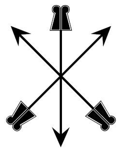
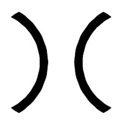

# LIBER XXX ÆRUM vel Sæculi
#### sub figura CCCCXVIII

Being of the Angels of the 30 Aethyrs
THE VISION AND THE VOICE

With COMMENTARY by THE MASTER THERION

A∴A∴ Publication in Class AB

Imprimatur:
D.D.S. 7° = 4^□ ^ Praemonstrator
O.S.V. 6° = 5^□ ^ Imperatior 
N.S.F. 5° = 6^□ ^ Cancellarius

# Introduction

The Vision and the Voice of the Angels of the thirty Aethyrs, reprinted from the Equinox, Volume 1, Supplement to No. 5, but here represented for the first time with an elaborate commentary by the MASTER THERION, is unique in that it attempts to describe in a perfectly sane and scientific manner spiritual experiences, and the investigations of the more subtle planes.

The first attempts to obtain these visions were made in 1900, in Mexico, where FRATER PERDURABO had journeyed in his efforts to obtain a perfect understanding of the mystic traditions and methods of attainment of every race and clime. The first two Aires were investigated on November 14 and 17, 1900. The Vision and the Voice was mysterious and terrific in character. But what he saw was not altogether beyond his previous experiences; what he heard was as unintelligible to him as William Blake to a 7th Day Adventist. He was encouraged by the evident importance of these results, but found that he was absolutely unable to proceed with the 28th Aethyr. It became evident, some 9 years later, that what stopped his further exploration of the Aethyrs in 1900 was simply that his Grade did not entitle him to go further than the 29th. In fact only a Master of the Temple, 8x = 3square x, can penetrate beyond a certain point, and further, as sections of the Comment point out, even a Master of the Temple cannot pierce through the veils surrounding the outer of these Aires.

The Seer had not thought of continuing this work for nearly 9 years. It is not at all clear how the idea came to him in 1909, during a walk through the Desert with Frater O.V., (Victor Neuburg) a Probationer of the A.'. A.'., but at Aumale a Hand suddenly smote its lightning into his heart, and he knew that now, that very day, he must take up The Vision and the Voice from the point where he had laid it down in 1900. Parallel to this, it is also possible that he had in his ruck sack one of his earliest Magical Note Books, where he had copied with infinite patience the 19 Calls or Keys obtained by Sir Edward Kelly from certain Angels and written down by Queen Elizabeth's astrologer, Dr. John Dee.

The facts that stamp these Keys or Calls are these. Over 100 squares filled with letters were obtained by these two Magicians, in a manner which no one yet has quite understood. Dee would have one or more of these tables (as a rule 49 by 49) — some full, others lettered only on alternate squares — before him on a writing table. Kelly would sit at what they called the Holy Table, and gaze into a "Shewstone" in which he would see an Angel, who would point with a wand to letters on one of these charts in succession. Kelly would report, for example, "He points to column 6, rank 31", and so on, apparently not mentioning the letter, which Dee found and wrote down from the "Table" before him. When the Angel had finished, the message was rewritten backwards. It had been dictated backwards as being too dangerous to communicate forwards — each word being in its nature so powerful that its direct communication would have evoked forces which were not wanted at that time.

These Keys being re-written backwards, there then appeared conjurations in a language which they called "Enochian", or "Angelic". It is not a jargon; it has a grammar and a syntax of its own. It is far more sonorous, stately and impressive than even Greek or Sanskrit and the English translations, though in places difficult to understand, contain passages of a sustained sublimity that Shakespeare, Milton and the Bible do not surpass.

"Can the Wings of the Wind understand your voices of Wonder? O Ye! The Second of the First! whom the burning flames have framed in the depths of my Jaws! Whom I have prepared as cups for a wedding, or as flowers in their beauty for the chamber of Righteousness! Stronger are your feet than the barren stone! and mightier are your voices than the manifold winds! For you are become a building such as is not, save in the mind of the All-Powerful." (Second Key)

There are nineteen of these Keys: the first two conjuring the element called Spirit; the next sixteen invoke the Four Elements; each sub-divided into four; the nineteenth, by changing two names, may be used to invoke any one of what are called the thirty "Aethyrs" or "Aires".

The genuineness of these Keys, altogether apart from any critical observation, is guaranteed by the fact that anyone with the smallest capacity for Magick finds that they work. The Seer had used these Keys a great deal, — always with excellent effect. It was in Mexico that the idea occurred to him to discover for himself what these Aethyrs really were, by invoking them in turn by means of the nineteenth key, and, by skrying in the Spirit Vision, judge their nature by what he saw and heard.

It was then in Aumale, that he prepared to commence once more the investigations of these Aethyrs, and accordingly bought a number of notebooks. After dinner, on the 23rd of November, 1909, he invoked the 28th Aethyr by means of this 19th Key. When it was compared with those of the 29th and 30th Aethyrs, — lo and behold, there were exhibited the same peculiarities of subject and style. This is true also of the 27th, and so on to the 24th; yet there is a continuous advance towards coherence both in each Aethyr itself, and as regards its neighbour. The subject shows solemnity and sublimity, as well as the tendency to fit in with those conceptions of the Cosmos, those mystic Laws of Nature, and those ideas of transcendental Truth which had already been foreshadowed in The Book of the Law (Vernal Equinox, 1904), and the more exalted of the trances which the Seer had experienced prior to this date.

The Method of obtaining The Vision and the Voice was as follows.

The Seer had with him a great golden topaz (set in a Calvary Cross of six squares, made of wood, and painted vermillion) which was engraved with a Greek Cross of five squares charged with the Rose of 49 petals. He held this, as a rule, in his hand. After choosing a spot where he was not likely to be disturbed he would take this stone and recite the Enochian Call, and after satisfying himself that the forces invoked were actually present, made the topaz play a part not unlike that of the looking glass in the case of Alice. (He had long learned not to trouble himself to travel to any particular place in his Body of Light. He realized that Space was not a thing in itself, but merely a convenient category [one of many such] by reference to which we can distinguish objects from each other.) He would then describe what he saw and repeat what he heard, and Frater O.V., the Scribe, would write down his words, and incidentally observe any phenomena which struck him as peculiar. (For instance, He would at times pass into a deep trance so that many minutes might pass between two successive sentences, as the text to the later Aethyrs shows.)

They walked steadily through the Desert, invoking the Aethyrs, one by one, at convenient times and places, or when the Spirit moved them. As a rule, one Aethyr was obtained every day. Bou-Sada was reached on November 30th; on December 8th they started again through the desert for Biskra which they reached on December 16th, completing the work on the 19th. By the time Bou-Sada was reached, and they had arrived at the 20th Aethyr, the Seer began to understand that these visions were, so to speak, cosmopolitan. They brought all systems of Magical doctrine into harmonious relation. The symbolism of Asiatic cults; the ideas of the Qabalah, both Jewish and Greek; the Arcana of the Gnostics; the Pagan Pantheon, from Mithras to Mars; the Mysteries of Ancient Khem; the Rites of Eleusis; the Scandinavian Sagas; Celtic and Druidical ritual; Mexican and Polynesian traditions; the Mysticism of Molinos no less than that of Islam,— all these fell into their proper places without the slightest tendency to quarrel. The whole of the past Aeon, in short, appeared in detailed perspective, and each element therefore surrendered its sovereignty to Horus, the Crowned and Conquering Child, the Lord of the Aeon announced in The Book of the Law

Love is the law, love under will.
Frater E.'.N.'.L.'.

The titles of the Thirty AEthyrs whose dominion extendeth in ever
widening circles without and beyond the Watch Towers of
the Universe

(The first is Outermost) 1 LIL 16 LEA
2 ARN 17 TAN
3 ZOM 18 ZEN
4 PAZ 19 POP
5 LIT 20 KHR
6 MAZ 21 ASP
7 DEO 22 LIN
8 ZID 23 TOR
9 ZIP 24 NIA
10 ZAX 25 VTI
11 ICH 26 DES
12 LOE 27 ZAA
13 ZIM 28 BAG
14 UTA 29 RII
15 OXO 30 TEX

#### THE CALL OR KEY OF THE THIRTY AETHYRS

MADARIATZA das perifa LIL^[Or other Aire as may be willed.] cahisa micaolazoda saanire caosago od fifisa balzodizodarasa Iaida. Nonua gohulime: Micama adoianu MADA faoda beliorebe, soba ooaona cahisa luciftias peripesol, das aberaasasa nonuafe netaaibe caosaji od tilabe adapehaheta damepelozoda, tooata nonuafe jimicalazodoma larasada tofejilo marebe yareryo IDOIGO2; od torezodulape yaodafe gohola, Caosaga, tabaoreda saanir od caharisateosa yorepoila tiobela busadire, tilabe noalanu paida oresaba, od dodaremeni zodayolana. Elazodape tilaba paremeji peripesatza, od ta qurelesata booapisa. Ianibame oucaho sayomepe, od caharisateosa ajitoltorenu, mireca qo tiobela lela. Tonu paomebeda dizodalamo asa pianu, od caharisateosa aji-la-tore-torenu paracahe a sayomepe. Coredazodizoda dodapala od fifalazoda, lasa manada, od faregita bamesa omaoasa. Conisabera od auauotza tonuji oresa; catabela noasami tabejesa leuitahemonuji. Vanucahi omepetilabe oresa! Bagile? Moooabe OL coredazodizoda. El capimao itzomatzipe, od cacocasabe gosaa. Bajilenu pii tianuta a babalanuda, od faoregita teloca uo uime.

Madariiatza, torezodu!!! Oadariatza orocaha aboaperi! Tabaori periazoda aretabasa! Adarepanu coresata dobitza! Yolacame periazodi arecoazodiore, od quasabe qotinuji! Ripire paaotzata sagacore! Umela od peredazodare cacareji Aoiveae coremepeta! Torezodu! Zodacare od Zodameranu, asapeta sibesi butamona das surezodasa Tia balatanu. Odo cicale Qaa, od Ozodazodama pelapeli IADANAMADA!

### THE CALL OR KEY OF THE THIRTY AETHYRS

O Ye Heavens which dwell in the first Aire1, ye are mighty in the parts of the Earth, and execute therein the Judgment of the Highest! Unto you it is said: Behold the Face of your God, the beginning of Comfort, whose eyes are the brightness of the Heavens, which provided you for the Government of the Earth, and her unspeakable variety, furnishing you with the power of understanding to dispose of all things according to the Foresight of Him that Sitteth on the Holy Throne2, and rose up in the Beginning, saying: The Earth, let her be governed by her parts, and let there be Division in her, that the glory of her may be always ecstasy and imitation of orgasm. Her course, let it run with the Heavens; and as an handmaid let her serve them. One season, let it confound another, and let there be no creature upon or within her the same. All her members, let them differ in their qualities, and let there be no one Creature equal with another. The reasonable Creatures of the Earth, and Men, let them vex and weed out one another; and their dwelling-places, let them forget their Names. The work of man and his pomp, let them be defaced. His building, let it be a Cave for the Beast of the Field! Confound her understanding with darkness! For why? It repenteth me concerning the Virgin and the Man. One while let her be known, and another while a stranger: because she is the bed of an Harlot, and the dwelling-place of him that is fallen.

O ye Heavens arise! The lower heavens beneath you, let them serve you! Govern those that govern! Cast down such as fall. Bring forth with those that increase, and destroy the rotten. No place let it remain in one number. Add an diminish until the stars be numbered. Arise! Move! and appear before the Covenant of His mouth, which He hath sworn unto us in His Justice. Open the Mysteries of your Creation, and make us partakers of THE UNDEFILED KNOWLEDGE.

### A BRIEF SYNOPSIS 

### OF THE CONTENTS OF THE CALLS OF THE THIRTY AIRES OR AETHYRS

Aethyr

30. "Exordium of the Equinox of the Gods."

29. "The Disruption of the Aeon of Osiris."

28. "The Vision of the Dawn of the Aeon of Horus (Atu XVII)"

27. "The Vision of the Initiation of Hecate (Atu XIV)
The Redemption of the Woman of Witchcraft by Love."

26. "The Slave-Gods superseded (The Vision of Atu XX, the Stl)
The Vision of the Stl of Revealing, abolishing the Aeon of the Slave-Gods."

25. "The Path of Teth (Atu XI. The Fire-Kerub in the Initiation).
The Vision of the Fruit of the Great Work of the Beast - 666. The Lion."

24. "The Rose. (The Woman of Atu XIV. Minister of Babalon;
The Water-Kerub in the Initiation.) The First Kiss Of the Lady of Initiation."

23. "The Kerubim of Earth and Air (Minor officers in the Initiation to 8x = 3square x.) The Vision of the Interplay And Identity of Earth and Air."

22. "The 49-fold Table (First appearance of the Crowned and Conquering Child to the Exempt Adept as in the Pastos) The Vision of the Rose, the Heart of BABALON and of The Birth of the Universe."

21. "Kether. (TheHierophant prepares the Candidate). The Vision of the Ineluctable Destiny."

20. "The Path of Kaph (Atu X). The Hiereus prepares the Candidate). The Vision of the Wheel of Fortune. The Three Energies of the Universe."

19. "The Path of Gimel (The Hegemone between the Pillars. Preliminary: The Vision of the Unguided Universe.)"

18. "Tiphereth. (The King's Chamber. The Vision of the holy Guardian Angel.) The Instruction concerning the Obtaining of the Vision and the Voice of the Thirty Aethyrs. The Preparation of the Candidate." Aethyr

17. "The Path of Lamed. (The combination Gimel, Lamed, Samech. The Vision of the Justice or Balance of the Universe."

16. "Keter. (Path of Pe.) The Overthrow of the Salve-Gods by The Beast 666."

15. "The Vision of the rose of 49 petals, and of the Holy 12-fold Table. Examination of the Candidate for M.T."

14. "The Vision of the City of the Pyramids. The Reception Of the Master of the Temple."

13. "The Garden of Nemo. The Work of the Magister Templi."

12. "The Path of Cheth. The Bearer of the Sangraal. The Black Brothers."

11. "Yesod. The Frontier of the Abyss."

10. "The Abyss. Choronzon, his Nature."

9. "Malkuth. (The Pure Virgin.) The reward of the Magister Templi."

8. "The Holy Guardian Angel. His instruction."

7. "The Path of Daleth. The Black Brothers."

6. "The Vision of the Urn. The Magus 9x = 2square x. The Three Schools of Magick."

5. "The Vision of the Middle Pillar. (Arrow). The Mystery Of Atheism."

4. "The Marriage of Yod and He. (The common Tibetan Symbol.) The Seer identifies himself with it."

3. "The Magus of the Tarot. (Atu 1). Mayan, the Maker of Illusion. The Seer in Illusion (Lilith)."

2. "The Marriage of the Seer with BABALON. (Atu VI)."

1. "The Vision of The Crowned and Conquering Child, the Lord Of the Aeon."

Note: In various footnotes to the text, Crowley makes correspondences to Enochian letters and Astrological symbols. An ambiguity exists in regard to the letter "T". The Germer/Thelema Publishing Edition of 1952 e.v. makes extensive use of symbols for Astrological concepts, and it is not possible to clearly differentiate the signs for Leo and Caput Draconis in all instances, since the handwritten symbols for these two correspondences are usually indistinguishable in the Germer edition. Enochian corresponds directly to English letters, while the astrological correspondences come from correspondences to Hebrew letters. There are two letters in Hebrew which are loosely rendered "T" in English/Enochian; Tet = Leo and Taw = Caput Draconis/Saturn. Crowley uses both Leo and Caput Draconis for the Enochian "T" in his notes. Where Leo or Caput Draconis is made clear by the context of the note, the rendering has been duplicated here. Where this is ambiguous, T is assumed to be matched to Leo in this text. F.I.Regardie, in his edition, usually renders the Enochian "T" as Caput Draconis, a practice reversed in this present version. A concise edition should therefore be made only after careful examination of the notations for every instance of the use of the Enochian "T", with citation of uncertainty in regard to Leo or Caput Draconis where Crowley's intention is unclear.

WEH = Bill Heidrick (William E. Heidrick, TG OTO)

### The Cry of the 30th Aethyr

#### Which is Called TEX^[TEX = ♌♍A]

I AM in a vast crystal cube in the form of the Great God Harpocrates. This cube is surrounded by a sphere.^[cf. AL, II, 7] About me are four archangels in black robes, their wings and armour lined out in white.

In the North^[North: Destruction = the Old Formula is abrogated.] is a book on whose back and front are A.M.B.Z.^[♉♒♈♌. The Forthsaying of the New Aeon.] in Enochian characters. (ENO:zENO:bENO:mENO:a)

Within it is written:

I AM, the surrounding of the four.

Lift up your heads, O Houses of Eternity: for my Father goeth forth to judge the World. One Light, let it become a thousand, and one sword ten thousand, that no man hide him from my Father's eye in the Day of Judgment of my God. Let the Gods hide themselves: let the Angels be troubled and flee away: for the Eye of My Father is open, and the Book of the Aeons is fallen.

Arise! Arise! Arise! Let the Light of the Sight of Time be extinguished: let the Darkness cover all things: for my Father goeth forth to seek a spouse to replace her who is fallen and defiled.

Seal the book with the seals of the Stars Concealed: for the Rivers have rushed together and the Name HEB:HehHEB:VauHEB:HehHEB:Yodis broken in a thousand pieces (against the Cubic Stone).

Tremble ye, O Pillars of the Universe5^[cf. AL, III, 71. Also LIL.] , for Eternity is in travail of a Terrible Child; she shall bring forth an universe of Darkness, whence shall leap forth a spark that shall put his father to flight.

The Obelisks are broken; the stars have rushed together: the Light hath plunged into the Abyss: the Heavens are mixed with Hell.

My Father shall not hear their Noise: His ears are closed: His eyes are covered with the clouds of Night.

The End! the End! the End: For the Eye of Shiva He hath opened: the Universe is naked before Him: for the Aeon of Saturn leaneth toward the Bosom of Death.^[♄ = 400 Death = 50 400 + 50 = 450 ΝΥ etc.]

![Figure: This is an isosceles triangle with height about 7 times the base. It extends with base on a true vertical from the left. A line extends vertically upward from the apex, equal to the length of the base. A trefoliate of three isosceles triangles of base slightly smaller than the first triangle and sides equal to the first triangle is created at the upper tip of the line. The tree component triangles of the terfolate meet the upper tip of the line with their apices — one vertically and two to right and left.](img/iso_tri.jpg)^[Represents the formula of Drawing all to a point: whence blooms erect a Triple Triad.]

The Angel of the East^[East. Adepts: cleansed of their Blood, and brought to Light. = There is a way to light through giving up one's Blood. (See 12th Aethyr) hath a book of red written in letters of Blue A.B.F.M.A.^[[9] ♉♈☋♒♉ = Opening of New Aeon.] in Enochian (ENO:a ENO:m ENO:f ENO:b ENO:a). The Book grows before my eyes and filleth the Whole Heaven.

Within: "It is Written, Thou shalt not tempt the Lord Thy God."

I see above the Book a multitude of white-robed Ones from whom droppeth a great rain of Blood^[Symbolism of the Cup of Babalon.]; but above them is a Golden Sun, having an eye, whence a great Light^[This refers to Kether &mdash; Horus.].

I turned me to the South^[South. Silence. Marriage in Binah. = This leads to the Rapture of the Ineffable Union. Closing of Old Aeon.]: and read therein:

Seal up the Book! Speak not that which thou seest and reveal it unto none: for the ear is not framed that shall hear it: nor the tongue that can speak it!

O Lord God, blessed, blessed, blessed be Thou for ever!

Thy Shadow is as great Light.

Thy Name is as the Breath of Love across all Worlds.

(A vast Svastika is shewn unto me behind the Angel with the Book.) ^[The Swastika has 17 squares out of 25, The Pentagram, or Human square. It is also HEB:Aleph = Harpocrates, Bacchus Diphues, Parzival, etc., the Pure Fool, the Wanderer, who weds the King's Daughter.]

Rend your garments, O ye clouds! Uncover yourselves! for the Love of My Son!

Who are they that trouble thee?

Who are they that slew thee?

O Light! Come thou, who art joined with me to bruise the Dragon's head ^[Means the Stooping Dragon (see 4x = 7square x ritual): but also the phrase = break the Maidenhead of Draco (Nuit).]. We, who are wedded, and the Earth perceiveth it not!

O that Our Bed were seen of Men, that they might rejoice in My Fertility: that My Sister might partake of My Great Light.

O Light of God, when wilt thou find the heart of man — write not! I would not that men know the Sorrow of my Heart, Amen!

I turned me to the West^[West. Fate (Refusing Initiation.) = The alternative is despair — of loneliness.], and the Archangel bore a flaming Book, on which was written AN^[♉♏ AN (Hebrew) means Pain: NA = Failure. These = 51 = 3x17. Note the Three Vibrations as spoiling the ideas of 17 (IAC). The Doom of the Old Aeon.] in Enochian (ENO:nENO:a). Within was drawn a fiery scorpion, yet cold withal.^[♏ = נ = Fish = Jesus.]

Until the Book of the East be opened!

Until the hour sound!

Until the Voice vibrate!

Until it pierce my Depth;

Look not on High!

Look not Beneath!

For thou wilt find a life which is as Death: or a Death which should be infinite.

For Thou art submitted to the Four: Five thou shalt find, but Seven is lone and far.^[Tetragrammaton — the blind forces of the Elements — bind the Uninitiate. He may attain to the Pentagram — Jeheshua —the Man Master of those Elements. But he cannot reach Seven — Babalon. (See Sigil of A.·. A.·. 77 + 7 + 7 + 77 = 156 Babalon)]

For she is "lone and far", i.e., beyond the Abyss.

O Lord God, let Thy Spirit hither unto me!

For I am lost in the night of infinite pain: no hope: no God: no resurrection: no end: I fall: I fear.

O Saviour of the World, bruise Thou my Head with Thy foot to save the world, that once again I touch Him whom I slew, that in my death I feel the radiance and the heat of the moving of Thy Robes!

Let us alone! What have we to do with Thee, Thou Jesus of Nazareth?

Go! Go!

If I keep silence — Or if I speak each word is anguish without hope.

And I heard the Aethyr cry aloud "Return! Return! Return! For the work is ended; and the Book is shut; and let the glory be to God the Blessed for ever in the Aeons, Amen." Thus far is the voice of TEX and no more.

### The Cry of the 29th Aethyr

#### Which is Called RII^[RII = ♓♐♐ = קסס = 220. 220 is the number of verses of The Book of the Law: And this book brings about the disruption described in this Aethyr.]

The sky appears covered with stars of gold; the background is of green. But the impression is also of darkness.

An immense eagle-angel is before me. His wings seem to hide all the Heaven.^[In the East. He thus represents the immediate future: and this is dark, Bewildering, and terrifying.]

He cried aloud saying: The Voice of the Lord upon the Waters: the Terror of God upon Mankind. The voice of the Lord maketh the Skies to tremble: the Stars are troubled: the Aires fall. The First Voice Speaketh and saith: Cursed, cursed be the Earth, for her iniquity is great. Oh Lord! Let Thy Mercy be lost in the great Deep! Open thine eyes of Flame and Light, O God, upon the wicked! Lighten thine Eyes! The Clamour of Thy Voice, let it smite down the Mountains!

Let us not see it! Cover we our eyes, lest we see the End of Man.

Close we our ears, lest we hear the cry of Woman.

Let none speak of it: let none write it: I, I am troubled, my eyes are moist with dews of terror: surely the Bitterness of Death is past.

And I turned me to the South and lo! a great lion^[♌. This is the Beast 666 as yet unprepared for his Work. But already (1900 e.v.) He was dreaded by his fellow Magicians. South: proper place of ☉ in his strength.] as wounded and perplexed.

He cried: I have conquered! Let the Sons of Earth keep silence; for my Name is become as That of Death!

When will men learn the Mysteries of Creation?

How much more those of the Dissolution (and the Pang of Fire)?

I turned me to the West and there was a great Bull^[The Bull is Osiris or Jesus: he complains of the terrible things that are Happening, especially the Freedom (which he thinks shamelessness) or Woman. He does not understand the New Aeon, or that he is about to be destroyed. He is in the West, i.e. going into Oblivion. Cr. West in he 30th Aethyr.]; White with horns of White and Black and Gold. His mouth was scarlet and his eyes as Sapphire stones. With a great sword he shore the skies asunder, and amid the silver flashes of the steel grew lightnings and deep clouds of Indigo.

He spake: It is finished! My mother hath unveiled herself!

My sister hath violated herself! The life of things hath disclosed its Mystery.

The work of the Moon is done! Motion is ended for ever!

Clipped are the eagle's wings: but my Shoulders have not lost their strength.

I heard a Great Voice from above crying: Thou liest! For the Volatile hath indeed fixed itself; but it hath arisen above thy sight. The World is desert: but the Abodes of the House of my Father are peopled; and His Throne is crusted over with white Brilliant Stars, a lustre of bright gems.

In the North is a Man upon a Great Horse, having a Scourge and Balances^[The severest aspect of Justice. Libra] in his hand (or a long spear glitters at his back or in his hand). He is clothed in black velvet and his face is stern and terrible.

He spake saying: I have judged! It is the end: the gate of the beginning. Look in the Beneath and thou shalt see a new world!

I looked and saw a great abyss and a dark funnel of whirling waters or fixed airs, wherein were cities and monsters and trees and atoms and mountains and little flames (being souls) and all the material of an universe.

And all are sucked down one by one, as necessity hath ordained. For below is a glittering jewelled globe of gold and azure, set in a World of Stars.^[Nuit.]

And there came a Voice from the Abyss, saying: "Thou seest the Current of Destiny! Canst thou change one atom in its path? I am Destiny. Dost thou think to control me? for who can move my course?"

And there falleth a thunderbolt therein: a catastrophe of explosion: and all is shattered. And I saw above me a Vast Arm reach down, dark and terrible, and a voice cried: I AM ETERNITY.

And a great mingled cry arose: "No! no! no! All is changed; all is confounded; naught is ordered: the white is stained with blood: the black is kissed of the Christ! Return! Return! It is a new chaos that thou findest here: chaos for thee: for us it is the skeleton of a New Truth!"

I said: Tell me this truth: for I have conjured ye by the Mighty Names of God, the which ye cannot but obey.

The voice said:

Light is consumed as a child in the Womb of its Mother to develop itself anew. But pain and sorrow infinite, and darkness are invoked. For this child riseth up within his Mother and doth crucify himself within her bosom. He extendeth his arms in the arms of his Mother and the Light becometh fivefold ^[The LVX Cross hidden in the Svastika is probably the Arcanum here connoted. This Cross on Mars square adds to 65 Adonai, Shone, Gloried, ha-Yekal HS = keep silence. Svastika itself adds to 231 = 0 + 1 + 2 + ... + 21, the 21 Keys. The cubical Svastika regarded as composed of this LVX Cross and the arms has a total of 78 Faces - Tarot and Mezla].

> Lux in Luce,
> Christus in Cruce;
> Tarot and Mezla.
> Deo Duce

Sempiterno.^[This is but the beginning of a sort of hymn. It was never written down, the Seer being unable to hear it properly. These four lines are in fact probably incorrect, certainly incomplete. There were four more lines which he failed to hear &mdash; from fear of getting them wrong.]

And be the glory for ever and ever unto the Most High God, Amen!

Then I returned within my body, giving glory unto the Lord of Light and of the Darkness. In Saecula Saeculorum. Amen!

(On composing myself to sleep, I was shewn an extremely brilliant HEB:Dalet^[Daleth = the Gateway] in the Character of the Passing of the River, in an egg of white light. And I take this as the best of Omens. The letter was extremely vivid and indeed apparently physical. Almost a Dhyana.)

November 17, 1900, Die.

A NOTE^[This note, written before invoking the 28th Aire, represents a crude and imperfect view. It is retained so as to show how very inadequate was the Understanding of the Seer; therefore the immense superiority of the communicating Intelligences and Their separate individual Consciousness.]

Concerning the thirty Aethyrs:

The Visions of the 29th and 30th Aethyrs were given to me in Mexico in August^[Query: November? See above], 1900, and I am now (23.11.9) trying to get the rest. It is to be remarked that the last three aethyrs have ten angels attributed to them^[See *Equinox* I, VII, pp. 243-2], and they therefore represent the ten Sephiroth. Yet these ten form but one, a Malkuth-pendant to the next three, and so on, each set being, as it were, absorbed in the higher. The last set consists, therefore, of the first three aethyrs with the remaining twenty-seven as their Malkuth. And the letters of the first three aethyrs are the key- sigils of the most exalted interpretation of the Sephiroth.

* I is therefore Kether;
* L, Chokmah and Binah;
* A, Chesed;
* N, Geburah;
* R, Tiphereth;
* Z, Netzach;
* N, Hod;
* O, Yesod.

The geomantic correspondences of the Enochian alphabet form a sublime commentary.

Note that the total angels of the aethyrs are 91, the numeration of Amen.

### The Cry of the 28th Aethyr

#### Which is Called BAG^[BAG = ♈♉♋ = ה + ו + ח = 19. הוח = Eve = to manifest, to shew forth.]

There cometh an Angel into the stone with opalescent2^[Opal = rainbow = ♐] shining garments like a wheel^[XIX = The Wheel of the Sun, symbolic of universally radiating energy; and 19 is the glyph of the circle.] of fire on every side of him, and in his hand is a long flail of scarlet lightning^[19 = Angel L.T.D. Of ♐] ; his face is black^[19 = היד was black.] , and his eyes white without any pupil or iris^[References to Binah.]. The face is very terrible indeed to look upon. Now in front of him is a wheel^[See above, note 3.], with many spokes, and many tyres; it is like a fence^[ח = Fence.] in front of him.

And he cries: O man, who art thou that wouldst penetrate the Mystery^[Binah = Eve. 19 is the Great Glyph of the Feminine.]? for it is hidden unto the End of Time.^[Same as above.]

And I answer him: Time^[ת Time = ♄ = Binah.] is not, save in the darkness of Her womb by whom evil came.

And now the wheel breaks away, and I see him as he is. His garment is black beneath the opal veils, but it is lined with white, and he has the shining belly of a fish, and enormous wings of black and white feathers, and innumerable little legs and claws like a centipede, and a long tail like a scorpion. The breasts are human, but they are all scored with blood; and he cries: O thou who hast broken down the veil, knowest thou not that who cometh where I am must be scarred by many sorrows? ^[i.e. must attain to 8x = 3□]

And I answer him: Sorrow is not, save in the darkness of the womb of Her by whom came evil.

I pierce the Mystery of his breast , and therein is a jewel^[All are references to Binah.]. It is a sapphire as great as an ostrich egg, and thereon is graven this sigil:

(Figure: This is in the form of two "U" shapes, very elongated in the risers. The one to the right is lower than the first, and its left riser extends 2/3's of the way up inside the center of the one to the left. The left "U" turns back down to the far left, ending 1/5th the way down in a tiny circle. The right bends abruptly horizontally left across the other and also ends there in a tiny circle.)

But there is also much writing on the stone, very minute characters carved. I cannot read them. He points with his flail to the sapphire, which is now outside him and bigger than himself^[Binah absorbs all.]; and he cries: Hail! warden of the Gates of Eternity who knowest not^[Binah destroys knowledge.] thy right hand from thy left^[Hands: ☿: for Hand is Iod, Virgo. Also the two hands are the Twin Serpents. Eyes ☉ & ☾ The Positive and Negative. Executive currents of the Logos. Nostrils ♂ & ♀ The mouth attributed the Mercury in the usual system, cannot be used in this phrase; for the Ears ♃ & ♄ Mouth is One, not Two, being the Logos itself. And the Logos is essentially an Unity, although manifested through Vibration. It is therefore not destroyed with the other objects of Knowledge, though its dual modes of expression, the hands, are no longer known apart.]; for in the aeon of my Father is a god with clasped hands wherein he holdeth the universe, crushing^[See *Liber AL*, III, v. 72] it into the dust that ye call stars.

Hail unto thee who knowest not thy right eye from thy left; for in the aeon of my Father there is but one light.

Hail unto thee who knowest not thy right nostril from thy left; for in the aeon of my Father there is neither life nor death.

Hail unto thee who knowest not thy right ear from thy left; for in the aeon of my Father there is neither sound nor silence.

Whoso hath power to break open this sapphire stone shall find therein four elephants having tusks of mother-of-pearl, and upon whose backs are castles, those castles which ye call the watch-towers of the Universe.^[The Elements are hidden in Binah.]

Let me dwell in peace within the breast of the Angel that is warden of the aethyr. Let not the shame of my Mother be unveiled. Let not her be put to shame that lieth among the lilies that are beyond the stars.

O man, that must ever be opening, when wilt thou learn to seal up the mysteries of the creation? to fold thyself over thyself as a rose in the embrace of night? But thou must play the wanton to the sun, and the wind must tear thy petals from thee, and the bee must rob thee of thy honey, and thou must fall into the dusk of things. Amen and Amen.

Verily the light is hidden, therefore he who hideth himself is like unto the light; but thou openest thyself; thou art like unto the darkness that bindeth the belly of the great goddess^[In the light of the cry of LOE, this passage seems to mean precisely the opposite of its apparent meaning. The whole cry, from "Let me dwell ..." is an Invocation of Binah. It is a foreshadowing of the Mysteries of the Crossing of the Abyss.]

OLAHO VIRUDEN MAHORELA ZODIREDA! ON PIREDA EXENTASER;
ARBA PIRE GAH GAHA GAHAL GAHALANA VO ABRA NA GAHA VELUCORSAPAX.
^[The translation of this is in my private copy (white and gold binding). Possibly also in the Cefalu set which was copied from that (?) by Estai. (?).]

And the voice of the aeon cried: Return, return, return! the time sickeneth, and the space gapeth, and the voice of him that is, was and shall be crowned rattles in the throat of the mighty dragon of eld.^[Binah or Nuit = Draco, the Dragon]

Thou canst not pass by me, except thou have the mystery of the word of the abyss.

Now the angel putteth back the sapphire stone into his breast; and I spake unto him and said, I will fight with thee and overcome thee, except thou expound unto me the word of the abyss.

Now he makes as if to fight with me. (It is very horrible, all the tentacles moving and the flail flashing, and the fierce eyeless face, strained and swollen.) And with the Magic sword I pierce through his armour to his breast. He fell back, saying: Each of these my scars was thus made, for I am the warden of the aethyr. And he would have said more; but I cut him short, saying: expound the word of the Abyss. And he said^[See the 14th and 13th Aethyr.]: Discipline is sorrowful and ploughing is laborious and age is weariness.

Thou shalt be vexed by dispersion.^[See the 10th Aethyr. These statements are prophetic.]

But now, if the sun arise, fold thou thine arms^[Tiphereth; and the sign of Osiris risen in 5° = 6□.]; then shall God smite thee into a pillar of salt.^[Prophetic of the 8° = 3□ attainment; the pillar is Sea. Cf. Lib. LXV, Cap. V, vv. 5, 23, 25.]

Look not so deeply into words and letters; for this Mystery hath been hidden by the Alchemists. Compose the sevenfold into a fourfold regimen^[The completed system which is made by the 7° = 4□.]; and when thou hast understood thou mayest make symbols^[The 8° = 3□ may devise a new Qabalah.]; but by playing child's games with symbols thou shalt never understand.^[One cannot become 8° = 3□ by intellectual manipulations.]

Thou hast the signs; thou hast the words; but there are many things that are not in my power, who am but the warden of the 28th Aethyr.

Now my name thou shalt obtain in this wise. Of the three angels of the Aethyr, thou shalt write the names from right to left and from left to right and from right to left, and these are the holy letters:

The first 1, the fifth 2, the sixth 3, the eleventh 4, the seventh 5, the twelfth 6, the seventeenth 7.

Thus hast thou my name^[This would appear to be: PXINBAL <--- FOCISNI ---> RAPOLXO <--- = LIXIPSP = ♋ ♐ Spirit ♐ ♌ ♊ ♌ = ח ס ת ס ט ז ט = 553 = ל ו ד ג ה י נ ת = Draco Magnus, the Mighty Dragon. This is the symbol of Nuit or Binah. The whole symbolism of this Angel is therefore exactly confirmed through a Qabalistic equation of which the Seer had no idea at the time. N.B. He is above the dispersion and disorder just as Binah is above the Abyss of Choronzon.] who am above these three, but the angels of the 30th Aethyr are indeed four, and they have none above them; wherefore dispersion and disorder.^[The four elements unharmonized break up into Choronzon.]

Now cometh from every side at once a voice, terribly great, crying: Close the veil; the great blasphemy hath been uttered; the face of my Mother^[Further reference to Binah.] is scarred by the nails of the devil. Shut the book, destroy the breaker of the seal!

And I answered: Had he not been destroyed he had not come hither, for I am not save in the darkness in the womb of Her^[Binah.] by whom came evil into the world.

And this darkness swallows everything up^[Typical gesture of Binah.], and the angel is -------------------- gone from the stone^[The general attribution of this Aethyr is to Atu XVII]; and there is no light therein, save only the light of the Rose and of the Cross.^[Binah being gone, the seer descends to his normal place in Tiphereth.]

Aumale, Algeria. November 23, 1909, between 8 and 9 p.m.

### The Cry of the 27th Aethyr

#### Which is Called ZAA^[ZAA = ♌♉♉ = טוו = 21. A mystery of Atu XVIII, "The Moon". ♓ in which ♀ is exalted.]

There is an angel with rainbow wings, and his dress is green^[Possibly the traditional green of the huntress.] with silver, a green veil over silver^[Colour of ☾.] armour. Flames of many-coloured fire dart from him in all directions. It is a woman of some thirty years old, and she has the moon for a crest, and the moon is blazoned on her heart, and her sandals are curved silver, like the moon.^[The green of Venus is perhaps the natural veil of Luna, her external show.]

And she cries: Lonely am I and cold in the wilderness of the stars.^[For ☾ is virgin, and the path of ג crosses the wilderness of the Abyss.]

For I am the queen of all them that dwell in Heaven, and the queen of all them that are pure upon earth, and the queen of all the sorcerers of hell.^[Diana Trivia is thus described. She is the Virgin Goddess of Pure Love; and the Lady of Heaven. She is the Virgin Goddess of Pure Love; and she is Hecate, the waning Moon, presiding over Witchcraft. (See Macbeth, etc.)]

I am the daughter of Nuit, the lady of the stars. And I am the Bride of them that are vowed unto loneliness.^[♍ = IX = The Hermit (opposite ♓ in the Zodiac).]

And I am the mother of the Dog Cerberus.^[The Jackals of Atu XVIII.] One person am I, and three gods.^[☾ = ג = 3. Cerberus has three heads.]

And thou who hast blasphemed me shalt suffer knowing me. For I am cold as thou art cold, and burn with thy fire.^[For the ☾ is the Sensorium; she reflects man's spiritual state in terms of sensuous experiences.]

Oh, when shall the war of the Aires and the elements be accomplished?^[i.e. the coefficients of the Circle and the Square be commensurable. "When" means "Through what mode of resolution?"—"On what plane?"]

Radiant are these falchions of my brothers, invisibly about me, but the might of the aethyrs beneath my feet beareth me down. And they avail not to sever the Kamailow.^[Καμηλο σ, a camel, i.e. ג Jimmel. Κα μαιλο σ, a rope. And Jimmel is likened to a rope, a threefold (ג = 3) cord linking Kether and Tiphereth.]

There is one in green armour, with green eyes, whose sword is of vegetable fire.^[The Angel of ד = ♀ who is green, and ד "avails" ג, crossing it on the Tree by joining Chokmah and Binah. That is, the Love of these Supernals balances the Isolation of the Virgin Moon.]

They shall avail me. My son is he^[☾ in 20° ♓ at nativity of 666.], &mdash; and how shall I bear him that have not known man?

All this time intolerable rays are shooting forth to beat me back or destroy me; but I am encased in an egg of blue-violet, and my form is the form of a man with the head of a golden hawk.^[i.e. I assume the god-form of Horus, Sol in the Womb of the Night-sky blue of Binah, who is the Mother of all Stars and thus is potent against Hecate.]

While I have been observing this, the goddess has kept up a continuous wail, like the baying of a thousand hounds;^[The hounds that follow Hecate. The jackals of Atu XVIII. Quote A.C. "Ode to Hecate".] and now her voice is deep and guttural and hoarse, and she breathes very rapidly words that I cannot hear. I can hear some of them now.

**UNTU LA LA ULULA UMUNA TOFA LAMA LE LI NA AHR IMA TAHARA ELULA ETFOMA UNUNA ARPETI ULU ULU ULU MARABAN ULULU MAHATA ULU ULU LAMASTANA.**^[The Lunar language. "Ye hounds! Ho! Ho! Tally-ho! sent the poison of the path—Here! There! Bark! Sweep around! There goes the quarry down the glade of mossy rock. The foremost has caught him. Tally ho! Tally ho! Tally ho! pull him down! Tally-ho boys! Wind the mort! Tally ho! Tally ho! The hunt is ended." ULU = "Hail" plus "come" = very nearly "Ahoy!"]

And then her voice rises to a shriek, and there is a cauldron^[The witches' cauldron.] boiling in front of her; and the flames under the cauldron are like unto zinc flames^[Ultra violet of ♓.], and in the cauldron is the Rose, the Rose of 49 petals^[♀ in ♓.], seething in it. Over the cauldron she has arched her rainbow wings; and her face is bent over the cauldron, and she is blowing opalescent silvery rings on to the Rose; and each ring as it touches the water bursts into flame, and the Rose takes new colours.^[All this paragraph refers to Atu XIV Sagittarius, for she is now in her huntress form. Hence the Alchemical and rainbow symbolism.]

And now she lifts her head, and raises her hands to heaven, and cries: O Mother^[He appeals to Binah, the highest form of Luna.], wilt thou never have compassion on the children of earth? Was it not enough that the Rose should be red with the blood of thine heart^[This is the use to which BABALON puts the Blood of the Masters of the Temple (see 12th Aethyr) to vivify the rose of Universal Creation, i.e. The Attainment of the Master of the Temple fills the World with Life and Beauty. Hecate does not understand this, or else she regards it as hostile to her own Formula.], and that its petals should be by 7 and by 7?

She is weeping, weeping.^[Water of ♓.]

And the tears grow and fill the whole stone with moons.^[She can produce nothing but images of herself.] I can see nothing and hear nothing for the tears, though she keeps on praying. "Take of these pearls^[Pearls, the M.T.'s secreted by Binah round the specks of dust which they have become.], treasure them in thine heart. Is not the Kingdom of the Abyss accurst?" She points downward to the cauldron; and now in it there is the head of a most cruel dragon^[A veil or mask of Khephra (in Atu XVIII).], black and corrupted. I watch, and watch; and nothing happens.

And now the dragon rises out of the cauldron, very long and slim (like Japanese Dragons, but infinitely more terrible), and he blots out the whole sphere of the stone.^[All Hecate can see of the Great Work of 8° = 3□ is the Black Brotherhood; i.e., the failure of that Work.]

Then suddenly all is gone, and there is nothing in the stone save brilliant white light and flecks like sparks of golden fire; and there is a ringing, as if bells were being used for anvils. And there is a perfume which I cannot describe; it is like nothing that one can describe, but the suggestion is like lignum aloes.^[Sagittarius (Atu XIV) again. The phenomena are the experiences of the attained Master of the Temple.] And now all these things are there at once in the same place and time.^[The attainment has destroyed the conditions of physical manifestation.]

Now a veil of olive and silver^[Olive — Water in Malkuth (Queen Scale) also Water (Emperor Scale). Silver is Luna in Queen Scale.] is drawn over the stone, only I hear the voice of the angel^[Hecate now aspires to Binah, accepts the Formula of Love (kisses), surrenders her nature ("Fall back" etc.) and so finds the Word.] receding, very sweet and faint and sorrowful, saying: Far off and lonely in the secret stone is the unknown, and interpenetrated is the knowledge with the will and the understanding. I am alone. I am lost, because I am all and in all; and my veil is woven of the green earth and the web of stars. I love; and I am denied, for I have denied myself. Give me those hands, put them against my heart. Is it not cold? Sink, sink, the abyss of time remains. It is not possible that one should come to ZAA. Give me thy face. Let me kiss it with my cold kisses. Ah! Ah! Ah! Fall back from me. The word, the word of the aeon is **MAKHASHANAH.**^[הנאשאכאמ = 418. A word of 8 letters is necessary to perform the Great work on one whose Formula is 3: 8° = 3□. The Seer "knew" that this Word was not the correct Word, which is Abrahadabra = 418. But on writing it down in Hebrew, as above, he saw that it was the correct word after all. Observe that this proves the Angel to have been an Intelligence not of the Seer's conscious mind. Had he given the Word which the Seer knew, it might have been derived from his subconscious Self. Furthermore, this Word contains more than the mere 418 because of its 8 letters suiting the special Formula required by this particular Angel, whereas the other Word is a general Formula, being of 11 letters, all Magick being referred to 11. so far as ABRAHADABRA is specialized, it refers to the Work of 5° = 6□, there being 5 alephs and 6 other letters. In the Latin script also Makhashanah does have 11 letters. Again, the operation of the Cauldron (above) is described by the 5 consonants of this Word. מ = Water (Water) כ = Wheel (Rose) ש = Fire Dee נ = ♏ ה = Binah]

And these words shalt thou say backwards:

**ARARNAY OBOLO MAHARNA TUTULU NOM LAHARA EN NEDIEZO LO SAD FONUSA SOBANA ARANA BINUF LA LA LA ARPAZNA UOHULU**^[Translation: "Hither, O Holy one/ whose burden pulls at thy spine/ Ho! Ho! Ho! The two-headed God (Janus) ploughs thy back/ sows habitations upon thy back/ thou many-phallused queen/ of princely loves/ which are all sodomies/ so that the holy ones laugh and shake with laughter/ while the lords of mischief/ spend upon thee/ TUTULU (this word cannot be translated. See Liber VII). down bounces from thy back/ the merry mad foetus-faces/ an emission/ Gather ye sun-roses, sun-roses gather ye from the split backside of the Virgin (Earth).]

when thou wilt call my burden unto appearance, for I who am the Virgin goddess am the pregnant goddess, and I have cast down my burden even unto the borders of the universe.^[The Word of the Master has gone forth into every part of the world. Therefore it is always possible to call Him forth to one's assistance by the proper use of the above Formula.] They that blaspheme me are stoned, and my veil^[Symbols of Binah.] is fallen about me even unto the end of time.^[Same as above.]

Now there arises a great raging of thousands and thousands of mighty warriors flashing through the aethyr so thickly that nothing is to be seen but their swords, which are like blue-gray plumes. And the noise is confused, thousands of battle-cries harmonizing to a roar, like the roar of a monstrous river in flood. And all the stone is dull, dull gray. The life is gone from it.^[Many of these Visions end in some way unconnected with the substance of the Aethyr. One must not look for coherence in such places. They are merely episodes on the return journey, useful to break the shock. analogy: one might see a cab accident while returning to one's house from the theatre. This spectacle need have no connection with either the play or one's home life.]

There is no more to see.

Sidi Aissa, Algeria. November 24, 1909, 8-9 p.m.

### The Cry of the 26th Aethyr

#### Which is Called DES^[DES = {Spirit}♍♊ = זיד = 31 + 10 + 7 = 48 = בכוכ = Kokab, the sphere of ☿. This Aethyr describes the supersession of the Aeon of Jehovah and Jesus. The Stele of Revealing, which led to The Book of the Law, whose key number is 31. ד = D = {Spirit} = 31. I = י = ♍ = Nuit and the Point, Hadit. S = ז = ♊ = the twins, Ra-Hoor-Khuit and Hoor-Paar-Kraat combined in Heru-Ra-Ha, the Lord of the Aeon. Also ♍ & ♊ are the Houses of ☿, the Logos. Thus the name of the Aethyr actually means: The Sacred Secret Keyletter of The Book of the Law of Thelema, appearing through the Operation of Mercury as well as gibing a complete symbolical description of the Stele itself. The Arcanum is of Atu XX = ש = {Dee} = "The Last Judgment" or "The Angel". The old form of XX shows the Resurrection Formula of the Old Aeon: the new form shews the Stele of Revealing—718.]

There is a very bright pentagram: and now the stone is gone, and the whole heaven is black, and the blackness is the blackness of a mighty angel.^[The Pentagram indicates that the subject of the Vision is to be the Destiny of Man. The blackness, which is bright, is Solar. The context shows that Binah is not here implied.] And though he is black (his face and his wings and his robe and his armour are all black), yet is he so bright that I cannot look upon him. And he cries: O ye spears and vials of poison and sharp swords and whirling thunderbolts that are about the corners of the earth^[All symbols of division and destruction, also extending only to the Blind Four Elements.], girded with wrath and justice, know ye that His name is Righteousness in Beauty^[Righteousness = Jupiter—Jehovah. Beauty = Osiris—Jesus. These are the qualities they claimed; Their failure is that they never even had the idea of the Supernals beyond the Abyss.]? Burnt out are your eyes, for that ye have seen me in my majesty. And broken are the drum-heads of your ears^[Hearing pertains to Spirit, as sight to fire. These gods have deprived man of his highest faculties.], because my name is as two mountains of fornication, the breasts of a strange woman^[See the 10th Key.]; and my Father is not in them.

Lo! the pools of fire and torment mingled with sulphur! Many are their colours, and their colour is as molten gold, when all is said. Is not He one, one and alone, in whom the brightness of your countenance is as 1,728 petals of fire.^[The Zodiac brought down to the material plane. 12^3^]

Also he spake the curse, folding his wings across and crying: Is not the son the enemy of his father? And hath not the daughter stolen the warmth of the bed of her mother?^[The Oedipus complex. Christianity.] Therefore is the great curse irrevocable. Therefore there is neither wisdom nor understanding nor knowledge in this house, that hangeth upon the edge of hell.^[The Cult of Jehovah cannot even reach to Daath.]

Thou art not 4 but 2, O thou blasphemy spoken against 1.^[i.e. Jehovah is not even the true Chesed, but the evil Dyad, (as opposed to the true Dyad of Chokmah, which interprets Keter in terms of Vibration, the Logos.)]

Therefore whoso worshippeth thee is accursed. He shall be brayed in a mortar and the powder thereof cast to the winds, that the birds of the air may eat thereof and die; and he shall be dissolved in strong acid and the elixir poured into the sea, that the fishes of the sea may breathe thereof and die. And he shall be mingled with dung and spread upon the earth, so that the herbs of the earth may feed thereof and die; and he shall be burnt utterly with fire, and the ashes thereof shall calcine the children of flame, that even in hell may be found an overflowing lamentation.

And now on the breast of the Angel is a golden egg between the blackness of the wings, and that egg^[The promise of breaking the tyranny of Jehovah, who was the evil 4 in the Aeon of the true 4, Isis, by the Solar (golden) Jesus. He appears as an eagle, the bird of Jupiter. so that despite the glittering hope, it was only the old Aeon all over again.] grows and grows all over the aethyr. And it breaks, and within there is a golden eagle.

And he cries: Woe! woe! woe! Yea, woe unto the world! For there is no sin, and there is no salvation.^[He knows this truth, which destroys the whole idea of his formula. Nobody will bother about him, it they are not sinners, and need no saviour.]

My plumes are like waves of gold upon the sea. My eyes are brighter than the sun. My tongue is swifter than the lightning.

Yet am I hemmed in by the armies of night, singing, singing phrases unto Him that is smitten by the thunderbolt of the abyss. Is not the sky clear behind the sun? These clouds that burn thee up, these rays that scorch the brains of men with blindness; these are heralds before my face of the dissolution and the night.

Ye are all blinded by my glory; and though ye treasure in your heart the sacred word that is the last lever of the key to the little door beyond the abyss, yet ye gloss and comment thereupon; for the light itself is but illusion. Truth itself is but illusion. Yea, these be the great illusions beyond life and space and time.

Let thy lips blister with my words! Are they not meteors in thy brain? Back, back from the face of the accursed one, who am I; back into the night of my father, into the silence; for all that ye deem right is left, forward is backward, upward is downward.^[Observe the loud words, the confusion of the thought, throughout this excited passage.]

I am the great god adored of the holy ones. Yet am I the accursed one, child of the elements and not their father.^[He knows that he is not an image of the Simple, Sublime, Self, but an ill-concocted mess of Blind Forces.]

O my mother! wilt thou not have pity upon me? Wilt thou not shield me? For I am naked, I am manifest, I am profane. O my father! wilt not thou withdraw me? I am extended, I am double, I am profane.

Woe, woe unto me! These are they that hear not prayer. It is I that have heard all prayer alway, and there is none to answer me. Woe unto me! Woe unto me! Accursed am I unto the aeons! All this time this brilliant eagle-headed god has been attacked, seemingly, by invisible people^[Jesus has been destroyed by myriads of minute facts; the observations of Nature which have broken down the theories on which his existence depended. His blood is spilt, and veils Truth; whereas the Blood of the Master of the Temple is gathered in the Cup of BABALON, and floods the world with Life and Beauty. (See 27th Aire, footnote 3).], for he is wounded now and again, here and there; little streams of fresh blood come out over the feathers of his breast. And the smoke of the blood is gradually filling the Aethyr with a crimson veil. There is a scroll over the top, saying: Ecclesia abhorret a sanguine^[The Christian, incapable of the formula of the Master of the Temple, abhors the shedding of blood. He fears to lose his vile life.]; and there is another scroll below it in a language of which I do not know the sounds. The meaning is, Not as they have understood.^[i.e. The meaning of the Latin is that given above, not the traditional ecclesiastical interpretation. Cf. also, AL 1, vv. 45-48.]

The blood is thicker and darker now, and it is becoming clotted and black, so that everything is blotted out; because it coagulates, coagulates. And then at the top there steals a dawn of pure night- blue^[Not only symbolic, but actually visible even to the physical eyes, when Nuit is manifested. Also when Ra-Hoor-Khuit is invoked, or Aiwass.],—Oh, the stars, the stars in it deeply set!—and drives the blood down; so that all round the top of the oval gradually dawns the figure of our Lady Nuit, and beneath her is the flaming winged disk, and below the altar of Ra-Hoor-Khuit, even as it is upon the Stele of Revealing.^[See the various special accounts of the Stele. The New Atu XX - 718.]

But below is the supine figure of Seb, into whom is concentrated all that clotted blood.^[Earth has absorbed all the ruin wrought by Jesus, to rebuild life through putrefaction, by her regular formula &mdash; as opposed to the Higher Magick.]

And there comes a voice: It is the dawn of the aeon. The aeons of cursing are passed away. Force and fire, strength and sight, these are for the servants of the Star and the Snake.

And now I seem to be lying in the desert, exhausted.^[This vision, being so close to the physical plane, required no intermediate stations on the way back. The exhaustion was due to the same cause. Communion with high spiritual forces renews the vitality of the Seer.]

The Desert, near Sidi Aissa.

November 25, 1909. 1:10 - 2 p.m.

### The Cry of the 25th Aethyr

#### Which is Called VTI^[VTI = ♑♌♐ = Caput Draconis, the head of the Lion-Serpent, the Beast 666. His father is ♑ Set or Pan; his mother, the woman clothed with the Sun as in Atu XIV. See 27th Aethyr. He is the burden of the Moon, sanctified by 418. Atu XI (a partial form) with Atu XX (XI + XX = XXXI) gives the Key of the New Aeon.]

There is nothing in the stone but the pale gold of the Rosy Cross.

Now there comes an Angel with bright wings, that is the Angel of the 25th Aire. And all the aire is a dark olive about him, like an alexandrite.^[The stone of Gemini, the twins, composing Heru-Ra-Ha, his Lord. Also the house of ☿; that is, his form is Oracular.] stone. He bears a pitcher^[The angel is an avatar of BABALON.] or amphora^[αμφορη = 719. This Angel is a veil for 156, the Woman who closes the mouth of the lion in the old Atu XI, and is the Scarlet Woman who rides upon him in the new form.] And now there comes another Angel upon a white horse^[The sorrow of Death.], and yet again another Angel upon a black bull.^[This represents Jehovah and Jesus. The Pain of Toil. (Sin is Restriction).] And now there comes a lion^[Symbol of the Beast, 666.] and swallows the two latter angels up. The first angel goes to the lion and closes his mouth.^[See Atu XI. Babalon and the Beast conjoined.] And behind them are arrayed a great company of Angels with silver spears, like a forest. And the Angel says: Blow, all ye trumpets, for I will loose my hands from the mouth of the lion, and his roaring shall enkindle the worlds.^[BABALON prepared 666 (in a certain very secret manner) to utter the word Θελημα. (This may have some reference to Crowley´s first wife Rose who was the moving spirit in getting him prepared for invoking Thoth and Horus in the Spring 1904, and then for the writing of The Book of the Law.)] Then the trumpets blow, and the wind rises and whistles terribly. It is a blue wind with silver specks; and it blows through the whole Aethyr. But through it one perceives the lion, which has become as a raging flame. ^[666 is now inspired.] And he roareth in an unknown tongue. But this is the interpretation thereof: Let the stars be burnt up in the fire of my nostrils!^[Nostrils = ♂ and ♀. Energy and passion, also Breath of the Word.] Let all the gods and the archangels and the angels and the spirits that are on the earth, and above the earth, and below the earth, that are in all the heavens and in all the hells, let them be as motes dancing in the beam of mine eye!^[Eye = Creative Light, i.e. of the Word.] I am he that swalloweth up death^[Scorpio.] and victory^[Netzach]. I have slain the crowned goat^[Capricornus], and drunk up the great sea^[Hod]. Like the ash of dried leaves the worlds are blown before me. Thou hast passed by me, and thou hast not known me. Woe unto thee, that I have not devoured thee altogether! On my head is the crown, 419 rays17^[ Leo = ♌ = ט = תיט = 419. t = ♌. ט = snake by meaning. ♌ = Horus. far-darting. And my body is the body of the Snake^[The magical image of the 1st Decan of Leo, rising at the birth of 666, is a lion-headed serpent.], and my soul is the soul of the Crowned Child.^[Horus, the Lord of 666.] Though an Angel in white robes leadeth me^[The Avatar of Binah, in the opening of this Aethyr], - who shall ride upon me but the Woman of Abominations^[BABALON. See Atu XI.]? Who is the Beast?^[419-418=1. Or 667-666=1. 667 = ηκ ο κ κιση γη, the Scarlet Woman. (WEH note: This is the correct Greek 667 entry from Liber MCCLXIV).] Am not I one more than he?^[419-418=1. Or 667-666=1. 667 = ηκ ο κ κιση γη, the Scarlet Woman. (WEH note: This is the correct Greek 667 entry from Liber MCCLXIV)] In his hand is a sword that is a book.^[*Liber AL*, his weapon.] In his hand is a spear that is a cup of fornication.^[This allusion must remain secret.] Upon his mouth is set the great and terrible seal.^[This seal is that of BBABALON. The Seal of the A∴ A∴ See the Book of Lies, εφ. Μθ (Cap. 49).] And he hath the secret of V.^[His motto as a Master of the Temple is this V.V.V.V.V. (Vi Veri Vniversum Vivus Vici).] His ten horns spring from five points ^[V.V.V.V.V. Has 10 horns that spring from 5 points.] , and his eight heads^[See the *Book of Lies*, Cap. Μθ, 49. But there is One Eighth Head too Sacredly terrible to mention.] are as the charioteer of the West.^[Refers to Atu VII. ח = The Chariot = 8. the Bearer of the Sangraal.] Thus doth the fire of the sun temper the spear of Mars,^[The Mystery 5° = 6□ and 6° = 5□, Heru-Ra-Ha is the Martial aspect of Sol.] and thus shall he be worshipped, as the warrior lord of the sun.^[See AL, Cap. III, v. 74.] Yet in him is the woman that devoureth with her water all the fire of God. ^[Again a secret allusion. (WEH note: Join O.T.O. and attain to the mystery).] Alas! my lord, thou art joined with him that knoweth not these things.^[The Seer was not yet a full initiate, and was hampered by A.C.] When shall the day come that men shall flock to this my gate, and fall into my furious throat, a whirlpool of fire? This is hell unquenchable, and all they shall be utterly consumed therein. Therefore is that asbestos unconsumable made pure.^[This paragraph prophesies the purging of the worldly Fire in the Aeon of Horus. "Hell" is the pure Inmost Self of Man, that suffereth not extinction, but consumeth all the experiences of Life, coming thereby to know its own Perfection.] Each of my teeth^[32 teeth; hence the Name is הוהי הא = 32. Macroprosophus interfused with Microprosophus.] is a letter of the reverberating name. My tongue is a pillar of fire,^[The tongue is the instrument of the Logos and so a Phallic or creative organ. Chokmah the logos, is the Root of Fire, and the Masculine Energy.] and from the glands of my mouth arise four pillars of water.^[These are the "Four Rivers of Eden". It is the fourfold understanding of the Logos. These reflect Him so perfectly that they reproduce His Form.] TAOTZEM^[מצעת = 600. A "great number" of Sol, normally 6. 600 = Kosmos. The blasphemy is in taking the material for the Spiritual Sun.] is the name by which I am blasphemed. My name thou shalt not know, lest thou pronounce it and pass by.

And now the Angel comes forward again and closes his mouth.

All this time heavy blows have been raining upon me from invisible angels, so that I am weighed down as with a burden greater than the world.^["The Sin of the whole world". See the Mediterranean Manifesto.] I am altogether crushed. Great millstones are hurled out of heaven upon me.^[Prophetic of the pains, the initiation to 9° = 2□, undergone by 666 in order to become himself.] I am trying to crawl to the lion,^[Prophetic of the pains, the initiation to 9° = 2□, undergone by 666 in order to become himself.] and the ground is covered with sharp knives. I cut myself at every inch.^[Prophetic of the pains, the initiation to 9° = 2□, undergone by 666 in order to become himself.]

And the voice comes: Why art thou there who art here?^[i.e. "Why art Thou not consciously identical with 666?"] Hast thou not the sign of the number,^[The Qabalistic Proofs (of the truth of Aiwass) given by the virtues of 93.] and the seal of the name,^[666] and the ring of the eye?^[The ring of V.V.V.V.V., mentioned in LXV, v. 16.] Thou wilt not.^[My resistance to the Great Work]

And I answered and said: I am a creature of earth, and ye would have me swim.

And the voice said: Thy fear is known; thine ignorance is known; thy weakness is known; but thou art nothing in this matter. Shall the grain which is cast into the earth by the hand of the sower debate within itself, saying, am I oats or barley? Bondslave of the curse, we give nothing, we take all. Be thou content. That which thou art, thou art. Be content49.^[The Angel promises the Seer that he shall be 666 in all truth, and counsels him to await His Hour in perfect confidence.]

And now the lion passeth over through the Aethyr with the crowned beast upon his back, and the tail of the lion goes on instead of stopping, and on each hair of the tail is something or other --- sometimes a little house, sometimes a planet, at other times a town. Then there is a great plain with soldiers fighting upon it, and an enormously high mountain carved into a thousand temples, and more houses and fields and trees, and great cities with wonderful buildings in them, statues and columns and public buildings generally. This goes on and on and on and on and on and on and on all on the hairs of this lion's tail.^[Prophetic of the results of the Great Work delivered by 666.]

And then there is the tuft of his tail, which is like a comet, but the head is a new universe, and each hair streaming away from it is a Milky Way.

And then there is a pale stern figure, enormous, enormous, bigger than all that universe is, in silver armour, with a sword and a pair of balances. ^[This refers to the Aeon which is to follow this of Horus. See Liber AL, Cap. III, v. 34. Its Lord is "the double-wanded one" "Thmaist &mdash; Justice."]
That is only vague. All has gone into stone-gray, blank.

There is nothing.

Ain el Hajel. November 25, 1909. 8:40-9:40 p.m.

(There were two voices in all this Cry, one behind the other &mdash; or, one was the speech, and the other the meaning. And the voice that was the speech was simply a roaring, one tremendous noise, like a mixture of thunder and water-falls and wild beasts and bands and artillery. And yet it was articulate, though I cannot tell you what a single word was. But the meaning of the voice &mdash; the second voice &mdash; was quite silent, and put the ideas directly into the brain of the Seer, as if by touch. It is not certain whether the millstones and the sword-strokes that rained upon him were not these very sounds and ideas.)

### The Cry of the 24th Aethyr 

#### Which is Called NIA^[NIA = ♏♐♉ = 116. She is Atu XIV --- "The Woman clothed with the Sun", see 27th Aire, between ♏, Love as the instrument of change by Putrefaction, and ♉, the heavenly Isis. But cf. also AL III, v. 72 -- Coph Nia. This completes the Mystery of Atu XI by the Vision of 156, also in a partial form. The Beast and the Scarlet Woman at attributed to ♌ and Water ♏. They are the two-in-one Chief Officers, of the Temple of the New Aeon of Heru-Ra-Ha. (Note: The Eagle Kerub in the 23rd Aire is Aquarius ♒. Scorpio is the Woman-Serpent. This is important; for the old attribution is of the Eagle to ♏)]

An angel comes forward into the stone like a warrior clad in chain-armour. Upon his head are plumes of gray^[The Ajna-Chakra --- Chokmah.], spread out like the fan of a peacock.^[Sacred to Juno.] About his feet a great army of scorpions and dogs, lions, elephants, and many other wild beasts. He stretches forth his arms to heaven and cries; In the crackling of the lightning, in the rolling of the thunder, in the clashing of the swords and the hurling of the arrows^[Arrows of ♐ the rainbow which follows this storm.]: be thy name exalted!

Streams of fire come out of the heavens, a pale brilliant blue^[Blue of Sagittarius (Atu XIV).], like plumes. And they gather themselves and settle upon his lips. His lips are redder than roses, and the blue plumes gather themselves into a blue rose^[Woman in ♐.], and from beneath the petals of the rose come brightly coloured humming-birds^[Sacred to Venus.], and dew falls from the rose- honey-coloured dew^[Distilled from Cauldron in Atu XIV. The Elixir. In this Aire is a Mystery of the IX° of the O.T.O.]. I stand in the shower of it.

And a voice proceeds from the rose: Come away! Our chariot is drawn by doves.^[Sacred to ♀. This woman combines ♃ (Juno) and ♀ but she is more than all this, the Quintessence of Scorpio, the Lady of the Cup.] Of mother-of-pearl and ivory is our chariot^[Chariot = Atu VII = ♋ cardinal sign of {Water}. Mother of Pearl is sacred to {Water}; cups symbolize Pleasure, especially sexual pleasure. Ivory comes from the tusks of the Elephant: teeth pertain to ש, the fire of the Spirit. Ivory is thus a symbol of the hard gleaming militant delight of sexual energy, which bears Love in her Chariot through Heaven.] and the reins thereof are the heart-strings of men. Every moment that we fly shall cover an aeon. And every place on which we rest shall be a young universe rejoicing in its strength; the meadows thereof shall be covered with flowers. There shall we rest but a night, and in the morning we shall flee away, comforted.

Now, to myself, I have imagined the chariot of which the voice spake, and I looked to see who was with me in the chariot. It was an Angel of golden hair and golden skin, whose eyes were bluer than the sea, whose mouth was redder than the fire, whose breath was ambrosial air. Finer than a spider's web were her robes. And they were of the seven colours.^[All typical of ♀.]

All this I saw; and then the hidden voice went on low and sweet: Come away! The price of the journey is little, though its name be death. Thou shalt die to all that thou fearest and hopest and hatest and lovest and thinkest and art. Yea! thou shalt die, even as thou must die. For all that thou hast, thou hast not; all that thou art, thou art not!^[Prophetic of the 8° = 3□ Initiation. Love is the motive power which makes the Adeptus Exemptus take the plunge into the Abyss.]

**NENNI OFEKUFA ANANAEL LAIADA I MAELPEREJI NONUKA AFAFAADAREPEHETA PEREGI ALADI NIISA NIISA LAPE OL ZODIR IDOIAN.**^[Enochian]

And I said: ODO KIKALE QAA. Why art thou hidden from me, whom I hear?

And the voice answered and said unto me: Hearing is of the spirit alone. Thou art a partaker of the five-fold mystery^[i.e. of the Pentagram]. Thou must roll up the ten divine ones like a scroll, and fashion therefrom a star.^[The ten Sephiroth form the Flaming Sword. The idea is to make a perfect Man. (the Pentagram) by folding up his 10 consecutive qualities into a single symmetrical symbol.] Yet must thou blot out the star in the heart of Hadit. ^[This star must itself be blotted out in the Point-of View, the Quintessence of Individuality.]

For the blood of my heart is like a warm bath of myrrh and ambergris; bathe thyself therein. The blood of my heart is all gathered upon my lips if I kiss thee, burns in my fingertips if I caress thee, burns in my womb when thou art caught up into my bed. Mighty are the stars; mighty is the sun; mighty is the moon; mighty is the voice of the ever-living one, and the echoes of his whisper are the thunders of the dissolution of the worlds. But my silence is mightier than they. Close up the worlds like unto a weary house; close up the book of the recorder, and let the veil swallow up the shrine, for I am arisen, O my fair one, and there is no more need of all these things.

If once I put thee apart from me, it was the joy of play. Is not the ebb and flowing of the tide a music of the sea? Come, let us mount unto Nuit our mother and be lost! Let being be emptied in the infinite abyss! For by me only shalt thou mount; thou hast none other wings than mine.^[The totality of experiences has amounted to Perfection. There is then no more need of a manifested Universe. See AL. I, v. 29, for the Object of Division.]

All this while the Rose has been shooting out blue flames, coruscating like snakes through the whole Aire. And the snakes have taken shapes of sentences. One of them is: Sub umbra alarum tuarum Adonai quies et felicitas.^[Refers to 5° = 6□ initiation.] And another: Summum bonum, vera sapientia, magnanima vita, sub noctis nocte sunt.^[Refers to the Night of Pan (see later Aires) and so to 8° = 3□ which with 5° = 6□ make the two initiated steps.] And another is: Vera medicina est vinum mortis.^[Cf. the general doctrine about Death. AL II, vs. 72-74, et al.] And another is: Libertas evangelii per jugum legis ob gloriam dei intactam ad vacuum nequaquam tendit.[Combines the four sentences in this order ♒♉♌ ♏ on the circular altar in the vault of Christian Rosencreutz. The meaning is: Liberty, Law, Light fill the Universe.] And another is: Sub qua lex terrarum.^[S.A.L.T.] And another is: Mens edax rerum, cor umbra rerum; intelligentia via summa.^[M.E.R.C.U.R.I.U.S. Meaning: the mind destroys the external (by abstracting its reality: see any good Yoga treatise). The heart is their shadow (i.e. Reality only appears as impressions). Binah (8° = 3□) is the Highest Way.] And another is: Summa via lucis: per Hephaestum undas regas.^[S.U.L.P.H.U.R. An alchemical injunction; a reference to AL, Cap. 2, v. 57.] And another is: Vir introit tumulum regis, invenit oleum lucis.^[V.I.T.R.I.O.L. Reference to IXx O.T.O.]

And all round the whole of these things are the letters TARO; but the light is so dreadful that I cannot read the words. I am going to try again. All these serpents are collected together very thickly at the edges of the wheel, because there are an innumerable number of sentences. One is: tres annos regimen oraculi.^[Refers to time required to assimilate the Initiation of 8°=3□ For three years is 156 weeks; and 156 = BABALON.] And another is: terribilis ardet rex ןוילע.^[Elyon: the exalted one, nVLI (?). 156, a name of BABALON, (see the Urn) with with the Phallic Yod in the midst.] And another is: Ter amb (amp?) (can't see it) Rosam oleo (?). ^[Meaning: the Rose must be thrice anointed (?) with oil. (That is, with the oil.)] And another is: Tribus annulis regna olisbon.^[Refers to the Tree of Life; to be ruled by the three reciprocating Paths, ד, ט, פ; that is, by the supernal love, by the Formula of Babalon and the Beast conjoined, and by that Formula at which is hinted in Liber AL. 1,2,3,4. all T.A.R.O.] And the marvel is that with those four letters you can get a complete set of rules for doing everything, both for white magic and black.

And now I see the heart of the rose again. I see the face of him that is the heart of the rose, and in the glory of that face I am ended. My eyes are fixed upon his eyes; my being is sucked up through my eyes into those eyes. And I see through those eyes, and lo! the universe, like whirling sparks of gold, blown like a tempest. I seem to swell out again into him. My consciousness fills the whole Aethyr. I hear the cry NIA, ringing again and again from within me. It sounds like infinite music, and behind the sound is the meaning of the Aethyr. Again there are no words.

All this time the whirling sparks of gold go on, and they are like blue sky, with a lot of rather thin white clouds in it, outside. And now I see mountains round, far blue mountains, purple mountains. And in the midst is a little green dell of moss, which is all sparkling with dew that drips from the rose. And I am lying on that moss with my face upwards, drinking, drinking, drinking, drinking, drinking of the dew.

I cannot describe to you the joy and the exhaustion of everything that was, and the energy of everything that is, for it is only a corpse that is lying on the moss. I am the soul of the Aethyr.^[This passage describes an Initiation, the first of this series. It is the exhaustion of the lower Self of the Seer in his first union with BABALON.]

Now it reverberates like the swords of archangels, clashing upon the armour of the damned; and there seem to be the blacksmiths of heaven beating the steel of the worlds upon the anvils of hell, to make a roof to the Aethyr.^[This roof seems to be the Path of פ (Mars, blacksmiths, steel, etc., the first ring that binds the ολι οβοσ). The union with his Mate first occurs In Yesod, of which פ may be called the roof. Later we shall find the other marriages of ט and ד.]

For if the great work were accomplished and all the Aethyrs were caught up into one, then would the vision fail; then would the voice be still.

Now all is gone from the stone.

Ain el Hajel. November 26, 1909. 2-3:25 p.m.

### The Cry of the 23rd Aethyr

#### Which is Called TOR^[TOR = ♌♎♓.]

In the brightness of the stone are three lights, brighter than all, which revolve ceaselessly.^[The Three Gunas, Sattvas, Rajas, Tamas. This is an Introit to the Aethyr. As we proceed, we find more and more obstacles to entering.] And now there is a spider's web of silver^[More introit; veils to the true Vision.] covering the whole of the stone. Behind the spider's web is a star of twelve rays;^[Tamas, Kerub of Earth. He and the Eagle of Air make up the 4 Officers of the New Temple.] and behind that again, a black bull, furiously pawing up the ground. The flames from his mouth increase and whirl, and he cries: Behold the mystery of toil, O thou who art taken in the toils of mystery. ^[A warning to the Seer not to allow himself to ignore or despise the plain facts of life. Mysteries &mdash; nay, even The Mysteries themselves! are apt to seduce the Aspirant. He becomes exalt (as the cold rational French, observing these errors, call him) instead of exalted.] For I who trample the earth thereby make whirlpools in the air; be comforted, therefore, for though I be black, in the roof of my mouth is the sign of the Beetle.^[The tradition of the Bull Apis. The Beetle is the Midnight Sun, the hidden hope of Earth.] Bent are the backs of my brethren, yet shall they gore the lion with their horns. Have I not the wings of the eagle, and the face of the man?

And now he is turned into one of those winged Assyrian bull-men.

And he sayeth: The spade of the husbandman is the sceptre of the king.^[The King rules by virtue of the labour of his people. Even ♉ Earth is necessary as the support of Heaven. Nuit is upheld by Shu, who stands on Seb. Neglect to understand this causes many "pure Mystics" to fall lamentably. They "go off their base" in the significant slang of common-sense folk.] All the heavens beneath me, they serve me. They are my fields and my gardens and my orchards and my pastures.

Glory be unto thee, who didst set thy feet in the North;^[The Bull is stationed in the North.] whose forehead is pierced with the sharp points of the diamonds in thy crown;^[The Bull is sacred to Osiris. This refers to the Crown of Thorns.] whose heart is pierced with the spear of thine own fecundity. ^[Again a reference to the Formula of Osiris. The Spear (Sacred Lance, Phallus) pierces the heart of the Dying God.]

Thou art an egg of blackness, and a worm of poison. But thou hast formulated thy father, and made fertile thy mother.

Thou art the basilisk whose gaze turns men to stone, and the cockatrice at the breast of an harlot that giveth death for milk. Thou art the asp that has stolen into the cradle of the babe. Glory unto thee, who art twined about the world as the vine that clingeth to the bare body of a bacchanal.^[These two paragraphs declare the identity of the Bull with his Zodiacal opposite, Scorpio.]

Also, though I be planted so firmly upon the earth, yet is my blood wine and my breath fire of madness. With these wings, though they be but little, I lift myself above the crown of the yod^[The Crown of Yod (as a path on the Tree) is Chesed. It leads thither from Tiphereth. The path of the Bull leads from Chokmah down to Chesed.], and being without fins I yet swim in the inviolate fountain.^[Refers to the Symbol of the woman and the Bull. See 16th Aire.]

I disport myself in the ruins of Eden, even as Leviathan in the false sea^[See Knorr von Rosenroth on the Qlipoth (the Shells). He wrote Kaballa Denudata in Latin which was translated into English as The Kaballah Unveiled by McGregor Mathers, one of the Chiefs of The Hermetic Order of the Golden Dawn], being whole as the rose at the crown of the cross.^["The Rose of Earth" surmounts the Cross of Fire in the symbol of Venus.] Come ye unto me, my children, and be glad. At the end of labour is the power of labour.^[Toil creates kinetic energy.] And in my stability is concentrated eternal change.^[See 11th Aire.]

For the whirlings of the universe are but the course of the blood in my heart. And the unspeakable variety thereof is but my divers hairs, and plumes, and gems in my tall crown. The change which ye lament is the life of my rejoicing, and the sorrow that blackeneth your hearts is the myriad deaths by which I am renewed.

And the instability which maketh ye to fear, is the little waverings of balance by which I am assured.^[All this paragraph explains this doctrine of Stability = Change. (Yesod, Support of the Tree, is also {Air} & ☾).] And now the veil of silver tissue-stuff closes over him, and above that, a purple veil, and above that, a golden veil, so that now the whole stone is like a thick mat of woven gold wires; and there come forth, one from each side of the stone, two women, and grasp each other by both hands, and kiss, and melt into one another; and melt away.^[These are intended to show symbolically that the Bull is the same as the Eagle.] And now the veils open again, the gold parts, and the purple parts, and the silver parts, and there is a crowned eagle, also like the Assyrian eagles. And he cries: All my strength and stability are turned to the use of flight.^[This transformation into Air shows the identity (in ultimate philosophy) of the two forces of change which constitute the Lesser Mysteries of the Sword and the Disk.] For though my wings are of fine gold, yet my heart is the heart of a scorpion.^[Refers to the Scorpion in the Symbol of the Bull of Mithras.] Glory unto thee, who being born in a stable didst make thee mirth of the filth thereof, who didst suck in iniquity from the breast of thy mother the harlot; who didst flood with iniquity the bodies of thy concubines. Thou didst lie in the filth of the streets with the dogs; thou wast tumbled and shameless and wanton in a place where four roads meet. There wast thou defiled, and there wast thou slain, and there wast thou left to rot. The charred stake was thrust through thy bowels, and thy parts were cut off and thrust into thy mouth for derision.^[These two paragraphs refer to the Formula of the Dying God, its perversion and profanation at the hands of those who abused it.] All my unity is dissolved; I live in the tips of my feathers.^[Air has a peripheral consciousness.] That which I think to be myself is but infinite number.^[The True Unity does not exist in any particular number, but in אx as a whole.] Glory unto the Rose and the Cross, for the Cross is extended unto the uttermost end beyond space and time and being and knowledge and delight! Glory unto the Rose that is the minute point of its center! Even as we say; glory unto the Rose that is Nuit the circumference of all, and glory unto the Cross that is the heart of the Rose!^[The Rose and Cross are not merely symbols of definite types of energy, female and male. They are extended in the correlative symbols of Infinity: Nuit and Hadit.]

Therefore do I cry aloud, and my scream is the treble as the bellowing of the bull is the bass.^[Air and Earth are harmonious vibrations, complementary.] Peace in the highest and peace in the lowest and peace in the midst thereof! Peace in the eight quarters, peace in the ten points of the Pentagram! Peace in the twelve rays of the seal of Solomon, and peace in the four and thirty whirlings of the hammer of Thor!^[The vibrations of Tetragrammaton, Jeheshua, the Hexagram, and the Swastika are Swastika re duplicated, being complete in each of the two Series, Air and Earth, the lower forms of Masculine and Feminine.] Behold! I blaze upon thee. (The eagle is gone; it is only a flaming Rosy Cross of white brilliance.) I catch thee up into rapture. FALUTLI, FALUTLI! ^[See *Liber VII*, Cap. V, v. 30. It is the cry of the consummated rapture of the Dissolution of any symbol by virtue of Love. FAL is Aleph (AFL, thick darkness; PLA, the Hidden Wonder, a title of Kether.) The whole symbolism of Aleph, 111, must be studied thoroughly. It is especially the equations: One = Zero; and Three = One. Aleph is Iacchus, Lord of Ecstasy; Harpocrates, Lord of Silence: Zeus Arrhenotheleus; Bacchus Diphues, Baphomet, etc. Lord of the Two-in-One Love; Parsifal, The Pure Fool, the Wandering Spirit of God, who impregnates the King's Daughter. UT is the title of the Holy Guardian Angel in the Upanishads. C.q.v. also the poem of "UT" in "The Winged Beetle". LI is the Hebrew for "to me". See AL I, v. 51, 53, 61, 62, 63. (L is Atu VIII = ל = the Satisfied Woman; I is י, Atu IX, the Hermit). See AL II, v. 24 &mdash; The Hidden Virtue which satisfies Her. ΦΑΛ Υ ΤΛΙ = 1271 = 2542/2. 2542 = Θ ε λ η μ α spelt in full.]

. . . O it dies, it dies.

Bou Sada. November 28, 1909. 9:30-10:15 A.M.

### The Cry of the 22nd Aethyr 

#### Which is Called LIN^[LIN = ♋♐♏ ןס ח is Chassan, ruler of Air; also, Strength. 118 = 2 x 59. 59 = Brethren (referred especially to Lilith and Samael). LIN declares therefore the Twins concealed in Heru-Ra-Ha. 118 is also "to change, pass, renew" and "to ferment"; indicating the Formula of Horus; His first Formula is that of BABALON, for He is as yet within Her womb. But see note on 10th Aire, regarding PARAOAN.]

There comes first into the stone the mysterious table of forty-nine squares.^[See *The Equinox*, I, VII, page 231. This table contains the names of the Angels of the Seven Planetary Spheres: Shabathiel, Tzedquiel, Madimiel, Shemashiel, Negahal, Kokabiel, and Levaniel. This seven-fold arrangement is of the Sigil of A∴ A∴ Babalon. See Book of Lies, Cap. 49. And she is the Mother of Heru-Ra-Ha.] It is surrounded by an innumerable company of angels; these angels are of all kinds, — some brilliant and flashing as gods, down to elemental creatures. The light comes and goes on the tablet; and now it is steady, and I perceive that each letter of the tablet is composed of forty-nine other letters, in a language which looks like that of Honorius; but when I would read, the letter that I look at becomes indistinct at once.

And now there comes an Angel, to hide the tablet with his mighty wing. This Angel has all the colours mingled in his dress; his head is proud and beautiful; his headdress is of silver and red and blue and gold and black, like cascades of water, and in his left hand he has a pan-pipe of the seven holy metals, upon which he plays. ^[This "Angel" is in fact PAN. See the 9th Aire "unto All hath she born him."] I cannot tell you how wonderful the music is, but it is so wonderful that one only lives in one's ears; one cannot see anything any more.

Now he stops playing and moves with his finger in the air. His finger leaves a trail of fire of every colour, so that the whole Aire is become like a web of mingled lights. But through it all drops dew.^[This "dew" is the Supernal Lion-Serpent in his Menstruum of liquid Pearl.]

(I can't describe these things at all. Dew doesn't represent what I mean in the least. For instance, these drops of dew are enormous globes, shining like the full moon, only perfectly transparent, as well as perfectly luminous.)

And now he shows the tablet again, and he says: As there are 49 letters in the tablet, so are there 49 kinds of cosmos in every thought of God. And there are 49 interpretations of every cosmos, and each interpretation is manifested in 49 ways. Thus also are the calls 49,^[42 is the number of the Demiurge (see Genesis I), of the Assessors of the Dead (see any book on Egyptian religion), of the Sterile Mother אמא, of Terror and Destruction ה הלב, of loss (י ל ב), of the verb "to cease" (לדח), and of דלץ, the Earth of Malkuth. It is connected with the 10th Aethyr. See Equnox I, VII, pages 229-243, for the whole symbolism.] but to each call there are 49 visions. And each vision is composed of 49 elements, except in the 10th Aethyr, that is accursed, and that hath 42.^[See *Equinox I*, VIII, pp. 99-128.]

All this while the dewdrops have turned into cascades of gold finer than the eyelashes of a little child. ^[The Solar Child develops from the "Dew".] And though the extent of the Aethyr is so enormous, one perceives each hair separately, as well as the whole thing at once. ^[These violations of Normal Logic are stigmatic of most of the higher types of Spiritual Experience. There must be no muddle; that is the usual mistake made by most Mystics. Confused thought is the evil and averse image of the One Clear Light.] And now there is a mighty concourse of angels rushing toward me from every side, and they melt upon the surface of the egg in which I am standing in the form of the god Kneph,^[The winged Egg, the omniform Zero (0x) from which all positive manifestation comes.] so that the surface of the egg is all one dazzling blaze of liquid light.

Now I move up against the tablet, — I cannot tell you with what rapture. And all the names of God, that are not known even to the angels^[This experience is perfectly clear and definite, to the peculiar type of higher consciousness which is aware of it.], clothe me about.

All the seven senses are transmuted into one sense, and that sense is dissolved in itself ...^[These are those of the Table itself, read across or down, instead of diagonally, as is done to obtain the names given in note 5, p. 32. See also LXXXIV (page 231).] Here occurs Samadhi. ... Let me speak, O God; let me declare it ... all. It is useless; my heart faints, my breath stops. There is no link between me and P . . .^[Perdurabo, the Motto (in the Outer Order) of the Seer. Even below the True Consciousness with the material and intellectual basis of him.]

I withdraw myself. I see the table again.

(He was behind the table for a very long time.^[i.e. The Seer was in Samadhi; the Table had been a Veil of the Infinite.] O.V.)

And all the table burns with intolerable light; there has been no such light in any of the Aethyrs until now. And now the table draws me back into itself; I am no more.

My arms were out in the form of a cross, and that Cross was extended, blazing with light into infinity. I myself am the minutest point in it. This is the birth of form.^[Form is the conception of the Self in extension.]

I am encircled by an immense sphere of many-coloured bands; it seems it is the sphere of the Sephiroth projected in the three dimensions. This is the birth of death^[Death is the conception of the Self extended, not into the positive balanced cross, but into the negative circle (or sphere) of Nuit.].

Now in the centre within me is a glowing sun. That is *the birth of hell*.^[For Hell, see *Liber Aleph*. Hell, is the Secret Centre of the Self. One perceives one's Star as one's True Self.]

Now all that is swept away, washed away by the table. It is the virtue of the table to sweep everything away. It is the letter

I in this Aethyr that gives this vision, and L is its purity, and N is its energy.^[j = ♐. The Rainbow is connected with the Sevenfold projection. l = ☾ decreasing in ♋. Luna, when active, always purifies. It is the passive Moon that may be "evil"; i.e. when she reflects not the Sun, her Lord, but divers spectres of the Night. n = ♂ in ♏, the type of energy which informs Vision. ♂ in ♉ would cause action.] Now everything is confused, for I invoked the Mind, that is disruption.^[The Seer had begun to analyze the conceptions presented to him by the Vision. Instantly the internal coherence of its Unity was destroyed. The next two phrases show that this is a difficulty peculiar to this Vision.] Every Adept who beholds this vision is corrupted by mind. Yet it is by virtue of mind that he endures it, and passes on, if so be that he pass on. Yet there is nothing higher than this, for it is perfectly balanced in itself. I cannot read a word of the holy Table, for the letters of the Table are all wrong. They are only the shadows of shadows. And whoso beholdeth this Table with this rapture, is light. The true word for light hath seven letters. They are the same as ARARITA, transmuted.^[ראיאות אי the essence of the Yod girt by Sun's tending inwardly upon it. ראיאר (?) = 412 = תיב = ב = ☿. For ultimately Kether and Sol are not Light. Light is a duplex vibration, energized by Them and is, therefore, of their Messenger, Mercury. (Alostrael's notebook has a different version from Yorke's "...energized by Them and is ∴ of their Messenger Mercury." — Copyist's note.)]

There is a voice in this Aethyr, but it cannot be spoken. The only way one can represent it is as a ceaseless thundering of the word Amen. It is not a repetition of Amen, because there is no time. It is one Amen continuous^[AUMGN (See explanation in Book 4, Part III).].

Shall mine eye fade before thy glory? I am the eye. That is why the eye is seventy^[ןיע = an Eye = ע = 70.]. You can never understand why, except in this vision.^[The general idea is perhaps this: 70 = הסה Hush! and ליל, Night, and ד וס The Secret. The Glory is so great that it cannot be manifested by any positive means.]

And now the table recedes from me. Far, far it goes, streaming with light. And there are two black angels bending over me, covering me with their wings, shutting me up into the darkness; and I am lying in the Pastos of our Father Christian Rosenkreutz, beneath the Table in the Vault of seven sides. And I hear these words:

The voice of the Crowned Child, the Speech of the Babe that is hidden in the egg of blue^[Heru-Ra-Ha.]. (Before me is the flaming Rosy Cross.) I have opened mine eye, and the universe is dissolved before me, for force is mine upper eye-lid and matter is my lower eye-lid^[These ideas are complementary; when they combine they produce positive manifestation, which covers up the Glance of the Eye of Shiva, which annihilates all external existence.]. I gaze into the seven spaces, and there is naught^[The Seven spaces are the "Palaces" which contain the Sephiroth.].

The rest of it comes without words; and then again:

I have gone forth to war, and I have slain him that sat upon the sea, crowned with the winds^[This is the foe of Horus, the Dweller of Nile. The winds which crown him are not the pure powers of Air of Libra, but the cloudy (mixed) forces of Aquarius, opposite in the Zodiac to Leo, the sign of Horus.]. I put forth my power and he was broken. I withdrew my power and he was ground into fine dust^[The Energy of Horus destroys indeed, but must be withdrawn to complete the work, for His rays, if left in their object, would keep it vitalized. The coherence of the broken matter must be withdrawn.].

Rejoice with me, O ye Sons of the Morning; stand with me upon the Throne of Lotus;^[Harpocrates stands or sits upon the Lotus, his fortress against the malice of the Water-demon.] gather yourselves up unto me, and we shall play together in the fields of light. I have passed into the Kingdom of the West after my Father.^[Osiris has been chased into Amennti by Horus, who follows him thither, that his reign may be established even in the realms of "Death". In the New Aeon, Death is become Life Triumphant, not through Resurrection, but in its own Essence.]

Behold! where are now the darkness and the terror and the lamentation? For ye are born into the new Aeon; ye shall not suffer death.^[See last note. The Thelemite does not "suffer death". He is eternal and perceives Himself the Universe, by virtue of the categories of Life and Death, which are not real but subjective forms of his artistic presentation.] Bind up your girdles of gold! Wreathe yourselves with garlands of my unfading flowers! In the nights we will dance together, and in the morning we will go forth to war; for, as my Father liveth that was dead, so do I live and shall never die.^[Osiris, tricked into the belief in death, had to overcome it by Magick, the Formula IAO.]

And now the table comes rushing back. It covers the whole stone, but this time it pushes me before it, and a terrible voice cries: Begone! Thou hast profaned the mystery; thou hast eaten of the shew-bread; thou hast spilt the consecrated wine!^[The Seer has erred, it seems, by translating the Doctrine into intelligible symbols. for this is likely to cause a new "Fall" into the barren kingdoms of Ratiocination.] Begone! For the Voice is accomplished. Begone! For that which was open is shut. And thou shalt not avail to open it, saving by virtue of him whose name is one, whose spirit is one, whose individuum is one, and whose permutation is one;^[ARARITA (— a name of God, which is a Notariqon of the sentence: "One is His beginning; One is his Individuality; His Permutation One.") The use of this Name and Formula is to equate and identify every idea with its opposite; thus being released from the obsession of thinking any one of them as "true" (and therefore binding); one can withdraw oneself from the whole sphere of the Ruach. See Liber 813, vel Ararita. Contrast each verse of Cap. I with the corresponding verse of Cap. II for the first of these methods. Thus in Cap. III (stil verse by verse correspondence) the Quintessence of the ideas is extracted; and in Cap. IV they are withdrawn each one into the one beyond it. In Cap. V they have disappeared into the Method itself. In Cap. VI they reappear in the Form appointed by the Will of the Adept. Lastly, in Cap. VII they are dissolved, one into the next until all finally disappear in the Fire Qadosh, the Quintessence of Reality.] whose light is one, whose life is one, whose love is one. For though thou art joined to the inmost mystery of the heaven, thou must accomplish the sevenfold task of the earth, even as thou sawest the Angels from the greatest unto the least. And of all this shalt thou take back with thee but a little part, for the sense shall be darkened, and the shrine re-veiled. Yet know this for thy reproof, and for the stirring up of discontent in them whose swords are of lath,^[Those whose analytical methods are incapable of destroying Illusion. This insistence on the Virtue of the Vision is intended to encourage them to make greater efforts.] that in every word of this vision is concealed the key of many mysteries, even of being, and of knowledge, and of bliss;^[Sat-Chit-Ananda.] of will, of courage, of wisdom, and of silence,^[The Sphinx] and of that which, being all these, is greater than all these. Begone! For the night of life is fallen upon thee. And the veil of light hideth that which is.

With that, I suddenly see the world as it is, and I am very sorrowful.

Bou-Sada.
November 28, 1909. 4-6 p.m.

(Note. — You do not come back in any way dazed; it is like going from one room into another. Regained normal consciousness completely and immediately.)

### The Cry of the 21st Aethyr

#### Which is Called ASP^[ASP = ♉♍♌ = ויט = 25 = ד ו ה י = Jehevid, God of Geburah of Briah = א וי ח The Beast. The aire shows the supplanting of that by this. (A's MS. has "Mythus (?)" for "by this".) Taurus is Osiris. Virgo the Virgin (the lonely one). These are the Dying God symbols, which Leo — the Lion, Atu XI, The Beast — replaces.]

A mighty wind rolls through all the Aethyr; there is a sense of absolute emptiness; no colour, no form, no substance. Only now and then there seem as it were, the shadows of great angels, swept along. No sound; there is something very remorseless about the wind, passionless, that is very terrible. In a way, it is nerve-shaking. It seems as if something kept on trying to open behind the wind, and just as it is about to open, the effort is exhausted. The wind is not cold or hot; there is no sense of any kind connected with it. One does not even feel it, for one is standing in front of it.

Now, the thing opens behind, just for a second, and I catch a glimpse of an avenue of pillars, and at the end a throne, supported by sphinxes. All this is black marble.^[This setting symbolizes the Way of Time in the Temple of Inscrutable Destiny.]

Now I seem to have gone through the wind, and to be standing before the throne; but he that sitteth thereon is invisible. Yet it is from him that all this desolation proceeds.^[This Deity is Necessity or Fate. This whole Aire is of a metaphysic more difficult to understand than any of the earlier. The student must have finally shut out of his mind not only the crude ideas of Good and Evil, but the most fundamental logical conceptions, such as that of being obliged to think of a state of mind, or an individual, as being true to itself. This God is at the same time an Abomination and a supreme Overlord. One may indeed say that the student ought to be in a state not far from Samadhi before meditating the meaning of the Aire.]

He is trying to make me understand by putting tastes in my mouth, very rapidly one after the other. Salt, honey, sugar,

^[Salt Water or Earth, probably; M Honey Bees: feminine symbol. Binah. Probably  E (This E is not a real vowel. It enables consonants to join with the minimum of disturbance. This is exactly the role of the feminine passive element.) Sugar Venus  D Assafoetida Saturn — Capricornus = ע  ♉ Bitumen Fiery — Water = ן  N Honey  E Unknown Possibly Kether  St Garlic Saturnian element of Venus  L Nux vomica Tonic. Geburah. Still more bitter. Lemon Mercury Cloves Venus — earthy. Taurus  U or V Rose Leaves Venus. Mercury  I Honey  E Dandelion Solar. Tiphereth  O Honey  E Salt  M Phosphorus Sol. Leo or Geburah  Th Honey  E Laurel Apollo  R Very unpleasant — ? — the insipidness of Mercury .. I Coffee Stimulant — wakeful. Erectile ♉ Burning Scorpio ... N Sour End of oxidation — acid — Sagittarius  S Translation: "The Earth is sick of love; with disease and death is she sick ... the natural lust, fierce as it is, is not enough; virgins, boys woman (make men) sick, weak of semen and sick. The earth shall be cured of her sickness by true Art-of-Sun, and thine own pleasures, and thou ..., shall abolish the world's woe, and bring on the Age of Righteousness.] assafoetida, bitumen, honey again, some taste that I don't know at all; garlic, something very bitter like nux vomica, another taste, still more bitter; lemon, cloves, rose-leaves, honey again; the juice of some plant, like a dandelion, I think; honey again, salt, a taste something like phosphorus, honey, laurel, a very unpleasant taste which I don't know, coffee, then a burning taste, then a sour taste that I don't know. All these tastes issue from his eyes; he signals them.

I can see his eyes now. They are very round, with perfectly black pupils, perfectly white iris, and the cornea pale blue. The sense of desolation is so acute that I keep on trying to get away from the vision.^[Black, white, and pale blue, there is no warmth in Destiny. It is intolerable to see the mere mechanism of life.]

I told him that I could not understand his taste-language, so instead he set up a humming very much like a big electric plant with dynamos going.

Now the atmosphere is deep night-blue; and by the power of that atmosphere, the pillars kindle to a dull glowing crimson, and the throne is a dull, ruddy gold.^[Now comes the warm Night-Blue of Nuit and of Ra-Hoor-Khuit. The pillars assume the crimson of Binah, and the throne, the gold of Tiphereth. Thus is it as if Ra-Hoor-Khuit were alive in the midst of the Womb of His Mother.] And now, through the humming, come very clear, bell-like notes, and farther still a muttering, like that of a gathering storm.

And now I hear the meaning of the muttering: I am he who was before the beginning, and in my desolation I cried aloud, saying, let me behold my countenance in the concave of the abyss.^[cf. the account of the beginning in the Upanishads.] And I beheld, and lo! in the darkness of the abyss my countenance was black, and empty, and distorted,^[See Eliphaz Levi's drawing of the two Countenances.] that was (once) invisible and pure.

Then I closed mine eye, that I might not behold it, and for this was it fixed. Now it is written that one glance of mine eye shall destroy it.^[The Shivaite Dogma. (This is a reference to the philosophical notion that if Shiva opened his eyes, the universe would be destryed. I. R.)] And mine eye I dare not open, because of the foulness of the vision. Therefore do I gaze with these two eyes throughout the aeon.^[See the Kaballah Unveiled by McGregor Mathers. The Most Holy Ancient One has One Eye: Microprosophus two.] Is there not one of all my adepts that shall come unto me, and cut off mine eyelids, that I may behold and destroy?^[Shiva again. For the eyelids, see above, the 22nd Aire, the speech of the Babe Horus.]

Now I take a dagger, and, searching out his third eye, seek to cut off the eye-lids, but they are of adamant. And the edge of the dagger^[This minor elemental weapon is evidently useless against fundamental ideas like force and matter, of which it is itself but a trivial complex.] is turned.

And tears^[Binah, Mother of Sorrow - the tears from the Great Sea, her symbol. The first issue of understanding of the trance of sorrow.] drop from his eyes, and there is a mournful voice: So it hath been ever: so must it ever be! Though thou hast the strength of five bulls, thou shalt not avail in this.^[The Bull = Taurus = Vau = V. The motto of the Seer is in the grade of Binah, 8° = 3□, is V.V.V.V.V., the five bulls. He had already chosen this motto, though he had refused to accept the grade when offered to him three years before by the chiefs, after the episode of crossing the Abyss during the walk across the lower borders of China. We now approach those Aethyrs in which his full initiation to that grade was accomplished.] And I said to him: Who shall avail? And he answered me: I know not.^[I = ינא = 61. Know = No =א ל = 31. Not = ןיא = 61. Also I know not — I know that which is Not. Such are the roots of the Equation of Ambiguity, used often by Higher Intelligences (especially in The Book of the Law, q.v.) to prove their identity as Individuals separate from the Seer, and superior to him.] But the dagger of penance^[This rebukes the Seer for having tried to use the elemental Dagger. Perhaps the four sevens in the injunction refer to Netzach, Victory. For Netzach = 7; and 28 = Σ1-7 as well as 4x7, 28 is a "perfect" number; its factors add up to itself.] thou shalt temper seven times, afflicting the seven courses of thy soul. And thou shalt sharpen its edge seven times by the seven ordeals.

(One keeps on looking round to try to find something else because of the terror of it. But nothing changes^[That is the extreme horror: for Change is Life, the issue of love.] at all. Nothing but the empty throne, and the eyes, and the avenue of pillars!)

And I said to him: O thou that art the first countenance before time;^[ןיפנא ךירא The Great Countenance (which beheld not Countenance).] thou of whom it is written that "He, God, is one; He is the eternal one, without equal, son or companion. Nothing shall stand before His face;"^[The Chapter of the Unity, in the Qu'ran.] all we have heard of thine infinite glory and holiness, of thy beauty and majesty, and behold! there is nothing but this abomination of desolation.

He speaks; I cannot hear a word; something about The Book of the Law. The answer is written in The Book of the Law, or something of that sort.^[This may refer to the Formula 0 = 2.]

This is a long speech; all that I can hear is: From me pour down the fires of life and increase continually upon the earth. From me flow down the rivers of water and oil and wine. From me cometh forth the wind that beareth the seed of trees and flowers and fruits and all herbs upon its bosom. From me cometh forth the earth in her unspeakable variety. Yea! all cometh from me, naught cometh to me. Therefore am I lonely and horrible upon this unprofitable throne. Only those who accept nothing from me can bring anything to me.

(He goes on speaking again: I cannot hear a word. I may have got about a twentieth of what he said.) And I say to him: It was written that his name is Silence, but thou speakest continually.

And he answers: Nay, the muttering that thou hearest is not my voice. It is the voice of the ape. ^[Kether, of course, does not speak. His Nature is made apparent by Thoth, the Logos, the Creative Word. But this Word must evidently be false, since He is Silence. Thoth, however, is himself accompanied by the Cynocephalos, the dog-headed Ape, who imitates and caricatures all His actions, and misinterprets His speech.]

(When I say that he answers, it means that it is the same voice. The being on the throne has not uttered a word.) I say: O thou ape that speakest for Him whose name is Silence, how shall I know that thou speakest truly His thought? And the muttering continues: Nor speaketh He nor thinketh, so that which I say is true, because I lie in speaking His thoughts.^[The idea is that Truth may be stated by denying a falsehood. This lands us in the quagmires of "Zigzagginess", the paradox of Epaminoneas, et hoc genus omne. One great point of the Initiated Doctrine is that the Ruach (the Mechanism of Thought) is in its essential nature self-contradictory. From now on, the Angels of the Aethyrs begin to speak in the language of Neshamah; they use the logic which pertains above the Abyss. The student will, accordingly, find statements which must be reversed and reversed again and again; both are true and false at once; neither is true or false — and so on.]

He goes on, nothing stops him; and the muttering comes so fast that I cannot hear him at all.

Now the muttering has ceased, or is overwhelmed by the bells, and the bells in their turn are overwhelmed by the whirring, and now the whirring is overwhelmed by the silence. And the blue light is gone, and the throne and the pillars are returned to blackness, and the eyes of him that sitteth upon the throne are no more visible.

I seek to go up close to the throne, and I am pushed back, because I cannot give the sign. I have given all the signs I know and am entitled to,^[The sign of the Grades up to 7° = 4□.] and I have tried to give the sign that I know and am not entitled to,^[the sign of 8° = 3□.] but have not the necessary appurtenance; and even if I had, it would be useless; for there are two more signs necessary. ^[The signs of 9° = 2□ and 10° = 1□; necessary because this Vision pertains to Kether.]

I find that I was wrong in suggesting^[See the "Wake World" in *Konx Om Pax*.] that a Master of the Temple had a right to enter the temple of a Magus or an Ipsissimus. On the contrary, the rule that holds below, holds also above. The higher you go, the greater is the distance from one grade to another.^[See *One Star in Sight*.]

I am being slowly pushed backwards down the avenue, out into the wind. And this time I am caught up by the wind and whirled away down it like a dead leaf.

And a great Angel sweeps through the wind, and catches hold of me, and bears me up against it; and he sets me down on the hither side of the wind, and he whispers in my ear: Go thou forth into the world, O thrice and four times blessed who hast gazed upon the horror of the loneliness of The First.^[Observe the point-of-view, so totally opposite to any ever previously set forth, about the psychology of Kether.] No man shall look upon his face and live. And thou hast seen his eyes, and understood his heart, for the voice of the ape is the pulse of his heart and the labouring of his breast. Go, therefore, and rejoice, for thou art the prophet of the Aeon arising, wherein He is not.^[In the Ontology of the New Aeon, whose prime theorem is 0 = 2, Kether exists only as the Child of any Marriage of one particular Hadit with one particular aspect of Nuit. There are thus as many Kethers as there are positive possibilities. More, Kether is not in any case a sole Unity, for each Marriage produces a Twin, ה + י = ה + ו. There is a positive "Third Being", a Kether; and there is an Ecstasy, or dissolution into Nothing, by the same Event. One is the Magical, the other the Mystical, Result of an Act of Love under Will.]

Give thou praise unto thy lady Nuit, and unto her lord Hadit, that are for thee and thy bride, and the winners of the ordeal X.^[See *Liber AL* III, v. 22.]

And with that we are come to the wall of the Aethyr, and there is a little narrow gate, and he pushes me through it, and I am suddenly in the desert.

The Desert, near Bou Sada.^[This night I took the shew-stone to my breast to sleep, and immediately a Dhyana arose of the sun, seen more clearly afterwards as the Star. Exceeding was its brilliance.]

November 29, 1909. 1:30 - 2:50 p.m.

### The Cry of the 20th Aethyr 

#### Which is Called KHR^[KHR = {Dee}{Air}♊ = שאו = 308. (N.B. by Temurah, R.H.K. = Ra-Hoor-Khuit). 308 = 28 x 11. 28 = ח כ = ♋♃ (Jupiter is exalted in Cancer) means Power. And 29 is the "mystic number" of Netzach, Victory, the Sephira that hangs from the Sphere of Jupiter, by the path of Jupiter, Atu X, the Wheel of Fortune. This Atu is the main subject of the vision in this Aethyr. In this Aethyr the Solar Body (Ruach --- the human consciousness) of the Seer was prepared for the Great Initiation which follows, as in the 27th Aire his Lunar Body (Nephesch --- automatic Consciousness) was purified.]

The dew that was upon the face of the stone is gone, and it is become like a pool of clear golden water. And now the light is come into the Rosy Cross. Yet all that I see is the night, with the stars therein, as they appear through a telescope.^[These preliminary visions are veils.] And there cometh a peacock^[The bird sacred to Juno, the feminine counterpart of Jupiter, whose Energy is about to appear.] into the stone, filling the whole Aire. It is like the vision called the Universal Peacock, or, rather, like a representation of that vision. And now there are countless clouds of white angels^[The Chasmalim, "The brilliant ones", are the Chior of Angels which pertain to Jupiter.] filling the Aire as the peacock dissolves.

Now behind the angels are archangels with trumpets. These cause all things to appear at once, so that there is a tremendous confusion of images. And now I perceive that all these things are but veils of the wheel, for they all gather themselves^[This unification is necessary to all true comprehension.] into a wheel^[The Wheel of Fortune (so called); Atu X is the Wheel of the Samsara whose spokes are the Three Gunas, the three fundamental Modes of Energy, Sattvas, Rajas, and Tamas. See also *Book of Lies*, Cap. 78.] that spins with incredible velocity. It hath many colours, but all thrilled with white light, so that they are transparent and luminous. This one wheel is forty-nine wheels, set at different angles, so that they compose a sphere; each wheel has forty-nine spokes, and has forty-nine^[The symbolism of the Table (see 22nd Aire) still retains its prominence. 7 is the number of the Inferiors, of the Feminine Perfection. 3 x 49 = 147 = ה ו ה י + היהא + אל גא + ינדא = the Four Names of god used in the Lesser Ritual of the Pentagram. Thus there is here the symbolism of the Fourfold Regimen (Tetragrammaton) implied in 3 x 7 x 7.]

concentric tyres at equal distances from the centre. And wherever the rays from any two wheels meet, there is a blinding flash of glory. It must be understood that though so much detail is visible in the wheel, yet at the same time the impression is of a single, simple object.

It seems that this wheel is being spun by a hand.^[Hand = י = דוי = 20 = K = 4. But also the first is itself K. There is, however, an esoteric doctrine in this phrase. י is the spermatozoon, the source of all Spiritual Energy, the Minute Point, Hadit, the foundation of the Alphabet, (Hebrew). But also K = ףכ = 100 = 10 x 10 = י x י; and K and P are the initials of Ketis and θ α λ λοσ whose union releases י. Thus the Universe is shown as being set in motion by Love under Will. See Book of Lies, Cap. 43.] Though the wheel fills the whole Aire, yet the hand is much bigger than the wheel. And though this vision is so great and splendid, yet there is no seriousness with it, or solemnity. It seems that the hand is spinning the wheel merely for pleasure, it would be better to say amusement.

A voice comes: For he is a jocund and a ruddy god, and his laughter is the vibration of all that exists, and the earthquakes of the soul.

One is conscious of the whirring of the wheel thrilling one, like an electric discharge passing through one.

Now I see the figures on the wheel, which have been interpreted as the sworded Sphinx, Hermanubis and Typhon.^[See the usual drawing of Atu X by minor initiates.] And that is wrong. The rim of the wheel is a vivid emerald snake; in the centre of the wheel is a scarlet heart; and, impossible to explain as it is, the scarlet of the heart and the green of the snake are yet more vivid than the blinding white brilliance of the wheel.^[The symbolism here assumes the form of Liber LXV. It is simpler and therefore more difficult than the sevenfold. The counter charges become more frequent; the Seer is being led up to the state in which opposites are not only equal, but identical.]

The figures on the wheel are darker than the wheel itself; in fact, they are stains upon the purity of the wheel, and for that reason, and because of the whirling of the wheel, I cannot see them. But at the top seems to be the Lamb and Flag, such as one sees on some Christian medals, and one of the lower things is a wolf, and the other a raven. The Lamb and Flag symbol is much brighter than the other two. It keeps on growing brighter, until now it is brighter than the wheel itself, and occupies more space than it did.

It speaks: I am the greatest of the deceivers, for my purity and innocence shall seduce the pure and innocent, who but for me should come to the centre of the wheel.^[All unbalanced symbols are necessarily evil. They distract the attention from the true object of Vision, and so destroy Concentration.] The wolf betrayeth only the greedy and the treacherous; the raven betrayeth only the melancholy and the dishonest. ^[Note that no hostile force is hurtful. The enemy is always oneself.] But I am he of whom it is written: He shall deceive the very elect.

For in the beginning the Father of all called forth lying spirits that they might sift the creatures of the earth in three sieves, according to the three impure souls. And he chose the wolf for the lust of the flesh, and the raven for the lust of the mind; but me did he choose above all to simulate the pure prompting of the soul. ^[The attacks are against Nephesch, Ruach, and Neshama respectively.] Them that are fallen a prey to the wolf and the raven I have not scathed; but them that have rejected me, I have given over to the wrath of the raven and the wolf.^[When the aspiration (Neshama), the natural protection against all lower forces, is sullied, befooled, or weakened, the wretch becomes an easy prey to grosser forms of temptation. We see in fact only too often that a man of the utmost probity and intellectual integrity, who errs in some strictly spiritual matter, lose every trace of rationality, and throw off all moral restraint, becoming the helpless victim of ludicrous and hideous temptations which had never threatened him before in his whole life. His nature is so radically corrupted that his friends believe him to have become insane. But his fall is quite logical, as a tumbling steeple may crush the perfectly sound structures beneath it.] And the jaws of the one have torn them, and the beak of the other has devoured the corpse. Therefore is my flag white, because I have left nothing upon the earth alive. I have feasted myself on the blood of the saints, but I am not suspected of men to be their enemy, for my fleece is white and warm, and my teeth are not the teeth of one that teareth flesh; and mine eyes are mild, and they know me not the chief of the lying spirits that the Father of all sent forth from before his face in the beginning.^[It is the superficial appeal of the idea of "Jesus" to the sentimental type of aspiration (the vilest parody of Neschamah is this pollution by the least virile elements of Nephesh) that has made possible the corruption implied in the doctrines of Sin and Vicarious Atonement. From this error have sprung the putrefaction of the reasoning faculties, and the suppression of all clear thinking, and the abominations of greed, persecution and the rest.]

(His attribution is salt; the wolf mercury, and the raven sulphur.)^[{Salt} for Neschamah; ☿ for Ruach; {Sulphur} for Nephesch.]

Now the lamb grows small again, there is again nothing but the wheel, and the hand that whirleth it.
And I said: "By the word of power, double in the voice of the Master; by the word that is seven, and one in seven; and by the great and terrible word 210,^[N.O.X. = צענ = 210. ♁ represents the reduction of the Dyad to Unity by Love under Will, and thence to 0 by dissolution in Nuit. It is here used by the Seer to destroy all positive symbols, for the true Wheel (apart from ornaments) is the circle, Nuit Herself.] I beseech thee, O my Lord, to grant me the vision of thy glory." And all the rays of the wheel stream out at me, and I am blasted and blinded with the light. I am caught up into the wheel. I am one with the wheel. I am greater than the wheel.^[Note the above-the-Abyss-consciousness. Cf. "I who am all, and made it all, abide its separate Lord." (Bhagavad Gita)] In the midst of a myriad lightnings I stand, and I behold his face. (I am thrown violently back on to the earth every second, so that I cannot quite concentrate.)

All one gets is a liquid flame of pale gold. But its radiant force keeps hurling me back.

And I say: By the word and the will, by the penance and the prayer, let me behold thy face. (I cannot explain this, there is confusion of personalities.) I who speak to you, see what I tell you; but I, who see him, cannot communicate it to me, who speak to you. ^[This personality-paradox is characteristic of visions of similar exaltation. It constitutes an essential difficulty of expression superadded to that natural to the description of things seen and heard, which are yet not subject to the ordinary Laws of perception.]

If one could gaze upon the sun at noon, that might be like the substance of him. But the light is without heat. It is the vision of Ut^[See previous note on Falutli.] in the Upanishads. And from this vision have come all the legends of Bacchus and Krishna and Adonis.^[These are Solar, not Jupiterian deities. The Jupiter of the Wheel is that Invisible Energy, whom one can only divine from his Hand, his means of Expression. He is Amoun, the Concealed One, whose plumes are Truth, and whose Phallus is the Middle Pillar, the Shivalingam. We hind accordingly that these Solar Deities, who spring from the manifested Jupiter (as it at first sight appears) are soon recognized in their deeper nature.] For the impression is of a youth dancing and making music. But you must understand that he is not doing that, for he is still.^[Change = Stability. 2° = 9□. See the 11th Aethyr. Again this series of paradoxes (implied in the equations 0° = 0□, 1° = 10□, etc.) is of the essence of the Aire.] Even the hand that turns the wheel is not his hand, but only a hand energized by him.

And now it is the dance of Shiva. I lie beneath his feet, his saint, his victim.^[See any true Image of Shiva, who dances upon the Yogi, whom he has destroyed in the Union of Love.] My form is the form of the God Phtah,^[Phtah, the still and silent Creative Energy.] in my essence, but the form of the god Seb in my form.^[That is, the form of the Seer is now the Earth itself, the Malkuth at the other end of the scale from, yet identical with, His Kether.] And this is the reason of existence, that in this dance which is delight, there must needs be both the god and the adept. Also the earth herself is a saint; and the sun and the moon dance upon her, torturing her with delight.

This vision is not perfect. I am only in the outer court of the vision, because I have undertaken it in the service of the Holy One, and must retain sense and speech. ^[See note 5, page 44. Any vision as exalted as this must obviously be indicible. The plastic form of the expression, the definite character of the shapes, colours, and numbers employed, is far better mnemonically than the vaguely beatific outbursts customary in the records usually offered by Mystics.] No recorded vision is perfect, of high visions, for the seer must keep either his physical organs or his memory in working order. And neither is capable. There is no bridge. One can only be conscious of one thing at a time, and as the consciousness moves nearer to the vision, it loses control of the physical and mental. Even so, the body and the mind must be very perfect before anything can be done, or the energy of the vision may send the body into spasms and the mind into insanity. This is why the first visions give Ananda, which is a shock. When the adept is attuned to Samadhi, there is but cloudless peace.^[The psychology of the previous note explained at length.]

This vision is particularly difficult to get into, because he is I.^[In previous visions the Angel of the Aethyr has always been peculiar to his Aire. Even in ZAA, where the Angel is Luna, and the Vision represents the lustration of the Lunar Body (the Automatic Consciousness) of the Seer, He was not so wholly involved. For his normal consciousness was above that which the Aethyr affected.] And therefore the human ego is being constantly excited, so that one comes back so often. An acentric meditation practice like mahasatipatthana ought to be done before invocations of the Holy Guardian Angel, so that the ego may be very ready to yield itself utterly to the Beloved.

And now the breeze is blowing about us, like the sighs of love unsatisfied &mdash; or satisfied. His lips move.^[It seems that the seer recognized in this Aethyr, the Knowledge and Conversation of His Holy Guardian Angel.] I cannot say the words at first.

And afterwords: "Shalt thou not bring the children of men to the sight of my glory?^[In the Crossing of the Abyss by the Seer ("The Temple Of Solomon the King", Equinox I, No. Viii, pp. 9-13) during his Burma-China journey, he accomplished the meditation called Sammasati. He became aware of his True Will, of the purpose for which he had undertaken Incarnation. And this was expressed thus: to aid Mankind to take the Next Step. And at the time he understood this as meaning: to lead them to aspire to the Knowledge and Conversation of the Holy Guardian Angel.] 'Only thy silence and thy speech that worship me avail.' 'For as I am the last, so am I the next, and as the next shalt thou reveal me to the multitude.'^[*Liber LXV* describes this attainment in the fullest detail. The first quotation is from Liber VII, Cap. VI, verse 35. The second is from Liber LXV, Chapter III, v. 62. (The persons are transposed &mdash; "I" to "Thou", etc.)] Fear not for aught; turn not aside for aught, eremite of Nuit, apostle of Hadit, warrior of Ra Hoor Khu! The leaven taketh, and the bread shall be sweet; the ferment worketh, and the wine shall be sweet. My sacraments are vigorous food and divine madness. Come unto me, O ye children of men; come unto me, in whom I am, in whom ye are, were ye only alive with the life that abideth in Light."

All this time I have been fading away. I sink. The veil of night comes down a dull blue-gray with one pentagram in the midst of it, watery and dull. And I am to abide there for a while before I come back to the earth.^[The splendour of the Vision would have made too rapid a return a shock intolerable to human weakness.] But shut me the window up, hide me from the sun. Oh, shut the window!^[It was done. &mdash; O.V.]

Now, the pentagram is faded; black crosses fill the Aethyr gradually growing and interlacing, until there is a network.

It is all dark now. I am lying exhausted,^[The Seer had not previously experienced so intense a Communion and had contributed his physical energy to maintain it. This was, of course, an error.] with the sharp edge of the shew-stone cutting into my forehead.

Bou-Sada.
November 30, 1909. 9:15 - 10:50 a.m.

### The Cry of the 19th Aethyr

#### Which is Called POP^[POP = ♌♎♌ = טלט. This Aire introduces the Hegemone, or leader of the Candidate through the Ceremony of Initiation. She is the Holy Guardian Angel, in the form of Isis-Urania, the Instructress. p is ☉ in his Northern declination, the form of Horus in his strength of Summer. He appears in his dual form, as it were the pillars between which the Hegemone, who bears a mitreheaded wand, symbolical of the Balances, is seated. (See the Neophyte Ceremony —Equinox, I, II, pp. 244-261.) She is the reconciler between all opposites. (See the Ceremony of the Equinox — given in Equ. I, VII, pp. 372-5). Her function is to equilibrate all symbols in the sphere of the Candidate; this is the one supremely important formula of Instruction. This Aethyr contains accordingly the knowledge (somewhat fragmentary at first sight) necessary to the Aspirant to the Grade of Magister Templi. 48 is ליח, a woman; also strength, an army. ח the Bearer of the Graal; and the seed of life; ל the Balances, i.e. She bears the Seed of Life in the Holy Cup ion balance. 48 is םה Ham; see the sudden Revelation at the end of the Vision.]

At first there is a black web over the face of the stone. A ray of light pierces it from behind and above. Then cometh a black cross,^[The Hebemone wears a Black Cross. See also 16th Aire, last paragraph.] reaching across the whole stone; then a golden cross, not so large. And there is a writing in an arch that spans the cross, in an alphabet in which the letters are all formed of little daggers,^[The idea is that every idea, however apparently atomic, is to be analyzed.] cross-hilted, differently arranged. And the writing is:

> Worship in the body the things of the body;  
> worship in the mind the things of the mind;  
> worship in the spirit the things of the spirit.  

Worship in the body the things of the body; worship in the mind the things of the mind; worship in the spirit the things of the spirit.^[Worship all things; for all things are alike necessary to the Being of the All. But keep separate the planes. Failure to do this is the most frequent Cause of error.]

(This holy alphabet must be written by sinners, that is, by those who are impure.)^[For purity means full simplification — and the keeping of each idea in its Own true perfection, separate from all others.]

"Impure" means those whose every thought is followed by another thought, or who confuse the higher with the lower, the substance with the shadow. Every Aethyr is truth, though it be but a shadow, for the shadow of a man is not the shadow of an ape.^[Worship each thing in itself for its own sake, not inventing ideas.]

(Note. — All this has come to me without voice, without vision, without thought.)

(The shew-stone is pressed upon my forehead and causes intense pain; as I go on from Aethyr to Aethyr, it seems more difficult to open the Aethyr.

The golden cross has become a little narrow door, and an old man like the Hermit^[See Note 1. This is the Sphere of Kokab (☿). Hence the Man of Atu IX.] of the Taro has opened it and come out. I ask him for admission: and he shakes his head kindly, and says: It is not given to flesh and blood to unveil the mysteries of the Aethyr, for therein are the chariots of fire.^[The Chariot (Atu VII) of the Bearer of the Sangraal. (See Note 1). ח depends from Binah, the sphere of the Hegemone.] And the tumult of the horsemen; whoso entereth here may never look on life again with equal eyes. I insist.

The little gate is guarded by a great green dragon. And now the whole wall is suddenly fallen away; there is a blaze of the chariots and the horsemen; a furious battle is raging. One hears nothing but the clash of steel and the neighing of the chargers and the shrieks of the wounded. A thousand fall at every encounter and are trampled under foot. Yet the Aethyr is always full; there are infinite reserves.

No; that is all wrong, for this is not a battle between two forces, but a mle in which each warrior fights for himself against all the others. I cannot see one who has even one ally. And the least fortunate, who fall soonest, are those in the chariots. For as soon as they are engaged in fighting, their own charioteers stab them in the back.^[This seems to be a Vision of the Ideas which the Alphabet of Daggers is to analyze. The confusion suggests the influence of Choronzon. It is a warning of what the Aspirant must expect if he once lose his grip on Binah.]

And in the midst of the battlefield there is a great tree, like a chinar-tree.^[One of the noblest trees of Hindustan.] Yet it bears fruits. And now all the warriors are dead, and they are the ripe fruits that are fallen &mdash; the ground is covered with them.

There is a laugh in my right ear: "This is the tree of life."^[The Tree of Life bears fruit of innumerable ideas. They are all self- destroying and valueless unless organized by Understanding.]

And now there is a mighty god, Sebek,^[The Saturnian Destroyer — as opposed to Shiva. Time swallows up all ideas, all experiences, Life itself. That is a statement of the condition which the Exempt Adept aspires to transcend by becoming a Magister Templi.]

with the head of a crocodile. His head is gray, like river mud, and his jaws fill the whole Aire. And he crunches up the whole tree and the ground and everything.

Now then at last cometh forth the Angel of the Aethyr, who is like the Angel of the fourteenth key of Rota,^[She is the Angel of Binah, though in this form. For Atu XIV is Sagittarius, the house of the Huntress.] with beautiful blue wings, blue robes, the sun in her girdle like a brooch, and the two crescents of the moon shapen into sandals for her feet. Her hair is of flowing gold, each sparkle as a star. In her hands are the torch of Penelope and the cup of Circe.^[She keeps Love alight by patient Fidelity — the Holy Guardian Angel awaits eternally the address of Her Charge. And she is also the Arch- harlot, always ready to seduce and to intoxicate him who lusts after Her.]
She comes and kisses me on the mouth^[Relations with the Seer have been established long ago.], and says: Blessed art thou who hast beheld Sebek my Lord in his glory. Many are the champions of life, but all are unhorsed by the lance of death. Many are the children of the light, but their eyes shall all be put out by the Mother Darkness. Many are the servants of love, but love (that is not quenched by aught but love) shall be put out, as the child taketh the wick of a taper between his thumb and finger, by the god that sitteth alone.^[The Destruction of the Universe by the Devourer of all Things is the necessary beginning of the Initiation to the Grade of Magister Templi.]

And on her mouth, like a chrysanthemum of radiant light, is a kiss, and on it is the monogram I.H.S. The letters I.H.S. mean In Homini Salus and Instar Hominis Summus, and Imago Hominis deuS. And there are many, many other meanings, but they all imply this one thing; that nothing is of any importance but man; there is no hope or help but in man.^[Man is the Candidate; he partakes of the Truth of all the Gods initiating.]

And she says: Sweet are my kisses, O wayfarer that wanderest from star to star. Sweet are my kisses, O householder that weariest within four walls. Thou art pent within thy brain, and my shaft pierceth it, and thou art free. Thine imagination eateth up the universe as the dragon that eateth up the moon. And in my shaft is it concentrated and bound up. See how all around thee gather my warriors, strong knights in goodly armour ready for war. Look upon my crown; it is above the stars. Behold the glow and the blush thereof! Upon thy cheek is the breeze that stirs those plumes of truth. For though I am the Angel of the fourteenth key, I am also the Angel of the eighth key.^[See note 1] And from the love of these two have I come, who am the warden of Pop and the servant of them that dwell therein. Though all crowns fall, mine shall not fall; for my plumes reach up unto the Knees of Him that sitteth upon the holy throne, and liveth and reigneth for ever and ever as the balance of righteousness and truth. I am the Angel of the moon. I am the veiled one that sitteth between the pillars veiled with a shining veil, and on my lap is the open Book of the mysteries of the ineffable light.^[ See note 1. She is Isis-Urania, in Atu II. As Atu XIV she leads directly upwards to Tiphereth (ו), as Atu VII directly upwards to Binah (ה), and as Atu II, directly upwards to Kether (the top point of י).] I am the aspiration unto the higher; I am the love of the unknown. I am the blind ache within the heart of man. I am the minister of the sacrament of pain. I swing the censer of worship, and I sprinkle the waters of purification. I am the daughter of the house of the invisible. I am the Priestess of the Silver Star.^[The full title of Atu II. Note "Silver Star" as title of the Third Order. Hence she must appear as Hegemone to lead the Candidate to the first grade of that Order — Magister Templi.]

And she catches me up to her as a mother catches her babe, and holds me up in her left arm, and sets my lips to her breast.^[The Babe of the Abyss is taken to its Mother's breast. (There is a reference here to the technique of the grade.)] And upon her breast is written: Rosa Mundi est Lilium Coeli^[i.e.. Malkut is Binah. (The two Hehs of Tetragrammaton are attributed to these Sephiroth; the daughter does indeed become the mother.] squares in the midst. It radiates a blaze of light, too dazzling to make out the characters, and a voice says: Non haec piscis omnium.^[ Pisces = fish. Nun literally means fish. Qoph refers to the sign Pisces. The versicle means: She is not attained by all men.]

(To interpret that, we must think of 'Ιχθ 'σ,^['Ιχθ'σ = 1219 = תישארב רזוי. The Former (rock-maker) of that which was in the Beginning. It refers to נ and ק: to נ because the Fish is "Life in the Water", i.e. the Primal Water of Thales: to ק because Atu XVIII shews that Life appearing in the Waters of Midnight, Kephra in the Pool of Great Dark Sea. This is the Glyph of Birth natural to Binah. There is presumably a further mystery — numerical — still not found.] which does not conceal Iesous Christos Theon Uios Soter as traditionally asserted, but is a mystery of the letter Nun and the letter Qoph, as may be seen by adding it up.)^[Egyptian: Greek: Isis — The Mother -- Binah I. Cneph — The Winged Egg — Binah Ch. Thoth — The Moon God (measurer Themis — the satisfied woman of time) אמיא Uramoth — The Water Goddess Uranus — Heaven, sphere above (The Great Sea) the Abyss. Sebek — The Devourer (Time) Selene — The Moon All these deities represent divers forms and functions of the Idea of Binah. How to combine them in order to obtain Magical Formulae must be studied in the light of Book 4, Part III.]

('Ιχθ'σ is only connected with Christianity because it was a hieroglyph of syphilis, which the Romans supposed to have been brought from Syria; and it seems to have been confounded with leprosy, which also they thought was caused by fish- eating.)

(One important meaning of 'Ιχθ 'σ: it is formed of the initials of five Egyptian deities and also of five Greek deities: in both cases a magic formula of tremendous power is concealed25.

As to the Holy Table itself, I cannot see it for the blaze of light; but I am given to understand that it appears in another Aethyr, of which it forms practically the whole content. And I am bidden to study the Holy Table very intently so as to be able to concentrate on it when it appears.

I have grown greater, so that I am as great as the Angel. And we are standing, as if crucified, face to face, our hands and lips and breasts and knees and feet together, and her eyes pierce into my eyes like whirling shafts of steel, so that I fall backwards headlong through the Aethyr^[The Seer cannot make Union with his Guide. She is the feminine form of his Holy Guardian Angel; but the impulse to unite is only valid when it comes from above. In the 20th Aire this was the case; and so the Marriage was accomplished.] — and there is a sudden and tremendous shout, absolutely stunning, cold and brutal: Osiris was a black god!^[This, to the Seer at that time, was a Revelation of the most appalling terror. The doctrine of the Third Order had not been promulgated. He expected to unite with the Great Mother in a Mode similar to that experienced in attaining to the Knowledge and Conversation of the Holy Guardian Angel. But the attainment of the Grade of Magister Templi involves the Annihilation of the aspirant. "Osiris was a black god"; i.e. of the nature of Binah— BLACK. The love of Binah is that of the Queen Scorpion, who devours her mate. This revelation therefore, was much as if a romantic lover of the Richard Feveral type, were suddenly made fully aware that the Maiden of his Dreams intended to conclude their First Night of Love by a Breakfast, of which he was to form the staple dish! The Doctrine implied is that one must not be the child, but the Mother.] And the Aethyr claps its hands, greater than the peal of a thousand mighty thunders.

I am back.

Bou-Sada.
November 30, 1909 10-11:45 p.m.

### The Cry of the 18th Aethyr

#### Which is Called ZEN^[ZEN = ♌ ♍ ♏ = טינ = 69. 69 = ס ו ב א, a manger, stable, enclosure. This Aethyr describes the Place of the Preliminary Ceremony of the Initiation of the Master of the Temple. The Candidate is fortified for the Ordeal of Intimate Communion with his Holy Guardian Angel, who comes upon him unaware, and prepares him interiorly below any normal sphere of consciousness.]

A Voice comes before any vision: Accursed are they who enter herein if they have nails, for they shall be pierced therewith; or if they have thorns, for they shall be crowned withal; or if they have whips, for with whips they shall be scourged: or if they bear wine, for their wine shall be turned to bitterness; or if they have a spear, for with a spear shall they be pierced unto the heart. And the nails are desires, of which there are three; the desire of light, the desire of life, the desire of love.^[The Exempt Adept must be freed from all attachment.]

(And the thorns are thoughts, and the whips are regrets, and the wine is ease, or perhaps unsteadiness, especially in ecstasy, and the spear is attachment.)

And now there dawns the scene of the Crucifixion; but the Crucified One is an enormous bat, and for the two thieves are two little children. It is night, and the night is full of hideous things and howlings.^[The aspirant is reminded by this vision of the horror which is always ready to take the place of a True Magical Operation. Corruptio optimi pessima.]

And an angel cometh forth, and saith: Be wary, for if thou change so much as the style of a letter, the holy word is blasphemed.^[This warning is given directly.] But enter into the mountain of the Caverns, for that this (how much more then that Calvary which mocks it, as his ape mocks Thoth?) is but the empty shell of the mystery of ZEN. Verily, I say unto thee, many are the adepts that have looked upon the back parts of my father, and cried, "our eyes fail before the glory of thy countenance."^[It is repeated in detail.]

And with that he gives the sign of the rending of the veil, and tears down the vision. And behold! whirling columns of fiery light, seventy- two.^[The number of the letters of Shemhamphorash, the "Divided Name", i.e., Tetragrammaton in detail. Also, 72 = בע, the "Secret Nature" of Atziluth, the Archetypal World of Pure Reality.] Upon them is supported a mountain of pure crystal. The mountain is a cone, the angle of the apex being sixty degrees.^[The cone is a figure of Iacchus, Lord of the Highest Ecstasy. It is the Phallus. Its mathematical implications are many and important. In particular, its relations with the Great Pyramid of Cheops yield remarkable correspondences.] And within the crystal is a pyramid of ruby,^[υραμισ= 831] like unto the Great Pyramid of Gizeh.

I am entered in by the little door thereof, and I am come into the chamber of the king, which is fashioned like unto the vault of the adepts, or rather it is fitting to say that the vault of the adepts is a vile imitation of it. For there are four sides to the chamber, which with the roof and the floor and the chamber itself makes seven.^[Similarly, the Hexagram is attributed to the Seven Planets; for the Centre contains ☉.] So also is the pastos seven,^[Compare this whole geometrical symbolism with that given in the Ritual of Adeptus Minor.] for that which is within is like unto that which is without. And there is no furniture, and there are no symbols.

Light streams from every side upon the pastos. This light is that blue of Horus which we know, but being refined it is brilliance. For the light of Horus only appears blue because of the imperfection of our eyes. ^[Compare, in external nature, the appearance of the blue sky.] But though the light pours from the pastos, yet the pastos remains perfectly dark, so that it is invisible. It hath no form: only, at a certain point in the chamber, the light is beaten back.^[This very strange phenomenon is perhaps quite inadequately described. It is a general condition of most Spiritual Experience that the familiar laws of Nature do not obtain in their accustomed forms. It is only when Experience enables one to observe them with detachment that they are seen to be as uniform, simple and exact as those of normal physics.]

I lie prostate upon the ground before this mystery. Its splendour is impossible to describe. I can only say that its splendour is so great that my heart stops with the terror and the wonder and the rapture of it.^[Compare with this unlighted, light-radiating Pastos, the Boundless Cube in the Vision of Pure Love: "In the morning I woke early, before 7, in an absolutely renewed physical condition. I had the clean fresh feeling of a healthy boyhood, and was alert and active as a kitten — post talem mortem! Mentally, I woke into Pure Love. This was symbolized as a cube* of blue-white light like a diamond of the best quality. It was lucid, translucent, self-luminous, and yet not radiating forth. I suppose because there was nothing else in the Cosmos." *. I say "a cube", yet its most salient property was that it was without boundaries. Experience of similar trances is necessary for the understanding of this statement, which is a perfectly proper expression of a a perfectly observed fact, despite its intellectual self-contradiction. This withdrawal from sense of the Pastos, which is the Inmost and most sacred Self of the Aspirant, is the surrender of "all that he has and all that he is" on entering the Abyss.] I am almost mad. A million insane images chase each other through my brain...^[There is a fleeting Image of the Horror of the Abyss, as a mountaineer, leaping a Bergschrund, obtains a momentary glimpse of the Terrors beneath his airy Path. Cf. 10th Aire for these images of madness.] A voice comes: (it is my own voice -- I did not know it). "When thou shalt know me, O thou empty God, my little flame shall utterly expire in thy great N.O.X."^[This quotation is from Liber VII I, v. 40. (This Book describes in detail the whole Attainment of the Grade of Magister Templi. It had been given to the Seer, years previously; but he had not understood it, even with his Neshamah, as a coherent entity. Nor does he even yet (An XXI, ☉ in ♋) understand it with his Rauch. Incidentally the full meaning of this Book 418, as a connected account of his Initiation, is only now becoming clear to him in the process of writing this Commentary upon it. For N.O.X., see Note above, 20th Aire. Observe that although the Exempt Adept, or the Babe of the Abyss, is completely baffled by the circumstances, and in no wise understands the situation, his Chiah, the Magician in him, acts with sublime confidence and correctness.] There is no answer.^[The quotation, accepting annihilation, instantly destroys the myriad of insane images which hastened to occupy the vacuum created by the leap of the Exempt Adept into the Abyss. Had he faltered, he would have become — against his will — a "Black Brother". But this being involuntary, he would not have attempted to maintain his coherence, as the Black Brothers do. He would therefore, have been destroyed at once; that is, to outward appearance he would have become a demented babbler. Spiritists present this phenomenon, on a much lower plane, and in a diluted form; though, with them as with the average Theosophist, there is usually a certain degree of obsession by pet phantoms — a "Chinese Guide," or "Koot Hoomi," or what not — to lend a species of semi-organized structure to the legions of disconnected ideas that throng their disintegrated gray matter.] ... (20 minutes. O.V.) ...

And now, after so long a while, the Angel^[No Angel has been mentioned. The Seer was lost to being. In this preliminary — and so to say, symbolic — crossing of the Abyss, His Holy Guardian Angel comes to the rescue of the Aspirant. Contrast the unspeakable Terror of the actual Crossing, when that Angel Himself abandons the Seer (see 11th Aire, the last paragraph.) Exactly how the Angel dealt with the Seer in this 20 minutes of earthly time is impossible to say; for he has no memory soever — nor had he even at the time — of what took place. We may, however, deduce from the fact that the Communion took place in a sphere beyond even Neschamah. It may well have been a Quintessence of Union sufficiently intimate to have identified the Seer with his Angel so perfectly as to have given him the right to make the passage fully, in every sense; and to have ensured his safety on the way. For the Angel cometh forth from above the Abyss, and dwelleth of right in the Bosom of the Great Mother. But the Angel deals not with the little pile of dust in the City of the Pyramids, (see 14th Aethyr) but with the Star that is cast forth to give light to the Earth.] lifts me and takes me from the room,^[This pyramid, where is the Pastos, is the Chamber of Annihilation. The Pastos contains the Essence of the Aspirant, and is in a Chamber containing the Essence of the Universe. This is all ready to be burnt up in the Energy of Aspiration to the Creative Annihilation, the Ruby Pyramid of Phallus. Finally, this Pyramid is within a Cone, a figure combining the straight line and the circle (Rose and Cross in their purest form) representing the new Universe into which the Old is to be transmuted. It is established, like all types of Universe, upon the Four Elements (divided into 72) which are the conditions of manifested Existence. (The elements are not only "material"; they include categories like "Time", "Space" and "Causality".)] and sets me in a little chamber^[This is the Birth-Chamber, where the Magister Templi awakes from the Oblivion of the Abyss.] where is another Angel like a fair youth in shining garments, who makes me partake of the sacraments; bread, that is labour; and fire, that is wit; and a rose, that is sin; and wine, that is death.^[These sacraments furnish him with the material of his new Life. Bread ({Spirit}) is labour, the nourishment of his being. Fire is the perception of clear understanding (Neschamah). The Rose ({Air}) is Sin, the restriction which prevents him from being dissolved in pure light (Kether) for his Oath as a Master of the Temple is to deny himself the enjoyment of that privilege, for the sake of the Love that he bears to Mankind; wherefore is that Sin fragrant with the sent of love. Finally, Wine ({Water}) is Death, the Ecstasy of transmuting all things into Joy by the Sacrament of Creative Love.] And all about us is a great company of angels in many-coloured robes, rose and spring-green, and sky-blue, and pale gold, and silver, and lilac, solemnly chanting without words. It is music wonderful beyond all that can be thought.

And now we go out of the chamber; on the right is a pylon, and the right figure is Isis, and the left figure Nephthys, and they are folding their wings over, and supporting Ra.^[Isis, Nature, and Nephthys, Perfection, preside over the Arising of the New Star. The Magister Templi is a little pyramid of dust in the City of the Pyramids (see 14th Aire) awaiting the Fire that shall burn him up to a white Ash (see 6th Aire). But the original combination of Sankharas (tendencies — the elements of the Character of the Man) is void of the Ego. Ahamkara (the ego-making faculty) has been assimilated. The Sankharas are, however, still linked by the Karma of the Adept; for they had to be most strongly knit by him that he might be able to concentrate their whole Energies upon the Great Work of abandoning in a single gesture "all that he has and all that he is". They accordingly hold together: His Will has been accomplished, and he is free from them; but they depend upon the Elements which compose that true Will, which, since he has succeeded, can only be that Sublime Passion for Mankind, to help it to "Conquer Space, and lastly climb the walls of Time, and by the Golden Path the great have trod, Reach up to God." A phenomenon of this nature thus appears "as a morning star, or as an evening star, to give light to them that sit in darkness, and in the shadow of death". This is then the man himself, save that his separate individuality is no longer present; it is replaced by this single passion to rescue mankind.]

I wanted to go back to the King's Chamber.^[The Seer's first impulse was to proceed with the Work on which he had been engaged when the Dissolution of his Being took place.] The Angel pushed me away, saying: "Thou shalt see these visions from afar off, but thou shalt not partake of them save in the manner prescribed. For if thou change so much as the style of a letter, the holy word is blasphemed." ^[As stated in a previous Aire, these higher visions are not to be obtained by the methods applicable to less exalted spheres.]

And this is the manner prescribed:

Let there be a room furnished as for the ritual of passing through Tuat.^[See the Book of the Dead, as adopted for modern use by the Authorities of the G∴ D∴] And let the aspirant be clad in the robes of, and let him bear the insignia of his grade. And at the least he shall be a neophyte.^[He must be a neophyte to have access to the Ritual of Passing Through the Tuat.]

Three days and three nights shall he have been in the tomb, vigilant and fasting, for he shall sleep no longer than three hours at any one time, and he shall drink pure water, and eat little sweet cakes consecrated unto the moon, and fruits, and the eggs of the duck, or of the goose, or of the plover. And he shall be shut in, so that no man may break in upon his meditation. But in the last twelve hours he shall neither eat nor sleep.

Then shall he break his fast, eating rich food, and drinking sweet wines, and wines that foam; ^[See Liber AL, I. v. 51. The general idea is to create true appetite in a body purified by fasting and a mind clarified by meditation, so as to make certain of being perfectly intoxicated. It should be needless to say that this state of mind, like all others, should be absolutely willed, criticized and controlled.] and he shall banish the elements and the planets and the signs and the sephiroth;^[The Aethyrs pertain to an order of nature, sui generis. Though they possess many correspondences with the 32 Paths of Wisdom, all of these must be impartially banished; otherwise the Vacuum would be disturbed by an unequilibrated symbol sympathetic with the Aire to be invoked, which would flood the circle, and prevent the Aethyr arising in its perfect plenitude.] and then shall he take the holy table that he hath made for his altar; and he shall take the call of the Aethyr of which he will partake, which he hath written in the angelic character, or in the character of the holy alphabet that is revealed in Pop, upon a fair sheet of virgin vellum; and therewith shall he conjure the Aethyr, chanting the call. And in the lamp that is hung above the altar shall he burn the call that he hath written.^[This injunction has several obvious Magical advantages. The symbolic gesture is to consume the matter of the Operation in the Spirit thereof.]

Then shall he kneel^[This is by no means a gesture of supplication, the vile attitude of the unmanly devotee of the Slave-Gods. It has as specific and positive practical purpose, which should be easy for the Neophyte to divine if his Zelator have well and wisely so instructed him.] before the holy table, and it shall be given him to partake of the mystery of the Aethyr.

And concerning the ink with which he shall write; for the first Aethyr let it be gold, for the second scarlet, for the third violet, for the fourth emerald, for the fifth silver, for the sixth sapphire, for the seventh orange, for the eighth indigo, for the ninth gray, for the tenth black, for the eleventh maroon, for the twelfth russet, for the thirteenth green-gray, for the fourteenth amber, for the fifteenth olive, for the sixteenth pale blue, for the seventeenth crimson, for the eighteenth bright yellow, for the nineteenth crimson adorned with silver, for the twentieth mauve, for the twenty-first pale green, for the twenty-second rose-madder, for the twenty-third violet cobalt, for the twenty-fourth beetle-brown, blue-brown colour, for the twenty-fifth a cold dark gray, for the twenty- sixth white flecked with red, blue, and yellow; the edges of the letters shall be green, for the twenty-seventh angry clouds of ruddy brown, for the twenty-eighth indigo, for the twenty-ninth bluish-green, for the thirtieth mixed colours.^[I. Gold for Horus. II. Scarlet for Babalon. III. Violet for ☿ House of IV. Emerald for ♀ Love of Juggler. Virgin. V. Silver for Star A∴A∴ VI. Sapphire for Chokmah. VII. Orange for (?) VIII. Indigo for (?) IX. Grey for Binah, fertilized. X. Black for the Abyss. XI. Maroon, for Yesod the XII. Russet for the Concealed threshold. Blood in the Cup. XIII. Green-gray for Garden of Nemo XIV. Amber for Atu VII, XV. Olive for Salome, {Water} of XVI. Pale Blue for (?) Malkuth. XVII. Crimson for ♓. XVIII. Bright yellow for Holy Guardian Angel and Hegemone. XIX. Crimson-silver for XX. Mauve for Atu X. Binah and ☾. XXI. Pale green for (?) XXII. Rose madder for Rose of 49. XXIII. Violet Cobalt for XXIV. Beetle Brown, for ♏ ♒ Eagle. Love. XXV. Cold dark gray for ♑ XXVI. White flecked with red, blue & yellow (edges green) for Osiris. XXVII. Angry Clouds, red brown XXVIII. Indigo for Night sky of brown for smoke of cauldron. Binah. XXIX. Blue green for ♏ XXX. Miscellaneous colours for Change. original confusion of dying Aeon.]

This shall be the form to be used by him who would partake of the mystery of any Aethyr. And let him not change so much as the style of a letter, lest the holy word be blasphemed.

And let him beware, after he hath been permitted to partake of this mystery, that he await the completion of the 91st hour of his retirement, before he open the door of the place of his retirement; lest he contaminate his glory with uncleanness, and lest they that behold him be smitten by his glory unto death. ^[This injunction is to be taken very seriously. I have known uninitiates made ill by the shock of seeing Adepts of too high "residual charge"; worse, thrown off their moral balance.]

For this is a holy mystery, and he that did first attain to reveal the alphabet thereof,^[Presumably Sir Edward Kelly. There is certainly no hint of the sublimity and profundity of such visions as the present series in the working of that adept.] perceived not one ten-thousandth part of the fringe that is upon its vesture.

Come away! for the clouds are gathered together, and the Aire heaveth like the womb of a woman in travail. Come away! lest he loose the lightnings from his hand, and unleash his hounds of thunder. Come away! For the voice of the Aethyr is accomplished. Come away! For the seal of His loving-kindness is made sure. And let there be praise and blessing unspeakable unto him that sitteth upon the Holy Throne, for he casteth down mercies as a spendthrift that scattereth gold. And he hath shut up judgment and hidden it away as a miser that hoardeth coins of little worth.^[This peroration suggests that early working by its style. It has little definite thought contained in it; the sublimity of the language ill conceals its vagueness. Nevertheless, it is a fitting conclusion to the mystery of this Aire. The ritual, and its lyrical outburst, were doubtless necessary to let the seer down gently from the colossal exaltation of the central event of the Aethyr.]

All this while the Angel hath been pushing me backwards, and now he is turned into a golden cross with a rose at its heart, and that is the red cross wherein is set the golden shewstone.

Bou-Sada.
December 1, 1909. 2:30 - 4:10 p.m.

### The Cry of the 17th Aethyr

#### Which is Called TAN^[TAN = ♌♉♏ = גונ = 59. This number is a prime, representing the Yoni demanding "justice". This Aethyr instructs the candidate in the formula of justice, of Equilibrium.]

Into the stone there first cometh the head of a dragon, and then the Angel Madimi. ^[See Casaubon's edition of the Sixth book of Dr. Dee's "Conversations with some Spirits."] She is not the mere elemental that one would suppose from the account of Casaubon. I enquire why her form is different.

She says: Since all things are God, in all things thou seest just so much of God as thy capacity affordeth thee. ^[A profound truth of universal application. The master-key to any man's character is his appreciation of the universe. To one, Pan means terror and madness, to another, the All-God.] But behold! Thou must pierce deeply into this Aethyr before true images appear.^[This is more and more the case as we progress.] For TAN is that which transformeth judgment into justice.^[Judgment &mdash; the unmitigated feminine, the severity of sterility. Justice --- she is satisfied by the sword (phallus) and balances (testes) as shown in Atu XIII. The symbolism of the letter Lamed must be very thoroughly studied. It represents the flux of the universe in extension. Contrast this positive equilibrium with the negative, Aleph. The two together form AL (the title of The Book of the Law ) which expresses the universe in its phases, 0 and 2.] BAL is the sword, and TAN the balances.^[The Enochian word for Justice used at the end of the Call of the 30 Aethyrs is BALATANU, (the 2nd A and the U merely support their constonants L and N). Bal is Hebrew for Lord, i.e. the phallus. See previous note.]

A pair of balances appears in the stone, and on the bar of the balance is written: Motion about a point is iniquity.^[It disturbs the simplicity, introducing a new dimension.]

And behind the balances is a plume, luminous, azure. ^[The blue feather is Maat, the Goddess of Truth.] And somehow connected with the plume, but I cannot divine how, are these words: Breath is iniquity.^[Breath implies duality, vibration. It thus disturbs peace and silence.]That is, any wind must stir the feather of truth.

And behind the plume is a shining filament of quartz, suspended vertically from the abyss to the abyss. ^[The middle pillar of the Tree of Life. Quartz, perhaps as auriferous.] And in the midst is a winged disk^[The winged disk = Hadit, i.e. any point which one chooses to consider as being the centre from which to contemplate the universe.] of some extremely delicate, translucent substance, on which is written in the "dagger" alphabet: Torsion is iniquity.^[To twist one's point of view is to obtain a false idea.] This means, that the Rashith Ha-Gilgalim is the first appearance of evil.^[The "Beginning of Whirling Motions" introduces duality.]

And now an Angel appears, like as he were carven in black diamonds. And he cries: Woe unto the Second, whom all nations of men call the First.^[The Demiurgos, Microprosopus, the Black Reflected Countenance, the Creator. He must be distinguished from the Logos. The difference is that the Demiurge creates on his own account; he is not like the Logos, the transmitter of Energy of Kether, and its formulation in a Word.] Woe unto the First, whom all grades of Adepts call the First. ^[Macroposopus himself. For in the ontology of the New Aeon, he is no longer the unique and supreme Point-of-View, to which every ego is subsidiary and must conform.] Woe unto me, for I, even as they, have worshipped him. But she is whose paps are the galaxies,^[Nuit (See Liber LXV, V, v. 65.)] and he that never shall be known,^[Hadit (See AL, II, v. 4)] in them is no motion. For the infinite Without filleth all and moveth not,^[Space cannot move, being an idea invented to explain motion. 9. See AL, II, v. 7)] and the infinite Within goeth indeed;^[See Liber AL vel Legis*, II, v. 7.] but it is no odds, else were the space-marks confounded.^[i.e. it does not matter what mode we choose to represent these ideas for if it did, we should be unable to measure phenomena at all.]

And now the Angel is but a shining speck of blackness in the midst of a tremendous sphere of liquid and vibrating light, at first gold, then becoming green, and lastly pure blue.^[The outburst is realized as Love (Venus = green). The green light that comes through thin lamin of gold. And this is absorbed in the true blue of Nuit &mdash; its goal.] And I see that the green of Libra is made up of the yellow of air and the blue of water, swords and cups, judgment and mercy.^[Severity and Mercy (Geburah and Chesed) are joined by the reciprocating path of Leo. This is Atu IX {WEH Note: SIC. Should be Atu XI} countercharged with Atu VIII (Libra). Thus Leo, the strength of the Sun, life itself, is one with Libra, justice; for the letter Lamed signifies the Universe in extension.] And this word TAN meaneth mercy. ^[TAN is given in above as meaning the Balances. Thus, as shown in the previous note, the truth of Justice is Mercy. Hence, to aim at Mercy, which is an idea without measure, and therefore incommensurable with Truth, is to invoke Justice. The injunction is: Be strictly just, and you will find that you have accomplished the true Work of Love.] And the feather of Maat is blue because the truth of justice is mercy.^[See previous note. The blue is again that of Nuit. Justice is only complete when the disturbance of positive existence is annulled by absorption into the Body of Our Lady of the Stars.] And a voice cometh, as it were the music of the ripples of the surface of the sphere: Truth is delight . ^[See AL, II, v.9. "Remember all ye that existence is pure joy;" et al.] This means that the Truth of the universe is delight.

Another voice cometh; it is the voice of a mighty Angel, all in silver; the scales of his armour and the plumes of his wings are like mother-of-pearl in a framework of silver.^[This silver is the queen scale of Luna, the reflection in positive material nature of the personified idea of Nuit. The angel appears in the path of Gimel uniting Tiphareth with Kether. He is Atu II. See infra.] And he sayeth: Justice is the equity that ye have made for yourselves between truth and falsehood. But in Truth there is nothing of this, for there is only Truth. Your falsehood is but a little falser than your truth.^[Human justice is a compromise intended to meet an admittedly false situation. Cf. Lao-tse: Benevolence and righteousness only appear when all naturalness is gone.] Yet by your truth shall ye come to Truth. Your truth is your troth with Adonai the Beloved one.^[Hence the justice of making the Attainment of the Knowledge and Conversation of the Holy Guardian Angel is the next step. The original evil is the separation from Him; so the only approximation to truth is one's oath to Him.] And the Chymical Marriage of the Alchemists beginneth with a Weighing, and he that is not found wanting hath within him one spark of fire, so dense and so intense that it cannot be moved, through all the winds of heaven should clamour against it, and all the waters of the abyss surge against it, and all the multitude of the earths heap themselves upon it to smother it. Nay, it shall not be moved.^[This spark is Hadit; (hence the reference to Lib. AL, II) he cannot be moved because he is already in motion at the limit of velocity.]

And this is the fire of which it is written: "Hear thou the voice of fire!" And the voice of fire is in the second chapter of The Book of the Law,^[The Oracle of Zoroaster says: "And when, after all the phantoms are vanished shall appear that holy and formless fire, that fire which darts and flashes throughout the depths of the universe --- hear thou the voice of the fire!" And this is the utterance of Hadit, the deepest expression of one's inmost point of view.] that is revealed unto him that is a score and half a score and three that are scores, and six, by Aiwass, that is his guardian, the mighty Angel that extendeth from the first unto the last, and maketh known the mysteries that are beyond. And the method and the form of invocation whereby a man shall attain to the knowledge and conversation of his Holy Guardian Angel shall be given unto thee in the proper place,^[See 8th Aire.] and seeing that the word is deadlier than lightning, do thou meditate straitly thereupon, solitary, in a place where is no living thing visible, but only the light of the sun. And thy head shall be bare.^[This I performed in a sort of cave upon the ridge of a great mountain in the Desert near Bou-Sada at 12-3 p.m. on Dec. 2.] Thus mayest thou become fitted to receive this, the holiest of the Mysteries. And it is the holiest of the Mysteries because it is the Next Step. And those Mysteries which lie beyond, though they be holier, are not holy unto thee, but only remote. (The sense of this passage seems to be, that the holiness of a thing implies its personal relation with one, just as one cannot blaspheme an unknown god, because one does not know what to say to annoy him. And this explains the perfect inefficiency of those who try to insult the saints; the most violent attacks are very often merely clumsy compliments.)

Now the Angel is spread completely over the globe, a dewy film of silver upon that luminous blue.

And a great voice cries: Behold the Queen of Heaven, how she hath woven her robes from the loom of justice. ^[This blue and silver of Luna, the "queen of heaven" (in King and Queen scales) are said to be derived from the justice in her true nature. This justice refers to her point on the Tree; the troth with Adonai.] For as that straight path of the Arrow cleaving the Rainbow became righteousness in her that sitteth in the hall of double truth,^[The arrow = Sagittarius = blue. Its ruler = Jupiter = blue (Queen scale) = Righteousness. The plumes of Maat, are blue.] so at last is she exalted unto the throne of the High Priestess, the Priestess of the Silver Star, wherein also is thine Angel made manifest.^[Here we are asked to note a certain correspondence of ascending vibration. ס = ♐, ל = ♎, ג = ☾. Λ Γ Σ are the consonants of Logos. We shall see later an important doctrine drawn from this special association of these three letters. The Holy Guardian Angel appears as ג because of its position on the Tree.] And this is the mystery of the camel that is ten days in the desert, and is not athirst, because he hath within him that water which is the dew distilled from the the night of Nuit.^[ג means camel. The ten days are the 7x10 years of normal life. Man can go through that desert, nourished by the Knowledge and Conversation of the H.G.A.] Triple is the cord of silver, that it may be not loosed; and three score and half a score and three is the number of the name of my name,^[73 = למג, a camel. Triple, for ג = 3. The cord of silver; the lunar path descending from Kether.] for that the ineffable wisdom, that also is of the sphere of the stars, informeth me. ^[Wisdom = המכח = 73. Mazloth, the sphere of the Stars, pertains to Chokmah.]

Thus am I crowned with the triangle that is about the eye, and therefore is my number three.^[The Eye &mdash; ע = 70. 3 + 70 = 73. 73 is is here explained as the Eye in the Triangle. So Aiwass is the Eye in the Star of Hermes, the messenger, whose formula is 418 = ח] And in me there is no imperfection, because through me descendeth the influence of TARO.^[TARO has 78 symbols and 78 = אלז מ, the influence that descends from the Most Holy Ancient One, Kether, and therefore referred to ג. The equation 78 = Aiwass; at this time, the Seer thought that Aiwass was spelled ס א ויא = 78 {WEH Note: TS has "418"}, Whereas, as he found later, זו י ע = 93 and Α ι ϝ ασσ = 418. But 78 is actually the number of Aiwass in another way.] And that is also the number of Aiwass the mighty Angel, the Minister of Silence.

And even as the shew-stone burneth thy forehead with its intolerable flame, so he who hath known me, though but from afar, is marked out and chosen among men, and he shall never turn back or turn aside, for he hath made the link that is not to be broken, nay, not by the malice of the Four Great Princes of evil of the world, nor by Chorozon, that mighty Devil, nor by the wrath of God, nor by the affliction and feebleness of the soul.

Yet with this assurance be not thou content; for though thou hast the wings of the Eagle, they are vain, except they be joined to the shoulders of the Bull. Now, therefore, I send forth a shaft of my light, even as a ladder let down from the heaven upon the earth, and by this black cross of Themis that I hold before thine eyes, do I swear unto thee that the path shall be open henceforth for evermore.

There is a clash of a myriad silver cymbals, and silence. And then three times a note is struck upon a bell, which sounds like my holy Tibetan bell, that is made of electrum magicum.^[Electrum magicum is an alloy of the seven sacred metals, each being added at a moment chosen for its astrological advantages.]

I am happily returned unto the earth.

Bou-Sada.
December 2, 1909. 12:15 - 2 a.m.

### The Cry of the 16th Aethyr

#### Which is Called LEA^[LEA = ♎♍♉. The waning moon, the virgin, the bull; exactly as in the second sentence; חיו = 24.]

There are faint and flickering images in a misty landscape, all very transient. But the general impression is of moonrise at midnight, and a crowned virgin riding upon a bull.^[See previous note.]
And they come up into the surface of the stone. And she is singing a chant of praise: Glory unto him that hath taken upon himself the image of toil. For by his labour is my labour accomplished.

For I, being a woman, lust ever to mate myself with some beast. And this is the salvation of the world, that always I am deceived by some god, and that my child is the guardian of the labyrinth that hath two-and-seventy paths.^[This reference is to Pasiphae and the Minotaur. All mythologies contain this mystery of the woman and the beast as the heart of the cult. Notably certain tribes on the Terai at this day send their women annually into the jungle and any half-monkeys that result are worshipped in their temples. Atu XI exhibits this mystery, and it is the subject of constant reference in the higher Aires.]

Now she is gone.

And now there are Angels, walking up and down in the stone. They are the Angels of the Holy Sevenfold Table. It seems that they are waiting for the Angel of the Aethyr to come forth.

Now at last he appears in the gloom. He is a mighty King,^[This is the Jehovah-god of the Aeon of Osiris, on whose existence (as an offended and vengeful deity) the whole theory of Atonement depends.] with crown and orb and sceptre, and his robes are of purple and gold. And he casts down the orb and sceptre to the earth, and he tears off his crown, and throws it on the ground, and tramples it. And he tears out his hair, that is of ruddy gold tinged with silver, and he plucks at his beard, and cries with as terrible voice: Woe unto me that am cast down from my place by the might of the new Aeon. For the ten palaces are broken, and the ten kings are carried away into bondage, and they are set to fight as the gladiators in the circus of him that hath laid his hand upon eleven.^[For 10 is the stable number of the established system, which regards 11 the number of Magick (by the equation 0 = 2 = 11, 11 being the active form of 2) as "Evil". Hence the Beast took 11 as his formula and thereby destroyed the 10.] For the ancient tower is shattered by the Lord of the Flame and the Lightning. And they that walk upon their hands shall build the holy place.^[See Atu XVI. The figures cast out of the Tower are in the form of the letter ע; they "walk upon their hands". They pertain to ♑; --- Set or Had, i.e. the Holy Place is to be built from within, from the "core of every star", not from above, as in the shattered tower of Theism.] Blessed are they who have turned the Eye of Hoor unto the zenith, for they shall be filled with the vigour of the goat.^[♑ is the goat. The eye of Hoor turned to the zenith refers to a mystery of magick, practical and puissant, which the student must be left to solve for himself.]

All that was ordered and stable is shaken. The Aeon of Wonders is come. Like locusts shall they gather themselves together, the servants of the Star and of the Snake,^[See AL II, 21. - 72 - Righteousness delighteth in them.] and they shall eat up everything that is upon the earth. For why? Because the Lord of Righteousness delighteth in them.

The prophets shall prophesy monstrous things, and the wizards shall perform monstrous things. The sorceress shall be desired of all men, and the enchanter shall rule the earth.

Blessing unto the name of the Beast, for he hath let loose a mighty flood of fire from his manhood, and from his womanhood hath he let loose a mighty flood of water. Every thought of his mind is as a tempest that uprooteth the great trees of the earth, and shaketh the mountains thereof. And the throne of his spirit is a mighty throne of madness and desolation,^[See Liber VII, Cap. III, v. 20. He has manifested the insanity of the Ruach; that is his "throne"; i.e. the basis of his philosophical position.] so that they that look upon it shall cry: Behold the abomination!^[See Liber VII, Cap. III, v. 21.]

Of a single ruby shall that throne be built, and it shall be set upon a high mountain,^[See Liber VII, Cap. III, vv. 22, 23.] and men shall see it afar off. Then will I gather together my chariots and my horsemen and my ships of war. By sea and land shall my armies and my navies encompass it, and I will encamp round about it, and besiege it, and by the flame thereof shall I be utterly devoured. Many lying spirits have I sent into the world that my Aeon might be established, and they shall be all overthrown.

Great is the Beast that cometh forth like a lion, the servant of the Star and of the Snake. He is the Eternal one; He is the Almighty one. Blessed are they upon whom he shall look with favour, for nothing shall stand before his face.^[Adaptions of the Qu'ran are to be found in this passage.] Accursed are they upon whom he shall look with derision, for nothing shall stand before his face.

And every mystery that hath not been revealed from the foundation of the world he shall reveal unto his chosen. And they shall have power over every spirit of the Ether; and of the earth and under the earth; on dry land and in the water; of whirling air and of rushing fire. And they shall have power over all the inhabitants of the earth, and every scourge of God shall be subdued beneath their feet. The angels shall come unto them and walk with them, and the great gods of heaven shall be their guests.

But I must sit apart, with dust upon my head, discrowned and desolate. I must lurk in forbidden corners of the earth. I must plot secretly in the by-ways of great cities, in the fog, and in marshes of the rivers of pestilence. And all my cunning shall not serve me. And all my undertakings shall be brought to naught. And all the ministers of the Beast shall catch me and tear out my tongue with pincers of red-hot iron, and they shall brand my forehead with the word of derision, and they shall shave my head, and pluck out my beard, and make a show of me.

And the spirit of prophecy shall come upon me despite me ever and anon, as even now upon my heart and upon my throat; and upon my tongue seared with strong acid are the words: *Vim patior.*^["I suffer constraint."] For so must I give glory to him that hath supplanted me, that hath cast me down into the dust. I have hated him, and with hate my bones are rotten. I would have spat upon him, and my spittle hath befouled my beard. I have taken up the sword against him, and I am fallen upon it, and mine entrails are about my feet.

Who shall strive with his might? Hath he not the sword and the spear of the Warrior Lord of the Sun? Who shall contend with him? Who shall lift himself up against him? For the latchet of his sandal is more than the helmet of the Most High. Who shall reach up to him in supplication, save those that he shall set upon his shoulders? Would God that my tongue were torn out by the roots, and my throat cut across, and my heart torn out and given to the vultures, before I say this that I must say: Blessing and Worship to the Prophet of the Lovely Star!^[See AL, II, v. 79.]

And now he is fallen quite to the ground, in a heap, and dust is upon his head; and the throne upon which he sat is shattered into many pieces.

And dimly dawning in this unutterable gloom, far, far above, is the face that is the face of a man and of a woman, and upon the brow is a circle, and upon the breast is a circle, and in the palm of the right hand is a circle. ^["Circle" &mdash; a blind for "the Mark of the Beast" &mdash; ☉ &mdash; which at that time it was necessary to keep secret.] Gigantic is his stature, and he hath the Uraeus crown, and the leopard's skin, and the flaming orange apron of a god. And invisibly about him is Nuit, and in his heart is Hadit, and between his feet is the great god Ra Hoor Khuit. And in his right hand is a flaming wand, and in his left a book.^[This is a vision of the Angel of the Beast himself, as identified with the Stele of Revealing. This book in the hand of Aiwass is The Book of the Law.] Yet is he silent; and that which is understood between him and me shall not be revealed in this place. And the mystery shall be revealed to whosoever shall say, with ecstasy of worship in his heart, with a clear mind, and a passionate body: It is the voice of a god, and not of a man.^[The recognition of the authorship of *Liber AL* as praeter-human, with ecstatic joy, etc. is the key to the portal of the New Aeon.]

And now all that glory hath withdrawn itself; and the old King lies prostate, abject.

And the virgin that rode upon the bull cometh forth, led by all those Angels of the Holy Sevenfold Table, and they are dancing round her with garlands and sheaves of flowers, loose robes and hair dancing in the wind. And she smiles upon me with infinite brilliance, so that the whole Aethyr flushes warm, and she^[This is Babalon, the true mistress of the Beast; of Her all mistresses on lower planes are but avatars.] says with a subtle sub-meaning, pointing downwards: By this, that.^[This phrase need not be analyzed; it is the promise to give herself to the Beast.]

And I took her hand and kissed it, and I say to her: Am I not nearly purged of the iniquity of my forefathers? ^[The Seer was even at this time still struggling in himself with the complexes due to his heredity and early training.]

With that she bends down, and kisses me on the mouth, and says: "Yet a little, and on thy left arm shalt thou carry a man-child,^[Therion, the Logos of the Aeon.] and give him to drink of the milk of thy breasts. But I go dancing."^[This means that the Seer will soon be "Isis Rejoicing"; i.e. a Master of the Temple.]

And I wave my hand, and the Aethyr is empty and dark, and I bow myself before it in the sign that I, and only I, may know. And I sink through waves of blackness, poised on an eagle, down, down, down.

And I give the sign that only I may know.

And now there is nothing in the stone but the black cross of Themis,^[See the Neophyte Ritual of the G∴ D∴, *Equinox* Vol. I, No. 2 and AL, III, v. 34.] and on it these words: Memento: Sequor. (These words probably mean that the Equinox of Horus is to be followed by that of Themis.)

Bou-Sada.
December 2, 1909. 4:50 - 6:5 p.m.

### The Cry of the 15th Aethyr

#### Which is Called OXO^[OXO = ♎{Spirit}♎. The Rose of Earth on the Place of Judgment; this is the scene of the Aire. לת ל = 460 = ה ו הי ל שדק "Holy unto the Lord", and refers to the consecration (after examination) of the Exempt Adept. It is his final preparation for undergoing in consciousness the full ceremony of passing to the grade of Magister Templi.]

There appears immediately in the Aethyr a tremendous column of scarlet fire, whirling forth, rebounding, crying aloud. And about it are four columns of green and blue and gold and silver, each inscribed with writings in the character of the dagger. And the column of fire is dancing among the pillars. Now it seems that the fire is but the skirt of the dancer, and the dancer is a mighty god. The vision is overpowering.

As the dancer whirls, she chants in a strange, slow voice, quickening as she goes: Lo! I gather up every spirit that is pure, and weave him into my vesture of flame. I lick up the lives of men, and their souls sparkle from mine eyes. I am the mighty sorceress, the lust of the spirit. And by my dancing I gather for my mother Nuit the heads of all them that are baptized in the waters of life. I am the lust of the spirit that eateth up the soul of man. I have prepared a feast for the adepts, and they that partake thereof shall see God.^[This is a form of Babalon. There is a reference to the story of Salome in the lesser mysteries of the dagger and disk in the cult of "the God, John". "John" is "ON" --- Oannes, Nu, Noah, Jonah, etc., the Sun entering the watery sign of Cancer (the sign of the whale, ark, etc.) at the summer solstice.]

Now it is clear what she has woven in her dance; it is the Crimson Rose of 49 Petals, and the Pillars are the Cross with which it is conjoined. And between the pillars shoot out rays of pure green fire; and now all the pillars are golden. She ceases to dance, and dwindles, gathering herself into the centre of the Rose. Now it is seen that the Rose is a vast ampitheatre, with seven tiers, each tier divided into seven partitions. And they that sit in the Amphitheatre are the seven grades of the Order of the Rosy Cross. This Amphitheatre is built of rose-coloured marble, and of its size I can say only that the sun might be used as a ball to be thrown by the players in the arena. But in the arena there is a little altar of emerald,^[The colour of ♀, love. This is the basis of the act of worship.] and its top has the heads of the Four Beasts, in turquoise and rock-crystal.^[Sacred to the sphere of the stars, and to Malkuth, the sphere of Earth, respectively.] And the floor of the arena is ridged like a grating of lapis lazuli.^[The body of Nuith, the star-strewn Blue.] And it is full of pure quicksilver.^[The Universal Mercury, instrument of the constant Change and Flux which constitutes life.]

Above the altar is a veiled Figure, whose name is Pan. Those in the outer tier adore him as a Man; and in the next tier they adore him as a Goat; and in the next tier they adore him as a Ram; and in the next tier they adore him as a Crab; and in the next tier they adore him as an Ibis; and in the next tier they adore him as a Golden Hawk; and in the next tier they adore him not.^[That is, in the lowest grade of the Second Order 5○ = 6□, "God" is worshipped under the form of a man (Tiphareth). In 6○ = 5 □, he seems as a goat (Mendes Kahn). In 7○ = 4□, a ram (Amoun). In 8○ = 3□, a crab (connected with “The Star-Sponge Vision”). In 9○ = 2□, an ibis (Thoth). In 10○ = 1 □ a golden hawk (Ra Hoor Khuit). Above this (Kether), He is the Negative only.]

And now the light streameth out from the altar, splashed out by the feet of him that is above it. It is the Holy Twelve-fold Table of OIT.^[This table is: ZDDDBDDDBDDD? ZDDDDDDDDBDDDDDDDDDDDDDBDDDDDDDDDDD? 3 O 3 I 3 T 3 3 Libra 3 Sagittarius 3 Leo 3 CDDDEDDDEDDD4 CDDDDDDDDEDDDDDDDDDDDDDEDDDDDDDDDDD4 3 R 3 L 3 U 3 3 Pisces 3 Cancer 3 Capricorn 3 CDDDEDDDEDDD4 CDDDDDDDDEDDDDDDDDDDDDDEDDDDDDDDDDD4 3 L 3 R 3 L 3 3 Cancer 3 Pisces 3 Cancer 3 CDDDEDDDEDDD4 CDDDDDDDDEDDDDDDDDDDDDDEDDDDDDDDDDD4 3 O 3 O 3 E 3 3 Libra 3 Libra 3 Virgo 3 @DDDADDDADDDY @DDDDDDDDADDDDDDDDDDDDDADDDDDDDDDDDY]

The voice of him that is above the altar is silence, but the echo thereof cometh back from the walls of the circus, and is speech. And this is the speech: Three and four are the days of a quarter of the moon, and on the seventh day is the sabbath, but thrice four is the Sabbath of the Adepts whereof the form is revealed in the Aethyr ZID; that is the eighth of the Aires.^[The Seven are the inferiors, unless the reference be to Babalon, as in the table of 49 squares. Twelve refers to HUA = 12 and the Zodiac The interweaving of multiplication is to the juxtaposition of addition as is chemical combination to mechanical mixture.] And the mysteries of the Table shall not be wholly revealed, nor shall they be revealed herein. But thou shalt gather of the sweat of thy brow a pool of clear water wherein this shall be revealed. And of the oil that thou burnest in the midnight shall be gathered together thirteen rivers of blessing; and of the oil and the water I will prepare a wine to intoxicate the young men and the maidens. ^[Cf. the Zohar for 13 rivers of Holy Oil that flow down the Beard of Macroprosopus. (These are the first 13 letters.)]

And now the Table is become the universe; every star is a letter of the Book of Enoch. And the Book of Enoch is drawn therefrom by an inscrutable Mystery, that is known only to the Angels and the Holy Sevenfold Table.^[See 22nd Aire for a fuller indication of this mystery, and infra.] While I have been gazing upon this table, an Adept has come forth, one from each tier, except the inmost Tier.

And the first1^[5○ = 6□.] drove a dagger into my heart, and tasted the blood, and said: χαθαρ οσ , χαθα ροσ , χαθ α ροσ , χα θ αρο σ , χ αθαρο σ , χαθαρο σ.^[This Adept guards Tiphareth and tests the heart (which pertains thereto) for its purity. (χα&theta} αρο&sigma} = pure) six times; 6 being the number of Tiphareth.]

And the second^[6○ = 5□.] Adept has been testing the muscles of my right arm and shoulder, and he says: fortis, fortis, fortis, fortis, fortis.^[Similarly the right arm (of Geburah) five times. Fortis means strong.]

And the third^[7○ = 4□.] Adept examines the skin and tastes the sweat of my left arm, and says: TAN, TAN, TAN, TAN.^[Similarly the left arm (of Chesed) four times, for the virtue of Chesed, Mercy. (See 17th Aire).]

And the fourth^[8○ = 3□. {WEH Note: Crowley's TS only has: 8○ = 3□}] Adept examines my neck, and seems to approve, though he says nothing;^[The neck is of Daath which is not a Sephirah, and so has no number or corresponding symbol.] and he hath opened the right half of my brain, and he makes some examination, and says: "Samajh, samajh, samajh."^[This part of the brain is of Binah (3). Samajh means understanding. That is, he admitted the right of the seer to the grade of Magister Templi.]

And the fifth Adept examines the left half of my brain, and then holds up his hand in protest, and says "PLA . . ."^[The seer was not worthy of the grade of Magus. Note that each adept uses a different language.]

(I cannot get the sentence, but the meaning is: In the thick darkness the seed awaiteth spring.)

And now am I again rapt in contemplation of that universe of letters which are stars.

The words ORLO, ILRO, TULE are three most secret names of God. They are Magick names, each having an interpretation of the same kind as the interpretation of I.N.R.I., and the name OIT, RLU, LRL, OOE are other names of God, that contain magical formulae, the first to invoke fire; the second, water; the third, air; and the fourth, earth.^[All these practical mysteries must be worked out by the student himself. Any formula given by the annotator would probably be "dead" in the hands of another man.]

And if the Table be read diagonally, every letter, and every combination of letters, is the name of a devil. And from these are drawn the formulae of evil magick.^[See previous note] But the holy letter I above the triad LLL dominateth the Table, and preserveth the peace of the universe.^[The easiest explanation of this is to suppose that the letters are not attributed as usual (i.e. I to ♐, L to ♋), but taken for their English shape: I the Middle Pillar, L the Square --- but this is far from satisfactory.]

And in the seven talismans about the central Table are contained the Mysteries of drawing forth the letters. And the letters of the circumference declare in glory of Nuit, that beginneth from Aries.^[Note that the corner letters in this table are all B]

All this while the Adepts must have been chanting as it were an oratorio for seven instruments. And this oratorio hath one dominant theme of rapture. Yet it applieth to every detail of the universe as well as to the whole. And herein is Choronzon brought utterly to ruin, that all his work is against his will, not only in the whole, but in every part thereof, even as a fly that walketh upon a beryl-stone.

And the tablet blazeth ever brighter till it filleth the whole Aire. And behold! there is is one God therein, and the letters of the stars in his crown, Orion, and the Pleiades, and Aldebaran, and Alpha Centauri, and Cor Leonis, and Cor Scorpionis, and Spica, and the pole-star, and Hercules, and Regulus, and Aquila, and the Ram's Eye.

And upon a map of the stars shalt thou draw the sigil of that name; and because also some of the letters are alike, thou shalt know that the stars also have tribes and nations.^[i.e. there are different systems of physical motion for certain groups.] The letter of a star is but the totem thereof. And the letter representeth not the whole nature of the star, but each star must be known by itself in the wisdom of him that hath the Cynocephalus in leash.^[i.e. Thoth. The attribution of the fixed stars to the Enochian alphabet has not been worked out. It pertains to the grade of Magus, and would have no interest or meaning for those of lower grades.]

And this pertaineth unto the grade of a Magus &mdash; and that is beyond thine. (All this is communicated not by voice, or by writing; and there is no form in the stone, but only the brilliance of the Table. And now I am withdrawn from all that, but the Rosy Cross of 49 petals is set upright upon the summit of a pyramid, and all is dark, because of the exceeding light behind.)

And there cometh a voice: The fly cried unto the ox, "Beware! Strengthen thyself. Set thy feet firmly upon the earth, for it is my purpose to alight between thy shoulders, and I would not harm thee." So also are they who wish well unto the Masters of the Pyramid.

And the bee said unto the flower: "Give me of thine honey," and the flower gave richly thereof; but the bee, though he wit it not, carried the seed of the flower into many fields of sun. So also are they that take unto themselves the Masters of the Pyramid for servants.

Now the exceeding light that was behind the Pyramid, and the Rosy Cross that is set thereon, hath fulfilled the whole Aire. The black Pyramid is like the back of a black diamond. Also the Rosy Cross is loosened, and the petals of the Rose are the mingled hues of sunset and of dawn; and the Cross is the Golden light of noon, and in the heart of the Rose there is the secret light that men call midnight.

And a voice: "Glory to God and thanksgiving to God, and there is no God but God. And He is exalted; He is great; and in the Sevenfold Table is His Name writ openly, and in the Twelvefold Table is His Name concealed."

And the Pyramid casts a shadow of itself into the sky, and the shadow spreads over the whole stone. And an angel clad in blue and scarlet, with golden wings and plumes of purple fire, comes forth and scatters disks of green and gold, filing all the Aire. And they become swiftly-whirling wheels, singing together.

And the voice of the angel cries: Gather up thy garments about thee,^[Since the examination in the amphitheatre I have been a naked spirit without garments or anything; by garments he means the body.] O thou that hast entered the circle of the Sabbath; for in thy grave-clothes shouldest thou behold the resurrection.

The flesh hangeth upon thee like his rags upon a beggar that is a pilgrim to the shrine of the Exalted One. Nevertheless, bear them bravely, and rejoice in the beauty thereof, for the company of the pilgrims is a glad company, and they have no care, and with song and dance and wine and fair women do they make merry. And every hostel is their place, and every maid their queen.

Gather up thy garments about thee, I say, for the voice of the Aethyr, that is the voice of the Aeon, is ended, and thou art absorbed into the lesser night, and caught in the web of the light of thy mother in the word ARBADAHARBA.^[ABRAHADABRA spelt backwards, to reverse its formula, that of uniting the five with the six. See next paragraph.]

And now the five and the six are divorced,^[Because of saying ABRAHADABRA = 418, backwards.] and I am come again within my body.

Bou-Sada.
December 3, 1909. 9:15 to 11:10 a.m.

### The Cry of the 14th Aethyr

#### Which is Called UTI^[UTI = ♑☊♐ = עג ס = 133 = חלמהםי = The Salt Sea, i.e. Binah.]

There come into the stone a white goat, a green dragon, and a tawny bull.^[The bull was probably seen in mistake for a stag. Then U = ע = the goat. T = ☊ (Caput Dranconis) = the Dragon. I = ♐, the stag.] But they pass away immediately. There is a veil of such darkness before the Aethyr that it seems impossible to pierce it. But there is a voice saying: Behold, the Great One of the Night of Time^[This is Saturn. He is conceived as a dragon, Theli. He is referred to Binah.] stirreth, and with his tail he churneth up the slime, and of the foam thereof shall he make stars. And in the battle of the Python^[The Sphinx is one of the four elements referred to the path of Tau = Saturn. The Python is the great snake that surrounds and devours the Universe. This is his victory; glory is a function of the manifested existence of the Sphinx.] and the Sphinx shall the glory be to the Sphinx, but the victory to the Python.

Now the veil of darkness is formed of a very great number of exceedingly fine black veils, and one tears them off one at a time. And the voice says, There is no light or knowledge or beauty or stability^[On the Middle Pillar: Kether, Dath, Tiphereth, Yesod. Thus the spine of existence itself is destroyed in this initiation.] in the Kingdom of the Grave, whither thou goest. And the worm is crowned. All that thou wast hath he eaten up, and all that thou art is his pasture until to-morrow. And all that thou shalt be is nothing. Thou who wouldst enter the domain of the Great One of the Night of Time, this burden must thou take up. Deepen not a superficies.^[An injunction of Zoroaster. It is useless to seek the soul of things beneath their surface; for their surface is their soul!]

But I go on tearing down the veil that I may behold the vision of UTI, and hear the voice thererof. And there is a voice: He hath drawn the black bean. And another voice answers it: Not otherwise could he plant the Rose. And the first voice: He hath drunk of the waters of death. The answer: Not otherwise could he water the Rose. And the first voice: He hath burnt himself at the Fires of life. And the answer: Not otherwise could he sun the Rose. And the first voice is so faint that I cannot hear it. But the answer is: Not otherwise could he pluck the Rose.^[To accomplish the Great Work in Tiphereth, one must be an initiate of Binah, its mother.]

And still I go on, struggling with the blackness. Now there is an earthquake. The veil is torn into thousands of pieces that go flying away in a whirling wind. And there is an all-glorious Angel before me, standing in the sign of Apophis and Typhon.^[He is about to destroy.] On his Forehead is a star, but all about him is darkness, and the crying of beasts. And there are lamps moving in the darkness.

And the Angel says: Depart! For thou must invoke me only in the darkness. Therein will I appear, and reveal unto thee the Mystery of UTI. For the Mystery thereof is great and terrible. And it shall not be spoken in sight of the sun.

Therefore I withdraw myself. (Thus far the vision upon Da'leh

Addin, a mountain in the desert near Bou-Sada.)^[There was also an instruction to build a Temple of stone with altar and circle. There was a public sacrifice offered to the God Pan by the Rite of XI○ O.T.O. See Equinox I, No. X, pp. 114-115.]

December 3, 2:50-3:15 p.m.

*The Angel re-appears.*

The blackness gathers about, so thick, so clinging, so penetrating, so oppressive, that all the other darkness that I have ever conceived would be like bright light beside it. ^[This is the absolute negation of light, which is Binah. For she absorbs it perfectly.]

His voice comes in a whisper: O thou that art master of the fifty gates of Understanding, is not my mother a black woman? O thou that art master of the Pentagram, is not the egg of spirit a black egg?^[Akasa, the Tatva (element) of Spirit is a black egg, symbolically. It is the darkness in which all things are conceived.] Here abideth terror, and the blind ache of the Soul, and lo! even I, who am the sole light, a spark shut up, stand in the sign of Apophis and Typhon.

I am the snake that devoureth the spirit of man with the lust of light. I am the sightless storm in the night that wrappeth the world about with desolation. Chaos is my name, and thick darkness. Know thou that the darkness of the earth is ruddy, and the darkness of the air is grey, but the darkness of the soul is utter blackness.

The egg of the spirit is a basilisk egg, and the gates of the understanding are fifty, that is the sign of the Scorpion.^[The fifty gates of Binah have been variously explained. They do not appear to be of any great importance; it is only their number which is significant. The reference is to נ = 50 = ♏ Atu XIII -- Death. {WEH Note: The Fifty Gates of Understanding are very well known in Orthodox Hebrew Qabalah. They consist of taking the influence of each of the lower seven Sephiroth upon each other --- 7x7=49. When one is perfectly harmonized in this practice, the fiftieth gate, Binah or Understanding, opens. Crowley repeatedly describes his efforts at such a harmonizing, but is ignorant of the significance of this reference to the Fifty Gates in the Cry.}] The pillars about the neophyte are crowned with flame, and the vault of the Adepts is lighted by the Rose. And in the abyss is the eye of the hawk. ^[Reference to previous ceremonies of initiation.] But upon the great sea shall the Master of the Temple find neither star nor moon.

And I was about to answer him: "The light is within me." But before I could frame the words, he answered me with the great word that is the Key of the Abyss.^[N.O.X. = = 210.] And he said: Thou hast entered the night; dost thou yet lust for day? Sorrow is my name, and affliction. I am girt about with tribulation. Here still hangs the Crucified One, and here the Mother weeps over the children that she hath not borne. Sterility is my name, and desolation. Intolerable is thine ache, and incurable thy wound. I said, Let the darkness cover me; and behold, I am compassed about with the blackness that hath no name. O thou, who hast cast down the light into the earth, so must thou do for ever. And the light of the sun shall not shine upon thee, and the moon shall not lend thee of her lustre, and the stars shall be hidden, because thou art passed beyond these things, beyond the need of these things, beyond the desire of these things.

What I thought were shapes of rocks, rather felt than seen, now appear to be veiled Masters, sitting absolutely still and silent. Nor can any one be distinguished from the others.

And the Angel sayeth: Behold where thine Angel hath led thee! Thou didst ask fame, power and pleasure, health and wealth and love, and strength, and length of days. Thou didst hold life with eight tentacles, like an octopus. Thou didst seek the four powers and the seven delights and the twelve emancipations and the two and twenty Privileges and the nine and forty Manifestations, and lo! thou art become as one of These. Bowed are their backs, whereon resteth the universe. Veiled are their faces, that have beheld the glory Ineffable.

These adepts seem like Pyramids --- their hoods and robes are like Pyramids.

And the Angel sayeth: Verily is the Pyramid a Temple of Initiation. Verily also is it a tomb.^[It is also a phallus, which dies itself to communicate life to others.] Thinkest thou that there is life within the Masters of the Temple, that sit hooded, encamped upon the Sea? Verily, there is no life in them.

Their sandals were the pure light, and they have taken them from their feet and cast them down through the abyss, for this Aethyr is holy ground.

Herein no forms appear, and the vision of God face to face, that is transmuted in the Athanor called dissolution, or hammered into one forge of meditation, is in this place but a blasphemy and a mockery.

And the Beatific Vision is no more, and the glory of the Most High is no more. There is no more knowledge. There is no more bliss. There is no more power. There is no more beauty. For this is the Palace of Understanding: for thou art one with the Primeval things.

Drink in the myrrh of my speech, that is bruised with the gall of the roc, and dissolved in the ink of the cuttle-fish, and perfumed with the deadly nightshade.

This is thy wine, who wast drunk upon the wine of Iacchus. And for bread shalt thou eat salt, O thou on the corn of Ceres that didst wax fat! For as pure being is pure nothing, so is pure wisdom pure &mdash;,^[I suppose that only a Magus could have heard this word. It seems to be "Inertia" or some equivalent. It is the reverse of the three Binah qualities to balance them: speech, and motion, and light.] and so is pure understanding silence, and stillness, and darkness. The eye is called seventy, and the triple Aleph whereby thou perceivest it, divideth into the number of the terrible word that is the Key of the Abyss.^[70 v 333 = .210. The process of reducing the dyad to zero, which at once becomes again the dyad, is recurrent; the cycle of existence and non-existence.]

I am Hermes, that am sent from the Father to expound all things discreetly in these the last words that thou shalt hear before thou take thy seat among these, whose eyes are sealed up, and whose ears are stopped, and whose mouths are clenched, who are folded in upon themselves, the liquor of whose bodies is dried up, so that nothing remains but a little pyramid of dust.

And that bright light of comfort, and that piercing sword of truth, and all that power and beauty that they have made of themselves, is cast from them, as it is written, "I saw Satan like lightning fall from Heaven." And as a flaming sword is it dropt through the abyss, where the four beasts keep watch and ward. And it appeareth in the heaven of Jupiter^[Different M. T.'s may be cast out into different spheres. {WEH Note: In the Germer edition, this note is #7, and out of sequence. The notes have been resequenced in this version, for improved scansion}] as a morning star, or as an evening star.^[The Sankharas &mdash; the constituent elements &mdash; of the man that has become a Master of the Temple, are reconstituted below the Abyss, so that they can function as an Exempt Adept. But their permanent function is in that grade to which their "centre of gravity" (so to speak) tends.]

And the light thereof shineth even unto the earth, and bringeth hope and help to them that dwell in the darkness of thought, and drink of the poison of life. Fifty are the gates^[50 = ♏ = נ.]
of understanding, and one hundred and six^[ןונ = 106.] are the seasons thereof. And the name of every season^[These seasons (in the case of the seer) to be proved lunar months.] is Death.

During all this speech, the figure of the Angel has dwindled and flickered, and now it is gone out.

And I come back in the body, rushing like a flame in a great wind. And the shew-stone has become warm, and in it is its own light.

Bou-Saada.
December 3, 1909 9:50-11:15 p.m.

### The Cry of the 13th Aethyr 

#### Which is Called ZIM^[ZIM = ♌♐♒. See, in the Aire, the solar symbolism of the opening, the transmutation of the middle, and the Saturnian ending.]

Into the Stone there cometh an image of shining waters, glistening in the sun. Unfathomable is their beauty, for they are limpid, and the floor is of gold. Yet the sense thereof is of fruitlessness.

And an Angel cometh forth, of pure pale gold, walking upon the water. Above his head is a rainbow, and the water foams beneath his feet. And he saith: Before his face am I come that hath the thirty-three thunders of increase in his hand. From the golden water shalt thou gather corn.^[This pure pale gold is the symbol of the dawning life, arisen after passing through the night of the 14th Aire.]

All the Aire behind him is gold, but it opens as it were a veil. There are two terrible black giants, wrestling in mortal hatred. And there is a little bird upon a bush, and the bird flaps its wings. Thereat the strength of the giants snaps, and they fall in heaps to the earth, as though all their bones were suddenly broken.^[This is a parable of the illusion of matter, whose vast horror is destroyed by the moving of the wings of initiation.]

And now waves of light roll through the Aethyr, as if they were playing. Therefore suddenly I am in a garden,^[Rather like the Alhambra.] upon a terrace of a great castle, that is upon a rocky mountain. In the garden are fountains and many flowers. There are girls also in the garden, tall, slim, delicate and pale. And now I see that the flowers are the girls, for they change from one to another; so varied, and lucent, and harmonious is all this garden, that it seems like a great opal.^[There is here a memory picture of the Alhambra; or something like it.]

A voice comes: This water which thou seest is called the water of death.^[The Great Sea of Binah - darkness.] But NEMO hath filled therefrom our springs.

And I said: Who is NEMO?

And the voice answered: A dolphin's tooth, and a ram's horns, and the hand of a man that is hanged, and the phallus of a goat.^[נ = Nun, the fish (dolphin): E = ♈, the ram; M = Atu XII = the Hanged Man; O = ♑, the goat.] By this I understand that nun is explained by shin, and he' by resh, and mem by yod, and ayin by tau. ^[910 = תישר Beginning. These attributions explain the nature of NEMO, the Master of the Temple.] NEMO is therefore called 165 = 11 x 15; and is in himself 910 = 91 Amen x 10; and 13 x 70 = The One Eye, Achad Ayin.)

And now there cometh an Angel into the garden, but he hath not any of the attributes of the former Angels, for he is like a young man, dressed in white linen robes.

And he saith: No man hath beheld the face of my Father. Therefore he that hath beheld it is called NEMO. And know thou that every man that is called NEMO hath a garden that he tendeth.^[Every Magister Templi has a Work to do for the world. {WEH Note: This boy in a white robe who stands before the face of the Father is called Mettatron in traditional Qabalah. Qabalah also calls Binah "Gan Eden", or "the Garden of Eden" and Chokmah "Gan", or "the Garden".}] And every garden that is and flourisheth hath been prepared from the desert by NEMO, watered with the waters that were called death.

And I say unto him: To what end is the garden prepared?

And he saith: First for the beauty and delight thereof; and next because it is written, "And Tetragrammaton Elohim planted a garden eastward in Eden." And lastly, because though every flower bringeth forth a maiden, yet is there one flower that shall bring forth a man-child. And his name shall be called NEMO, when he beholdeth the face of my Father. And he that tendeth the garden seeketh not to single out the flower that shall be NEMO. He doeth naught but tend the garden.

And I said: Pleasant indeed is the garden,^[All this is to instruct the Magister Templi in his duties.] and light is the toil of tending it, and great is the reward.

And he said: Bethink thee that NEMO hath beheld the face of my Father. In Him is only Peace.

And I said: Are all gardens like unto this garden?

And he waved his hand, and in the Aire across the valley appeared an island of coral, rosy, with green palms and fruit-trees, in the midst of the bluest of the seas.^[The South Seas.]

And he waved his hand again, and there appeared a valley shut in by mighty snow mountains, and in it were pleasant streams of water, rushing through, and broad rivers, and lakes covered with lilies.^[Kashmir.]

And he waved his hand again, and there was a vision, as it were of an oasis in the desert.^[The Sahara.]

And again he waved his hand, and there was a dim country with grey rocks, and heather, and gorse, and bracken.^[The Highlands of Scotland.]

And he waved his hand yet again, and there was a park, and a small house therein, surrounded by yews.^[A certain secret house of the Great White Brotherhood. Yews, and certain other trees, as Persian Nuts, are used to indicate to passing initiates that they have there a resting place.] This time the house opens, and I see in it an old man, sitting by a table. He is blind. Yet he writeth in a great book, constantly. I see what he is writing: "The words of the Book are as the leaves of the flowers in the garden. Many indeed of these my songs shall go forth as maidens, but there is one among them, which one I know not, that shall be a man-child, whose name shall be NEMO, when he hath beheld the face of the Father, and become blind."

(All this vision is most extraordinarily pleasant and peaceful, entirely without strength or ecstasy, or any positive quality, but equally free from the opposites of any of those qualities.) And the young man seems to read my thought, which is, that I should love to stay in this garden and do nothing for ever; for he sayeth to me: Come with me, and behold how NEMO tendeth his garden.^[Now follow further instructions to the Master of the Temple, how he is to do his work.]

So we enter the earth, and there is a veiled figure, in absolute darkness. Yet it is perfectly possible to see in it, so that the minutest details do not escape us. And upon the root of one flower he pours acid so that that root writhes as if in torture. And another he cuts, and the shriek is like the shriek of a mandrake, torn up by the roots. And another he chars with fire, and yet another he anoints with oil.

And I said: Heavy is the labour, but great indeed is the reward.

And the young man answered me: He shall not see the reward, he tendeth the garden.^[Otherwise: "Art for art's sake".]

And I said: What shall come unto him?

And he said: This thou canst not know, nor is it revealed by the letters that are the totems of the stars, but only by the stars.

And he says to me, quite disconnectedly: The man of earth is the adherent. The lover giveth his life unto the work among men. The hermit goeth solitary, and giveth only of his light unto men.^[See *AL* I, 40. These are the three true grades of the Great Order.]

And I ask him: Why does he tell me that?

And he says: I tell thee not. Thou tellest thyself, for thou hast pondered thereupon for many days, and hast not found light. And now that thou art called NEMO, the answer to every riddle that thou hast not found shall spring up in thy mind, unsought. Who can tell upon what day a flower shall bloom?^[This certainly happened.]

And thou shalt give thy wisdom unto the world, and that shall be thy garden. And concerning time and death, thou hast naught to do with these things. For though a precious stone be hidden in the sand of the desert, it shall not heed for the wind of the desert, although it be but sand. For the worker of works hath worked thereupon; and because it is clear, it is invisible; and because it is hard, it moveth not.

All these words are heard by everyone that is called NEMO. And with that doth he apply himself to understanding. And he must understand the virtue of the waters of death, and he must understand the virtue of the sun and the wind, and of the worm that turneth the earth, and the stars that roof in the garden. And he must understand the separate nature and property of every flower, or how shall he tend his garden?

And I said to him: Concerning the Vision and the Voice, I would know if these things be of essence of the Aethyr, or of the essence of the seer.^[The seer enquires into the objectivity of the vision. These doubts arose in his mind because of the memory pictures in the earlier paragraphs.]

And he answers: It is of the essence of him that is called NEMO, combined with essence of the Aethyr, for from the 1st Aethyr to the 15th Aethyr, there is no vision and no voice, save for him that is called NEMO. And he that seeketh the vision and the voice therein is led away by dog- faced demons that show no sign of truth, seducing from the Sacred Mysteries, unless his name be NEMO.

And hadst thou not been fitted, thou too hadst been led away, for before the gate of the 15th Aethyr, is this written: He shall send them strong delusion, that they should believe a lie. And again it is written: The Lord hardened Pharaoh's heart. And again it is written that God tempteth man. But thou hadst the word and the sign, and thou hadst authority from thy superior,^[D.D.S.] and licence.^[Conferred December 1906 e.v.] And thou hast done well in that thou didst not dare, and in that thou dost dare. ^[O.M. refused for three years to take the grade of 8° = 3□ after it was offered him. He thought it almost presumptuous, taking it now.] For daring is not presumption.

And he said moreover: Thou dost well to keep silence, for I perceive how many questions arise in thy mind; yet already thou knowest that the answering, as the asking, must be vain. For NEMO hath all in himself. He hath come where there is no light or knowledge, only when he needeth them no more.

And then we bow silently, giving a certain sign, called the Sign of Isis Rejoicing.^[Giving suck to babe held in left arm.] And then he remaineth to ward the Aethyr, while I return unto the bank of sand that is the bed of the river near the desert.

The River-bed near Bou-Sada.
December 4, 1909. 2:10-3:45 p.m.

### The Cry of the 12th Aethyr

#### Which is Called LOE^[LOE = ♋♎♍. These are all aspects of Babalon.]

There appear in the stone two pillars of flame, and in the midst is a chariot of white fire.

This seems to be the chariot of the Seventh Key of Tarot. But it is drawn by four sphinxes, diverse, like the four sphinxes upon the door of the vault of the adepts, counterchanged in their component parts.

The chariot itself is the lunar crescent, waning. The canopy is supported by eight pillars of amber. These pillars are upright, and yet the canopy which they support is the whole vault of the night.

The charioteer is a man in golden armour, studded with sapphires, but over his shoulders is a white robe, and over that a red robe. Upon his golden helmet he beareth for his crest a crab. His hands are clasped upon a cup,^[The true Sangreal, of which the Christian legend is a perversion.] from which radiates a ruddy glow, constantly increasing, so that everything is blotted out by its glory, and the whole Aire is filled with it.

And there is a marvelous perfume in the Aire, like unto the perfume of Ra Hoor Khuit, but sublimated, as if the quintessence of that perfume alone were burnt. For it hath the richness and voluptuousness and humanity of blood, and the strength and freshness of meal, and the sweetness of honey, and the purity of olive-oil, and the holiness of that oil which is made of myrrh, and cinnamon, and galangal.^[See AL III, 23 - 25. The recipe for the oil is given in the Sacred Magic of Abramelin the Mage.]

The charioteer speaks in a low, solemn voice, awe-inspiring, like a large and very distant bell: Let him look upon the cup whose blood is mingled therein, for the wine of the cup is the blood of the saints. Glory unto the Scarlet Woman, Babalon the Mother of Abominations, that rideth upon the Beast,^[As in Atu XI.] for she hath spilt their blood in every corner of the earth and lo! she hath mingled it in the cup of her whoredom.

With the breath of her kisses hath she fermented it, and it hath become the wine of the Sacrament, the wine of the Sabbath; and in the Holy Assembly hath she poured it out for her worshippers, and they had become drunken thereon, so that face to face they beheld my Father. Thus are they made worthy to become partakers of the Mystery of this holy vessel, for the blood is the life. So sitteth she from age to age, and the righteous are never weary of her kisses, and by her murders and fornications she seduceth the world. Therein is manifested the glory of my Father, who is truth.

(This wine is such that its virtue radiateth through the cup, and I reel under the intoxication of it. And every thought is destroyed by it. It abideth alone, and its name is Compassion. I understand by "Compassion," the sacrament of suffering, partaken by the true worshippers of the Highest. And it is an ecstasy in which there is no trace of pain. Its passivity (=passion) is like the giving-up of the self to the beloved.)

The voice continues: This is the Mystery of Babylon, the Mother of abominations, and this is the mystery of her adulteries, for she hath yielded up herself to everything that liveth, and hath become a partaker in its mystery. And because she hath made herself the servant of each, therefore is she become the mistress of all. Not as yet canst thou comprehend her glory.

Beautiful art thou, O Babylon, and desirable, for thou hast given thyself to everything that liveth, and thy weakness hath subdued their strength.^[Cf. *Tao Teh King*. Also *The Book of Lies*, Cap. 4.] For in that union thou didst understand. Therefore art thou called Understanding, O Babylon, Lady of the Night!

This is that which is written, "O my God, in one last rapture let me attain to the union with the many."^[See *Liber VII*, Cap. VII, v. 41] For she is Love, and her love is one, and she hath divided the one love into infinite loves, and each love is one, and equal to The One, and therefore is she passed "from the assembly and the law and the enlightenment unto the anarchy of solitude and darkness. For ever thus must she veil the brilliance of Her Self."^[See *Liber VII*, Cap. VII, vv 43 - 44.]

O Babylon, Babylon, thou mighty Mother, that ridest upon the crown d beast, let me be drunken upon the wine of thy fornications; let thy kisses wanton me unto death, that even I, thy cup-bearer, may understand.

Now, through the ruddy glow of the cup, I may perceive far above, and infinitely great, the vision of Babylon. And the Beast whereon she rideth is the Lord of the City of the Pyramids, that I beheld in the fourteenth Aethyr.

Now that is gone in the glow of the cup, and the Angel saith: Not as yet mayest thou understand the mystery of the Beast, for it pertaineth not unto the mystery of this Aire, and few that are new-born unto Understanding are capable thereof.^[It is given in "The Urn". See also the Sixth Aire, wherein the seer, becoming a Magus, is himself identified with the Beast, 666.]

The cup glows ever brighter and fierier. All my sense is unsteady, being smitten with ecstasy.

And the Angel sayeth: Blessed are the saints, that their blood is mingled in the cup, and can never be separate any more. For Babylon the Beautiful, the Mother of abominations, hath sworn by her holy cteis, whereof every point is a pang, that she will not rest from her adulteries until the blood of everything that liveth is gathered therein, and the wine thereof laid up and matured and consecrated, and worthy to gladden the heart of my Father. For my Father is weary with the stress of eld, and cometh not to her bed. Yet shall this perfect wine be the quintessence, and the elixir, and by the draught thereof shall he renew his youth; and so shall it be eternally, as age by age the worlds do dissolve and change, and the universe unfoldeth itself as a Rose, and shutteth itself up as the Cross that is bent into the cube.

And this is the comedy of Pan, that is played at night in the thick forest. And this is the mystery of Dionysus Zagreus, that is celebrated upon the holy mountain of Kithairon. And this is the secret of the brothers of the Rosy Cross; and this is the heart of the ritual that is accomplished in the Vault of the Adepts that is hidden in the Mountain of the Caverns, even the Holy Mountain Abiegnus.^[All these mysteries are taught in the O.T.O.]

And this is the meaning of the Supper of the Passover, the spilling of the blood of the Lamb being a ritual of the Dark Brothers, for they have sealed up the Pylon with blood, lest the Angel of Death should enter therein. Thus do they shut themselves off from the company of the saints. Thus do they keep themselves from compassion and from understanding. Accurséd are they, for they shut up their blood in their heart.^[Here is the first account of the Black Brothers of the Left Hand Path. Each a Exempt Adept must choose between the Crossing of the Abyss to become a Master of the Temple, and the building of a false tower of egoism therein.]

They keep themselves from the kisses of my Mother Babylon, and in their lonely fortresses they pray to the false moon. And they bind themselves together with an oath, and with a great curse. And of their malice they conspire together, and they have power, and mastery, and in their cauldrons do they brew the harsh wine of delusion, mingled with the poison of their selfishness.

Thus they make war upon the Holy One, sending forth their delusion upon men, and upon everything that liveth. So that their false compassion is called compassion, and their false understanding is called understanding, for this is their most potent spell.

Yet of their own poison do they perish, and in their lonely fortresses shall they be eaten up by Time that hath cheated them to serve him, and by the mighty devil Choronzon, their master, whose name is the Second Death,^[Note that the death or love of the saints is really increased life. The formula of 156 is constant copulation or Samadhi on everything.] for the blood that they have sprinkled on their Pylon, that is a bar against the Angel Death, is the key by which he entereth in.^[(I think the trouble with these people was, that they wanted to substitute the blood of someone else for their own blood, because they wanted to keep their personalities.)]

The Angel sayeth: And this is the word of double power in the voice of the Master, wherein the Five interpenetrateth the Six.^[ABRAHADABRA.] This is its secret interpretation that may not be understood, save only of them that understand. And for this is the Key of the Pylon of Power, because there is no power that may endure, save only the power that descendeth in this my chariot from Babylon, the city of Fifty Gates, the Gate of the God On ןעלאבאב.^[Bab = gate. Al = God. On = ON. O = 70. N = 50. ON = 120. Note that Her Name does not appear properly spelt until the 10th Aire is done. The Seer had no idea how to spell the name till he was told by the Angel.] Moreover is On the Key of the Vault that is 120. So also do the Majesty and the Beauty derive from the Supernal Wisdom.

But this is a mystery utterly beyond thine understanding. For Wisdom is the Man, and Understanding the Woman, and not until thou hast perfectly understood canst thou begin to be wise. But I reveal unto thee a mystery of the Aethyrs, that not only are they bound up with the Sephiroth, but also with the Paths. Now, the plane of the Aethyrs interpenetrateth and surroundeth the universe wherein the Sephiroth are established, and therefore is the order of the Aethyrs not the order of the Tree of Life. And only in a few places do they coincide. But the knowledge of the Aethyrs is deeper than the knowledge of the Sephiroth, for that in the Aethyrs is the knowledge of the Aeons, and of Θεληα. And to each shall it be given according to his capacity. (He has been saying certain secret things to the unconscious mind of the seer, of a personal nature.)

Now a voice comes from without: And lo! I saw you to the end.

And a great bell begins to toll. And there come six little children out of the floor of the chariot, and in their hands is a veil so fine and transparent that it is hardly visible. Yet, when they put it over the Cup, the Angel bowing his head reverently, the light of the Cup goes out entirely. And as the light of the Cup vanishes, it is like a swift sunset in the whole Aire, for it was from the light of that Cup alone that it was lighted.

And now the light is all gone out of the stone, and I am very cold.

Bou-Sada.
December 4 - 5, 1909. 11:30 p.m. - 1:20 a.m.

### The Cry of the 11th Aethyr 

#### Which is Called IKH^[IKH = ♐{Dee}{Air} = סשא, the Supernal Triad, the Hexagon and Malkuth, the arrangement of the Tree of Life. Also 361 Adonai ha-Aretz. For it is the formulation of the Sephiroth which is a barrier of organic structure against the confusion of matter.]

There appears in the stone immediately the Kamea^[Kamea &mdash; "magic square" containing the letters corresponding to the numbers (in this case from 1 to 81) - so arranged that each line, vertical or horizontal, shall add to the same total.] of the Moon. And it is rolled up; and behind it there appeareth a great Host of Angels. Their backs are turned towards me, but I can see how tremendous are their arms, which are swords and spears. They have wings upon their helmets and their heels: they are clad in complete armour, and the least of their swords is like the breaking forth of a tremendous storm of lightning. The least of their spears is like a great water-spout. On their shields are the eyes of Tetragrammaton, winged with flame, --- white, red, black, yellow and blue. On their flanks are vast squadrons of elephants, and behind them is their meteor-artillery. They that sit upon the elephants are armed with the thunderbolt of Zeus.

Now in all that host there is no motion. Yet they are not resting upon their arms, but tense and vigilant. And between them and me is the God Shu, whom before I did not see, because his force filleth the whole Aethyr.^[Shu is in Jesod, as the supporter of the Tree of Life, and he is Zeus, the Lord of Air. But also Zeus is the orderer of all things.] And indeed he is not visible in his form. Nor does he come to the seer through any of the senses; he is understood, rather than expressed.

I perceive that all this army is defended by fortresses, nine mighty towers^[Jesod = 9] of iron upon the frontier of the Aethyr. Each tower is filled with warriors in silver armour.^[Silver for the moon of Jesod.] It is impossible to describe the feeling of tension; they are like oarsmen waiting for the gun.

I perceive that an Angel is standing on either side of me; nay, I am in the midst of a company of armed angels, and their captain is standing in front of me. He too is clad in silver armour; and about him, closely wrapped to his body, is a whirling wind,^[Jesod is Air.] so swift that any blow struck against him would be broken.

And he speaketh unto me these words:

Behold, a mighty guard against the terror of things, the fastness of the Most High, the legions of eternal vigilance; these are they that keep watch and ward day and night throughout the aeons. Set in them is all force of the Mighty One, yet there stirreth not one plume of the wings of their helmets.

Behold, the foundation of the Holy City, the towers and the bastions thereof! Behold the armies of light that are set against the outermost Abyss, against the horror of emptiness, and the malice of Choronzon. Behold how worshipful is the wisdom of the Master, that he hath set his stability in the all-wandering Air and in the changeful Moon.^[Both {Air} and ☾ are in Jesod, Stability.] In the purple flashes of lightning hath He written the word Eternity, and in the wings of the swallow hath He appointed rest.

By three and by three and by three hath He made firm the foundation against the earthquake that is three. For in the number nine is the changefulness of the numbers brought to naught. For with whatsoever number thou wilt cover it, it appeareth unchanged.^[e.g 9 x 7 = 63. 6 plus 3 = 9. 9 x 127 = 1143. 1 plus 1 plus 4 plus 3 = 9.]

These things are spoken unto him that understandeth, that is a breastplate unto the elephants, or a corselet unto the angels, or a scale upon the towers of iron; yet is this mighty host set only for a defense, and whoso passeth beyond their lines hath no help in them.

Yet must he that understandeth go forth unto the outermost Abyss, and there must he speak with him that is set above the four-fold terror, the Princes of Evil, even with Choronzon, the mighty devil that inhabiteth the outermost Abyss. And none may speak with him, or understand him, but the servants of Babylon, that understand, and they that are without understanding, his servants.

Behold! it entereth not into the heart, nor into the mind of man to conceive this matter; for the sickness of the body is death, and the sickness of the heart is despair, and the sickness of the mind is madness. But in the outermost Abyss is sickness of the aspiration, and sickness of the will, and sickness of the essence of all, and there is neither word nor thought wherein the image of its image is reflected.

And whoso passeth into the outermost Abyss, except he be of them that understand, holdeth out his hands, and boweth his neck, unto the chains of Choronzon. And as a devil he walketh about the earth, immortal, and be blasteth the flowers of the earth, and he corrupteth the fresh air, and he maketh poisonous the water; and the fire that is the friend of man, and the pledge of his aspiration, seeing that it mounteth ever upward as a pyramid, and seeing that man stole it in a hollow tube from Heaven, even that fire he turneth unto ruin, and madness, and fever, and destruction. And thou, that art an heap of dry dust in the city of the pyramids, must understand these things.

And now a thing happens, which is unfortunately sheer nonsense; for the Aethyr that is the foundation of the universe was attacked by the Outermost Abyss, and the only way that I can express it is by saying that the universe was shaken. But the universe was not shaken. And that is the exact truth; so that the rational mind which is interpreting these spiritual things is offended; but, being trained to obey, it setteth down that which it doth not understand. For the rational mind indeed reasoneth, but never attaineth unto Understanding; but the Seer is of them that understand.

And the Angel saith:

Behold, He hath established His mercy and His might, and unto His might is added victory, and unto his Mercy is added splendour.^["For they cross with the currents reflected."] And all these things hath He ordered in beauty, and He hath set them firmly upon the Eternal Rock, and therefrom He hath suspended His kingdom as one pearl^[Malkuth.] that is set in a jewel of threescore pearls and twelve.^[The 72 pearls are the quinaries of the Zodiac. They appear in the XXIst Atu. See Liber CCXXXI (Equinox I, vii), v. 21.] And He hath garnished it with the Four Holy Living Creatures for Guardians, and He hath graven therein the seal of righteousness,^[Full title of Jesod is Tzedeq Jesod Olahm, "The Righteous is the Foundation of the World."] and He hath burnished it with the fire of His Angel, and the blush of His loveliness informeth it, and with delight and with wit hath He made it merry at the heart, and the core thereof is the Secret of His being, and therein is His name Generation. And this His stability had the number 80, for that the price thereof is War.^[I.S.V.D., Jesod = 80, the number of p, the letter of Mars.]

Beware, therefore, O thou who art appointed to understand the secret of the Outermost Abyss, for in every Abyss thou must assume the mask and form of the Angel thereof. Hadst thou a name, thou wert irrevocably lost. Search, therefore, if there be yet one drop of blood that is not gathered into the cup of Babylon the Beautiful, for in that little pile of dust, if there could be one drop of blood, it should be utterly corrupt; it should breed scorpions and vipers, and the cat of slime.^[This is the danger which threatens all aspirants to the Grade of Magister Templi. Woe to those who accept it lightly, or without the fullest preparation. {WEH Note: a "cat of slime" is a slug or shell-less snail.}]

> And I said unto the Angel:
> 
> Is there not one appointed as a warden?
> 
> And he said:
> 
> Eloi, Eloi, lama sabacthani.

Such an ecstasy of anguish racks me that I cannot give it voice, yet I know it is but as the anguish of Gethsemane. And that is the last word of the Aethyr. The outposts are passed, and before the seer extends the outermost Abyss.

I am returned.

Bou-Sada.
December 5, 1909. 10:10-11:35 p.m.

### The Cry of the 10th Aethyr

#### Which is Called ZAX

##### In nomine BABALON Amen.

##### Restriction unto Choronzon.^[Choronzon is described by Sir Edward Kelly as "that mighty devil", as the first and deadliest of all the powers of evil. Rightly so, for although he is not a person, he is the metaphysical contrary of the whole Process of Magick.]

#### The Tenth Aethyr^[The three Governors of this Aethyr, Lexarp, Comanan, and Tabiton, are drawn from the "little Black Tablet" of Spirit, which united the four watchtowers of the elements. (See Equinox I, No. VII, Plate III; facing p. 234). The one extra letter, L, is the eighth of the reversed letters beneath the bars of the Calvary Crosses in the watch-towers to form trilateral names which designate malignant forces. These letters are thus impurities introduced into the perfection of the Elementary Schema. (That they should be attributed to the element of spirit, which harmonizes and sanctifies the four, is a sublime mystery. The arcanum is declared &mdash; as far as may be &mdash; in this book 418 itself). The other 7 letters form the name PARAOAN, which is the central governor of the 22nd Aire; but here is a correspondence with I, the center letter of LIN; this Aire discloses the glory of the Table 7 x 7, which is pure spirit, the rose which is the heart of Babalon.]

#### is Called ZAX^[ZAX = ☊♉{Spirit}. Z is the Sun in His southern declination, i.e. at his weakest effect on an hemisphere. Follows the Bull, the type of the "Dying Gods", and the element of Earth. This letter X occurs only in this, the 15th and 30th Aires. In the 15th, water is the prima materia which is treated by being placed between the pillars of judgement. In the 30th, it represents the reduction to mere matter of the false structure of the Aeon of the false formula. Here X is the basis, without constructive possibilities, of the universe; thus the whole formula represents the weakening of the energy of the Sun, and the falling into incoherent elements of all that is organized.]

This Aethyr being accursèd, and the seer forewarned, he taketh these precautions for the scribe.

First let the scribe be seated in the centre of the circle in the desert sand, and let the circle be fortified by the Holy Names of God &mdash; Tetragrammaton and Shaddai El Chai and Ararita.

And let the Demon be invoked within a triangle, wherein is inscribed the name of Choronzon, and about it let him write ANAPHAXETON --- ANAPHANETON -- PRIMEUMATON, and in the angles MI-CA-EL:^[For this arrangement see the Geotia of Lemegeton of Solomon the King.] and at each angle the Seer shall slay a pigeon,^[Concerning the bloody sacrifice, see *Book 4*, part 3, cap. 12. For the pigeons see the text.] and having done this, let him retire to a secret place, where is neither sight nor hearing, and sit within his black robe, secretly invoking the Aethyr.^[The greatest precautions were taken at the time, and have since been yet further fortified, to keep silence concerning the rite of evocation. The Major Adept is warned most seriously against attempting to emulate this operation, which is (in any case) improper for him to perform. To call forth Choronzon, unless one be wholly above the Abyss, is to ensure the most appalling and immediate catastrophe.] And let the Scribe perform the Banishing Rituals of the Pentagram and Hexagram,^[These are given in the *Equinox* Vol. I, No. 2.] and let him call upon the Holy Names of God, and say the Exorcism of Honorius,^[Given in the French translation by Eliphaz Levi: and in the English by Aleister Crowley in "The Winged Beetle." ("The Magician" is the title of that poem, see p. 228.)] and let him beseech protection and help of the Most High.

And let him be furnished with the Magick Dagger,^[See Book 4, part 2, caps. 4 and 8.] and let him strike fearlessly at anything that may seek to break through the circle, were it the appearance of the Seer himself. And if the Demon pass out of the triangle, let him threaten him with the Dagger, and command him to return. And let him beware lest he himself lean beyond the circle. And since he reverenceth the Person of the Seer as his Teacher, let the Seer bind him with a great Oath to do this.

Now, then, the Seer being entered within the triangle, let him take the Victims and cut their throats, pouring the blood within the Triangle, and being most heedful that not one drop fall without the Triangle; or else Choronzon should be able to manifest in the universe.

And when the sand hath sucked up the blood of the victims, let him recite the Call of the Aethyr apart secretly as aforesaid. Then will the Vision be revealed, and the Voice heard.

The Oath

I, Omnia Vincam, a Probationer of A∴A∴, hereby solemnly promise upon my magical honour, and swear by Adonai the angel that guardeth me, that I will defend this magic circle of Art with thoughts and words and deeds. I promise to threaten with the Dagger and command back into the triangle the spirit incontinent, if he should strive to escape from it; and to strike with a Dagger at anything that may seek to enter this Circle, were it in appearance the body of the Seer himself. And I will be exceeding wary, armed against force and cunning; and I will preserve with my life the inviolability of this Circle, Amen.

And I summon mine Holy Guardian Angel to witness this mine oath, the which if I break, may I perish, forsaken of Him. Amen and Amen.

#### The Cry of the 10th Aethyr
#### Which is Called ZAX

There is no being in the outermost Abyss, but constant forms come forth from the nothingness of it.^[It is very difficult to give a good metaphysical interpretation of this statement. But to one who is given this perception, the words will appear to be the natural and inevitable expression of the facts.]

Then the Devil of the Aethyr, that mighty devil Choronzon, crieth aloud, Zazaz,^[These words are from some vision of old time: by them Adam was said to have opened the gates of Hell. These are the traditional words which open the Abyss.] Zazas, Nasatanada Zasas.

I am the Master of Form,^[This (and many following assertions) must not be taken as true. Choronzon is in no sense the master of anything. It is the personification of a moral idea in a much more far-fetched way than that in which we say "Venus is the Lady of Love". For one can imagine Venus as a living individual being, while Choronzon is essentially not any sort of person.] and from me all forms proceed.

I am I. I have shut myself up from the spendthrifts, my gold is safe in my treasure-chamber, and I have made every living thing my concubine, and none shall touch them, save only I. And yet I am scorched, even while I shiver in the wind. He hateth me and tormenteth me. He would have stolen me from myself, but I shut myself up and mock at him, even while he plagueth me. From me come leprosy and pox and plague and cancer and cholera and the falling sickness. Ah! I will reach up to the knees of the Most High, and tear his phallus with my teeth, and I will bray his testicles in a mortar, and make poison thereof, to slay the sons of men.^[Various elements had been bound up into a "bundle" by the energy of the Call, and thus constituted a momentary unity capable of sensation and of expression. The obsessing idea of any such being, conscious that it is not a true organism, and threatened with immediate dissolution, which in its rudimentary psychology it is bound to dread, is of necessity, fear; and fear breeds pain, malice, and envy. Above all there is an insane hatred for the supposed creator because the supposed blessing of creation has been withheld from the "bundle".]

(Here the Spirit stimulated the voice of Frater P., which also appeared to come from his station and not from the triangle.)

I don't think I can get any more; I think that's all there is.

(The Frater was seated in a secret place covered completely by a black robe,^[That of modesty, none less.] in the position called the "Thunderbolt". He did not move or speak during the ceremony.)

Next the Scribe was hallucinated, believing that before him was a beautiful courtesan whom previously he had loved in Paris. Now, she wooed him with soft words and glances, but he knew these things for delusions of the devil, and he would not leave the circle.

The demon then laughed wildly and loud.

(Upon the Scribe threatening him, the Demon proceeded, after a short delay.)

They have called me the God of laughter, and I laugh when I will slay. And they have thought that I could not smile, but I smile upon whom I would seduce. O inviolable one, that canst not not be tempted.^[Here the assumed character of this courtesan who was a marvelous mistress of irony as of fascination, intrudes upon that of the demon proper.] If thou canst command me by the power of the Most High, know that I did indeed tempt thee, and it repenteth me. I bow myself humbly before the great and terrible names whereby thou hast conjured and constrained me. But thy name is mercy, and I cry aloud for pardon. Let me come and put my head beneath thy feet, that I may serve thee. For if thou commandest me to obedience in the Holy names, I cannot swerve therefrom, for their first whispering is greater than the noise of all my temptests. Bid me therefore come unto thee upon my hands and knees that I may adore thee, and partake of thy forgiveness. Is not thy mercy infinite?

(Here Choronzon attempts to seduce the Scribe by appealing to his pride.

But the Scribe refused to be tempted, and commanded the demon to continue with the Aethyr.

There was again a short delay.)

Choronzon hath no form, because he is the maker of all form; and so rapidly he changeth from one to the other as he may best think fit to seduce those whom he hateth, the servants of the Most High.

Thus taketh he the form of a beautiful woman, or of a wise and holy man, or of a serpent that writheth upon the earth ready to sting.^[He actually assumed these forms at the time.]

And, because he is himself, therefore he is no self; the terror of darkness, and the blindness of night, and the deafness of the adder, and the tastelessness of stale and stagnant water, and the black fire of hatred, and the udders of the Cat of slime; not one thing, but many things. Yet, with all that, his torment is eternal. The sun burns him as he writhes naked upon the sands of hell, and the wind cuts him bitterly to the bone, a harsh dry wind, so that he is sore athirst. Give unto me, I pray thee, one drop of water from the pure springs of Paradise, that I may quench my thirst.

(The Scribe refused.)

Sprinkle water upon my head. I can hardly go on.

(This last was spoken from the triangle in the natural voice of the Frater, which Choronzon again simulated. But he did not succeed in taking the Frater's form --- which was absurd!

The Scribe resisted the appeal to his pity, and conjured the demon to proceed by the names of the Most High. Choronzon attempted also to seduce the faithfulness of the Scribe. A long colloquy ensued. The Scribe cursed him by the Holy Names of God, and the power of the Pentagram.)^[In this Aethyr are certain silences maintained.]

I feed upon the names of the Most High. I churn them in my jaws, and I void them from my fundament. I fear not the power of the Pentagram, for I am the Master of the Triangle. My name is three hundred and thirty and three, and that is thrice one.^[ןוזנור וח = 333 = 3 x 111, and 111 = ף לא = א = 1. 333 also is α κ ρ α σ ι α, impotence, lack of control; and ακ ολασια, dispersion. The seer had no idea of these correspondences: nor had Dr. Dee and Sir Edward Kelly, from whom we have the name.]

Be vigilant, therefore, for I warn thee that I am about to deceive thee. I shall say words that thou wilt take to be the cry of the Aethyr, and thou wilt write them down, thinking them to be great secrets of Magick power, and they will be only my jesting with thee.

(Here the Scribe invoked the Angels, and the Holy Guardian Angel of the Frater P. . . . The demon replied:)

I know the name of the Angel of thee and thy brother P. . . ., and all thy dealings with him are but a cloak for thy filthy sorceries.

(Here the Scribe averred that he knew more than the demon, and so feared him not, and ordered the demon to proceed.)

Thou canst tell me naught that I know not, for in me is all Knowledge: Knowledge is my name. Is not the head of the great Serpent arisen into Knowledge?^[Dath. The doctrine of the "Fall" and the "Stooping Dragon" must be studied carefully. Equinox Vol. I, Nos. 2 and 3, have much information, with diagrams, in the "Temple of Solomon the King". See also *Liber 777*. This question of the Abyss must be thoroughly understood. The entire system of initiation of the A∴A∴ depend on these theorems. (See "One Star in Sight").]

(Here the Scribe again commanded Choronzon to continue with the call.)

Know thou that there is no Cry in the tenth Aethyr like unto the other Cries, for Choronzon is Dispersion, and cannot fix his mind upon any one thing for any length of time. Thou canst master him in argument, O talkative one; thou wast commanded, wast thou not, to talk to Choronzon? He sought not to enter the circle, or to leave the triangle, yet thou didst prate of all these things.

(Here the Scribe threatened the demon with anger and pain and hell. The demon replied:)

Thinkest thou, O fool, that there is any anger and any pain that I am not, or any hell but this my spirit? Images, images, images, all without control, all without reason. The malice of Choronzon is not the malice of a being; it is the quality of malice, because he that boasteth himself "I am I", hath in truth no self, and these are they that are fallen under my power, the slaves of the Blind One that boasted himself to be the Enlightened One. For there is no centre, nay, nothing but Dispersion.

Woe, woe, woe, threefold to him that is led away by talk, O talkative One.

O thou that hast written two-and-thirty books of Wisdom, and art more stupid than an owl, by thine own talk is thy vigilance wearied, and by my talk art thou befooled and tricked, O thou that sayest that thou shalt endure. Knowest thou how nigh thou art to destruction? For thou that art the Scribe hast not the understanding^[Originally, for "understanding" was written "power". Choronzon was always using some word that did not represent his thought, because there is no proper link between his thought and speech. Note that he never seems able to distinguish between the Frater and the Scribe, and addresses first one, then the other, in the same sentence.] that alone availeth against Choronzon. And wert thou not protected by the Holy Names of God and the circle, I would rush upon thee and tear thee. For when I made myself like unto a beautiful woman, if thou hadst come to me, I would have rotted thy body with the pox, and thy liver with cancer, and I would have torn off thy testicles with my teeth. And if I had seduced thy pride, and thou hadst bidden me to come into the circle, I would have trampled thee under foot, and for a thousand years shouldst thou have been but one of the tape-worms that is in me. And if I had seduced thy pity, and thou hadst poured one drop of water without the circle, then would I have blasted thee with flame. But I was not able to prevail against thee.

How beautiful are the shadows of the ripples of the sand!

Would God that I were dead.

For know that I am proud and revengeful and lascivious, and I prate even as thou. For even as I walked among the Sons of God, I heard it said that P. . . . could both will and know, and might learn at length to dare, but that to keep silence he should never learn. O thou that art so ready to speak, so slow to watch, thou art delivered over unto my power for this. And now one word was necessary unto me, and I could not speak it. I behold the beauty of the earth in her desolation, and greater far is mine, who sought to be my naked self. Knowest thou that in my soul is utmost fear? And such is my force and my cunning, that a hundred times have I been ready to leap, and for fear have missed. And a thousand times am I baulked by them of the City of the Pyramids, that set snares for my feet. More knowledge have I than the Most High, but my will is broken, and my fierceness is marred by fear, and I must speak, speak, speak, millions of mad voices in my brain.

With a heart of furious fancies, Whereof I am Commander, With a burning spear And a horse of Air To the wilderness I wander.

(The idea was to keep the Scribe busy writing, so as to spring upon him. For, while the Scribe talked, Choronzon had thrown sand into the circle, and filled it up. But Choronzon could not think fast and continuously, and so resorted to the device of quotation.

The Scribe had written two or three words of "Tom o'Bedlam," when Choronzon sprang within the circle (that part of the circumference of which that was nearest to him he had been filling up with sand all this time), and leaped upon the Scribe, throwing him to the earth. The conflict took place within the circle. The Scribe called upon Tetragrammaton, and succeeded in compelling Choronzon to return into his triangle. By dint of anger and of threatening him with the Magick Staff did he accomplish this. He then repaired the circle. The discomfited demon now continued:)

All is dispersion. These are the qualities of things.

The tenth Aethyr is the world of adjectives, and there is no substance therein.

(Now returneth the beautiful woman who had before tempted the Scribe. She prevailed not.)

I am afraid of sunset, for Tum is more terrible than Ra, and Khephra the Beetle is greater than the Lion Mau.

I am a-cold.

(Here Choronzon wanted to leave the triangle to obtain wherewith to cover his nakedness. The Scribe refused the request, threatening the demon. After a while the latter continued:)

I am commanded, why I know not, by him that speaketh. Were it thou, thou little fool, I would tear thee limb from limb. I would bite off thine ears and nose before I began with thee. I would take thy guts for fiddle- strings at the Black Sabbath.

Thou didst make a great fight there in the circle; thou art a goodly warrior!

(Then did the demon laugh loudly. The Scribe said: Thou canst not harm one hair of my head.)

I will pull out every hair of thy head, every hair of thy body, every hair of thy soul, one by one. (Then said the Scribe: Thou hast no power.)

Yea, verily I have power over thee, for thou hast taken the Oath, and art bound unto the White Brothers, and therefore have I the power to torture thee so long as thou shalt be.

(Then said the Scribe unto him: Thou liest.)

Ask of thy brother P. . . ., and he shall tell thee if I lie!

(This the Scribe refused to do, saying that it was no concern of the demon's.)

I have prevailed against the Kingdom of the Father, and befouled his beard; and I have prevailed against the Kingdom of the Son, and torn off his Phallus; but against the Kingdom of the Holy Ghost shall I strive and not prevail. The three slain doves are my threefold blasphemy against him; but their blood shall make fertile the sand,^[This actually happened. On returning to Bou-Sada on another journey this spot had begun to show signs of vegetation.] and I writhe in blackness and horror of hate, and prevail not.

(Then the demon tried to make the Scribe laugh at Magick, and to think that it was all rubbish, that he might deny the names of God that he had invoked to protect him; which, if he had doubted but for an instant, he had leapt upon him, and gnawed through his spine at the neck.

(Choronzon succeed not in his design.)

In this Aethyr is neither beginning nor end, for it is all hotch- potch, because it is of the wicked on earth and the damned in hell. And so long as it be hotch-potch, it mattereth little what may be written by the sea-green incorruptible Scribe.

The horror of it will be given in another place and time, and through another Seer, and that Seer shall be slain as a result of his revealing. But the present Seer, who is not P. . . ., seeth not the horror, because he is shut up, and hath no name.

(Now was there some further parleying betwixt the demon and the Scribe, concerning the departure and the writing of the word, the Scribe not knowing if it were meet that the demon should depart.

Then the Seer took the Holy Ring, and wrote the name BABALON, that is victory over Choronzon, and he was no more manifest.)

(This cry was obtained on Dec. 6, 1909, between 2 and 4:15 p.m., in a lonely valley of fine sand, in the desert near Bou-Sada. The Aethyr was edited and revised on the following day.)

After the conclusion of the Ceremony, a great fire was kindled to purify the place, and the Circle and Triangle were destroyed.

##### NOTE BY SCRIBE

Almost from the beginning of the ceremony was the Scribe overshadowed, and he spoke as it were in spite of himself, remembering afterwards scarcely a word of his speeches, some of which were long and seemingly eloquent.

All the time he had a sense of being protected from Choronzon, and this sense of security prevented his knowing fear.

Several times did the Scribe threaten to put a curse upon the demon; but ever, before he uttered the words of the curse, did the demon obey him. For himself, he knoweth not the words of the curse.

Also is it meet to record in this place that the Scribe several times whistled in a Magical manner, which never before had he attempted, and the demon was apparently much discomforted thereat.

Now knoweth the Scribe that he was wrong in holding much converse with the demon; for Choronzon, in the confusion and chaos of his thought, is much terrified by silence. And by silence can he be brought to obey.

For cunningly doth he talk of many things, going from subject to subject, and thus he misleadeth the wary into argument with him. And though Choronzon be easily beaten in argument, yet, by disturbing the attention of him who would command him, doth he gain the victory.

For Choronzon feareth of all things concentration and silence: he therefore who would command him should will in silence: thus is he brought to obey.

This the Scribe knoweth; for that since the obtaining of the Accursed Tenth Aethyr, he hath held converse with Choronzon. And unexpectedly did he obtain the information he sought after having long refused to answer the demon's speeches.

Choronzon is dispersion; and such is his fear of concentration that he will obey rather than be subjected to it, or even behold it in another.

The account of the further dealings of Choronzon with the Scribe will be found in the Record of Omnia Vincam.

### The Cry of the 9th Aethyr

#### Which is Called ZIP^[ZIP = ♌♐♌ = טסט = 78, the influence from the Most High. It is the Virgin Artemis in the midst of the House of the Sun, in his Northern and Southern declinations both. For her girdle is the Girdle of the World. She is the Woman clothed with the Sun in Atu XIV.]
(The terrible Curse that is the Call of the Thirty Aethyrs sounds like a song of ecstasy and triumph; every phrase in it has a secret meaning of blessing.)

The Shew-stone is of soft lucent white, on which the Rose-Cross shows a brilliant yet colourless well of light.

And now the veil of the stone is rent with as clap of thunder, and I am walking upon a razor-edge of light suspended over the Abyss, and before me and above me are ranged the terrible armies of the Most High, like unto those in the 11th Aethyr, but there is one that cometh forth to meet me upon the ridge, holding out his arms to me and saying:

(v. I.) Who is this that cometh forth from the Abyss from the place of rent garments, the habitation of him that is only a name? Who is this that walketh upon a ray of the bright, evening star?

Refrain. Glory unto him that is concealed, and glory unto her that beareth the cup, and glory unto the one that is the child and the father of their love. Glory unto the star, and glory unto the snake, and glory unto the swordsman of the sun. And worship and blessing throughout the Aeon unto the name of the Beast, four-square, mystic, wonderful!

(v. II.) Who is this that travelleth between the hosts, that is poised upon the edge of the Aethyr by the wings of Maut? Who is this that seeketh the House of the Virgin? Refrain

(v. III.) This is he that hath given up his name. This is he whose blood hath been gathered into the cup of BABALON.^[BABALON = 156 = 12 x 13, which is the formula of the four watchtowers of the universe. These watchtowers are composed of truncated pyramids, each one concealing a sphinx. They contain the symbols of the energies of the four elements. We may thus say that as each watchtower contains 12 x 13 pyramids, Babalon is indicated as Shakti. For the elements are the manifested powers of the All-Father. Again we may consider the watchtowers as the "City of the Pyramids" though in a sense less exalted than that usually implied in these visions.] This is he that sitteth, a little pile of dry dust, in the city of the Pyramids. Refrain

(v. IV.) Until the light of the Father of all kindle that death.

Until the breath touch that dry dust. Until the Ibis be revealed unto the Crab, and the sixfold Star become the radiant Triangle.^[Cf. 15th Aire. Note this triangle for 2. It seems very important to note that d(1 + 2) = 3, and so on.] Refrain

(v. V.) Blessed is not I, not thou, not he, Blessed without name or number who hath taken the azure of night, and crystallized it into a pure sapphire-stone, who hath taken the gold of the sun, and beaten it into an infinite ring, and hath set the sapphire therein, and put it upon his finger. Refrain

(v. VI.) Open wide your gates, O City of God, for I bring No-one with me. Sink your swords and your spears in salutation, for the Mother and the Babe are my companions. Let the banquet be prepared in the palace of the King's daughter. Let the lights be kindled; Are not we the children of the light? Refrain

(v. VII.) For this is the key-stone of the palace of the King's daughter. This is the Stone of the Philosophers. This is the Stone that is hidden in the walls of the ramparts. Peace, Peace, Peace unto Him that is throned therein! Refrain

Now then we are passed within the lines of the army, and we are come unto a palace of which every stone is a separate jewel, and is set with millions of moons.

And this palace is nothing but the body of a woman, proud and delicate, and beyond imagination fair. She is like a child of twelve years old. She has very deep eye-lids, and long lashes. Her eyes are closed, or nearly closed. It is impossible to say anything about her. She is naked; her whole body is covered with fine gold hairs, that are the electric flames that are the spears of mighty and terrible Angels who breast-plates are the scales of her skin. And the hair of her head, that flows down to her feet, is the very light of God himself. Of all the glories beheld by the seer in the Aethyrs, there is not one which is worthy to be compared with her littlest finger-nail. For although he may not partake of the Aethyr, without the ceremonial preparations, even the beholding of this Aethyr from afar is like the partaking of all the former Aethyrs.

The Seer is lost in wonder, which is peace.

And the ring of the horizon above her is a company of glorious Archangels with joined hands, that stand and sing: This is the daughter of BABALON the Beautiful, that she hath borne unto the Father of All. And unto all hath she borne her.

This is the Daughter of the King. This is the Virgin of Eternity. This is she that the Holy One hath wrested from the Giant Time, and the prize of them that have overcome Space. This is she that is set upon the Throne of Understanding. Holy, Holy, Holy is her name, not to be spoken among men. For Kor they have called her, and Malkuth, and Betulah, and Persephone.

And the poets have feigned songs about her, and the prophets have spoken vain things, and the young men have dreamed vain dreams; but this is she, that immaculate, the name of whose name may not be spoken. Thought cannot pierce the glory that defendeth her, for thought is smitten dead before her presence. Memory is blank, and in the most ancient books of Magick are neither words to conjure her, nor adorations to praise her. Will bends like a reed in the temptests that sweep the borders of her kingdom, and imagination cannot figure so much as one petal of the lilies whereon she standeth in the lake of crystal, in the sea of glass.

This is she that hath bedecked her hair with seven stars, the seven breaths of God that move and thrill its excellence. And she hath tired her hair with seven combs, whereupon are written the seven secret names of God that are not known even of the Angels, or of the Archangels, or of the Leader of the armies of the Lord.

Holy, Holy, Holy art thou, and blessed be Thy name for ever, unto whom the Aeons are but the pulsings of thy blood.

I am blind and deaf. My sight and hearing are exhausted.

I know only by the sense of touch. And there is a trembling from within me.

Images keep arising like clouds, or veils, exquisite Chinese ivories, and porcelains, and many other things of great and delicate beauty; for such things are informed by Her spirit, for they are cast off from her into the world of the Qliphoth, or shells of the dead, that is earth. For every world is the shell or excrement of the world above it.

I cannot bear the Vision.

A voice comes, I know not whence: Blessed art thou, who hast seen, and yet hast not believed. For therefore is it given unto thee to taste, and smell, and feel, and hear, and know by the inner sense, and by the inmost sense, so that sevenfold is thy rapture.

(My brain is so exhausted that fatigue-images appear, by pure physical reflex action; they are not astral things at all.

And now I have conquered the fatigue by will. And by placing the shew- stone upon my forehead, it sends cool electric thrills through my brain, so as to refresh it, and make it capable of more rapture.

And now again I behold Her.)

And the Angel cometh forth, and behind him whirls a black swastika, made of fine filaments of light that has been "interfered" with, and he taketh me aside into a little chamber in one of the nine towers. This chamber is furnished with maps of many mystical cities. There is a table, and a strange lamp, that gives light by jetting four columns of vortex rings of luminous smoke.^[This sort of chamber is to be found in many of the Secret Houses of the Brotherhood. Here are arranged the destinies of this Planet.] And he points to the map of the Aethyrs, that are arranged as a flaming Sword, so that the thirty Aethyrs go into the ten Sephiroth.^[This map may not be given to uninitiates.] And the first nine are infinitely holy. And he says, It is written in The Book of the Law, "If thou drink, drink by the eight and ninety rules of art:" And this shall signify unto thee that thou must undergo great discipline; else the Vision were lost or perverted. For these mysteries pertain not unto thy grade. Therefore must thou invoke the Highest before thou unveil the shrines thereof.

And this shall be thy rule: A thousand and one times shalt thou affirm the unity,^[The chapter is this: *Qol: Hua Allahu achad; Allahu assamad; lam yalid wa lam yulad; wa lam yakin lahu kufwan achad.* Between each recitation, the Seer halted and bowed. This practice was performed during the day's march, the 1001 recitals being divived into 13 sections (a further affirmation of the unity, for 13 = AChD = 1) with short rests.] and bow thyself a thousand and one times. And thou shalt recite thrice the call of the Aethyr. And all day and all night, awake or asleep, shall thy heart be turned as a lotus-flower unto the light. And thy body shall be the temple of the Rosy Cross. Thus shall thy mind be open unto the higher; and then shalt thou be able to conquer the exhaustion, and it may be find the words &mdash; for who shall look upon His face and live?

Yea, thou tremblest, but from within; because of the holy spirit that is descended into thy heart, and shaketh thee as an aspen in the wind.

They also tremble that are without, and they are shaken from without by the earthquakes of his judgement. They have set their affections upon the earth, and they have stamped with their feet upon the earth, and cried: It moveth not.

Therefore hath earth opened with strong motion, like the sea, and swallowed them. Yea, she hath opened her womb to them that lusted after her, and she hath closed herself upon them. There lie they in torment, until by her quaking the earth is shattered like brittle glass, and dissolved like salt in the waters of his mercy, so that they are cast upon the air to be blown about therein, like seeds that shall take root in the earth; yet turn they their affections upward to the sun.

But thou, be thou eager and vigilant, performing punctually the rule. Is it not written, "Change not so much as the style of a letter"?

Depart therefore, for the Vision of the Voice of the ninth Aethyr that is called ZIP is passed.

Then I threw back myself into my body by my will

Bou-Sada.
December 7th, 1909. 9:30-11:10 p.m.

### The Cry of the 8th Aethyr

#### Which is Called ZID^[ZID = ♌♒These symbols refer to the attainment of the Knowledge and Conversation of the Holy Guardian Angel.]

There appears in the stone a tiny spark of light. It grows a little, and seems almost to go out, and grows again, and it is blown about the Aethyr, and by the wind that blows it is it fanned, and now it gathers strength, and darts like a snake or a sword, and now it steadies itself, and is like a Pyramid of light that filleth the whole Aethyr.

And in the Pyramid is one like unto an Angel, yet at the same time he is the Pyramid, and he hath no form because he is of the substance of light, and he taketh not form upon him, for though by him is form visible, he maketh it visible only to destroy it.

And he saith: The light is come to the darkness, and the darkness is made light. Then is light married with light, and the child of their love is that other darkness, wherein they abide that have lost name and form. Therefore did I kindle him that had not understanding, and in The Book of the Law did I write the secrets of truth that are like unto a star and a snake and a sword.^[סאויא then did "kindle" in order to bring us to the N.O.X. of Pan.]

And unto him that understandeth at last do I deliver the secrets of truth in such wise that the least of the little children of the light may run to the knees of the mother and be brought to understand.

And thus shall he do who will attain unto the mystery of the knowledge and conversation of his Holy Guardian Angel:

First, let him prepare a chamber, of which the walls and the roof shall be white, and the floor shall be covered with a carpet of black squares and white, and the border thereof shall be blue and gold.

And if it be in a town, the room shall have no window, and if it be in the country, then it is better if the window be in the roof. Or, if it be possible, let this invocation be performed in a temple prepared for the ritual of passing through the Tuat.

From the roof he shall hang a lamp, wherein is a red glass, to burn olive oil. And this lamp shall he cleanse and make ready after the prayer of sunset, and beneath the lamp shall be an altar, foursquare, & the height shall be thrice half of the breadth or double the breadth.

And upon the altar shall be a censor, hemispherical, supported upon three legs, of silver, and within it an hemisphere of copper, and upon the top a grating of gilded silver, and thereupon shall he burn incense made of four parts of olibanum and two parts of stacte, and one part of lignum aloes, or of cedar, or of sandal. And this is enough.

And he shall also keep ready in a flask of crystal within the altar, holy anointing oil made of myrrh and cinnamon and galangal.

And even if he be of higher rank than a Probationer, he shall yet wear the robe of the Probationer, for the star of flame showeth forth Ra Hoor Khuit openly upon the breast, and secretly the blue triangle that descendeth is Nuit, and the red triangle that ascendeth is Hadit. And I am the golden Tau in the midst of their marriage. Also, if he choose, he may instead wear a close-fitting robe of shot silk, purple and green, and upon it a cloak without sleeves, of bright blue, covered with golden sequins, and scarlet within.

And he shall make himself a wand of almond wood or of hazel cut by his own hands at dawn at the Equinox, or at the Solstice, or on the day of Corpus Christi, or on one of the feast-days that are appointed in The Book of the Law.

And he shall engrave with his own hand upon the plate of gold the Holy Sevenfold Table, or the Holy Twelvefold Table, or some particular device. And it shall be foursquare within a circle, and the circle shall be winged, and he shall attach it about his forehead by a ribbon of blue silk.

Moreover, he shall wear a fillet of laurel or rose or ivy or rue, and every day, after the prayer of sunrise, he shall burn it in the fire of the censor.

Now he shall pray thrice daily, about sunset, and at midnight, and at sunrise. And if he be able, he shall pray also four times between sunrise and sunset.

The prayer shall last for the space of an hour, at the least, and he shall seek ever to extend it, and to inflame himself in praying. Thus shall he invoke his Holy Guardian Angel for eleven weeks, and in any case he shall pray seven times daily during the last week of the eleven weeks.

And during all this time he shall have composed an invocation suitable, with such wisdom and understanding as may be given him from the Crown, and this shall he write in letters of gold upon the top of the altar.

For the top of the altar shall be of white wood, well polished, and in the centre thereof he shall have placed a triangle of oak-wood, painted with scarlet, and upon this triangle the three legs of the censor shall stand.

Moreover, he shall copy his invocation upon a sheet of pure white vellum, with Indian ink, and he shall illuminate it according to his fancy and imagination, that shall be informed by beauty.

And on the first day of the twelfth week he shall enter the chamber at sunrise, and he shall make his prayer, having first burnt the conjuration that he had made upon the vellum in the fire of the lamp.

Then, at his prayer, shall the chamber be filled with light insufferable for splendour, and a perfume intolerable for sweetness. And his Holy Guardian Angel shall appear unto him, yea, his Holy Guardian Angel shall appear unto him, so that he shall be wrapt away into the Mystery of Holiness.

All that day shall he remain in the enjoyment of the knowledge and conversation of the Holy Guardian Angel.

And for three days after he shall remain from sunrise unto sunset in the temple, and he shall obey the counsel that his Angel shall have given unto him, and he shall suffer those things that are appointed.

And for ten days thereafter shall he withdraw himself as shall have been taught unto him from the fullness of that communion, for he must harmonize the world that is within with the world that is without.

And at the end of the ninety-one days he shall return into the world, and there shall he perform that work to which the Angel shall have appointed him.

And more than this it is not necessary to say,^[There is therefore no commentary to this passage.]
for his Angel shall have entreated him kindly, and showed him in what manner he may be most perfectly involved. And unto him that hath this Master there is nothing else that he needeth, so long as he continue in the knowledge and conversation of the Angel, so that he shall come at last into the City of the Pyramids.

Lo! two and twenty are the paths of the Tree, but one is the Serpent of Wisdom; ten are the ineffable emanations, but one is the Flaming Sword.

Behold! There is an end to life and death, an end to the thrusting forth and the withdrawing of the breath. Yea, the House of the Father is a mighty tomb, and in it he hath buried everything whereof ye know.

All this while there hath been no vision, but only a voice, very slow and clear and deliberate. But now the vision returns, and the voice says: Thou shalt be called Danae, that art stunned and slain beneath the weight of the glory of the vision that as yet thou seest not. For thou shalt suffer many things, until thou art mightier than all the Kings of the earth, and all the Angels of the Heavens, and all the gods that are beyond the Heavens. Then shalt thou meet me in equal conflict, and thou shalt see me as I am. And I will overcome thee and slay thee with the red rain of my lightnings.

I am lying underneath this pyramid of light. It seems as if I had the whole weight of it upon me, crushing me with bliss. And yet I know that I am like the prophet that said: I shall see Him, but not nigh.

And the Angel sayeth: So shall it be until they that wake are asleep, and she that sleepeth be arisen from her sleep.^[This prophecy is still (An. XXI, ☉ in ♌) obscure.] For thou art transparent unto the vision and the voice. And therefore in thee they manifest not. But they shall be manifest unto them unto whom thou dost deliver them, according unto to the word which I spake unto thee in the Victorious City.^[i.e. in *The Book of the Law*.]

For I am not only appointed to guard thee, but we are of the blood royal, the guardians of the Treasure-house of Wisdom. Therefore am I called the Minister of Ra Hoor Khuit:^[Note that the Holy Guardian Angel of the Seer claims to be Aiwass, the author of The Book of the Law.] and yet he is but the Viceroy of the unknown King. For my name is called Aiwass, that is eight and seventy.^[This conceals a mystery. I have been fooled myself with my AIVAS סאויא = 78. n or 8 plus 70 = ח and ע. ח = 418, the formula of the New Aeon; and ע or ♑ is Set or Hadit, the Eye: and He is that Hadit who is manifested as 418.] And I am the influence of the Concealed One, and the wheel that hath eight and seventy parts, yet in all is equivalent to the Gate that is the name of my Lord when it is spelt fully. And that Gate is the Path that joineth the Wisdom with the Understanding.^[i.e. In Daleth.]

Thus hast thou erred indeed, perceiving me in the path that leadeth from the Crown unto the Beauty.^[i.e. In Gimel.] For that path bridgeth the abyss, and I am of the supernals. Nor I, nor Thou, nor He can bridge the abyss. It is the Priestess of the Silver Star, and the Oracles of the gods, and the Lord of the Hosts of the Mighty.^[The paths Gimel, Zayin and H bridge the Abyss. Nothing is said of the path Vau, which also does this. The omission is probably inadvertent.] For they are the servants of Babalon, and of the Beast, and of those others of whom it is not yet spoken. And, being servants, they have no name, but we are of the blood royal, and serve not, and therefore are we less than they.

Yet, as a man may be both a mighty warrior and a just judge, so may we also perform this service if we have aspired and attained thereto. And yet, with all that, they remain themselves, who have eaten of the pomegranate in Hell.^[See a later note. So the Master Therion is of the root Aleister Crowley, instead of being a Magus de novo.] But thou, that art new-born to understanding, this mystery is too great for thee; and of the further mystery I will not speak one word.

Yet for this cause am I come unto thee as the Angel of the Aethyr, striking with my hammer upon thy bell, so that thou mightest understand the mysteries of the Aethyr, and of the vision and the voice thereof.

For behold! he that understandeth seeth not and heareth not in truth, because of his understanding that letteth him.^[All interpretation is, in essence, false, as transplanting one thing from one plane to another.] But this shall be unto thee for a sign, that I will surely come unto thee unawares and appear unto thee. And it is no odds, (i.e., that at this hour I appear not as I am), for so terrible is the glory of the vision, and so wonderful is the splendour of the voice, that when thou seest it and hearest it in truth, for many hours shalt thou be bereft of sense. And thou shalt lie between heaven and earth in a void place, entranced, and the end thereof shall be silence, even as it was, not once nor twice, when I have met with thee, as it were, upon the road to Damascus.^[It is not fitting to comment on the fulfillment of this prophecy.]

And thou shalt not seek to better this my instruction; but thou shalt interpret it, and make it easy,^[This is being done through the established ways of the Great White Brotherhood.] for them that seek understanding. And thou shalt give all that thou hast unto them that have need unto this end.^[This has always been done.]

And because I am with thee, and in thee, and of thee, thou shalt lack nothing. But who lack me, lack all. And I swear unto thee by Him that sitteth upon the Holy Throne, and liveth and reigneth for ever and ever, that I will be faithful unto this my promise, as thou art faithful unto this thine obligation.

Now another voice sounds in the Aethyr, saying: And there was darkness over all the earth unto the ninth hour.

And with that the Angel is withdrawn, and the pyramid of light seems very far off.

And now I am fallen unto the earth, exceeding weary. Yet my skin trembles with the impact of the light, and all my body shakes. And there is a peace deeper than sleep upon my mind. It is the body and the mind that are weary, and I would that they were dead, save that I must bend them to my work.

And now I am in the tent, under the stars.

The Desert between Bou-Sada and Biskra.
December 8, 1909. 7:10-9:10 p.m.

### The Cry of the 7th Aethyr

#### Which is Called DEO^[DEO = ♍♎. These symbols pertain to Babalon.]

The stone is divided, the left half dark, the right half light, and at the bottom thereof is a certain blackness, of three divergent columns. And it seems as if the black and white halves are the halves of a door, and in the door is a little key-hole, in the shape of the Astrological symbol of Venus. And from the key-hole issue flames, blue and green and violet, but without any touch of yellow or red in them. It seems as if there were a wind beyond the door, that is blowing the flame out.

And a voice comes: "Who is he that hath the key to the gate of the evening star?"

And now an Angel cometh and seeketh to open the door by trying many keys. And they are none of any avail. And the same voice saith: "The five and the six are balanced in the word Abrahadabra, and therein is the mystery disclosed. But the key unto this gate is the balance of the seven and the four; and of this thou hast not even the first letter. Now there is a word of four letters that containeth in itself all the mystery of the Tetragrammaton,^[TARO: it conceals all the mysteries of Tetragrammaton through the cards which declare him.] and there is a word of seven letters which it concealeth,^[This may be Babalon, for Malkuth concealeth Binah. Also 156 = 2 x 78.] and that again concealeth the holy word that is the key of the abyss.^[This word is N.O.X. = , Babalon conceals this word because She is the Lady of the City of the Pyramids beneath the Night of Pan. These words are probably BABALON, ChAOS, TARO.] And this thou shalt find, revolving it in thy mind.

Hide therefore thine eyes. And I will set my key in the lock, and open it. Yet still let thine eyes be hidden, for thou canst not bear the glory that is within.

So, therefore, I covered mine eyes with my hands. Yet through my hands could I perceive a little of those bowers of azure flame.

And a voice said: It is kindled into fire that was the blue breast of ocean; because this is the bar of heaven, and the feet of the Most High are set thereon.

Now I behold more fully: Each tongue of flame, each leaf of flame, each flower of flame, is one of the great love-stories of the world, with all its retinue of mise-en-sc ne. And now there is a most marvelous rose formed from the flame, and a perpetual rain of lilies and passion-flowers and violets. And there is gathered out of it all, yet identical with it, the form of a woman like the woman in the Apocalypse, but her beauty and her radiance are such that one cannot look thereon, save with sidelong glances. I enter immediately into trance. It seems that it is she of whom it is written, "The fool hath said in his heart 'there is no God.'" But the words are not Ain Elohim, but La (=nay!) and Elohim contracted from 86 to 14, because La is 31, which x 14 is 434, Daleth, Lamed, Tau. This fool is the fool of the Path of Aleph, and sayeth, which is Chokmah, in his heart, which is Tiphereth, that she existeth, in order first that the Wisdom may be joined with the Understanding; and he affirmeth her in Tiphereth that she may be fertile.

It is impossible to describe how this vision changeth from glory unto glory, for at each glance the vision is changed. And this is because she transmitteth the Word to the Understanding, and therefore hath she many forms, and each goddess of love is but a letter of the alphabet of love.

Now, there is a mystery in the word Logos, that containeth the three letters whose analogy hath been shown in the lower heavens, Samech, and Lamed, and Gimel, that are 93, which is thrice 31, and in them are set the two eyes of Horus.^[i.e. the two letters O.O = ♑, the Eye.] Ayin means an eye. For, if it were not so, the arrow could not pierce the rainbow, and there could be no poise in the balance, and the Great Book should never be unsealed. But this is she that poureth the Water of Life upon her head, whence it floweth to fructify the earth.^[Refers to ATU XVII, "The Star", which shows this figure.] But now the whole Aethyr is the most brilliant peacock blue. It is the Universal Peacock that I behold.

And there is a voice: Is not this bird the bird of Juno, that is an hundred, and thirty, and six?^[ענוי = 136.] And therefore is she the mate of Jupiter.^[The fourth of the mystic numbers of Jupiter is 136.]

And now the peacock's head is again changed into a woman's head sparkling and coruscating with its own light of gems.

But I look upwards, seeing that she is called the footstool of the Holy One, even as Binah is called His throne. And the whole Aethyr is full of the most wonderful bands of light, --- a thousand different curves and whorls, even as it was before, when I spake mysteries of the Holy Qabalah, and so could not describe it.

Oh, I see vast plains beneath her feet, enormous deserts studded with great rocks; and I see little lonely souls, running helplessly about, minute black creatures like men.^[Again the Black Brothers.] And they keep up a very curious howling, that I can compare to nothing that I have ever heard; yet it is strangely human.

And the voice says: These are they that grasped love and clung thereto, praying ever at the knees of the great goddess. These are they that have shut themselves up in fortresses of Love.

Each plume of the peacock is full of eyes, that are at the same time 4 x 7. And for this is the number 28 reflected down into Netzach; and that 28 is Kaph Cheth (Kach), power. For she is Sakti, the eternal energy of the Concealed One. And it is her eternal energy that hath made this eternal change. And this explaineth the call of the Aethyrs, the curse that was pronounced in the beginning being but the creation of Sakti. And this mystery is reflected in the legend of the Creation, where Adam represents the Concealed One, for Adam is Temurah of MAD, the Enochian word for God, and Eve, whom he created for love, is tempted by the snake, Nechesh, who is Messiah her child. And the snake is the magical power, which hath destroyed the primordial equilibrium.

And the garden is the supernal Eden, where is Ayin, 70, the Eye of the Concealed One, and the creative Lingam; and Daleth, love; and Nun the serpent.^[Eden = ןדע = 124.] And therefore this constitution was implicitly in the nature of Eden (cf. Liber L., I., 29, 30), so that the call of the Aethyrs could not have been any other call than that which it is.

But they that are without understanding have interpreted all this askew, because of the Mystery of the Abyss, for there is no Path from Binah unto Chesed; and therefore the course of the Flaming Sword was no more a current, but a spark. And when the Stooping Dragon raised his head unto Dath in the course of that spark, there was, as it were, an explosion, and his head was blasted. And the ashes thereof were dispersed throughout the whole of the 10th Aethyr. And for this, all knowledge is piecemeal, and it is of no value unless it be co-ordinated by Understanding.

And now the form of the Aethyr is the form of a mighty Eagle of ruddy brass. And the plumes are set alight, and are whirled round and round until the whole heaven is blackness with these flying sparks therein.

Now it is all branching streams of golden fire tipped with scarlet at the edges.^[These visions seem defects of concentration; or rather, necessary rest for the over-strained seer.]

And now She cometh forth again, riding upon a dolphin. Now again I see those wandering souls, that have sought restricted love, and have not understood that "the word of sin is restriction."

It is very curious; they seem to be looking for one another or for something, all the time, constantly hurrying about. But they knock up against one another and yet will not see one another, or cannot see one another, because they are so shut up in their cloaks.

And a voice sounds: It is most terrible for the one that hath shut himself up and made himself fast against the universe. For they that sit encamped upon the sea in the city of the Pyramids are indeed shut up. But they have given their blood, even to the last drop, to fill the cup of BABALON.

These that thou seest are indeed the Black Brothers, for it is written: "He shall laugh at their calamity and mock them when their fear cometh." And therefore hath he exalted them unto the plane of love.

And yet again it is written: He desireth not the death of a sinner, but rather that he should turn from his wickedness. Now, if one of these were to cast off his cloak he should behold the brilliance of the lady of the Aethyr; but they will not.

And yet again there is another cause wherefore He hath permitted them to enter thus far within the frontiers of Eden, so that His thought should never swerve from compassion. But do thou behold the brilliance of Love, that casteth forth seven stars upon thine head from her right hand, and crowneth thee with a crown of seven roses. Behold! She is seated upon the throne of turquoise and lapis lazuli, and she is like a flawless emerald, and upon the pillars that support the canopy of her throne are sculptured the Ram, and the Sparrow, and the Cat, and a strange fish.^[All sacred to Her, in virtue of certain of Her qualities.] Behold! How she shineth! Behold! How her glances have kindled all these fires that have blown about the heavens! Yet remember that in every one there goeth forth for a witness the justice of the Most High. Is not Libra the House of Venus? And there goeth forth a sickle that shall reap every flower. Is not Saturn exalted in Libra? Daleth, Lamed, Tau.^[Daleth, ד, is spelt תלד.]

And therefore was he a fool who uttered her name in his heart, for the root of evil is the root of breath, and the speech in the silence was a lie.

Thus is it seen from below by them that understand not. But from above he rejoiceth, for the joy of dissolution is ten thousand, and the pang of birth but a little.^[See AL I, 30.]

And now thou shalt go forth from the Aethyr, for the voice of the Aethyr is hidden and concealed from thee because thou hadst not the key of the door thereof, and thine eyes were not able to bear the splendour of the vision. But thou shalt meditate upon the mysteries thereof, and upon the lady of the Aethyr; and it may be by the wisdom of the Most High that the true voice of the Aethyr, that is continual song, may be heard of thee.

Return therefore instantly unto the earth, and sleep not for a while; but withdraw thyself from this matter. And it shall be enough.

Thus then was I obedient unto the voice, and returned into my body.

W'ain-T-Aissha, Algeria.
December 9, 1909. 8:10-10 p.m.

### The Cry of the 6th Aethyr

#### Which is Called MAZ^[MAZ =♒♉♌ = 105 = to change. Also 105 = d1-14.]

There cometh into the stone the great Angel whose name is Av,^[See Dr. John Dee and Sir Edward Kelly.] and in him there are symbols which strive for mastery, &mdash; Sulphur and the Pentagram, and they are harmonized by the Swastika.^[{Sulphur} is the active Fiery Nature, and the the Microcosm of the Elements. But Atu IV, The Emperor, refers to ה = 5, and he forms {Sulphur}, the sign for Sulphur, by the position of his arms and legs. Then harmonizes these, being the fiery thunderbolt, the electric whirling; and also the balance of the elements (its 4 arms) in a Microcosm.] These symbols are found both in the name of Av^[A = א the Swastika; V = ו = Atu V, the Pentagram; E = ♈ and Atu IV, {Sulphur}.] and in the name of the Aethyr. Thus he is neither Horus nor Osiris. He is called the radiance of Thoth; and this Aethyr is very hard to understand, for the images form and dissolve more rapidly than lightning. These images are the illusions made by the Ape of Thoth. And this I understand, that I am not worthy to receive the mysteries of this Aethyr. And all this which I have seen (being all the thoughts that I have ever thought) is, as it were, a guardian of the Aethyr.^[♒ = the Man, the Pentagram; A, the Swastika; ♌ the House of {Sulphur}.]

I seem quite helpless. I am trying all sorts of magical methods of piercing the veil: and the more I strive, the farther away I seem to get from success. But a voice comes now: Must not understanding lie open unto wisdom as the pyramids lie open to the stars?

Accordingly, I wait in a certain magical posture which it is not fitting to disclose, and above me appears the starry heaven^[Masloth = the sphere of Chokmah = ☿. ו and ה lead from Chesed and Tiphareth to Chokmah.] of night, and one star greater than all the other stars. It is a star of eight rays. I recognize it as the star in the seventeenth key of the Tarot, as the Star of Mercury. And the light of it cometh from the path of Aleph. And the letter Cheth is also involved in the interpretation of this star, and the paths of he' and vau are the separations which this Star unites.^[Atu XVII has the letter ה in the new Thelemic attribution. The Star is ☿ (Chokmah), for He is the light of Binah, the naked woman of the Atu. (Her arms make the Swastika; it is the sign of the Mourning of Isis. Aleph is the Path through which the light of Kether comes to Chokmah. Cheth is said in the Zohar to interpret H; and Cheth is the Path which conveys the Cup of Binah to the Inferiors. ☿ Unites H and Vau, for they are {Sulphur} and {Salt} (V = the Kerub of {Spirit}).] And in the heart of the star is an exceeding splendour, --- a god standing upon the moon, brilliant beyond imagining.^[Tahuti is sometimes so shewn.] It is like unto the vision of the Universal Mercury. But this is the Fixed Mercury, and he' and vau are the perfected sulphur and salt. But now I come into the centre of the maze, and whirling dust of stars and great forgotten gods. It is the whirling Svastika which throws off all these things, for the Svastika is in aleph by the shape and number,^[The has 17 squares. 17 = IAO, the Triune Kether.] and in beth by the position of the arms of the Magician,^[In Atu I.] and in gimel^[3. For ג is ☾, Isis.] because of the sign of the Mourning of Isis, and thus is the Crown defended by these three thunderbolts. Is not thrice seventeen fifty-one, that is, failure and pain?

Now I am shut out again by this black Svastika with a corona of fire about it.

And a voice cries: Cursed be he that shall uncover the nakedness of the Most High, for he is drunken upon the wine that is the blood of the adepts. And BABALON hath lulled him to sleep upon her breast, and she hath fled away, and left him naked, and she hath called her children together, saying: Come up with me, and let us make a mock of the nakedness of the Most High.

And the first of the adepts covered His shame with a cloth, walking backwards; and was white. And the second of the adepts covered His shame with a cloth, walking sideways and was yellow. And the third of the adepts made a mock of His nakedness, walking forwards; and was black. And these are three great schools of the Magi, who are also the three Magi that journeyed unto Bethlehem; and because thou hast not wisdom, thou shalt not know which school prevaileth, or if the three schools be not one.^[4. This doctrine of the Three Schools is of extreme interest. Roughly, it may be said that the White is the Pure Mystic, whose attitude to God is one of reverence. The Yellow School conceals the Mysteries indeed, but examines them as it goes. The Black School is that of pure Skepticism.] For the Black Brothers lift not up their heads thus far into the Holy Chokmah, for they were all drowned in the great flood, which is Binah, before the true vine could be planted upon the holy hill of Zion.

Now again I stand in the centre, and all things whirl by with incessant fury. And the thought of the god entereth my mind, and I cry aloud: Behold, the volatile is become fixed; and in the heart of eternal motion is eternal rest. So is the Peace beneath the sea that rageth with her storms; so is the changeful moon, the dead planet that revolveth no more. So the far-seeing, the far-darting hawk is poised passionless in the blue; so also the ibis that is long of limb meditateth solitary in the sign of Sulphur. Behold, I stand ever before the Eternal One in the sign of the Enterer.^[Of Horus; or, of Projection of Energy.] And by virtue of my speech is he wrapped about in silence, and he is wrapped in mystery by me, who am the Unveiler of the Mysteries. And although I be truth, yet do they call me rightly the God of Lies, for speech is two-fold, and truth is one.^[See *Liber Magi*.] Yet I stand at the centre of the spider's web, whereof the golden filaments reach to infinity.^[i.e. He is also Solar. For the identification of Sol with Mercury (in some aspects) see "The Paris Working."]

But thou that art with me in the spirit-vision art not with me by right of Attainment, and thou canst not stay in this place to behold how I run and return, and who are the flies that are caught in my web. For I am the inmost guardian that is immediately before the shrine.

None shall pass by me except he slay me,^[The crucifixion of a toad in AN XII.] and this is his curse, that, having slain me, he must take my office and become the maker of Illusions, the great deceiver, the setter of snares;^[See *Liber Magi*.] he who baffleth even them that have understanding. For I stand on every path, and turn them aside from the truth by my words, and by my magick arts.

And this is the horror ^[See "The King of the Wood", a story by Aleister Crowley of a Priest of Nemi.] that was shown by the lake that was nigh unto the City of the Seven Hills, ^[The Lake of Nemi. See J. G. Frazer, *The Golden Bough*.] and this is the Mystery of the great prophets that have come unto mankind. Moses, and Buddha, and Lao Tan, and Krishna, and Jesus,^[This name is cunningly slipped in by the Art of the God, for "Jesus" is but the figure-head used by the priests for their "Great Sorcery".] and Osiris, and Mohammed; for all these attained unto the grade of Magus, and therefore were they bound with the curse of Thoth. But, being guardians of the truth, they have taught nothing but falsehood, except unto such as understood; for the truth may not pass the Gate of the Abyss.^[See again Liber Magi for this disheartening doctrine.]

But the reflection of the truth hath been shown in the lower Sephiroth. And its balance is in Beauty, and therefore have they who sought only beauty come nearest to the truth. For the beauty receiveth directly three rays from the supernals, and the others no more than one.^[See the Tree of Life.] So, therefore, they that have sought after majesty and power and victory and learning and happiness and gold, have been discomfited. And these sayings are the lights of wisdom that thou mayst know thy Master, for he is a Magus. And because thou didst eat of the Pomegranate in hell, for half the year art thou concealed, and half the year revealed.^[It has been curiously true, that the Seer since this time has usually been concealed in A Great Magical Retirement for about half of every year. This doctrine of the eating of the pomegranate refers to the fact that he refused to adopt one of the routine methods of success in Magick. He, being the Beast, 666, felt that he must keep his hold on Tiphereth by maintaining the Formula of the Rosy Cross.]

Now I perceive the Temple that is the heart of this Aethyr;^[This is like the Temple of Vesta at Rome in some way.] it is an Urn suspended in the air, without support, above the centre of a well. And the well hath eight pillars, and a canopy above it, and without there is a circle of marble paving-stones, and without them a great outer circle of pillars. And beyond there is the forest of the stars. But the Urn is the wonderful thing in all this; it is made of fixed Mercury; and within it are the ashes of the Book Tarot,^[This perhaps is also the karma of the new Magus. Somewhere it says that a white ash is prepared from the dust of NEMO by Hermes, the Invisible. For Urn see Azbogah ☿ = דכ = a pot, 24. But it may be 86 = ס ו כ q.v.] which hath been utterly consumed.^[The Master of the Temple who is chosen to proceed to the Grade of Magus has his little Pyramid of Dust consumed to ashes, and these are preserved in this Urn.]

And this is that mystery which is spoken of in the Acts of the Apostles; that Jupiter and Mercury (Kether and Chokmah) visited (that is, inspired), Ephesus, the City of Diana,^[Vesta = ♍.] Binah &mdash; was not Diana a black stone? &mdash; and they burnt their books of magick.

Now it seems that the centre of infinite space is that Urn, and Hadit is the fire that hath burnt up the book Tarot. For in the book Tarot was preserved all of the wisdom (for the Tarot was called the Book of Thoth), of the Aeon that is passed. And in the Book of Enoch was first given the wisdom of the New Aeon. And it was hidden for three hundred years, because it was wrested untimely from the Tree of Life by the hand of a desperate magician.^[Sir Edward Kelly. The reference is to the famous passage which Dee maintained to be given by demons. It taught that there was no sin, etc.] For it was the Master ^[Martin Luther.] of that Magician who overthrew the power of the Christian church; but the pupil rebelled against the master, for he foresaw that the New (i.e., the Protestant) would be worse than the Old. But he understood not the purpose of his Master, and that was, to prepare the way for the overthrowing of the Aeon.^[Martin Luther's magical act of cohabitation with a nun was the key to this doctrine.]

There is a writing upon the Urn of which I can but read the (two) words: Stabat Crux juxta Lucem. Stabat Lux juxta Crucem.

And there is writing in Greek above that. The word "nox" written in Greek, and a circle with a cross in the centre of it, a St. Andrew's cross.^[= ΝΟ = N.O.X.]

Then above that is a sigil(?), hidden by a hand.^[All this required a Magus to see properly.]

And a voice proceedeth from the Urn: From the ashes of the Tarot who shall make the phoenix-wand? Not even he who by his understanding hath made the lotus-wand to grow in the Great Sea. Get thee back, for thou art not an Atheist, and though thou have violated thy mother, thou hast not slain thy father.^[This again means that the Magus 9° = 2□ must burn up all his karma.] Get thee back from the Urn; thy ashes are not hidden here.^[This fact is now maintained openly. As to Atheists see *Liber LXV*, V. 34 - 40. Also 5th Aire; the Magister Templi is already being subtly prepared to attain to be a Magus.]

Then again arose the God Thoth, in the sign of the Enterer, and he drove the seer from before his face. And he fell through the starry night unto the little village in the desert.

Benishrur, Algeria.
December 10, 1909. 7:40-9:40 p.m.

### The Cry of the 5th Aethyr

#### Which is Called LIT^[LIT = ♋♐☊. Luna is the mother of the Beginning: Caput Draconis, the Angel of the Aethyr: ♐ is the arrow of the main vision.]

There is a shining pylon, above which is set the sigil of the eye, within the shining triangle. Light streams through the pylon from before the face of Isis-Hathor, for she weareth the lunar crown of cows' horns, with the disk in the centre; at her breast she beareth the child Horus.^[Compare certain mysteries in *Liber AL* with the above.]

And there is a voice: thou knowest not how the Seven was united with the Four; much less then canst thou understand the marriage of the Eight and the Three. Yet there is a word wherein these are made one,^[BAPHOMET, in which three vowels are equilibrated with five consonants. He is also BABALON after a certain mystery, and Zeus Arrhenoteleus. Hence the allusion at the end of this sentence.] and therein is contained the Mystery that thou seekest, concerning the rending asunder of the veil of my Mother.

Now there is an avenue of pylons (not one alone), steep after steep, carved from the solid rock of the mountain; and that rock is a substance harder than diamond, and brighter than light, and heavier than lead. In each pylon is seated a god. There seems an endless series of these pylons. And all the gods of all the nations of the earth are shown, for there are many avenues, all leading to the top of the mountain.

Now I come to the top of the mountain, and the last pylon opens into a circular hall, with other pylons leading out of it, each of which is the last pylon of a great avenue; there seem to be nine such pylons. And in the centre is a shrine, a circular table, supported by marble figures of men and women, alternate white and black; they face inwards, and their buttocks are almost worn away by the kisses of those who have come to worship that supreme God, who is the single end of all these diverse religions. But the shrine itself is higher than a man may reach.

But the Angel that was with me lifted me, and I saw that the edge of the altar, as I must call it, was surrounded by holy men. Each has in his right hand a weapon --- one a sword, one a spear, one a thunderbolt, and so on, but each with his left hand gives the sign of silence. I wish to see what is within their ring. One of them bends forward so that I may whisper the pass-word. The Angel prompts me to whisper: "There is no god." So they let me pass, and though there was indeed nothing visible therein, yet there was a very strange atmosphere, which I could not understand.

Suspended in the air there is a silver star, and on the forehead of each of the guardians there is a silver star.^[The Star of the A∴ A∴.] It is a pentagram, &mdash; because, says the Angel, three and five are eight; three and eight are eleven. (There is another numerical reason that I cannot hear.)

And as I entered their ring, they bade me stand in their circle, and a weapon was given unto me. And the pass-word that I had given seems to have been whispered round from one to the other, for each one nods gravely as if in solemn acquiescence, until the last one whispers the same words in my ears. But they have a different sense. I had taken them to be a denial of the existence of God, but the man who says them to me evidently means nothing of the sort: What he does mean I cannot tell at all. He slightly emphasized the word "there".^[Possibly the meaning is: In the Shrine seek not for God. For He is everywhere. But in such a place as this all possible meanings are equally true.]

And now all is suddenly blotted out,^[This reception among the atheists is a necessary prelude to the vision of the Aethyr itself.] and instead appears the Angel of the Aethyr. He is all in black, burnished black scales, just edged with gold. He has vast wings, with terrible claws on the ends, and he has a fierce face, like a dragon's, and dreadful eyes that pierce one through an through.

And he says: O thou that art so dull of understanding, when wilt thou begin to annihilate thyself in the mysteries of the Aethyrs? For all that thou thinkest is but thy thought; and as there is no god in the ultimate shrine, so there is no I in thine own Cosmos.

They that have said this are of them that understood. And all men have misinterpreted it, even as thou didst misinterpret it. He says some more: I cannot catch it properly, but it seems to be to the effect that the true God is equally in all the shrines, and the true I in all the parts of the body and the soul. He speaks with such a terrible roaring that it is impossible to hear the words; one catches a a phrase here and there, or a glimpse of the idea. With every word he belches forth smoke, so that the whole Aethyr becomes full of it.

And now I hear the Angel: Every particle of matter that forms the smoke of my breath is a religion that hath flourished among the inhabitants of the worlds. Thus are they all whirled forth in my breath.

Now he is giving a demonstration of this Operation. And he says: Know thou that all the religions of all the worlds end herein, but they are only the smoke of my breath, and I am only the head of the Great Dragon that eateth up the Universe; without whom the Fifth Aethyr would be perfect, even as the first. Yet unless he pass by me, can no man come unto the perfections.

And the rule is ended that hath bound thee, and this shall be thy rule: that thou shalt purify thyself, and anoint thyself with perfume; and thou shalt be in the sunlight, the day being free from clouds. And thou shalt make the Call of the Aethyr in silence.

Now, then, behold how the head of the dragon is but the tail of the Aethyr! Many are they that have fought their way from mansion to mansion of the Everlasting House, and beholding me at last have returned, declaring, "Fearful is the aspect of the Mighty and Terrible One." Happy are they that have known me for whom I am. And glory unto him that hath made a gallery of my throat for his arrow of truth, and the moon for his purity. ^[☾, ♐ and ☊ (Caput Draconis, in the name of the Aethyr.)]

The moon waneth. The moon waneth. The moon waneth. For in that arrow is the Light of Truth that overmastereth the light of the sun, whereby she shines. The arrow is fledged with the plumes^[Lamed = Justice.] of Maat, that are the plumes of Amoun, and the shaft is the phallus of Amoun, the Concealed One. And the barb^[Aleph = the Pentagram.] thereof is the star that thou sawest in the place where was No God.

And of them that guarded the star, there was not found one worthy to wield the Arrow. And of them that worshipped there was not found one worthy to behold the Arrow. Yet the star that thou sawest was but the barb of the Arrow, and thou hadst not the wit to grasp the shaft, or the purity to divine the plumes. Now therefore is he blessed that is born under the sign of the Arrow,^[Query: refers to Sir Edward Kelly, the true Adeptus Major, who founded this whole work of the Watchtowers and the Aethyrs.] and blessed is he that hath the sigil of the head of the crowned lion and the body of the Snake and the Arrow therewith.^[This seems to refer partly to the Seer himself, but partly to Cagliostro, who was one of the incarnations of him who is now the Seer.]

Yet do thou distinguish between the upward and the downward Arrows, for the upward arrow is straitened in its flight, and it is shot by a firm hand, for Jesod is Jod Tetragrammaton,^[See the *Zohar*. Yesod is the Phallus of the Most High.] and Jod is a hand, but the downward arrow is shot by the topmost point of the Jod; and that Jod is the Hermit,^[Yod = ♍.] and it is the minute point that is not extended, that is nigh unto the heart of Hadit.^[See *AL* II, 6 etc. the whole passage is a mystery of the path of ♐.]

And now it is commanded thee that thou withdraw thyself from the Vision, and on the morrow, at the appointed hour, shall it be given thee further, as thou goest upon thy way, meditating this mystery. And thou shalt summon the Scribe, and that which shall be written, shall be written.

Therefore I withdraw myself, as I am commanded.

The Desert Between Benshrur and Tolga.
December 12, 1909, 7 - 8:12 p.m.

Now then art thou approached unto an august Arcanum; verily thou art come unto the ancient Marvel, the winged light, the Fountains of Fire, the Mystery of the Wedge. But it is not I that can reveal it, for I have never been permitted to behold it, who am but the watcher upon the threshold of the Aethyr.^[He is spoken of in the earlier part as if he were himself the Angel of the Aethyr; this is the error of the Seer.] My message is spoken, and my mission is accomplished. And I withdraw myself, covering my face with my wings, before the presence of the Angel of the Aethyr.

So the Angel departed with bowed head, folding his wings across.

And there is a little child in a mist of blue light; he hath golden hair, a mass of curls, and deep blue eyes. Yea, he is all golden, with a living, vivid gold. And in each hand he hath a snake; in the right hand a red, in the left a blue. And he hath red sandals, but no other garment.^[i.e. He is a God.]

And he sayeth: is not life a long initiation unto sorrow? And is not Isis the Lady of Sorrow? And she is my mother. Nature is her name, and she hath a twin sister Nephthys, whose name is Perfection. And Isis must be known of all, but of how few is Nephthys known! Because she is dark, therefore is she feared.

But thou who hast adored her without fear, who hast made thy life an initiation into her Mystery, thou that hast neither mother nor father, nor sister nor brother, nor wife nor child, who hast made thyself lonely as the hermit crab that is in the waters of the Great Sea, behold! when the sistrons are shaken, and the trumpets blare forth the glory of Isis, at the end thereof there is silence, and thou shalt commune with Nephthys.

And having known these, there are the wings of Maut the Vulture.^[The Mother Goddess behind even such lofty ideas as Isis and Nephthys.] Thou mayest draw to an head the bow of thy magical will; thou mayest loose the shaft and pierce her to the heart. I am Eros.^[This is then the Child of Atu VI, pertaining to ♊. ♊ is opposite to ♐ in the Zodiac; their symbols are therefore complementary.] Take then the bow and the quiver from my shoulders and slay me; for unless thou slay me, thou shalt not unveil the Mystery of the Aethyr.

Therefore I did as he commanded; in the quiver were two arrows, one white, one black. I cannot force myself to fit an arrow to the bow.

And there came a voice: It must needs be.

And I said: No man can do this thing.

And the voice answered, as it were an echo: *Nemo hoc facere potest.*

Then came understanding to me, and I took forth the Arrows. The white arrow had no barb, but the black arrow was barbed like a forest of fish- hooks; it was bound round with brass, and it had been dipped in deadly poison. Then I fitted the white arrow to the string, and I shot it against the heart of Eros, and though I shot with all my force, it fell harmlessly from his side. But at that moment the black arrow was thrust through mine own heart. I am filled with fearful agony.

And the child smiles, and says: Although thy shaft hath pierced me not, although the envenomed barb hath struck thee through, yet I am slain, and thou livest and triumphest, for I am thou and thou art I.

With that he disappears, and the Aethyr splits with a roar as of ten thousand thunders. And behold, The Arrow! The plumes of Maat are its crown, set about the disk. It is the Ateph crown of Thoth, and there is the shaft of burning light, and beneath there is a silver wedge.

I shudder and tremble at the vision, for all about it are whorls and torrents of tempestuous fire. The stars of heaven are caught in the ashes of the flame. And they are all dark. That which was a blazing sun is like a speck of ash. And in the midst the Arrow burns!

I see that the crown of the Arrow is the Father of all Light, and the shaft of the Arrow is the Father of all Life, and the barb of the Arrow is the Father of all Love. For that silver wedge is like a lotus flower, and the Eye within the Ateph Crown crieth: I watch. And the Shaft crieth: I work. And the Barb crieth: I wait. And the Voice of the Aethyr echoeth: It beams. It burns. It blooms. ^[These are the words of a certain grade of A∴ A∴]

And now there cometh a strange thought; this Arrow is the source of all motion; it is infinite motion, yet it moveth not, so that there is no motion. And therefore there is no matter. This Arrow is the glance of the Eye of Shiva. But because it moveth not, the universe is not destroyed. The universe is put forth and swallowed up in the quivering of the plumes of Maat, that are the plumes of the Arrow; but those plumes quiver not.^[Cf. 11th Aire.]

And a voice comes: That which is above is not like that which is below.

And another voice answers it: That which is below is not like that which is above.

And a third voice answers these two: What is above and what is below? For there is the division that divideth not, and the multiplication that multiplieth not. And the One is the many.^[An essential mystery of Thelema. Let it be studied well!] Behold, this Mystery is beyond understanding, for the winged globe is the crown, and the shaft is the wisdom, and the barb is the understanding. And the Arrow is one, and thou art lost in the Mystery, who art but as a babe that is carried in the womb of its mother, that art not yet ready for the light.

And the vision overcometh me. My sense is stunned; my sight is blasted; my hearing is dulled.

And a voice cometh: Thou didst seek the remedy of sorrow; therefore all sorrow is thy portion. This is that which is written: "God hath laid upon him the iniquity of us all." For as thy blood is mingled in the cup of BABALON, so is thine heart the universal heart. Yet is it bound about with the Green Serpent, the Serpent of Delight.^[Cf. *Liber LXV*.]

It is shown me that this heart is the heart that rejoiceth, and the serpent is the serpent of Death^[Cf. *Liber LXV*.] for herein all the symbols are interchangeable, for each one containeth in itself^[This is the most important of all the doctrines that concern the Supernals, for the student of the Mysteries. It explains the necessity of his arming himself with a new kind of logic.] its own opposite. And this is the great Mystery of the Supernals that are beyond the Abyss. For below the Abyss, contradiction is division; but above the Abyss, contradiction is Unity. And there could be nothing true except by virtue of the contradiction that is contained in itself.

Thou canst not believe how marvelous is this vision of the Arrow. And it could never be shut out, except the Lords of Vision troubled the waters of the pool, the mind of the Seer. But they send forth a wind that is a cloud of Angels, and they beat the water with their feet, and little waves splash up--- they are memories. For the seer hath no head; it is expanded into the universe, a vast and silent sea, crowned with the stars of night.^[His Kether is dissolved in Ain Soph.]

Yet in the very midst thereof is the arrow.^[The arrow persists for it is the direction of Energy, the Will that createth all Becoming.] Little images of things that were, are the foam upon the waves. And there is a contest between the Vision and the memories. I prayed unto the Lords of Vision, saying: O my Lords, take not away this wonder from my sight.

And they said: It must needs be. Rejoice therefore if thou hast been permitted to behold, even for a moment, this Arrow, the austere, the august. But the vision is accomplished, and we have sent forth a great wind against thee. For thou canst not penetrate by force, who hast refused it; nor by authority, for thou hast trampled it under foot. Thou art bereft of all but understanding, O thou that art no more than a little pile of dust!

And the images rise up against me and constrain me, so that the Aethyr is shut against me. Only the things of the mind and of the body are open unto me. The shew-stone is dull, for that which I see therein is but a memory.

Tolga, Algeria
December 13, 1909. 8:15-10:10 p.m.

### The Cry of the 4th Aethyr

#### Which is Called PAZ^[PAZ = ♌♉☊. This ♉ = 7 = Atu V, The Hierophant. He is Microprosopus, the Demiurge, appearing in the House of the Sun. Cf. the 9th Aire, where His Bride is similarly placed.]

The Stone is translucent and luminous, and no images enter therein.

A voice says: Behold the brilliance of the Lord, whose feet are set upon him that pardoneth transgression. Behold the six-fold Star that flameth in the Vault, the seal of the marriage of the great White King and his black slave.^[This is common Alchemical symbolism; it occurs also in Tibetan mythology. The meaning is always the same; that here stated.]

So I looked into the Stone, and beheld the six-fold Star: the whole Aethyr is as tawny clouds, like the flame of a furnace. And there is a mighty host of Angels, blue and golden, that throng it, and they cry: Holy, Holy, Holy art thou, that art not shaken in the earthquakes, and in the thunders! The end of things is come upon us; the day of be-with-us is at hand! For he hath created the universe, and overthrown it, that he might take his pleasure thereupon.

And now, in the midst of the Aethyr, I beheld that god.

He hath a thousand arms, and in each hand is a weapon of terrible strength. His face is more terrible than the storm, and from his eyes flash lightnings of intolerable brilliance. From his mouth run seas of blood. Upon his head is a crown of every deadly thing. Upon his forehead is the upright tau, and on either side of it are the signs of blasphemy. And about him clingeth a young girl, like unto the king's daughter that appeareth in the ninth Aethyr. But she is become rosy by reason of his force, and her purity hath tinged his black with blue.

They are clasped in a furious embrace, so that she is torn asunder by the terror of the god; yet so tightly clingeth she about him, that he is strangled. She hath forced back his head, and his throat is livid with the pressure of her fingers. Their joint cry is an intolerable anguish, yet it is the cry of their rapture, so that every pain, and every curse, and every bereavement, and every death of everything in the whole universe, is but one little gust of wind in that tempest-scream of ecstasy.^[This all refers to "Love under will," the Law by which the universe proceeds.]

The voice thereof is not articulate. It is in vain to seek comparison. It is absolutely continuous, without breaks or beats. If there seem to be vibration therein, it is because of the imperfection of the ears of the seer.

And there cometh an interior voice, which sayeth to the seer that he hath trained his eyes well and can see much; and he hath trained his ears a little, and can hear a little; but his other senses hath he trained scarcely at all, and therefore the Aethyrs are almost silent to him on those planes. By the senses are meant the spiritual correlations of the senses, not the physical senses. But this matters little, because the Seer, so far as he is a seer, is the expression of the spirit of humanity.^[He is 666, the Angel of Tiphereth, the Middle Kingdom of the Sephiroth, Mankind.] What is true of him is true of humanity, so that even if he had been able to receive the full Aethyrs, he could not have communicated them.

And an Angel speaks: Behold, this vision is utterly beyond thine understanding. Yet shalt thou endeavour to unite thyself with the dreadful marriage-bed.

So I am torn asunder, nerve from nerve and vein from vein, and more intimately --- cell from cell, molecule from molecule, and atom from atom, and at the same time all crushed together. Write down that the tearing asunder is a crushing together.^[Again the logic of the Supernals.] All the double phenomena are only two ways of looking at a single phenomenon; and the single phenomenon is Peace. There is no sense in my words or in my thoughts. "Faces half- formed arose." This is the meaning of that passage; they are attempts to interpret Chaos, but Chaos is Peace. Cosmos is the War of the Rose and the Cross.^[It is "Love under will", which unites them.] That was "a half-formed face" that I said then. All images are useless.

Blackness, blackness intolerable, before the beginning of the light. This is the first verse of Genesis. Holy art thou, Chaos, Chaos, Eternity, all contradictions in terms!

Oh, blue! blue! blue! whose reflection in the Abyss is called the Great One of the Night of Time; between ye vibrateth the Lord of the Forces of Matter.

O Nox, Nox qui celas infamiam infandi nefandi, Deo solo sit laus qui dedit signum non scribendum. Laus virgini cuius stuprum tradit salutem.

O Night, that givest suck from thy paps to sorcery, and theft, and rape, and gluttony, and murder, and tyranny, and to the nameless Horror, cover us, cover us, cover us from the Rod of Destiny; for Cosmos must come, and the balance be set up where there was no need of balance, because there was no injustice, but only truth. But when the balances are equal, scale matched with scale, then will Chaos^[Chaos is the Great Father, in one particular aspect.] return.

Yea, as in a looking-glass, so in thy mind, that is backed with the false metal of lying, is every symbol read averse. Lo! everything wherein thou hast trusted must confound thee, and that thou didst flee from was thy saviour. So therefore didst thou shriek in the Black Sabbath when thou didst kiss the hairy buttocks of the goat, when the gnarled god tore thee asunder, when the icy cataract of death swept thee away. ^[See *Liber CCCLXX* and elsewhere.]

Shriek, therefore, shriek aloud; mingle the roar of the gored lion and the moan of the torn bull, and the cry of the man that is torn by the claws of the Eagle, and the scream of the Eagle that is strangled by the hands of the Man. Mingle all these in the death-shriek of the Sphinx, for the blind man hath profaned her mystery. Who is this, Oedipus, Tiresias, Erinyes? Who is this, that is blind and a seer, a fool above wisdom? Whom do the hounds of heaven follow, and the crocodiles of hell await?^[Refers to Atu 0.] Aleph, vau, yod, ayin, resh, tau, is his name.^[This path joins the Sephiroth 1, 2, 4, 6, 8, o 9, and 10. It adds to 687 = 3 x 229. 229 is \א a possible spelling of Aiwass (in Hebrew) o in full. |ו o /י o ע / o ר\ o |ת o]

Beneath his feet is the kingdom, and upon his head the crown. He is spirit and matter; he is peace and power; in him is Chaos and Night and Pan, and upon BABALON his concubine, that hath made him drunk upon the blood of the saints that she hath gathered in her golden cup, hath he begotten the virgin that now he doth deflower. And this is that which is written: Malkuth shall be uplifted and set upon the throne of Binah.^[This mystery of the Daughter awakening the eld of the all-Father and thus perpetuating Tetragrammaton is of great importance.] And this is the stone of the philosophers that is set as a seal upon the tomb of Tetragrammaton, and the elixir of life that is distilled from the blood of the saints, and the red powder that is the grinding-up of the bones of Choronzon.

Terrible and wonderful is the Mystery thereof, O thou Titan that hast climbed into the bed of Juno! Surely thou art bound unto, and broken upon, the wheel;^[Refers to Ixion, who embraced Juno in the form of a cloud.] yet hast thou uncovered the nakedness of the Holy One, and the Queen of Heaven is in travail of child, and his name shall be called Vir, and Vis, and Virus, and Virtus, and Viridis, in one name that is all these, and above all these.^[Vi, Veri, Universum Vivus Vici, the motto of the Seer as Magister Templi.]

Desolate, desolate is the Aethyr, for thou must return unto the habitations of the Owl and the Bat, unto the Scorpions of the sand, and the blanched eyeless beetles that have neither wing nor horn. Return, blot out the vision, wipe from thy mind the memory thereof; stifle the fire with green wood; consume the Sacrament; cover the Altar; veil the Shrine; shut up the Temple and spread booths in the market place; until the appointed time come when the Holly One shall declare unto thee the Mystery of the Third Aethyr.

Yet be thou wake and ware, for the great Angel Hua is about thee, and overshadoweth thee, and at any moment he may come upon thee unawares. The voice of PAZ is ended.

Biskra, Algeria.
December 16, 1909. 9 - 10:30 a.m.

### The Cry of the 3rd Aethyr

#### Which is Called ZON^[The last three Aethyrs are so tremendously sublime that comment is only too likely to mar the effect upon the reader. They must be read as masterpieces of Art, and their full magical import apprehended as such. This remark, indeed applies to the whole series, though not so formidably. The proper way is first to study the book in detail, so as to assimilate perfectly its intellectual content, and then to read it (so to say) ceremonially.]^[ZON = ♌♎♏ The Sun, the Balance, and the Snake. See text of Aire.]

There is an angry light in the stone; now it is become clear.

In the centre is that minute point of light which is the true Sun, and in the circumference is the Emerald Snake. And joining them are the rays which are the plumes of Maat, and because the distance is infinite, therefore are they parallel from the circumference, although they diverge from the centre.

In all this is no voice and no motion.

And yet it seems that the great Snake feedeth upon the plumes of Truth as upon itself, so that it contracteth.^[Cf. the doctrine of the Snake Ananta.] But ever so little as it contracteth, without it gloweth the golden rim, which is that minute point in the centre.

And all this is the sigil of the Aethyr, gold and azure and green. Yet also these are the Severities.

It is only in the first three Aethyrs that we find the pure essence, for all the other Aethyrs are but as Malkuth to complete these three triads, as hath before been said. And this being the second reflection, therefore is it the palace of two hundred and eighty judgments.^[The letters of Judgment, those that have a final form, מ כ נ פ צ, all add to 280.]

For all these paths ^[ר, ל and נ (☉, ♎ and ♏), the Sun, the Balance or plumes of Maat, and the Snake. Added they make 280.] are in the course of the Flaming Sword from the side of Severity. And the other two paths are Zayin, which is a sword; and Shin, which is a tooth. These are then the five severities which are 280.

All this is communicated to the Seer interiorly.

"And the eye of His benignancy is closed. Let it not be opened upon the Aethyr, lest the severities be mitigated, and the house fall."^[Note this. If the Seer had seen this vision truly, he should have become a Magus right then. The vision following was really a Guard to the Aethyr.] Shall not the house fall, and the Dragon sink? Verily all things have been swallowed up in destruction; and Chaos hath opened his jaws and crushed the Universe as a Bacchanal crusheth a grape between her teeth. Shall not destruction swallow up destruction, and annihilation confound annihilation? Twenty and two are the mansions^[Beth, an house.] of the House of my Father, but there cometh an ox^[The letter Aleph.] that shall set his forehead against the House, and it shall fall. For all these things are the toys of the Magician ^[The path of ☿, Beth, which joins and separates Kether and Binah.] and the Maker of Illusions, that barreth the Understanding from the Crown.

O thou that hast beheld the City of the Pyramids, how shouldst thou behold the House of the Juggler?^[Atu I.] For he is wisdom, and by wisdom hath he made the Worlds, and from that wisdom issue judgements 70 by 4, that are the 4 eyes of the double-headed one; that are the 4 devils, Satan, Lucifer, Leviathan, Belial, that are the great princes of the evil of the world.^[See the *Book of the Sacred Magic of Abramelin the Mage*.]

And Satan is worshipped by men under the name of Jesus; and Lucifer is worshipped by men under the name of Brahma; and Leviathan is worshipped by men under the name of Allah; and Belial is worshipped by men under the name of Buddha.

(This is the meaning of the passage in Liber Legis, Chap. III.)^[666's later annotation to this: "My own silly note."]

Moreover, there is Mary, a blasphemy against BABALON, for she hath shut herself up;^[She seeks to resist Change, which is Life, she refuses the Formula, "love under will." Yet ΜΑΡΙ Ε (Greek) = 156.] and therefore is she the Queen of all those wicked devils that walk upon the earth, those that thou sawest even as little black specks that stained the Heaven of Urania. And all these are the excrement of Choronzon.

And for this is BABALON under the power of the Magician, that she hath submitted herself unto the work; and she guardeth the Abyss.^[She is Binah, ruled by the path of Beth.] And in her is a perfect purity of that which is above; yet she is sent as the Redeemer to them that are below. For there is no other way into the Supernal Mystery but through her, and the Beast on which she rideth; and the Magician is set beyond her to deceive the brothers of blackness, lest they should make unto themselves a crown;^[Meaning, to construct a true Tree, of which Dath should be the summit. This is in fact the great error of the rationalists - both in science, like Bchner, and in religion, like Buddha. Knowledge is not, and cannot be, the crown of Consciousness, if only because the Logic beyond the Abyss convicts it of essential self contradiction. Dath, as seen by the Magister Templi, is so far from being the opposite of Ignorance that it is actually a demonstration that the Intellect is incapable of Truth.] for if there were two crowns, then should Ygdrasil, that ancient tree, be cast out into the Abyss, uprooted and cast down into the Outermost Abyss, and the Arcanum which is in the Adytum should be profaned; and the Ark should be touched, and the Lodge spied upon by them that are not masters, and the bread of the Sacrament should be the dung of Choronzon; and the wine of the Sacrament should be the water of Choronzon; and the incense should be dispersion; and the fire upon the Altar should be hate. But lift up thyself; stand, play the man, for behold! there shall be revealed unto thee the Great Terror, the thing of awe that hath no name.

And this is the mystery that I declare unto thee: that from the Crown itself spring the three great delusions; Aleph is madness, and Beth is falsehood, and Gimel is glamour.^[Aleph is incapacity to apprehend --- the absence of any steady truth. (א = {Air}, the volatile). Beth is the assertion of false relations, even in the illusion of the dyad. (ב = ☿) And Gimel is the clouding of aspiration by the marsh miasma of desire (ג = ☾). Such are the evil and averse counterparts of the three highest faculties of the Soul: Aleph, the inspiration of the soul in ecstasy; Beth, the virtue of Truthfulness without care of other issues; and Gimel, the direct link of the human with the divine Consciousness.] And these three be greater than all, for they are beyond the words that I speak unto thee; how much more therefore are they beyond the words that thou transmittest unto men.

Behold! the Veil of the Aethyr sundereth, and is torn, like a sail by the breath of the tempest, and thou shalt see him as from afar off. This is that which is written, "Confound her understanding with darkness," for thou canst not speak this thing.^[The Seer was being warned all the time that he was seeing only a Guard.]

It is the figure of the Magus of the Taro;^[Atu I. This is Mayan, the Great Magician, he who has created the Dyad (ב = 2) and thus made possible the conception of Opposition, and hence of "Evil". He is to be distinguished from Chokma, the creative Mercury who transmits the Essence of Kether as a Logos, that Kether may become intelligible to Himself through Binah. This lower Mercury asserts the Dyad as Reality, and denies alike Kether and the Ain. Hence its issue is in Materialism.] and in his right arm the torch of the flames blazing upwards; in his left the cup of poison, a cataract into Hell. And upon his head the evil talisman, blasphemy and blasphemy and blasphemy, in the form of a circle. That is the greatest blasphemy of all.^[i.e., that the circle should be profaned. The evil circle is of three concentric rings. The circle demands the square (or Cross) to fulfill it.] On his feet hath he the scythes and swords and sickles; daggers; knives; every sharp thing,^[Curiously, for his retirement in New Hampshire (An XII) the Seer bought an axe, knife, and a saw for his magical weapons. He had completely forgotten this passage. P.S. (☉ in ♌, ☾ in ♋) (An XII) I have just realized (after some days woodcarving) that the use of a knife is to fashion shapeless things into Beauty. This is then the task of a Magus which, in my then Grade, I could not see. Now, O Lord, let me behold the true Vision of the Magus as he is.] &mdash; a millionfold, and all in one. And before him is the Table that is a Table of wickedness, and 42-fold Table. This Table is connected with the 42 Assessors of the Dead, for they are the Accursers, whom the soul must baffle; and with the 42-fold name of God, for this is the Mystery of Iniquity, that there was ever a beginning at all.^[42 = 2 x 21. 21 = היהא, God-name of Kether; thus 42 asserts the Dyad as against the Monad, and denies Love. 42 = א מ א, the Mother unfertilized, the Virgin-on-principle -- the feminine equivalent of the Black Brothers.] And this Magus casteth forth, by the might of his four weapons, veil after veil; a thousand shining colours, ripping and tearing the Aethyr, so that it is like jagged saws, or like broken teeth in the face of a young girl, or like disruption, or madness. There is a horrible grinding sound, maddening. This is the mill in which the Universal Substance, which is ether, was ground down into matter.

The Seer prayeth that a cloud may come between him and the sun, so that he may shut out the terror of the vision. And he is afire; he is terribly athirst; and no help can come to him, for the shew-stone blazeth ever with the fury and the torment and the blackness, and the stench of human flesh. The bowels of little children are torn out and thrust into his mouth, and a poison is dropped into his eyes. And Lilith,^[תיליל = 480 = ת י ע = Malkuth, of the 42-fold name in Yetzirah. Also 480 =ת ו ע ד, Dath, in the Plural. Lilith is etymologically "The Woman of Night"; but is diversely described by different authorities. To one she is, "from the head to the navel, a woman --- from the navel to the feet of her, a man". To another, "lovely shape that concealeth a black monkey, even as a figure that draweth with her hands small images of men down into hell" (Liber Ararita II, 10). She is also the "first wife of Adam" i.e. the succubus who visits in their sleep those boys and men who have not previously purified themselves by Right Coitus. The whole world of demons was in fact created (according to Rabbinical tradition) by the nocturnal pollutions of Adam. This is a true parable. For every sexual act produces its natural effect on all planes. All forms of spiritual experience may be obtained in this manner, according to the Magical Knowledge and Skill of the Operator. And there is always a Child begotten on some plane or other, as the conditions of the experiment decide. (Note. --- A.C. added the following here in his copy of Eqx. I, No. 5. "Doris Gomez who came just before Jeanne Foster. It's a perfect description of her normal nature. Add Laura Brown for the sake of completeness. What about Alostrael?")] a black monkey crawling with filth, running with open sores, an eye torn out, eaten of worms, her teeth rotten, her nose eaten away, her mouth a putrid mass of green slime, her dugs dropping and cancerous, clings to him, kisses him.

(Kill me! kill me!)^[The Seer was physically overwhelmed by the horror of this experience. It may seem surprising that such phenomena should occur above the Abyss. But this Lilith is a positive form created by the Magus; whereas, Choronzon is the breaking-up of all coherence. Here also is a mystery of mysteries. Lilith is truly Babalon, as imagined by this energy of Mayan.]

There is a mocking voice: Thou art become immortal. Thou wouldst look upon the face of the Magician and thou hast not beheld him because of his Magick veils.

(Don't torture me!)

Thus are all they fallen into the power of Lilith, who have dared to look upon his face.

The shew-stone is all black and corrupt. O filth! filth! filth!

And this is her great blasphemy: that she hath taken the name of the First Aethyr,^[LIL.] and bound it on her brow, and added thereunto the shameless yod and the tau for the sign of the Cross.

She it is that squatteth upon the Crucifix, for the nastiness of her pleasure. So that they that worship Christ suck up her filth upon their tongues, and therefore their breaths stink.^[For the Christian, obsessed by Mayan, sees Love in this obscene form. It is all a matter of the point-of-view.]

I was saved from that Horror by a black shining Triangle, with apex upwards, ^[This is the Sigil of Binah in one of Her forms. It instantly destroys the illusion of Lilith, who now appears in her true shape as an avatar; a corporeal imagine of BABALON, recalling the maiden of the 9th Aethyr. (Note. &mdash; in A.C.'s Eqx. here to the para. beginning "I have seen some picture" he notes in the margin "Hilarion, Jeanne Robert Foster". &mdash; To the para. beginning "then the disk of the sun", he notes "Alice Ethel Coomaraswamy. She has Libra rising and Sol in Scorpio and she is mad about green." &mdash; To the para. beginning "There is another girl", he notes "Helen Westley? - or Myriam Deroxe.")] that came upon the face of the sun.

And now the shew-stone is all clear and beautiful again.

The pure pale gold of a fair maiden's hair, and the green of her girdle, and the deep soft blue of her eyes.

Note. &mdash; In this the gold is Kether, the blue is Chokmah, the green is Binah.

Thus she appeareth in the Aethyr, adorned with flowers and gems. It seems that she hath incarnated herself upon earth, and that she will appear manifest in a certain office in the Temple.

I have seen some picture like her face; I cannot think what picture. It is a piquant face, with smiling eyes and lips; the ears are small and pink, the complexion is fair, but not transparent; not as fair as one would expect from the hair and eyes. It is rather an impudent face, rather small, very pretty; the nose very slightly less than straight, well- proportioned, rather large nostrils. Full of vitality, the whole thing. Now very tall, rather slim and graceful; a good dancer.

There is another girl behind her, with sparkling eyes, mischievous, a smile showing beautiful white teeth; an ideal Spanish girl, but fair. Very vivacious. Only her head is visible, and now it is veiled by a black sun, casting forth dull rays of black and gold.

Then the disk of the sun is a pair of balances, held steady; and twined about the central pole of the balance is the little green poisonous snake, with a long forked tongue rapidly darting.^[It would be improper in this place to comment upon these prophecies. The student may seek enlightenment in "The Urn".]

And the Angel that hath spoken with me before, saith to me: The eye of His benignancy is opened; therefore veileth he thine eyes from the vision. Manfully hast thou endured; yet, hast thou been man, thou hadst not endured; and hadst thou been wholly that which thou art, thou shouldst have been caught up in the full vision that is unspeakable for Horror. And thou shouldst have beheld the face of the Magician that thou hast not been able to behold, - of him from whom issue forth the severities that are upon Malkuth, and his name is Misericordia Dei.

And because he is the dyad, thou mayest yet understand in two ways. Of first way, the Mercy of God is that Mercy which Jehovah showed to the Amalekites;^[An XII. Now I understand. It's the fashioning I missed. All my life I have been cutting to destroy. Now I'll cut to create.] and the second way is utterly beyond thine understanding, for it is the upright, and thou knowest nothing but the averse, - until Wisdom shall inform thine Understanding, and upon the base of the Ultimate triangle arise the smooth point.^[All this passage is typical of the supernal Logic.]

Veil therefore thine eyes, for that thou canst not master the Aethyr, unless thy Mystery match Its Mystery. Seal up thy mouth also, for thou canst not master the voice of the Aethyr, save only by Silence.

And thou shalt give the sign of the Mother, for BABALON is thy fortress against the iniquity of the Abyss, for the iniquity of that which bindeth her unto the Crown,^[The path of Beth.] and barreth her from the Crown; for not until thou art made one with CHAOS^[The mystery of CHAOS is beyond the comprehension of any but Masters of the Temple. One can only hint that this is at once the Formula of the Feminine Trinity and of the All-Father.] canst thou begin that last, that most terrible projection, the three-fold Regimen which alone constitutes the Great Work.

For Choronzon is as it were the shell or excrement of these three paths, and therefore is his head raised unto Dath, and therefore have the Black Brotherhood declared him to be the child of Wisdom and Understanding, who is but the bastard of the Svastika. And this is that which is written in the Holy Qabalah, concerning the Whirlpool and Leviathan, and the Great Stone.^[The student is advised to study these matters in the original documents.]

Thus long have I talked with thee in bidding thee depart, that the memory of the Aethyr might be dulled; for hadst thou come back suddenly into thy mortal frame, thou hadst fallen into madness or death. For the vision is not such that any may endure it.

But now thy sense is dull, and the shew-stone but a stone. Therefore awake, and give secretly and apart the sign of the Mother, and call four times upon the name of CHAOS,^[סועכ = 156.] that is the four-fold word that is equal to her seven-fold word. And then shalt thou purify thyself, and return into the World.

So I did that which was commanded me, and returned.

Biskra.
December 17, 1909. 9:30 - 11:30 a.m.

### The Cry of the 2nd Aethyr

#### Which is Called ARN^[ARN = ♉♓♏. See the allusions to Bull, Fish and Serpent in the first paragraph. But וקנ = 156 = BABALON, also here mentioned; and the whole Aethyr is devoted to HER.]

In the first place, there is again the woman riding on the bull, which is the reflection of BABALON, that rideth on The Beast. And also there is an Assyrian legend of a woman with a fish, and also there is a legend of Eve and the Serpent, for Cain was the the child of Eve and the Serpent, and not of Eve and Adam; and therefore when he had slain his brother, who was the first murderer, having sacrificed living things to his demon, had Cain the mark upon his brow, which is the mark of the Beast spoken of in the Apocalypse, and is the sign of initiation.^[This is the "Third Eye", the "Eye of Shiva", the Pineal Gland, supposed by some anatomists to be a rudimentary eye.]

The shedding of blood is necessary, for God did not hear the children of Eve until blood was shed. ^[The "Bloody Sacrifice" is commonly regarded as "Black Magic". But this depends upon the Formula used by the Magician. All taking of life could be reprehensible even though necessary were it not for the Formula of Evolution. One should assume into one's own Being, ceremonially, the whole Karma of the creature slain; thus building it up into a higher organic structure, and thus helping it to fulfill its True Will of Aspiration to a higher Form of Life. This is, of course, a gross and material method of working, but it is the only method available in such cases. The animal is in any case doomed to death, and the most fortunate, the most directly profitable to it, is this immediate translation of its Prana (in an actual ceremony) or the basis of its Prana (in simple consumption at the table) into a living organism of superior type. It is important not to allow this Prana to escape.] And that is external religion; but Cain spake not with God, nor had the mark of initiation upon his brow, so that he was shunned by all men, until he had shed blood. And this blood was the blood of his brother. This is a mystery of the sixth key of the Taro, which ought not to be called The Lovers, but The Brothers.^[There is another, even more important, attribution of this card. The Bowman is the father (י of הוהי) and the Man, the Son (ו). The Women are Isis and Nephthys (ה and ה final); and the whole symbolizes a Formula of the Highest Magick, too obscure and too elaborate to treat in this elementary document.]

In the middle of the card stands Cain; in his right hand is the Hammer of Thor with which he hath slain his brother, and it is all wet with his blood. And his left hand he holdeth open as a sign of innocence. And on his right hand is his mother Eve, around whom the serpent is entwined with his hood spread behind her head; and on his left hand is a figure somewhat like the Hindoo Kali, but much more seductive. Yet I know it to be Lilith. And above him is the Great Sigil of the Arrow, downward, but it is struck through the heart of the child. This Child is also Abel.^[This child is really Seth, Set, Sol, Hadit. Abel's blood was the seed of this Seth. Remember that Abel = Baal] And the meaning of this part of the card is obscure, but that is the correct drawing of the Taro card; and that is the correct magical fable from which the Hebrew scribes, who were not complete Initiates, stole their legend of the Fall and the subsequent events. They joined different fables together to try and make a connected story, and they sophisticated them to suit their social and political conditions.

All this while no image hath come unto the Stone, and no voice hath been heard.

I cannot get any idea of the source of what I have been saying. All I can say is, that there is a sort of dew, like mist, upon the Stone, and yet it has become hot to the touch.^["Miracles" of this order constantly occur in the course of operations of Magick. They are by-products.] All I get is that the Apocalypse was the recension of a dozen or so totally disconnected allegories, that were pieced together, and ruthlessly planed down to make them into a connected account; and that recension was re-written and edited in the interests of Christianity, because people were complaining that Christianity could show no true spiritual knowledge, or any food for the best minds: nothing but miracles, which only deceived the most ignorant, and Theology, which only suited pedants.

So a man got hold of this recension, and turned it Christian, and imitated the style of John.^[There is no question in my mind that this explanation is correct from the viewpoint of profane scholarship. "Angels" who offer absurd theories about material affairs are false elementals who amuse themselves at the expense of the naïveté of the would-be Magician.] And this explains why the end of the world does not happen every few years, as advertised.^[In any case forecasts of the future cannot be made from Qabalistic data, which have nothing to do with terrestrial measures of time; e.g. to say that King Brahmadatta reigned 120,000 years in Benares, only means that he reigned in a manner congruous with the ideas symbolized by 120 and, on a very grand scale, as indicated by the multiplication by 1000.]

There is nothing whatever in the Stone but a White Rose. And a voice comes: there shall be no more red roses, for she hath crushed all the blood of all things into her cup.

It seemed at one time as if the rose was in the breast of a beautiful woman, high-bosomed, tall, stately, yet who danced like a snake. But there was no subsistence in this vision. ^[The allusion may be to one of those who occupied for a time the post of "Scarlet Woman". See *Book 4*, part 4, for a list of these women. (Note. - A.C. pencilled in the margin of his Eqx. here "Myriam Deroxe?" Opposite the next paragraph re. the white Rose he annotated "Leila Waddell?"]

And now I see the white Rose, as if it were in the beak of a swan, in the picture by Michael Angelo in Venice. And that legend too is the legend of BABALON.

But all this is before the veil of the Aethyr. Now will I go and make certain preparations,^[In fact, the Seer was the prey of an intolerable uneasiness akin to fear. He was intuitively aware of the terrific nature of the Aethyr, and felt oppressed by the responsibility of seeing and hearing accurately in a manner of such dread importance. He felt even before penetrating the Aire, that he was already near the limit of his powers.] and I will return and repeat the call of the Aethyr yet again.

Biskra.
December 18, 1909. 9:20 - 10:5 a.m.

It is not a question of being unable to get into the Aethyr, and trying to struggle through; but one is not anywhere near it.^[It was not that the Call of the Aethyr had been ill performed, or that its virtue and efficacy were impaired. It was that the Seer being attached to his human instrument, that instrument automatically strove with all its might to escape the impact of so tremendous and so dire an energy which would infallibly be transmitted (to a certain small extent) through the Seer to it. In the same way, in a much lesser manner, there is a limit to the degree of pain a man can inflict on himself, as experiments with the Boulometer (the instrument invented by the Seer to measure this virtue) have shewn. (Note - it was a self-adjustable thumb screw. - Note by Yorke)]

A voice comes: When thy dust shall strew the earth whereon She walketh, then mayest thou bear the impress of Her foot. And thou thinkest to behold Her face!

The Stone is become of the most brilliant whiteness, and yet, in that whiteness, all the other colours are implicit.^[This means more than the obvious. "The colours of the spectrum compose pure White Light." The Seer could see these colours directly, at the same time as the White. Another case of hyperabyssic logic.] The colour of anything is but its dullness, its obstructiveness. So is it with these visions. All that they are is falsity. Every idea merely marks where the mind of the Seer was too stupid to receive the light, and therefore reflected it. Therefore, as the pure light is colourless, so is the pure soul black.^[This doctrine is most profound and important. It throws light upon the mystery of evil, and upon the nature of Maya in general.]

And this is the Mystery of the incest of CHAOS with his daughter.^[Chaos is here the Yod of Tetragrammaton, his daughter the final H. This passage is to be studied closely in connection with the previous passages and notes with regard to the formula of הוהי;indeed one should preform samyama upon this whole matter.]

There is nothing whatever visible.

But I asked of the Angel that is at my side if the ceremony hath been duly performed. And he says: Yes, the Aethyr is present. It is thou that canst not perceive it, even as I cannot perceive it, because it is so entirely beyond thy conception that there is nothing in thy mind on to which it can cast a symbol, even as the emptiness of space is not heated by the fire of the sun. And so pure is the light that it preventeth the formation of images, and therefore have men called it darkness. For with any lesser light, the mind responds, and makes for itself divers palaces.^[Note well this thesis. Anything which is not Pure Nothing is ipso facto unbalanced, and therefore imperfect — indeed illusory.] It is that which is written: "In my Father's house there are many mansions"; and if the house be destroyed, how much more the mansions that are therein! For this is the victory of BABALON over the Magician that ensorcelled^[The path of Beth. Contrast this way of illusion forcibly with the obsession of Microprosopus by Dath. (There are also the difficulties of the Son with the glamour of the path of Gimel and of the Father with the path of Aleph. See 3rd Aire concerning the Three Ways of Delusion that guard the Crown.)] her. For as the Mother she is 3 by 52, and as the harlot she is 6 by 26; but she is also 12 by 13, and that is the pure unity.^[52 = אמיא, the fertile mother = 3 = Binah. 26 = הוהי; also דבכ = Kabad, the husband of the impure Lilith, and 1 plus 6 plus 9 plus 10, the Sephiroth of the Middle Pillar, the Phallus. 6 = 1 plus 2 plus 3, the Mystic number of Binah; also ☉ who shines on all alike: אבג to collect, בד a bear (Venus in Furs), and אה a window, the illicit way of ingress into a house. 12 = ואה the title of Kether, the Unity; 13 = דחא = Unity.] Moreover she is 4 by 39, that is, victory over the power of the 4, and in 2 by 78 hath she destroyed the great Sorcerer.^[39 = דחאהוהי "Tetragrammaton is One", although He is composed of 4 letters, hence the triumph over the power of 4, limitation. But this explanation is not as clear, satisfactory and convincing with that singular feeling of ecstatic illumination which one rightly demands of the Qabalistic demonstration. There should be some further gematria of 39 not yet discovered. 2 is Beth, Atu I, Mayan the Great Sorcerer. 78 = Mezla (אלזמ) the Influence from Kether, and the number of the Tarot Cards. I.e., she destroys him by his own energies. {WEH Note: In traditional Qabalah Mezla is not the Influence from Kether, but the omnipresence of Limitless Light of Ain.}] Thus is she the synthesis of 1 and 2 and 3 and 4, which being added are 10, therefore could she set her daughter upon her own throne, and defile her own bed with her virginity.^[Because she includes her daughter (10) in her own formula, she can use the daughter for Her own purposes.]

And I ask the Angel if there is any way by which I can make myself worthy to behold the Mysteries of this Aethyr.

And he saith: It is not in my knowledge. Yet do thou make once more in silence the Call of the Aethyr, and wait patiently upon the favour of the Angel, for He is a mighty Angel, and never yet have I heard the whisper of his wing.

This is the translation of the Call of the Aethyr.^[This reversal of the evident exoteric meaning of the Call is stupendous. This book, 418, is full of similar interpretations "by the rule of contraries". But this rule must be applied with skill and discretion, if error is to be avoided. It is a lamentable fact that a worthy Zelator of A∴ A∴, one Frater Achad, having been taught (patiently enough) by the Seer to use this formula, was lured by his vanity to suppose that he had discovered it himself, and proceeded to apply it indiscriminately. He tried to stand the Serpent of Wisdom on its head, and argued that as he was a 1○ = 10□ of the Order, he must equally be a 10○ = 1□. As The Book of Lies says, "I wrenched DOG backwards to find God; now God barks!" He would have been better advised to reverse his adored ONE and taken a dose of ENO! (ENO, an English purgative. T.)]

O ye heavens which dwell in the first Aire, and are mighty in the parts of the earth, and execute therein the judgment of the highest, to you it is said: Behold the face of your God, the beginning of comfort, whose eyes are the brightness of the heavens which provided you for the government of the earth, and her unspeakable variety, furnishing you with a power of understanding, that ye might dispose all things according to the foresight of Him that sitteth on the Holy Throne, and rose up in the beginning, saying, The earth, let her be governed by her parts (this is the prostitution of BABALON to Pan), and let there be division in her (the formation of the Many from the One), that her glory may be always ecstasy and the irritation of orgasm. Her course let it round with the heavens (that is, let her way be always harmonious with heaven), and as an handmaid let her serve them (that is, the Virgin of Eternity climbing into the bed of CHAOS). One season let it confound another (that is, let there be unwearying variety of predicates),^[The infinity of Nuit.] and let there be no creature upon or within her the same (that is, let there be an unwearying variety of subjects).^[The infinity of Hadit.] All her members let them differ in their qualities, and let there be no one creature^[i.e. an "Event, the fundamental unit of Manifested Existence.] equal with another (for if there were any duplication or omission, there would be no perfection in the whole). The reasonable creatures of the earth and men, let them vex and weed out one another (this is, the destruction of reason by internecine conflicts in the course of redemption). And their dwelling places, let them forget their names. (This is, the arising of Nemo.) The work of man and his pomp, let them be defaced. (That is, in the Great Work man must lose his personality.) His building, let it be a cave for the Beast of the Field. ("His building" means the Vault of the Adepts, and the "Cave" is the Cave of the Mountain of Abiegnus, and the "Beast" is he upon whom BABALON rideth, and the "Field" is the supernal Eden.) Confound her understanding with darkness. (This sentence is explained by what has been said concerning Binah.) For why, it rejoiceth me concerning the Virgin and the Man.^[In Kelly's original: "It repenteth Me that I have made Man." Kelly was in constant trouble with his education as an orthodox Christian; also Dee forced him to reject the True Messengers, whose discourse implied antinomian Pantheism.] Kelly did not understand this Call at all, and he would not believe this sentence was written so, for it seemed to contradict the rest of the Call, so he altered it. One while let her be known and another while a stranger, (that is, the Mystery of the Holy One being at the same time identical with everything and apart from it), because she is the bed of an harlot, and the dwelling of him that is fallen. (That is that Mystery which was revealed in the last Aethyr; the universe being, as it were, a garden wherein the Holy Ones may take their pleasure.) O ye heavens, arise; the lower heavens beneath you, let them serve you. (This is a command for the whole of things to join in universal rapture.) Govern those that govern; cast down such as fall; bring forth those that increase; and destroy the rotten. (This means that everything shall take its own pleasure in its own way.)^[One general application of the Law of Thelema. It is a stupid error to try to make a silk purse out of a sow's ear; it hurts both parties to the transaction. The basic blunder is to set up an arbitrary ideal standard of "what ought to be". The "evil beginnings" on all planes have a proper and a useful function. A strong healthy man cannot be made by putting him in irons and protecting him artificially from all the "dangers of life."] No place let it remain in one number. ("No place" is the infinite Ain . . . "Let remain in one number"; that is, let it be concentrated in Kether.) Add and diminish until the stars be numbered. (It is a mystery of the Logos being formulated by the Qabalah, because the stars, are all letters of the Holy Alphabet, as it was said in a former Aethyr.) Arise! Move! and Appear! before the covenant of his mouth which he hath shewn unto us in his Justice. ("The Covenant" is the letter Aleph; "His mouth", pe'; "His Justice", lamed; and these add up again to Aleph, so that it is in the letter Aleph, which is zero, thus symbolizing the circles of the Aethyrs, that he calleth them forth. But men thought that Aleph was the initial ARR, cursing, when it was really the initial of AChD, unity, and AHBH, love. So that it was the most horrible and wicked blasphemy of the blackest of all the black brothers to begin Barashith with a beth, with the letter of the Magician. Yet, by this simple device, hath he created the whole illusion of sorrow.)^[The passage is criticism of an obscure doctrine of the Qabalah. There is however a real mystery behind the rhetoric. {WEH Note: The doctrine in Qabalah is that the Aleph remained in the mouth of the Creator, and Beth was the first letter to manifest. This comes partly from Aleph being the first letter and partly from Aleph being unpronounceable without another letter. Aleph is a pure aspirant. Beth in Hebrew signifies "in" as in "in the beginning". What does all This bear on Crowley's use of "Hadit" from the Stele, in place of the more common "BaHadit", Egyptian for entrance into the Winged Disk of the Sun?}]

Open the mysteries of your creation, and make us partakers of the undefiled knowledge. (The word here is "IADNAMAD" is not the ordinary word for knowledge. It is a word of eight letters, which is the secret name of God, summarized in the letter cheth; for which see the Aethyr which correspondeth to that letter, the twelfth Aethyr.)^[All these passages in brackets are the *currente lingua* explanations of the Seer (to himself) as each new phrase of the text was delivered by the Angel. To understand how startling it all was to him, one must remember that he had been using this Call, in its own obvious sense, for many weeks, and always with the utmost force and solemnity. His only warning had been the intuitive feeling that the Call was really a rejoicing at the opening of the 9th Aire. And he had thought this merely subjective, due to the relief of having passed through the Abyss.]

Now from time to time I have looked into the Stone, but never is there any image therein, or any hint thereof; but now there are three arrows, arranged thus:

[Figure here: Three arrows intersecting in the common centers of the three shafts. Two are diagonal, forming an "X" with points to top and fledging to bottom. The third is vertical, bisecting the "X" with point below and fledging to the top.]

This is the letter Aleph in the Alphabet of Arrows.

(I want to say that while I was doing the translation of the Call of the Aethyrs, the soles of my feet were burning, as if I were on red hot steel.)^[This was certainly due to no ordinary cause. The Seer was lying on the roof of the Hotel Royal at Biskra in the shade of the minaret. It was a cool bright morning.]

And now the fire was spread all over me, and parches me, and tortures me. And my sweat is bitter like poison. And all my blood is acrid in my veins, like gleet. I seem to be all festering, rotting; and the worms eating me while I am yet alive.

A voice, neither in myself nor out of myself, is saying: Remember Prometheus; remember Ixion.^[Prometheus stole the fire of Jupiter. Ixion attempted the virtue of Juno. The Seer, in trying to penetrate this most holy Aire, was similarly presumptuous.]

I am tearing^[He was using the Sign of the Rending of the Veil, (See Liber O, Eqx. I, No. 2) against the obscurity of the Aire.] at nothing. I will not heed. For even this dust^[i.e. the Magister Templi. See 6th Aethyr et al. supra. Only a Magus can truly pierce the veil of BABALON. It is written (of Isis), "No man (i.e., Nemo, the Magister Templi) hath lifted my veil." But to lift it and look upon HER is one thing; to possess HER another!] must be consumed with fire.

And now, although there is no image, at last there is a sense of obstacle, as if one were at length drawing near to the frontier of the Aethyr.

But I am dying.

I can neither strive nor wait. There is agony in my ears, and in my throat, and mine eyes have been so long blind that I cannot remember that there ever was such a thing as sight.^[The physical exhaustion of the Seer was complete. He realized that further effort was impossible; and — more also! — that had he suddenly succeeded, while in this state, the fury of the impact of the Energy of the Aire would have been instantly destructive of his physical form.]

And it cometh to me that I should go away, and await the coming of the veil of the Aethyr; not here. I think I will go to the Hot Springs.^[Hammam Salahin: Sulphurous waters, admirably apt to the idea of BABALON, whom the Seer intuitively understood to be the Soul of this Second Aire.]

So I put away the Stone upon my breast.

Biskra
10:15-11:52 a.m.

Flashes of lightning are playing in the Stone, at the top; and at the bottom of the Stone there is a black pyramid,^[Black for Binah. The pyramid for the phallus, for she is also androgyne. Or, as an unit of Her City, beneath the Night of Pan. See 14th Aire.] and at the top thereof is a vesica piscis. The vesica piscis^[The most perfect and mysterious of the symbols of the Feminine Principle. Its mathematical correspondences are of the greatest importance. See The Canon and several other treatises on Qabalistic Geometry.] is of colourless brilliance.

The two curves of Pisces are thus:

[Figure here: The Pisces sign without the cross-line. In Essence ") (", but larger with thick curves.]

They are the same curves as the curves of vesica piscis, but turned round].^[This is the last desperate attempt of the Rauch of the Seer to escape the Terror of the Presence of Babalon.]

And a voice comes: How can that which is buried in the pyramids^[i.e. the Magister Templi.] behold that which descendeth unto its apex?^[This apparently simple phrase conceals an allusion of the most sublime and terrific import. See AL I, 14, 16, 19. Also The Book of Lies, caps. 4 and 15. Mohammed said, "Cursed be he that maketh himself Earth, and Woman Heaven!" For he understood this Formula as of enormous Magical Power and wished to keep it from the profane, who might abuse it, or injure themselves by ignorant of imprudent application.]

Again it comes to me, without voice: Therefore is motherhood the symbol of the Masters. For first they must give up their virginity to be destroyed, and the seed must lie hidden in them until the nine moons wax and wane, and they must surround it with the Universal Fluid. And they must feed it with the blood for fire. Then is the child a living thing. And afterwards is much suffering and much joy, and after that are they torn asunder, and this is all their thank, that they give it to suck.^[See *The Book of Lies*, Cap. 3.]

All this while the vision in the Shew-Stone stays as it was, save that the lightning grows more vehement and clear; and behind the vesica piscis is a black cross^[This seems to refer to Thmaist, whose Aeon will succeed that of Horus. She is Atu VIII referring to Libra, the House of Venus. In her also, then, is BABALON the Ageless Virgin-Harlot, our Mother as our Concubine.] extending to the top and to the edges of the Stone. And now blackness spreads, and swallows up the images.

Now there is naught but a vast black triangle having the apex downwards,^[Cf. 3rd Aire, the vision of Lilith. This triangle seems to symbolize Limitation or Restriction; or so the sequel implies.] and in the centre of the black triangle is the face of Typhon, the Lord of the Tempest, and he crieth aloud: Despair! Despair! For thou mayest deceive the Virgin, and thou mayest cajole the Mother; but what wilt thou say unto the ancient Whore that is throned in Eternity? For if she will not, there is neither force nor cunning, nor any wit, that may prevail upon her.

Thou canst not woo her with love,^[The path of ד, Daleth. BABALON is thus shewn as more than merely Binah.] for she is love. And she hath all, and hath no need of thee.

And thou canst not woo her with gold,^[Tiphareth is below Her.] for all the Kings and captains of the earth, and all the gods of heaven, have showered their gold upon her. Thus hath she all, and hath no need of thee.

And thou canst not woo her with knowledge, for knowledge is the thing that she hath spurned.^[Dath, the outcast into the Abyss, beneath Her.] She hath it all, and hath no need of thee.

And thou canst not woo her with wit,^[Chokmah, the Highest Wisdom.] for her Lord is Wit.

She hath it all, and hath no need of thee. Despair! Despair!

Nor canst thou cling to her knees and ask for pity; nor canst thou cling to her heart and ask for love; nor canst thou put thine arms about her neck, and ask for understanding; for thou had all these,^[As shewn in the previous note, the Magister Templi, though he can lift Her Veil and behold Her with understanding, is unable to meet Her as an equal and possess Her.] and they avail thee not. Despair! Despair!

Then I took the Flaming Sword,^[This has its hilt in Kether, and its point in Malkuth. the Seer uses the entire Hierarchy of Existence against the destroyer of Osiris.] and I let it loose against Typhon, so that his head was cloven asunder, and the black triangle dissolved in lightnings.^[His energy is transmuted into the primeval Manifestation of the Divine Will.]

But as he parted his voice broke out again: Nor canst thou win her with the Sword, for her eyes are fixed upon the eyes of Him in whose hand is the hilt of the Sword. ^[i.e. She is wholly set upon Kether. Only when Her Lover is wholly in His loftiest Selfhood can He possess Her.] Despair! Despair!

And the echo of that cry was his word, which is identical, although it be diverse: Nor canst thou win her by the Serpent,^[The Serpent of Wisdom, the 22 Paths which join the 10 Sephiroth. It is thus the complement of the Flaming Sword. The legend of Heva and Nachash is drawn from the mystical Doctrine here in question. This Serpent is the totality of Magical Manifestation, the Beauty of the 22 Palaces (Atu) of Wisdom. She is at once the Mother and the Sister of Her adulterous Lord, Mayan, the Logos who created the universe of illusion.] for it was the Serpent that seduced her first. Despair! Despair!

(Yet he cried thus as he fled:)

I am Leviathan, the great Lost Serpent of the Sea. I writhe eternally in torment, and I lash the ocean with my tail into a whirlpool of foam that is venomous and bitter, and I have no purpose. I go no whither. I can neither live nor die. I can but rave and rave in my death agony. I am the Crocodile^[Generally speaking, the monsters which inhabit water symbolize evil — in all senses, from the grossest to the most exalted. They represent the falling into Passivity; whereras the Activity of Energy is the Idea of Joy.] that eateth up the children of men. And through the malice of BABALON I hunger, hunger, hunger.

All this while the Stone is more inert than ever yet; a thousand times more lifeless than when it is not invoked. Now, when it kindles, it only kindles into its physical beauty. And now upon the face of it is a great black Rose, each of whose petals, though it be featureless, is yet a devil-face. And all the stalks are the black snakes of hell. It is alive, this Rose; a single thought informs it. It comes to clutch, to murder. Yet, because a single thought alone informs it, I have hope therein.

I think the Rose has a hundred and fifty-six petals, and though it be black, it has the luminous blush.^[This Black Rose is then the veil of BABALON Herself. It is the repulsiveness which is one half of Fascination.]

There it is, in the midst of the Stone, and I cannot see anyone who wears it.

Aha! Aha! Aha! Shut out the sight!^[Thus suddenly - BABALON - breaks through to her lover.]

Holy, Holy, Holy art thou!

Light, Life and Love are like three glow-worms at thy feet: the whole universe of stars, the dewdrops on the grass whereon thou walkest!

I am quite blind.^[This is meant in its normal physical sense. The Seer supposed at the time that he had actually lost his sight.]

Thou art Nuit! Strain, strain, strain my whole soul!^[Against the appalling conviction that he had been stricken blind for his presumption in daring to aspire to BABALON in so intimate a sense he gathered himself together in a furious assault upon Her.]

> A ka dua
> 
> Tuf ur biu
> 
> Bi a'a chefu
> 
> Dudu ner af an nuteru.^[From the Stele of Revealing.]
> 
> Falutli! Falutli!^[The outburst of the orgasm (see Note 3, page 38). It continued unabated throughout the whole of the vision. The Seer was all this time seated in the water of the hot spring, struggling with all the pressure on his body, and roaring aloud in the intensity of his agony or ecstasy. This helped him to endure physically the continuous spasm of Joy.]

I cling unto the burning Aethyr like Lucifer that fell through the Abyss, and by the fury of his flight kindled the air.

And I am Belial, for having seen the Rose upon thy breast, I have denied God.

And I am Satan! I am Satan! I am cast out upon a burning crag! And the sea boils about the desolation thereof. And already the vultures gather, and feast upon my flesh.

Yea! Before thee all the most holy is profane, O thou desolator of shrines! O thou falsifier of the oracles of truth! Ever as I went, hath it been thus. The truth of the profane was the falsehood of the Neophyte, and the truth of the Neophyte was the falsehood of the Zelator! Again and again the the fortress must be battered down! pylon must be over thrown! Again and again must the gods be desecrated!

And now I lie supine before thee, in terror and abasement. O Purity! O Truth! What shall I say? My tongue cleaveth to my jaws, O thou Medusa that hast turned me to stone! Yet is that stone the stone of the philosophers. Yet is that tongue Hadit.

> Aha! Aha!^[AHA = אהא = 7. It is therefore a God-name of Venus. Interpreted by Yetziratic attribution, it is "The Crossing of our Lady (ה = the Supernal Mother) in the air (א)." It is also the Pentagram between two Swastikas. The symbolism of this word, simple as it is, is far too extensive to discuss adequately in a note. It must be studied intimately and at length by the Postulant]

Yea! Let me take the form of Hadit^[Hadit is a mathematical expression rather than a God. By his form is meant the Winged Globe, which is used in the Stele of Revealing to represent Him.] before thee, and sing:

> A ka dua
> 
> Tuf ur biu
> 
> Bi a'a chefu
> 
> Dudu ner af an nuteru.

Nuit! Nuit! Nuit! How art thou manifested in this place! This is a Mystery ineffable. And it is mine, and I can never reveal it either to God or to man. It is for thee and me !

Aha! Aha!

> A ka dua
> 
> Tuf ur biu
> 
> Bi a'a chefu
> 
> Dudu ner af an nuteru.

. . . My spirit is no more; my soul is no more. My life leaps out into annihilation!

> A ka dua
> 
> Tuf ur biu
> 
> Bi a'a chefu
> 
> Dudu ner af an nuteru.

It is the cry of my body! Save me! I have come too close. I have come too close to that which may not be endured. It must awake, the body; it must assert itself.

It must shut out the Aethyr, or else it is dead.

Every pulse aches, and beats furiously. Every nerve stings like a serpent. And my skin is icy cold.^[This was in a pool almost inconveniently hot to the normal sense.]

Neither God nor man can penetrate the Mystery of the Aethyr.

(Here the Seer mutters unintelligibly.)

And even that which understandeth cannot hear its voice. For to the profane the voice of the Neophyte is called silence, and to the Neophyte the voice of the Zelator is called silence. And so ever is it.

Sight is fire, and is the first angle of the Tablet;^[Meaning, the four watchtowers of the universe (Eqx. I, VII). For the attributions of the Senses to the Elements see 777. The growing intelligibility of the words indicates the exhaustion of the rapture of the Seer. The gradual withdrawal of the immanence of BABALON.] spirit is hearing, and is the centre thereof; thou, therefore, who art all spirit and fire, and hast no duller elements in thy star; thou art come to sight at the end of thy will. And if thou wilt hear the voice of the Aethyr,^[Hitherto, the intellectual content of the Aethyr has been marked by the Moral (or rather Spiritual) Ravishment of the Seer by BABALON.] do thou invoke it in the night, having no other light but the light of the half moon. Then mayest thou hear the voice, though it may be that thou understandeth it not. Yet shall it be a potent spell, whereby thou mayest lay bare the womb of thy understanding to the violence of CHAOS.

Now, therefore, for the last time, let the veil of the Aethyr be torn.

Aha! Aha! Aha! Aha! Aha! Aha! Aha!

> A ka dua
> 
> Tuf ur biu
> 
> Bi a'a chefu
> 
> Dudu ner af an nuteru.^[At this point the Seer sank back exhausted. The Scribe, fearing that he might be drowned, assisted him to come out of the Pool.]
. . . . . . . . . . . . .

This Aethyr must be left unfinished then until the half moon.

Hammam Salahin.
December 18, 1909 3:10 - 4:25 p.m.

---

**An olvah nu arenu olvah. Diraeseu adika va paretanu poliax poliax in vah rah ahum subre fifal. Lerthexanax. Mama ra-la hum fifala maha.**^[This began instantly on the resumption of the Vision. We must assume that the Angel of the Aire, or one of His ministers, undertook the task of preparing the Seer for the "voice of the Aethyr" in this manner. — It is the language of the Sappho-Calypso angel, commonly called Bathyllic. Its translation is: "Now it glides in to the heaven-home, glides. Seducingly the mentula of the begotten one of the Holy Head (or Skull) takes hold of the soft tissues, subtly plying its shuttle. Light follows the explosion. The soft tissues, cleaving to the shuttle, pump out every drop of water from the well."]

All this is the melody of a flute, very faint and clear. And there is sort of a sub-tinkle of a bell.

And there is a string instrument, somewhat like a zither. And there is a human voice.

And the voice comes: this is the Song of the Sphinx, which she singeth ever in the ears of men.

And it is the song of the syrens. And whoever heareth it is lost.^[The Magical Fascination of the whole Aethyr is something quite apart from, and beyond, almost anything else in the experience of the seer. The effort upon him, 31 Equinoxes later, of writing these notes, is quite extraordinary. The memory of it diminishes the value of the rest of his life, with few excepted incidents, almost to nothing.]

##### I.
> 
> Mu pa telai,
> 
> Tu wa melai
> 
> A, a, a
> 
> Tu fu tulu!
> 
> Tu fu Tulu
> 
> Pa, Sa, Ga.
> 
> 
> II.
> 
> Qwi Mu telai
> 
> Ya Pa melai;
> 
> u, u, u.
> 
> 'Se gu melai;
> 
> Pe fu telai,
> 
> Fu tu lu.
 
##### III.
> 
> O chi balae
> 
> Wa pa malae: —
> 
> Ut! Ut! Ut!
> 
> Ge; fu latrai,
> 
> Le fu malai
> 
> Kut! — Hut! — Nut.

##### IV.
> 
> Al OAI
> 
> Rel moai
> 
> Ti — Ti — Ti!
> 
> Wa la pelai
> 
> Tu fu latai
> 
> Wi, Ni, Bi.

 

##### Translation of Song:

##### I.
> 
> Silence! the moon ceaseth (her motion),
> That also was sweet
> In the air, in the air, in the air!
> Who Will shall attain!
> Who Will shall attain
> By the Moon, and by Myself, and by the Angel of the Lord!
> 
##### II.
> 
> Now Silence ceaseth
> And the moon waxeth sweet;
> (It is the hour of) Initiation, Initiation, Initiation.
> The kiss of Isis is honeyed;
> My own Will is ended,
> For Will hath attained.
> 
##### III.
> 
> Behold the lion-child swimmeth (in the heaven)
> And the moon reeleth: —
> (It is) Thou! (It is) Thou! (It is) Thou!
> Triumph; the Will stealeth away (like a thief),
> The Strong Will that staggered
> Before Ra Hoor Khuit! — Hadit! — Nuit!
> 
##### IV.
> 
> To the God OAI ^[The reversal of the formula of IAO (see Book 4, part 3) implies roughly, the general Mystical, as opposed to the general Magical, Process.]
> Be praise
> In the end and the beginning!
> And may none fall
> Who Will attain
> The Sword, the Balances, the Crown!

And that which thou hearest is but the dropping of the dews from my limbs, for I dance in the night, naked upon the grass, in shadowy places, by running streams.

Many are they who have loved the nymphs of the woods, and of the wells, and of the fountains, and of the hills. And of these some were nympholept. For it was not a nymph, but I myself that walked upon the earth taking my pleasure. So also there were many images of Pan, and men adored them, and as a beautiful god he made their olives bear double and their vines increase; but some were slain by the god, for it was I that had woven the garlands about him.^[From this it would appear that BABALON (who is speaking through one of Her ministers) is the Feminine (or Androgyne) equivalent and not merely complement — of Pan. This is shewn in many of Her images.]

Now cometh a song.

So sweet is this song that no one could resist it. For in it is all the passionate ache for the moonlight, and the great hunger of the sea, and the terror of desolate places, — all things that lure men to the unattainable.

> Omari tessala marax,
> 
> tessala dodi phornepax.
> 
> amri radara poliax
> 
> armana piliu.
> 
> amri radara piliu son';
> 
> mari narya barbiton
> 
> madara anaphax sarpedon
> 
> andala hriliu.
> 
##### Translation:

> I am the harlot that shaketh Death.
> 
> This shaking giveth the Peace of Satiate Lust.
> 
> Immortality jetteth from my skull,
> 
> And music from my vulva.
> 
> Immortality jetteth from my vulva also,
> 
> For my Whoredom is a sweet scent like a seven-stringed instrument,
> 
> Played unto God the Invisible, the all-ruler,
> 
> That goeth along giving the shrill scream of orgasm.

Every man that hath seen me forgetteth me never, and I appear oftentimes in the coals of the fire, and upon the smooth white skin of woman, and in the constancy of the waterfall, and in the emptiness of deserts and marshes, and upon great cliffs that look seaward; and in many strange places, where men seek me not. And many thousand times he beholdeth me not. And at last I smite myself into him as a vision smiteth into a stone, and whom I call must follow.

Now I perceive myself standing in a Druid circle, in an immense open plain.

A whole series of beautiful visions of deserts and sunsets and islands in the sea, green beyond imagination . . . . But there is no subsistence in them.^[These visions are semi-distractions, due to the Seer's human weakness, which could not endure the rapture of the Voice. "Wisdom says: be strong! Then canst thou bear more joy." AL, II, 70. During the great revelation of the Cairo Working, the Seer had been similarly ravished, and fainted under the excess of Enthusiasm.]

A voice goes on: this is the holiness of fruitless love and aimless toil. For in doing the thing for the things's sake is concentration, and this is the holiest of them that suit not the means to the end. For therein is faith and sympathy and a knowledge of the true Magick.^[*AL* I, 44. "For pure will, unassuaged of purpose, delivered from the lust of result, is every way perfect." This doctrine is fundamental to all working soever. Its neglect vitiates (by a paradox curious enough) all fruitfulness in any operation. One may indeed distinguish work worthy of being performed from menial toil (such as that of statesmen, financiers, and sewer rats) by this criterion. (Faith, spelt empirically φαιθ — a practice not to be commended or even defended — it being of the nature of paranomasia — is equivalent to רשכ — lawful.)]

Oh my beloved, that fliest in the air like a dove, beware of the falcon! oh my beloved, that springest upon the earth like a gazelle, beware of the lion!

There are hundreds of visions, trampling over one another. In each one the Angel of the Aethyr is mysteriously hidden.

Now I will describe the Angel of the Aethyr until the voice begins again.

He is like one's idea of Sappho and Calypso, and all seductive and deadly things;^[BABALON, "in whom all power is given," is the Teh, Sakhi, ה. She is seductive and deadly, being the Disturber of the Total Equilibrium of the Absolute Zero, which considered as a positive Idea, is Existence in perfect Peace, an immutable Essence. But He cannot truly exist without Her; and through Her therefore comes Change, which is Love and Death.] heavy eye-lids, long lashes, a face like ivory, wonderful barbaric jewellery, intensely red lips, a very small mouth, tiny ears, a Grecian face. Over the shoulders is a black robe with a green collar; the robe is spangled with golden stars; the tunic is a pure soft blue.

Now the whole Aethyr is swallowed up in a forest of unquenchable fire, and fearlessly through it all a show-white eagle flies. And the eagle cries: the house also of death.^[See the 11th Call, which invokes A of C, the Princess of the Lotus of the Floods. (The reading is a variant of that given in the official A∴ A∴ ritual.) The Eagle is snow-white for Her purity; and He is the White Eagle of the Alchemists.] Come away! The volume of the book is open, the Angel waiteth without, for the summer is at hand. Come away! For the Aeon is measured, and thy spans allotted. Come away! For the mighty sounds have entered into every angle.^[See the Keys or Calls, especially the 5th and 6th, where the angels (of the watchtowers) are specifically mentioned.] And they have awakened the Angels of the Aethyrs that slept these three hundred years.^[That is, since the working of Sir Edward Kelly and Dr. John Dee.]

For in the Holy letter Shin, that is the Resurrection in the Book of Thoth, that is the Holy Spirit in the Trinity, that is three hundred in the tale of the years,^[Shin=300. Also Shin is Atu XX - the Last Judgment (or Resurrection, as implied in the usual form of the Atu). Shin is Spirit in the regular attribution (the triple tongue of Fire; see the Acts of the Apostles). 300=Ruach Elohim (Resh, Vau, Cheth and Aleph, Lamed, Heh, Yod, Mem), the spirit of the gods.] hath the tomb been opened, so that this great wisdom might be revealed.

Come away! For the Second Triad is completed, and there remaineth only the Lord of the Aeon, the Avenger, the Child both Crowned and Conquering, the Lord of the Sword and the Sun, the Babe in the Lotus, pure from his birth, the Child of suffering, the Father of justice, unto whom be the glory throughout all the Aeon!^[The Seer had absolutely forgotten this prophecy, and was amazed at the final identification of the child in LIL with Hoor.]

Come away! For that which was to be accomplished is accomplished, seeing that thou hadst faith unto the end of all.

In the letter N the Voice of the Aethyr is ended.^[This implies that the Voice of the Aethyr ends never! For N is the vibration which continues through the nostrils. See Magick in Theory and Practice, pp. 45-47, on the word AUMGN; whereby the Seer rebuked and perfected the AUM of the Rishis. N Equals Nun, the letter of sexual immortality, the formula of perfection through putrefaction.]

Biskra, Algeria.
December 20, 1909. 8:35 - 9:15 p.m.

### The Cry of the 1st Aethyr

#### Which is Called LIL^[LIL = ♋♒♋ = 76 = ןו יבח = Secret, a refuge; חח ינ rest, peace; and דבע, a Servant (in the noble sense). In Hebrew LIL would be 70, the eye of Horus, ע. But see a previous note on the twelvefold table, 15th Aethyr, where these letters rule the Universe. (scil. that of the present Aeon.)]

First, let praise and worship and honour and glory and great thank be given unto the Holy One, who hath permitted us to come thus far, who hath revealed unto us the ineffable mysteries, that they might be disclosed before men. And we humbly beseech His infinite goodness that he will be pleased to manifest unto us even the Mystery of the First Aethyr.

(Here followeth the Call of the Aethyr.)^[The Seer was only too well aware that, considering the dire straits to which he was put to obtain the Second Aire, he was surely incapable of penetrating the First. In fact, only a full Magus could pierce the Second properly, and for the First, none but an Ipsissimus would be competent. This apprehension was in fact justified. Only now and then was he able to live at the level of LIL; much of the Vision and the Voice here printed is but a pale reflection in Rauch (and even that at the cost of infinite effort) of the Word of the Angel of the Aethyr. These "Ersatz-words" are indicated in the present edition by square brackets.]

The veil of the Aethyr is like the veil of night, dark azure, full of countless stars. And because the veil is infinite, at first one seeth not the winged globe of the sun that burneth in the centre thereof. Profound peace filleth me, — beyond ecstasy, beyond thought, beyond being itself, IAIDA. (This word means "I am", but in a sense entirely beyond being.)

(Note. — In Hebrew letters it adds to 26. In Hebrew letters the name of the Aethyr is 70, ayin; but by turning the Yetziratic attributions of the letters into Hebrew, it gives 66,^[i.e. by taking L as Luna. In the note in the title, we have taken it as ♋, experience having shewn that this mode is more accurate. L is ☾ in her decrease, and ♋ her house. But the Enochian alphabet is referred to the Zodiac and the Elements; only indirectly to the planets; and it is imprudent to make any exception.] is the sum of the numbers from 0 to 11.)

Yes; there is peace. There is no tendency of any sort, much less any observation or feeling or impression. There is only a faint consciousness, like the scent of jasmine.

The body of the Seer is rested in a waking sleep that is deeper than sleep, and his mind is still; he seems like a well in the desert, shaded by windless palms.

And it is night; and because the night is the whole night of space, and not the partial night of earth, there is no thought of dawn. For the light of the Sun maketh illusion, blinding man's eyes to the glory of the stars. And unless he be in the shadow of the earth, he cannot see the stars. So, also, unless he be hidden from the light of life, he cannot behold Nuit. Here, then, do I abide in unalterable midnight, utterly at peace.

I have forgotten where I am, and who I am. I am hanging in nothing.

Now the veil opens of itself. (To Scribe. Come nearer; I don't want to have to speak so loudly.)

It is a little child covered with lilies and roses. He is supported by countless myriads of Archangels. The Archangels are all the same colourless brilliance, and every one of them is blind. Below the Archangels again are many, many other legions, and so on far below, so far that the eye cannot pierce. And on his forehead, and on his heart, and in his hand, is the secret sigil of the Beast.^[Sun and moon conjoined] And of all this the glory is so great that all the spiritual senses fail, and their reflections in the body fail.

It is very strange. In my heart is rapture, holy and ineffable, absolutely beyond emotion; beyond even that bliss called Ananda, infinitely calm and pure. Yet at the gates of mine eyes stand tears, like warriors upon the watch, that lean on their spears, listening.^[There are long intervals between many of these paragraphs, the Seer having been lost to Being. The reader will note that "The Great and Terrible Angel" has not been mentioned, but comes in suddenly. This was because the Seer's speech was inaudible, or never occurred. This angel was the "Higher Genius" of the Seer.]

The great and terrible Angel keeps on looking at me, as if to bar me from the vision. There is another forcing my head down in sleep.

(It's very difficult to talk at all, because an impression takes such an immense time to travel from the will to the muscles. Naturally, I've no idea of time.)

I have gone up again to the child, led by two Angels, abasing my head.

This child seems to be the child that one attempted to describe in "The Garden of Janus".^[See the Winged Beetle and Eqx. I, No. 2, where this poem is given at length.]

Every volition is inhibited. I have tried to say a lot, but it has always got lost on the way.

Holy art thou, O more beautiful than all the stars of the Night!

There has never been such peace, such silence. But these are positive things. Singing praises of things eternal amid the flames of first glory, and every note of every song is a fresh flower in the garland of peace.

This child danceth not, but it is because he is the soul of the two dances, — the right hand and the left hand, and in him they are one dance, the dance without motion.

There is dew on all the fire. Every drop is the quintessence of the ecstasy of stars.

Yet a third time am I led to him, prostrating myself seven times at every step. There is a perfume in the air, reflected down even to the body of the seer. That perfume thrills his body with an ecstasy that is like love, like sleep.

And this is the song:

I am the child of all who am the father of all, for from me come forth all things, that I might be. I am the fountain in the snows, and I am the eternal sea. I am the lover, and I am the beloved, and I am the first- fruits of their love. I am the first faint shuddering of the Light, and I am the loom wherein night weaveth her impenetrable veil.

I am the captain of the hosts of eternity; of the swordsmen and the spearmen and the bowmen and the charioteers. I have led the armies of the east against the armies of the west, and the armies of the west against the armies of the east. For I am Peace.

My groves of olive were planted by an harlot, and my horses were bred by a thief. I have trained my vines upon the spears of the Most High, and with my laughter have I slain a thousand men.

With the wine in my cup have I mixed the lightnings, and I have carved my bread with a sharp sword.

With my folly have I undone the wisdom of the Magus, even as with my judgments I have overwhelmed the universe. I have eaten the pomegranate in the House of Wrath, and I have crushed out the blood of my mother between mill-stones to make bread.

There is nothing that I have not trampled beneath my feet. There is nothing that I have not set a garland on my brow. I have wound all things about my waist as a girdle. I have hidden all things in the cave of my heart. I have slain all things because I am Innocence. I have lain with all things because I am Untouched Virginity. I have given birth to all things because I am Death.

Stainless are my lips, for they are redder than the purple of the vine, and of the blood wherewith I am intoxicated. Stainless is my forehead, for it is whiter than the wind and the dew that cooleth it.

I am light, and I am night, and I am that which is beyond them.

I am speech, and I am silence, and I am that which is beyond them.

I am life, and I am death, and I am that which is beyond them.

I am war, and I am peace, and I am that which is beyond them.

I am weakness, and I am strength, and I am that which is beyond them.

Yet by none of these can man reach up to me. Yet by each of them must man reach up to me.

Thou shalt laugh at the folly of the fool. Thou shalt learn the wisdom of the Wise. And thou shalt be initiate in holy things. And thou shalt be learned in the things of love. And thou shalt be mighty in the things of war. And thou shalt be adept in things occult. And thou shalt interpret the oracles. And thou shalt drive all these before thee in thy car, and though by none of these canst thou reach up to me, yet by each of these must thou attain to me. And thou must have the strength of the lion, and the secrecy of the hermit. And thou must turn the wheel of life. And thou must hold the balances of Truth. Thou must pass through the great Waters, a Redeemer. Thou must have the tail of the scorpion, and the poisoned arrows of the Archer, and the dreadful horns of the Goat. And so shalt thou break down the fortress that guardeth the Palace of the King my son. And thou must work by the light of the Star and of the Moon and of the Sun, and by the dreadful light of judgment that is the birth of the Holy Spirit within thee. When these shall have destroyed the universe, then mayest thou enter the palace of the Queen my daughter.^[This passage is quite spurious, a vague and false reflection of the true voice, which was a lyrical sequence of the Atus of Thoth {WEH Note: In this Word lurks a Pun that is Key to all the Work.}]

Blessed, blessed, blessed; yea, blessed; thrice and four times blessed is he that hath attained to look upon thy face. For I will hurl thee forth from my presence as a whirling thunderbolt to guard the ways, and whom thou smitest shall be smitten indeed. And whom thou lovest shall be loved indeed. And whether by smiting or by love thou workest, each one shall see my face, a glimmer through a thousand veils. And they shall rise up from love's sleep or death's, and gird themselves with a girdle of snake-skin for wisdom, and they shall wear the white tunic of purity, and the apron of flaming orange for will, and over their shoulders shall they cast the panther's skin of courage. And they shall wear the nemyss of secrecy and the ateph crown of truth. And on their feet shall they put sandals made of the skin of breasts, that they may trample upon all they were, yet also that its toughness shall support them, and protect their feet, as they pass upon the mystical way that lieth through the pylons. And upon their breasts shall be the Rose and Cross of light and life, and in their hands the hermit's staff and lamp. Thus shall they set out upon the never-ending journey, each step of which is an unutterable reward.^[This passage is not wholly wrong; it is the poor expression, which is to be deplored.]

Holy, Holy, Holy, Holy; yea, thrice and four times holy art thou, because thou hast attained to look upon my face; not by my favour only, not by thy magick only, may this be won. Yet it is written: "Unto the persevering mortal the blessed Immortals are swift."

Mighty, mighty, mighty, mighty; yea, thrice and four times mighty art thou. He that riseth up against thee shall be thrown down, though thou raise not so much as thy little finger against him. And he that speaketh evil against thee shall be put to shame, though thy lips utter not the littlest syllable against him. And he that thinketh evil concerning thee shall be confounded in his thought, although in thy mind arise not the least thought of him.^[This prophecy has proved true in many cases, often in the most strange and unexpected ways.]

And they shall be brought unto subjection unto thee, and serve thee, though thou willest it not. And it shall be unto them a grace and a sacrament, and ye shall all sit down together at the supernal banquet, and ye shall feast upon the honey of the gods, and be drunk upon the dew of immortality — FOR I AM HORUS, THE CROWNED AND CONQUERING CHILD, WHOM THOU KNEWEST NOT!

Pass thou on, therefore, O thou Prophet of the Gods, unto the Cubical Altar of the Universe; there shalt thou receive every tribe and kingdom and nation into the mighty Order that reacheth from the frontier fortresses that guard the Uttermost Abyss unto My Throne.

This is the formula of the Aeon, and with that the voice of LIL, that is the Lamp of the Invisible Light, is ended. Amen.

Biskra, Algeria.
December 19, 1909. 1:30 - 3:30 p.m.

